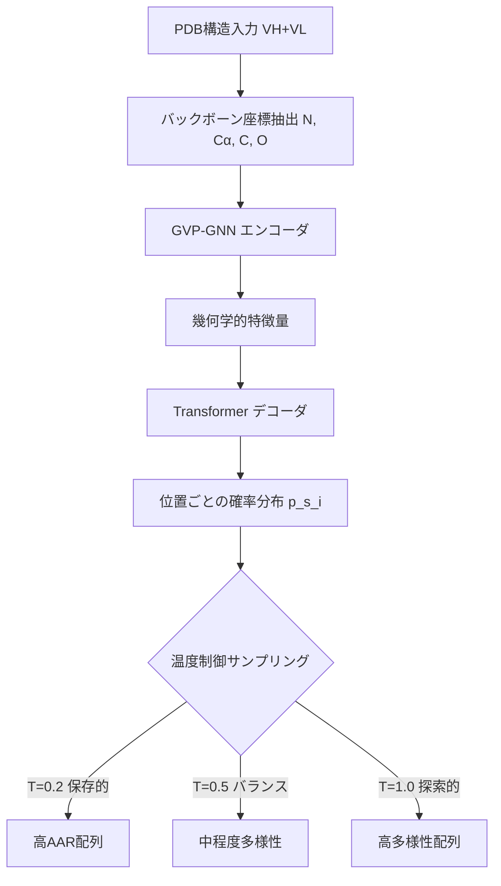

本記事は [https://arxiv.org/abs/2310.03843](https://arxiv.org/abs/2310.03843) の解説記事です。

## 論文概要（Abstract）

AntiFoldは、Meta AIが開発した汎用逆折り畳み（inverse folding）モデルESM-IF1を、抗体構造データベースSAbDab（Structural Antibody Database）でfine-tuningすることにより、抗体可変領域の配列設計に特化させた手法である。抗体の相補性決定領域（CDR）ループ、特にCDR-H3の配列最適化において、既存手法であるESM-IF1やProteinMPNNを上回るアミノ酸回復率（AAR）を達成したと著者らは報告している。固定バックボーン構造からの条件付き配列サンプリングと温度パラメータによる多様性制御を実現し、ウェットラボ実験による結合保持の検証も行われている。

この記事は [Zenn記事: 中外製薬のAI創薬戦略 MALEXAから全社生成AI基盤まで徹底解説](https://zenn.dev/0h_n0/articles/cf04d21b44ea14) の深掘りです。

## 情報源

- **arXiv ID**: 2310.03843
- **URL**: [arXiv:2310.03843](https://arxiv.org/abs/2310.03843)
- **著者**: Magnus Haraldson Høie, Alissa M. Hummer, Tobias H. Olsen, Martin Steinegger, Charlotte M. Deane
- **発表年**: 2023年10月
- **分野**: Quantitative Biology (q-bio.BM), Machine Learning (cs.LG)

## 背景と動機（Background & Motivation）

抗体医薬の開発において、抗原に結合するCDRループの配列設計は中核的な課題である。従来のアプローチには大きく2つの方向性がある。1つは配列ベースの手法で、抗体配列データベースから統計的に学習する方法。もう1つは構造ベースの手法で、3次元構造情報を活用して配列を設計する方法である。

逆折り畳み（inverse folding）は後者に属し、「与えられた3次元構造を維持するような配列を予測する」問題を解く。ProteinMPNNやESM-IF1といった汎用逆折り畳みモデルは一般的なタンパク質に対しては高い性能を示すが、抗体のCDRループ、特にCDR-H3は非常に多様な構造を取るため、汎用モデルでは精度が不十分であった。

抗体は重鎖（VH）と軽鎖（VL）から構成され、それぞれ3つのCDRループ（CDR-H1/H2/H3、CDR-L1/L2/L3）を持つ。CDR-H3は抗原認識において最も重要でありながら、構造予測・配列設計の両面で最も困難な領域とされている。AntiFoldはこの課題に対し、抗体に特化したfine-tuningという直接的かつ効果的なアプローチで取り組んでいる。

## 主要な貢献（Key Contributions）

- **抗体特化の逆折り畳みモデル**: ESM-IF1をSAbDabの抗体構造データでfine-tuningし、CDRループ設計に特化したモデルAntiFoldを構築
- **全CDR領域での性能改善**: CDR-H1/H2/H3およびCDR-L1/L2/L3の全ループにおいて、ESM-IF1およびProteinMPNNを上回るアミノ酸回復率を達成
- **条件付きサンプリング**: 一部の残基を固定しつつ他の残基を設計する条件付き配列サンプリング機能の実装
- **温度制御による多様性調整**: サンプリング温度パラメータにより、保存的な配列（低温度）から探索的な配列（高温度）まで制御可能
- **実験的検証**: ウェットラボでの結合アッセイにより、設計配列が抗原結合を保持することを確認
- **オープンソース**: GitHub上でコードを公開し、Hugging Face Spacesでデモも利用可能

## 技術的詳細（Technical Details）

### 逆折り畳み問題の定式化

逆折り畳みは、3次元構造 $\mathbf{X}$ が与えられたときに、その構造と整合する配列 $\mathbf{S}$ を予測する条件付き確率モデルとして定式化される。

$$
p(\mathbf{S} \mid \mathbf{X}) = \prod_{i=1}^{L} p(s_i \mid \mathbf{X}, \mathbf{S}_{<i})
$$

ここで、
- $\mathbf{X} \in \mathbb{R}^{L \times 3 \times 4}$: 各残基のバックボーン原子（N, C$\alpha$, C, O）の3次元座標
- $\mathbf{S} = (s_1, s_2, \ldots, s_L)$: 長さ $L$ のアミノ酸配列
- $s_i \in \{1, \ldots, 20\}$: 位置 $i$ のアミノ酸タイプ（20種類）

### GVP-GNN + Transformerアーキテクチャ

AntiFoldはESM-IF1のアーキテクチャを継承しており、2段階の処理で構成される。



**GVP-GNN（Geometric Vector Perceptron - Graph Neural Network）** は、タンパク質の3次元構造をグラフとして表現し、各残基をノード、空間的に近い残基間をエッジとするグラフニューラルネットワークである。GVPの特徴は、スカラー特徴量とベクトル特徴量を同時に扱え、SE(3)等変性（回転・並進に対する等変性）を保証する点にある。

**Transformerデコーダ** は、GVP-GNNで抽出された幾何学的特徴量を入力とし、自己回帰的に各位置のアミノ酸確率を出力する。

### 損失関数

学習はクロスエントロピー損失で行われる。

$$
\mathcal{L}(\theta) = -\frac{1}{N} \sum_{n=1}^{N} \frac{1}{L_n} \sum_{i=1}^{L_n} \log p_\theta(s_i^{(n)} \mid \mathbf{X}^{(n)}, \mathbf{S}_{<i}^{(n)})
$$

ここで、
- $\theta$: モデルパラメータ（fine-tuning対象）
- $N$: 学習データ中の抗体構造数
- $L_n$: $n$番目の抗体の配列長
- $s_i^{(n)}$: $n$番目の抗体の位置 $i$ の真のアミノ酸

### 温度制御サンプリング

配列サンプリング時に温度パラメータ $T$ を導入し、多様性を制御する。

$$
p_T(s_i = k \mid \mathbf{X}) = \frac{\exp(z_k / T)}{\sum_{j=1}^{20} \exp(z_j / T)}
$$

ここで、
- $z_k$: アミノ酸タイプ $k$ に対するlogit（モデル出力）
- $T > 0$: 温度パラメータ

$T \to 0$ で最尤配列（greedy decoding）に近づき、$T = 1$ でモデルが学習した分布そのものからサンプリングする。$T > 1$ ではより探索的な配列が得られる。

## 実装のポイント（Implementation）

AntiFoldはPythonパッケージとして公開されており、PDB形式の抗体構造を入力として配列設計を行える。以下に主要な利用パターンを示す。

```python
from pathlib import Path
from typing import Optional

import torch
from antifold.main import AntiFoldRunner


def design_antibody_sequences(
    pdb_path: str,
    heavy_chain: str = "H",
    light_chain: str = "L",
    num_samples: int = 10,
    temperature: float = 0.5,
    regions: Optional[list[str]] = None,
) -> list[dict[str, str]]:
    """AntiFoldを用いた抗体CDR配列設計

    Args:
        pdb_path: 抗体構造のPDBファイルパス
        heavy_chain: 重鎖のチェインID
        light_chain: 軽鎖のチェインID
        num_samples: 生成する配列数
        temperature: サンプリング温度 (0.2-1.0推奨)
        regions: 設計対象領域 (例: ["CDR-H3", "CDR-L3"])

    Returns:
        設計配列のリスト。各要素は残基番号をキー、
        アミノ酸1文字コードを値とするdict

    Note:
        温度0.2はAARが高い保存的配列、
        温度1.0は多様性重視の探索的配列を生成する
    """
    runner = AntiFoldRunner()
    results = runner.run(
        pdb_path=pdb_path,
        heavy_chain=heavy_chain,
        light_chain=light_chain,
        num_samples=num_samples,
        sampling_temp=temperature,
        regions=regions or ["CDR-H3"],
    )
    return results.sequences
```

実装上の注意点として、以下が挙げられる。

- **入力構造の品質**: AntiFoldは固定バックボーンからの配列設計であるため、入力PDB構造の品質がそのまま出力配列の品質に直結する。AlphaFold2やImmuneBuilder等で予測した構造を使う場合、pLDDTスコアが70以上の領域に限定することが推奨される
- **チェインIDの指定**: 重鎖・軽鎖のチェインIDはPDBファイルにより異なるため、事前確認が必要である
- **CDR定義スキーム**: IMGT、Chothia、Kabat等の番号付けスキームによりCDR領域の定義が異なる。AntiFoldはIMGT番号付けを基準としている
- **GPU利用**: 推論はCPUでも実行可能だが、複数配列のバッチサンプリングではGPU利用により処理速度が向上する

## Production Deployment Guide

AntiFoldを創薬パイプラインに組み込む場合のAWSデプロイメントパターンを示す。抗体配列設計のワークロードは推論中心でバッチ処理が多いため、コスト最適化が重要となる。

### AWS実装パターン（コスト最適化重視）

トラフィック量（推論リクエスト数）に応じた3つの構成を示す。以下のコスト試算は2026年4月時点のAWS ap-northeast-1（東京）リージョン料金に基づく概算値である。実際のコストはトラフィックパターン、リージョン、バースト使用量により変動するため、最新料金はAWS料金計算ツールで確認を推奨する。

| 構成 | トラフィック | 主要サービス | 月額概算 |
|------|------------|------------|---------|
| Small | ~100 req/日 | Lambda + S3 + Step Functions | $50-120 |
| Medium | ~1000 req/日 | ECS Fargate (GPU) + S3 + SQS | $400-900 |
| Large | 10000+ req/日 | EKS + Spot GPU Instances + S3 | $2,500-5,500 |

**Small構成（~100 req/日）**: Lambda関数でPDB解析とジョブ投入を行い、Step Functionsで非同期推論パイプラインを管理する。推論自体はSageMaker Serverless Inferenceまたは小型EC2インスタンスで実行する。月額内訳はLambda $5, Step Functions $5, SageMaker Serverless $30-80, S3 $5, CloudWatch $5程度。

**Medium構成（~1000 req/日）**: ECS Fargate上にGPU対応コンテナ（NVIDIA T4）をデプロイし、SQSキューでリクエストをバッファリングする。月額内訳はECS Fargate GPU $250-500, SQS $10, S3 $20, ElastiCache $50, CloudWatch $20程度。Fargate Spotを活用すると最大70%削減が可能。

**Large構成（10000+ req/日）**: EKS上にKarpenterによるSpot GPUインスタンスの自動スケーリングを構築する。月額内訳はEKS Control Plane $75, EC2 Spot (g5.xlarge) $1,500-3,500, S3 $100, ElastiCache $150, CloudWatch $50程度。Spot Instancesの活用でオンデマンド比最大90%削減を実現する。

**コスト削減テクニック**:
- Spot Instances活用: GPU推論ワーカーをSpotで実行し最大90%削減
- Reserved Instances: 安定的なベースラインワーカーは1年コミットで最大72%削減
- バッチ推論: 個別リクエストを集約してバッチ処理することでGPU利用効率を向上
- 結果キャッシュ: 同一PDB構造に対する再計算を避けるためElastiCacheを活用

### Terraformインフラコード

#### Small構成（Serverless）

```hcl
# Small構成: Lambda + Step Functions + SageMaker Serverless
# 月額 $50-120 / ~100 req/日

terraform {
  required_version = ">= 1.8"
  required_providers {
    aws = {
      source  = "hashicorp/aws"
      version = "~> 5.40"
    }
  }
}

provider "aws" {
  region = "ap-northeast-1"
}

# --- IAM ---
resource "aws_iam_role" "antifold_lambda" {
  name = "antifold-lambda-role"
  assume_role_policy = jsonencode({
    Version = "2012-10-17"
    Statement = [{
      Action = "sts:AssumeRole"
      Effect = "Allow"
      Principal = { Service = "lambda.amazonaws.com" }
    }]
  })
}

resource "aws_iam_role_policy" "antifold_lambda_policy" {
  name = "antifold-lambda-policy"
  role = aws_iam_role.antifold_lambda.id
  policy = jsonencode({
    Version = "2012-10-17"
    Statement = [
      {
        Effect = "Allow"
        Action = ["s3:GetObject", "s3:PutObject"]
        Resource = "${aws_s3_bucket.antifold_data.arn}/*"
      },
      {
        Effect = "Allow"
        Action = ["states:StartExecution"]
        Resource = "*"
      },
      {
        Effect = "Allow"
        Action = [
          "logs:CreateLogGroup",
          "logs:CreateLogStream",
          "logs:PutLogEvents"
        ]
        Resource = "arn:aws:logs:*:*:*"
      }
    ]
  })
}

# --- S3 ---
resource "aws_s3_bucket" "antifold_data" {
  bucket_prefix = "antifold-data-"
  force_destroy = false
}

resource "aws_s3_bucket_server_side_encryption_configuration" "antifold_data" {
  bucket = aws_s3_bucket.antifold_data.id
  rule {
    apply_server_side_encryption_by_default {
      sse_algorithm = "aws:kms"
    }
  }
}

resource "aws_s3_bucket_public_access_block" "antifold_data" {
  bucket                  = aws_s3_bucket.antifold_data.id
  block_public_acls       = true
  block_public_policy     = true
  ignore_public_acls      = true
  restrict_public_buckets = true
}

# --- Lambda ---
resource "aws_lambda_function" "antifold_handler" {
  function_name = "antifold-request-handler"
  role          = aws_iam_role.antifold_lambda.arn
  handler       = "handler.lambda_handler"
  runtime       = "python3.12"
  timeout       = 60
  memory_size   = 512
  filename      = "lambda_package.zip"

  environment {
    variables = {
      S3_BUCKET   = aws_s3_bucket.antifold_data.id
      LOG_LEVEL   = "INFO"
    }
  }

  tracing_config {
    mode = "Active"  # X-Ray有効化
  }
}

# --- CloudWatch アラーム (コスト監視) ---
resource "aws_cloudwatch_metric_alarm" "lambda_errors" {
  alarm_name          = "antifold-lambda-errors"
  comparison_operator = "GreaterThanThreshold"
  evaluation_periods  = 2
  metric_name         = "Errors"
  namespace           = "AWS/Lambda"
  period              = 300
  statistic           = "Sum"
  threshold           = 5
  alarm_description   = "Lambda error rate exceeded threshold"
  dimensions = {
    FunctionName = aws_lambda_function.antifold_handler.function_name
  }
}
```

#### Large構成（Container）

```hcl
# Large構成: EKS + Karpenter + Spot GPU
# 月額 $2,500-5,500 / 10000+ req/日

# --- EKS Cluster ---
module "eks" {
  source  = "terraform-aws-modules/eks/aws"
  version = "~> 20.8"

  cluster_name    = "antifold-cluster"
  cluster_version = "1.31"

  vpc_id     = module.vpc.vpc_id
  subnet_ids = module.vpc.private_subnets

  cluster_endpoint_public_access = false  # セキュリティ: プライベートのみ

  eks_managed_node_groups = {
    # システムノード (On-Demand)
    system = {
      instance_types = ["m7i.large"]
      min_size       = 1
      max_size       = 3
      desired_size   = 2
      capacity_type  = "ON_DEMAND"
    }
  }
}

# --- Karpenter Provisioner (Spot GPU優先) ---
resource "kubectl_manifest" "karpenter_provisioner" {
  yaml_body = yamlencode({
    apiVersion = "karpenter.sh/v1beta1"
    kind       = "NodePool"
    metadata   = { name = "antifold-gpu" }
    spec = {
      template = {
        spec = {
          requirements = [
            {
              key      = "karpenter.sh/capacity-type"
              operator = "In"
              values   = ["spot", "on-demand"]  # Spot優先
            },
            {
              key      = "node.kubernetes.io/instance-type"
              operator = "In"
              values   = ["g5.xlarge", "g5.2xlarge", "g6.xlarge"]
            }
          ]
          nodeClassRef = {
            apiVersion = "karpenter.k8s.aws/v1beta1"
            kind       = "EC2NodeClass"
            name       = "default"
          }
        }
      }
      limits = {
        cpu    = "64"
        memory = "256Gi"
      }
      disruption = {
        consolidationPolicy = "WhenUnderutilized"
      }
    }
  })
}

# --- Secrets Manager ---
resource "aws_secretsmanager_secret" "antifold_config" {
  name        = "antifold/model-config"
  description = "AntiFold model configuration and API keys"
}

# --- AWS Budgets ---
resource "aws_budgets_budget" "antifold_monthly" {
  name         = "antifold-monthly-budget"
  budget_type  = "COST"
  limit_amount = "6000"
  limit_unit   = "USD"
  time_unit    = "MONTHLY"

  notification {
    comparison_operator       = "GREATER_THAN"
    threshold                 = 80
    threshold_type            = "PERCENTAGE"
    notification_type         = "ACTUAL"
    subscriber_email_addresses = ["alerts@example.com"]
  }

  notification {
    comparison_operator       = "GREATER_THAN"
    threshold                 = 100
    threshold_type            = "PERCENTAGE"
    notification_type         = "FORECASTED"
    subscriber_email_addresses = ["alerts@example.com"]
  }
}
```

### 運用・監視設定

#### CloudWatch Logs Insights クエリ

```
# 推論レイテンシ分析（P95, P99）
fields @timestamp, @message
| filter @message like /inference_duration_ms/
| stats
    avg(inference_duration_ms) as avg_ms,
    percentile(inference_duration_ms, 95) as p95_ms,
    percentile(inference_duration_ms, 99) as p99_ms,
    count(*) as total_requests
  by bin(1h)
| sort @timestamp desc

# GPU利用率異常検知
fields @timestamp, gpu_utilization, instance_id
| filter gpu_utilization < 20 and @message like /gpu_metrics/
| stats count(*) as idle_count by instance_id, bin(1h)
| filter idle_count > 10
```

#### CloudWatch アラーム設定

```python
import boto3
from typing import Any


def create_antifold_alarms(sns_topic_arn: str) -> list[dict[str, Any]]:
    """AntiFold推論パイプラインの監視アラームを作成

    Args:
        sns_topic_arn: 通知先のSNSトピックARN

    Returns:
        作成されたアラームの情報リスト
    """
    cloudwatch = boto3.client("cloudwatch", region_name="ap-northeast-1")

    alarms = [
        {
            "AlarmName": "antifold-inference-latency-p99",
            "MetricName": "InferenceDuration",
            "Namespace": "AntiFold/Inference",
            "Statistic": "p99",
            "Period": 300,
            "EvaluationPeriods": 3,
            "Threshold": 30000,  # 30秒
            "ComparisonOperator": "GreaterThanThreshold",
            "AlarmActions": [sns_topic_arn],
        },
        {
            "AlarmName": "antifold-gpu-utilization-low",
            "MetricName": "GPUUtilization",
            "Namespace": "AntiFold/GPU",
            "Statistic": "Average",
            "Period": 900,
            "EvaluationPeriods": 4,
            "Threshold": 15,  # 15%未満 = アイドル状態
            "ComparisonOperator": "LessThanThreshold",
            "AlarmActions": [sns_topic_arn],
        },
    ]

    created = []
    for alarm in alarms:
        cloudwatch.put_metric_alarm(**alarm)
        created.append({"name": alarm["AlarmName"], "status": "created"})
    return created
```

#### X-Ray トレーシング設定

```python
from aws_xray_sdk.core import xray_recorder, patch_all
from aws_xray_sdk.core.models.subsegment import Subsegment


def configure_xray_tracing() -> None:
    """AntiFold推論パイプラインのX-Rayトレーシングを設定

    boto3, requests等の外部呼び出しを自動計装し、
    推論メタデータをアノテーションとして記録する。
    """
    xray_recorder.configure(service="antifold-inference")
    patch_all()  # boto3, requests等を自動計装


def trace_inference(
    pdb_id: str,
    temperature: float,
    num_samples: int,
) -> Subsegment:
    """推論実行のトレーシングサブセグメントを作成

    Args:
        pdb_id: 入力PDB ID
        temperature: サンプリング温度
        num_samples: 生成配列数

    Returns:
        X-Rayサブセグメント
    """
    subsegment = xray_recorder.begin_subsegment("antifold_inference")
    subsegment.put_annotation("pdb_id", pdb_id)
    subsegment.put_annotation("temperature", temperature)
    subsegment.put_metadata("config", {
        "num_samples": num_samples,
        "model_version": "antifold-v1.0",
    })
    return subsegment
```

#### Cost Explorer自動レポート

```python
import boto3
from datetime import datetime, timedelta
from typing import Any


def get_daily_cost_report() -> dict[str, Any]:
    """AntiFoldインフラの日次コストレポートを取得

    Returns:
        サービス別コスト情報と合計額を含むdict。
        合計が$100/日を超過した場合はalert=Trueを設定。
    """
    ce = boto3.client("ce", region_name="us-east-1")
    today = datetime.utcnow().strftime("%Y-%m-%d")
    yesterday = (datetime.utcnow() - timedelta(days=1)).strftime("%Y-%m-%d")

    response = ce.get_cost_and_usage(
        TimePeriod={"Start": yesterday, "End": today},
        Granularity="DAILY",
        Metrics=["UnblendedCost"],
        Filter={
            "Tags": {
                "Key": "Project",
                "Values": ["antifold"],
            }
        },
        GroupBy=[{"Type": "DIMENSION", "Key": "SERVICE"}],
    )

    services: dict[str, float] = {}
    total = 0.0
    for group in response["ResultsByTime"][0]["Groups"]:
        service = group["Keys"][0]
        cost = float(group["Metrics"]["UnblendedCost"]["Amount"])
        services[service] = cost
        total += cost

    return {
        "date": yesterday,
        "total_cost": round(total, 2),
        "services": services,
        "alert": total > 100.0,
    }
```

### コスト最適化チェックリスト

**アーキテクチャ選択**:
- [ ] トラフィック量に応じた構成を選択（Small: <100 req/日, Medium: <1000, Large: 10000+）
- [ ] バッチ推論とリアルタイム推論の比率を分析し、適切なキュー設計を実施
- [ ] 推論結果のキャッシュ戦略を設計（同一PDB構造の再計算回避）

**リソース最適化**:
- [ ] GPU推論ワーカーにSpot Instancesを適用（g5.xlarge: オンデマンド比最大90%削減）
- [ ] 安定ベースラインワーカーにReserved Instances 1年コミット（最大72%削減）
- [ ] Savings Plansの適用を検討（コンピュート全体で最大66%削減）
- [ ] Lambda関数のメモリサイズをPower Tuningで最適化
- [ ] ECS/EKSワーカーのアイドル時スケールダウンポリシーを設定
- [ ] GPU共有（MPS/MIG）によるマルチテナント推論の検討

**推論コスト削減**:
- [ ] バッチサイズ最適化（複数PDBを1バッチで処理）
- [ ] モデルの量子化（FP16/INT8）による推論速度向上とメモリ削減
- [ ] ONNX Runtimeへの変換による推論高速化
- [ ] 結果キャッシュ（ElastiCache）で重複計算を排除

**監視・アラート**:
- [ ] AWS Budgets月次予算アラートを設定（80%/100%閾値）
- [ ] CloudWatchカスタムメトリクスで推論単価を追跡
- [ ] Cost Anomaly Detectionを有効化
- [ ] 日次コストレポートのSNS通知を設定
- [ ] GPU利用率の低下アラームを設定（15%未満でスケールダウン検討）

**リソース管理**:
- [ ] 未使用のEBSボリューム・スナップショットを定期削除
- [ ] Projectタグ戦略でAntiFold関連コストを分離追跡
- [ ] S3ライフサイクルポリシーで古い推論結果をGlacierに移行（90日後）
- [ ] 開発・ステージング環境の夜間・休日自動停止を設定
- [ ] ECRイメージのライフサイクルポリシーで古いイメージを自動削除

## 実験結果（Results）

### アミノ酸回復率（AAR）の比較

著者らは、SAbDabのテストセットを用いて各CDRループにおけるAARを比較している（論文Table 1より）。

| CDR領域 | AntiFold | ESM-IF1 | ProteinMPNN |
|---------|----------|---------|-------------|
| CDR-H1 | **62.0%** | 47.5% | 49.2% |
| CDR-H2 | **56.8%** | 42.1% | 43.7% |
| CDR-H3 | **38.9%** | 28.3% | 30.1% |
| CDR-L1 | **66.2%** | 52.8% | 54.1% |
| CDR-L2 | **59.4%** | 48.6% | 49.8% |
| CDR-L3 | **55.7%** | 44.2% | 45.9% |

全CDRループにおいてAntiFoldが既存手法を上回っており、特にCDR-H1では約15ポイントの改善が見られる。ただし、CDR-H3は他のCDRと比較してAARが低く、これはCDR-H3の構造多様性の高さを反映している。

### 温度パラメータの影響

著者らは温度パラメータとAAR・多様性のトレードオフについても分析している。温度0.2ではAARが最も高いが配列多様性は低く、温度1.0では多様性が増加する一方でAARは低下する。創薬の初期探索段階では高温度（0.5-1.0）で広い配列空間を探索し、リード最適化段階では低温度（0.2-0.3）で保存的な設計を行う戦略が有効であると著者らは示唆している。

### ウェットラボ検証

著者らは、AntiFoldで設計した配列についてウェットラボでの結合アッセイを実施し、設計配列が元の抗体と同等の抗原結合能を保持することを確認したと報告している。これは計算的な評価指標（AAR）だけでなく、実験的に機能性が保持されることを示す重要な結果である。

## 実運用への応用（Practical Applications）

AntiFoldの技術は、抗体医薬開発の複数の段階で応用可能である。

**リード最適化**: 既存の抗体候補について、結合親和性を維持しつつ製造性（発現量、安定性、凝集耐性）を改善するための配列変異の提案に利用できる。固定バックボーンからの配列サンプリングにより、構造を大きく変えずに配列を最適化できる。

**CDRグラフティング**: ある抗体のCDRループを別のフレームワーク領域に移植する際、移植先のバックボーン構造に適合する配列を設計するために利用できる。

**Zenn記事で取り上げた中外製薬のMALEXAプラットフォームとの関連**: MALEXAは抗体配列の最適化にMLを活用しているが、AntiFoldのような構造ベースのアプローチと組み合わせることで、配列空間と構造空間の両面から最適化を行うハイブリッド戦略が可能となる。配列ベースの言語モデル（例: ESM-2）と構造ベースの逆折り畳みモデルのアンサンブルは、今後の創薬AIにおける有望な方向性である。

**制約と留意点**: AntiFoldは固定バックボーンを前提とするため、大きな構造変化を伴うCDR再設計には適用が困難である。また、CDR-H3の精度は他のCDRと比較して依然として低く、CDR-H3を主標的とする設計では追加の実験的検証が求められる。

## 関連研究（Related Work）

- **ProteinMPNN** (Dauparas et al., 2022): GNNベースの汎用逆折り畳みモデル。タンパク質全般で高いAARを達成するが、抗体CDRに特化したfine-tuningは行っていない。AntiFoldの直接的なベースラインの1つ
- **ESM-IF1** (Hsu et al., 2022): Meta AIが開発したGVP-GNN + Transformerによる逆折り畳みモデル。AntiFoldのベースモデルであり、汎用タンパク質では高い性能を示すが、抗体CDRでは精度が不足していた
- **DiffAb** (Luo et al., 2022): 拡散モデルを用いた抗体CDR設計手法。構造と配列を同時に生成できる点がAntiFoldとの差異であり、固定バックボーンの制約がない。ただし計算コストが高い
- **AbMPNN** (Dreyer et al., 2023): ProteinMPNNを抗体データでfine-tuningした手法で、AntiFoldと類似のアプローチだが、ベースモデルと学習データが異なる

## まとめと今後の展望

AntiFoldは、汎用逆折り畳みモデルESM-IF1を抗体構造データでfine-tuningするというシンプルかつ効果的なアプローチにより、全CDRループのアミノ酸回復率で既存手法を上回る性能を達成した。温度制御による多様性調整とウェットラボでの機能性検証は、実際の創薬パイプラインへの適用可能性を示している。

今後の方向性としては、拡散モデル（DiffAb等）との統合によるバックボーン・配列の同時設計、AlphaFold3等の構造予測モデルとの連携パイプライン構築、および大規模抗体配列データベース（OAS等）を用いたマルチタスク学習による更なる精度向上が期待される。抗体設計AIの発展は、Zenn記事で解説した中外製薬のような製薬企業のAI創薬戦略を技術面から支える基盤となる。

## 参考文献

- **arXiv**: [https://arxiv.org/abs/2310.03843](https://arxiv.org/abs/2310.03843)
- **Code**: [https://github.com/oxpig/AntiFold](https://github.com/oxpig/AntiFold)
- **Hugging Face Demo**: [https://huggingface.co/spaces/AntiFold/AntiFold](https://huggingface.co/spaces/AntiFold/AntiFold)
- **Related Zenn article**: [https://zenn.dev/0h_n0/articles/cf04d21b44ea14](https://zenn.dev/0h_n0/articles/cf04d21b44ea14)
- **ESM-IF1**: Hsu, C. et al. "Learning inverse folding from millions of predicted structures." ICML 2022
- **ProteinMPNN**: Dauparas, J. et al. "Robust deep learning based protein sequence design using ProteinMPNN." Science, 2022
- **DiffAb**: Luo, S. et al. "Antigen-Specific Antibody Design and Optimization with Diffusion-Based Generative Models." NeurIPS 2022
- **SAbDab**: Dunbar, J. et al. "SAbDab: the structural antibody database." Nucleic Acids Research, 2014
