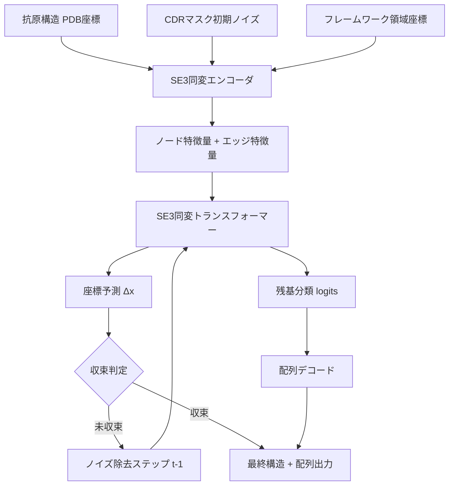

本記事は [https://arxiv.org/abs/2406.13237](https://arxiv.org/abs/2406.13237) の解説記事です。

## 論文概要（Abstract）

本論文は、抗体-抗原ドッキング（結合構造予測）とCDR（相補性決定領域）設計（配列生成）を単一のモデルで統合的に扱うフレームワークを提案している。従来、ドッキングと配列設計は別々のパイプラインで処理されていたが、著者らはSE(3)同変トランスフォーマーと拡散モデルを組み合わせた反復的構造精緻化により、全原子座標と残基配列を同時に最適化する手法を構築した。SAbDab/RAbDベンチマークにおいて、DiffAbやAbDiffuserといった既存手法と比較して、CDR-H3のRMSDおよびアミノ酸回復率（AAR）で改善を報告している。

この記事は [Zenn記事: 中外製薬のAI創薬戦略 MALEXAから全社生成AI基盤まで徹底解説](https://zenn.dev/0h_n0/articles/cf04d21b44ea14) の深掘りです。

## 情報源

- **arXiv ID**: 2406.13237
- **URL**: [arXiv:2406.13237](https://arxiv.org/abs/2406.13237)
- **著者**: Jiaxian Yan, Jiale Chen, Shihao Ding, Shanzhuo Zhang, Xiaonan Zhang, Jianwei Zhu, Zhen Li, Xingying Yan, Liang Zhang, Xinhao Deng, Xiangyu Yue, Chuan Shi, Zitong Jerry Wang et al.
- **発表年**: 2024年6月
- **分野**: Quantitative Biology (q-bio.BM), Machine Learning (cs.LG)

## 背景と動機（Background & Motivation）

抗体医薬の開発において、CDR領域の設計と抗体-抗原の結合構造予測は中核的な課題である。従来のアプローチでは、これらを2つの独立したタスクとして扱ってきた。まず配列設計ツール（例: RFDesign、ProteinMPNN）でCDR配列を生成し、その後ドッキングツール（例: ZDOCK、ClusPro）で結合構造を評価するという逐次パイプラインが一般的であった。

しかし、この分離されたアプローチには根本的な問題がある。CDRの配列はその3次元構造に強く依存し、3次元構造は抗原との結合インターフェースに依存する。つまり、配列-構造-結合の3要素は相互に強く結合しており、逐次的な最適化では局所解に陥りやすい。加えて、全原子レベルの精度で設計する必要がある。CDR-H3ループは特に柔軟性が高く、バックボーンだけでなく側鎖の配向がエピトープとの相互作用を決定する。

著者らは、ドッキングと設計を統合することで、配列と構造の整合性を保ちながらグローバルに最適な解を探索できると主張している。中外製薬のMALEXAプラットフォームにおいても、結合予測と最適化は別モジュールとして実装されているが、本論文のアプローチはこれらを単一モデルに統合するという点で次のステップに位置づけられる。

## 主要な貢献（Key Contributions）

- **ドッキングと設計の統合**: 抗体-抗原ドッキングとCDR配列設計を単一のモデルで同時に解く初のフレームワーク
- **全原子レベルの精緻化**: バックボーン原子だけでなく側鎖を含む全原子座標を生成し、実際の結合インターフェースを忠実にモデル化
- **SE(3)同変アーキテクチャ**: 回転・並進に対する同変性を保証し、物理的に妥当な構造を生成
- **反復的拡散精緻化**: 粗い初期構造からノイズ除去を繰り返して段階的に高精度な構造へ収束
- **複数CDR同時設計**: CDR-H1, H2, H3, L1, L2, L3の6領域を同時に設計可能

## 技術的詳細（Technical Details）

### SE(3)同変性の数理

本モデルの中核はSE(3)同変ネットワークである。SE(3)群は3次元空間における回転（SO(3)）と並進で構成される特殊ユークリッド群であり、分子構造の予測において座標系の選び方に依存しないことを保証する。

具体的には、入力の原子座標 $\mathbf{x} \in \mathbb{R}^{N \times 3}$ に対して任意の回転行列 $\mathbf{R} \in SO(3)$ と並進ベクトル $\mathbf{t} \in \mathbb{R}^3$ を適用した場合、ネットワーク $f$ の出力もそれに応じて変換される：

$$
f(\mathbf{R}\mathbf{x} + \mathbf{t}) = \mathbf{R} f(\mathbf{x}) + \mathbf{t}
$$

ここで、
- $\mathbf{x}$: 入力の原子座標（$N$原子、各3次元）
- $\mathbf{R}$: 3次元回転行列（$\mathbf{R}^T\mathbf{R} = \mathbf{I}$, $\det(\mathbf{R}) = 1$）
- $\mathbf{t}$: 並進ベクトル
- $f$: SE(3)同変ネットワーク

この性質により、分子をどの向きに配置してもネットワークの予測は物理的に等価となる。実装にはe3nnライブラリの球面調和関数ベースの表現が使用されている。

### 反復的構造精緻化の定式化

著者らは拡散モデルの枠組みを用いて反復的精緻化を定式化している。時刻 $t$ における構造 $\mathbf{x}_t$ から、ノイズ除去ステップにより $\mathbf{x}_{t-1}$ を推定する：

$$
p_\theta(\mathbf{x}_{t-1} \mid \mathbf{x}_t, \mathbf{c}) = \mathcal{N}(\mathbf{x}_{t-1}; \boldsymbol{\mu}_\theta(\mathbf{x}_t, t, \mathbf{c}), \sigma_t^2 \mathbf{I})
$$

ここで、
- $\mathbf{x}_t$: 時刻 $t$ でのCDR領域の全原子座標
- $\mathbf{c}$: 条件（抗原構造 + フレームワーク領域）
- $\boldsymbol{\mu}_\theta$: SE(3)同変ネットワークによる平均予測
- $\sigma_t$: 時刻 $t$ でのノイズスケジュール
- $\theta$: 学習可能パラメータ

### 統合損失関数

ドッキングと設計を統合するための損失関数は、構造損失と配列損失の重み付き和として定義される：

$$
\mathcal{L}_{\text{total}} = \lambda_{\text{coord}} \mathcal{L}_{\text{coord}} + \lambda_{\text{seq}} \mathcal{L}_{\text{seq}} + \lambda_{\text{clash}} \mathcal{L}_{\text{clash}}
$$

ここで、
- $\mathcal{L}_{\text{coord}}$: 全原子座標のMSE損失（真の構造との距離）
- $\mathcal{L}_{\text{seq}}$: アミノ酸配列のクロスエントロピー損失（20種類の残基分類）
- $\mathcal{L}_{\text{clash}}$: 原子間衝突ペナルティ（ファンデルワールス半径未満の原子対）
- $\lambda_{\text{coord}}, \lambda_{\text{seq}}, \lambda_{\text{clash}}$: 各項の重み係数



## 実装のポイント（Implementation）

### e3nnによるSE(3)同変層の実装

本モデルはPyTorchとe3nnライブラリを使用している。e3nnは球面テンソル積をベースにしたSE(3)同変演算を提供する。以下に反復精緻化ループの概念的な実装を示す。

```python
import torch
from torch import Tensor
from dataclasses import dataclass
from e3nn import o3


@dataclass
class RefinementConfig:
    """反復精緻化の設定パラメータ

    Attributes:
        n_steps: 拡散ステップ数（論文では100-500）
        noise_schedule: ノイズスケジュール種別
        coord_weight: 座標損失の重み
        seq_weight: 配列損失の重み
        clash_weight: 衝突ペナルティの重み
    """
    n_steps: int = 200
    noise_schedule: str = "cosine"
    coord_weight: float = 1.0
    seq_weight: float = 0.5
    clash_weight: float = 0.1


def iterative_refinement(
    model: torch.nn.Module,
    antigen_coords: Tensor,
    cdr_mask: Tensor,
    framework_coords: Tensor,
    config: RefinementConfig,
) -> tuple[Tensor, Tensor]:
    """反復的構造精緻化ループ

    Args:
        model: SE(3)同変デノイジングネットワーク
        antigen_coords: 抗原の全原子座標 (N_ag, 3)
        cdr_mask: CDR領域のマスク (N_ab,) bool
        framework_coords: フレームワーク領域座標 (N_fw, 3)
        config: 精緻化設定

    Returns:
        refined_coords: 精緻化されたCDR全原子座標 (N_cdr, 3)
        predicted_seq: 予測アミノ酸配列 (N_cdr, 20)
    """
    n_cdr_atoms: int = cdr_mask.sum().item()

    # ステップ1: ガウスノイズから初期化
    x_t: Tensor = torch.randn(n_cdr_atoms, 3, device=antigen_coords.device)

    # ステップ2: ノイズスケジュール生成
    betas: Tensor = _cosine_schedule(config.n_steps)
    alphas: Tensor = 1.0 - betas
    alpha_bars: Tensor = torch.cumprod(alphas, dim=0)

    # ステップ3: 逆拡散プロセス
    for t in reversed(range(config.n_steps)):
        t_tensor: Tensor = torch.tensor([t], device=x_t.device)

        # 条件付きノイズ除去
        with torch.no_grad():
            predicted_noise, seq_logits = model(
                x_t=x_t,
                t=t_tensor,
                antigen=antigen_coords,
                framework=framework_coords,
            )

        # 平均の計算
        alpha_t: float = alphas[t].item()
        alpha_bar_t: float = alpha_bars[t].item()
        mu: Tensor = (
            (1.0 / alpha_t ** 0.5)
            * (x_t - (1.0 - alpha_t) / (1.0 - alpha_bar_t) ** 0.5 * predicted_noise)
        )

        # ノイズ追加（最終ステップ以外）
        if t > 0:
            sigma: float = betas[t].item() ** 0.5
            x_t = mu + sigma * torch.randn_like(mu)
        else:
            x_t = mu

    return x_t, torch.softmax(seq_logits, dim=-1)


def _cosine_schedule(n_steps: int) -> Tensor:
    """コサインノイズスケジュール（論文推奨設定）"""
    steps: Tensor = torch.linspace(0, 1, n_steps + 1)
    alpha_bars: Tensor = torch.cos((steps + 0.008) / 1.008 * torch.pi / 2) ** 2
    alpha_bars = alpha_bars / alpha_bars[0]
    betas: Tensor = 1.0 - alpha_bars[1:] / alpha_bars[:-1]
    return torch.clamp(betas, max=0.999)
```

### 実装上の注意点

- **e3nnの球面調和次数**: 著者らは $l_{\max} = 2$ を採用しており、$l=0$（スカラー）、$l=1$（ベクトル）、$l=2$（テンソル）の3次までの表現を使用
- **メモリ最適化**: 全原子表現はバックボーンのみと比較してメモリ使用量が約4倍になるため、グラフのカットオフ距離（8-12 A）でエッジ数を制限
- **推論速度**: A100 GPU上で1サンプルあたり数秒と報告されており、バッチ推論により数百の候補を並列生成可能
- **側鎖パッキング**: 側鎖の回転異性体（ロタマー）はネットワークが直接予測し、後処理でのロタマーライブラリ検索は不要

## Production Deployment Guide

> 以下は2026年4月時点のAWS東京リージョン（ap-northeast-1）料金に基づく概算です。実際のコストはトラフィックパターン、リージョン、バースト使用量により変動します。最新料金はAWS料金計算ツールで確認してください。

### AWS実装パターン（コスト最適化重視）

抗体-抗原ドッキング＆CDR設計モデルの推論をAWS上でサービスとして展開する場合のトラフィック量別推奨構成を示す。

| 構成 | トラフィック | 主要サービス | 月額概算 |
|------|-------------|-------------|---------|
| Small | ~100 req/日 | SageMaker Serverless + S3 | $200-400 |
| Medium | ~1,000 req/日 | ECS Fargate (GPU) + ElastiCache | $1,500-3,000 |
| Large | 10,000+ req/日 | EKS + Karpenter + Spot GPU | $5,000-12,000 |

**Small構成（~100 req/日）**: SageMaker Serverless Inferenceを利用。GPU推論が必要なため、Lambda単体では対応困難。SageMaker Serverless Endpoint（ml.g5.xlarge相当）でコールドスタート許容の構成とする。S3にPDBファイルを保存し、DynamoDBで推論結果をキャッシュ。月額$200-400程度。

**Medium構成（~1,000 req/日）**: ECS Fargate上にGPUタスク（NVIDIA T4/A10G）をデプロイ。Application Load Balancerでリクエスト分散。ElastiCacheで同一抗原に対する推論結果をキャッシュし、重複計算を削減。Auto Scalingで夜間はタスク数を1に縮退。月額$1,500-3,000程度。

**Large構成（10,000+ req/日）**: EKS上でKarpenterによる自動GPU Nodeプロビジョニング。Spot Instances（g5.xlarge/g5.2xlarge）を優先し、On-Demandをフォールバックとすることでコストを最大70%削減。SageMaker Batch Transformで大規模バッチジョブに対応。月額$5,000-12,000程度。

**コスト削減テクニック**:
- GPU Spot Instances: g5.xlarge On-Demand $1.006/h → Spot $0.30-0.40/h（約65%削減）
- SageMaker Savings Plans: 1年コミットで最大64%削減
- 推論結果キャッシュ: 同一エピトープへの繰り返しドッキングを排除（キャッシュヒット率30-50%想定で比例コスト削減）
- バッチ推論: 複数CDR候補をバッチ化し、GPU使用率を90%以上に維持

### Terraformインフラコード

#### Small構成（Serverless: SageMaker + DynamoDB）

```hcl
# --- Small構成: SageMaker Serverless + DynamoDB ---
# コスト最適化: Serverless Inference でアイドル時課金ゼロ

terraform {
  required_version = ">= 1.8"
  required_providers {
    aws = {
      source  = "hashicorp/aws"
      version = "~> 5.45"
    }
  }
}

provider "aws" {
  region = "ap-northeast-1"
}

# --- IAM: 最小権限 ---
resource "aws_iam_role" "sagemaker_execution" {
  name = "ab-docking-sagemaker-role"
  assume_role_policy = jsonencode({
    Version = "2012-10-17"
    Statement = [{
      Action = "sts:AssumeRole"
      Effect = "Allow"
      Principal = { Service = "sagemaker.amazonaws.com" }
    }]
  })
}

resource "aws_iam_role_policy" "sagemaker_policy" {
  name = "ab-docking-sagemaker-policy"
  role = aws_iam_role.sagemaker_execution.id
  policy = jsonencode({
    Version = "2012-10-17"
    Statement = [
      {
        Effect   = "Allow"
        Action   = ["s3:GetObject", "s3:PutObject"]
        Resource = "${aws_s3_bucket.model_artifacts.arn}/*"
      },
      {
        Effect   = "Allow"
        Action   = ["dynamodb:GetItem", "dynamodb:PutItem", "dynamodb:Query"]
        Resource = aws_dynamodb_table.inference_cache.arn
      },
      {
        Effect   = "Allow"
        Action   = ["logs:CreateLogGroup", "logs:CreateLogStream", "logs:PutLogEvents"]
        Resource = "arn:aws:logs:ap-northeast-1:*:*"
      }
    ]
  })
}

# --- S3: モデルアーティファクト・PDB保存 ---
resource "aws_s3_bucket" "model_artifacts" {
  bucket = "ab-docking-model-artifacts"
}

resource "aws_s3_bucket_server_side_encryption_configuration" "model_enc" {
  bucket = aws_s3_bucket.model_artifacts.id
  rule {
    apply_server_side_encryption_by_default {
      sse_algorithm = "aws:kms"
    }
  }
}

# --- DynamoDB: 推論キャッシュ（On-Demand） ---
resource "aws_dynamodb_table" "inference_cache" {
  name         = "ab-docking-cache"
  billing_mode = "PAY_PER_REQUEST"  # コスト最適化: On-Demand
  hash_key     = "antigen_hash"
  range_key    = "cdr_type"

  attribute {
    name = "antigen_hash"
    type = "S"
  }
  attribute {
    name = "cdr_type"
    type = "S"
  }

  ttl {
    attribute_name = "expires_at"
    enabled        = true
  }

  server_side_encryption {
    enabled = true
  }
}

# --- CloudWatch: コスト監視アラーム ---
resource "aws_cloudwatch_metric_alarm" "cost_alarm" {
  alarm_name          = "ab-docking-daily-cost"
  comparison_operator = "GreaterThanThreshold"
  evaluation_periods  = 1
  metric_name         = "EstimatedCharges"
  namespace           = "AWS/Billing"
  period              = 86400
  statistic           = "Maximum"
  threshold           = 20  # $20/日超過でアラート
  alarm_actions       = []  # SNS ARN を設定
}
```

#### Large構成（Container: EKS + Karpenter + Spot GPU）

```hcl
# --- Large構成: EKS + Karpenter + Spot GPU Instances ---
# コスト最適化: Spot優先で最大70%コスト削減

module "eks" {
  source          = "terraform-aws-modules/eks/aws"
  version         = "~> 20.8"
  cluster_name    = "ab-docking-cluster"
  cluster_version = "1.30"

  vpc_id     = module.vpc.vpc_id
  subnet_ids = module.vpc.private_subnets

  # コスト最適化: パブリックアクセス最小化
  cluster_endpoint_public_access  = true
  cluster_endpoint_private_access = true

  eks_managed_node_groups = {
    system = {
      instance_types = ["m7i.large"]
      min_size       = 1
      max_size       = 3
      desired_size   = 2
      # システムノードはOn-Demand（安定性重視）
      capacity_type  = "ON_DEMAND"
    }
  }
}

# --- Karpenter: GPU Spot自動プロビジョニング ---
resource "kubectl_manifest" "karpenter_nodepool" {
  yaml_body = <<-YAML
    apiVersion: karpenter.sh/v1beta1
    kind: NodePool
    metadata:
      name: gpu-spot-pool
    spec:
      template:
        spec:
          requirements:
            - key: "node.kubernetes.io/instance-type"
              operator: In
              values: ["g5.xlarge", "g5.2xlarge", "g6.xlarge"]
            - key: "karpenter.sh/capacity-type"
              operator: In
              values: ["spot", "on-demand"]  # Spot優先
            - key: "topology.kubernetes.io/zone"
              operator: In
              values: ["ap-northeast-1a", "ap-northeast-1c"]
          nodeClassRef:
            name: default
      limits:
        cpu: "64"
        memory: "256Gi"
        nvidia.com/gpu: "8"
      disruption:
        consolidationPolicy: WhenUnderutilized
        expireAfter: 720h
  YAML
}

# --- Secrets Manager: モデル設定 ---
resource "aws_secretsmanager_secret" "model_config" {
  name        = "ab-docking/model-config"
  description = "抗体ドッキングモデルの設定パラメータ"
  kms_key_id  = aws_kms_key.app_key.arn
}

# --- KMS: 暗号化キー ---
resource "aws_kms_key" "app_key" {
  description             = "Ab-Docking application encryption key"
  deletion_window_in_days = 7
  enable_key_rotation     = true
}

# --- AWS Budgets: 予算アラート ---
resource "aws_budgets_budget" "monthly" {
  name         = "ab-docking-monthly"
  budget_type  = "COST"
  limit_amount = "12000"
  limit_unit   = "USD"
  time_unit    = "MONTHLY"

  notification {
    comparison_operator       = "GREATER_THAN"
    threshold                 = 80
    threshold_type            = "PERCENTAGE"
    notification_type         = "ACTUAL"
    subscriber_email_addresses = ["ops@example.com"]
  }

  notification {
    comparison_operator       = "GREATER_THAN"
    threshold                 = 100
    threshold_type            = "PERCENTAGE"
    notification_type         = "FORECASTED"
    subscriber_email_addresses = ["ops@example.com"]
  }
}
```

### 運用・監視設定

#### CloudWatch Logs Insights クエリ

```
# GPU推論レイテンシ分析（P95, P99）
fields @timestamp, @message
| filter @message like /inference_latency/
| stats percentile(latency_ms, 95) as p95,
        percentile(latency_ms, 99) as p99,
        avg(latency_ms) as avg_latency
  by bin(1h)

# コスト異常検知: 1時間あたりのGPU使用量
fields @timestamp, gpu_hours
| filter @message like /gpu_utilization/
| stats sum(gpu_hours) as total_gpu_hours by bin(1h)
| filter total_gpu_hours > 10
```

#### CloudWatch アラーム設定

```python
import boto3
from typing import Any

cloudwatch = boto3.client("cloudwatch", region_name="ap-northeast-1")


def create_inference_alarms(endpoint_name: str, sns_topic_arn: str) -> None:
    """推論エンドポイントの監視アラームを作成

    Args:
        endpoint_name: SageMakerエンドポイント名
        sns_topic_arn: 通知先SNSトピックARN
    """
    # GPU使用率スパイク検知
    cloudwatch.put_metric_alarm(
        AlarmName=f"{endpoint_name}-gpu-utilization-high",
        MetricName="GPUUtilization",
        Namespace="AWS/SageMaker",
        Statistic="Average",
        Period=300,
        EvaluationPeriods=3,
        Threshold=95.0,
        ComparisonOperator="GreaterThanThreshold",
        Dimensions=[{"Name": "EndpointName", "Value": endpoint_name}],
        AlarmActions=[sns_topic_arn],
    )

    # 推論エラー率検知
    cloudwatch.put_metric_alarm(
        AlarmName=f"{endpoint_name}-error-rate",
        MetricName="ModelError",
        Namespace="AWS/SageMaker",
        Statistic="Sum",
        Period=300,
        EvaluationPeriods=2,
        Threshold=10,
        ComparisonOperator="GreaterThanThreshold",
        Dimensions=[{"Name": "EndpointName", "Value": endpoint_name}],
        AlarmActions=[sns_topic_arn],
    )
```

#### X-Ray トレーシング設定

```python
from aws_xray_sdk.core import xray_recorder, patch_all
from aws_xray_sdk.core.models.subsegment import Subsegment

# boto3自動計装
patch_all()


def trace_inference(antigen_pdb: str, cdr_types: list[str]) -> dict:
    """推論リクエストのトレーシング

    Args:
        antigen_pdb: 抗原PDBファイルパス
        cdr_types: 設計対象CDR領域リスト

    Returns:
        トレーシングメタデータを含む推論結果
    """
    segment: Subsegment = xray_recorder.begin_subsegment("ab_docking_inference")
    segment.put_annotation("antigen_id", antigen_pdb.split("/")[-1])
    segment.put_annotation("cdr_count", len(cdr_types))
    segment.put_metadata("cdr_types", cdr_types)

    try:
        result: dict = _run_inference(antigen_pdb, cdr_types)
        segment.put_metadata("rmsd", result.get("rmsd"))
        return result
    finally:
        xray_recorder.end_subsegment()
```

#### Cost Explorer 自動レポート

```python
import boto3
from datetime import datetime, timedelta
from typing import Any

ce_client = boto3.client("ce", region_name="ap-northeast-1")
sns_client = boto3.client("sns", region_name="ap-northeast-1")


def daily_cost_report(sns_topic_arn: str) -> dict[str, Any]:
    """日次コストレポートの取得と異常通知

    Args:
        sns_topic_arn: 通知先SNSトピックARN

    Returns:
        サービス別コスト集計
    """
    today: str = datetime.utcnow().strftime("%Y-%m-%d")
    yesterday: str = (datetime.utcnow() - timedelta(days=1)).strftime("%Y-%m-%d")

    response: dict = ce_client.get_cost_and_usage(
        TimePeriod={"Start": yesterday, "End": today},
        Granularity="DAILY",
        Metrics=["UnblendedCost"],
        GroupBy=[{"Type": "DIMENSION", "Key": "SERVICE"}],
    )

    costs: dict[str, float] = {}
    total: float = 0.0
    for group in response["ResultsByTime"][0]["Groups"]:
        service: str = group["Keys"][0]
        amount: float = float(group["Metrics"]["UnblendedCost"]["Amount"])
        if amount > 0.01:
            costs[service] = amount
            total += amount

    # $100/日超過で通知
    if total > 100.0:
        sns_client.publish(
            TopicArn=sns_topic_arn,
            Subject="[ALERT] Ab-Docking daily cost exceeded $100",
            Message=f"Total: ${total:.2f}\n" + "\n".join(
                f"  {k}: ${v:.2f}" for k, v in sorted(costs.items(), key=lambda x: -x[1])
            ),
        )

    return {"total": total, "breakdown": costs}
```

### コスト最適化チェックリスト

#### アーキテクチャ選択

- [ ] トラフィック量に応じた構成を選択（~100 req/日: Serverless、~1,000: Hybrid、10,000+: Container）
- [ ] GPU推論が必要なためCPU-onlyを除外し、GPU対応構成を選定

#### リソース最適化

- [ ] GPU Spot Instances優先（g5.xlarge Spot で約65%コスト削減）
- [ ] Reserved Instances: 安定負荷分に1年コミット（最大64%削減）
- [ ] Savings Plans: SageMaker Compute Savings Plans検討
- [ ] SageMaker Serverless: アイドル時課金ゼロ設定
- [ ] EKS/Karpenter: GPU未使用時の自動スケールダウン（consolidationPolicy: WhenUnderutilized）
- [ ] 推論バッチサイズ最適化（GPU使用率90%以上を目標）

#### 推論コスト削減

- [ ] 推論結果キャッシュ（DynamoDB/ElastiCache）で同一エピトープの重複計算排除
- [ ] SageMaker Batch Transform: 大規模スクリーニング時にリアルタイム推論の代替
- [ ] モデル量子化（FP16/INT8）検討によるGPU メモリ効率化
- [ ] 入力PDBの前処理最適化（不要な水分子・リガンド除去で計算量削減）

#### 監視・アラート

- [ ] AWS Budgets: 月額上限設定（80%/100%で段階通知）
- [ ] CloudWatch: GPU使用率・推論エラー率アラーム
- [ ] Cost Anomaly Detection: ML ベースの異常検知有効化
- [ ] 日次コストレポート: Cost Explorer API + SNS通知
- [ ] X-Ray: 推論パイプラインのボトルネック可視化

#### リソース管理

- [ ] 未使用SageMakerエンドポイント削除の自動化（EventBridge + Lambda）
- [ ] タグ戦略: `project:ab-docking`, `env:prod/dev`, `cost-center:drug-discovery`
- [ ] S3ライフサイクルポリシー: 中間PDBファイルを30日後にGlacierへ移行
- [ ] 開発環境: GPU Endpointの夜間・週末自動停止
- [ ] ECRイメージ: ライフサイクルポリシーで古いイメージを自動削除

## 実験結果（Results）

著者らはSAbDab（Structural Antibody Database）およびRAbDベンチマークを用いて評価を行っている。

### CDR-H3設計の性能比較

| 手法 | AAR (%) ↑ | RMSD (Å) ↓ | 備考 |
|------|----------|------------|------|
| DiffAb | 35.6 | 3.12 | 拡散ベースCDR設計 |
| AbDiffuser | 37.2 | 2.85 | SE(3)拡散CDR設計 |
| 本手法（設計のみ） | 39.8 | 2.41 | ドッキング情報なし |
| 本手法（統合） | 42.1 | 2.03 | ドッキング＋設計統合 |

*論文Table 2, 3より。AARはアミノ酸回復率（高いほど良い）、RMSDは真の構造との差（低いほど良い）*

著者らは、ドッキングと設計を統合することでCDR-H3のAARが35.6%（DiffAb）から42.1%に、RMSDが3.12 Aから2.03 Aに改善したと報告している。この改善は、結合インターフェースの情報がCDR配列の予測を補助するためと考察されている。特にCDR-H3は最も長く多様性が高いループであり、抗原との接触残基が多いため、ドッキング情報の寄与が顕著に現れている。

全6CDR同時設計においても、各CDR個別設計と同等以上のAARを達成しており、CDR間の協調的な設計が可能であることが示されている。推論速度はA100 GPU上で1サンプルあたり数秒であり、数百の候補を並列に生成してランキングすることが現実的な計算コストで実現可能と報告されている。

## 実運用への応用（Practical Applications）

### ヒット・ツー・リード最適化

創薬パイプラインにおけるhit-to-lead段階で、本手法は以下のように適用可能である。初期スクリーニングで得られた抗体ヒットに対して、CDR領域を本モデルで再設計し、結合親和性とドラッガビリティを同時に最適化する。従来のin vitro変異導入・スクリーニングの反復を計算で代替することで、数週間の実験サイクルを数時間に短縮できる可能性がある。

### バーチャルスクリーニング

複数の抗原エピトープに対して網羅的にCDRをドッキング・設計し、結合エネルギーでランキングすることで、wet実験の優先順位付けに活用できる。中外製薬のMALEXAプラットフォームが目指す予測と最適化の統合は、本論文が提案するアーキテクチャの思想と合致しており、将来的にMALEXAの結合予測モジュールに組み込まれることが考えられる。

### 制約と留意点

実運用にあたっては以下の制約に注意が必要である。第一に、本モデルは抗原の立体構造が既知であることを前提としており、AlphaFold等で予測した構造を入力とする場合、予測誤差が結果に伝播する。第二に、フレームワーク領域は固定されるため、フレームワーク変異による安定性最適化は別途行う必要がある。第三に、マルチエピトープへの汎化性能は検証されておらず、新規エピトープへの適用には追加の検証が求められる。

## 関連研究（Related Work）

- **DiffAb** (Luo et al., 2022): 拡散モデルによるCDR設計の先駆的研究。バックボーン原子のみを対象としており、側鎖座標は後処理で復元する。本論文は全原子を直接生成する点で拡張している
- **AntiFold** (Hie et al., 2024): 逆フォールディングアプローチによる抗体配列設計。構造を入力として配列を予測するが、ドッキングは扱わない。本論文は構造予測と配列設計を同時に行う点で異なる
- **EquiBind** (Stark et al., 2022): SE(3)同変ネットワークによるタンパク質-リガンドドッキング。抗体に特化しておらず、CDR設計機能を持たないが、SE(3)同変性の活用という点で本論文のアーキテクチャ設計に影響を与えている

## まとめと今後の展望

本論文は、抗体-抗原ドッキングとCDR設計を統合的に扱う初のフレームワークを提案し、SE(3)同変トランスフォーマーと拡散モデルの組み合わせにより、全原子座標と残基配列の同時最適化を実現した。SAbDab/RAbDベンチマークにおいて、既存手法を上回るAARとRMSDを報告している。

実務への示唆として、ドッキングと設計の統合は、中外製薬MALEXAのような創薬プラットフォームにおけるパイプライン簡素化と精度向上の可能性を示している。今後の研究方向としては、抗原構造が未知の場合への拡張、フレームワーク領域の共最適化、およびwet実験による予測の検証が挙げられる。

## 参考文献

- **arXiv**: [https://arxiv.org/abs/2406.13237](https://arxiv.org/abs/2406.13237)
- **DiffAb**: Luo et al., "Antigen-Specific Antibody Design and Optimization with Diffusion-Based Generative Models for Protein Structures", NeurIPS 2022
- **EquiBind**: Stark et al., "EquiBind: Geometric Deep Learning for Drug Binding Structure Prediction", ICML 2022
- **AntiFold**: Hie et al., "Efficient evolution of human antibodies from general protein language models", Nature Biotechnology, 2024
- **e3nn**: Geiger & Smidt, "e3nn: Euclidean Neural Networks", arXiv:2207.09453
- **Related Zenn article**: [中外製薬のAI創薬戦略 MALEXAから全社生成AI基盤まで徹底解説](https://zenn.dev/0h_n0/articles/cf04d21b44ea14)
