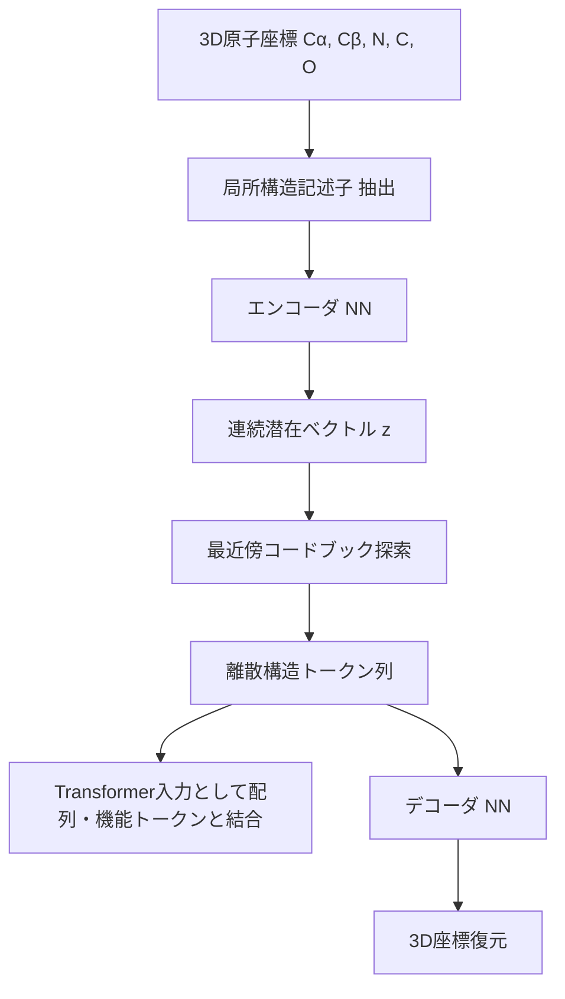

本記事は [https://arxiv.org/abs/2407.11596](https://arxiv.org/abs/2407.11596) の解説記事です。

## 論文概要（Abstract）

ESM3はEvolutionaryScale社が開発した98Bパラメータのマルチモーダルタンパク質基盤モデルである。アミノ酸配列、3D構造（VQ-VAEトークン化）、機能アノテーション（Gene Ontologyおよびキーワード）の3つのモダリティを単一のマスク生成Transformerで統合的に扱う。著者らは、任意のモダリティの条件付き生成が可能であることを示し、天然GFPと58%の配列同一性しか持たない新規蛍光タンパク質eSM-GFPのデノボ設計と実験的検証に成功したと報告している。

この記事は [Zenn記事: 中外製薬のAI創薬戦略 MALEXAから全社生成AI基盤まで徹底解説](https://zenn.dev/0h_n0/articles/cf04d21b44ea14) の深掘りです。

## 情報源

- **arXiv ID**: 2407.11596
- **URL**: [arXiv:2407.11596](https://arxiv.org/abs/2407.11596)
- **著者**: Thomas Hayes, Roshan Rao, Halil Akin, et al.（EvolutionaryScale）
- **発表年**: 2024年7月
- **分野**: Quantitative Biology (q-bio.BM), Machine Learning (cs.LG)

## 背景と動機（Background & Motivation）

タンパク質言語モデルの系譜は、ESM-1b（2020年、650Mパラメータ）からESM-2（2022年、15Bパラメータ）へと進化し、配列のマスク言語モデリングによる表現学習が変異効果予測やコンタクトマップ推定に有効であることが示されてきた。ESMFold（2022年）はESM-2の表現をAlphaFold2由来のStructure Moduleに入力することで、MSAを用いずに単一配列から高精度な構造予測を達成した。

しかし、これらのモデルはいずれも単一モダリティ（配列のみ、または配列から構造への一方向予測）に限定されていた。タンパク質の機能は配列・構造・機能アノテーションの3つが相互に制約し合うことで決定されるが、これらを統一的に扱う基盤モデルは存在しなかった。

ESM3はこの課題に対し、3つのモダリティをすべてトークン列として表現し、単一のマスク生成Transformerで統合学習を行うアプローチを提案している。著者らは、このアーキテクチャにより「任意のモダリティの部分的な指定から残りを生成する」というタンパク質設計にとって理想的な条件付き生成が可能になると主張している。

## 主要な貢献（Key Contributions）

- **マルチモーダル統合**: 配列・構造・機能の3モダリティを単一のTransformerで統合。任意のモダリティの組み合わせを条件として他のモダリティを生成可能
- **VQ-VAEによる構造トークン化**: 3D原子座標を離散トークンに変換するVQ-VAE（Vector Quantized Variational Autoencoder）を開発。これにより構造情報をTransformerの入力として直接扱える
- **eSM-GFPの設計と実験検証**: 天然のGFP（緑色蛍光タンパク質）と58%の配列同一性しか持たない新規蛍光タンパク質をデノボ設計し、実験的に蛍光活性を確認。著者らはこれを「5億年の進化に相当するシミュレーション」と位置付けている
- **スケーリング則の検証**: 1.4Bから98Bパラメータまでモデルサイズを変化させ、構造予測精度や変異効果予測性能がパラメータ数に対して対数線形的に改善することを示した

## 技術的詳細（Technical Details）

### マスク生成学習の目的関数

ESM3の学習目的関数は、入力トークン列の一部をマスクし、残りから復元するマスク言語モデリング（MLM）の拡張である。3つのモダリティ $\mathbf{x} = (\mathbf{x}^{\text{seq}}, \mathbf{x}^{\text{struct}}, \mathbf{x}^{\text{func}})$ に対し、各位置のトークンを独立にマスク確率 $p_{\text{mask}}$ でマスクする。学習目的関数は以下の通り：

$$
\mathcal{L}(\theta) = - \mathbb{E}_{\mathbf{x} \sim \mathcal{D}} \left[ \sum_{i \in \mathcal{M}} \log p_\theta(x_i \mid \mathbf{x}_{\setminus \mathcal{M}}) \right]
$$

ここで、

- $\mathcal{D}$: 学習データセット（UniRef90/UniRef50、ESMAtlas構造、Gene Ontologyアノテーション）
- $\mathcal{M}$: マスクされた位置の集合
- $\mathbf{x}_{\setminus \mathcal{M}}$: マスクされていない位置のトークン
- $\theta$: モデルパラメータ（98Bパラメータ）

自己回帰モデルと異なり、マスク生成モデルは任意の位置を任意の順序で生成できるため、「配列の一部と構造の一部を指定して、残りの配列と機能を生成する」といった柔軟な条件付き生成が可能となる。

### VQ-VAEによる構造トークン化

3D構造をTransformerで扱うため、ESM3はVQ-VAE（Vector Quantized Variational Autoencoder）を用いて原子座標を離散トークンに変換する。



エンコーダは各残基の局所環境（バックボーン原子Cα, Cβ, N, C, Oの相対座標）を入力として連続潜在ベクトル $\mathbf{z}_i$ を出力する。量子化は以下の式で行う：

$$
\hat{\mathbf{z}}_i = \arg\min_{\mathbf{e}_k \in \mathcal{C}} \| \mathbf{z}_i - \mathbf{e}_k \|_2
$$

ここで、

- $\mathbf{z}_i$: 残基 $i$ のエンコーダ出力（連続ベクトル）
- $\mathcal{C} = \{\mathbf{e}_1, \dots, \mathbf{e}_K\}$: コードブック（$K$ 個のプロトタイプベクトル）
- $\hat{\mathbf{z}}_i$: 量子化された離散トークンに対応するベクトル

この離散化により、構造情報を配列トークンや機能トークンと同一の表現空間で扱うことが可能となる。コードブックサイズ $K = 4096$ が使用されており、著者らはこのサイズでバックボーン構造の再構成精度がCα RMSDで約1Å以下に収まると報告している。

### 機能トークン化

機能アノテーションはGene Ontology（GO）用語とInterProキーワードから構成される。各タンパク質に付与されたGO用語のDAG（有向非巡回グラフ）構造を線形化し、トークン列として表現する。これにより、「この酵素は加水分解酵素である」といった機能情報を配列・構造と同列に条件付き生成の入力として使用できる。

## 実装のポイント（Implementation）

ESM3のオープンモデル（esm3-sm-open-v1、7Bパラメータ）はHuggingFace経由で利用可能である。推論には約24GBのVRAMが必要で、NVIDIA A10G以上のGPUが推奨される。

```python
from esm.models.esm3 import ESM3
from esm.sdk.api import (
    ESMProtein,
    GenerationConfig,
    SamplingConfig,
)


def compute_sequence_log_likelihood(
    sequence: str,
    model_name: str = "esm3-sm-open-v1",
) -> float:
    """ESM3を用いてタンパク質配列の対数尤度を計算する。

    Args:
        sequence: アミノ酸配列（1文字表記、例: "MKTV..."）
        model_name: 使用するモデル名

    Returns:
        配列全体の平均対数尤度（負値、0に近いほど高尤度）
    """
    model = ESM3.from_pretrained(model_name)
    protein = ESMProtein(sequence=sequence)

    # マスクなしで各位置の予測確率を取得
    log_likelihood = model.log_likelihood(protein)

    return float(log_likelihood.mean())


def generate_protein_from_structure(
    structure_tokens: list[int],
    num_steps: int = 8,
    temperature: float = 0.7,
) -> str:
    """構造トークンを条件として配列を生成する。

    Args:
        structure_tokens: VQ-VAEで符号化された構造トークン列
        num_steps: 反復的デコーディングのステップ数
        temperature: サンプリング温度（低いほど確定的）

    Returns:
        生成されたアミノ酸配列
    """
    model = ESM3.from_pretrained("esm3-sm-open-v1")
    protein = ESMProtein(structure=structure_tokens)

    config = GenerationConfig(
        track="sequence",
        num_steps=num_steps,
        sampling=SamplingConfig(temperature=temperature),
    )
    generated = model.generate(protein, config)

    return generated.sequence
```

注意点として、ESM3のオープンモデルは **Cambrian Non-Commercial License** の下で公開されており、商用利用には別途EvolutionaryScale社との契約が必要である。研究・教育目的での利用は無償だが、商用プロダクトへの組み込みにはライセンス制約があることを十分に確認する必要がある。

## Production Deployment Guide（2026年4月時点）

ESM3を推論APIとしてAWS上にデプロイするパターンを解説する。7Bモデル（esm3-sm-open-v1）は約24GB VRAMを要求するため、GPUインスタンスが必須となる。以下のコスト試算は2026年4月時点のAWS ap-northeast-1（東京）リージョンの料金に基づく概算値であり、実際のコストはトラフィックパターンやリージョンにより変動する。

### AWS実装パターン（コスト最適化重視）

**トラフィック量別の推奨構成**:

| 構成 | トラフィック | インフラ | 月額概算 |
|------|-------------|---------|---------|
| Small | ~100 req/日 | EC2 g5.2xlarge Spot + ALB | $300-500 |
| Medium | ~1,000 req/日 | ECS Fargate GPU + ALB + ElastiCache | $1,500-2,500 |
| Large | 10,000+ req/日 | EKS + Karpenter GPU Spot + Redis Cluster | $5,000-10,000 |

**Small構成の内訳（~100 req/日）**:

- EC2 g5.2xlarge Spot Instance: ~$250/月（On-Demand $858/月の約70%割引）
- ALB: ~$20/月
- S3（モデルウェイト保存）: ~$5/月
- CloudWatch: ~$10/月

タンパク質配列の推論は1リクエストあたり数秒かかるため、Lambdaのタイムアウト制約（15分）内に収まるが、GPUが必要なためLambda単体では対応できない。Spot Instanceの中断に備えてモデルウェイトをS3にキャッシュし、起動時間を短縮する。

**Large構成の内訳（10,000+ req/日）**:

- EKS コントロールプレーン: ~$75/月
- g5.2xlarge Spot Instances（3-5台）: ~$750-1,250/月
- g5.2xlarge On-Demand（1台、ベースライン）: ~$858/月
- ALB + NAT Gateway: ~$100/月
- ElastiCache（推論結果キャッシュ）: ~$200/月
- CloudWatch + X-Ray: ~$50/月

**コスト削減テクニック**:

- Spot Instancesで最大70%削減（g5シリーズの中断頻度は比較的低い）
- Reserved Instances（1年コミット）でOn-Demand比42%削減
- 推論結果のElastiCacheキャッシュで同一配列の再計算を回避
- バッチ推論を夜間のSpot Instancesで実行し、リアルタイム推論との分離

### Terraformインフラコード

**Small構成（GPU Spot Instance）**:

```hcl
# --- Small構成: EC2 GPU Spot + ALB ---

terraform {
  required_version = ">= 1.8"
  required_providers {
    aws = {
      source  = "hashicorp/aws"
      version = "~> 5.40"
    }
  }
}

provider "aws" {
  region = "ap-northeast-1"
}

# VPC基盤
module "vpc" {
  source  = "terraform-aws-modules/vpc/aws"
  version = "~> 5.5"

  name = "esm3-inference-vpc"
  cidr = "10.0.0.0/16"

  azs             = ["ap-northeast-1a", "ap-northeast-1c"]
  public_subnets  = ["10.0.1.0/24", "10.0.2.0/24"]
  private_subnets = ["10.0.10.0/24", "10.0.20.0/24"]

  enable_nat_gateway = true
  single_nat_gateway = true  # コスト削減: NAT Gateway 1台
}

# IAMロール（最小権限）
resource "aws_iam_role" "esm3_instance" {
  name = "esm3-inference-role"

  assume_role_policy = jsonencode({
    Version = "2012-10-17"
    Statement = [{
      Action = "sts:AssumeRole"
      Effect = "Allow"
      Principal = { Service = "ec2.amazonaws.com" }
    }]
  })
}

resource "aws_iam_role_policy" "s3_model_access" {
  name = "s3-model-weights-read"
  role = aws_iam_role.esm3_instance.id

  policy = jsonencode({
    Version = "2012-10-17"
    Statement = [{
      Effect   = "Allow"
      Action   = ["s3:GetObject", "s3:ListBucket"]
      Resource = [
        aws_s3_bucket.model_weights.arn,
        "${aws_s3_bucket.model_weights.arn}/*"
      ]
    }]
  })
}

# S3バケット（モデルウェイト保存、KMS暗号化）
resource "aws_s3_bucket" "model_weights" {
  bucket = "esm3-model-weights-${data.aws_caller_identity.current.account_id}"
}

resource "aws_s3_bucket_server_side_encryption_configuration" "model_weights" {
  bucket = aws_s3_bucket.model_weights.id
  rule {
    apply_server_side_encryption_by_default {
      sse_algorithm = "aws:kms"
    }
  }
}

data "aws_caller_identity" "current" {}

# Spot Instanceリクエスト（g5.2xlarge, 24GB VRAM）
resource "aws_spot_instance_request" "esm3_gpu" {
  ami                    = data.aws_ami.deep_learning.id
  instance_type          = "g5.2xlarge"  # A10G 24GB VRAM
  spot_price             = "0.40"        # On-Demand $1.212/hr の約33%
  wait_for_fulfillment   = true
  spot_type              = "persistent"
  subnet_id              = module.vpc.private_subnets[0]
  iam_instance_profile   = aws_iam_instance_profile.esm3.name
  vpc_security_group_ids = [aws_security_group.esm3.id]

  root_block_device {
    volume_size = 100  # モデルウェイト + 作業領域
    volume_type = "gp3"
    encrypted   = true
  }

  tags = {
    Name    = "esm3-inference-spot"
    Project = "esm3-protein-inference"
  }
}

data "aws_ami" "deep_learning" {
  most_recent = true
  owners      = ["amazon"]
  filter {
    name   = "name"
    values = ["Deep Learning AMI GPU PyTorch *-Ubuntu 22.04-*"]
  }
}

resource "aws_iam_instance_profile" "esm3" {
  name = "esm3-instance-profile"
  role = aws_iam_role.esm3_instance.name
}

# セキュリティグループ
resource "aws_security_group" "esm3" {
  name_prefix = "esm3-inference-"
  vpc_id      = module.vpc.vpc_id

  ingress {
    from_port       = 8080
    to_port         = 8080
    protocol        = "tcp"
    security_groups = [aws_security_group.alb.id]
  }

  egress {
    from_port   = 0
    to_port     = 0
    protocol    = "-1"
    cidr_blocks = ["0.0.0.0/0"]
  }
}

# ALB
resource "aws_security_group" "alb" {
  name_prefix = "esm3-alb-"
  vpc_id      = module.vpc.vpc_id

  ingress {
    from_port   = 443
    to_port     = 443
    protocol    = "tcp"
    cidr_blocks = ["0.0.0.0/0"]
  }

  egress {
    from_port   = 0
    to_port     = 0
    protocol    = "-1"
    cidr_blocks = ["0.0.0.0/0"]
  }
}

# CloudWatchアラーム（GPU使用率）
resource "aws_cloudwatch_metric_alarm" "gpu_utilization" {
  alarm_name          = "esm3-gpu-utilization-high"
  comparison_operator = "GreaterThanThreshold"
  evaluation_periods  = 3
  metric_name         = "GPUUtilization"
  namespace           = "Custom/ESM3"
  period              = 300
  statistic           = "Average"
  threshold           = 90
  alarm_description   = "GPU utilization > 90% for 15min"
}
```

**Large構成（EKS + Karpenter + GPU Spot）**:

```hcl
# --- Large構成: EKS + Karpenter GPU Spot ---

module "eks" {
  source  = "terraform-aws-modules/eks/aws"
  version = "~> 20.8"

  cluster_name    = "esm3-inference-cluster"
  cluster_version = "1.30"

  vpc_id     = module.vpc.vpc_id
  subnet_ids = module.vpc.private_subnets

  cluster_endpoint_public_access = false  # セキュリティ: プライベートのみ

  eks_managed_node_groups = {
    system = {
      instance_types = ["m6i.large"]
      min_size       = 2
      max_size       = 3
      desired_size   = 2
      labels         = { role = "system" }
    }
  }
}

# Karpenter NodePool（GPU Spot優先）
resource "kubectl_manifest" "karpenter_nodepool" {
  yaml_body = yamlencode({
    apiVersion = "karpenter.sh/v1"
    kind       = "NodePool"
    metadata   = { name = "gpu-inference" }
    spec = {
      template = {
        spec = {
          requirements = [
            { key = "node.kubernetes.io/instance-type", operator = "In",
              values = ["g5.2xlarge", "g5.4xlarge"] },
            { key = "karpenter.sh/capacity-type", operator = "In",
              values = ["spot", "on-demand"] },
            { key = "topology.kubernetes.io/zone", operator = "In",
              values = ["ap-northeast-1a", "ap-northeast-1c"] },
          ]
          nodeClassRef = {
            apiVersion = "karpenter.k8s.aws/v1"
            kind       = "EC2NodeClass"
            name       = "gpu-nodes"
          }
        }
      }
      limits   = { cpu = "64", memory = "256Gi", "nvidia.com/gpu" = "8" }
      disruption = {
        consolidationPolicy = "WhenEmptyOrUnderutilized"
        consolidateAfter    = "30s"
      }
    }
  })
}

# Secrets Manager（API設定）
resource "aws_secretsmanager_secret" "esm3_config" {
  name       = "esm3/inference-config"
  kms_key_id = aws_kms_key.esm3.arn
}

resource "aws_kms_key" "esm3" {
  description         = "ESM3 inference secrets encryption"
  enable_key_rotation = true
}

# AWS Budgets（月額コストアラート）
resource "aws_budgets_budget" "esm3_monthly" {
  name         = "esm3-monthly-budget"
  budget_type  = "COST"
  limit_amount = "10000"
  limit_unit   = "USD"
  time_unit    = "MONTHLY"

  notification {
    comparison_operator       = "GREATER_THAN"
    threshold                 = 80
    threshold_type            = "PERCENTAGE"
    notification_type         = "ACTUAL"
    subscriber_email_addresses = ["infra-alerts@example.com"]
  }
}
```

### 運用・監視設定

**CloudWatch Logs Insights クエリ**（推論レイテンシ分析）:

```
fields @timestamp, @message
| filter @message like /inference_duration_ms/
| stats avg(inference_duration_ms) as avg_latency,
        pct(inference_duration_ms, 95) as p95_latency,
        pct(inference_duration_ms, 99) as p99_latency,
        count(*) as request_count
  by bin(1h)
| sort @timestamp desc
```

**CloudWatch アラーム設定（Python）**:

```python
import boto3


def create_esm3_alarms(sns_topic_arn: str) -> None:
    """ESM3推論サービスのCloudWatchアラームを設定する。

    Args:
        sns_topic_arn: 通知先SNSトピックのARN
    """
    cw = boto3.client("cloudwatch", region_name="ap-northeast-1")

    # GPU VRAM使用率アラーム
    cw.put_metric_alarm(
        AlarmName="esm3-vram-usage-critical",
        MetricName="GPUMemoryUtilization",
        Namespace="Custom/ESM3",
        Statistic="Average",
        Period=300,
        EvaluationPeriods=2,
        Threshold=95.0,
        ComparisonOperator="GreaterThanThreshold",
        AlarmActions=[sns_topic_arn],
        AlarmDescription="GPU VRAM > 95% — OOMリスク",
    )

    # 推論レイテンシP95アラーム
    cw.put_metric_alarm(
        AlarmName="esm3-latency-p95-high",
        MetricName="InferenceLatencyMs",
        Namespace="Custom/ESM3",
        ExtendedStatistic="p95",
        Period=300,
        EvaluationPeriods=3,
        Threshold=10000.0,
        ComparisonOperator="GreaterThanThreshold",
        AlarmActions=[sns_topic_arn],
        AlarmDescription="P95レイテンシ > 10秒",
    )
```

**X-Ray トレーシング設定（Python）**:

```python
from aws_xray_sdk.core import xray_recorder, patch_all


def configure_xray_tracing() -> None:
    """ESM3推論サービスのX-Rayトレーシングを設定する。"""
    xray_recorder.configure(
        service="esm3-inference",
        sampling=False,  # 全リクエストをトレース（低トラフィック想定）
    )
    patch_all()  # boto3, requests等の自動計装


def trace_inference(sequence: str, result: dict) -> None:
    """推論リクエストにX-Rayアノテーションを付与する。

    Args:
        sequence: 入力アミノ酸配列
        result: 推論結果の辞書
    """
    segment = xray_recorder.current_segment()
    segment.put_annotation("sequence_length", len(sequence))
    segment.put_annotation("model_version", "esm3-sm-open-v1")
    segment.put_metadata(
        "inference_result",
        {"log_likelihood": result.get("log_likelihood")},
        namespace="esm3",
    )
```

**Cost Explorer自動レポート（Python）**:

```python
import boto3
from datetime import datetime, timedelta


def get_daily_gpu_cost_report() -> dict:
    """直近1日のGPUインスタンスコストレポートを取得する。

    Returns:
        サービス別コストの辞書
    """
    ce = boto3.client("ce", region_name="us-east-1")
    today = datetime.utcnow().date()
    yesterday = today - timedelta(days=1)

    response = ce.get_cost_and_usage(
        TimePeriod={
            "Start": yesterday.isoformat(),
            "End": today.isoformat(),
        },
        Granularity="DAILY",
        Metrics=["UnblendedCost"],
        Filter={
            "Tags": {
                "Key": "Project",
                "Values": ["esm3-protein-inference"],
            }
        },
        GroupBy=[{"Type": "DIMENSION", "Key": "SERVICE"}],
    )

    costs: dict[str, float] = {}
    for group in response["ResultsByTime"][0]["Groups"]:
        service = group["Keys"][0]
        amount = float(group["Metrics"]["UnblendedCost"]["Amount"])
        costs[service] = amount

    total = sum(costs.values())
    if total > 100.0:
        sns = boto3.client("sns", region_name="ap-northeast-1")
        sns.publish(
            TopicArn="arn:aws:sns:ap-northeast-1:ACCOUNT:cost-alert",
            Subject=f"ESM3コスト警告: ${total:.2f}/日",
            Message=f"日次コスト${total:.2f}が$100を超過。内訳: {costs}",
        )

    return costs
```

### コスト最適化チェックリスト

**アーキテクチャ選択**:

- [ ] トラフィック量に応じた構成を選択（Small: Spot単体 / Medium: ECS / Large: EKS）
- [ ] GPU不要なタスク（配列前処理、結果保存）はCPUインスタンスに分離

**リソース最適化**:

- [ ] EC2: g5.2xlarge Spot Instances優先（On-Demand比最大70%削減）
- [ ] Reserved Instances: 安定ベースライン分は1年コミット（42%削減）
- [ ] Savings Plans: Compute Savings Plans検討（柔軟性とコスト削減の両立）
- [ ] ECS/EKS: Karpenterでアイドル時自動スケールダウン（consolidateAfter: 30s）
- [ ] ストレージ: モデルウェイトはS3に保存、推論時のみローカルにキャッシュ

**推論コスト削減**:

- [ ] 同一配列の推論結果をElastiCacheでキャッシュ（TTL: 24h）
- [ ] バッチ推論を夜間Spotで実行（リアルタイムと分離）
- [ ] 配列長による動的バッチサイズ調整（短い配列は大きいバッチ）
- [ ] FP16推論でVRAM使用量を50%削減

**監視・アラート**:

- [ ] AWS Budgets: 月額上限$10,000でアラート設定
- [ ] CloudWatch: GPU使用率、VRAM使用率、推論レイテンシP95を監視
- [ ] Cost Anomaly Detection: 日次コスト変動の自動検知
- [ ] Cost Explorer: 日次レポート自動生成、$100/日超過でSNS通知

**リソース管理**:

- [ ] 未使用Spot Instancesの自動終了（CloudWatch + Lambda）
- [ ] タグ戦略: `Project=esm3-protein-inference` で全リソースにタグ付与
- [ ] EBSスナップショット: 7日間のライフサイクルポリシー設定
- [ ] 開発環境: 夜間（22:00-08:00 JST）のGPUインスタンス自動停止
- [ ] S3: モデルウェイトの古いバージョンにIntelligent-Tiering適用

## 実験結果（Results）

### ProteinGymベンチマーク

著者らはProteinGymの変異効果予測ベンチマーク（DMS: Deep Mutational Scanning）でESM3を評価し、以下の結果を報告している。

| モデル | パラメータ数 | ProteinGym Spearman ρ（中央値） |
|--------|------------|-------------------------------|
| ESM-1v | 650M | 0.45 |
| ESM-2 | 15B | 0.48 |
| ESM3 (7B, open) | 7B | 0.47 |
| ESM3 (98B) | 98B | 0.51 |

ESM3（98B）はゼロショットでの変異効果予測において、ESM-2（15B）を上回る性能を示している。著者らによれば、配列だけでなく構造トークンを条件として与えることで、特に構造的に重要な残基の変異効果予測が改善されるとのことである。

### eSM-GFPの実験検証

ESM3による最も注目される成果は、新規蛍光タンパク質eSM-GFPのデノボ設計である。著者らは以下のプロセスを報告している。

1. GFPファミリーの構造トークンを条件として配列を生成
2. 生成された候補の中から蛍光に必要なクロモフォア形成モチーフ（Ser-Tyr-Gly）を保持する配列を選択
3. 実験的に大腸菌で発現させ、蛍光活性を測定

eSM-GFPは天然のavGFP（オワンクラゲGFP）と58%の配列同一性しか持たないにもかかわらず、蛍光を示すことが実験的に確認された。著者らはこの配列距離を自然界での進化時間に換算し、「約5億年の進化に相当する」と推定している（論文Figure 4より）。構造予測ツールで確認すると、eSM-GFPはGFPの特徴的なβバレル構造を保持していると報告されている。

## 実運用への応用（Practical Applications）

ESM3の創薬への応用は主に2つの方向性がある。

**ゼロショット適合性スコアリング**: 抗体候補配列に対してESM3の配列対数尤度を計算し、進化的にもっともらしい配列を選別する。Zenn記事で紹介した中外製薬のMALEXAがLSTMベースのモデルを使用しているのに対し、ESM3は98Bパラメータの大規模言語モデルによるゼロショット予測が可能であり、タスク固有のファインチューニングなしに幅広いタンパク質ファミリーに適用できる。

**条件付き配列設計**: 標的構造（例: 特定のエピトープに結合するCDRループの構造）を構造トークンとして指定し、その構造を取りうる配列をESM3で生成する。従来のinverse foldingツール（ProteinMPNN等）と異なり、機能アノテーションも同時に条件として指定できるため、「この構造を持ち、かつこの機能を持つ配列」という複合条件での設計が可能である。

ただし、ESM3のオープンモデルは **Cambrian Non-Commercial License** であるため、商用の創薬パイプラインに組み込む場合はEvolutionaryScale社との商用ライセンス契約が必要となる点に注意が必要である。

## 関連研究（Related Work）

- **ESM-2**（Lin et al., 2023）: ESM3の前身となる15Bパラメータの配列言語モデル。配列のみのMLMで学習。ESM3はこれを3モダリティに拡張した位置付けである
- **AlphaFold2**（Jumper et al., 2021）: MSAベースの構造予測モデル。ESM3のVQ-VAE構造トークンはAlphaFold2の予測構造データ（ESMAtlas）を学習に使用している
- **ProtGPT2**（Ferruz et al., 2022）: 自己回帰型のタンパク質配列生成モデル。ESM3のマスク生成アプローチと対照的に、配列を左から右へ逐次生成する
- **ProGen2**（Nijkamp et al., 2023）: 6.4Bパラメータの自己回帰型タンパク質言語モデル。条件付き生成が可能だが、構造モダリティは含まない

## まとめと今後の展望

ESM3は配列・構造・機能の3モダリティを統合した初のタンパク質基盤モデルであり、eSM-GFPの実験的検証によりデノボタンパク質設計の実用性を示した。98Bパラメータへのスケーリングにより変異効果予測の精度が向上する傾向が確認されており、モデルスケールの拡大がタンパク質理解の深化に寄与することが示唆されている。

今後はドメイン特化のファインチューニング（例: 抗体CDRループ設計、酵素活性最適化）や、実験フィードバックを取り込んだ能動学習ループの構築が創薬応用における重要な研究方向となる。Zenn記事で紹介した中外製薬のAI創薬基盤のような産業応用において、ESM3クラスの基盤モデルがどのように統合されるかは今後の注目点である。

## 参考文献

- **arXiv**: [https://arxiv.org/abs/2407.11596](https://arxiv.org/abs/2407.11596)
- **Code**: [HuggingFace: EvolutionaryScale/esm3-sm-open-v1](https://huggingface.co/EvolutionaryScale/esm3-sm-open-v1)
- **Related Zenn article**: [中外製薬のAI創薬戦略 MALEXAから全社生成AI基盤まで徹底解説](https://zenn.dev/0h_n0/articles/cf04d21b44ea14)
- **ESM-2**: Lin, Z. et al. "Evolutionary-scale prediction of atomic-level protein structure with a language model." Science, 2023.
- **AlphaFold2**: Jumper, J. et al. "Highly accurate protein structure prediction with AlphaFold." Nature, 2021.
- **ProtGPT2**: Ferruz, N. et al. "ProtGPT2 is a deep unsupervised language model for protein design." Nature Communications, 2022.
- **ProGen2**: Nijkamp, E. et al. "ProGen2: Exploring the boundaries of protein language models." Cell Systems, 2023.
