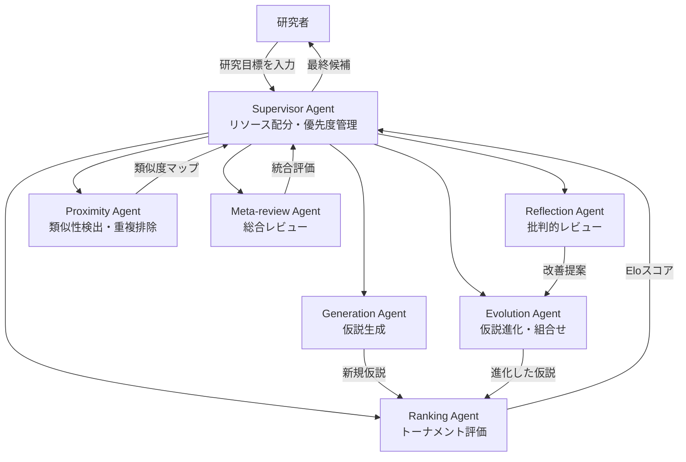
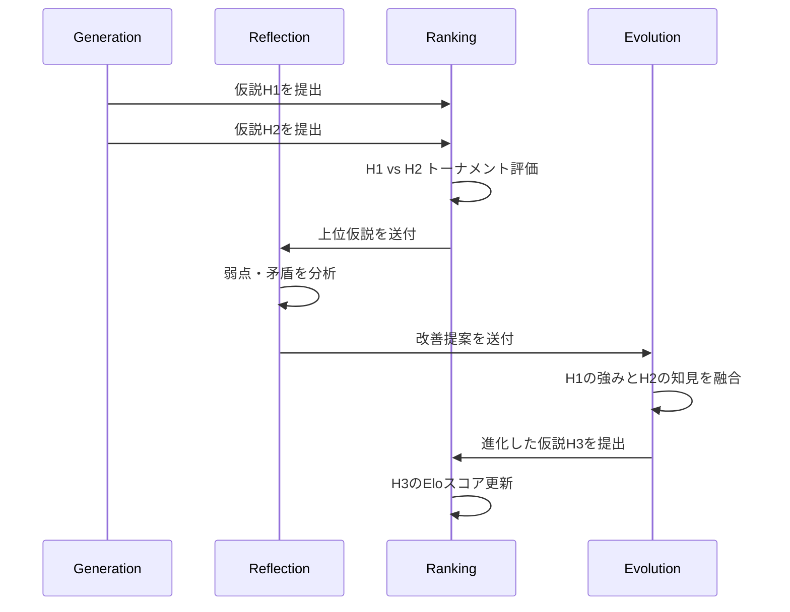
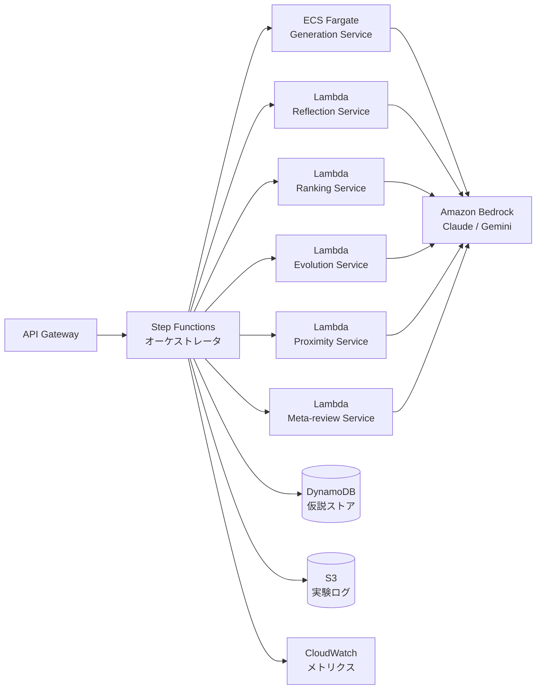

# Google AI Co-Scientist — マルチエージェントAIによる創薬研究の加速

本記事は [https://research.google/blog/accelerating-scientific-breakthroughs-with-an-ai-co-scientist/](https://research.google/blog/accelerating-scientific-breakthroughs-with-an-ai-co-scientist/) の解説記事です。

---

## ブログ概要

Google Research / Google DeepMind チームは2025年2月、科学研究を加速するマルチエージェントAIシステム **AI Co-Scientist** を発表しました。Gemini 2.0をベースに、6つの専門エージェント（Generation, Reflection, Ranking, Evolution, Proximity, Meta-review）とSupervisorエージェントが協調して仮説生成・評価・進化を行います。急性骨髄性白血病（AML）の薬剤リパーパシング、肝線維症のエピジェネティック標的探索、抗菌薬耐性メカニズムの解明において、実験室で検証された成果が報告されています。本記事ではシステムのアーキテクチャ、自己対戦型ディベート機構、そしてAWS上でのマルチエージェントシステム構築パターンを解説します。

**対象読者**: マルチエージェントAIや計算創薬に関心のある修士学生レベルの開発者・研究者

---

## 情報源

| 項目 | 内容 |
|------|------|
| 種別 | 企業テックブログ（Google Research） |
| URL | [research.google/blog/accelerating-scientific-breakthroughs-with-an-ai-co-scientist/](https://research.google/blog/accelerating-scientific-breakthroughs-with-an-ai-co-scientist/) |
| 組織 | Google DeepMind / Google Research |
| 発表日 | 2025年2月 |

---

## 技術的背景

### なぜ創薬にマルチエージェントAIか

従来の創薬パイプラインでは、仮説生成から実験検証まで平均10〜15年、コストは数十億ドル規模を要します。特にボトルネックとなるのは以下の段階です。

1. **仮説生成**: 膨大な論文・データベースから有望な標的を特定する探索的フェーズ
2. **仮説評価**: 生成された候補の妥当性を多角的に検証するプロセス
3. **反復改善**: 実験フィードバックを元に仮説を洗練するイテレーション

単一のLLMでこれらを一貫して処理すると、「生成バイアス」と「評価の甘さ」が同時に発生します。Google Research チームはこの問題に対し、**役割分離による専門化**と**自己対戦型ディベート**を組み合わせたマルチエージェント設計を採用しました。各エージェントが異なる認知的役割を担うことで、単一モデルの限界を構造的に克服しています。

---

## 実装アーキテクチャ

### 6エージェント + Supervisor 構成

Google Research チームは、以下の6つの専門エージェントとリソース配分を行うSupervisorエージェントで構成されるシステムを報告しています。



各エージェントの役割は以下の通りです。

| エージェント | 役割 | 入力 | 出力 |
|-------------|------|------|------|
| Generation | 新規仮説の生成 | 研究目標、既存文献 | 候補仮説リスト |
| Reflection | 仮説の批判的レビュー | 候補仮説 | 弱点分析・改善提案 |
| Ranking | トーナメント方式の比較評価 | 仮説ペア | Eloレーティング |
| Evolution | 仮説の交叉・突然変異による改善 | 上位仮説+改善提案 | 進化した仮説 |
| Proximity | 仮説間の類似性検出 | 全仮説集合 | クラスタ・重複情報 |
| Meta-review | 全体の整合性・網羅性の評価 | 仮説集合+評価結果 | 統合レビュー |

### 自己対戦型ディベート機構

AI Co-Scientistの中核的な仕組みは、**科学的ディベートの自動化**です。GenerationエージェントとReflectionエージェントが対立する役割を担い、仮説の強度を反復的に検証します。



Google Research チームは、このディベート・進化サイクルを繰り返すことで **test-time compute scaling** が実現されると報告しています。具体的には、計算リソースを追加投入するほど仮説の品質が単調に向上し、Eloスコアで自動評価した結果、計算時間と品質の間に正の相関が確認されています。

### ツール統合

各エージェントはWeb検索や専門AIモデルをツールとして呼び出す機能を持ちます。これにより、最新論文の参照やタンパク質構造予測（AlphaFold等）との連携が可能になります。

---

## Production Deployment Guide（2026年4月時点）

AI Co-Scientistの設計思想をAWS上で実装する場合のマルチエージェントシステム構築パターンを示します。以下では、6エージェント構成のパイプラインをサーバーレス・コンテナ混成で構築する方法を解説します。

### 全体アーキテクチャ



### Terraformによるインフラ定義

#### Step Functions オーケストレータ

Supervisorエージェントの役割をAWS Step Functionsで実装します。各エージェントの呼び出し順序、リトライ、タイムアウトを宣言的に管理できます。

```python
"""
Terraform CDK (cdktf) による Step Functions 定義例。
マルチエージェントパイプラインのオーケストレーションを管理する。
"""
from dataclasses import dataclass, field
from typing import Any


@dataclass(frozen=True)
class AgentConfig:
    """各エージェントの実行設定。

    Attributes:
        name: エージェント識別子
        timeout_seconds: 最大実行時間
        retry_max_attempts: リトライ上限
        memory_mb: Lambda/ECS メモリ割り当て
    """
    name: str
    timeout_seconds: int = 300
    retry_max_attempts: int = 3
    memory_mb: int = 1024


@dataclass
class PipelineDefinition:
    """マルチエージェントパイプラインの定義。

    Attributes:
        agents: エージェント設定のリスト
        max_evolution_rounds: 進化サイクルの最大回数
        elo_threshold: 採用判定のEloスコア閾値
    """
    agents: list[AgentConfig] = field(default_factory=lambda: [
        AgentConfig(name="generation", timeout_seconds=600, memory_mb=2048),
        AgentConfig(name="reflection", timeout_seconds=300),
        AgentConfig(name="ranking", timeout_seconds=120),
        AgentConfig(name="evolution", timeout_seconds=300),
        AgentConfig(name="proximity", timeout_seconds=120),
        AgentConfig(name="meta_review", timeout_seconds=300),
    ])
    max_evolution_rounds: int = 5
    elo_threshold: float = 1600.0

    def to_step_functions_definition(self) -> dict[str, Any]:
        """Step Functions ASL (Amazon States Language) 定義を生成する。

        Returns:
            ASL形式のワークフロー定義辞書
        """
        return {
            "Comment": "AI Co-Scientist Multi-Agent Pipeline",
            "StartAt": "GenerateHypotheses",
            "States": {
                "GenerateHypotheses": {
                    "Type": "Task",
                    "Resource": f"arn:aws:lambda:ap-northeast-1:*:{self.agents[0].name}",
                    "TimeoutSeconds": self.agents[0].timeout_seconds,
                    "Retry": [{
                        "ErrorEquals": ["States.TaskFailed"],
                        "MaxAttempts": self.agents[0].retry_max_attempts,
                        "BackoffRate": 2.0,
                    }],
                    "Next": "EvaluationLoop",
                },
                "EvaluationLoop": {
                    "Type": "Map",
                    "MaxConcurrency": 3,
                    "Iterator": {
                        "StartAt": "Reflect",
                        "States": {
                            "Reflect": {"Type": "Task", "Next": "Rank"},
                            "Rank": {"Type": "Task", "Next": "Evolve"},
                            "Evolve": {"Type": "Task", "End": True},
                        },
                    },
                    "Next": "CheckConvergence",
                },
                "CheckConvergence": {
                    "Type": "Choice",
                    "Choices": [{
                        "Variable": "$.best_elo",
                        "NumericGreaterThan": self.elo_threshold,
                        "Next": "MetaReview",
                    }],
                    "Default": "EvaluationLoop",
                },
                "MetaReview": {
                    "Type": "Task",
                    "End": True,
                },
            },
        }
```

#### Eloレーティングシステム

Rankingエージェントの中核であるEloスコア計算を実装します。

```python
"""
仮説のEloレーティング計算モジュール。
AI Co-ScientistのRankingエージェントで使用されるトーナメント評価を実装する。
"""
import math
from dataclasses import dataclass, field
from datetime import datetime, timezone


@dataclass
class Hypothesis:
    """科学的仮説を表現するデータクラス。

    Attributes:
        hypothesis_id: 一意識別子
        content: 仮説の記述
        elo_rating: 現在のEloスコア（初期値1500）
        generation: 進化の世代番号
        created_at: 生成日時（UTC）
        match_count: 対戦回数
    """
    hypothesis_id: str
    content: str
    elo_rating: float = 1500.0
    generation: int = 0
    created_at: datetime = field(default_factory=lambda: datetime.now(timezone.utc))
    match_count: int = 0


def compute_expected_score(rating_a: float, rating_b: float) -> float:
    """Elo期待勝率を計算する。

    Args:
        rating_a: プレイヤーAのレーティング
        rating_b: プレイヤーBのレーティング

    Returns:
        プレイヤーAの期待勝率（0.0〜1.0）

    Examples:
        >>> compute_expected_score(1500, 1500)
        0.5
        >>> compute_expected_score(1600, 1400)  # doctest: +ELLIPSIS
        0.759...
    """
    return 1.0 / (1.0 + math.pow(10, (rating_b - rating_a) / 400))


def update_elo(
    winner: Hypothesis,
    loser: Hypothesis,
    k_factor: float = 32.0,
) -> tuple[float, float]:
    """対戦結果に基づきEloレーティングを更新する。

    Args:
        winner: 勝者の仮説
        loser: 敗者の仮説
        k_factor: 更新幅を制御するK値

    Returns:
        更新後の(勝者スコア, 敗者スコア)のタプル
    """
    expected_winner = compute_expected_score(winner.elo_rating, loser.elo_rating)
    expected_loser = 1.0 - expected_winner

    winner.elo_rating += k_factor * (1.0 - expected_winner)
    loser.elo_rating += k_factor * (0.0 - expected_loser)
    winner.match_count += 1
    loser.match_count += 1

    return winner.elo_rating, loser.elo_rating


def run_tournament(
    hypotheses: list[Hypothesis],
    compare_fn: callable,
    rounds: int = 3,
    k_factor: float = 32.0,
) -> list[Hypothesis]:
    """全仮説間でラウンドロビントーナメントを実行する。

    Args:
        hypotheses: 評価対象の仮説リスト
        compare_fn: 2仮説を比較し勝者indexを返す関数
        rounds: トーナメントラウンド数
        k_factor: Elo更新のK値

    Returns:
        Eloスコア降順でソートされた仮説リスト
    """
    for _round in range(rounds):
        for i in range(len(hypotheses)):
            for j in range(i + 1, len(hypotheses)):
                winner_idx = compare_fn(hypotheses[i], hypotheses[j])
                if winner_idx == 0:
                    update_elo(hypotheses[i], hypotheses[j], k_factor)
                else:
                    update_elo(hypotheses[j], hypotheses[i], k_factor)

    return sorted(hypotheses, key=lambda h: h.elo_rating, reverse=True)
```

#### マルチエージェント呼び出し基盤

Amazon Bedrockを使ったエージェント呼び出しの基盤コードです。指数バックオフ付きリトライとタイムアウトを含みます。

```python
"""
Amazon Bedrock を使ったマルチエージェント呼び出し基盤。
各エージェントのLLM呼び出しを統一インターフェースで管理する。
"""
import asyncio
import json
import random
from dataclasses import dataclass
from typing import Any

import boto3
from pydantic import BaseModel, Field


class AgentRequest(BaseModel):
    """エージェントへのリクエスト。

    Attributes:
        agent_role: エージェントの役割（generation, reflection等）
        system_prompt: システムプロンプト
        user_message: ユーザーメッセージ
        temperature: 生成温度
        max_tokens: 最大トークン数
    """
    agent_role: str
    system_prompt: str
    user_message: str
    temperature: float = Field(default=0.7, ge=0.0, le=1.0)
    max_tokens: int = Field(default=4096, gt=0)


class AgentResponse(BaseModel):
    """エージェントからのレスポンス。

    Attributes:
        agent_role: エージェントの役割
        content: 生成されたテキスト
        usage: トークン使用量
        latency_ms: レイテンシ（ミリ秒）
    """
    agent_role: str
    content: str
    usage: dict[str, int]
    latency_ms: float


@dataclass(frozen=True)
class RetryConfig:
    """リトライ設定。

    Attributes:
        max_attempts: 最大リトライ回数
        base_delay: 基本待機時間（秒）
        max_delay: 最大待機時間（秒）
        jitter: ジッタ係数（0.0〜1.0）
    """
    max_attempts: int = 3
    base_delay: float = 1.0
    max_delay: float = 30.0
    jitter: float = 0.5


async def invoke_agent_with_retry(
    client: Any,
    request: AgentRequest,
    model_id: str = "anthropic.claude-sonnet-4-20250514",
    retry_config: RetryConfig | None = None,
    timeout_seconds: float = 120.0,
) -> AgentResponse:
    """指数バックオフ付きリトライでエージェントを呼び出す。

    Args:
        client: Bedrock Runtime クライアント
        request: エージェントリクエスト
        model_id: 使用するモデルID
        retry_config: リトライ設定
        timeout_seconds: タイムアウト秒数

    Returns:
        エージェントレスポンス

    Raises:
        TimeoutError: タイムアウト時
        RuntimeError: 最大リトライ回数超過時
    """
    config = retry_config or RetryConfig()

    for attempt in range(config.max_attempts):
        try:
            response = await asyncio.wait_for(
                asyncio.to_thread(
                    client.invoke_model,
                    modelId=model_id,
                    body=json.dumps({
                        "anthropic_version": "bedrock-2023-05-31",
                        "system": request.system_prompt,
                        "messages": [{"role": "user", "content": request.user_message}],
                        "temperature": request.temperature,
                        "max_tokens": request.max_tokens,
                    }),
                ),
                timeout=timeout_seconds,
            )
            result = json.loads(response["body"].read())
            return AgentResponse(
                agent_role=request.agent_role,
                content=result["content"][0]["text"],
                usage=result.get("usage", {}),
                latency_ms=response["ResponseMetadata"]
                    .get("HTTPHeaders", {})
                    .get("x-amzn-requestid", 0),
            )
        except TimeoutError:
            raise
        except Exception:
            if attempt == config.max_attempts - 1:
                raise RuntimeError(
                    f"Agent {request.agent_role}: "
                    f"max retries ({config.max_attempts}) exceeded"
                )
            delay = min(
                config.base_delay * (2 ** attempt),
                config.max_delay,
            )
            jittered_delay = delay * (1 + random.uniform(-config.jitter, config.jitter))
            await asyncio.sleep(jittered_delay)

    raise RuntimeError("Unreachable")
```

#### Terraform インフラ定義

```python
"""
Terraform CDK によるマルチエージェントインフラ定義。
DynamoDB仮説ストア、S3ログバケット、CloudWatch監視を含む。
"""
from cdktf import App, TerraformStack
from constructs import Construct
from imports.aws.dynamodb_table import DynamodbTable
from imports.aws.s3_bucket import S3Bucket
from imports.aws.cloudwatch_metric_alarm import CloudwatchMetricAlarm


class MultiAgentStack(TerraformStack):
    """マルチエージェントシステムのインフラスタック。"""

    def __init__(self, scope: Construct, ns: str) -> None:
        super().__init__(scope, ns)

        # 仮説ストア
        self.hypothesis_table = DynamodbTable(
            self, "hypothesis_store",
            name="ai-co-scientist-hypotheses",
            billing_mode="PAY_PER_REQUEST",
            hash_key="hypothesis_id",
            range_key="generation",
            attribute=[
                {"name": "hypothesis_id", "type": "S"},
                {"name": "generation", "type": "N"},
                {"name": "elo_rating", "type": "N"},
            ],
            global_secondary_index=[{
                "name": "elo-index",
                "hash_key": "generation",
                "range_key": "elo_rating",
                "projection_type": "ALL",
            }],
            point_in_time_recovery={"enabled": True},
            tags={"Project": "ai-co-scientist", "Environment": "production"},
        )

        # 実験ログバケット
        self.log_bucket = S3Bucket(
            self, "experiment_logs",
            bucket="ai-co-scientist-experiment-logs",
            tags={"Project": "ai-co-scientist"},
        )

        # Elo収束監視アラーム
        self.convergence_alarm = CloudwatchMetricAlarm(
            self, "elo_convergence_alarm",
            alarm_name="ai-co-scientist-elo-stagnation",
            comparison_operator="LessThanThreshold",
            evaluation_periods=3,
            metric_name="EloImprovement",
            namespace="AICoScientist",
            period=300,
            statistic="Average",
            threshold=10.0,
            alarm_description="Eloスコアの改善が停滞",
            alarm_actions=[],
        )
```

### 監視・コストチェックリスト

マルチエージェントシステムの運用では、以下の項目を継続的に監視します。

| カテゴリ | メトリクス | 閾値 | アクション |
|---------|----------|------|----------|
| コスト | Bedrock API 月額 | $5,000 | アラート + 自動スロットリング |
| レイテンシ | パイプライン全体 | 600秒 | タイムアウト + 部分結果返却 |
| 品質 | 最高Eloスコア | 1600未満 | 追加ラウンド実行 |
| 収束 | Elo改善率 | 3ラウンド停滞 | 早期終了 |
| エラー率 | エージェント呼び出し失敗率 | 5% | サーキットブレーカー発動 |
| DynamoDB | 書き込みスロットリング | 0 | キャパシティ確認 |

**コスト見積もり**（2026年4月時点）:

- Generation エージェント: Claude Sonnet 4 使用時、1仮説セット生成あたり約$0.15〜$0.30
- 1パイプライン実行（5ラウンド）: 約$2.0〜$5.0
- 月間100パイプライン実行: 約$200〜$500（Bedrock API費用のみ）

---

## パフォーマンス最適化

### Test-Time Compute Scaling

Google Research チームは、推論時の計算リソース増加に伴い仮説品質が単調に向上するtest-time compute scalingを報告しています。これはEvolutionエージェントによる仮説の反復的改善が鍵です。

具体的な最適化戦略として以下が有効です。

1. **早期終了条件の設定**: Eloスコアの改善が3ラウンド連続で閾値以下の場合、進化ループを終了する。不要な計算コストを削減できる
2. **並列トーナメント**: Rankingエージェントでの仮説比較を並列化する。$n$ 個の仮説に対し $\binom{n}{2}$ 回の比較が必要だが、依存関係のないペアを同時評価可能
3. **Proximity による枝刈り**: 類似度の高い仮説を事前にクラスタリングし、代表仮説のみをトーナメントに参加させる。仮説数 $n$ が大きい場合、比較回数を $O(n^2)$ から $O(k^2)$（$k$: クラスタ数）に削減できる
4. **段階的モデル選択**: 初期ラウンドは軽量モデル（Claude Haiku等）で粗い評価を行い、上位候補のみ高性能モデル（Claude Sonnet 4等）で精密評価する

---

## 運用での学び

### AI Co-Scientistの実証から得られた知見

Google Research チームが報告している実証事例から、マルチエージェントAIシステム運用の教訓を整理します。

**AML（急性骨髄性白血病）の薬剤リパーパシング**: AI Co-Scientistは既存薬の新たな適応可能性を探索し、KIRA6を含む候補を同定しました。実験室での検証において、臨床的に妥当な濃度で腫瘍細胞の生存率を抑制することが確認されています。

**肝線維症のエピジェネティック標的**: スタンフォード大学との共同研究で、AI Co-Scientistが提案したエピジェネティック標的がヒト肝臓オルガノイドにおいて有意な抗線維化活性（p<0.01）を示しました。

**抗菌薬耐性メカニズム**: Fleming Initiative / Imperial College Londonとの共同研究で、AI Co-Scientistがファージ誘導性染色体島（PICI）メカニズムを独立に提案し、これが実験的知見と一致することが確認されました。

これらの事例から、以下の運用原則が導かれます。

- **人間の専門家との協調が前提**: AIの提案は実験的検証を経て初めて価値を持つ
- **ドメイン固有の制約を明示的に入力する**: 「臨床的に妥当な濃度」等の制約をプロンプトに含める
- **反復的な改善サイクル**: 1回の実行で完璧な結果を期待しない設計が重要

---

## 学術研究との関連

AI Co-Scientistの設計は、以下の学術的フレームワークと関連しています。

- **ReAct** (Yao et al., 2022): 推論と行動を交互に行うフレームワーク。AI Co-Scientistの各エージェントがツール呼び出しと推論を組み合わせる設計の基盤
- **Tree-of-Thought** (Yao et al., 2023): 探索木構造で多様な推論パスを評価する手法。Evolutionエージェントによる仮説の分岐・選択と類似
- **マルチエージェントディベート** (Du et al., 2023; Liang et al., 2023): 複数のLLMが議論を通じて回答を改善する手法。AI Co-ScientistのGeneration-Reflectionディベートはこの発展形

これらの研究を統合し、**科学的仮説生成**という高度なタスクに適用した点がAI Co-Scientistの学術的貢献です。

---

## まとめ

Google AI Co-Scientistは、6つの専門エージェントとSupervisorによるマルチエージェント構成で、科学的仮説の生成・評価・進化を自動化するシステムです。AML薬剤リパーパシング、肝線維症治療、抗菌薬耐性研究で実験的に検証された成果が報告されています。本記事では、このアーキテクチャの技術的詳細と、AWS上での類似システム構築パターンを解説しました。

関連するZenn記事「[中外製薬のAI創薬戦略 MALEXAから全社生成AI基盤まで徹底解説](https://zenn.dev/0h_n0/articles/cf04d21b44ea14)」では、日本の製薬企業によるAI活用事例を解説しています。Google AI Co-Scientistのようなマルチエージェントアプローチと、中外製薬のような企業内AI基盤の統合が、今後の創薬研究における重要な方向性となるでしょう。

---

## 参考文献

1. Google Research, "Accelerating scientific breakthroughs with an AI co-scientist", research.google, 2025年2月. [https://research.google/blog/accelerating-scientific-breakthroughs-with-an-ai-co-scientist/](https://research.google/blog/accelerating-scientific-breakthroughs-with-an-ai-co-scientist/)
2. Yao, S. et al., "ReAct: Synergizing Reasoning and Acting in Language Models", ICLR 2023. [arXiv:2210.03629](https://arxiv.org/abs/2210.03629)
3. Yao, S. et al., "Tree of Thoughts: Deliberate Problem Solving with Large Language Models", NeurIPS 2023. [arXiv:2305.10601](https://arxiv.org/abs/2305.10601)
4. Du, Y. et al., "Improving Factuality and Reasoning in Language Models through Multiagent Debate", 2023. [arXiv:2305.14325](https://arxiv.org/abs/2305.14325)
5. Liang, T. et al., "Encouraging Divergent Thinking in Large Language Models through Multi-Agent Debate", 2023. [arXiv:2305.19118](https://arxiv.org/abs/2305.19118)
