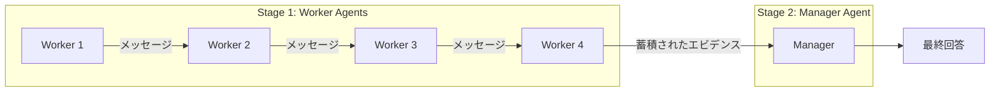

## 論文概要（Abstract）

本記事は [NeurIPS 2024で発表されたChain of Agents論文](https://openreview.net/pdf?id=LuCLf4BJsr) の解説記事です。

Chain of Agents（CoA）は、長文コンテキストタスクに対してマルチエージェント協調を活用するフレームワークである。入力テキストをチャンクに分割し、複数のWorkerエージェントが**逐次的に読み進めながらメッセージを引き継ぐ**ことで、限られたコンテキストウィンドウ（8K）でも200Kのフルコンテキストを超える性能を達成したと、著者らは報告している。計算量をTransformerの $O(n^2)$ から $O(nk)$ に削減する（$n$: 入力トークン数、$k$: コンテキストウィンドウサイズ）。

この記事は [Zenn記事: LLMエージェントのトークン予算管理：3層制御でAPI費用の暴走を防ぐ実装ガイド](https://zenn.dev/0h_n0/articles/95acc61229eba4) の深掘りです。

## 情報源

- **会議名**: NeurIPS 2024（Neural Information Processing Systems）
- **URL**: [https://openreview.net/pdf?id=LuCLf4BJsr](https://openreview.net/pdf?id=LuCLf4BJsr)
- **著者**: Yusen Zhang (Student Researcher, Google), Ruoxi Sun (Research Scientist, Google)
- **Google Research Blog**: [https://research.google/blog/chain-of-agents-large-language-models-collaborating-on-long-context-tasks/](https://research.google/blog/chain-of-agents-large-language-models-collaborating-on-long-context-tasks/)

## カンファレンス情報

**NeurIPSについて**:

NeurIPS（Neural Information Processing Systems）は機械学習・人工知能分野における最高峰の国際会議の1つである。年間数千件の投稿から厳選された論文が採択される。CoAはこの会議で発表され、training-freeかつtask-agnosticなアプローチとして注目を集めた。

## 技術的詳細（Technical Details）

### 問題設定

長文コンテキストタスクにおける従来手法の限界は以下の通り：

1. **RAG**: チャンク分割 → Embedding類似度検索 → 関連チャンク取得。マルチホップ推論（複数の情報を組み合わせて答える必要がある質問）では、**意味的類似度だけでは第1ホップの回答に必要な情報を取得できない**ケースが頻発する
2. **コンテキストウィンドウ拡張**: ファインチューニングで長いコンテキストを処理可能にするアプローチ。Transformerの $O(n^2)$ のコストが増大し、コンテキストが長くなるほど注意力が分散する（context rot）
3. **Full Context**: コンテキストウィンドウの上限まで全テキストを渡す方法。コスト増大に加え、長くなるほど精度が低下する

CoAは「**人間が限られたワーキングメモリで長文を読む方法**」に着想を得ている。人間はテキストを部分的に読みながら、重要な情報を記憶し、次の部分の理解に活かす。この逐次的な読解 + 処理のインターリーブをマルチエージェントで実現する。

### フレームワーク構成

CoAは2ステージで構成される。



**Stage 1 - Worker Agents（逐次処理）**:

各Workerは以下を入力として受け取る：
- 割り当てられたテキストチャンク
- 元のクエリ
- タスク固有の指示
- **前のWorkerからのメッセージ**（最初のWorkerを除く）

各Workerは処理結果をメッセージとして次のWorkerに渡す。この**一方向の通信チェーン**により、前のWorkerが発見した情報を次のWorkerが引き継げる。

**Stage 2 - Manager Agent（統合・回答生成）**:

最後のWorkerから受け取った蓄積エビデンスを基に、最終的な回答を生成する。

### マルチホップ推論の処理例

質問「Aの孫は誰か？」に対して、チャンク[1][2][3][4]にまたがって情報が分散している場合：

| Worker | 処理内容 | 出力メッセージ |
|--------|---------|--------------|
| Worker 1 | チャンク[1]を読み、トピック探索 | 「Aの配偶者はDである」 |
| Worker 2 | チャンク[2]を読み、第1ホップ回答 | 「Aの子はBである」 |
| Worker 3 | チャンク[3]を読み、エビデンス転送 | 「Aの子Bに関する追加情報」 |
| Worker 4 | チャンク[4]を読み、完全な推論 | 「Aの孫はCである」 |
| Manager | エビデンスを統合 | 「Aの孫はCです」 |

RAGでは「Aの孫は誰か？」というクエリに対して意味的に類似したチャンクを検索するが、「Aの配偶者はDである」という第1ホップの情報はクエリとの意味的類似度が低いため取得されない。CoAは逐次的にテキストを読み進めることで、このマルチホップ推論の問題を回避する。

### 計算量の分析

Transformerベースの全文処理では計算量が $O(n^2)$（$n$: 入力トークン数）であるのに対し、CoAでは $O(nk)$（$k$: 各Workerのコンテキストウィンドウサイズ）に削減される。$k \ll n$ の場合、この削減は大幅である。

$$
\text{Full Context}: O(n^2) \quad \text{vs} \quad \text{CoA}: O(nk)
$$

ここで、
- $n$: 入力テキスト全体のトークン数
- $k$: 各Workerのコンテキストウィンドウサイズ（通常8K）

例えば $n = 200K$, $k = 8K$ の場合、計算量は $200K^2 / (200K \times 8K) = 25$ 倍の効率改善となる。

### アルゴリズム

CoAの処理フローを擬似コードで示す：

```python
from anthropic import Anthropic
from typing import Any

client = Anthropic()


def chain_of_agents(
    document: str,
    query: str,
    chunk_size: int = 8000,
    model: str = "claude-sonnet-4-6",
) -> str:
    """Chain of Agents: マルチエージェント協調による長文処理

    Args:
        document: 処理対象の長文テキスト
        query: ユーザーのクエリ
        chunk_size: 各Workerに割り当てるチャンクサイズ（トークン数）
        model: 使用するLLMモデルID

    Returns:
        最終回答
    """
    # テキストをチャンクに分割
    chunks: list[str] = split_into_chunks(document, chunk_size)

    # Stage 1: Worker Agents（逐次処理）
    previous_message: str = ""
    for i, chunk in enumerate(chunks):
        worker_prompt = (
            f"あなたはWorker {i + 1}/{len(chunks)}です。\n"
            f"以下のテキストチャンクを読み、クエリに関連する情報を抽出してください。\n\n"
            f"クエリ: {query}\n\n"
            f"テキストチャンク:\n{chunk}\n\n"
        )
        if previous_message:
            worker_prompt += f"前のWorkerからのメッセージ:\n{previous_message}\n\n"
        worker_prompt += (
            "発見した情報と推論を次のWorkerへのメッセージとしてまとめてください。"
        )

        response = client.messages.create(
            model=model,
            max_tokens=2048,
            messages=[{"role": "user", "content": worker_prompt}],
        )
        previous_message = response.content[0].text

    # Stage 2: Manager Agent（統合）
    manager_prompt = (
        f"以下のエビデンスを基に、クエリに対する最終回答を生成してください。\n\n"
        f"クエリ: {query}\n\n"
        f"蓄積されたエビデンス:\n{previous_message}"
    )
    final_response = client.messages.create(
        model=model,
        max_tokens=4096,
        messages=[{"role": "user", "content": manager_prompt}],
    )
    return final_response.content[0].text


def split_into_chunks(text: str, chunk_size: int) -> list[str]:
    """テキストを指定サイズのチャンクに分割する"""
    words: list[str] = text.split()
    chunks: list[str] = []
    current: list[str] = []
    current_size: int = 0
    for word in words:
        current.append(word)
        current_size += len(word) + 1
        if current_size >= chunk_size:
            chunks.append(" ".join(current))
            current = []
            current_size = 0
    if current:
        chunks.append(" ".join(current))
    return chunks
```

## 実装のポイント（Implementation）

**チャンク分割戦略**: テキストの分割方法がWorkerの推論品質に影響する。著者らはヒューリスティックな均等分割を使用しているが、セクション境界やパラグラフ境界での分割がより自然な処理につながる可能性がある。

**Workerメッセージの情報量制御**: 各Workerの出力メッセージが長すぎると、後続のWorkerのコンテキストが圧迫される。`max_tokens`パラメータでメッセージ長を制限し、簡潔なエビデンス伝達を促す必要がある。

**モデル選択**: 全Workerに高性能モデルを使用する必要はない。中間Workerには小型モデル（Haiku）を使い、最終のManagerのみ高性能モデル（Sonnet/Opus）を使うことでコスト効率を改善できる。

**Zenn記事との統合**: CoAのWorker-Managerパターンは、Zenn記事で紹介したマルチエージェントのトークン増幅問題への対策として活用できる。各Workerが8Kのコンテキスト内で処理し、**蓄積エビデンスのみ（1,000-2,000トークン程度）**を次のWorkerに渡すことで、コンテキスト膨張を防ぐ。

## 実験結果（Results）

### 評価データセット（9種類）

著者らはQA、要約、コード補完の3カテゴリ、計9データセットで評価を実施している。

| カテゴリ | データセット |
|---------|------------|
| QA | HotpotQA, MuSiQue, NarrativeQA, Qasper, QuALITY |
| 要約 | QMSum, GovReport, BookSum |
| コード | RepoBench-P |

### 評価モデル

- PaLM 2 (Text Bison, Text Unicorn)
- Gemini Ultra
- Claude 3 (Haiku, Sonnet, Opus)

### 主要結果

著者らの報告による主要な結果を以下にまとめる。

**一般的な結果**:
- CoAは全8データセットでRAGを上回っている
- CoAはFull-Context（8K）を全データセットで大幅に上回っている

**NarrativeQA & BookSum（Claude 3モデル）**:

CoA（8Kコンテキスト）がFull-Context（200Kコンテキスト）のベースラインを**25倍のコンテキストウィンドウ不利**にもかかわらず上回ったと報告されている。

**BookSum（入力長別性能）**:

入力が400Kトークンを超えるサンプルでは、Full-Context（200K）と比較してCoAが**約100%の改善**を示している。これは長いドキュメントほどCoAの優位性が増すことを示している。

### マルチホップ推論のケーススタディ（HotpotQA）

RAGの限界: 意味的に類似したチャンクを取得するが、第1ホップの回答に必要な情報がクエリとの意味的類似度が低い場合に失敗する。

CoAの優位性: エージェントが事前知識なしにトピックを逐次探索し、協調的な情報合成によりマルチホップ推論を実現する。

### 計算効率

著者らは、CoAが「計算コスト効率的であり、フルコンテキストアプローチに対して大幅に改善する」と報告している。$O(n^2) \rightarrow O(nk)$ の計算量削減により、長いドキュメントほど効率的になる。

## 実運用への応用（Practical Applications）

CoAはZenn記事で指摘した**マルチエージェントのトークン増幅問題**に対する解決策の1つとなる。

**従来のマルチエージェント問題**（Zenn記事の図より）:
- 各サブエージェントの出力がオーケストレーターにフィードバックされ、コンテキストが膨張
- 3エージェント × 2,000トークン出力 = 1サイクルあたり6,000トークン増加

**CoAによる解決**:
- 各Workerは独立したコンテキストウィンドウ（8K）で処理
- 蓄積エビデンス（1,000-2,000トークン）のみが引き継がれる
- コンテキスト膨張が発生しない

**適用シナリオ**:
1. **大規模ドキュメント分析**: 法務文書、特許文書、研究論文の長文分析
2. **コードベース理解**: 数千行のコードベースの理解とバグ探索
3. **議事録要約**: 長時間会議のトランスクリプト要約

## 関連研究（Related Work）

- **RAG (Lewis et al., NeurIPS 2020)**: テキストチャンクのベクター検索で関連情報を取得するRead-then-Processアプローチ。CoAはマルチホップ推論で優位
- **Gemini (Google, 2024)**: 2Mトークンのコンテキストウィンドウ拡張。計算コストは $O(n^2)$ のまま
- **MapReduce (Dean & Ghemawat, 2004)**: 分散処理パラダイム。CoAはMap（Worker）とReduce（Manager）の構造的類似性を持つが、Workerが逐次的にメッセージを引き継ぐ点が異なる

## まとめ

CoAは「人間の読解プロセスの模倣」という直感的なアイデアをマルチエージェントフレームワークとして実現し、training-freeかつtask-agnosticな手法で長文コンテキスト処理のコスト効率を改善した。8Kのコンテキストウィンドウで200Kのフルコンテキストを上回る性能は、**コンテキストウィンドウの拡張よりも、適切な情報の取捨選択と逐次処理の方が効果的**である可能性を示唆している。

Zenn記事の3層トークン予算管理と組み合わせる場合、CoAはLayer 2（タスク層）のコンパクションの代替戦略として位置づけられる。特に長大なドキュメントを処理するエージェントタスクにおいて、コンテキスト膨張を防ぎながら高品質な推論を維持できる。

## 参考文献

- **Conference Paper**: [https://openreview.net/pdf?id=LuCLf4BJsr](https://openreview.net/pdf?id=LuCLf4BJsr)
- **Google Research Blog**: [https://research.google/blog/chain-of-agents-large-language-models-collaborating-on-long-context-tasks/](https://research.google/blog/chain-of-agents-large-language-models-collaborating-on-long-context-tasks/)
- **Related Zenn article**: [https://zenn.dev/0h_n0/articles/95acc61229eba4](https://zenn.dev/0h_n0/articles/95acc61229eba4)
