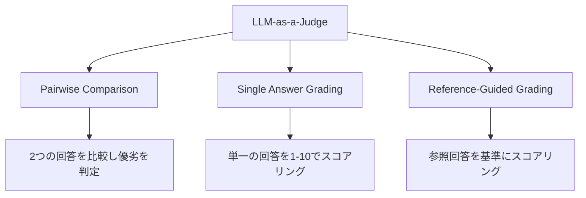

## 論文概要（Abstract）

本記事は [arXiv:2306.05685 "Judging LLM-as-a-Judge with MT-Bench and Chatbot Arena"](https://arxiv.org/abs/2306.05685) の解説記事である。Zheng et al.は、LLMの出力品質を別のLLM（ジャッジ）で自動評価する「LLM-as-a-Judge」手法の信頼性を体系的に検証した。マルチターン対話80問のベンチマーク「MT-Bench」と、人間による対戦形式の評価プラットフォーム「Chatbot Arena」を提案し、GPT-4ジャッジが人間評価者と80%以上の一致率を達成することを報告している。

この記事は [Zenn記事: 実践プロンプトエンジニアリング：評価駆動で本番LLMアプリのプロンプトを継続改善する](https://zenn.dev/0h_n0/articles/e9bb5614d139b8) の深掘りです。

## 情報源

- **arXiv ID**: 2306.05685
- **URL**: [https://arxiv.org/abs/2306.05685](https://arxiv.org/abs/2306.05685)
- **著者**: Lianmin Zheng, Wei-Lin Chiang, Ying Sheng et al.（UC Berkeley, UCSD, CMU）
- **発表年**: 2023年（NeurIPS 2023採択）
- **分野**: cs.CL, cs.AI

## 背景と動機（Background & Motivation）

LLMの出力品質を評価する手法は、LLMアプリケーション開発の根幹を成す。従来のNLP評価指標（BLEU、ROUGE等）は参照回答との表面的な一致を測るものであり、LLMの自由記述型出力の品質を捉えるには不十分であった。一方、人間評価はコストが高く、スケーラブルではない。

著者らはこの課題に対し、強力なLLM（GPT-4）を自動評価者（ジャッジ）として活用する「LLM-as-a-Judge」アプローチを提案し、その信頼性を体系的に検証した。評価駆動のプロンプト開発では、プロンプト変更ごとに品質を定量的に測定する必要があるため、スケーラブルかつ信頼性の高い自動評価手法は不可欠な基盤技術である。

## 主要な貢献（Key Contributions）

- **MT-Bench**: 8カテゴリ（Writing, Roleplay, Reasoning, Math, Coding, Extraction, STEM, Humanities）のマルチターン対話80問で構成されるベンチマーク。2ターン構成により追従能力も評価可能
- **Chatbot Arena**: ユーザーが2つの匿名モデルと対話し、優れた方を投票する対戦形式プラットフォーム。Eloレーティングによるランキングを提供
- **LLM-as-a-Judge検証**: GPT-4ジャッジの人間評価との一致率を定量化し、バイアスの種類と対策を特定

## 技術的詳細（Technical Details）

### MT-Benchの評価設計

MT-Benchは各カテゴリ10問、計80問のマルチターン対話で構成される。第1ターンでタスクを提示し、第2ターンで追加条件や制約を加えることで、モデルの指示追従能力を段階的に評価する。

評価には3つのジャッジ方式が設計されている。



著者らの実験によると、Single Answer Gradingが最もスケーラブルであり、Reference-Guided Gradingが数学・推論タスクで最も精度が高い（論文Table 5より）。

### Eloレーティングシステム

Chatbot Arenaのランキング計算には、チェスで使用されるEloレーティングシステムが採用されている。対戦結果に基づくレーティング更新式は以下のとおりである。

$$
R'_A = R_A + K \cdot (S_A - E_A)
$$

ここで、
- $R_A$: モデルAの現在のレーティング
- $R'_A$: 更新後のレーティング
- $K$: 更新係数（論文では$K=32$を使用）
- $S_A$: 実際の対戦結果（勝利=1、引分=0.5、敗北=0）
- $E_A$: 期待勝率

期待勝率$E_A$は以下の式で計算される。

$$
E_A = \frac{1}{1 + 10^{(R_B - R_A)/400}}
$$

ここで$R_B$はモデルBのレーティングである。この方式により、強いモデルに勝利した場合ほどレーティングの上昇幅が大きくなる。著者らの報告によると、約3万回の人間対戦投票により安定したランキングが得られたとされる。

### LLM-as-a-Judgeのバイアス分析

著者らは以下の3種類のバイアスを特定し、定量的に分析している。

**1. ポジションバイアス（Position Bias）**

2つの回答を比較する際、先に提示された回答を優先する傾向がある。論文の実験では、回答の提示順序を入れ替えて2回判定し、結果が一致しない場合を「不一致（inconsistency）」として計測している。GPT-4ジャッジでは不一致率が約15%であったと報告されている。

**対策**: 回答順序をスワップして2回判定し、両方で同じ結果の場合のみ採用する。

```python
def judge_with_swap(response_a: str, response_b: str, judge_prompt: str) -> str:
    """ポジションバイアスを緩和するスワップ判定

    Args:
        response_a: モデルAの回答
        response_b: モデルBの回答
        judge_prompt: ジャッジ用プロンプト

    Returns:
        判定結果（"A", "B", "tie"）
    """
    # 順序1: A→B
    result_1 = call_judge(judge_prompt, first=response_a, second=response_b)
    # 順序2: B→A
    result_2 = call_judge(judge_prompt, first=response_b, second=response_a)

    # 結果の整合性チェック
    if result_1 == "first" and result_2 == "second":
        return "A"
    elif result_1 == "second" and result_2 == "first":
        return "B"
    else:
        return "tie"  # 不一致の場合は引き分け
```

**2. 自己強化バイアス（Self-Enhancement Bias）**

GPT-4がジャッジの場合、GPT-4自身の出力を他のモデルの出力より高く評価する傾向がある。著者らの分析では、GPT-4ジャッジがGPT-4回答を選ぶ率が、人間評価者が選ぶ率より約10ポイント高いと報告されている。

**3. 冗長性バイアス（Verbosity Bias）**

より長い回答を高く評価する傾向がある。回答の品質とは無関係に、詳細に書かれた回答がスコアを獲得しやすい。

### 人間評価との一致率

著者らは、MT-Benchにおけるジャッジ方式ごとの人間評価との一致率を報告している（論文Table 4より）。

| ジャッジ方式 | 一致率 |
|-------------|--------|
| GPT-4 (Single) | 約80% |
| GPT-4 (Pairwise) | 約85% |
| GPT-4 (Reference-Guided) | 約88% |
| Claude (Single) | 約75% |
| 人間同士 | 約81% |

注目すべきは、GPT-4ジャッジの一致率が人間同士の一致率（約81%）と同等かやや高い水準にあることである。ただし、数学・推論カテゴリでは一致率が低下する傾向があり、これらのタスクではReference-Guided方式の使用が著者らにより推奨されている。

## 実装のポイント（Implementation）

MT-Benchの評価を実装する際の要点は以下のとおりである。

**ジャッジプロンプトの設計**: 評価基準（ルーブリック）を明示的に含めることで判定精度が向上する。著者らのジャッジプロンプトでは、「helpfulness（有用性）」「relevance（関連性）」「accuracy（正確性）」「depth（深さ）」「creativity（創造性）」「detail（詳細度）」の6軸が指定されている。

**temperatureの設定**: ジャッジLLMのtemperatureは0.0に設定する。再現性を確保し、同じ入力に対して一貫した評価を返すことが重要である。

**コスト管理**: Pairwise + Swap方式では1問あたり4回のAPI呼び出しが発生する。80問全体では320回のAPI呼び出しとなるため、Single方式（80回）とのコスト比を考慮して方式を選択する。

**実装上の注意点**: スコアの抽出にはLLMの出力を正規表現でパースする必要がある。出力形式を「Score: [[8]]」のように二重ブラケットで囲む指示を含めると、パース精度が向上する。FastChatのコードベース（Apache 2.0ライセンス）で実装例が公開されている。

## Production Deployment Guide

### AWS実装パターン（コスト最適化重視）

LLM-as-a-Judge評価パイプラインをAWS上で構築する場合のトラフィック量別推奨構成を示す。

| 規模 | 月間評価数 | 推奨構成 | 月額コスト目安 | 主要サービス |
|------|-----------|---------|-------------|------------|
| **Small** | ~3,000 (100/日) | Serverless | $80-200 | Lambda + Bedrock + DynamoDB |
| **Medium** | ~30,000 (1,000/日) | Hybrid | $500-1,200 | Lambda + ECS Fargate + ElastiCache |
| **Large** | 300,000+ (10,000/日) | Container | $3,000-8,000 | EKS + Karpenter + Bedrock Batch |

**Small構成の詳細**（月額$80-200）:
- **Lambda**: 1GB RAM, 120秒タイムアウト（$30/月）。ジャッジ呼び出しの非同期実行
- **Bedrock**: Claude 3.5 Haiku をジャッジモデルとして使用（$100/月）。Prompt Caching有効化でジャッジプロンプトのキャッシュ率90%以上
- **DynamoDB**: On-Demand（$10/月）。評価結果とスコア履歴の保存
- **S3**: 評価ログの長期保存（$5/月）
- **CloudWatch**: 基本監視（$5/月）

**コスト削減テクニック**:
- Bedrock Prompt Cachingでジャッジプロンプト（システムプロンプト部分）を90%キャッシュ→トークンコスト30-50%削減
- Bedrock Batch APIで非リアルタイム評価を50%割引実行
- Single方式を基本とし、数学/推論タスクのみPairwise方式を適用→API呼び出し数を削減

**コスト試算の注意事項**: 上記は2026年4月時点のAWS ap-northeast-1（東京）リージョン料金に基づく概算値である。実際のコストはトラフィックパターンとジャッジモデルの選択により変動する。最新料金は[AWS料金計算ツール](https://calculator.aws/)で確認されたい。

### Terraformインフラコード

**Small構成（Serverless）: Lambda + Bedrock + DynamoDB**

```hcl
# --- IAMロール（最小権限） ---
resource "aws_iam_role" "judge_lambda" {
  name = "llm-judge-lambda-role"

  assume_role_policy = jsonencode({
    Version = "2012-10-17"
    Statement = [{
      Action = "sts:AssumeRole"
      Effect = "Allow"
      Principal = { Service = "lambda.amazonaws.com" }
    }]
  })
}

resource "aws_iam_role_policy" "bedrock_judge" {
  role = aws_iam_role.judge_lambda.id
  policy = jsonencode({
    Version = "2012-10-17"
    Statement = [{
      Effect   = "Allow"
      Action   = ["bedrock:InvokeModel", "bedrock:InvokeModelWithResponseStream"]
      Resource = "arn:aws:bedrock:ap-northeast-1::foundation-model/anthropic.claude-3-5-haiku*"
    }]
  })
}

# --- Lambda関数（ジャッジ実行） ---
resource "aws_lambda_function" "judge_handler" {
  filename      = "judge_lambda.zip"
  function_name = "llm-judge-handler"
  role          = aws_iam_role.judge_lambda.arn
  handler       = "index.handler"
  runtime       = "python3.12"
  timeout       = 120
  memory_size   = 1024

  environment {
    variables = {
      JUDGE_MODEL_ID   = "anthropic.claude-3-5-haiku-20241022-v1:0"
      DYNAMODB_TABLE   = aws_dynamodb_table.judge_results.name
      ENABLE_PROMPT_CACHE = "true"
    }
  }
}

# --- DynamoDB（評価結果保存） ---
resource "aws_dynamodb_table" "judge_results" {
  name         = "llm-judge-results"
  billing_mode = "PAY_PER_REQUEST"
  hash_key     = "eval_id"
  range_key    = "timestamp"

  attribute {
    name = "eval_id"
    type = "S"
  }
  attribute {
    name = "timestamp"
    type = "N"
  }

  ttl {
    attribute_name = "expire_at"
    enabled        = true
  }
}
```

### 運用・監視設定

```python
import boto3

cloudwatch = boto3.client('cloudwatch')

# ジャッジ品質スコアの異常検知
cloudwatch.put_metric_alarm(
    AlarmName='judge-score-drift',
    ComparisonOperator='LessThanThreshold',
    EvaluationPeriods=3,
    MetricName='AverageJudgeScore',
    Namespace='LLMJudge/Evaluation',
    Period=3600,
    Statistic='Average',
    Threshold=6.0,  # 平均スコア6.0未満で警告
    AlarmDescription='ジャッジ平均スコアの低下検知（プロンプト劣化の可能性）'
)
```

### コスト最適化チェックリスト

- [ ] ~100 eval/日 → Lambda + Bedrock（Serverless）$80-200/月
- [ ] ~1000 eval/日 → ECS Fargate + Bedrock（Hybrid）$500-1,200/月
- [ ] Bedrock Prompt Caching有効化でジャッジプロンプトをキャッシュ
- [ ] 非リアルタイム評価にBedrock Batch API（50%割引）を適用
- [ ] Single方式をデフォルトとし、数学/推論のみPairwiseに切り替え
- [ ] DynamoDB TTLで古い評価結果を自動削除（90日）
- [ ] CloudWatch Logsの保持期間を30日に設定
- [ ] AWS Budgets月額予算アラート設定

## 実験結果（Results）

著者らはMT-Benchを用いて、当時の主要モデルのスコアを報告している（論文Table 1より）。

| モデル | MT-Bench平均スコア |
|--------|-------------------|
| GPT-4 | 8.99 |
| Claude-v1 | 7.90 |
| GPT-3.5-turbo | 7.94 |
| Vicuna-13B | 6.57 |
| LLaMA-13B | 2.61 |

カテゴリ別では、Codingカテゴリで差が最も大きく、GPT-4は9.5前後であるのに対しVicuna-13Bは3.0前後であったと報告されている（論文Figure 5より）。一方、Humanitiesカテゴリではモデル間の差が比較的小さい。

Chatbot Arenaでは、30,000回以上の人間投票データに基づくEloレーティングで、GPT-4 > Claude > GPT-3.5-turbo の順序が安定して再現されたと報告されている。

## 実運用への応用（Practical Applications）

LLM-as-a-Judge手法は、Zenn記事で解説した評価駆動プロンプト開発の中核技術として位置づけられる。具体的な応用場面は以下のとおりである。

**CI/CDパイプラインでの品質ゲート**: プロンプト変更時に自動でLLM-as-Judge評価を実行し、品質スコアが閾値を下回る場合にマージをブロックする。PromptfooのCI/CD統合機能と組み合わせることで、プロンプトの回帰テストを自動化可能である。

**本番モニタリング**: 本番トラフィックの一部をサンプリングしてLLM-as-Judge評価を実行し、品質劣化を早期検知する。Zenn記事で紹介したBraintrustの本番モニタリング機能がこのアプローチを採用している。

**プロンプトバージョン比較**: 新旧プロンプトの出力をPairwise方式で比較し、改善効果を定量化する。A/Bテストとの併用により、統計的に有意な差を確認できる。

## 関連研究（Related Work）

- **Alpaca Eval** (Li et al., 2023): 単一モデルの出力を参照回答と比較する自動評価。MT-Benchよりシンプルだが、マルチターン評価には対応していない
- **G-Eval** (Liu et al., 2023): GPT-4を評価者として使用し、Chain-of-Thoughtを用いて評価理由を生成する手法。MT-Benchのジャッジプロンプト設計に影響を与えた
- **LMSYS Org**: Chatbot Arenaの運営組織。2024年以降、投票数は100万回以上に拡大し、LLM評価のデファクトスタンダードとなっている

## まとめと今後の展望

Zheng et al.の研究は、LLM-as-a-Judge手法がスケーラブルなLLM評価の実現可能なアプローチであることを実証した。GPT-4ジャッジと人間評価の一致率が人間同士の一致率と同等である点は、評価駆動プロンプト開発の実用性を裏付けるものである。ただし、ポジションバイアスや自己強化バイアスが存在するため、スワップ判定やモデル横断評価といった対策が重要である。

今後は、より小型かつ低コストなジャッジモデルの開発、ドメイン特化型評価基準の自動生成、マルチモーダル出力への評価拡張が研究の方向性として著者らにより示されている。

## 参考文献

- **arXiv**: [https://arxiv.org/abs/2306.05685](https://arxiv.org/abs/2306.05685)
- **Code**: [https://github.com/lm-sys/FastChat](https://github.com/lm-sys/FastChat)（Apache 2.0ライセンス）
- **Related Zenn article**: [https://zenn.dev/0h_n0/articles/e9bb5614d139b8](https://zenn.dev/0h_n0/articles/e9bb5614d139b8)
