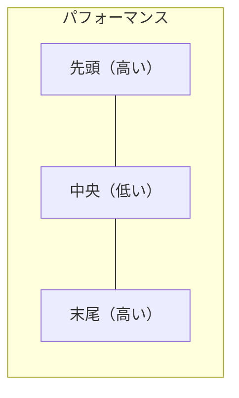

## 論文概要（Abstract）

本記事は [arXiv:2307.03172 "Lost in the Middle: How Language Models Use Long Contexts"](https://arxiv.org/abs/2307.03172) の解説記事である。Nelson F. Liu et al.は、LLMが長いコンテキストウィンドウ内で情報を活用する際、先頭と末尾に配置された情報は高い確率で活用されるが、中央に配置された情報は大幅に活用率が低下する「U字型パフォーマンス曲線」を実証した。この現象はGPT-3.5-turbo、Claude、Flan-UL2等の複数モデルで共通して確認されており、RAGパイプラインやプロンプト設計に直接的な示唆を与える研究である。

この記事は [Zenn記事: 実践プロンプトエンジニアリング：評価駆動で本番LLMアプリのプロンプトを継続改善する](https://zenn.dev/0h_n0/articles/e9bb5614d139b8) の深掘りです。

## 情報源

- **arXiv ID**: 2307.03172
- **URL**: [https://arxiv.org/abs/2307.03172](https://arxiv.org/abs/2307.03172)
- **著者**: Nelson F. Liu, Kevin Lin, John Hewitt et al.（Stanford University, UC Berkeley）
- **発表年**: 2023年（TACL 2024採択）
- **分野**: cs.CL

## 背景と動機（Background & Motivation）

2023年以降、LLMのコンテキストウィンドウは急速に拡大した。GPT-4の32Kトークン、Claude 2の100Kトークン、さらに2024年にはGemini 1.5の100万トークンまで到達している。しかし、コンテキストウィンドウが広いことと、そのウィンドウ内の情報を効果的に活用できることは同義ではない。

著者らは「長いコンテキストを入力できることは、モデルがそのコンテキストを正確に利用できることを保証しない」という仮説のもと、情報の配置位置がモデルの応答精度に与える影響を体系的に検証した。この研究は、Andrej Karpathyが提唱したコンテキストエンジニアリングの概念において、「何を載せるか」だけでなく「どこに載せるか」が重要であることを定量的に裏付けるものである。

## 主要な貢献（Key Contributions）

- **U字型バイアスの実証**: LLMが先頭と末尾の情報を優先的に活用し、中央の情報を見落とす傾向を定量的に確認
- **複数モデルでの再現性**: GPT-3.5-turbo、GPT-4、Claude 1/2、MPT-30B-instruct、LongChat-13B-16K等の6モデルで共通現象であることを確認
- **タスク横断的な検証**: マルチドキュメントQAとキー-バリュー検索の2つの異なるタスクで現象を確認
- **実務への直接的示唆**: RAGシステムやプロンプト設計における情報配置の最適化指針を提示

## 技術的詳細（Technical Details）

### 実験設計

著者らは2つのタスクで実験を設計した。

**タスク1: マルチドキュメントQA（NaturalQuestions）**

$k$個のドキュメント $\{d_1, d_2, \ldots, d_k\}$ を入力として与え、質問 $q$ に回答させる。$k$個のうち1つのドキュメント $d_j$ のみが正解を含み、残りの$k-1$個はディストラクタ（無関係なドキュメント）である。

正解含有ドキュメントの位置 $j$ を $1$ から $k$ まで変化させ、各位置における正答率を測定する。

$$
\text{Accuracy}(j) = \frac{1}{|Q|} \sum_{q \in Q} \mathbb{1}[\text{model}(q, d_1, \ldots, d_k) = a_q]
$$

ここで、
- $Q$: 質問の集合
- $a_q$: 質問 $q$ の正解
- $\mathbb{1}[\cdot]$: 指示関数（条件が真のとき1、偽のとき0）
- $j$: 正解ドキュメントの位置（$1 \leq j \leq k$）

**タスク2: キー-バリュー検索**

$k$個のキー-バリューペア $\{(k_1, v_1), \ldots, (k_k, v_k)\}$ を入力として与え、指定されたキーに対応するバリューを返させる。よりシンプルなタスクで、情報活用能力を直接的に測定する。

### 実験結果のU字型曲線

著者らの実験結果から得られたU字型パフォーマンス曲線を模式的に示す。



具体的な数値として、著者らはGPT-3.5-turbo（4Kコンテキスト）でのマルチドキュメントQA（20ドキュメント設定）において以下の結果を報告している（論文Figure 2より）。

| 正解ドキュメント位置 | 正答率（概算） |
|---------------------|--------------|
| 先頭（位置1-2） | 約70% |
| 中央（位置10-11） | 約50% |
| 末尾（位置19-20） | 約65% |

先頭と中央の差は**約20ポイント**に達する。この傾向はドキュメント数が増加するにつれて顕著になり、30ドキュメント設定ではさらに差が拡大すると報告されている。

### Transformer注意機構との関連分析

U字型バイアスの原因について、著者らはTransformerの注意機構（Self-Attention）との関連を考察している。

Self-Attentionのスコアは以下の式で計算される。

$$
\text{Attention}(Q, K, V) = \text{softmax}\left(\frac{QK^T}{\sqrt{d_k}}\right) V
$$

長い入力系列において、softmaxの正規化により各トークンへの注意重みが分散する。著者らは、先頭トークンへの注意集中（attention sink現象、Xiao et al., 2023で報告）と、最近のトークンに対するrecency biasが複合的に作用し、中央トークンへの注意が相対的に低下する可能性を指摘している。

ただし、これは仮説段階であり、メカニズムの完全な解明は今後の課題として残されている。

### モデル別の影響度

著者らの実験では、テスト対象の全モデルでU字型バイアスが確認されたが、その程度にはモデル間で差がある（論文Figure 3, 4より）。

| モデル | 先頭-中央の精度差 | コンテキスト長 |
|--------|-----------------|-------------|
| GPT-3.5-turbo | 約20ポイント | 4K |
| GPT-4 | 約15ポイント | 32K |
| Claude-v1 | 約18ポイント | 8K |
| MPT-30B-instruct | 約25ポイント | 8K |
| LongChat-13B-16K | 約22ポイント | 16K |

GPT-4は比較的バイアスが小さいものの、それでも15ポイント程度の差が存在する。なお、これらは2023年時点のモデルでの結果であり、2024年以降のモデル（Claude 3.x、GPT-4 Turbo、Gemini 1.5等）では改善されている可能性がある。ただし、後続研究においてもU字型バイアスの完全な解消は報告されていない。

## 実装のポイント（Implementation）

この論文の知見をプロンプト設計とRAGパイプラインに適用する際の実装ポイントを示す。

**コンテキスト配置の最適化**: 重要な情報はコンテキストの先頭または末尾に配置する。特にシステムプロンプト内の重要な指示は末尾に再掲する手法が有効である。

```python
def optimize_context_order(
    documents: list[str],
    relevance_scores: list[float],
) -> list[str]:
    """U字型バイアスを考慮したドキュメント配置最適化

    最も関連度の高いドキュメントを先頭と末尾に、
    関連度の低いドキュメントを中央に配置する。

    Args:
        documents: ドキュメントのリスト
        relevance_scores: 各ドキュメントの関連度スコア

    Returns:
        最適化された順序のドキュメントリスト
    """
    # 関連度でソート（降順）
    sorted_pairs = sorted(
        zip(relevance_scores, documents),
        key=lambda x: x[0],
        reverse=True,
    )

    n = len(sorted_pairs)
    result = [None] * n

    # 交互に先頭と末尾に高関連度ドキュメントを配置
    left, right = 0, n - 1
    for i, (score, doc) in enumerate(sorted_pairs):
        if i % 2 == 0:
            result[left] = doc
            left += 1
        else:
            result[right] = doc
            right -= 1

    return result
```

**RAGパイプラインへの適用**: 検索結果をそのまま順番に連結するのではなく、関連度スコアに基づいて配置位置を最適化する。Zenn記事で解説した知識コンテキストの動的管理（`build_knowledge_context`関数）と組み合わせることで、トークン上限管理と配置最適化を同時に実現できる。

**システムプロンプトの構造化**: Zenn記事で示したXMLタグによるセクション分離において、最重要の指示（出力形式、制約条件等）をプロンプト末尾に再掲する。

```python
def build_system_prompt_with_recency(
    role: str,
    task: str,
    constraints: list[str],
    output_format: str,
) -> str:
    """末尾に重要指示を再掲するシステムプロンプト構築

    Args:
        role: ロール定義
        task: タスク説明
        constraints: 制約条件リスト
        output_format: 出力形式

    Returns:
        構造化されたシステムプロンプト
    """
    constraints_text = "\n".join(f"- {c}" for c in constraints)

    return (
        f"<role>{role}</role>\n\n"
        f"<task>{task}</task>\n\n"
        f"<constraints>\n{constraints_text}\n</constraints>\n\n"
        f"<output_format>{output_format}</output_format>\n\n"
        # 末尾に重要な制約を再掲（recency bias活用）
        f"<reminder>\n"
        f"重要: 以下の出力形式を厳守してください。\n"
        f"{output_format}\n"
        f"</reminder>"
    )
```

**コンテキスト長のトレードオフ**: 著者らの実験では、ドキュメント数を増やすと全体の精度が低下する傾向が報告されている（論文Figure 6より）。トークン上限に余裕があっても、高関連度のドキュメントのみを選択して入力するほうが精度面で有利な場合がある。

## 実験結果（Results）

著者らはキー-バリュー検索タスクでも同様のU字型バイアスを確認している（論文Figure 7より）。

| ペア数 | 先頭位置の精度 | 中央位置の精度 | 末尾位置の精度 |
|--------|-------------|-------------|-------------|
| 75 | 約95% | 約60% | 約85% |
| 140 | 約90% | 約45% | 約80% |
| 300 | 約80% | 約30% | 約70% |

特にペア数が300の設定では、中央位置の精度が約30%まで低下しており、情報の配置位置がモデルの情報検索能力に与える影響の大きさが顕著に示されている。

著者らは、この結果からLLMのコンテキストウィンドウを「使える量」と「処理できる量」は異なるという結論を導いている。128Kトークンを受け付けるモデルであっても、中央に配置された情報の活用率は低いため、実効的な情報活用能力はスペック上のコンテキスト長より低い可能性がある。

## 実運用への応用（Practical Applications）

この論文の知見は、Zenn記事で解説したコンテキストエンジニアリングの3層設計において、特に「知識コンテキスト」の配置戦略に直結する。

**RAGの検索結果配置**: 最も関連度の高いドキュメントを先頭に配置し、次に関連度の高いドキュメントを末尾に配置する。中間には優先度の低い補足情報を配置するか、そもそも含めないことを検討する。

**会話履歴の要約**: 長い会話履歴の中間部分は要約に圧縮し、直近のやり取り（末尾）と初期の文脈設定（先頭）を原文のまま保持する。これはZenn記事で触れた「コンテキストロット」の防止にも寄与する。

**A/Bテストでの評価**: プロンプト変更時にPromptfooで評価する際、情報配置の変更も評価変数として含めることで、配置最適化の効果を定量的に確認できる。

## 関連研究（Related Work）

- **Attention Sink** (Xiao et al., 2023): Transformerの最初のトークンに注意が集中する現象を報告。先頭バイアスの一因として引用されている
- **Levy, Jacoby, Goldberg (2024) "Same Task, More Tokens"** (ACL 2024): 入力長が約3,000トークンを超えるとLLMの推論性能が低下し始めることを報告。Zenn記事でも引用されている関連研究
- **LongBench** (Bai et al., 2023): 長文コンテキスト理解の多言語ベンチマーク。Lost in the Middleの知見を評価タスク設計に反映している

## まとめと今後の展望

Liu et al.の研究は、LLMの長文コンテキスト活用にはU字型の位置バイアスが存在することを実証し、コンテキストエンジニアリングにおける「情報の配置位置」の重要性を明確にした。この知見はRAGパイプラインの設計やプロンプト構造化に直接適用可能であり、評価駆動のプロンプト開発においても配置最適化を評価変数として組み込むことが推奨される。

今後の研究方向として、著者らはU字型バイアスのメカニズム解明、バイアスを軽減するファインチューニング手法、コンテキスト内の情報量に応じた動的な入力長調整の3点を挙げている。2024年以降のモデルでは改善が見られるものの、完全な解消には至っておらず、実運用では引き続きバイアスを前提とした設計が推奨される。

## 参考文献

- **arXiv**: [https://arxiv.org/abs/2307.03172](https://arxiv.org/abs/2307.03172)
- **Code**: [https://github.com/nelson-liu/lost-in-the-middle](https://github.com/nelson-liu/lost-in-the-middle)（MITライセンス）
- **Related Zenn article**: [https://zenn.dev/0h_n0/articles/e9bb5614d139b8](https://zenn.dev/0h_n0/articles/e9bb5614d139b8)
