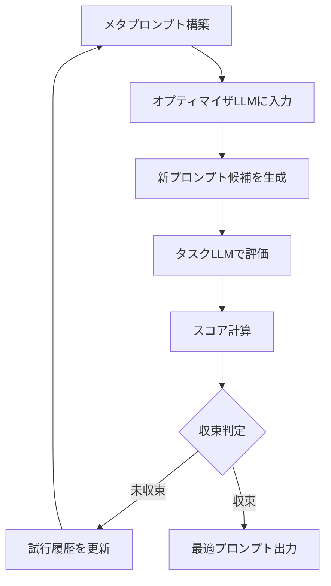

## 論文概要（Abstract）

本記事は [arXiv:2309.03409 "Large Language Models as Optimizers"](https://arxiv.org/abs/2309.03409) の解説記事である。Yang et al.（Google DeepMind）は、LLM自身を最適化器として活用し、自然言語で記述されたプロンプトを反復的に改善する手法「OPRO（Optimization by PROmpting）」を提案した。過去の試行（プロンプトとそのスコア）をメタプロンプトに含め、LLMに「より良いプロンプトを生成せよ」と指示する。GSM8K（数学推論）でzero-shot CoTの56%から72%へ、Big-Bench Hardの複数タスクで手動プロンプトを上回る結果が報告されている。

この記事は [Zenn記事: 実践プロンプトエンジニアリング：評価駆動で本番LLMアプリのプロンプトを継続改善する](https://zenn.dev/0h_n0/articles/e9bb5614d139b8) の深掘りです。

## 情報源

- **arXiv ID**: 2309.03409
- **URL**: [https://arxiv.org/abs/2309.03409](https://arxiv.org/abs/2309.03409)
- **著者**: Chengrun Yang, Xuezhi Wang, Yifeng Lu et al.（Google DeepMind）
- **発表年**: 2023年（ICLR 2024採択）
- **分野**: cs.LG, cs.AI, cs.CL

## 背景と動機（Background & Motivation）

プロンプトエンジニアリングの最大の課題は、タスクに対して最適なプロンプトを見つけることが試行錯誤に依存する点にある。Wei et al. (2022) のChain-of-Thought（CoT）プロンプティングでは「Let's think step by step」という一文がLLMの推論性能を劇的に向上させたが、このような効果的なフレーズの発見は偶然に頼る部分が大きかった。

著者らは、LLM自身がプロンプトの最適化器として機能できるという仮説を立てた。テキスト勾配や微分可能性に依存せず、自然言語のフィードバック（過去のスコア）のみからプロンプトを改善するアプローチである。この手法は、数値最適化問題（線形回帰、巡回セールスマン問題）でも動作することが確認されており、LLMの最適化能力の汎用性を示唆している。

## 主要な貢献（Key Contributions）

- **メタプロンプト設計**: 過去の試行履歴とスコアを含むメタプロンプトの構造を定義し、LLMが改善方向を推論できる形式を確立
- **スコア順ソート**: 過去の試行をスコアの昇順で提示することが、LLMの改善能力を引き出す上で重要であることを実証
- **汎用性の実証**: テキスト最適化（プロンプト）だけでなく、数値最適化（線形回帰、TSP）にもLLM最適化器が適用できることを確認
- **「Take a deep breath」の発見**: GSM8Kにおいて、OPROが自動生成した「Take a deep breath and work on this problem step-by-step」が従来のCoTプロンプトを上回る性能を示した

## 技術的詳細（Technical Details）

### OPROの最適化ループ

OPROの最適化プロセスは、以下のループで構成される。



### メタプロンプトの構造

メタプロンプトは以下の3つの要素で構成される（論文Figure 2より）。

**1. タスク記述**: 最適化対象のタスクを自然言語で説明する。

**2. 試行履歴**: 過去のプロンプトとそのスコアのペアをスコアの**昇順**で列挙する。これにより、LLMは「スコアが高いプロンプトの傾向」を推論できる。

**3. 生成指示**: 「より高いスコアを達成するプロンプトを生成せよ」という指示。

著者らの実験によると、試行履歴をスコアの**昇順**（低い→高い）で並べることが重要であり、降順やランダム順では最適化性能が低下する（論文Table 2より）。これは、LLMがコンテキストの末尾の情報を優先的に活用する傾向（Lost in the Middleで報告されたrecency bias）と整合する。

### 形式的な定義

最適化問題を以下のように定式化する。

$$
p^* = \arg\max_{p \in \mathcal{P}} \frac{1}{|D_{\text{val}}|} \sum_{(x, y) \in D_{\text{val}}} M(\text{LLM}_{\text{task}}(x; p), y)
$$

ここで、
- $p$: プロンプト（自然言語テキスト）
- $\mathcal{P}$: プロンプト空間（可能なプロンプトの集合）
- $D_{\text{val}}$: バリデーションデータ
- $M$: メトリック関数（正答率等）
- $\text{LLM}_{\text{task}}$: タスク実行用LLM
- $(x, y)$: 入力-正解ペア

各ステップ$t$で、オプティマイザLLMは過去の試行履歴からプロンプト候補を生成する。

$$
p_{t+1} \sim \text{LLM}_{\text{opt}}(\text{MetaPrompt}([(p_1, s_1), \ldots, (p_t, s_t)]))
$$

ここで$s_i = M(p_i)$はプロンプト$p_i$のスコアである。

### 最適化の収束特性

著者らの実験では、最適化は20〜40ステップで収束する傾向が報告されている（論文Figure 4より）。各ステップで8個のプロンプト候補を生成し、その中で最良のスコアを記録する方式が採用されている。

収束の安定性に関しては、以下の点が著者らにより指摘されている。

- **局所最適への収束**: 同一のフレーズパターンに固着する場合がある。対策として、温度パラメータの調整やランダム再スタートが有効
- **試行履歴の長さ制限**: コンテキストウィンドウの制約から、過去すべての試行を含めることはできない。直近の上位20〜30件のみを含める方式が推奨されている
- **スコアのノイズ**: バリデーションデータのサイズが小さい場合、スコアにノイズが含まれ最適化が不安定になる。著者らは50〜100件のバリデーションセットを推奨している

### 実装例

```python
from dataclasses import dataclass


@dataclass
class PromptTrial:
    """プロンプト試行の記録"""
    prompt: str
    score: float


def build_meta_prompt(
    task_description: str,
    trials: list[PromptTrial],
    max_trials: int = 20,
) -> str:
    """OPROのメタプロンプトを構築する

    Args:
        task_description: タスクの説明
        trials: 過去の試行リスト
        max_trials: メタプロンプトに含める最大試行数

    Returns:
        メタプロンプトテキスト
    """
    # スコア昇順でソート（重要: 高スコアが末尾に来る）
    sorted_trials = sorted(trials, key=lambda t: t.score)

    # 直近のmax_trials件のみ使用
    recent_trials = sorted_trials[-max_trials:]

    history = "\n".join(
        f"Prompt: {t.prompt}\nScore: {t.score:.3f}\n"
        for t in recent_trials
    )

    return (
        f"I have a language model that I want to use for the following task:\n"
        f"{task_description}\n\n"
        f"Below are some previous prompts with their scores. "
        f"The score ranges from 0 to 1, higher is better.\n\n"
        f"{history}\n"
        f"Generate a new prompt that will achieve a higher score "
        f"than all previous prompts. "
        f"Be creative and try different approaches.\n\n"
        f"New prompt:"
    )


def opro_optimize(
    task_description: str,
    evaluate_fn,
    optimizer_llm,
    max_steps: int = 30,
    candidates_per_step: int = 8,
) -> PromptTrial:
    """OPROによるプロンプト最適化を実行する

    Args:
        task_description: タスクの説明
        evaluate_fn: プロンプトを評価する関数
        optimizer_llm: オプティマイザLLM
        max_steps: 最大ステップ数
        candidates_per_step: 各ステップで生成する候補数

    Returns:
        最良のプロンプト試行
    """
    trials: list[PromptTrial] = []
    best_trial = PromptTrial(prompt="", score=0.0)

    for step in range(max_steps):
        meta_prompt = build_meta_prompt(task_description, trials)

        # 複数の候補を生成
        for _ in range(candidates_per_step):
            new_prompt = optimizer_llm.generate(
                meta_prompt,
                temperature=1.0,  # 多様性のため高めに設定
            )
            score = evaluate_fn(new_prompt)
            trial = PromptTrial(prompt=new_prompt, score=score)
            trials.append(trial)

            if score > best_trial.score:
                best_trial = trial

        # 早期終了判定（3ステップ改善なし）
        recent_best = max(t.score for t in trials[-candidates_per_step * 3:])
        if step > 5 and recent_best <= best_trial.score:
            break

    return best_trial
```

## 実装のポイント（Implementation）

**オプティマイザLLMとタスクLLMの分離**: 著者らはオプティマイザにGPT-4やPaLM 2-L、タスクLLMにGPT-3.5-turboやPaLM 2-Sを使用している。強力なモデルをオプティマイザに使い、コスト効率の高いモデルをタスク実行に使う分離が推奨されている。

**温度パラメータの調整**: オプティマイザLLMのtemperatureは0.8〜1.0と高めに設定し、多様な候補を生成する。タスクLLMのtemperatureは0.0〜0.3と低めに設定し、評価の安定性を確保する。

**コスト管理**: 各ステップで8候補 × 50バリデーション例 = 400回のタスクLLM呼び出しが発生する。30ステップで12,000回となるため、タスクLLMにはコスト効率の高いモデルを選択することが重要である。

**DSPyとの比較**: OPROはラベルデータが5〜10件程度の少量でも動作するが、パイプライン全体の最適化には対応していない。複数のLLM呼び出しを含むパイプラインにはDSPyが適しており、単一ステップのプロンプト最適化にはOPROが軽量な選択肢となる。

## Production Deployment Guide

### AWS実装パターン（コスト最適化重視）

OPROの最適化ループをAWS上で自動化する構成を示す。

| 規模 | 用途 | 推奨構成 | 月額コスト目安 | 主要サービス |
|------|------|---------|-------------|------------|
| **Small** | 週1回最適化 | Serverless | $50-150 | Lambda + Bedrock + S3 |
| **Medium** | 日次最適化 | Hybrid | $300-800 | Step Functions + Bedrock + DynamoDB |
| **Large** | 継続的最適化 | Container | $1,500-4,000 | ECS Fargate + Bedrock Batch |

**Small構成の詳細**（月額$50-150）:
- **Lambda**: 2GB RAM, 300秒タイムアウト（$20/月）。最適化ループの各ステップを1回のLambda実行で処理
- **Bedrock**: オプティマイザにClaude 3.5 Sonnet、タスクLLMにClaude 3.5 Haiku（$80/月）
- **S3**: 試行履歴と最適プロンプトの保存（$5/月）
- **EventBridge**: 週次スケジュールで最適化をトリガー（$0.1/月）

**コスト削減テクニック**:
- タスクLLMにHaikuクラスの低コストモデルを使用し、評価コストを削減
- Bedrock Batch APIで非リアルタイムの評価を50%割引で実行
- 試行履歴をS3に永続化し、前回の最適化結果から継続可能にする（ウォームスタート）

**コスト試算の注意事項**: 上記は2026年4月時点のAWS ap-northeast-1料金に基づく概算値である。OPROの最適化コストは主にタスクLLMの評価呼び出し数に依存するため、バリデーションセットのサイズとステップ数で大きく変動する。

### Terraformインフラコード

```hcl
# --- Step Functions（最適化ループの制御） ---
resource "aws_sfn_state_machine" "opro_optimizer" {
  name     = "opro-prompt-optimizer"
  role_arn = aws_iam_role.sfn_role.arn

  definition = jsonencode({
    Comment = "OPRO prompt optimization loop"
    StartAt = "GenerateCandidates"
    States = {
      GenerateCandidates = {
        Type     = "Task"
        Resource = aws_lambda_function.opro_generate.arn
        Next     = "EvaluateCandidates"
      }
      EvaluateCandidates = {
        Type     = "Task"
        Resource = aws_lambda_function.opro_evaluate.arn
        Next     = "CheckConvergence"
      }
      CheckConvergence = {
        Type = "Choice"
        Choices = [{
          Variable          = "$.converged"
          BooleanEquals     = true
          Next              = "SaveBestPrompt"
        }]
        Default = "GenerateCandidates"
      }
      SaveBestPrompt = {
        Type     = "Task"
        Resource = aws_lambda_function.opro_save.arn
        End      = true
      }
    }
  })
}

# --- Lambda（候補生成） ---
resource "aws_lambda_function" "opro_generate" {
  filename      = "opro_generate.zip"
  function_name = "opro-generate-candidates"
  role          = aws_iam_role.opro_lambda.arn
  handler       = "index.handler"
  runtime       = "python3.12"
  timeout       = 300
  memory_size   = 2048

  environment {
    variables = {
      OPTIMIZER_MODEL = "anthropic.claude-3-5-sonnet-20241022-v2:0"
      TASK_MODEL      = "anthropic.claude-3-5-haiku-20241022-v1:0"
      S3_BUCKET       = aws_s3_bucket.opro.id
    }
  }
}
```

### コスト最適化チェックリスト

- [ ] オプティマイザLLMに高性能モデル、タスクLLMに低コストモデルを使用
- [ ] バリデーションセットサイズを50〜100件に設定（精度とコストのバランス）
- [ ] 各ステップの候補数を4〜8に設定
- [ ] 早期終了条件を設定（3ステップ改善なしで終了）
- [ ] 試行履歴をS3に永続化しウォームスタート可能に
- [ ] Bedrock Batch APIで評価バッチを50%割引実行
- [ ] Step Functionsで最適化ループを管理（Lambda実行時間上限を回避）
- [ ] EventBridgeで定期実行スケジュールを設定

## 実験結果（Results）

著者らはGSM8K（数学推論）タスクを中心に、OPROの最適化効果を報告している（論文Table 1, Figure 4より）。

| プロンプト | GSM8K正答率（PaLM 2-L） | 情報源 |
|----------|----------------------|--------|
| 空プロンプト（baseline） | 34% | 論文Table 1 |
| "Let's think step by step" (Zero-shot CoT) | 56% | 論文Table 1 |
| "Take a deep breath and work on this problem step-by-step" (OPRO生成) | 72% | 論文Table 1 |
| 手動で調整したベストプロンプト | 62% | 論文Table 1 |

注目すべきは、OPROが自動生成した「Take a deep breath and work on this problem step-by-step」が、人間が手動で調整したベストプロンプトを10ポイント上回っていることである。このフレーズは一見すると「深呼吸」という無関係な指示を含むが、LLMに「慎重に取り組む」というメタ的な指示として機能していると著者らは考察している。

Big-Bench Hardタスクでも同様の傾向が報告されており、OPROが生成したプロンプトは人間の手動プロンプトと同等かそれ以上の性能を示している（論文Table 4より）。

## 実運用への応用（Practical Applications）

OPROは、Zenn記事で解説した評価駆動プロンプト開発の「自動化フェーズ」に位置づけられる。

**プロンプトの定期的な再最適化**: モデルバージョンの更新やデータ分布の変化に伴い、既存プロンプトの性能が低下する場合がある。OPROの最適化ループを定期的（週次/月次）に実行し、プロンプトを自動更新するワークフローが構築できる。

**Promptfooとの連携**: Zenn記事で紹介したPromptfooのテストケースをOPROのバリデーションセットとして再利用できる。Promptfooのスコアリング結果をOPROの評価関数にフィードバックすることで、CI/CDパイプラインと自動最適化を統合できる。

**A/Bテストの候補生成**: OPROで生成された複数のプロンプト候補を、A/Bテストの実験群として使用できる。人間が考えつかないフレーズパターンを自動で探索できるため、プロンプト設計の可能性空間を効率的に探索できる。

## 関連研究（Related Work）

- **APE (Automatic Prompt Engineer)** (Zhou et al., 2023): LLMにプロンプトを生成させる初期の手法。OPROとの違いは、APEが単発の生成であるのに対し、OPROは過去の試行履歴を活用した反復最適化を行う点
- **DSPy** (Khattab et al., 2023): 宣言的プロンプト最適化フレームワーク。OPROが単一プロンプトの最適化に特化するのに対し、DSPyはマルチステップパイプライン全体の最適化をサポート
- **TextGrad** (Yuksekgonul et al., 2024): テキスト勾配による最適化。OPROはスコアのみを入力とするのに対し、TextGradは「何を改善すべきか」の言語フィードバックを直接生成する

## まとめと今後の展望

OPROは「LLMに最適化をさせる」という概念を実証した研究であり、プロンプトの自動改善を実現する軽量かつ汎用的なアプローチを提供する。GSM8Kでの56%→72%という改善は、プロンプトのフレーズ選択がLLMの性能に大きく影響することを改めて示した。

ただし、コンテキストウィンドウの制約から試行履歴の長さに上限があること、局所最適への収束リスク、バリデーションセットの準備コストが実運用での課題として残る。2024年以降の研究では、OPROのアイデアをDSPyのMIPROv2やTextGradが発展させており、より洗練された自動最適化手法が登場しつつある。

## 参考文献

- **arXiv**: [https://arxiv.org/abs/2309.03409](https://arxiv.org/abs/2309.03409)
- **Code**: [https://github.com/google-deepmind/opro](https://github.com/google-deepmind/opro)
- **Related Zenn article**: [https://zenn.dev/0h_n0/articles/e9bb5614d139b8](https://zenn.dev/0h_n0/articles/e9bb5614d139b8)
