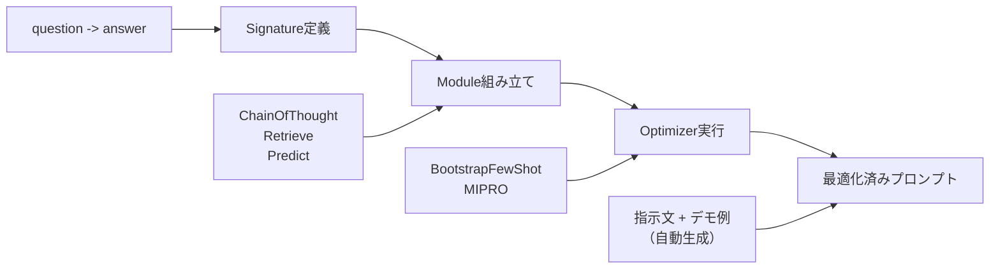

## 論文概要（Abstract）

本記事は [arXiv:2310.03714 "DSPy: Compiling Declarative Language Model Calls into Self-Improving Pipelines"](https://arxiv.org/abs/2310.03714) の解説記事である。Khattab et al.は、LLMパイプラインにおけるプロンプトを手動で調整する代わりに、タスクの入出力仕様を宣言的に定義し、コンパイラが少数のラベル付き例から自動的に最適なプロンプト（指示文+デモ例）を生成するフレームワーク「DSPy」を提案した。HotPotQAやGSM8Kを含む複数のベンチマークで、手動プロンプトを上回る性能を達成したと報告している。

この記事は [Zenn記事: 実践プロンプトエンジニアリング：評価駆動で本番LLMアプリのプロンプトを継続改善する](https://zenn.dev/0h_n0/articles/e9bb5614d139b8) の深掘りです。

## 情報源

- **arXiv ID**: 2310.03714
- **URL**: [https://arxiv.org/abs/2310.03714](https://arxiv.org/abs/2310.03714)
- **著者**: Omar Khattab, Arnav Singhvi, Paridhi Maheshwari et al.（Stanford University）
- **発表年**: 2023年（ICLR 2024採択）
- **分野**: cs.CL, cs.AI

## 背景と動機（Background & Motivation）

LLMアプリケーションの開発では、プロンプトの調整が大きな工数を占める。Few-shot例の選択、指示文の微調整、Chain-of-Thoughtの有無など、1つのタスクに対しても多数の設計判断が必要となる。さらに、モデルのバージョン更新やパイプラインの構成変更のたびに、プロンプトの再調整が発生する。

著者らはこの課題を「プロンプトのブリトル性（脆さ）」と呼び、解決策としてプロンプトをプログラムの一部として宣言的に記述し、自動最適化する方法論を提案した。DSPyの名前は「Declarative Self-improving Python」に由来し、PyTorchのように宣言的にモジュールを組み合わせ、コンパイラが最適化を担うアーキテクチャを採用している。

## 主要な貢献（Key Contributions）

- **Signature**: タスクの入出力仕様を宣言的に定義する記法。`"question -> answer"` のように簡潔に記述可能
- **Module**: ChainOfThought、Retrieve、Predict等の再利用可能なモジュール。PyTorchの`nn.Module`に相当
- **Optimizer（Teleprompter）**: BootstrapFewShot、MIPRO等の自動プロンプト最適化アルゴリズム
- **Assertion**: 出力の制約条件（長さ、形式等）を宣言的に定義し、自動リトライを実装

## 技術的詳細（Technical Details）

### DSPyのアーキテクチャ

DSPyのコンパイルフローは以下の3段階で構成される。



### Signatureの設計

Signatureは、タスクの入力フィールドと出力フィールドを宣言的に定義する。型アノテーションに似た記法で、プロンプトの「何を」実行するかを指定する（「どのように」は最適化器が決定する）。

```python
import dspy

# 基本的なSignature（文字列形式）
classify = dspy.Predict("sentence -> sentiment: bool")

# クラスベースのSignature（より詳細な制御）
class AnswerWithReasoning(dspy.Signature):
    """質問に対して段階的に推論し、回答を生成する"""

    context: str = dspy.InputField(desc="関連するコンテキスト情報")
    question: str = dspy.InputField(desc="ユーザーの質問")
    reasoning: str = dspy.OutputField(desc="段階的な推論過程")
    answer: str = dspy.OutputField(desc="最終的な回答")
```

Signatureからプロンプトへの変換はコンパイラが自動で行う。入力フィールドはユーザーメッセージに、出力フィールドは生成指示に変換される。`desc`パラメータは、最適化器が指示文を生成する際の手がかりとして使用される。

### BootstrapFewShotオプティマイザ

DSPyの中核的な最適化アルゴリズムであるBootstrapFewShotの動作を解説する。

$$
\text{BootstrapFewShot}(P, D_{\text{train}}, M) \rightarrow P^*
$$

ここで、
- $P$: 最適化対象のDSPyプログラム
- $D_{\text{train}}$: 訓練データ（入力-出力ペア、10〜50件程度）
- $M$: 評価指標（Metric関数）
- $P^*$: 最適化後のプログラム（各モジュールにデモ例が付与される）

アルゴリズムの手順は以下のとおりである。

1. **Teacher実行**: 訓練データ $D_{\text{train}}$ の各例について、プログラム $P$ を実行する
2. **成功例収集**: メトリック $M$ を満たす実行トレースを収集する。各モジュールの入出力ペアが記録される
3. **デモ例選択**: 収集した成功例から、各モジュールに最大$k$個のデモ例を選択する（デフォルト$k=4$）
4. **プロンプト構築**: デモ例をFew-shot形式でプロンプトに組み込む

```python
import dspy
from dspy.teleprompt import BootstrapFewShot


# 1. LLMの設定
lm = dspy.LM("openai/gpt-4o-mini", temperature=0.7)
dspy.configure(lm=lm)

# 2. プログラム定義
class RAGPipeline(dspy.Module):
    def __init__(self):
        self.retrieve = dspy.Retrieve(k=3)
        self.generate = dspy.ChainOfThought("context, question -> answer")

    def forward(self, question: str) -> dspy.Prediction:
        context = self.retrieve(question).passages
        return self.generate(context=context, question=question)


# 3. メトリック定義
def answer_quality(example, pred, trace=None) -> bool:
    """回答品質を評価するメトリック"""
    return dspy.evaluate.answer_exact_match(example, pred)


# 4. 最適化実行
optimizer = BootstrapFewShot(
    metric=answer_quality,
    max_bootstrapped_demos=4,  # 各モジュールの最大デモ例数
    max_labeled_demos=8,       # ラベル付きデモの最大数
)

compiled_rag = optimizer.compile(
    RAGPipeline(),
    trainset=train_examples,  # 10-50件のラベル付き例
)
```

### MIPROv2（より高度な最適化）

MIPROv2（Multi-prompt Instruction Proposal and Optimization）は、BootstrapFewShotを拡張し、デモ例の選択に加えて**指示文自体の最適化**も行う。

$$
P^* = \arg\max_{I, D} \frac{1}{|D_{\text{val}}|} \sum_{x \in D_{\text{val}}} M(P(x; I, D), y_x)
$$

ここで、
- $I$: 指示文（自然言語テキスト）
- $D$: デモ例の集合
- $D_{\text{val}}$: バリデーションデータ
- $M$: メトリック関数

MIPROv2はBayesian最適化を使用して、指示文とデモ例の組み合わせを効率的に探索する。著者らの報告によると、BootstrapFewShotと比較して平均2〜5ポイントの精度向上が得られるが、API呼び出し回数が5〜10倍増加する（論文Table 3より）。

### Assertionによる出力制約

DSPyのAssertionメカニズムは、出力が制約条件を満たさない場合に自動的にリトライを行う。

```python
class StructuredOutput(dspy.Module):
    def __init__(self):
        self.generate = dspy.ChainOfThought("question -> answer")

    def forward(self, question: str) -> dspy.Prediction:
        result = self.generate(question=question)

        # 出力制約: 回答は200文字以内
        dspy.Assert(
            len(result.answer) <= 200,
            "回答は200文字以内にしてください",
        )

        # 出力制約: 特定の形式を要求
        dspy.Suggest(
            result.answer.startswith("回答:"),
            "回答は「回答:」で始めてください",
        )

        return result
```

`dspy.Assert`は制約違反時にバックトラックしてリトライする（最大3回）。`dspy.Suggest`はソフトな制約で、違反してもエラーにならないが最適化時に考慮される。

## 実装のポイント（Implementation）

**訓練データの最小量**: BootstrapFewShotでは10〜20件のラベル付き例で動作するが、著者らの実験では50件程度で安定した結果が得られると報告されている。MIPROv2ではバリデーション用に追加で20〜50件が推奨される。

**メトリック設計の重要性**: 最適化の品質はメトリック関数に大きく依存する。Exact Matchのような厳密なメトリックだけでなく、LLM-as-Judgeベースのメトリック（前述のMT-Bench方式）を組み合わせることが著者らにより推奨されている。

**キャッシュの活用**: DSPyは内部でLLM呼び出しのキャッシュを持つ。同じ入力に対する繰り返し呼び出しを回避でき、最適化のAPIコスト削減に寄与する。

**デバッグのコツ**: `dspy.inspect_history(n=5)` で直近5回のLLM呼び出しログを確認できる。最適化がうまくいかない場合、Teacherの実行トレースを確認してデモ例の品質を検証することが有効である。

## Production Deployment Guide

### AWS実装パターン（コスト最適化重視）

DSPyパイプラインをAWS上で運用する場合の推奨構成を示す。

| 規模 | 月間リクエスト | 推奨構成 | 月額コスト目安 | 主要サービス |
|------|-------------|---------|-------------|------------|
| **Small** | ~3,000 | Serverless | $100-300 | Lambda + Bedrock + S3 |
| **Medium** | ~30,000 | Hybrid | $600-1,500 | ECS Fargate + Bedrock + ElastiCache |
| **Large** | 300,000+ | Container | $3,000-8,000 | EKS + Bedrock Batch + Redis |

**Small構成の詳細**（月額$100-300）:
- **Lambda**: 2GB RAM, 180秒タイムアウト（$40/月）。DSPyのコンパイル済みプログラムをロードし推論実行
- **Bedrock**: Claude 3.5 Haiku（$150/月）。Prompt Cachingでシステムプロンプト+デモ例をキャッシュ
- **S3**: コンパイル済みプログラムのシリアライズ保存（$5/月）。`compiled_program.save("s3://bucket/dspy/v1/")`
- **CloudWatch**: 基本監視（$5/月）

**コスト削減テクニック**:
- コンパイルは開発時に1回実行し、推論時はコンパイル済みプログラムをロードする→最適化のAPIコストは開発時のみ
- Bedrock Prompt Cachingでデモ例をキャッシュ（DSPyのFew-shot例は固定であるためキャッシュ効率が高い）
- BootstrapFewShotのデモ例数を3〜4に抑えてトークン消費を管理

**コスト試算の注意事項**: 上記は2026年4月時点のAWS ap-northeast-1料金に基づく概算値である。DSPyの最適化実行（コンパイル）は追加のAPIコストが発生する点に注意されたい。

### Terraformインフラコード

```hcl
# --- Lambda（DSPy推論） ---
resource "aws_lambda_function" "dspy_inference" {
  filename      = "dspy_lambda.zip"
  function_name = "dspy-inference-handler"
  role          = aws_iam_role.dspy_lambda.arn
  handler       = "index.handler"
  runtime       = "python3.12"
  timeout       = 180
  memory_size   = 2048

  environment {
    variables = {
      DSPY_PROGRAM_S3 = "s3://${aws_s3_bucket.dspy.id}/compiled/v1/"
      BEDROCK_MODEL   = "anthropic.claude-3-5-haiku-20241022-v1:0"
    }
  }
}

# --- S3（コンパイル済みプログラム保存） ---
resource "aws_s3_bucket" "dspy" {
  bucket = "dspy-compiled-programs"
}

resource "aws_s3_bucket_server_side_encryption_configuration" "dspy" {
  bucket = aws_s3_bucket.dspy.id
  rule {
    apply_server_side_encryption_by_default {
      sse_algorithm = "aws:kms"
    }
  }
}
```

### コスト最適化チェックリスト

- [ ] コンパイル（最適化）は開発時のみ実行、推論時はコンパイル済みプログラムをロード
- [ ] BootstrapFewShotのデモ例数を3〜4に設定（トークンコストとのバランス）
- [ ] Bedrock Prompt Cachingでシステムプロンプト+デモ例をキャッシュ
- [ ] コンパイル済みプログラムをS3に保存しLambdaから読み込み
- [ ] 開発時の最適化にBedrock Batch API（50%割引）を活用
- [ ] DSPy内部キャッシュを有効化（繰り返し呼び出しの回避）
- [ ] CloudWatch Logsでトークン消費量を追跡
- [ ] AWS Budgets月額予算アラートを設定

## 実験結果（Results）

著者らはDSPyの効果を複数のベンチマークで検証している（論文Table 2, 3より）。

| タスク | モデル | 手動CoTプロンプト | DSPy (BootstrapFewShot) | DSPy (MIPROv2) |
|--------|--------|-----------------|------------------------|----------------|
| HotPotQA | GPT-3.5-turbo | 29.0% | 36.0% (+7.0) | 39.5% (+10.5) |
| GSM8K | llama-2-13b-chat | 52.0% | 61.0% (+9.0) | 69.0% (+17.0) |
| MultiRC | GPT-3.5-turbo | 72.0% | 78.0% (+6.0) | 80.0% (+8.0) |

注目すべきは、GSM8K（数学推論）タスクにおいてllama-2-13b-chatのような比較的小型のモデルでも、DSPyの最適化により52%から69%へと17ポイントの改善が報告されていることである。これはプロンプト最適化によるモデル能力の引き出し効果を示唆している。

## 実運用への応用（Practical Applications）

DSPyは、Zenn記事で解説した評価駆動プロンプト開発と高い親和性を持つ。具体的な応用場面は以下のとおりである。

**プロンプトの自動最適化ループ**: Zenn記事ではPromptfooによる評価パイプラインとCI/CD統合を解説したが、DSPyはこの評価結果をフィードバックとしてプロンプトを自動改善する「クローズドループ」を実現する。手動でのプロンプト調整工数を削減できる。

**モデル切り替え時の自動再最適化**: DSPyのSignatureはモデル非依存であるため、モデルを変更した場合にもcompileを再実行するだけでプロンプトが自動調整される。Zenn記事で紹介したPromptAdapterパターンの一段上の抽象化と位置づけられる。

**パイプラインのモジュール化**: 複数のLLM呼び出しを含むパイプライン（RAG、マルチステップ推論等）において、各ステップのプロンプトを個別に最適化するのではなく、パイプライン全体のEnd-to-Endメトリックで最適化できる点が大きな利点である。

## 関連研究（Related Work）

- **APE (Automatic Prompt Engineer)** (Zhou et al., 2023): LLMにプロンプトを生成させ、評価で選択する初期の自動最適化手法。DSPyはこのアイデアを体系的なフレームワークに発展させた
- **OPRO** (Yang et al., 2023): LLM自身を最適化器として使用する手法。DSPyと比較してラベルデータの要件が少ないが、パイプライン全体の最適化には対応していない
- **TextGrad** (Yuksekgonul et al., 2024): テキスト空間での自動微分により任意の損失関数に対応する手法。DSPyより柔軟だがAPIコストが高い

## まとめと今後の展望

DSPyは「プロンプトを手動で書く」から「タスク仕様を宣言的に定義し、自動最適化する」へのパラダイムシフトを実現するフレームワークである。少数のラベル付き例（10〜50件）から効果的なプロンプトを自動生成でき、複数のベンチマークで手動プロンプトを上回る性能が報告されている。

ただし、最適化のAPI呼び出しコスト、ラベル付きデータの準備工数、複雑なパイプラインでの最適化の不安定性が実運用での課題として残る。2024年以降のDSPy 2.xではMIPROv2の安定性向上やアサーション機構の強化が進められており、プロダクション適用の事例が増加しつつある。

## 参考文献

- **arXiv**: [https://arxiv.org/abs/2310.03714](https://arxiv.org/abs/2310.03714)
- **Code**: [https://github.com/stanfordnlp/dspy](https://github.com/stanfordnlp/dspy)（MITライセンス）
- **Related Zenn article**: [https://zenn.dev/0h_n0/articles/e9bb5614d139b8](https://zenn.dev/0h_n0/articles/e9bb5614d139b8)
