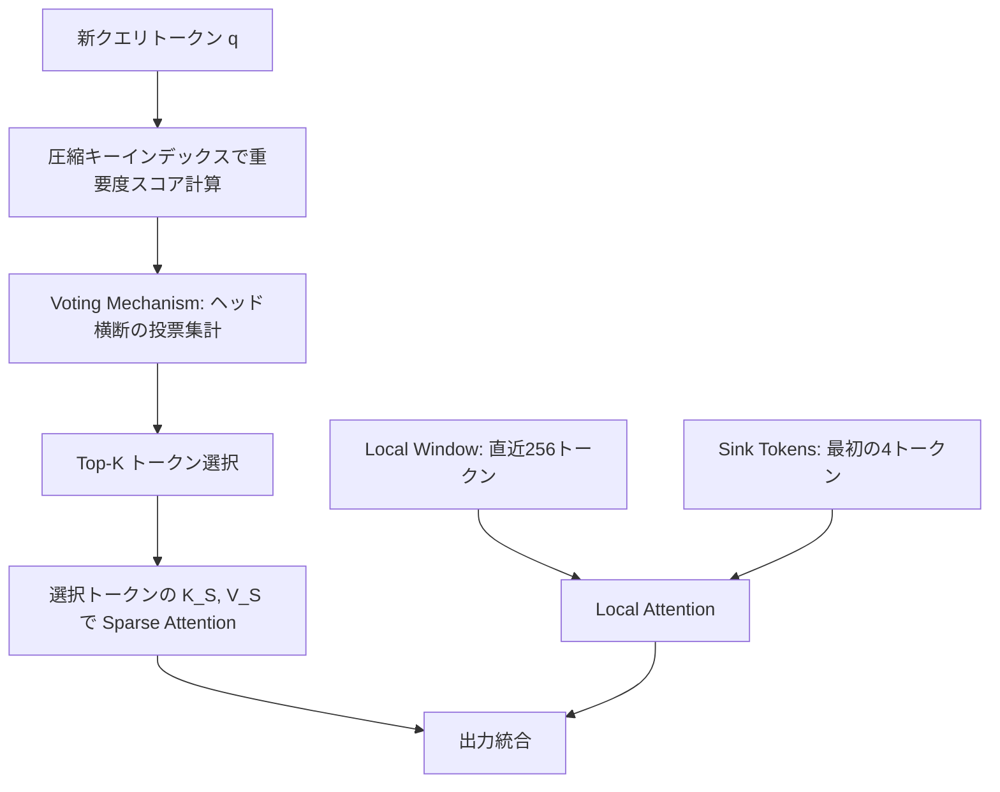
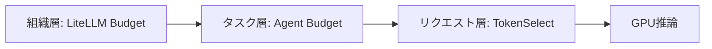
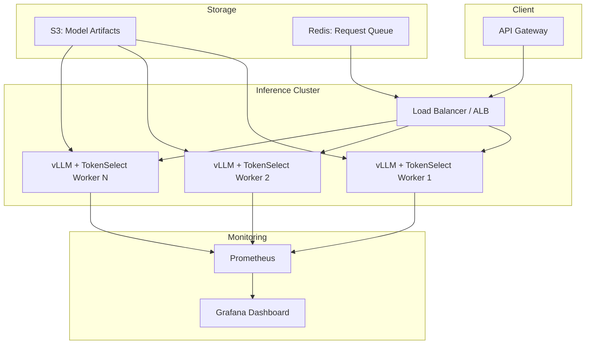

## 論文概要（Abstract）

TokenSelectは、LLMの長文推論におけるKVキャッシュの計算コスト問題に対して、**per-head動的トークンレベル選択**という新しいパラダイムを提案する手法である。従来のKVキャッシュ圧縮手法がトークンの永久削除や固定的な選択戦略に依存していたのに対し、TokenSelectはQuery-Keyドット積インデックスとVoting機構を組み合わせ、各アテンションヘッドが現在のクエリに基づいて動的にトークンを選択する。著者らは、128Kトークンのコンテキストにおいて精度損失1%未満（RULERベンチマークで64.3→63.7）でアテンション計算を最大23.84倍、End-to-End推論を最大2.28倍高速化したと報告している。

この記事は [Zenn記事: LLMエージェントのトークン予算管理：3層制御でAPI費用の暴走を防ぐ実装ガイド](https://zenn.dev/0h_n0/articles/95acc61229eba4) の深掘りです。

## 情報源

- **arXiv ID**: 2411.05159
- **URL**: [https://arxiv.org/abs/2411.05159](https://arxiv.org/abs/2411.05159)
- **著者**: Wei Wu, Zhuoshi Pan, Chao Wang, et al.
- **発表年**: 2024
- **分野**: cs.CL, cs.LG

## 背景と動機（Background & Motivation）

LLMの推論において、KVキャッシュはAuto-regressive生成の効率化に不可欠な機構である。しかし、コンテキスト長が増加するにつれ、KVキャッシュのメモリフットプリントとアテンション計算のオーバーヘッドは劇的に増大する。例えば、Gemini 1.5は2Mトークンのコンテキストをサポートするが、アテンション計算のコストはシーケンス長の二乗に比例して増加する。

著者らは、既存のKVキャッシュ最適化手法を2つのカテゴリに分類し、それぞれの根本的な問題を指摘している。

**Eviction-based手法**（H2O、StreamingLLM）は、重要度の低いトークンをKVキャッシュから**永久に削除**する。しかし、削除されたトークンが後続のクエリで必要になった場合、復元は不可能である。特にマルチターン対話や複雑な推論タスクでは、この永久削除が深刻な精度低下を引き起こす。

**Selection-based手法**（SnapKV、PyramidKV）は、KVキャッシュのサブセットを選択して使用する。しかし、これらの手法は**固定的な選択戦略**を採用しており、異なるクエリに対して同じトークン集合を選択してしまう。著者らは、この「クエリ非依存性」が精度低下の主要因であると分析している。

## 主要な貢献（Key Contributions）

- **Non-permanent dropping**: 全トークンをKVキャッシュに保持したまま、計算時のみ不要なトークンをスキップ。後続クエリで同じトークンが再び重要になれば即座に利用可能
- **Per-head dynamic selection**: 各アテンションヘッドが現在のクエリベクトルに基づいて独立にトークンを選択。異なるヘッドが異なるトークン集合を使用可能
- **Token-level granularity**: チャンク・ページ単位ではなくトークン単位の精密な選択。不要なトークンを含むチャンクごと選択する無駄を排除
- **Length generalization**: 訓練時のコンテキスト長（4K）の8倍（32K）まで精度を維持する汎化能力を実証

## 技術的詳細（Technical Details）

### アーキテクチャ概要

TokenSelectは標準的なTransformerアテンション機構に統合される追加モジュールであり、モデルのfine-tuningを必要としない。



### Query-Key Dot Product Index

TokenSelectの第一段階は、各アテンションヘッドにおける圧縮キーインデックスの構築である。クエリベクトル $q \in \mathbb{R}^d$ とキー行列 $K \in \mathbb{R}^{n \times d}$ に対して、$i$ 番目トークンの重要度スコアは以下で定義される。

$$S_i = \frac{q \cdot k_i}{\sqrt{d}}$$

ただし、全トークンとの完全なドット積計算はコストが高いため、著者らは圧縮キーインデックス $K_{\text{index}} \in \mathbb{R}^{n \times d'}$（$d' = d/4$、例: $d=128 \to d'=32$）を用いた近似を導入している。

$$\text{Score}_h(i) = \frac{q_h \cdot k_{\text{index},h}(i)}{\sqrt{d'}}$$

この圧縮インデックスは推論中にインクリメンタルに構築され、オフラインの前処理は不要である。メモリオーバーヘッドは約5%と著者らは報告している。

### Voting Mechanism

Voting機構は、各ヘッドの独立した判断を集約してトークンの重要度を決定する仕組みである。ヘッド $h$ のスコアがヘッド固有の閾値 $\theta_h$ を超えるかどうかを全ヘッドにわたって集計する。

$$\text{Vote}(i) = \sum_{h} \mathbb{1}[\text{Score}_h(i) > \theta_h]$$

トークン $i$ は $\text{Vote}(i) \geq V_{\min}$ の条件を満たす場合に選択候補となる。デフォルトでは $V_{\min} = 1$（少なくとも1つのヘッドが重要と判断すれば選択）が推奨されている。

### Token-Level Selection と Sparse Attention

投票結果に基づき、上位 $K$ 個のトークンが選択される。

$$\mathcal{S} = \text{top-}K(\{i : \text{Vote}(i) \geq V_{\min}\})$$

選択されたトークンの Key/Value のみを使用して Sparse Attention を実行する。

$$\text{Attention}(Q, K_{\mathcal{S}}, V_{\mathcal{S}}) = \text{softmax}\left(\frac{Q \cdot K_{\mathcal{S}}^T}{\sqrt{d}}\right) \cdot V_{\mathcal{S}}$$

加えて、以下の2種類のトークンは常にアテンション対象に含まれる。

| 常時包含トークン | 個数 | 根拠 |
|---|---|---|
| Sink Tokens（文頭トークン） | 4 | StreamingLLMの知見に基づく。文頭トークンは「アテンションシンク」として機能 |
| Local Window（直近トークン） | 256 | 直近のコンテキストは常に関連性が高い |

### 統合の5ステップ

各アテンション層において、TokenSelectは以下の5ステップで動作する。

1. **インデックス参照**: 新クエリトークンに対し、圧縮キーインデックスで各トークンの重要度スコアを計算
2. **ヘッド別判定**: 各ヘッドがスコアに基づき重要トークンを判定
3. **投票集計**: 全ヘッドの判定を集約し、Top-Kトークンを選択
4. **Sparse Attention**: 選択トークン + Sink + Local Windowに対してアテンションを実行
5. **出力統合**: Sparse AttentionとLocal Attentionの結果を統合

この処理はカスタムCUDAカーネルで実装されており、FlashAttentionスタイルの実装と互換性があると著者らは述べている。

## 実験結果（Experimental Results）

### 実験設定

著者らは以下の条件で評価を実施している。

- **モデル**: LLaMA-3-8B-Instruct、LLaMA-3-70B-Instruct、Mistral-7B-Instruct-v0.3
- **コンテキスト長**: 32K、64K、128Kトークン
- **ベンチマーク**: RULER、LongBench、Needle-in-a-Haystack
- **ハードウェア**: NVIDIA A100 80GB GPU

### 精度比較

**RULERベンチマーク（128Kコンテキスト、LLaMA-3-8B）**

| 手法 | 方式 | スコア | Full Attentionからの損失 |
|---|---|---|---|
| Full Attention | — | 64.3 | — |
| **TokenSelect (20%)** | **非永続・per-head動的** | **63.7** | **-0.6** |
| PyramidKV | 非永続・固定 | 54.8 | -9.5 |
| SnapKV | 非永続・固定 | 51.2 | -13.1 |
| H2O | 永久削除 | 41.3 | -23.0 |
| StreamingLLM | 永久削除 | 38.7 | -25.6 |

著者らは、TokenSelectが20%のSelection Budgetで精度損失をわずか0.6ポイントに抑えている点を強調している。一方、既存のSelection-based手法であるSnapKVは13.1ポイント、Eviction-based手法のH2Oは23.0ポイントの損失を示している。

**LongBench（LLaMA-3-8B）**

| 手法 | スコア | 損失 |
|---|---|---|
| Full Attention | 44.1 | — |
| **TokenSelect** | **43.8** | **-0.3** |
| PyramidKV | 41.1 | -3.0 |
| SnapKV | 40.2 | -3.9 |
| H2O | 36.4 | -7.7 |

LongBenchにおいても損失は0.3ポイントに留まり、実用上無視できるレベルであると著者らは報告している。

### 速度性能

| コンテキスト長 | Attention高速化 | End-to-End高速化 |
|---|---|---|
| 32K | 5.2x | 1.45x |
| 64K | 11.3x | 1.89x |
| 128K | **23.84x** | **2.28x** |

Attention計算の高速化とEnd-to-Endの高速化に大きな差がある点について、著者らはPrefillフェーズが現在の実装では加速対象外であることを要因として挙げている。つまり、Decodeフェーズのみが高速化の恩恵を受ける。

### Selection Budget感度分析

著者らは128KコンテキストのRULERベンチマークにおけるBudget感度を以下のように報告している。

| Selection Budget | スコア | 損失 |
|---|---|---|
| 5% | 59.1 | -5.2 |
| 10% | 62.8 | -1.5 |
| 15% | 63.5 | -0.8 |
| 20% | 63.7 | -0.6 |
| 30% | 63.9 | -0.4 |

**15-20%のBudgetが精度/速度のトレードオフとして最適**であると著者らは推奨している。5%では精度損失が5.2ポイントに拡大し、30%では速度面のメリットが減少する。

### コンポーネントアブレーション

| 設定 | RULERスコア |
|---|---|
| Full TokenSelect | 63.7 |
| w/o Voting（per-head独立選択） | 61.2 |
| w/o Local Window | 58.3 |

Voting機構の除去で2.5ポイント、Local Windowの除去で5.4ポイントの精度低下が生じており、両コンポーネントがTokenSelectの精度維持に重要な役割を果たしていることが確認されている。

### 長さ汎化（Length Generalization）

著者らは4Kトークンで訓練されたモデルをより長いコンテキストでテストした結果を報告している。

| テスト長 | TokenSelect | Full Attention | 差分 |
|---|---|---|---|
| 8K（2倍） | 89.2 | 82.1 | +7.1 |
| 16K（4倍） | 84.3 | 71.4 | +12.9 |
| 32K（8倍） | 79.1 | 58.2 | +20.9 |

TokenSelectは訓練時コンテキスト長の8倍においてFull Attentionを20.9ポイント上回っている。著者らは、動的トークン選択が関連コンテキストへの集中を促し、未見の長さに対する汎化を助けると分析している。

## 既存手法との比較

### KVキャッシュ最適化手法の分類

| 手法 | 削除方式 | 選択粒度 | クエリ適応 | Fine-tuning | 主な弱点 |
|---|---|---|---|---|---|
| **TokenSelect** | 非永続 | トークン/per-head | 動的 | 不要 | メモリ削減なし |
| H2O | 永久削除 | トークン | 部分的 | 不要 | 復元不可 |
| StreamingLLM | 永久削除 | Sink+Recent | なし | 不要 | 中間コンテキスト消失 |
| SnapKV | 非永続 | チャンク/per-layer | なし | 不要 | 固定選択 |
| PyramidKV | 非永続 | チャンク/per-layer | なし | 不要 | 固定バジェット |
| RazorAttention | 非永続 | — | 動的 | **必要** | Fine-tuningコスト |

TokenSelectの最大の差別化要因は、**非永続 + per-head動的 + fine-tuning不要**の3条件を同時に満たす唯一の手法である点である。

### トークン予算管理との関連

本論文の手法は、Zenn記事で解説した3層トークン予算管理アーキテクチャの**リクエスト層**における最適化として位置づけられる。各推論リクエストのアテンション計算において、TokenSelectは自動的に不要なトークンをスキップし、実質的な「トークン予算」を15-20%に圧縮する。これにより、同一のコンテキスト長でもGPUメモリ帯域とFLOPsの消費を大幅に削減できる。

## 実装のポイント

### 基本的な統合パターン

```python
from dataclasses import dataclass
import torch
from typing import Optional

@dataclass
class TokenSelectConfig:
    """TokenSelectのハイパーパラメータ設定。

    Args:
        selection_budget: 選択するトークンの割合（0.0-1.0）。
            論文推奨値は0.15-0.20（Table 7, Section 4.4参照）。
        local_window_size: 常に含む直近トークン数。
            論文デフォルト値は256（Section 2.4参照）。
        sink_tokens: 常に含む文頭トークン数。
            StreamingLLMの知見に基づくデフォルト値4。
        min_votes: 選択に必要な最小投票数。
            V_min=1が論文推奨（Section 4.4参照）。
        index_dim_ratio: 圧縮インデックスの次元比率（d'/d）。
            論文デフォルト値は0.25（d'=d/4）。
    """
    selection_budget: float = 0.20
    local_window_size: int = 256
    sink_tokens: int = 4
    min_votes: int = 1
    index_dim_ratio: float = 0.25


def compute_importance_scores(
    query: torch.Tensor,
    compressed_key_index: torch.Tensor,
    d_prime: int,
) -> torch.Tensor:
    """圧縮キーインデックスによる重要度スコア計算。

    Args:
        query: クエリベクトル [batch, heads, d']
        compressed_key_index: 圧縮キーインデックス [batch, heads, seq_len, d']
        d_prime: 圧縮次元数

    Returns:
        重要度スコア [batch, heads, seq_len]
    """
    # Score_h(i) = q_h · k_index_h(i) / sqrt(d')
    scores = torch.einsum(
        "bhd,bhnd->bhn", query, compressed_key_index
    ) / (d_prime ** 0.5)
    return scores


def voting_and_selection(
    scores: torch.Tensor,
    config: TokenSelectConfig,
    seq_len: int,
) -> torch.Tensor:
    """Voting機構によるトークン選択。

    Args:
        scores: 各ヘッドの重要度スコア [batch, heads, seq_len]
        config: TokenSelect設定
        seq_len: シーケンス長

    Returns:
        選択されたトークンのインデックス [batch, k]
    """
    # ヘッドごとの閾値（中央値ベース）
    thresholds = scores.median(dim=-1, keepdim=True).values

    # 投票: 閾値を超えるヘッド数を集計
    votes = (scores > thresholds).sum(dim=1)  # [batch, seq_len]

    # 最小投票数フィルタ
    votes[votes < config.min_votes] = -1

    # Sink tokens と Local window は常に最大スコア
    votes[:, :config.sink_tokens] = votes.max() + 1
    votes[:, -config.local_window_size:] = votes.max() + 1

    # Top-K 選択
    k = max(int(seq_len * config.selection_budget), config.sink_tokens + config.local_window_size)
    _, selected_indices = votes.topk(k, dim=-1)

    return selected_indices.sort(dim=-1).values
```

### デプロイ時の制約

論文が明記している実装上の制約は以下の通りである。

1. **Prefillフェーズ非対応**: 現在の実装ではDecodeフェーズのみ高速化。Prefillが支配的なワークロード（長文の初回処理）では恩恵が限定的
2. **メモリ削減なし**: 全トークンのKVキャッシュをメモリに保持するため、メモリ使用量は削減されない。メモリが制約の場合はH2OやStreamingLLMの併用を検討
3. **カスタムCUDAカーネル必要**: フル高速化にはカスタムCUDAカーネルが必要。標準のPyTorch実装では速度優位が得られない
4. **HuggingFace互換**: 標準的なHuggingFace Transformersモデルに軽微な修正で適用可能。Fine-tuning不要

## 実運用への応用

### トークン予算管理における位置づけ

TokenSelectは、3層トークン予算管理アーキテクチャの中で以下のように位置づけられる。



- **組織層**（LiteLLM等）: 月次・チーム別のAPI費用上限管理
- **タスク層**（Agent Budget）: タスクごとのトークン消費上限
- **リクエスト層**（TokenSelect）: 個々の推論リクエストにおけるアテンション計算の最適化

TokenSelectはリクエスト層での最適化として、**同一入力に対するGPU計算コストを自動的に削減**する。アプリケーション側のトークン予算管理（組織層・タスク層）と直交する最適化であるため、両者を組み合わせることで多層的なコスト制御が実現できる。

## Production Deployment Guide

### アーキテクチャ構成

TokenSelectを活用した長文推論サービスのプロダクション構成を示す。



### 規模別構成

| 構成 | GPU | 想定スループット | 月額概算（USD） |
|---|---|---|---|
| Small | A10G x1 | ~10 req/min (32K ctx) | ~$800 |
| Medium | A100 40GB x2 | ~30 req/min (64K ctx) | ~$5,000 |
| Large | A100 80GB x4 | ~50 req/min (128K ctx) | ~$15,000 |

### Terraform構成例（AWS ECS + GPU）

```hcl
# --- variables.tf ---
variable "environment" {
  type    = string
  default = "production"
}

variable "gpu_instance_type" {
  type    = string
  default = "g5.2xlarge"  # A10G GPU
}

variable "selection_budget" {
  type    = number
  default = 0.20
  description = "TokenSelect selection budget (0.15-0.20 recommended)"
}

# --- ecs.tf ---
resource "aws_ecs_cluster" "tokenselect_inference" {
  name = "tokenselect-inference-${var.environment}"

  setting {
    name  = "containerInsights"
    value = "enabled"
  }
}

resource "aws_ecs_task_definition" "tokenselect_worker" {
  family                   = "tokenselect-worker"
  requires_compatibilities = ["EC2"]
  network_mode             = "awsvpc"
  cpu                      = 8192
  memory                   = 32768

  container_definitions = jsonencode([
    {
      name  = "vllm-tokenselect"
      image = "${aws_ecr_repository.inference.repository_url}:latest"
      essential = true

      resourceRequirements = [
        {
          type  = "GPU"
          value = "1"
        }
      ]

      environment = [
        { name = "MODEL_NAME", value = "meta-llama/Llama-3-8B-Instruct" },
        { name = "TOKENSELECT_BUDGET", value = tostring(var.selection_budget) },
        { name = "TOKENSELECT_LOCAL_WINDOW", value = "256" },
        { name = "TOKENSELECT_SINK_TOKENS", value = "4" },
        { name = "MAX_MODEL_LEN", value = "131072" },
        { name = "GPU_MEMORY_UTILIZATION", value = "0.90" },
      ]

      portMappings = [
        { containerPort = 8000, protocol = "tcp" }
      ]

      logConfiguration = {
        logDriver = "awslogs"
        options = {
          "awslogs-group"         = "/ecs/tokenselect-${var.environment}"
          "awslogs-region"        = "ap-northeast-1"
          "awslogs-stream-prefix" = "worker"
        }
      }

      healthCheck = {
        command     = ["CMD-SHELL", "curl -f http://localhost:8000/health || exit 1"]
        interval    = 30
        timeout     = 10
        retries     = 3
        startPeriod = 120
      }
    }
  ])
}

# --- autoscaling.tf ---
resource "aws_appautoscaling_target" "tokenselect_scaling" {
  max_capacity       = 8
  min_capacity       = 1
  resource_id        = "service/${aws_ecs_cluster.tokenselect_inference.name}/${aws_ecs_service.tokenselect.name}"
  scalable_dimension = "ecs:service:DesiredCount"
  service_namespace  = "ecs"
}

resource "aws_appautoscaling_policy" "gpu_utilization" {
  name               = "tokenselect-gpu-scaling"
  policy_type        = "TargetTrackingScaling"
  resource_id        = aws_appautoscaling_target.tokenselect_scaling.resource_id
  scalable_dimension = aws_appautoscaling_target.tokenselect_scaling.scalable_dimension
  service_namespace  = aws_appautoscaling_target.tokenselect_scaling.service_namespace

  target_tracking_scaling_policy_configuration {
    predefined_metric_specification {
      predefined_metric_type = "ECSServiceAverageCPUUtilization"
    }
    target_value       = 70.0
    scale_in_cooldown  = 300
    scale_out_cooldown = 60
  }
}
```

### 監視メトリクス

TokenSelectデプロイメントで監視すべき主要メトリクスは以下の通りである。

```python
from prometheus_client import Histogram, Counter, Gauge

# TokenSelect固有メトリクス
SELECTION_RATIO = Histogram(
    "tokenselect_selection_ratio",
    "Ratio of tokens selected per attention layer",
    buckets=[0.05, 0.10, 0.15, 0.20, 0.25, 0.30, 0.50],
)

ATTENTION_SPEEDUP = Histogram(
    "tokenselect_attention_speedup_ratio",
    "Attention computation speedup vs full attention",
    buckets=[1.0, 2.0, 5.0, 10.0, 15.0, 20.0, 25.0],
)

CONTEXT_LENGTH = Histogram(
    "tokenselect_context_length_tokens",
    "Input context length in tokens",
    buckets=[4096, 8192, 16384, 32768, 65536, 131072],
)

# 品質監視
QUALITY_SCORE = Gauge(
    "tokenselect_quality_score",
    "Periodic quality evaluation score (0-100)",
)

CACHE_HIT_RATE = Gauge(
    "tokenselect_voting_cache_hit_rate",
    "Ratio of tokens consistently selected across consecutive queries",
)
```

**アラート設定例**:

| メトリクス | 閾値 | アクション |
|---|---|---|
| selection_ratio > 0.40 | Warning | Budget設定を確認 |
| attention_speedup < 2.0 (128K) | Critical | CUDAカーネル動作を確認 |
| quality_score < 60 | Critical | V_minまたはBudgetを調整 |
| GPU memory > 90% | Warning | インスタンスサイズ変更を検討 |

## 関連研究

- **TALE** (arXiv:2412.18547): トークン予算をLLM自身が推定・配分する手法。TokenSelectがアテンション計算レベルの最適化であるのに対し、TALEは推論ステップ数の制御に焦点
- **vLLM** (PagedAttention): KVキャッシュのメモリ管理を仮想メモリ方式で効率化。TokenSelectのSparse Attentionと組み合わせることで、メモリ効率と計算効率の両方を最適化可能
- **FlashAttention**: IO-awareなアテンション計算の最適化。TokenSelectのカスタムCUDAカーネルはFlashAttentionの設計思想と互換
- **Mem0** (arXiv:2503.10657): エージェントの長期記憶管理。TokenSelectがリクエスト単位の推論を最適化するのに対し、Mem0はセッション横断の記憶を圧縮・管理する相補的なアプローチ

## まとめ

TokenSelectは、LLM長文推論におけるKVキャッシュ最適化の新しいパラダイムを提示した手法である。**非永続 + per-head動的 + トークンレベル**という3つの設計原則の組み合わせにより、128Kコンテキストで精度損失0.6ポイント（RULER）、End-to-End 2.28倍の高速化を達成している。

特に注目すべきは長さ汎化能力であり、4Kで訓練されたモデルが32Kで79.1のスコアを維持（Full Attention: 58.2）する点は、限られた訓練リソースで長文対応を実現する実践的な価値を持つ。

一方、全KVキャッシュをメモリに保持する設計のため、メモリ削減には寄与しない。メモリ制約が厳しい環境では、H2OやStreamingLLMとの組み合わせや、vLLMのPagedAttentionとの統合が現実的な選択肢となる。トークン予算管理の観点では、TokenSelectはリクエスト層の計算コスト最適化として、組織層・タスク層の予算管理と組み合わせることで多層的なコスト制御を実現する手法として位置づけられる。
