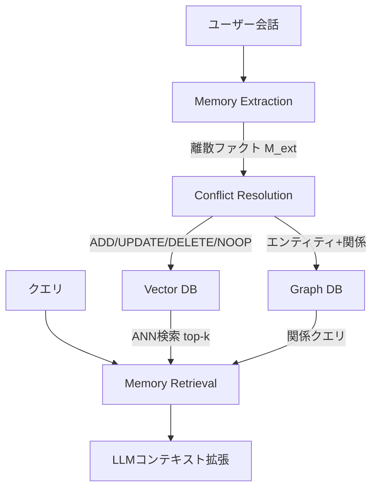

## 論文概要（Abstract）

本記事は [arXiv:2503.10657](https://arxiv.org/abs/2503.10657) の解説記事です。

Mem0（「メム・ゼロ」と発音）は、AIエージェント向けのスケーラブルなメモリ層である。会話からセマンティックに関連する情報を離散ファクトとして抽出し、ベクターデータベースとグラフデータベースのハイブリッドストレージに保存する。著者らは、LOCOMOベンチマークにおいてFull Context（全会話履歴をコンテキストに渡す手法）と比較して**トークン消費を97.3%削減**しつつ、平均F1スコアを0.26から0.35に**35%向上**させたと報告している。MITライセンスのオープンソースとして公開されている。

この記事は [Zenn記事: LLMエージェントのトークン予算管理：3層制御でAPI費用の暴走を防ぐ実装ガイド](https://zenn.dev/0h_n0/articles/95acc61229eba4) の深掘りです。

## 情報源

- **arXiv ID**: 2503.10657
- **URL**: [https://arxiv.org/abs/2503.10657](https://arxiv.org/abs/2503.10657)
- **著者**: Mem0 AI チーム
- **発表年**: 2025
- **分野**: cs.AI, cs.CL
- **コード**: [https://github.com/mem0ai/mem0](https://github.com/mem0ai/mem0)（MITライセンス）

## 背景と動機（Background & Motivation）

LLMエージェントの長期会話における根本的な制約は**コンテキストウィンドウの有限性**である。Zenn記事で解説したように、マルチターン会話ではコンテキストに過去の全やり取りが蓄積され、入力トークンが加速度的に増加する。

従来の対策にはそれぞれ限界がある：

- **Full Context**: 全会話履歴をコンテキストに渡す方法。トークンコストが高騰し、コンテキストウィンドウの上限に到達する
- **RAG（Retrieval-Augmented Generation）**: 会話をチャンクに分割してベクターDBに格納し、検索する方法。ユーザーの好みや個人的事実などの構造化情報の取り扱いが困難
- **MemGPT**: LLMをCPUに見立て、メインコンテキストと外部コンテキスト間で情報をやり取りするOS風アプローチ。要約時に正確な情報が失われるリスクがある

Mem0はこれらの課題に対し、**LLMベースのファクト抽出 + ハイブリッドストレージ（ベクターDB + グラフDB）**という構成で、精度・トークン効率・レイテンシの三点を同時に改善するアプローチを提案している。

## 主要な貢献（Key Contributions）

- **貢献1**: 会話から離散ファクトを抽出し、コンフリクト解決を自動で行うメモリ管理システム
- **貢献2**: ベクターDB（セマンティック検索）とグラフDB（関係コンテキスト）のハイブリッドストレージ
- **貢献3**: LOCOMOおよびMemoryBenchでの全ベースライン上回る性能と97.3%のトークン圧縮率
- **貢献4**: 5億件超のメモリ、月間2億APIコール、10万人以上の開発者という本番規模の実績

## 技術的詳細（Technical Details）

### システムアーキテクチャ

Mem0は3つのモジュールで構成される。



#### Memory Extraction（メモリ抽出）

ユーザーの会話入力をLLMに渡し、セマンティックに関連するファクトを離散的なメモリ集合 $M_{ext} = \{m_1, m_2, \ldots, m_n\}$ として抽出する。LLMはユーザーの好み、事実、経験を明示的に識別するようプロンプトされる。

抽出されたメモリは既存メモリ $M_{existing}$ と比較され、コンフリクト解決が行われる。

#### Memory Storage（メモリ保存）

**ベクターデータベース**:

各メモリをEmbeddingモデルで密ベクトル表現に変換し、格納する。検索時はクエリを同様にEmbedding化し、ANN（Approximate Nearest Neighbor）アルゴリズムで類似メモリを取得する。

**グラフデータベース**:

エンティティ（ユーザーの好み、習慣、活動、事実）をノードとして、エンティティ間の関係をエッジとして格納する。LLMがユーザーの入力からエンティティと関係を抽出し、グラフに追加する。

| 観点 | Vector DB | Graph DB |
|------|-----------|----------|
| 目的 | セマンティック類似度検索 | 関係コンテキスト保持 |
| 保存形式 | 密ベクトル埋め込み | ノード + エッジ |
| 検索方法 | ANN（近似最近傍） | グラフクエリ |

#### Conflict Resolution（コンフリクト解決）

新規抽出メモリと既存メモリの関係をLLMが判定し、以下の4つの操作のいずれかを実行する：

- **ADD**: 既存メモリと無関係な新規メモリ → 両DBに追加
- **UPDATE**: 既存メモリの更新（例: 「ソフトウェアエンジニア」→「シニアソフトウェアエンジニア」）
- **DELETE**: 既存メモリと矛盾する情報の削除（例: 特定の好みの明示的否定）
- **NOOP**: 冗長な抽出メモリ → 何もしない

### アルゴリズム

Mem0のメモリ管理フローをPythonで示す：

```python
from mem0 import MemoryClient
from typing import Any


def mem0_workflow_example() -> None:
    """Mem0のメモリ管理ワークフロー例

    1. 会話からメモリを抽出・保存
    2. クエリに基づいてメモリを検索
    3. 検索結果をLLMコンテキストに注入
    """
    client = MemoryClient(api_key="your-api-key")

    # ステップ1: 会話からメモリを抽出・保存
    messages: list[dict[str, str]] = [
        {"role": "user", "content": "Pythonが好きで、最近FastAPIを学んでいます。"},
        {"role": "assistant", "content": "FastAPIは高速なAPIフレームワークですね。"},
        {"role": "user", "content": "東京在住で、朝型の生活をしています。"},
    ]
    client.add(messages, user_id="user_123")
    # → 抽出されるファクト:
    #   - "Pythonが好き"
    #   - "FastAPIを学習中"
    #   - "東京在住"
    #   - "朝型の生活"

    # ステップ2: クエリに基づいてメモリを検索
    results: list[dict[str, Any]] = client.search(
        "プログラミングの好み", user_id="user_123"
    )
    # → ベクターDB + グラフDB から関連メモリを取得

    # ステップ3: 全メモリの取得
    all_memories: list[dict[str, Any]] = client.get_all(user_id="user_123")

    for memory in all_memories:
        print(f"Memory: {memory}")
```

## 実装のポイント（Implementation）

**デプロイオプション**:

Mem0は3つのデプロイ方式を提供する：
1. **マネージドクラウド**: mem0.ai のAPI経由で即利用可能
2. **セルフホスト（フル）**: Neo4j（グラフDB）+ ベクターストアをオンプレミス/プライベートクラウドに構築
3. **セルフホスト（ライト）**: ベクターストアのみ（グラフDBなし）

**メモリ抽出のLLM呼び出しコスト**: 毎ターンのメモリ抽出にLLM呼び出しが発生する。著者らの本番環境ではメモリ追加のp95レイテンシが500ms未満、中央値が100ms未満と報告されている。

**メモリ幻覚リスク**: LLMがユーザーが明示的に述べていないメモリを生成する可能性がある。本番環境では抽出メモリの検証ステップを追加することが推奨される。

**グラフDBの運用コスト**: Neo4j等のグラフDBの運用は複雑でコストがかかる。ベクターストアのみのライト構成も選択肢となるが、関係クエリの精度が低下するトレードオフがある。

## Production Deployment Guide

### AWS実装パターン（コスト最適化重視）

Mem0のハイブリッドストレージをAWS上で構築するパターンを示す。

**トラフィック量別の推奨構成**:

| 規模 | 月間リクエスト | 推奨構成 | 月額コスト概算 | 主要サービス |
|------|--------------|---------|-------------|------------|
| **Small** | ~3,000 (100/日) | Serverless | $80-200 | Lambda + Bedrock + OpenSearch Serverless |
| **Medium** | ~30,000 (1,000/日) | Hybrid | $400-1,000 | ECS Fargate + OpenSearch + Neptune Serverless |
| **Large** | 300,000+ (10,000/日) | Container | $2,000-5,000 | EKS + OpenSearch + Neptune + ElastiCache |

**Small構成の詳細** (月額$80-200):
- **Lambda**: メモリ抽出・検索ハンドラ 1GB RAM ($20/月)
- **Bedrock (Haiku)**: ファクト抽出・コンフリクト解決 ($30/月)
- **OpenSearch Serverless**: ベクター検索（2 OCU最小） ($50/月)
- **DynamoDB**: メモリメタデータ On-Demand ($10/月)

**コスト削減テクニック**:
- ファクト抽出にHaikuクラスの小型モデルを使用（Sonnet比1/3コスト）
- 高頻度クエリのメモリ検索結果をElastiCacheにキャッシュ
- OpenSearch Serverlessの最小OCU設定でアイドルコスト削減
- Neptune ServerlessでグラフDB運用コストを変動費化

**コスト試算の注意事項**:
- 上記は2026年4月時点のAWS ap-northeast-1（東京）リージョン料金に基づく概算値です
- OpenSearch Serverlessの最小コスト（2 OCU）が比較的高いため、Small規模ではDynamoDB + Embeddingのシンプル構成も検討してください
- 最新料金は [AWS料金計算ツール](https://calculator.aws/) で確認してください

### Terraformインフラコード

**Small構成 (Serverless)**

```hcl
# --- IAMロール ---
resource "aws_iam_role" "mem0_lambda" {
  name = "mem0-lambda-role"

  assume_role_policy = jsonencode({
    Version = "2012-10-17"
    Statement = [{
      Action    = "sts:AssumeRole"
      Effect    = "Allow"
      Principal = { Service = "lambda.amazonaws.com" }
    }]
  })
}

resource "aws_iam_role_policy" "mem0_services" {
  role = aws_iam_role.mem0_lambda.id

  policy = jsonencode({
    Version = "2012-10-17"
    Statement = [
      {
        Effect   = "Allow"
        Action   = ["bedrock:InvokeModel"]
        Resource = "arn:aws:bedrock:ap-northeast-1::foundation-model/anthropic.claude-3-5-haiku*"
      },
      {
        Effect   = "Allow"
        Action   = ["aoss:APIAccessAll"]
        Resource = "*"
      }
    ]
  })
}

# --- Lambda（メモリ抽出・検索） ---
resource "aws_lambda_function" "mem0_handler" {
  filename      = "mem0_lambda.zip"
  function_name = "mem0-memory-handler"
  role          = aws_iam_role.mem0_lambda.arn
  handler       = "index.handler"
  runtime       = "python3.12"
  timeout       = 60
  memory_size   = 1024

  environment {
    variables = {
      EXTRACTION_MODEL = "anthropic.claude-3-5-haiku-20241022-v1:0"
      OPENSEARCH_ENDPOINT = "placeholder"
      DYNAMODB_TABLE      = aws_dynamodb_table.mem0_metadata.name
    }
  }
}

# --- DynamoDB（メモリメタデータ） ---
resource "aws_dynamodb_table" "mem0_metadata" {
  name         = "mem0-memory-metadata"
  billing_mode = "PAY_PER_REQUEST"
  hash_key     = "user_id"
  range_key    = "memory_id"

  attribute {
    name = "user_id"
    type = "S"
  }

  attribute {
    name = "memory_id"
    type = "S"
  }

  ttl {
    attribute_name = "expire_at"
    enabled        = true
  }
}

# --- CloudWatch アラーム ---
resource "aws_cloudwatch_metric_alarm" "mem0_errors" {
  alarm_name          = "mem0-extraction-errors"
  comparison_operator = "GreaterThanThreshold"
  evaluation_periods  = 2
  metric_name         = "Errors"
  namespace           = "AWS/Lambda"
  period              = 300
  statistic           = "Sum"
  threshold           = 5
  alarm_description   = "メモリ抽出エラー急増"

  dimensions = {
    FunctionName = aws_lambda_function.mem0_handler.function_name
  }
}
```

### 運用・監視設定

**メモリ圧縮率モニタリング**:

```python
import boto3

cloudwatch = boto3.client('cloudwatch')

# メモリ抽出レイテンシ監視
cloudwatch.put_metric_alarm(
    AlarmName='mem0-extraction-latency',
    ComparisonOperator='GreaterThanThreshold',
    EvaluationPeriods=2,
    MetricName='ExtractionLatency',
    Namespace='Custom/Mem0',
    Period=300,
    Statistic='p95',
    Threshold=500,  # 500ms (論文のp95上限)
    AlarmDescription='メモリ抽出レイテンシp95 500ms超過',
)
```

### コスト最適化チェックリスト

**アーキテクチャ選択**:
- [ ] 短期会話（数ターン）→ Full Context（Mem0のオーバーヘッド不要）
- [ ] 中期会話（数十ターン）→ RAG or Mem0ライト（ベクターのみ）
- [ ] 長期会話（数百ターン）→ Mem0フル（ベクター + グラフ）

**LLMコスト削減**:
- [ ] メモリ抽出にHaikuクラスモデルを使用
- [ ] 高頻度検索結果のキャッシュ（ElastiCache）
- [ ] バッチでのメモリ抽出（リアルタイム不要な場合）

**ストレージ最適化**:
- [ ] 古いメモリのTTL設定（DynamoDB）
- [ ] ベクター次元数の最適化（小型Embeddingモデル検討）
- [ ] グラフDBの定期メンテナンス（孤立ノード削除）

**監視・アラート**:
- [ ] メモリ抽出レイテンシ監視（p95 < 500ms）
- [ ] メモリ検索レイテンシ監視（p95 < 200ms）
- [ ] メモリ幻覚率のサンプリング監視
- [ ] ストレージ容量アラート

## 実験結果（Results）

### LOCOMO Benchmark（論文Table 1より）

LOCOMOは50の長期会話（平均300ターン/会話）で構成されるベンチマークで、GPT-4oを基盤LLMとして使用している。

| 手法 | Single-hop | Multi-hop | Temporal | Open-domain | 平均F1 |
|------|-----------|-----------|----------|-------------|-------|
| Full Context | 0.20 | 0.27 | 0.25 | 0.26 | 0.26 |
| Summarization | 0.23 | 0.30 | 0.18 | 0.28 | 0.27 |
| RAG | 0.26 | 0.28 | 0.26 | 0.25 | 0.27 |
| **Mem0** | **0.38** | **0.35** | **0.34** | **0.35** | **0.35** |

Mem0は全カテゴリで全ベースラインを上回っている。特にSingle-hopでは、Full Contextの0.20に対して0.38と**90%の改善**を示している。

### MemoryBench（論文Table 2より）

MemoryBenchは5ドメイン × 100問（計500問）の独自ベンチマークである。

| 手法 | Personal Facts | Preferences | Past Interactions | Temporal | Relational | 平均F1 |
|------|---------------|-------------|-------------------|----------|------------|-------|
| MemGPT | 0.42 | 0.31 | 0.34 | 0.28 | 0.30 | 0.33 |
| A-MEM | 0.48 | 0.38 | 0.39 | 0.33 | 0.35 | 0.39 |
| OpenAI Memory | 0.55 | 0.52 | 0.46 | 0.41 | 0.44 | 0.48 |
| **Mem0** | **0.68** | **0.64** | **0.62** | **0.55** | **0.58** | **0.61** |

### トークン圧縮率とレイテンシ（論文Table 3, 4より）

| 手法 | 使用トークン数 | 圧縮率 | レイテンシ（秒） |
|------|-------------|--------|---------------|
| Full Context | 141,755 | 0% | 16.5 |
| RAG | 7,745 | 94.5% | 3.6 |
| **Mem0** | **3,900** | **97.3%** | **2.1** |

Mem0はFull Contextの**約36分の1のトークン**で、かつ**約8分の1のレイテンシ**で動作する。

### 本番デプロイメント規模（論文Table 5より）

| 指標 | 値 |
|------|-----|
| 保存済みメモリ総数 | 5億400万件 |
| API呼び出し総数 | 20億回 |
| 月間API呼び出し | 2億回 |
| 登録開発者数 | 10万人以上 |
| メモリ追加レイテンシ（p95） | 500ms未満 |
| メモリ検索レイテンシ（p95） | 200ms未満 |

## 実運用への応用（Practical Applications）

Mem0はZenn記事で紹介した**タスク層（Layer 2）のコンパクション**と密接に関連する。Zenn記事のコンパクション手法が「会話全体を要約テキストに圧縮する」のに対し、Mem0は「会話から離散ファクトを抽出して構造化保存する」アプローチをとる。

**コンパクションとMem0の比較**:

| 観点 | コンパクション | Mem0 |
|------|-------------|------|
| 保持形式 | 要約テキスト | 離散ファクト + 関係グラフ |
| 情報損失 | 要約時にニュアンスが失われる | ファクト単位で保持（微妙な文脈は損失） |
| 検索精度 | テキスト全体をコンテキストに渡す | セマンティック検索 + 関係クエリ |
| 適用場面 | 単一セッション内 | マルチセッション横断 |

**Zenn記事の3層アーキテクチャとの統合**:

Mem0をLayer 2のコンパクションの代替として導入すれば、マルチセッション対応が可能になる。`TaskBudget`クラスの`should_compact()`が`True`を返した時点で、コンパクションの代わりにMem0のメモリ抽出を実行し、次のセッションで検索結果をコンテキストに注入する構成が考えられる。

## 関連研究（Related Work）

- **MemGPT (Packer et al., 2024)**: LLMをCPUに見立てたOS風メモリ管理。メインコンテキストと外部コンテキスト間で情報をやり取りする。Mem0はMemoryBenchで平均F1 0.61 vs 0.33と大幅に上回っている
- **A-MEM (Xu et al., 2025)**: Zettelkasten風のノートテイキングシステム。メモリ間のリンクをエージェントが動的に構築する。Mem0は0.61 vs 0.39で優位
- **RAG (Lewis et al., 2020)**: テキストチャンクのベクター検索。構造化情報（好み、事実）の取り扱いが困難。Mem0はLOCOMOで0.35 vs 0.27

## まとめと今後の展望

Mem0は、LLMエージェントの長期記憶問題に対して**ファクト抽出 + ハイブリッドストレージ**というアプローチで解決を図るシステムである。論文が報告する97.3%のトークン圧縮率と35%のF1向上は、トークン予算管理の観点から注目に値する。

著者らは今後の方向性として、マルチモーダルメモリ管理、グラフDBの大規模スケーラビリティ改善、より高度なコンフリクト解決メカニズムの開発を挙げている。

## 参考文献

- **arXiv**: [https://arxiv.org/abs/2503.10657](https://arxiv.org/abs/2503.10657)
- **Code**: [https://github.com/mem0ai/mem0](https://github.com/mem0ai/mem0)（MITライセンス）
- **LOCOMO Benchmark**: Singh et al., 2024
- **Related Zenn article**: [https://zenn.dev/0h_n0/articles/95acc61229eba4](https://zenn.dev/0h_n0/articles/95acc61229eba4)
