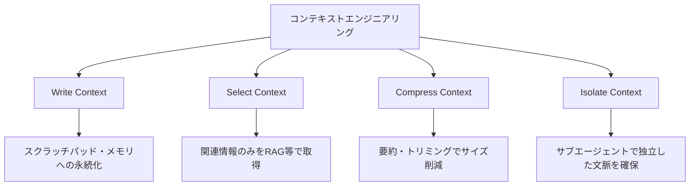
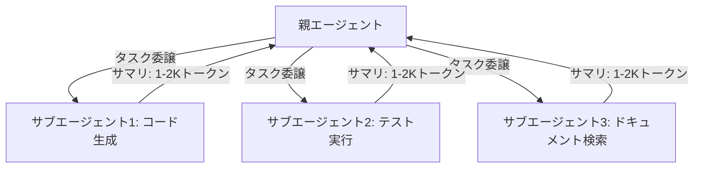

## ブログ概要（Summary）

本記事は [Anthropic Engineering Blog: Effective context engineering for AI agents](https://www.anthropic.com/engineering/effective-context-engineering-for-ai-agents) の解説記事である。2025年9月29日に公開されたこのブログでは、Anthropic Applied AIチーム（Prithvi Rajasekaran, Ethan Dixon, Carly Ryan, Jeremy Hadfield）が、AIエージェント開発におけるコンテキストエンジニアリングの実践戦略を体系的に解説している。コンテキストを「有限リソース」として捉え、システムプロンプト設計、ツール設計、動的コンテキスト取得、長期タスク管理の4つの観点から具体的な手法を紹介している。

この記事は [Zenn記事: 実践プロンプトエンジニアリング：評価駆動で本番LLMアプリのプロンプトを継続改善する](https://zenn.dev/0h_n0/articles/e9bb5614d139b8) の深掘りです。

## 情報源

- **種別**: 企業テックブログ（Anthropic Engineering Blog）
- **URL**: [Effective context engineering for AI agents](https://www.anthropic.com/engineering/effective-context-engineering-for-ai-agents)
- **組織**: Anthropic, Applied AI Team
- **発表日**: 2025年9月29日

## 技術的背景（Technical Background）

Andrej Karpathyは2025年6月に「プロンプトエンジニアリングよりコンテキストエンジニアリングという言葉を支持する」と発言し、プロンプト設計の概念を拡張した。Anthropicのこのブログは、この概念を実装レベルに落とし込んだ実践ガイドとして位置づけられる。

ブログでは、コンテキストエンジニアリングを「LLM推論時に最適なトークンの集合をキュレーション・維持する戦略の総体」と定義している。従来のプロンプトエンジニアリングが「指示文の改善」に焦点を当てていたのに対し、コンテキストエンジニアリングはプロンプト、検索ドキュメント、メモリシステム、ツール定義、状態情報など、モデルが推論時に参照するすべての情報を設計対象とする。

この拡張は、エージェント型アプリケーション（複数ターンの推論と長い時間軸で動作するシステム）の普及により、コンテキスト管理の複雑性が急増したことが背景にある。

## 実装アーキテクチャ（Architecture）

### コンテキストの4つの戦略

ブログでは、コンテキスト管理の4つの基本戦略が提示されている。



**1. Write Context（書き込み）**: コンテキストウィンドウの外部に情報を永続化する。エージェントが外部ファイル（NOTES.md等）に進捗を記録し、必要に応じて読み込む。人間が外部メモリ（メモ帳、ドキュメント）を使うのと同じ原理である。

**2. Select Context（選択）**: 全情報を投入するのではなく、タスクに関連する情報のみを動的に取得する。RAG（Retrieval-Augmented Generation）やツール呼び出し結果のフィルタリングが該当する。

**3. Compress Context（圧縮）**: 会話履歴の要約、冗長な出力の圧縮により、コンテキスト使用量を削減する。アーキテクチャ上の決定事項は保持しつつ、コード出力の詳細は削除する等の選択的圧縮が推奨されている。

**4. Isolate Context（隔離）**: サブエージェントに特化したタスクを委譲し、クリーンなコンテキストウィンドウで処理させる。結果は1,000〜2,000トークン程度のサマリとして親エージェントに返す。

### コンテキストロットの概念と対策

ブログでは「コンテキストロット（context rot）」という概念が導入されている。これは、失敗した試行、無関係な情報、古くなったデータがコンテキストに蓄積し、モデルの性能を低下させる現象である。

Transformerアーキテクチャの注意機構は、すべてのトークン間の$n^2$のペアワイズ関係を計算する。コンテキストが膨張すると、各トークンに割り当てられる「注意予算」が希薄化し、重要な情報への注意が低下する。

$$
\text{Attention Budget per Token} \propto \frac{1}{n}
$$

ここで$n$はコンテキスト内の総トークン数である。コンテキストが2倍になれば、各トークンへの平均的な注意重みは半分になる。この理論的背景は、Liu et al. (2023) "Lost in the Middle"の実証結果とも整合する。

ブログでは、以下の対策が推奨されている。

```python
def manage_context_rot(
    messages: list[dict],
    max_context_tokens: int = 100_000,
    compaction_threshold: float = 0.75,
) -> list[dict]:
    """コンテキストロットを防止するメッセージ管理

    Args:
        messages: 会話履歴
        max_context_tokens: 最大コンテキストトークン数
        compaction_threshold: 圧縮を開始する閾値（最大値の何%か）

    Returns:
        圧縮済みのメッセージリスト
    """
    current_tokens = estimate_tokens(messages)

    if current_tokens < max_context_tokens * compaction_threshold:
        return messages  # 閾値未満なら圧縮不要

    # システムプロンプト（先頭）は保持
    system_msg = messages[0]

    # 直近のやり取り（末尾5ターン）は原文保持
    recent = messages[-10:]

    # 中間部分を要約（圧縮対象）
    middle = messages[1:-10]
    if middle:
        summary = summarize_conversation(middle)
        compressed = [
            system_msg,
            {"role": "assistant", "content": f"[会話要約]\n{summary}"},
            *recent,
        ]
    else:
        compressed = [system_msg, *recent]

    return compressed
```

### システムプロンプトの設計原則

ブログでは、効果的なシステムプロンプトは「ゴルディロックスゾーン」に位置すべきだと述べている。過度に詳細な指示（ブリトルで壊れやすい）と、曖昧で文脈を仮定する指示（不正確な結果を生む）の中間が理想である。

具体的な推奨事項は以下のとおりである。

**セクション分離**: XMLタグまたはMarkdownヘッダーで論理的なセクションを明確に分離する。`<background_information>`、`<instructions>`、`<output_description>`等のタグが例示されている。

**ツール定義の最適化**: ツール（関数呼び出し）の定義は自己完結型（self-contained）にし、機能の重複を最小化する。曖昧な判断ポイントをエージェントに与えないことが重要である。

**トークン効率**: ツールの戻り値はトークン効率の高いフォーマットで返す。大量のJSONを返すのではなく、タスクに必要な情報のみを構造化して返す。

### Just-in-Time（JIT）コンテキスト取得

ブログでは、すべての関連データを事前にロードする方式（eager loading）ではなく、必要なときに動的に取得する「JITコンテキスト取得」を推奨している。

```python
class JITContextManager:
    """Just-in-Timeコンテキスト取得マネージャ

    軽量な識別子（ファイルパス、URL等）のみを保持し、
    必要に応じてツール経由で詳細情報を取得する。
    """

    def __init__(self):
        self.references: dict[str, str] = {}  # id -> 軽量な参照情報

    def register(self, ref_id: str, summary: str) -> None:
        """軽量な参照情報を登録

        Args:
            ref_id: 参照ID（ファイルパス、URL等）
            summary: 1-2行の概要
        """
        self.references[ref_id] = summary

    def get_context_prompt(self) -> str:
        """現在の参照一覧をプロンプト用テキストに変換

        Returns:
            プロンプトに挿入するコンテキスト参照テキスト
        """
        lines = ["利用可能な情報源:"]
        for ref_id, summary in self.references.items():
            lines.append(f"- {ref_id}: {summary}")
        lines.append(
            "\n詳細が必要な場合はread_fileツールで取得してください。"
        )
        return "\n".join(lines)
```

この方式により、コンテキストウィンドウの消費を最小限に抑えつつ、エージェントが必要に応じて詳細情報にアクセスできる。

### サブエージェントアーキテクチャ

長期タスクにおいて、ブログでは専門化されたサブエージェントに部分タスクを委譲するアーキテクチャを推奨している。各サブエージェントはクリーンなコンテキストウィンドウで処理を行い、結果を1,000〜2,000トークン程度のサマリとして親エージェントに返す。



この設計により、各サブエージェントは自身のタスクに特化した情報のみをコンテキストに保持でき、コンテキストロットを回避できる。親エージェントは各サブエージェントのサマリのみを受け取るため、全体のコンテキスト消費が制御される。

## パフォーマンス最適化（Performance）

ブログでは定量的なベンチマーク結果は公開されていないが、設計原則として以下のパフォーマンス最適化が推奨されている。

**ハイブリッド取得戦略**: 速度が要求されるクリティカルデータは事前ロード（eager）し、補足的な探索は必要に応じて自律的に実行する（lazy）。この併用により、レイテンシと情報網羅性のバランスを取る。

**圧縮のタイミング**: コンテキスト使用量が上限の75%に達した時点で圧縮を開始する。上限に達してからの圧縮は情報損失のリスクが高い。

**サブエージェントのサマリサイズ**: 1,000〜2,000トークンが推奨される。これより短いと情報が不足し、長いと親エージェントのコンテキストを圧迫する。

## 運用での学び（Production Lessons）

ブログの内容から抽出できるプロダクション運用での教訓は以下のとおりである。

**コンテキストは「デバッグしにくい」**: プロンプトの変更は差分として確認できるが、動的に構築されるコンテキスト全体の品質劣化は発見が困難である。実行時のコンテキストをログに記録し、品質低下時にトレースバックできる仕組みが必要である。

**ツール定義の肥大化**: エージェントに多数のツールを与えると、ツール選択の曖昧性が増し、誤ったツールの呼び出しが増加する。ツール数を最小限に抑え、各ツールの責務を明確にすることが重要である。

**メモリの構造化**: エージェントの外部メモリ（NOTES.md等）は非構造化テキストではなく、セクション分けされた構造化ドキュメントとすることで、後からの情報検索が容易になる。

## 学術研究との関連（Academic Connection）

ブログの内容は以下の学術研究と密接に関連している。

- **Lost in the Middle** (Liu et al., 2023): コンテキスト内の位置バイアスに関する実証研究。ブログの「注意予算」の概念と対応。先頭・末尾に重要情報を配置する推奨事項の学術的根拠
- **Attention Sink** (Xiao et al., 2023): Transformerの最初のトークンに注意が集中する現象。ブログのシステムプロンプト設計原則と関連
- **RAG** (Lewis et al., 2020): 検索拡張生成の基礎論文。ブログのSelect Contextの学術的基盤

## まとめと実践への示唆

AnthropicのこのブログはAIエージェント開発におけるコンテキストエンジニアリングの実践ガイドとして、Zenn記事で解説した3層構造（指示的コンテキスト、知識コンテキスト、ツールコンテキスト）の設計を具体的な実装レベルに落とし込んでいる。「コンテキストを有限リソースとして管理する」という原則は、プロンプト設計から運用監視まで一貫して適用される。

特に、コンテキストロットの概念とその対策（圧縮、JIT取得、サブエージェント隔離）は、長期タスクを処理するエージェント型アプリケーションの設計において実用的な指針を提供している。

## 参考文献

- **Blog URL**: [https://www.anthropic.com/engineering/effective-context-engineering-for-ai-agents](https://www.anthropic.com/engineering/effective-context-engineering-for-ai-agents)
- **Related Papers**: [https://arxiv.org/abs/2307.03172](https://arxiv.org/abs/2307.03172)（Lost in the Middle）
- **Related Zenn article**: [https://zenn.dev/0h_n0/articles/e9bb5614d139b8](https://zenn.dev/0h_n0/articles/e9bb5614d139b8)
