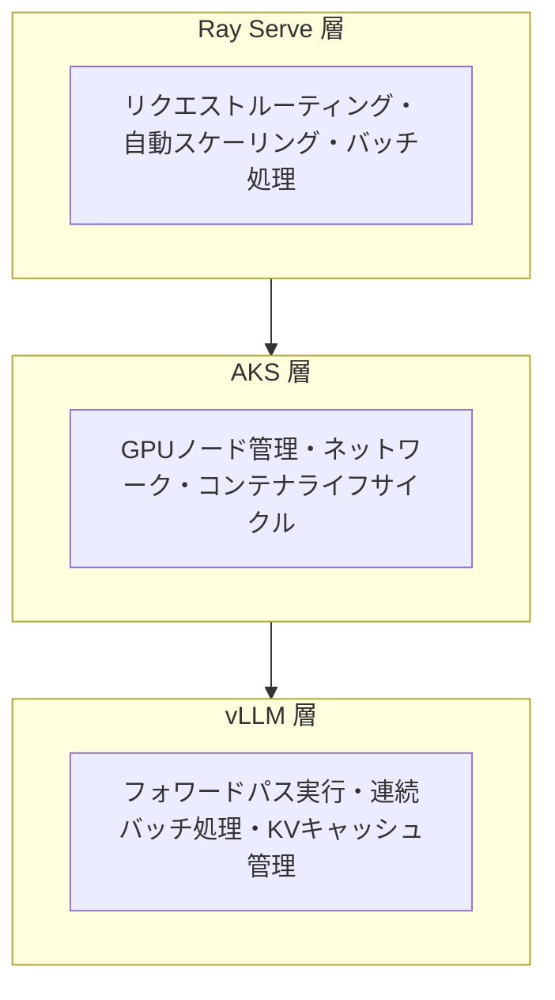

## ブログ概要（Summary）

本記事は [The LLM Inference Optimization Stack: A Prioritized Playbook for Enterprise Teams](https://techcommunity.microsoft.com/blog/appsonazureblog/the-llm-inference-optimization-stack-a-prioritized-playbook-for-enterprise-teams/4498818) の解説記事です。

Microsoftが2026年3月に公開したエンタープライズ向けLLM推論最適化の包括的ガイドであり、GPU活用率の最大化、量子化、vLLMエンジン最適化、モデル選択戦略の各レイヤーを**実装優先度順**に整理している。3層サービングアーキテクチャ（Ray Serve + AKS + vLLM）を基盤とし、各最適化手法の具体的な効果（連続バッチ処理による最大23倍のスループット向上など）を示している。

この記事は [Zenn記事: LLMエージェントのトークン予算管理：3層制御でAPI費用の暴走を防ぐ実装ガイド](https://zenn.dev/0h_n0/articles/95acc61229eba4) の深掘りです。

## 情報源

- **種別**: 企業テックブログ
- **URL**: [https://techcommunity.microsoft.com/blog/appsonazureblog/the-llm-inference-optimization-stack.../4498818](https://techcommunity.microsoft.com/blog/appsonazureblog/the-llm-inference-optimization-stack-a-prioritized-playbook-for-enterprise-teams/4498818)
- **組織**: Microsoft（Azure Apps Blog）
- **著者**: bobmital
- **発表日**: 2026年3月6日（更新: 2026年3月17日）
- **シリーズ**: エンタープライズLLM推論 全3部作の第2部

## 技術的背景（Technical Background）

LLMエージェントを本番運用する際、**トークン単価の最適化**はアプリケーション層（Zenn記事で紹介した`max_tokens`制御やTALEフレームワーク）だけでなく、**推論インフラ層での最適化**が不可欠である。本ブログはインフラ層の最適化戦略を体系的にカバーしている。

Zenn記事の3層予算管理アーキテクチャにおける**組織層（Layer 3）のコスト制御**と直接関連する。LiteLLMプロキシでの予算上限設定に加え、推論インフラ自体のコストを下げることで、同一予算でより多くのエージェントタスクを処理できるようになる。

ブログでは「GPU活用率が50%未満は、実質的にトークン1つあたり2倍の料金を支払っている」と指摘しており、インフラコストの最適化がトークン予算管理と表裏一体であることを強調している。

## 実装アーキテクチャ（Architecture）

### 3層サービングアーキテクチャ

ブログが提示するエンタープライズLLM推論の基盤は、以下の3層構成である。



- **Ray Serve**: 分散モデルサービング層。リクエストルーティング、オートスケーリング、レプリカ配置、マルチモデルサービングを担当
- **AKS（Azure Kubernetes Service）**: インフラオーケストレーション層。GPUノード、ネットワーク、コンテナライフサイクルを管理
- **vLLM**: 推論エンジン層。フォワードパスの実行と連続バッチ処理、KVキャッシュ管理を実行

### 最適化スタック（実装優先度順）

ブログは最適化手法を**実装による価値（Impact）の高い順**に整理している。以下にその全体像を示す。

#### 1. GPU活用率の最大化

**原則**: 「GPU活用率50%未満は、すべてのトークン生成に対して実質2倍のコストを支払っている」

**自動スケーリング戦略**として、CPU/メモリのような汎用メトリクスではなく、**リクエストキュー深度、GPU活用率、P95レイテンシ**を駆動指標とすべきとされている。アイドル期間中はゼロスケールも推奨される。

**GPU選択ガイダンス**（2026年3月時点）:
- **NCads H100 v5**: 新規デプロイに推奨
- **H100 NVL 94GB**: HBM帯域幅 3.9 TB/s（標準H100 80GBの3.35 TB/sを上回る）
- **ND H100 v5**: マルチGPUシャーディングと高集約スループット向け
- **ND GB200 v6**: VM あたり4基のNVIDIA Blackwell GPU搭載

#### 2. GPU分割（MIG / Fractional GPU）

**NVIDIA Multi-Instance GPU（MIG）**により、1基のGPUを**最大7つのハードウェア分離インスタンス**に分割できる。各インスタンスは独自のコンピュートコア、メモリ、キャッシュ、メモリ帯域幅を持つ。

**Ray ServeのFractional GPU割り当て**は、スケジューリングメカニズムであり、ハードウェア分割ではない。VRAMの分離はないため、保守的な`gpu_memory_utilization`設定と制御されたコンカレンシーが必要。

#### 3. 量子化

メモリ削減効果:
- **FP16 → INT8**: メモリをほぼ半減
- **4ビット量子化**: メモリを約1/4に削減

具体例として、**Llama-3.3-70B-Instruct**をBF16からFP8に量子化することで、約140GBから約70GBに削減し、80GB GPUでの単一GPU配置が可能になると報告されている。

#### 4. vLLMエンジン最適化

**連続バッチ処理（Continuous Batching）**:

静的バッチ処理と比較して**最大23倍のスループット向上**が報告されている（テスト条件: OPT-13B、A100 40GB、様々な同時接続レベル）。GPU活用率を30-40%から80%以上に引き上げることが可能。

**PagedAttention**:

KVキャッシュを小さな非連続ページに分割し、フラグメンテーションを解消する。これにより無駄なメモリが削減され、GPU1基あたりの同時リクエスト数が増加する。vLLMではデフォルトで有効。

**Prefix Caching**:

完了リクエストのKVキャッシュをグローバルなGPU上キャッシュに保存し、共通のプレフィックス（システムプロンプト、RAGコンテキスト等）を共有するリクエストでキャッシュを再利用する。TTFT（Time to First Token）の削減と計算負荷の軽減を同時に実現する。

**Chunked Prefill**:

大きなプリフィル処理を小さなチャンクに分割し、デコードステップとインターリーブする。長いプロンプトが進行中のデコード処理をブロックすることを防ぎ、compute-boundなプリフィルチャンクとmemory-boundなデコードを混合してGPU活用率を改善する。

**投機的デコーディング（Speculative Decoding）**:

ドラフトモデルが複数トークンを先行提案し、ターゲットモデルが1回のフォワードパスで並列検証する。出力品質は同一（全トークンがターゲットモデルで検証される）。コード補完など予測可能性の高いタスクで特に効果的とされている。

#### 5. Prefill/Decode分離

プリフィルは**compute-bound**、デコードは**memory-bandwidth-bound**という特性の違いに基づき、両者を分離することでハードウェア最適化のトレードオフを回避する。Ray Serveがリクエストをまずプリフィルワーカーに送り、結果のKVキャッシュをデコードワーカーに引き渡す構成が示されている。

ただし、ブログでは「この機能は進化中であり、本番デプロイ前にRayとvLLMのバージョンに対して検証すべき」と注記されている。

#### 6. Multi-LoRAアダプタ

部門ごとに別個のモデルデプロイメントを用意する代わりに、**1つのベースモデルでリクエストごとにアダプタを切り替える**ことで、N部門分のGPUコストを1部門分に集約できる。法務、人事、財務、エンジニアリングのコパイロットを1つのAKS GPUデプロイメントから提供する具体例が示されている。

## パフォーマンス最適化（Performance）

ブログで報告されている主要な数値を整理する。

| 最適化手法 | 効果 | 条件 |
|-----------|------|------|
| 連続バッチ処理 | 最大23倍スループット向上 | OPT-13B, A100 40GB |
| GPU活用率改善 | 30-40% → 80%+ | 連続バッチ + オートスケーリング |
| FP8量子化 | メモリ約50%削減 | Llama-3.3-70B, BF16→FP8 |
| 4ビット量子化 | メモリ約75%削減 | 一般的なモデル |
| Multi-LoRA | N倍のコスト効率 | N部門を1デプロイで対応 |

**ボトルネック特定の考え方**:

プリフィルフェーズはcompute-bound（GPU演算能力がボトルネック）、デコードフェーズはmemory-bandwidth-bound（HBM帯域幅がボトルネック）であるため、最適化の方向性が異なる。プリフィルはバッチサイズ拡大で効率化し、デコードはメモリ帯域幅の広いGPU（H100 NVL: 3.9 TB/s）で高速化する。

## 運用での学び（Production Lessons）

**モデル選択フレームワーク**:

ブログはワークロード別の推奨モデルサイズを以下のように整理している。

| ワークロード | モデルクラス | 根拠 |
|------------|------------|------|
| 内部コパイロット・高スループットAPI | 7B-13B | 10-30倍安価、RAG+FTで精度回復 |
| 顧客対面アシスタント | 30B-70B | 品質が収益と信頼に直結 |
| フロンティア品質を低コストで | MoE (Qwen3-235B等) | アクティブパラメータ数で推論コスト決定 |
| コード補完 | コード特化モデル | 大型汎用モデルより低コストで高性能 |

**設計原則**: 「品質閾値を満たす最小のモデルから始め、モデルサイズを上げる前にRAG、キャッシュ、ファインチューニング、バッチ処理を追加せよ」

**注意点として、ブログはDeepSeek系モデルについて「規制産業の組織はデータ主権、輸出管理、ベンダーリスクポリシーを評価してからデプロイすべき」と指摘している。

**自前推論のコスト構造**:

APIのper-tokenの従量課金ではなく、GPUインフラの固定費に移行するため、トラフィック量が多いほどコスト効率が向上する。ブログでは「使用量に応じてスケールしない予測可能なコスト構造」が自前推論の戦略的優位性として強調されている。

## Production Deployment Guide

### AWS実装パターン（コスト最適化重視）

ブログはAzure環境を前提としているが、同等のアーキテクチャをAWSで構築する場合のパターンを示す。

**トラフィック量別の推奨構成**:

| 規模 | 月間リクエスト | 推奨構成 | 月額コスト概算 | 主要サービス |
|------|--------------|---------|-------------|------------|
| **Small** | ~3,000 (100/日) | Serverless | $50-150 | Lambda + Bedrock |
| **Medium** | ~30,000 (1,000/日) | Hybrid | $500-1,500 | ECS Fargate + vLLM + Bedrock |
| **Large** | 300,000+ (10,000/日) | Self-hosted | $3,000-8,000 | EKS + GPU (g5.xlarge) + vLLM |

**Large構成の詳細** (月額$3,000-8,000):
- **EKS**: コントロールプレーン ($72/月)
- **EC2 GPU Spot**: g5.xlarge (A10G) × 2-4台 (平均$800-1,600/月、Spot利用で最大90%削減)
- **vLLM**: 連続バッチ処理 + PagedAttention + Prefix Caching有効
- **Karpenter**: GPU Spot Instanceの自動スケーリング
- **S3**: モデル重みストレージ ($20/月)
- **CloudWatch + X-Ray**: 詳細監視 ($100/月)

**コスト削減テクニック**:
- **Spot Instances**: g5.xlarge のSpot価格は On-Demand比で60-90%削減
- **量子化**: FP8量子化でGPU台数を半減（70Bモデルが1GPU搭載可能に）
- **Prefix Caching**: 共通システムプロンプトのKVキャッシュ再利用でTTFT削減
- **連続バッチ処理**: GPU活用率80%以上を維持（static batchの最大23倍）
- **MoEモデル**: アクティブパラメータ数に応じた推論コスト（Qwen3-235B: 22Bアクティブ）

**コスト試算の注意事項**:
- 上記は2026年4月時点のAWS ap-northeast-1（東京）リージョン料金に基づく概算値です
- GPU Spotの可用性と価格はリージョン・時間帯により大きく変動します
- 最新料金は [AWS料金計算ツール](https://calculator.aws/) で確認してください

### Terraformインフラコード

**Large構成 (Self-hosted vLLM on EKS)**

```hcl
# --- EKSクラスタ ---
module "eks" {
  source  = "terraform-aws-modules/eks/aws"
  version = "~> 20.0"

  cluster_name    = "llm-inference-cluster"
  cluster_version = "1.31"

  vpc_id     = module.vpc.vpc_id
  subnet_ids = module.vpc.private_subnets

  cluster_endpoint_public_access = true
  enable_cluster_creator_admin_permissions = true
}

# --- Karpenter (GPU Spot自動スケーリング) ---
resource "kubectl_manifest" "karpenter_nodepool" {
  yaml_body = <<-YAML
    apiVersion: karpenter.sh/v1
    kind: NodePool
    metadata:
      name: gpu-spot-pool
    spec:
      template:
        spec:
          requirements:
            - key: karpenter.sh/capacity-type
              operator: In
              values: ["spot"]
            - key: node.kubernetes.io/instance-type
              operator: In
              values: ["g5.xlarge", "g5.2xlarge"]
          nodeClassRef:
            group: karpenter.k8s.aws
            kind: EC2NodeClass
            name: default
      limits:
        cpu: "64"
        memory: "256Gi"
        nvidia.com/gpu: "8"
      disruption:
        consolidationPolicy: WhenEmptyOrUnderutilized
        consolidateAfter: 30s
  YAML
}

# --- vLLM Deployment ---
resource "kubectl_manifest" "vllm_deployment" {
  yaml_body = <<-YAML
    apiVersion: apps/v1
    kind: Deployment
    metadata:
      name: vllm-server
    spec:
      replicas: 2
      selector:
        matchLabels:
          app: vllm
      template:
        metadata:
          labels:
            app: vllm
        spec:
          containers:
          - name: vllm
            image: vllm/vllm-openai:latest
            args:
              - "--model"
              - "meta-llama/Llama-3.3-70B-Instruct"
              - "--quantization"
              - "fp8"
              - "--enable-prefix-caching"
              - "--enable-chunked-prefill"
              - "--max-model-len"
              - "32768"
              - "--gpu-memory-utilization"
              - "0.90"
            resources:
              limits:
                nvidia.com/gpu: 1
              requests:
                nvidia.com/gpu: 1
            ports:
              - containerPort: 8000
  YAML
}

# --- AWS Budgets ---
resource "aws_budgets_budget" "gpu_monthly" {
  name         = "gpu-inference-monthly"
  budget_type  = "COST"
  limit_amount = "8000"
  limit_unit   = "USD"
  time_unit    = "MONTHLY"

  notification {
    comparison_operator        = "GREATER_THAN"
    threshold                  = 80
    threshold_type             = "PERCENTAGE"
    notification_type          = "ACTUAL"
    subscriber_email_addresses = ["ops@example.com"]
  }
}
```

### 運用・監視設定

**GPU活用率モニタリング（CloudWatch + DCGM）**:

```python
import boto3

cloudwatch = boto3.client('cloudwatch')

# GPU活用率アラート（50%未満 = コスト非効率）
cloudwatch.put_metric_alarm(
    AlarmName='gpu-utilization-low',
    ComparisonOperator='LessThanThreshold',
    EvaluationPeriods=3,
    MetricName='GPUUtilization',
    Namespace='Custom/vLLM',
    Period=300,
    Statistic='Average',
    Threshold=50.0,
    AlarmDescription='GPU活用率50%未満 - トークン単価が実質2倍',
    ActionsEnabled=True,
    AlarmActions=['arn:aws:sns:ap-northeast-1:123456789:gpu-alerts'],
)

# vLLMスループット監視
cloudwatch.put_metric_alarm(
    AlarmName='vllm-throughput-drop',
    ComparisonOperator='LessThanThreshold',
    EvaluationPeriods=2,
    MetricName='TokensPerSecond',
    Namespace='Custom/vLLM',
    Period=300,
    Statistic='Average',
    Threshold=100.0,
    AlarmDescription='vLLMスループット低下（100 tokens/s未満）',
)
```

### コスト最適化チェックリスト

**アーキテクチャ選択**:
- [ ] ~100 req/日 → Bedrock API（従量課金が有利）
- [ ] ~1,000 req/日 → Hybrid（Bedrockメイン + 重いタスクはvLLM）
- [ ] 10,000+ req/日 → Self-hosted vLLM on EKS（固定費が有利）

**GPU最適化**:
- [ ] GPU活用率50%以上を維持（連続バッチ処理の有効化）
- [ ] Spot Instances優先（Karpenter自動管理、最大90%削減）
- [ ] FP8量子化で必要GPU台数を半減
- [ ] MIG分割で小型モデルの効率的配置
- [ ] アイドル時ゼロスケール（Karpenter consolidation）

**vLLMエンジン最適化**:
- [ ] 連続バッチ処理有効（デフォルト有効）
- [ ] PagedAttention有効（デフォルト有効）
- [ ] Prefix Caching有効（--enable-prefix-caching）
- [ ] Chunked Prefill有効（--enable-chunked-prefill）
- [ ] gpu-memory-utilization を 0.85-0.95 に設定

**モデル選択**:
- [ ] 品質閾値を満たす最小モデルから開始
- [ ] RAG・キャッシュ・FTを先に試してからモデルサイズアップ
- [ ] MoEモデルの検討（アクティブパラメータ数 = 推論コスト）
- [ ] ドメイン特化モデルの活用（コード生成にはCoder系）

**監視・アラート**:
- [ ] GPU活用率のリアルタイム監視
- [ ] AWS Budgets月額予算設定（80%警告）
- [ ] vLLMのスループット・レイテンシ監視
- [ ] Spot中断イベントのアラート設定

## 学術研究との関連（Academic Connection）

本ブログで取り上げられているvLLMの最適化手法は、以下の学術研究に基づいている：

- **PagedAttention**: Kwon et al., "Efficient Memory Management for Large Language Model Serving with PagedAttention" (SOSP 2023) — vLLMの中核技術
- **Continuous Batching**: Orca (Yu et al., OSDI 2022) で提案されたイテレーションレベルスケジューリング
- **Speculative Decoding**: Leviathan et al. (ICML 2023)、Chen et al. (2023) で独立に提案された推論加速技術

これらの研究成果がvLLMとして統合され、Ray ServeとKubernetesと組み合わさることで、エンタープライズ品質のLLM推論スタックが構成されている。

## まとめと実践への示唆

本ブログは、LLM推論コストの最適化を**インフラ層から体系的に行う**ためのプレイブックである。Zenn記事で解説したアプリケーション層の3層トークン予算管理（`max_tokens`、TaskBudget、LiteLLMプロキシ）と組み合わせることで、**アプリケーション層とインフラ層の両方からコスト最適化**を実現できる。

特に「GPU活用率50%未満は実質2倍のコスト」という指摘と、「品質閾値を満たす最小モデルから始めよ」という設計原則は、トークン予算管理を検討するすべてのチームが認識すべき知見である。

## 参考文献

- **Blog URL**: [https://techcommunity.microsoft.com/.../4498818](https://techcommunity.microsoft.com/blog/appsonazureblog/the-llm-inference-optimization-stack-a-prioritized-playbook-for-enterprise-teams/4498818)
- **vLLM**: [https://github.com/vllm-project/vllm](https://github.com/vllm-project/vllm)
- **PagedAttention (SOSP 2023)**: Kwon et al.
- **Related Zenn article**: [https://zenn.dev/0h_n0/articles/95acc61229eba4](https://zenn.dev/0h_n0/articles/95acc61229eba4)
