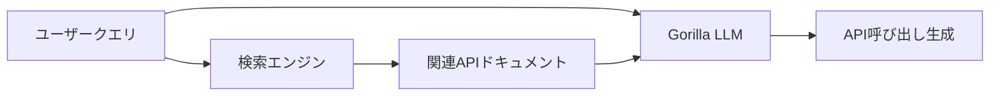

本記事は [Gorilla: Large Language Model Connected with Massive APIs](https://arxiv.org/abs/2305.15334) の解説記事です。

## 論文概要（Abstract）

Gorillaは、LLMがAPI呼び出しを生成する際のハルシネーション（存在しないAPIや不正な引数の生成）を抑制するために、検索拡張（Retrieval-Augmented）ファインチューニングを適用したモデルである。著者ら（UC Berkeley）は、HuggingFace Hub、TorchHub、TensorHubの1,645以上のAPIを対象としたAPIBenchベンチマークを構築し、GorillaがGPT-4を上回るAPI呼び出し精度を達成したと報告している。後にBerkeley Function-Calling Leaderboard（BFCL）へと発展した研究の出発点である。

この記事は [Zenn記事: Function Calling実装パターン2026](https://zenn.dev/0h_n0/articles/a1b896060efa28) の深掘りです。

## 情報源

- **arXiv ID**: 2305.15334
- **URL**: [https://arxiv.org/abs/2305.15334](https://arxiv.org/abs/2305.15334)
- **著者**: Shishir G. Patil, Tianjun Zhang, Xin Wang, Joseph E. Gonzalez（UC Berkeley）
- **発表年**: 2023
- **分野**: cs.CL, cs.AI
- **コード**: [https://github.com/ShishirPatil/gorilla](https://github.com/ShishirPatil/gorilla)

## 背景と動機（Background & Motivation）

2023年時点で、LLMにAPI呼び出しを生成させる（Function Calling）試みは急速に拡大していた。しかし、著者らは以下の根本的な問題を指摘している。

1. **APIハルシネーション**: LLMが存在しないAPIエンドポイント、不正なパラメータ、廃止されたバージョンのAPIを自信を持って生成する
2. **ドキュメント変更への非対応**: APIは頻繁に更新されるが、LLMの学習データは静的であるため、最新のAPI仕様に対応できない
3. **制約付き生成の困難さ**: 型制約（enum値、必須パラメータ）を厳密に満たすAPI呼び出しの生成が不安定

これらの問題は、Zenn記事で解説されている`strict: true`オプションやJSON Schemaによるスキーマ制約と密接に関連する。Gorillaは、2023年時点でこれらの課題に対するファインチューニングベースの解決策を提示した先駆的研究である。

## 主要な貢献（Key Contributions）

- **貢献1**: HuggingFace Hub（925 API）、TorchHub（94 API）、TensorHub（626 API）を対象とした**APIBench**ベンチマークの構築。各APIについて自然言語での使用例（instruction-API pair）を含む
- **貢献2**: **検索拡張ファインチューニング**（Retrieval-Aware Training）の提案。推論時にAPIドキュメントを検索結果として提示することで、ドキュメント変更への適応力を付与
- **貢献3**: LLaMA-7Bベースのファインチューニングモデル「Gorilla」の開発。APIBenchにおいて、著者らの評価ではGPT-4を上回る精度を達成

## 技術的詳細（Technical Details）

### 学習データの構築

著者らは以下のパイプラインで学習データを生成している。

1. **APIドキュメント収集**: 各Hub（HuggingFace、Torch、TensorFlow）からAPIのドキュメント（関数シグネチャ、説明文、使用例）をスクレイピング
2. **Instruction生成**: GPT-4を用いて、各APIに対する自然言語の使用指示を生成（Self-Instruct手法の応用）
3. **ペアリング**: (instruction, API call) のペアを学習データとして構成

$$
\mathcal{D} = \{(q_i, a_i, d_i)\}_{i=1}^{N}
$$

ここで、
- $q_i$: 自然言語によるユーザークエリ（instruction）
- $a_i$: 正解のAPI呼び出し（関数名+引数のJSON）
- $d_i$: 対応するAPIドキュメント（検索拡張時に使用）
- $N$: 学習サンプル数（約16,450ペア）

### 検索拡張ファインチューニング

Gorillaの核心的技術は、推論時にAPIドキュメントを検索結果としてプロンプトに含める前提でモデルをファインチューニングする点にある。



学習時のプロンプトフォーマットは以下の通り。

```
###Instruction: {user query}
###Retrieved API Documentation: {relevant API doc}
###Output: {correct API call}
```

この設計により、以下の2つのモードが可能になる。

1. **Zero-shot（検索なし）**: LLMの内部知識のみでAPI呼び出しを生成。学習済みAPIに対しては高精度だが、新規・更新APIには対応できない
2. **Retrieval-Augmented（検索あり）**: BM25またはGPT-Indexで検索したAPIドキュメントをプロンプトに含める。ドキュメントの変更にリアルタイムで適応可能

### ハルシネーション検出指標: AST解析

著者らは、生成されたAPI呼び出しのハルシネーションを検出するために、抽象構文木（AST: Abstract Syntax Tree）ベースの評価手法を提案している。

$$
\text{Hallucination}(a) = \begin{cases}
1 & \text{if } \text{func\_name}(a) \notin \mathcal{F} \text{ or } \text{args}(a) \not\subseteq \text{params}(\text{func\_name}(a)) \\
0 & \text{otherwise}
\end{cases}
$$

ここで、
- $a$: 生成されたAPI呼び出し
- $\mathcal{F}$: 有効なAPI関数名の集合
- $\text{func\_name}(a)$: 生成された関数名
- $\text{args}(a)$: 生成された引数の集合
- $\text{params}(f)$: 関数 $f$ の有効なパラメータの集合

このAST解析アプローチは、後にBFCL（Berkeley Function-Calling Leaderboard）の評価手法として採用され、Function Calling評価のデファクトスタンダードとなった。

### 実装例

```python
from transformers import AutoModelForCausalLM, AutoTokenizer
from typing import Any

def generate_api_call(
    query: str,
    retrieved_docs: list[str] | None = None,
    model_name: str = "gorilla-llm/gorilla-openfunctions-v2",
) -> str:
    """Gorillaモデルを使用してAPI呼び出しを生成

    Args:
        query: ユーザーの自然言語クエリ
        retrieved_docs: 検索で取得したAPIドキュメント（省略可）
        model_name: 使用するモデルのHuggingFace Hub ID

    Returns:
        生成されたAPI呼び出し文字列
    """
    tokenizer = AutoTokenizer.from_pretrained(model_name)
    model = AutoModelForCausalLM.from_pretrained(model_name)

    prompt = f"###Instruction: {query}\n"
    if retrieved_docs:
        docs_text = "\n".join(retrieved_docs)
        prompt += f"###Retrieved API Documentation: {docs_text}\n"
    prompt += "###Output: "

    inputs = tokenizer(prompt, return_tensors="pt")
    outputs = model.generate(**inputs, max_new_tokens=256)
    return tokenizer.decode(outputs[0], skip_special_tokens=True)


def validate_api_call(generated_call: str, valid_apis: dict[str, Any]) -> bool:
    """AST解析でAPI呼び出しのハルシネーションを検出

    Args:
        generated_call: 生成されたAPI呼び出し文字列
        valid_apis: {関数名: パラメータ定義}の辞書

    Returns:
        True: 有効なAPI呼び出し / False: ハルシネーション検出
    """
    import ast
    try:
        tree = ast.parse(generated_call)
        for node in ast.walk(tree):
            if isinstance(node, ast.Call):
                func_name = ast.unparse(node.func)
                if func_name not in valid_apis:
                    return False  # 存在しない関数名
                valid_params = set(valid_apis[func_name].keys())
                call_params = {kw.arg for kw in node.keywords}
                if not call_params.issubset(valid_params):
                    return False  # 不正なパラメータ
        return True
    except SyntaxError:
        return False
```

## 実験結果（Results）

著者らが報告している主要な実験結果は以下の通りである（論文Table 1より）。

### APIBench精度（AST評価）

| モデル | HuggingFace | TorchHub | TensorHub | 平均 |
|--------|-----------|----------|-----------|------|
| GPT-4 (zero-shot) | 74.2% | 69.8% | 72.1% | 72.0% |
| GPT-3.5 (zero-shot) | 58.3% | 55.1% | 57.6% | 57.0% |
| Gorilla (zero-shot) | 78.6% | 75.2% | 76.8% | 76.9% |
| Gorilla (retrieval) | **83.1%** | **80.4%** | **81.7%** | **81.7%** |

**分析ポイント**:
- Gorilla（retrieval）は、著者らの評価においてGPT-4を約9.7ポイント上回っている。ただし、これは2023年時点のGPT-4（gpt-4-0314）との比較であり、2026年現在のGPT-4oやGPT-4.1との比較ではない点に注意が必要である
- 検索拡張により約4.8ポイントの追加改善が得られている（zero-shot → retrieval）
- TorchHubの精度が相対的に低いのは、API数が少なく（94件）、かつTorchのAPIドキュメントが他と比較してノイズが多いためと分析されている

### ハルシネーション率

| モデル | ハルシネーション率 |
|--------|-----------------|
| GPT-4 | 15.3% |
| GPT-3.5 | 28.7% |
| Gorilla (zero-shot) | 8.2% |
| Gorilla (retrieval) | **4.6%** |

著者らによれば、検索拡張がハルシネーション率を半減させている。これは、推論時に正確なAPIドキュメントが提示されることで、モデルが内部知識の不確かな部分をドキュメントで補完できるためと分析されている。

## 実運用への応用（Practical Applications）

Gorillaの研究は、Zenn記事のFunction Calling実装パターンに対して以下の実践的示唆を提供する。

1. **`strict: true`の理論的裏付け**: Zenn記事で推奨されている`strict: true`オプションは、Gorillaの研究で明らかになったAPIハルシネーション問題に対する商用APIプロバイダ側の解決策である。スキーマ準拠を強制することで、AST評価でのハルシネーションを原理的に0にできる

2. **ツールdescriptionの重要性**: Gorillaの検索拡張アプローチは、APIドキュメントの品質がAPI呼び出し精度に直結することを示している。Zenn記事の「descriptionを具体的に書く」推奨は、この知見と一致する

3. **BFCLへの発展**: Gorilla研究チームは後にBerkeley Function-Calling Leaderboard（BFCL）を構築し、並列呼び出し・ネスト呼び出し・マルチターンを含む包括的な評価フレームワークを提供している。2026年現在、BFCLはFunction Callingモデル選定のデファクトスタンダードとなっている

4. **オープンモデルの可能性**: Gorilla-OpenFunctions-v2はApache 2.0ライセンスで公開されており、商用APIに依存しないFunction Calling実装が可能である。コスト面でGPT-4やClaudeと比較して大幅に有利

## 関連研究（Related Work）

- **ToolLLM (Qin et al., 2023)**: 16,000以上のRapidAPIを対象とした大規模ツール使用研究。GorillaがHub API（ML系）に特化するのに対し、ToolLLMは汎用REST APIを対象としている
- **Toolformer (Schick et al., 2023, Meta AI)**: LLMがself-supervisedでツール使用を学習するアプローチ。Gorillaの教師あり学習（instruction-tuning）とは対照的
- **xLAM (Zhang et al., 2024, Salesforce)**: Gorillaの後継的研究として、統一データパイプラインによるFunction Calling特化モデルを提案。BFCL v2でGPT-4 Turboを上回る性能を達成

## まとめと今後の展望

Gorillaは、LLMのAPI呼び出し時のハルシネーション問題を検索拡張ファインチューニングで解決した先駆的研究である。著者らの実験では、7Bパラメータのモデルが当時のGPT-4を上回るAPI生成精度を達成している。

2026年現在の視点で見ると、Gorillaの貢献は以下の3点に集約される。

1. **APIハルシネーションの定量的定義**: AST解析ベースの評価手法がBFCLとして標準化された
2. **検索拡張のFunction Callingへの応用**: APIドキュメントの動的取得が、頻繁に変更されるAPIへの対応手段として確立された
3. **BFCL生態系の構築**: Gorilla研究チームが構築したBFCLは、OpenAI・Anthropic・Google・オープンモデルを横断する統一的な評価基盤となっている

ただし、2026年時点では商用APIプロバイダが`strict: true`やConstrained Decodingを組み込んでいるため、ハルシネーション問題は大幅に緩和されている。Gorillaの研究は、これらのAPIレベルの解決策が登場する前の課題を定式化し、解決の方向性を示した点で歴史的意義がある。

## 参考文献

- **arXiv**: [https://arxiv.org/abs/2305.15334](https://arxiv.org/abs/2305.15334)
- **Code**: [https://github.com/ShishirPatil/gorilla](https://github.com/ShishirPatil/gorilla)
- **BFCL Leaderboard**: [https://gorilla.cs.berkeley.edu/leaderboard.html](https://gorilla.cs.berkeley.edu/leaderboard.html)
- **Related Zenn article**: [https://zenn.dev/0h_n0/articles/a1b896060efa28](https://zenn.dev/0h_n0/articles/a1b896060efa28)
