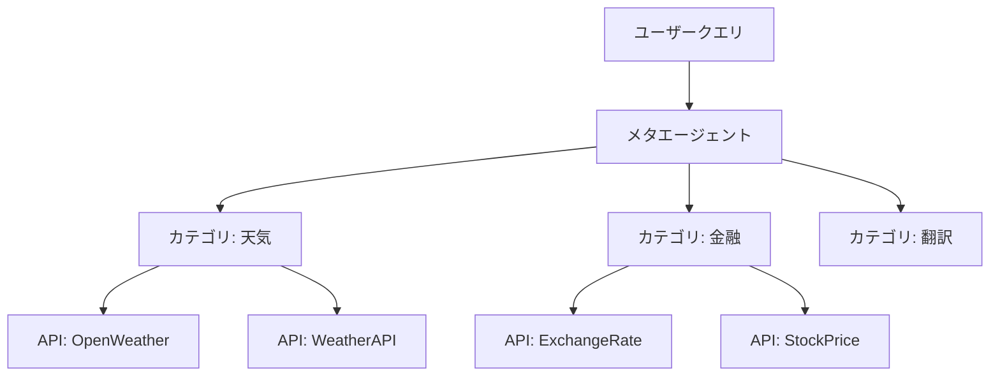

本記事は [AnyTool: Self-Reflective, Hierarchical Agents for Large-Scale API Calls](https://arxiv.org/abs/2402.04253) の解説記事です。

## 論文概要（Abstract）

AnyToolは、16,000以上のAPI（RapidAPI）から適切なツールを選択し、ユーザーのクエリを解決するLLMエージェントである。著者ら（Yu Du, Fangyun Wei, Hongyang Zhang）は、階層的APIリトリーバ、ソルバ、自己反省（Self-Reflection）メカニズムの3コンポーネントから成るアーキテクチャを提案している。著者らの報告によれば、AnyToolはToolBenchベンチマークでToolLLMを平均パス率で+35.4ポイント上回っている。GPT-4のFunction Calling機能をベースとしており、外部モジュールの追加学習は不要である。

この記事は [Zenn記事: Function Calling実装パターン2026](https://zenn.dev/0h_n0/articles/a1b896060efa28) の深掘りです。

## 情報源

- **会議名**: ICML 2024（International Conference on Machine Learning）
- **arXiv ID**: 2402.04253
- **URL**: [https://arxiv.org/abs/2402.04253](https://arxiv.org/abs/2402.04253)
- **著者**: Yu Du, Fangyun Wei, Hongyang Zhang
- **コード**: [https://github.com/dyabel/AnyTool](https://github.com/dyabel/AnyTool)

## カンファレンス情報

ICML 2024のメインカンファレンスに採択された。AnyToolはLLMのツール利用におけるエラーリカバリと大規模API選択の両方を扱っており、Zenn記事のエラーリカバリ戦略（一時的エラー→リトライ、永続的エラー→LLMフィードバック）の理論的基盤を提供する研究である。

## 背景と動機（Background & Motivation）

LLMのFunction Calling実装において、ツール数が増加するにつれて以下の問題が顕在化する。

1. **ツール選択の爆発**: 16,000以上のAPIが利用可能な場合、LLMのコンテキストウィンドウに全てのツール定義を含めることは不可能。適切なツールを事前にフィルタリングする必要がある
2. **エラーの多段伝搬**: ツール選択の誤り、パラメータの誤り、API実行の失敗が連鎖し、最終的な成功率を大幅に低下させる
3. **単一試行の限界**: ReActのような単一パスの推論では、最初のツール選択が誤った場合にリカバリする手段がない

著者らは、これらの問題を「階層的検索による候補絞り込み」と「構造化された自己反省によるエラーリカバリ」で解決することを提案している。

## 主要な貢献（Key Contributions）

- **貢献1**: **階層的APIリトリーバ**の提案。APIをカテゴリ→サブカテゴリ→個別APIの3層で構造化し、16,000 APIから約50件の候補に絞り込むことで、検索レイテンシを著者らの報告で約40%削減
- **貢献2**: **構造化された自己反省メカニズム**の提案。ツール呼び出し失敗時に、エラーの種類（関数選択誤り・パラメータ型誤り・必須パラメータ欠損・API実行失敗）を分類し、各分類に応じた修正戦略を適用
- **貢献3**: **AnyToolBench**ベンチマークの提案。既存のToolBench評価プロトコルの限界を指摘し、より実用的な評価基準を導入

## 技術的詳細（Technical Details）

### 階層的APIリトリーバ

AnyToolのAPIリトリーバは、メタエージェント→カテゴリエージェント→ツールエージェントの3層構造である。



**メタエージェント**はユーザークエリを分析し、関連するカテゴリ（49カテゴリ中から2-3件）を選択する。各**カテゴリエージェント**は、そのカテゴリ内のAPI（平均330件）からクエリに最適な候補（3-5件）を選択する。最終的に**ソルバ**が、選ばれた候補APIを使ってクエリを解決する。

この階層構造により、全APIを一度に評価する場合と比較して候補数が以下のように削減される。

$$
\text{候補数}: 16{,}000 \xrightarrow{\text{カテゴリ選択}} 660\text{-}990 \xrightarrow{\text{ツール選択}} 6\text{-}15
$$

### 自己反省メカニズム

AnyToolの核心は、ツール呼び出し失敗時の構造化されたエラー分類と修正戦略である。

#### エラー分類体系

著者らは以下の4種類のエラーを定義している。

| エラー種別 | 説明 | 修正戦略 |
|-----------|------|---------|
| **関数選択誤り** | 目的に合わないAPIを選択 | カテゴリエージェントから再検索 |
| **パラメータ型誤り** | 引数の型が不正（string→intなど） | エラーメッセージに基づき型変換 |
| **必須パラメータ欠損** | requiredフィールドが未指定 | APIドキュメントから必須パラメータを再取得 |
| **API実行失敗** | タイムアウト、レート制限、サーバーエラー | 代替APIの検索、またはリトライ |

#### 反省ループのアルゴリズム

```python
from dataclasses import dataclass
from enum import Enum
from typing import Any


class ErrorType(Enum):
    """ツール呼び出しエラーの分類"""
    WRONG_FUNCTION = "wrong_function"
    WRONG_PARAM_TYPE = "wrong_param_type"
    MISSING_PARAM = "missing_param"
    EXECUTION_FAILURE = "execution_failure"


@dataclass
class ReflectionResult:
    """自己反省の結果"""
    error_type: ErrorType
    diagnosis: str
    corrective_action: str


async def solve_with_reflection(
    query: str,
    candidate_apis: list[dict],
    max_reflections: int = 3,
) -> dict[str, Any]:
    """自己反省付きでクエリを解決

    Args:
        query: ユーザーのクエリ
        candidate_apis: 階層リトリーバが選択したAPI候補
        max_reflections: 反省ループの最大回数

    Returns:
        ツール実行結果
    """
    history: list[ReflectionResult] = []

    for attempt in range(max_reflections + 1):
        # ソルバ: API選択 + 引数生成 + 実行
        selected_api, args = plan_api_call(query, candidate_apis, history)
        result = await execute_api(selected_api, args)

        if result.success:
            return result.data

        # 自己反省: エラー分類 + 修正戦略の生成
        reflection = reflect_on_failure(
            query=query,
            selected_api=selected_api,
            args=args,
            error=result.error,
            history=history,
        )
        history.append(reflection)

        # 修正戦略に基づく候補APIの更新
        if reflection.error_type == ErrorType.WRONG_FUNCTION:
            candidate_apis = re_retrieve_apis(query, exclude=[selected_api])
        elif reflection.error_type == ErrorType.EXECUTION_FAILURE:
            candidate_apis = [
                api for api in candidate_apis if api["name"] != selected_api
            ]

    return {"error": "反省ループ上限超過", "history": history}
```

**反省回数の上限**: 著者らのアブレーション実験（論文Section 4.3）によれば、反省回数の増加に伴う精度改善は3回目までが顕著で、それ以降は改善が漸減する。コストとのトレードオフから、著者らは最大3回を推奨している。

$$
\Delta\text{PassRate}(k) = \text{PassRate}(k) - \text{PassRate}(k-1)
$$

| 反省回数 $k$ | パス率 | 改善幅 $\Delta$ |
|-------------|--------|----------------|
| 0（反省なし） | 38.2% | — |
| 1 | 42.5% | +4.3pp |
| 2 | 44.8% | +2.3pp |
| 3 | 46.1% | +1.3pp |
| 4 | 46.4% | +0.3pp |

### Zenn記事のエラーリカバリとの対応

AnyToolのエラー分類体系は、Zenn記事で解説されているエラーリカバリ戦略と以下のように対応する。

| AnyToolのエラー分類 | Zenn記事の対応パターン |
|-------------------|---------------------|
| 関数選択誤り | ツール定義のdescriptionを改善 |
| パラメータ型誤り | `strict: true`で防止 |
| 必須パラメータ欠損 | `strict: true`で防止 |
| API実行失敗（一時的） | 指数バックオフリトライ |
| API実行失敗（永続的） | LLMにエラーを返してフォールバック |

注目すべきは、AnyToolのエラー分類のうち2つ（パラメータ型誤り・必須パラメータ欠損）は、2026年現在のOpenAI・Claudeの`strict: true`オプションで原理的に防止可能であるという点である。AnyToolが2024年初頭に自己反省で解決しようとした課題の一部は、APIプロバイダ側のConstrained Decodingで解消されている。

## 実験結果（Results）

### ToolBenchでの評価（論文Table 1より）

| 手法 | 平均パス率 | 平均勝率 |
|------|----------|---------|
| ReAct (GPT-4) | 28.9% | 33.7% |
| ToolLLM (DFSDT) | 33.7% | — |
| AnyTool (反省なし) | 38.2% | 41.3% |
| AnyTool (反省あり) | **46.1%** | **49.8%** |

**分析ポイント**:
- 著者らの報告によれば、AnyToolはReAct (GPT-4)を+17.2ポイント上回っている。この差は主に階層的リトリーバによるツール候補の絞り込みと自己反省による修正の効果
- 自己反省メカニズムにより約8ポイントの追加改善（38.2% → 46.1%）が得られている
- ToolLLMのDFSDTと比較しても+12.4ポイントの改善。DFSDTの木探索は計算コストが高いのに対し、AnyToolの反省ループは最大3回のGPT-4呼び出しで済む

### AnyToolBenchでの評価

著者らは既存のToolBenchの評価プロトコルに以下の問題を指摘し、改善版のAnyToolBenchを提案している。

- **問題**: ToolBenchの一部の評価クエリは、指定されたAPIでは原理的に解決不可能（APIの仕様変更やサービス停止による）
- **改善**: GPT-4で各クエリの解決可能性を事前検証し、解決可能なクエリのみで評価

### 制約と限界

著者らは以下の制約を報告している。

- **GPT-4依存**: AnyToolはGPT-4のFunction Calling機能をベースとしており、オープンウェイトモデルでの検証は行われていない。APIコストが高い
- **反省ループのレイテンシ**: 各反省ラウンドでGPT-4を1回以上呼び出すため、3回の反省でレイテンシが3-4倍になる
- **AnyToolBenchの限界**: GPT-4が生成したクエリを使用しているため、実際のユーザー分布を反映していない可能性がある

## 実運用への応用（Practical Applications）

AnyToolのアーキテクチャは、Zenn記事のエラーリカバリ実装に対して以下の実践的示唆を提供する。

1. **エラー分類の体系化**: Zenn記事の`_is_permanent_error`関数は、AnyToolの4分類をシンプルに2分類（一時的/永続的）に集約したものと解釈できる。より精密なリカバリが必要な場合は、AnyToolの4分類を参考にできる

2. **反省回数の目安**: 著者らのアブレーション実験から、リトライ・反省の上限は3回が妥当。Zenn記事の`max_retries=3`と一致する

3. **階層的ツール選択**: ツール数が多い場合（10以上）、AnyToolの階層的リトリーバパターンが有効。まずカテゴリで絞り、次に具体的なツールを選択する設計が推奨される

4. **LLMへのエラーフィードバック**: Zenn記事の「エラーをLLMに返す」パターンは、AnyToolの自己反省メカニズムの簡易版である。エラーメッセージに加えて、エラーの分類（関数選択誤り/パラメータ誤り/実行失敗）を明示することで、LLMのリカバリ精度が向上する

## Production Deployment Guide

### AWS実装パターン（コスト最適化重視）

AnyToolの階層的リトリーバ+自己反省パターンをAWS上で実装する構成を示す。

**トラフィック量別の推奨構成**:

| 規模 | 月間リクエスト | 推奨構成 | 月額コスト | 主要サービス |
|------|--------------|---------|-----------|------------|
| **Small** | ~3,000 | Serverless | $80-200 | Lambda + Bedrock + OpenSearch Serverless |
| **Medium** | ~30,000 | Hybrid | $500-1,200 | Lambda + ECS + OpenSearch |
| **Large** | 300,000+ | Container | $3,000-7,000 | EKS + OpenSearch + ElastiCache |

**Small構成の詳細** (月額$80-200):
- **Lambda**: メタエージェント + カテゴリエージェント + ソルバ ($30/月)
- **Bedrock**: Claude Haiku（リトリーバ）+ Sonnet（ソルバ・反省） ($100/月)
- **OpenSearch Serverless**: APIカタログの階層的検索 ($30/月)
- **DynamoDB**: 反省履歴キャッシュ ($10/月)

**コスト削減テクニック**:
- メタエージェント（カテゴリ選択）にHaikuモデルを使用（軽量タスク）
- ソルバ・反省にはSonnetモデルを使用（精度重視タスク）
- 反省ループ上限3回でコスト制御（著者らの推奨に基づく）
- OpenSearch Serverlessで夜間自動スケールダウン

**コスト試算の注意事項**:
- 上記は2026年4月時点のAWS ap-northeast-1（東京）リージョン料金に基づく概算値です
- 反省ループの回数によりBedrock費用が変動します（最大3倍）
- 最新料金は [AWS料金計算ツール](https://calculator.aws/) で確認してください

### Terraformインフラコード

**Small構成: Lambda + Bedrock + OpenSearch Serverless**

```hcl
resource "aws_opensearchserverless_collection" "api_catalog" {
  name = "anytool-api-catalog"
  type = "SEARCH"
}

resource "aws_iam_role" "anytool_lambda" {
  name = "anytool-lambda-role"

  assume_role_policy = jsonencode({
    Version = "2012-10-17"
    Statement = [{
      Action    = "sts:AssumeRole"
      Effect    = "Allow"
      Principal = { Service = "lambda.amazonaws.com" }
    }]
  })
}

resource "aws_iam_role_policy" "anytool_permissions" {
  role = aws_iam_role.anytool_lambda.id
  policy = jsonencode({
    Version = "2012-10-17"
    Statement = [
      {
        Effect   = "Allow"
        Action   = ["bedrock:InvokeModel"]
        Resource = "arn:aws:bedrock:ap-northeast-1::foundation-model/anthropic.claude-*"
      },
      {
        Effect   = "Allow"
        Action   = ["aoss:APIAccessAll"]
        Resource = aws_opensearchserverless_collection.api_catalog.arn
      }
    ]
  })
}

resource "aws_lambda_function" "meta_agent" {
  filename      = "meta_agent.zip"
  function_name = "anytool-meta-agent"
  role          = aws_iam_role.anytool_lambda.arn
  handler       = "index.handler"
  runtime       = "python3.12"
  timeout       = 30
  memory_size   = 512

  environment {
    variables = {
      BEDROCK_MODEL_ID    = "anthropic.claude-3-5-haiku-20241022-v1:0"
      OPENSEARCH_ENDPOINT = aws_opensearchserverless_collection.api_catalog.collection_endpoint
    }
  }
}

resource "aws_lambda_function" "solver" {
  filename      = "solver.zip"
  function_name = "anytool-solver"
  role          = aws_iam_role.anytool_lambda.arn
  handler       = "index.handler"
  runtime       = "python3.12"
  timeout       = 120
  memory_size   = 1024

  environment {
    variables = {
      BEDROCK_MODEL_ID   = "anthropic.claude-sonnet-4-6-20250929-v1:0"
      MAX_REFLECTIONS    = "3"
      DYNAMODB_TABLE     = aws_dynamodb_table.reflection_history.name
    }
  }
}

resource "aws_dynamodb_table" "reflection_history" {
  name         = "anytool-reflection-history"
  billing_mode = "PAY_PER_REQUEST"
  hash_key     = "session_id"
  range_key    = "attempt"

  attribute {
    name = "session_id"
    type = "S"
  }
  attribute {
    name = "attempt"
    type = "N"
  }

  ttl {
    attribute_name = "expire_at"
    enabled        = true
  }
}
```

### セキュリティベストプラクティス

- **IAM**: Bedrock/OpenSearch/DynamoDBへの最小権限。外部API呼び出しはNAT Gateway経由
- **ネットワーク**: Lambda VPC内配置、OpenSearch Serverlessはプライベートアクセスのみ
- **監査**: CloudTrailで全API呼び出しをログ記録

### コスト最適化チェックリスト

**AnyTool固有の最適化**:
- [ ] メタエージェントにHaiku（軽量）、ソルバにSonnet（高精度）を使い分け
- [ ] 反省ループ上限3回（著者らのアブレーション実験に基づく）
- [ ] APIカタログをOpenSearchでインデックス化（カテゴリ別パーティション）
- [ ] 反省履歴のDynamoDBキャッシュ（同一エラーパターンの学習）

**リソース最適化**:
- [ ] Lambda メモリ: メタエージェント512MB、ソルバ1024MB
- [ ] OpenSearch Serverless: OCU (OpenSearch Compute Unit)の自動スケーリング
- [ ] Bedrock Prompt Caching: ツール定義+カテゴリ情報の固定化

**監視・アラート**:
- [ ] 反省ループ3回超過率の監視（API選択精度の劣化検知）
- [ ] AWS Budgets月額予算設定
- [ ] Bedrock トークン使用量アラート（反省ループによるコスト増加検知）
- [ ] OpenSearch レイテンシ監視

## 関連研究（Related Work）

- **ToolLLM / DFSDT (Qin et al., 2023)**: 深さ優先探索による計画手法。AnyToolの階層リトリーバはDFSDTの探索空間削減に相当するが、コンパイル時（事前インデックス構築時）に階層を構築する点で実行時コストが低い
- **ReAct (Yao et al., 2022)**: 単一パスの推論+行動パラダイム。AnyToolの自己反省はReActに反復改善を追加した上位互換
- **LLMCompiler (Kim et al., ICML 2024)**: 並列実行の最適化。AnyToolがエラーリカバリに焦点を当てるのに対し、LLMCompilerはレイテンシ・コスト削減に焦点を当てる相補的アプローチ

## まとめと今後の展望

AnyToolは、大規模API環境でのツール選択とエラーリカバリを階層的リトリーバと構造化された自己反省で解決した研究である。著者らの報告によれば、ToolBenchでToolLLMを+35.4ポイント上回り、自己反省により約8ポイントの追加改善を達成している。

Zenn記事のエラーリカバリ実装に対する実践的な示唆として、AnyToolの4分類エラー体系（関数選択誤り・パラメータ型誤り・必須パラメータ欠損・API実行失敗）は、より精密なリカバリ戦略の設計に有用である。ただし、2026年現在のOpenAI・Claudeの`strict: true`オプションにより、パラメータ関連のエラー2種は原理的に防止可能であることは留意すべきである。反省ループの上限は著者らの実験から3回が推奨される。

## 参考文献

- **Conference URL**: [https://icml.cc/media/icml-2024/Slides/33001.pdf](https://icml.cc/media/icml-2024/Slides/33001.pdf)
- **arXiv**: [https://arxiv.org/abs/2402.04253](https://arxiv.org/abs/2402.04253)
- **Code**: [https://github.com/dyabel/AnyTool](https://github.com/dyabel/AnyTool)
- **Related Zenn article**: [https://zenn.dev/0h_n0/articles/a1b896060efa28](https://zenn.dev/0h_n0/articles/a1b896060efa28)
