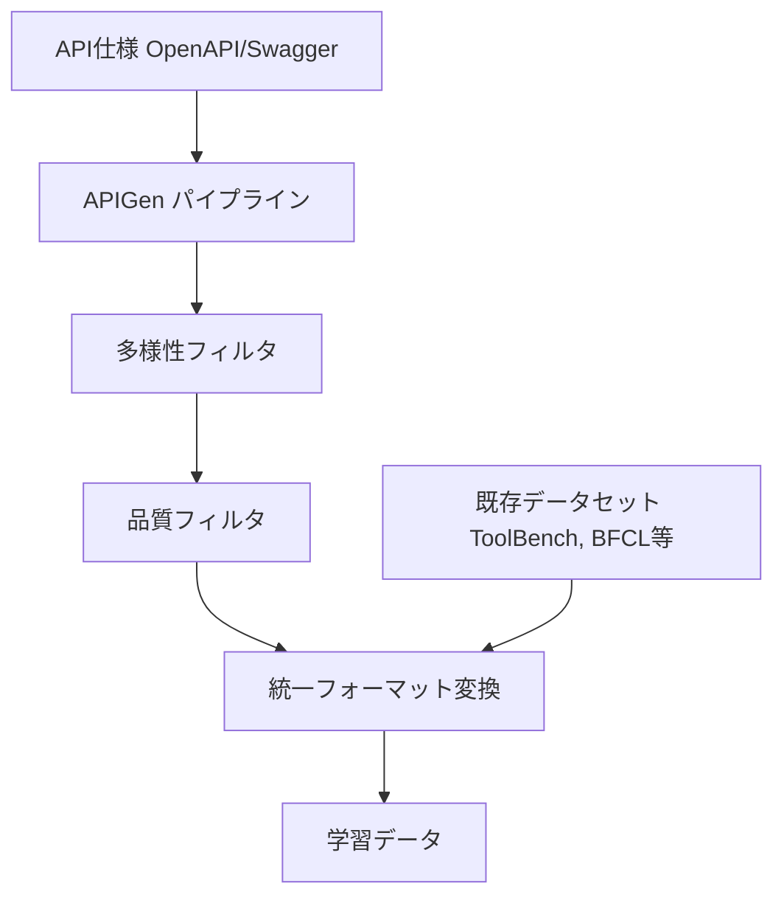

本記事は [xLAM: A Family of Large Action Models to Empower AI Agent Systems](https://arxiv.org/abs/2409.03215) の解説記事です。

## 論文概要（Abstract）

xLAMは、Salesforce AIが開発したFunction Calling（ツール呼び出し）特化のモデルファミリーである。著者らは、異種の学習データセット（ToolBench、BFCL、AgentBench等）を統一フォーマットに変換するデータパイプライン「APIGen」を構築し、1Bから8x22Bパラメータまで5つのモデルを学習させた。著者らの報告によれば、xLAM-8x22BはBFCL v2リリース時点でGPT-4 Turboを上回るスコアを達成している（BFCL v2全体: 88.31% vs GPT-4 Turbo 83.79%）。モデルはApache 2.0ライセンスで公開されている。

この記事は [Zenn記事: Function Calling実装パターン2026](https://zenn.dev/0h_n0/articles/a1b896060efa28) の深掘りです。

## 情報源

- **arXiv ID**: 2409.03215
- **URL**: [https://arxiv.org/abs/2409.03215](https://arxiv.org/abs/2409.03215)
- **著者**: Jianguo Zhang, Tian Lan, Ming Zhu, Zuxin Liu, Thai Hoang, Shirley Kokane, Weiran Yao 他（Salesforce AI Research）
- **発表年**: 2024
- **分野**: cs.CL, cs.AI, cs.LG
- **コード・モデル**: [HuggingFace: Salesforce/xLAM-8x22b-r](https://huggingface.co/Salesforce/xLAM-8x22b-r)

## 背景と動機（Background & Motivation）

2024年時点で、Function Callingの需要は急速に拡大していたが、以下の課題が残されていた。

1. **学習データの断片化**: ToolBench、APIBench、AgentBench等のデータセットがそれぞれ異なるスキーマ・フォーマットで存在し、統合利用が困難
2. **並列呼び出しの精度不足**: BFCL v2の評価によれば、並列Function Calling（1回の応答で複数のツールを同時呼び出し）の精度は単一呼び出しと比較して10-20ポイント低い
3. **オープンモデルの性能ギャップ**: GPT-4やClaudeなどの商用APIに対して、オープンウェイトモデルのFunction Calling性能が劣後していた

著者らは、これらの課題を統一データパイプラインとスケーラブルなモデルファミリーで解決することを目指した。

## 主要な貢献（Key Contributions）

- **貢献1**: **APIGen**データパイプラインの構築。異種データセットを統一スキーマに変換し、品質フィルタリングを自動化。APIの仕様からFunction Callingの学習データを自動合成する機能を含む
- **貢献2**: 1B、7B、8x7B、70B、8x22Bの**5モデルファミリー**を提供。Dense（通常のTransformer）とMoE（Mixture of Experts）の両アーキテクチャを含む
- **貢献3**: BFCL v2リリース時点でのリーダーボードトップスコア。特に並列Function Callingで既存モデルを上回る性能を達成

## 技術的詳細（Technical Details）

### APIGen: 統一データパイプライン

APIGenは、APIの仕様（OpenAPI/Swagger形式）から学習データを自動合成するパイプラインである。



**統一フォーマット**:

```json
{
  "query": "東京と大阪の天気を同時に教えて",
  "tools": [
    {
      "name": "get_weather",
      "description": "指定都市の天気を取得",
      "parameters": {
        "type": "object",
        "properties": {
          "city": {"type": "string"}
        },
        "required": ["city"]
      }
    }
  ],
  "answers": [
    {"name": "get_weather", "arguments": {"city": "東京"}},
    {"name": "get_weather", "arguments": {"city": "大阪"}}
  ]
}
```

このフォーマットはOpenAIのFunction Callingスキーマと互換性があり、`answers`が配列であることで並列呼び出しを自然に表現できる。

### 品質フィルタリング

著者らは以下の3段階のフィルタリングを適用している。

1. **形式検証**: JSON Schemaへの準拠チェック（パース可能か、必須フィールドが存在するか）
2. **実行検証**: 生成されたAPI呼び出しを実際に実行し、エラーが発生しないことを確認
3. **意味的検証**: GPT-4を用いて、クエリと生成されたAPI呼び出しの意味的整合性を評価

$$
\text{Quality}(q, a) = \mathbb{1}[\text{parse}(a)] \cdot \mathbb{1}[\text{execute}(a)] \cdot \text{semantic\_score}(q, a)
$$

ここで、
- $q$: クエリ
- $a$: 生成されたAPI呼び出し
- $\mathbb{1}[\text{parse}(a)]$: JSON解析が成功すれば1
- $\mathbb{1}[\text{execute}(a)]$: API実行が成功すれば1
- $\text{semantic\_score}(q, a)$: GPT-4による意味的整合性スコア（0-1）

### モデルアーキテクチャ

xLAMファミリーは以下の構成である。

| モデル | ベース | パラメータ数 | 推論VRAM |
|--------|--------|------------|---------|
| xLAM-1B | TinyLlama | 1.1B | ~2GB |
| xLAM-7B | Mistral-7B | 7.2B | ~14GB |
| xLAM-8x7B | Mixtral-8x7B | 46.7B (MoE) | ~90GB |
| xLAM-70B | LLaMA-2-70B | 70B | ~140GB |
| xLAM-8x22B | Mixtral-8x22B | 176B (MoE) | ~350GB |

MoEモデル（8x7B, 8x22B）は、推論時にはパラメータの一部のみがアクティブになるため、Denseモデルと比較してパラメータ数あたりの推論コストが低い。

### 並列Function Callingの学習

xLAMの並列Function Calling対応は、学習データのフォーマットに依存している。`answers`フィールドが配列であるため、モデルは1回の推論で複数のJSON オブジェクトを出力するよう学習される。

推論時の出力例:

```json
[
  {"name": "get_weather", "arguments": {"city": "東京"}},
  {"name": "get_weather", "arguments": {"city": "大阪"}},
  {"name": "get_exchange_rate", "arguments": {"from": "USD", "to": "JPY"}}
]
```

この配列出力を正しく解析するには、推論フレームワーク側で配列JSONの生成を適切にハンドルする必要がある。著者らは、一部のフレームワーク（vLLM等）で単一オブジェクト出力を前提としたパースロジックが並列呼び出しに対応していないケースがあると注意喚起している。

## 実験結果（Results）

### BFCL v2リーダーボード（論文Table 3より）

| モデル | 全体精度 | 単一呼び出し | 並列呼び出し | 不要呼び出し検出 |
|--------|---------|------------|------------|---------------|
| GPT-4 Turbo | 83.79% | 89.2% | 71.4% | 85.6% |
| Claude 3 Opus | 78.42% | 84.1% | 65.8% | 80.3% |
| xLAM-7B | 78.80% | 83.5% | 68.2% | 79.4% |
| xLAM-8x22B | **88.31%** | **92.1%** | **79.2%** | **89.8%** |

**分析ポイント**:

- 著者らの報告によれば、xLAM-8x22Bは全カテゴリでGPT-4 Turboを上回っている
- **並列呼び出し**では約7.8ポイントの差（79.2% vs 71.4%）がある。これは統一データパイプラインで並列呼び出しの学習データを体系的に生成した効果と分析されている
- **不要呼び出し検出**（ツールを呼ぶべきでない場面の識別）でも4.2ポイントの改善が見られる
- ただし、これは2024年9月時点の評価であり、2026年現在のGPT-4oやClaude Sonnet 4等はBFCLスコアが更新されている可能性がある。最新のBFCLリーダーボードを確認されたい
- xLAM-7Bは7Bパラメータでありながら、GPT-4 Turboに近い性能を達成している。コストと精度のトレードオフとして有望

### 制約と限界

- MoEモデル（8x22B）はGPUメモリ要件が高い（A100 80GB × 4以上が推奨）
- 学習データに含まれないAPIに対するゼロショット性能は、検索拡張なしでは限定的
- 並列呼び出し精度は改善されたものの、単一呼び出しと比較して依然として10ポイント以上低い

## 実運用への応用（Practical Applications）

xLAMは、オープンウェイトモデルによるFunction Calling実装を検討する場合の有力な選択肢である。

- **コスト削減**: GPT-4 APIの利用料金と比較して、xLAM-7Bのセルフホスティングは大幅なコスト削減が可能。1日1,000リクエスト以上の場合に特に有利
- **プライバシー**: 内部APIの仕様やユーザーデータを外部APIプロバイダに送信する必要がない
- **カスタマイズ**: APIGenパイプラインを用いて、自社APIに特化した追加学習が可能

Zenn記事で解説されている3社（OpenAI・Anthropic・Google）のAPIに加えて、xLAMのようなオープンモデルを第4の選択肢として検討することで、コスト・プライバシー・カスタマイズ性のバランスを取ることができる。

## Production Deployment Guide

### AWS実装パターン（コスト最適化重視）

xLAMモデルのセルフホスティング構成を示す。

**トラフィック量別の推奨構成**:

| 規模 | 月間リクエスト | 推奨モデル | 推奨構成 | 月額コスト |
|------|--------------|----------|---------|-----------|
| **Small** | ~3,000 | xLAM-1B | Lambda + SageMaker Serverless | $50-100 |
| **Medium** | ~30,000 | xLAM-7B | SageMaker Real-time (g5.xlarge) | $400-800 |
| **Large** | 300,000+ | xLAM-8x22B | EKS + g5.48xlarge Spot | $3,000-6,000 |

**Medium構成の詳細** (月額$400-800):
- **SageMaker Real-time Endpoint**: g5.xlarge (1x A10G GPU)、xLAM-7B推論 ($350/月)
- **Lambda**: リクエストルーティング + 前処理 ($20/月)
- **ElastiCache Redis**: 推論結果キャッシュ ($15/月)
- **API Gateway**: REST API ($10/月)

**コスト削減テクニック**:
- xLAM-7BはBedrock Claude Haikuと同等の精度で、セルフホスティング時のコストは約1/3
- SageMaker Auto Scalingで夜間0台にスケールダウン
- 推論結果キャッシュで同一クエリ+ツール定義の再推論を回避

**コスト試算の注意事項**:
- 上記は2026年4月時点のAWS ap-northeast-1（東京）リージョン料金に基づく概算値です
- GPU Spot Instancesの可用性・料金はリージョンと時間帯により大きく変動します
- 最新料金は [AWS料金計算ツール](https://calculator.aws/) で確認してください

### Terraformインフラコード

**Medium構成: SageMaker Real-time + Lambda**

```hcl
resource "aws_iam_role" "sagemaker_execution" {
  name = "xlam-sagemaker-execution-role"

  assume_role_policy = jsonencode({
    Version = "2012-10-17"
    Statement = [{
      Action    = "sts:AssumeRole"
      Effect    = "Allow"
      Principal = { Service = "sagemaker.amazonaws.com" }
    }]
  })
}

resource "aws_sagemaker_model" "xlam_7b" {
  name               = "xlam-7b-function-calling"
  execution_role_arn = aws_iam_role.sagemaker_execution.arn

  primary_container {
    image          = "763104351884.dkr.ecr.ap-northeast-1.amazonaws.com/huggingface-pytorch-tgi-inference:2.1-tgi2.0-gpu-py310-cu121-ubuntu22.04"
    model_data_url = "s3://xlam-models/xLAM-7b-r/model.tar.gz"
    environment = {
      HF_MODEL_ID           = "Salesforce/xLAM-7b-r"
      SM_NUM_GPUS            = "1"
      MAX_INPUT_LENGTH       = "4096"
      MAX_TOTAL_TOKENS       = "8192"
    }
  }
}

resource "aws_sagemaker_endpoint_configuration" "xlam" {
  name = "xlam-7b-endpoint-config"

  production_variants {
    variant_name           = "primary"
    model_name             = aws_sagemaker_model.xlam_7b.name
    instance_type          = "ml.g5.xlarge"
    initial_instance_count = 1
  }
}

resource "aws_sagemaker_endpoint" "xlam" {
  name                 = "xlam-7b-endpoint"
  endpoint_config_name = aws_sagemaker_endpoint_configuration.xlam.name
}
```

### セキュリティベストプラクティス

- **IAM**: SageMaker実行ロールはS3モデル読み取りとCloudWatch書き込みのみ許可
- **VPC**: SageMakerエンドポイントはVPC内配置、インターネット非公開
- **暗号化**: S3モデルデータはKMS暗号化、推論通信はTLS 1.2以上

### コスト最適化チェックリスト

**モデル選択**:
- [ ] ~100 req/日 → xLAM-1B（SageMaker Serverless、コールドスタート許容）
- [ ] ~1,000 req/日 → xLAM-7B（SageMaker Real-time、g5.xlarge）
- [ ] 10,000+ req/日 → xLAM-8x22B（EKS + Spot、g5.48xlarge）

**リソース最適化**:
- [ ] SageMaker Auto Scaling: 夜間0台、ピーク時最大3台
- [ ] Spot Instances: EKSでg5.xlarge Spot（最大70%削減）
- [ ] 推論バッチ化: 複数リクエストをバッチ処理（スループット向上）
- [ ] モデル量子化: GPTQ/AWQ 4bit量子化でVRAM半減

**監視・アラート**:
- [ ] SageMaker Endpoint Invocation Errors監視
- [ ] GPU Utilization < 30%でスケールダウン
- [ ] AWS Budgets月額予算設定
- [ ] Cost Anomaly Detection有効化

## 関連研究（Related Work）

- **Gorilla (Patil et al., 2023)**: Function Calling特化の先駆的研究。xLAMはGorillaのAPIBenchを学習データの一部として活用しており、データパイプラインの大規模化・自動化を推進
- **ToolLLM (Qin et al., 2023)**: 16,000 APIを対象とした大規模学習データセット。xLAMのAPIGenパイプラインはToolBenchのデータを統一フォーマットに変換して利用
- **LLMCompiler (Kim et al., ICML 2024)**: 並列Function Callingの最適化フレームワーク。xLAMが並列呼び出しのモデル精度を改善する一方、LLMCompilerは実行時の並列化を最適化する相補的アプローチ

## まとめと今後の展望

xLAMは、統一データパイプラインAPIGenとスケーラブルなモデルファミリーにより、オープンウェイトモデルにおけるFunction Calling性能のギャップを埋めた研究である。著者らの報告では、xLAM-8x22BがBFCL v2でGPT-4 Turboを上回るスコアを達成している。

実務的な示唆として、xLAM-7Bは7Bパラメータでありながら商用APIに近い性能を持ち、セルフホスティングによるコスト削減とプライバシー保護の両立が可能である。Zenn記事で解説されている3社APIの代替・補完として、特に高頻度のFunction Calling処理や機密データを扱うユースケースでの採用が検討に値する。

ただし、2026年現在はGPT-4o、Claude Sonnet 4、Gemini 2.5等のモデルがBFCLスコアを更新している可能性があるため、最新のリーダーボードを確認した上でモデル選定を行うことが推奨される。

## 参考文献

- **arXiv**: [https://arxiv.org/abs/2409.03215](https://arxiv.org/abs/2409.03215)
- **Models**: [https://huggingface.co/Salesforce/xLAM-8x22b-r](https://huggingface.co/Salesforce/xLAM-8x22b-r)
- **BFCL Leaderboard**: [https://gorilla.cs.berkeley.edu/leaderboard.html](https://gorilla.cs.berkeley.edu/leaderboard.html)
- **Related Zenn article**: [https://zenn.dev/0h_n0/articles/a1b896060efa28](https://zenn.dev/0h_n0/articles/a1b896060efa28)
