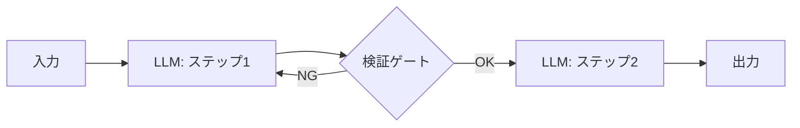
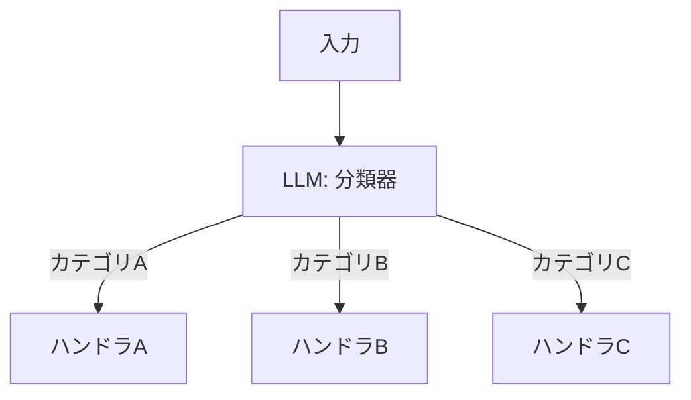
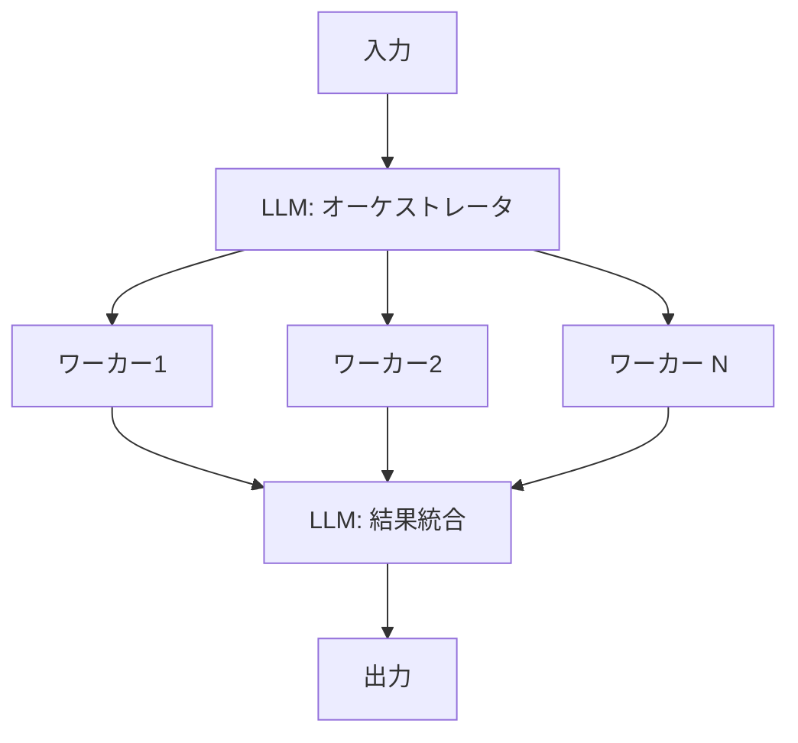
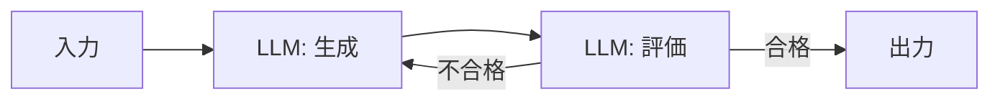

本記事は [Building Effective Agents — Anthropic Research](https://www.anthropic.com/research/building-effective-agents) の解説記事です。

## ブログ概要（Summary）

Anthropicが2024年12月に公開した「Building Effective Agents」は、LLMを用いたエージェントシステムの設計に関する実践ガイドである。著者らは、エージェント（Agent）とワークフロー（Workflow）を明確に区別し、5つのワークフローパターン（Prompt Chaining、Routing、Parallelization、Orchestrator-Workers、Evaluator-Optimizer）を体系化している。本ブログの中心的な主張は「最も洗練されたシステムを構築することではなく、ニーズに適したシステムを構築することが成功の鍵」であるという点にある。

この記事は [Zenn記事: Function Calling実装パターン2026](https://zenn.dev/0h_n0/articles/a1b896060efa28) の深掘りです。

## 情報源

- **種別**: 企業テックブログ（Anthropic Research）
- **URL**: [https://www.anthropic.com/research/building-effective-agents](https://www.anthropic.com/research/building-effective-agents)
- **組織**: Anthropic
- **発表日**: 2024年12月

## 技術的背景（Technical Background）

2024年以降、LLMのFunction Calling機能が各社（OpenAI、Anthropic、Google）で標準化されたことで、LLMに外部ツールを使わせることは技術的に容易になった。しかし、「ツールを呼べる」ことと「ツールを適切に使えるエージェントを構築する」ことには大きなギャップがある。

Anthropicのブログが取り組む課題は以下の3点である。

1. **ワークフローとエージェントの混同**: 「エージェント」という用語が曖昧に使われ、固定パイプラインと自律的な意思決定の区別が不明確
2. **過度な複雑性**: フレームワークの多層化により、シンプルなLLM呼び出しで解決可能な問題に対しても不必要に複雑なアーキテクチャが採用される傾向
3. **ツール設計の軽視**: LLMが使うツールのインターフェース設計が、人間向けUIの設計と同程度に重要であるにもかかわらず、十分な注意が払われていない

## 核心概念: ワークフローとエージェントの区別

Anthropicはこの2つを以下のように定義している。

- **ワークフロー（Workflow）**: LLMとツールがあらかじめ定義されたコードパスに沿ってオーケストレーションされるシステム。分岐条件や実行順序がコードで静的に決まる
- **エージェント（Agent）**: LLMが自身のプロセスとツール使用を動的に制御するシステム。各ステップでLLM自身が次のアクションを判断する

この区別は、Zenn記事で解説されているFunction Callingの3ステップ（ツール定義→モデル判断→結果返却）のうち、「モデル判断」の自律度に対応する。

## ワークフロー5パターンの詳細

### 1. Prompt Chaining（プロンプト連鎖）

タスクを固定的なステップに分解し、各ステップの出力を次のステップの入力とする最もシンプルなパターンである。



**適用場面**: 各ステップが明確に定義でき、後続処理が前ステップの結果に依存する場合。例えば、ドキュメント生成（アウトライン→本文→校正）やコード生成（仕様→実装→テスト）。

**Function Callingとの関連**: Zenn記事の基本フロー（tool_use → tool_result → 最終応答）はPrompt Chainingの1ステップに相当する。複数のtool_useが連鎖する場合がこのパターンである。

### 2. Routing（ルーティング）

入力を分類し、専門化されたハンドラに振り分けるパターンである。



**適用場面**: 入力の種類が多様で、それぞれに異なるツール群やプロンプトが必要な場合。カスタマーサポートで、問い合わせ種別（返金・技術的問題・一般質問）に応じて異なるツールセットを使う例が挙げられている。

**Function Callingとの関連**: Routingの分類器自体をFunction Callingで実装できる。分類関数を定義し、その結果に基づいてtool_choiceを動的に変更するパターンが実用的である。

### 3. Parallelization（並列化）

独立したサブタスクを同時実行するパターンで、Anthropicは2つのバリエーションを示している。

**Sectioning（分割）**: 独立したサブタスクを並列に処理し、結果を統合する。

```python
import asyncio

async def parallel_sectioning(query: str) -> dict:
    """独立したサブタスクを並列実行"""
    results = await asyncio.gather(
        analyze_sentiment(query),
        extract_entities(query),
        classify_topic(query),
    )
    return {"sentiment": results[0], "entities": results[1], "topic": results[2]}
```

**Voting（投票）**: 同一タスクを複数回実行し、結果を集約して信頼性を高める。

```python
async def parallel_voting(query: str, n_votes: int = 3) -> str:
    """同一タスクを複数回実行して多数決"""
    results = await asyncio.gather(
        *[generate_answer(query) for _ in range(n_votes)]
    )
    return majority_vote(results)
```

**Function Callingとの関連**: Sectioningは、Zenn記事で解説されている並列Function Calling（`asyncio.gather`による複数ツール同時実行）と直接対応する。Votingはツール実行の信頼性向上手法として位置づけられる。

### 4. Orchestrator-Workers（オーケストレータ・ワーカー）

中央のLLM（オーケストレータ）がタスクを動的に分解し、ワーカーLLMに委任するパターンである。Prompt Chainingとの違いは、分解の仕方が入力に依存して動的に変わる点にある。



**適用場面**: コーディングタスク（どのファイルを修正すべきか事前に分からない場合）やリサーチタスク（検索クエリを動的に生成する場合）。

**Function Callingとの関連**: LLMCompiler（前述のICML 2024論文）のFunction Calling Plannerは、このOrchestrator-Workersパターンをコンパイラ最適化の形式で実装したものと解釈できる。

### 5. Evaluator-Optimizer（評価者・最適化者）

1つのLLMが出力を生成し、別のLLMがその品質を評価してフィードバックを返すループパターンである。



**適用場面**: 翻訳の品質向上、コードの反復的改善（テスト実行→エラー修正のループ）。

**Function Callingとの関連**: Zenn記事のエラーリカバリ戦略（ツール実行失敗→LLMにエラーを返す→再試行）は、このパターンの一種である。

## エージェント設計の原則

Anthropicが強調する設計原則は以下の3つである。

### 1. シンプルさの優先

ブログの中心的主張は、「LLM空間での成功は、最も洗練されたシステムを構築することではなく、ニーズに適したシステムを構築すること」であるとされている。具体的には以下の順序で複雑性を増やすことが推奨されている。

1. 単純なLLM呼び出し（+プロンプト最適化）
2. ワークフロー（上記5パターン）
3. 自律エージェント

各段階で十分な性能が得られるなら、より複雑な段階に進む必要はない。

### 2. ツール設計はHCIと同等に重要

LLMが使うツールのインターフェース設計は、人間向けUIの設計と同程度の注意が必要であると主張されている。具体的な推奨事項は以下の通り。

- **descriptionの具体性**: ツールの説明文にユースケースとエッジケースを含める
- **自然なフォーマット**: LLMが学習したインターネットテキストに近い形式でツールを定義する
- **オーバーヘッドの最小化**: 不要なパラメータや複雑なネストを避ける

これはZenn記事の「よくある問題と解決方法」セクション（ツールが呼ばれない→descriptionを具体的に書く）と直接対応する。

### 3. フレームワークへの警戒

Anthropicはフレームワークの使用について慎重な姿勢を示しており、「フレームワークは統合を簡素化するが、基盤となるメカニクスを不明瞭にする」と述べている。標準的なパターンについてはAPI直接呼び出しで十分な場合が多いと指摘されている。

## 実践応用: カスタマーサポートとコーディングエージェント

ブログでは2つの具体的な応用分野が挙げられている。

### カスタマーサポート

ツール呼び出し（返金処理、チケット更新、FAQ検索）と会話を組み合わせる典型的なユースケースとして紹介されている。成功指標が明確（問題解決率、顧客満足度）であり、ツール呼び出しの成否を検証しやすい点が利点である。

### コーディングエージェント

自動テスト実行による検証が可能であり、Evaluator-Optimizerパターンの適用に適している。テスト結果をFunction Callingの結果としてLLMに返し、コード修正を反復する設計が推奨されている。

## Production Deployment Guide

### AWS実装パターン（コスト最適化重視）

Anthropicのワークフローパターンを、AWS上でFunction Callingエージェントとして実装する構成を示す。

**トラフィック量別の推奨構成**:

| 規模 | 月間リクエスト | 推奨構成 | 月額コスト | 主要サービス |
|------|--------------|---------|-----------|------------|
| **Small** | ~3,000 (100/日) | Serverless | $50-150 | Lambda + Bedrock + DynamoDB |
| **Medium** | ~30,000 (1,000/日) | Hybrid | $300-800 | Lambda + ECS Fargate + ElastiCache |
| **Large** | 300,000+ (10,000/日) | Container | $2,000-5,000 | EKS + Karpenter + EC2 Spot |

**Small構成の詳細** (月額$50-150):
- **Lambda**: ワークフローオーケストレーション + ツール実行、1GB RAM ($20/月)
- **Bedrock**: Claude 3.5 Haiku、Prompt Caching有効 ($80/月)
- **DynamoDB**: 会話状態・ツール結果キャッシュ、On-Demand ($10/月)
- **Step Functions**: ワークフローパターン制御（Routing、Parallelization） ($5/月)

**コスト削減テクニック**:
- Prompt Caching有効化でシステムプロンプト+ツール定義の入力コストを30-90%削減
- Routingパターンで軽量タスクにHaikuモデル、複雑タスクにSonnetモデルを振り分け
- Votingパターンの並列実行数を3回に制限（Anthropicの推奨）
- DynamoDBでツール実行結果をキャッシュし、同一ツール呼び出しの重複を回避

**コスト試算の注意事項**:
- 上記は2026年4月時点のAWS ap-northeast-1（東京）リージョン料金に基づく概算値です
- 実際のコストはトラフィックパターン、リージョン、バースト使用量により変動します
- 最新料金は [AWS料金計算ツール](https://calculator.aws/) で確認してください

### Terraformインフラコード

**Small構成 (Serverless): Lambda + Step Functions + Bedrock**

```hcl
module "vpc" {
  source  = "terraform-aws-modules/vpc/aws"
  version = "~> 5.0"

  name = "agent-workflow-vpc"
  cidr = "10.0.0.0/16"
  azs  = ["ap-northeast-1a", "ap-northeast-1c"]
  private_subnets = ["10.0.1.0/24", "10.0.2.0/24"]

  enable_nat_gateway   = false
  enable_dns_hostnames = true
}

resource "aws_iam_role" "workflow_lambda" {
  name = "agent-workflow-lambda-role"

  assume_role_policy = jsonencode({
    Version = "2012-10-17"
    Statement = [{
      Action    = "sts:AssumeRole"
      Effect    = "Allow"
      Principal = { Service = "lambda.amazonaws.com" }
    }]
  })
}

resource "aws_iam_role_policy" "bedrock_invoke" {
  role = aws_iam_role.workflow_lambda.id
  policy = jsonencode({
    Version = "2012-10-17"
    Statement = [{
      Effect   = "Allow"
      Action   = ["bedrock:InvokeModel", "bedrock:InvokeModelWithResponseStream"]
      Resource = "arn:aws:bedrock:ap-northeast-1::foundation-model/anthropic.claude-*"
    }]
  })
}

resource "aws_lambda_function" "workflow_handler" {
  filename      = "workflow.zip"
  function_name = "agent-workflow-handler"
  role          = aws_iam_role.workflow_lambda.arn
  handler       = "index.handler"
  runtime       = "python3.12"
  timeout       = 120
  memory_size   = 1024

  environment {
    variables = {
      BEDROCK_MODEL_HAIKU  = "anthropic.claude-3-5-haiku-20241022-v1:0"
      BEDROCK_MODEL_SONNET = "anthropic.claude-sonnet-4-6-20250929-v1:0"
      DYNAMODB_TABLE       = aws_dynamodb_table.conversation.name
    }
  }
}

resource "aws_dynamodb_table" "conversation" {
  name         = "agent-conversation-state"
  billing_mode = "PAY_PER_REQUEST"
  hash_key     = "session_id"

  attribute {
    name = "session_id"
    type = "S"
  }

  ttl {
    attribute_name = "expire_at"
    enabled        = true
  }
}
```

### セキュリティベストプラクティス

- **IAMロール**: Bedrock InvokeModelのみ許可、モデルARNをリソースレベルで制限
- **ネットワーク**: Lambda VPC内配置、API Gatewayにはweb ACLを適用
- **シークレット**: Secrets Manager経由でAPIキーを取得
- **暗号化**: DynamoDB/S3は全てKMS暗号化

### 運用・監視設定

**CloudWatch Logs Insights クエリ**:

```sql
fields @timestamp, workflow_pattern, tool_count, total_latency_ms
| stats avg(total_latency_ms) as avg_latency,
        count(*) as requests
  by workflow_pattern, bin(1h)
| sort avg_latency desc
```

### コスト最適化チェックリスト

**アーキテクチャ選択**:
- [ ] ~100 req/日 → Lambda + Step Functions - $50-150/月
- [ ] ~1,000 req/日 → ECS Fargate + ElastiCache - $300-800/月
- [ ] 10,000+ req/日 → EKS + Spot Instances - $2,000-5,000/月

**Anthropicパターン固有の最適化**:
- [ ] Routingパターン: 軽量クエリにHaiku、複雑クエリにSonnetを振り分け
- [ ] Parallelization: Sectioning活用で独立ツール呼び出しを並列化
- [ ] Evaluator-Optimizer: 評価ループ上限を3回に設定（コスト爆発防止）
- [ ] Prompt Caching: システムプロンプト+ツール定義を固定化して90%削減

**リソース最適化**:
- [ ] EC2 Spot Instances優先（最大90%削減）
- [ ] Lambda メモリ最適化（Routing分類: 512MB、ツール実行: 1024MB）
- [ ] Step Functions Express Workflow（短時間処理はStandard不要）
- [ ] ECS/EKS アイドル時スケールダウン

**監視・アラート**:
- [ ] AWS Budgets月額予算設定
- [ ] CloudWatch ワークフローパターン別レイテンシ監視
- [ ] Cost Anomaly Detection有効化
- [ ] Evaluator-Optimizerループ回数アラート

## 学術研究との関連（Academic Connection）

- **ReAct (Yao et al., 2022)**: Anthropicのエージェント定義は、ReActの「思考→行動→観察」パラダイムの産業応用版と位置づけられる。Prompt ChainingはReActの固定化版、エージェントはReActの自律版に対応する
- **LLMCompiler (Kim et al., ICML 2024)**: Orchestrator-Workersパターンは、LLMCompilerのPlanner+Executorアーキテクチャと構造的に類似する。LLMCompilerはDAGベースの形式化を行っている点でより厳密
- **Chain-of-Thought (Wei et al., 2022)**: Evaluator-Optimizerパターンは、Self-Consistency (Wang et al., 2022) の実装パターンとして解釈可能

## まとめと実践への示唆

Anthropicの「Building Effective Agents」は、Function Callingの実装パターンを体系化した実践ガイドである。著者らの主張に基づく重要な設計指針は以下の通り。

1. **シンプルさ優先**: 単純なLLM呼び出しで解決可能な問題にフレームワークは不要
2. **段階的複雑化**: ワークフロー5パターン→エージェントの順で必要に応じて複雑性を追加
3. **ツール設計への投資**: descriptionの品質がFunction Callingの成否を決定する
4. **エラー回復の組み込み**: Evaluator-Optimizerパターンで反復改善を設計に組み込む

これらの指針は、Zenn記事で解説されているOpenAI・Claude・Geminiの並列呼び出し、エラーリカバリ、ストリーミングの実装パターンと相補的であり、「どの技術をどの場面で使うか」の判断基準を提供するものである。

## 参考文献

- **Blog URL**: [https://www.anthropic.com/research/building-effective-agents](https://www.anthropic.com/research/building-effective-agents)
- **Model Context Protocol**: [https://modelcontextprotocol.io/](https://modelcontextprotocol.io/)
- **Related Zenn article**: [https://zenn.dev/0h_n0/articles/a1b896060efa28](https://zenn.dev/0h_n0/articles/a1b896060efa28)
