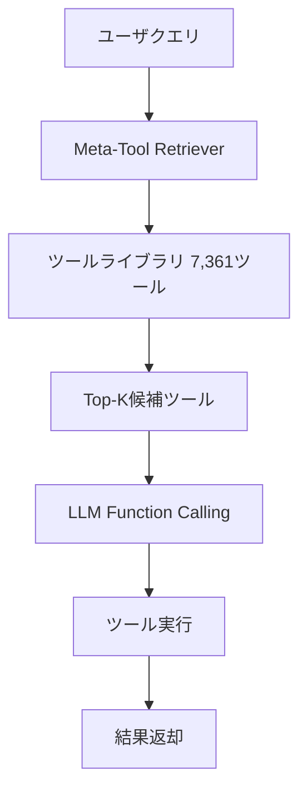

本記事は [ACL 2025 "Meta-Tool: Unleash Open-World Function Calling Capabilities of General-Purpose Large Language Models"](https://aclanthology.org/2025.acl-long.1481/) の解説記事です。

## 論文概要（Abstract）

汎用LLMに外部ツールライブラリへの動的アクセス能力を付与するMeta-Toolシステムと、オープンワールドfunction calling評価のためのMeta-Benchベンチマーク（2,800ダイアログ・7,361ツール・10シナリオ）を提案した研究である。著者らはLLaMA-3.1をファインチューニングしたMT-LLaMAモデルが、ツール検索精度においてGPT-4oと同等以上の性能を達成したと報告している。

この記事は [Zenn記事: AIエージェントツール設計の7原則：Anthropic・OpenAI公式ガイドに学ぶ実装パターン](https://zenn.dev/0h_n0/articles/c1f033224797db) の深掘りです。

## 情報源

- **会議名**: ACL 2025（63rd Annual Meeting of the Association for Computational Linguistics）
- **年**: 2025
- **URL**: [https://aclanthology.org/2025.acl-long.1481/](https://aclanthology.org/2025.acl-long.1481/)
- **著者**: Shengqian Qin, Yakun Zhu, Linjie Mu, Shaoting Zhang, Xiaofan Zhang
- **開催地**: ウィーン（オーストリア）

## カンファレンス情報

**ACLについて**: ACL（Association for Computational Linguistics）は自然言語処理・計算言語学分野の最高峰の国際会議の一つである。本論文はLong Paperとして採択されており、査読者による厳格な審査を通過している。

## 背景と動機（Background & Motivation）

既存のLLMのfunction calling能力は、**事前に定義されたツールセット**に制限されている。しかし実世界のアプリケーションでは、ユーザの要求に応じてAPIカタログやプラグインストアから適切なツールを動的に検索・選択する「オープンワールド」なfunction callingが求められる。

この課題は以下の技術的困難を含む:

1. **スケーラビリティ**: 数千のツール定義をLLMのコンテキストウィンドウに収めることは不可能
2. **検索精度**: 自然言語クエリから最適なツールをセマンティック検索で特定する必要がある
3. **汎化能力**: 学習時に見たことのないツールにも対応しなければならない

Anthropicが提唱するTool Search Toolは同様の課題に対処するアプローチだが、Meta-Toolはより体系的なベンチマークと検索手法を提供する。

## 主要な貢献（Key Contributions）

- **貢献1**: オープンワールドfunction calling評価のための初の包括的ベンチマーク「Meta-Bench」の構築（2,800ダイアログ・7,361ツール・10シナリオ）
- **貢献2**: 外部ツールライブラリへの動的検索・選択を実現するMeta-Toolシステムの提案
- **貢献3**: MT-LLaMA（LLaMA-3.1ファインチューニングモデル）がGPT-4oと同等以上のツール検索精度を達成

## 技術的詳細（Technical Details）

### Meta-Toolアーキテクチャ



Meta-Toolは2段階のパイプラインで構成される:

**Stage 1: Tool Retrieval（ツール検索）**

ユーザクエリに対して大規模ツールライブラリから関連ツールを検索する。著者らはセマンティック検索とLLMベースのリランキングを組み合わせたアプローチを採用している。

検索スコアは以下のように定式化される:

$$
\text{RetrievalScore}(q, t) = \alpha \cdot \text{sim}(\mathbf{e}_q, \mathbf{e}_t) + (1 - \alpha) \cdot \text{LLM\_rerank}(q, t)
$$

ここで、$q$はユーザクエリ、$t$はツール定義、$\mathbf{e}_q$と$\mathbf{e}_t$はそれぞれの埋め込みベクトル、$\text{sim}$はコサイン類似度、$\text{LLM\_rerank}$はLLMによるリランキングスコア、$\alpha$はバランスパラメータである。

**Stage 2: Function Calling（ツール呼び出し）**

検索されたTop-K候補ツールをコンテキストに含め、LLMが適切なツールを選択しパラメータを生成する。

### Meta-Benchベンチマーク

Meta-Benchは以下の10シナリオで構成される:

| シナリオ | ツール数 | ダイアログ数 | 特性 |
|---|---|---|---|
| E-commerce | ~800 | 280 | 商品検索・注文処理 |
| Travel | ~700 | 280 | 予約・経路検索 |
| Finance | ~600 | 280 | 取引・分析 |
| Healthcare | ~600 | 280 | 予約・情報検索 |
| Education | ~500 | 280 | コンテンツ管理 |
| Social Media | ~700 | 280 | 投稿・分析 |
| IoT/Smart Home | ~500 | 280 | デバイス制御 |
| Developer Tools | ~800 | 280 | CI/CD・デプロイ |
| Entertainment | ~600 | 280 | メディア管理 |
| Productivity | ~661 | 280 | タスク管理 |
| **合計** | **7,361** | **2,800** | — |

各ダイアログは単一ツール呼び出しから複数ツールのチェーン呼び出しまでを含む。

### MT-LLaMAモデル

MT-LLaMAはLLaMA-3.1をMeta-Bench上でファインチューニングしたモデルである。著者らはツール検索タスクに特化した学習を行い、汎用モデルでありながらツール検索に特化したGPT-4oと同等以上の精度を達成したと報告している。

## 実装のポイント（Implementation）

```python
from dataclasses import dataclass


@dataclass
class MetaToolConfig:
    """Meta-Toolシステム設定"""

    embedding_model: str = "text-embedding-3-large"
    reranker_model: str = "meta-llama/Meta-Llama-3.1-8B-Instruct"
    top_k_retrieval: int = 20
    top_k_rerank: int = 5
    alpha: float = 0.6
    tool_library_path: str = "tools/"


def retrieve_tools(
    query: str,
    tool_embeddings: dict[str, list[float]],
    config: MetaToolConfig,
) -> list[dict]:
    """ユーザクエリから関連ツールを検索する。

    Args:
        query: ユーザクエリ文字列
        tool_embeddings: ツールID→埋め込みベクトルの辞書
        config: Meta-Tool設定

    Returns:
        Top-K関連ツールのリスト
    """
    query_embedding = embed(query, config.embedding_model)

    scores = {}
    for tool_id, tool_emb in tool_embeddings.items():
        scores[tool_id] = cosine_similarity(query_embedding, tool_emb)

    top_k = sorted(scores, key=scores.get, reverse=True)[:config.top_k_retrieval]
    return [get_tool_definition(tid) for tid in top_k]
```

実装上の重要なポイント:
- **ツールライブラリのインデックス**: 7,361ツールの埋め込みベクトルを事前計算し、ベクトルDBに格納することで検索レイテンシを削減する
- **チャンク化**: ツール定義が長い場合はdescription、parameters、examplesを分離してインデックスする
- **リランキングの閾値**: 検索結果のうちスコアが閾値未満のツールは除外し、不要なコンテキスト肥大化を防止する

## Production Deployment Guide

### AWS実装パターン（コスト最適化重視）

Meta-Toolのツール検索+Function Callingパイプラインのデプロイ構成を示す。

**トラフィック量別の推奨構成**:

| 規模 | 月間リクエスト | 推奨構成 | 月額コスト | 主要サービス |
|------|--------------|---------|-----------|------------|
| **Small** | ~3,000 (100/日) | Serverless | $100-250 | Lambda + Bedrock + OpenSearch Serverless |
| **Medium** | ~30,000 (1,000/日) | Hybrid | $500-1,500 | ECS Fargate + OpenSearch + Bedrock |
| **Large** | 300,000+ (10,000/日) | Container | $3,000-8,000 | EKS + OpenSearch Managed + SageMaker |

**Small構成の詳細**（月額$100-250）:
- **Lambda**: ツール検索クエリ処理（$20/月）
- **Bedrock**: Claude 3.5 Haiku、Function Calling推論（$120/月）
- **OpenSearch Serverless**: ツール埋め込みベクトルのk-NN検索（$80/月）
- **S3**: ツールライブラリ定義保存（$5/月）

**コスト削減テクニック**:
- OpenSearch Serverlessのauto-pause: アイドル時にOCUを0にスケールダウン
- Bedrock Prompt Caching: Top-Kツール定義のキャッシュで30-90%削減
- Lambda SnapStart: コールドスタートレイテンシを最大90%削減

**コスト試算の注意事項**: 上記は2026年4月時点のAWS ap-northeast-1リージョン料金に基づく概算値です。OpenSearch Serverlessは最小2 OCU（$700/月程度）が必要なため、Small構成ではサーバレスコレクションの共有を検討してください。最新料金は [AWS料金計算ツール](https://calculator.aws/) で確認してください。

### Terraformインフラコード

```hcl
resource "aws_opensearchserverless_collection" "tool_index" {
  name = "meta-tool-index"
  type = "VECTORSEARCH"

  tags = {
    Project = "meta-tool"
  }
}

resource "aws_opensearchserverless_security_policy" "encryption" {
  name = "meta-tool-encryption"
  type = "encryption"

  policy = jsonencode({
    Rules = [{
      ResourceType = "collection"
      Resource      = ["collection/meta-tool-index"]
    }]
    AWSOwnedKey = true
  })
}

resource "aws_lambda_function" "tool_retriever" {
  filename      = "retriever.zip"
  function_name = "meta-tool-retriever"
  role          = aws_iam_role.lambda_role.arn
  handler       = "index.handler"
  runtime       = "python3.12"
  timeout       = 30
  memory_size   = 512

  environment {
    variables = {
      OPENSEARCH_ENDPOINT = aws_opensearchserverless_collection.tool_index.collection_endpoint
      BEDROCK_MODEL_ID    = "anthropic.claude-3-5-haiku-20241022-v1:0"
      TOP_K_RETRIEVAL     = "20"
      TOP_K_RERANK        = "5"
    }
  }
}
```

### コスト最適化チェックリスト

- [ ] OpenSearch Serverless auto-pause有効化
- [ ] Bedrock Prompt Caching有効化（ツール定義キャッシュ）
- [ ] Lambda SnapStart有効化（コールドスタート削減）
- [ ] 埋め込みモデルのバッチ処理（ツールライブラリ更新時）
- [ ] AWS Budgets月額予算設定（80%で警告）
- [ ] CloudWatchアラーム: 検索レイテンシ・トークン使用量監視
- [ ] ツールライブラリの差分更新（全再インデックス回避）

## 実験結果（Results）

### ツール検索精度

著者らの評価によると、MT-LLaMAはMeta-Benchの10シナリオ全体で、ツール検索精度においてGPT-4oと同等以上の性能を達成した。特に以下の点が報告されている:

- 7,361ツールの大規模ライブラリでも安定した検索精度を維持
- 学習時に見ていないドメインへの汎化能力を実証
- 従来のBM25やセマンティック検索単体と比較して、大幅な精度向上

### 既存手法との比較

Meta-Toolの検索手法は、従来の単純なセマンティック検索に比べて、特にツール数が多い環境で顕著な精度向上を示した。著者らはこの改善が、LLMベースのリランキングによるセマンティック理解の深化に起因すると分析している。

## 実運用への応用（Practical Applications）

1. **大規模ツールカタログの管理**: 10個以上のツールを持つシステムでは、Meta-Toolのアプローチで動的検索を導入することが有効。Zenn記事で解説されているTool Search Toolと本研究のアプローチは同じ課題に対する異なる解決策である
2. **ツールライブラリの拡張性**: 新しいツールの追加時にLLMの再学習なしに検索対象に含めることができ、MCPエコシステムのスケーラビリティに貢献する
3. **Zenn記事との関連**: Zenn記事で解説されているTool Search Toolは、「必要なツールを必要な時にだけロード」するアプローチである。Meta-Toolはこのアプローチの学術的基盤を提供し、7,361ツール規模での有効性を実証している。Anthropicの計測で「58個のツール定義で約55,000トークン」と報告されているコンテキスト肥大化問題に対する、検索ベースの解決策として位置づけられる

## 関連研究（Related Work）

- **ToolLLM（Qin et al., 2023）**: 16,000以上のAPIをLLMに習得させるフレームワーク。ツール検索よりもモデルの直接学習に焦点を当てている
- **Gorilla（Patil et al., 2023）**: 検索拡張によるAPI呼び出し精度向上。Meta-Toolはより大規模なツールセットでの動的検索に特化している
- **Toolshed（2024）**: RAGとツール融合によるスケーラブルなツール管理。Meta-Toolとは補完的なアプローチ

## まとめと今後の展望

Meta-Toolは、オープンワールドfunction callingという実務的に重要な課題に対して、包括的なベンチマーク（Meta-Bench）とツール検索システムを提供した。7,361ツール・10シナリオという規模での評価は、実運用レベルのツール管理における検索手法の有効性を示している。MCPエコシステムにおいて10,000以上のサーバが登録されている現状を踏まえると、動的ツール検索の重要性は今後さらに高まると予想される。

## 参考文献

- **Conference URL**: [https://aclanthology.org/2025.acl-long.1481/](https://aclanthology.org/2025.acl-long.1481/)
- **GitHub**: 著者らがコードとベンチマークを公開
- **Related Zenn article**: [https://zenn.dev/0h_n0/articles/c1f033224797db](https://zenn.dev/0h_n0/articles/c1f033224797db)
