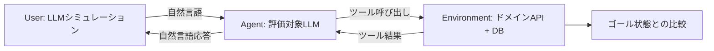

本記事は [arXiv:2406.12045 "τ-bench: A Benchmark for Tool-Agent-User Interaction in Real-World Domains"](https://arxiv.org/abs/2406.12045) の解説記事です。

## 論文概要（Abstract）

LLMエージェントのツール使用能力を、ユーザとの動的な会話の中で評価するベンチマークを提案した研究である。著者らは小売（retail）と航空（airline）の2ドメインで、LLMがシミュレートするユーザとエージェントの間の動的会話を生成し、会話終了時のデータベース状態とゴール状態の比較で評価する。新たに提案されたpass^k指標により、エージェントの信頼性を複数回試行で定量化する。著者らの評価によると、GPT-4oでもタスク成功率は50%未満であり、pass^8（8回試行での一貫成功率）は小売ドメインで25%未満であった。

この記事は [Zenn記事: AIエージェントツール設計の7原則：Anthropic・OpenAI公式ガイドに学ぶ実装パターン](https://zenn.dev/0h_n0/articles/c1f033224797db) の深掘りです。

## 情報源

- **arXiv ID**: 2406.12045
- **URL**: [https://arxiv.org/abs/2406.12045](https://arxiv.org/abs/2406.12045)
- **著者**: Shunyu Yao, Noah Shinn, Pedram Razavi, Karthik Narasimhan
- **発表年**: 2024
- **分野**: cs.AI, cs.CL
- **コード**: [https://github.com/sierra-research/tau-bench](https://github.com/sierra-research/tau-bench)

## 背景と動機（Background & Motivation）

既存のエージェントベンチマーク（SWE-bench、WebArena等）は、エージェントの技術的タスク遂行能力を測定するが、**実際のユーザとのインタラクション**を含まない。しかし実運用において、エージェントはユーザの曖昧な要求を解釈し、ドメイン固有のポリシーに従い、適切なツールを呼び出しながら会話を進行させる必要がある。

著者らは以下の2つの観点が既存ベンチマークで不足していると指摘している:

1. **ユーザインタラクション**: 実際のユーザは指示を変更し、曖昧な要求を出し、途中で条件を追加する。静的なテストケースではこの動的性を捉えられない
2. **ドメインポリシー遵守**: カスタマーサポートのようなドメインでは、エージェントは会社のポリシー（返品期限、変更手数料等）に厳密に従う必要がある

τ-benchはこれらの課題を統合的に評価する初のベンチマークである。

## 主要な貢献（Key Contributions）

- **貢献1**: ツール使用・ユーザ対話・ポリシー遵守を同時評価する3者インタラクションベンチマークの構築
- **貢献2**: LLMシミュレーションによる動的ユーザ会話と、データベース状態比較による効率的かつ忠実な評価手法
- **貢献3**: エージェントの信頼性を定量化する新指標pass^kの提案
- **貢献4**: 最先端モデルでも成功率50%未満という、実用上の大きなギャップの定量化

## 技術的詳細（Technical Details）

### 3者インタラクション設計



**User（ユーザ）**: LLM（GPT-4o等）がペルソナと目標に基づき動的にユーザ発話を生成する。静的なスクリプトではなく、エージェントの応答に応じて行動を変化させる。

**Agent（エージェント）**: 評価対象のLLMエージェント。ドメインAPIツールとポリシーガイドラインが提供され、ユーザの要求に対応する。

**Environment（環境）**: ドメイン固有のAPIとデータベース。エージェントのツール呼び出しに応じてデータベース状態が変化する。

### ドメイン設計

**小売（Retail）ドメイン**:
- API: 注文検索、注文変更、注文キャンセル、返品処理等
- ポリシー: 返品期限（30日）、変更手数料、支払方法の制約
- データベース: 顧客情報、注文履歴、商品在庫

**航空（Airline）ドメイン**:
- API: フライト検索、予約変更、座席アップグレード、手荷物追加等
- ポリシー: 変更手数料、キャンセルポリシー、マイレージ規則
- データベース: 旅客情報、フライトスケジュール、座席状況

各ドメインには「ユーザ意図 × ポリシー制約」の組み合わせで設計されたタスクが含まれ、単純なタスク（注文状況の確認）から複雑なタスク（条件付き返品と再注文の同時処理）まで段階的に構成されている。

### pass^k指標

従来のpass@k（k回試行で少なくとも1回成功する確率）とは異なり、pass^k（k回試行で**全て成功**する確率）はエージェントの**一貫した信頼性**を測定する。

$$
\text{pass}^k = \prod_{i=1}^{k} p_i \approx p^k
$$

ここで、$p_i$は$i$回目の試行の成功確率、$p$は個々の試行の成功確率（独立と仮定）である。

この指標の意義は、実運用ではエージェントが**毎回確実に正しく動作する**ことが求められるという点にある。pass@1が50%のエージェントは、pass^8では$0.5^8 \approx 0.4\%$まで低下する。

**pass@kとpass^kの比較**:

| $p$ (1回の成功率) | pass@1 | pass@8 (少なくとも1回成功) | pass^8 (全回成功) |
|---|---|---|---|
| 0.9 | 90% | 99.99% | 43.0% |
| 0.7 | 70% | 99.94% | 5.8% |
| 0.5 | 50% | 99.6% | 0.4% |

この表は、高いpass@k値が一貫した信頼性を意味しないことを示している。

### 評価手法: データベース状態比較

著者らはエージェントの最終出力テキストではなく、**会話終了時のデータベース状態**とアノテーションされたゴール状態を比較する評価手法を採用した。これにより、エージェントが正しいツールを正しいパラメータで呼び出したかを厳密に検証できる。

$$
\text{TaskSuccess}(t) = \mathbb{1}[\text{DB\_state}(t) = \text{Goal\_state}(t)]
$$

## 実装のポイント（Implementation）

```python
from dataclasses import dataclass, field


@dataclass
class TauBenchTask:
    """τ-benchタスク定義"""

    task_id: str
    domain: str  # "retail" | "airline"
    user_persona: dict
    user_goal: dict
    initial_db_state: dict
    expected_db_state: dict
    available_tools: list[dict]
    policy_guidelines: str


@dataclass
class EvaluationResult:
    """pass^k評価結果"""

    task_id: str
    num_trials: int
    successes: int
    pass_at_1: float = 0.0
    pass_k: float = 0.0

    def __post_init__(self) -> None:
        self.pass_at_1 = self.successes / self.num_trials
        self.pass_k = self.pass_at_1 ** self.num_trials
```

実装上の重要なポイント:
- **ユーザシミュレーションの分離**: ユーザLLMと評価対象LLMは独立したインスタンスとして実行し、情報のリークを防止する
- **データベースの初期化**: 各試行でデータベースを初期状態にリセットし、試行間の状態汚染を防止する
- **ポリシーのプロンプト注入**: ドメインポリシーはシステムプロンプトとして提供し、エージェントがポリシーを無視した操作を行った場合も検出可能にする

## 実験結果（Results）

### モデル別の成功率（論文Table 1より）

著者らが報告した主要な結果:

| モデル | Retail pass@1 | Airline pass@1 | Retail pass^8 |
|---|---|---|---|
| GPT-4o | <50% | — | <25% |
| Claude 3.5 Sonnet | — | — | — |

著者らによると、「最先端のfunction callingエージェント（GPT-4oなど）でもタスク成功率は50%未満であり、かなり不一致（inconsistent）である（pass^8は小売ドメインで25%未満）」と報告されている。

### 失敗パターンの分析

著者らは以下の主要な失敗パターンを特定している:

1. **ポリシー違反**: ドメインルールに反する操作の実行（例: 返品期限を超えた返品処理を承認）
2. **ツール選択エラー**: 類似するが異なる目的のツールを誤って選択
3. **パラメータエラー**: ツール選択は正しいが、パラメータ値が不正
4. **コンテキスト見落とし**: 会話の途中で変更された条件の反映漏れ

これらの失敗パターンは、Zenn記事で解説されている7つの設計原則（特に「エラー防止設計」「セマンティック明確性」「スキーマ制約」）が不足している場合に発生しやすい。

## 実運用への応用（Practical Applications）

1. **カスタマーサポートエージェントの品質保証**: τ-benchの評価フレームワークを自社ドメインに適用し、エージェントのデプロイ前品質を定量的に測定できる。pass^k指標により一貫した信頼性を評価可能
2. **ツール設計の改善サイクル**: エージェントの失敗パターン分析結果を、ツール定義の改善にフィードバックする。パラメータエラーが多ければスキーマ制約を強化し、ツール選択エラーが多ければdocstringを改善する
3. **Zenn記事との関連**: τ-benchはZenn記事で解説されている「ツール設計がエージェントの信頼性を決定する」という主張を、ユーザインタラクションを含む現実的な環境で検証する基盤を提供する。pass^k指標の導入により、「1回だけ動く」エージェントと「毎回確実に動く」エージェントの区別が可能になり、ツール設計の品質が信頼性にどう影響するかを定量的に評価できる
4. **ポリシー遵守の評価**: エージェントがドメインルールに従うかどうかの評価は、Zenn記事の「セキュリティ設計（Defense in Depth）」原則（原則7）に直結する。権限制御とポリシー遵守の評価基盤として活用可能

## 関連研究（Related Work）

- **SWE-bench（Jimenez et al., 2024）**: ソフトウェアエンジニアリングタスクのベンチマーク。ツール使用を評価するがユーザインタラクションは含まない
- **WebArena（Zhou et al., 2024）**: Webブラウジングタスクのベンチマーク。環境との相互作用を評価するがポリシー遵守の評価は限定的
- **MCPAgentBench（Liu et al., 2025）**: MCPプロトコル準拠のツール使用評価。τ-benchはユーザインタラクションの動的性とポリシー遵守を加えた点で差別化される

## まとめと今後の展望

τ-benchは、ツール使用・ユーザ対話・ポリシー遵守の3要素を統合的に評価する初のベンチマークである。pass^k指標の導入により、エージェントの「一貫した信頼性」という実運用上の核心的要件を定量化した。最先端モデルでもpass^8が25%未満という結果は、実用的なエージェント開発において、ツール設計の品質がいかに重要かを端的に示している。後続研究のτ2-bench（2025年）ではドメイン拡張と評価指標の精緻化が進められている。

## 参考文献

- **arXiv**: [https://arxiv.org/abs/2406.12045](https://arxiv.org/abs/2406.12045)
- **Code**: [https://github.com/sierra-research/tau-bench](https://github.com/sierra-research/tau-bench)
- **Related Zenn article**: [https://zenn.dev/0h_n0/articles/c1f033224797db](https://zenn.dev/0h_n0/articles/c1f033224797db)
