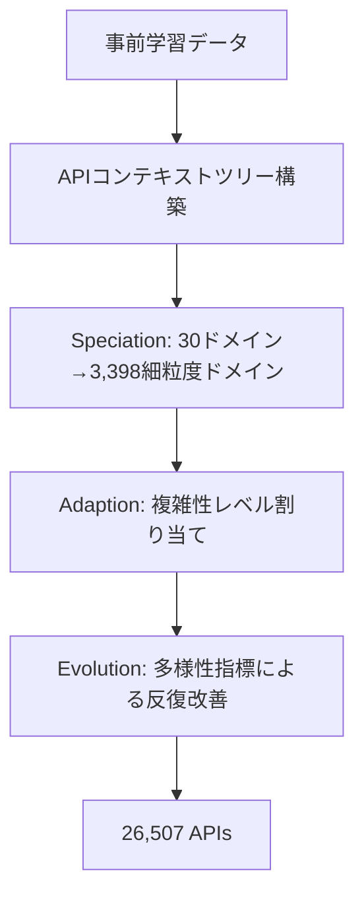

本記事は [arXiv:2409.00920 "ToolACE: Winning the Points of LLM Function Calling"](https://arxiv.org/abs/2409.00920) の解説記事です。

## 論文概要（Abstract）

LLMのfunction calling能力を向上させるための高品質学習データ自動生成パイプラインを提案した研究である。著者らはTool Self-evolution Synthesis（TSS）により26,507の多様なAPIを自動合成し、マルチエージェント対話生成（MAI）と二重層検証プロセス（DLV）を組み合わせることで、約180,000のダイアログインスタンスを生成した。このデータでファインチューニングしたToolACE-8Bモデルは、Berkeley Function-Calling Leaderboard（BFCL）でGPT-4（88.53%）やClaude 3.5 Sonnet（90.53%）を上回る91.41%の精度を達成したと報告されている。

この記事は [Zenn記事: AIエージェントツール設計の7原則：Anthropic・OpenAI公式ガイドに学ぶ実装パターン](https://zenn.dev/0h_n0/articles/c1f033224797db) の深掘りです。

## 情報源

- **arXiv ID**: 2409.00920
- **URL**: [https://arxiv.org/abs/2409.00920](https://arxiv.org/abs/2409.00920)
- **著者**: Weiwen Liu, Xu Huang, Xingshan Zeng et al.
- **発表年**: 2024（2025年改訂）
- **分野**: cs.LG, cs.AI, cs.CL

## 背景と動機（Background & Motivation）

LLMのfunction calling（ツール呼び出し）能力は、エージェントが外部ツールと連携するための基盤技術である。しかし、高品質なfunction calling学習データの構築には以下の課題が存在していた。

1. **多様性の不足**: 既存のデータセットはAPI数が限定的で、実世界の多様なツール構成を反映していない
2. **品質の担保困難**: 人手によるデータ作成はコストが高く、自動生成ではハルシネーションや不整合が混入しやすい
3. **複雑な呼び出しパターンの欠如**: 単一ツール呼び出しのデータは豊富だが、並列呼び出しや依存的呼び出しのデータが不足している

著者らはこれらの課題を解決するため、API合成・ダイアログ生成・品質検証を統合したエンドツーエンドの自動パイプラインを提案した。

## 主要な貢献（Key Contributions）

- **貢献1**: 30の主要ドメイン、390のサブドメイン、3,398の細粒度ドメインをカバーする26,507 APIの自動合成手法（TSS）
- **貢献2**: 3つのLLMエージェントによるマルチエージェント対話生成システム（MAI）と自己一貫性チェック機構
- **貢献3**: ルールベースと基盤モデルベースを組み合わせた二重層検証プロセス（DLV）
- **貢献4**: 8Bパラメータモデルでfunction calling精度でGPT-4を上回る性能の実証

## 技術的詳細（Technical Details）

### Tool Self-evolution Synthesis（TSS）

TSSは3段階の進化プロセスでAPIを合成する。



**Speciation（種分化）**: 事前学習データからAPIコンテキストツリーを抽出し、30の主要ドメインから390の粗粒度サブドメイン、さらに3,398の細粒度ドメインへ展開する。

**Adaption（適応）**: コンテキストツリーの網羅度に基づき各APIに複雑性レベルを割り当てる。単純なAPIから複雑なAPIまで段階的に分布させる。

**Evolution（進化）**: 多様性指標を用いてAPIを反復的に改善する。「新しい機能の追加」「パラメータの追加」「制約条件の追加」などの変異操作を適用する。

### Multi-Agent Interactive Dialog Generation（MAI）

3つのLLMエージェントが協調してダイアログを生成する。

| エージェント | 役割 | 主な処理 |
|---|---|---|
| **User Agent** | クエリ生成 | マルチモードプロンプティング、類似性ベースの複雑化 |
| **Assistant Agent** | アクション決定 | 形式化思考プロセス、自己一貫性チェック |
| **Tool Agent** | API実行シミュレーション | パラメータ検証、結果返却 |

Assistant Agentの形式化思考プロセスは以下のステップで構成される:

$$
\text{Action} = \arg\max_{a \in \mathcal{A}} P(a \mid q, \mathcal{T}, \text{history})
$$

ここで、$q$はユーザクエリ、$\mathcal{T}$は利用可能なツール集合、$\mathcal{A} = \{\text{tool\_call}, \text{clarify}, \text{respond}\}$はアクション空間である。

自己一貫性チェックでは、同じ入力に対して複数回生成を行い、少なくとも2回以上のアクション決定が一致した場合にのみ採用する。著者らはこのメカニズムにより出力の信頼性が向上したと報告している。

### Dual-Layer Validation Process（DLV）

**ルールベース層**: 4つの観点（APIの明確性、関数の実行可能性、ダイアログの正確性、データの一貫性）をRegexパターンとフォーマットマッチングで検証する。著者らによると通過率は67.9%であった。

**モデルベース層**: ハルシネーション検出、一貫性検証、ツール応答の妥当性を分解サブクエリで検証する。著者らによると通過率は91.1%であった。

二重層の組み合わせによる最終通過率は61.8%と報告されており、厳格な品質フィルタリングが適用されている。

## 実装のポイント（Implementation）

```python
from dataclasses import dataclass


@dataclass
class ToolACEConfig:
    """ToolACEファインチューニング設定"""

    base_model: str = "meta-llama/Meta-Llama-3.1-8B-Instruct"
    lora_rank: int = 16
    lora_alpha: int = 32
    learning_rate: float = 1e-4
    num_epochs: int = 3
    batch_size: int = 48
    scheduler: str = "cosine"
    max_seq_length: int = 4096
```

著者らの学習設定（論文Section 4.1より）:
- **ベースモデル**: LLaMA3.1-8B-Instruct
- **手法**: LoRA（rank=16, alpha=32）
- **学習率**: $10^{-4}$、コサインスケジューラ
- **エポック数**: 3
- **バッチサイズ**: 48
- **データ数**: 約180,000ダイアログ

アブレーション実験では、形式化思考プロセスの追加により最終通過率が約12ポイント向上したと報告されている（論文Table 5より）。

## Production Deployment Guide

### AWS実装パターン（コスト最適化重視）

ToolACEの学習パイプラインとFunction Calling推論サービスのAWS構成を示す。

**トラフィック量別の推奨構成**:

| 規模 | 月間リクエスト | 推奨構成 | 月額コスト | 主要サービス |
|------|--------------|---------|-----------|------------|
| **Small** | ~3,000 (100/日) | Serverless | $100-200 | Lambda + Bedrock + S3 |
| **Medium** | ~30,000 (1,000/日) | Hybrid | $500-1,200 | ECS Fargate + SageMaker Endpoint |
| **Large** | 300,000+ (10,000/日) | Container | $3,000-8,000 | EKS + GPU Spot + SageMaker |

**Small構成の詳細**（月額$100-200）:
- **Lambda**: API Gateway経由のリクエスト受付（$20/月）
- **Bedrock**: Claude 3.5 Haikuでfunction calling推論（$120/月）
- **S3**: APIスキーマ・ダイアログデータ保存（$5/月）

**コスト削減テクニック**:
- SageMaker Spot Trainingで学習コスト最大90%削減
- Bedrock Batch APIで非リアルタイム推論50%割引
- Prompt Cachingでシステムプロンプト（ツール定義）のトークン削減

**コスト試算の注意事項**: 上記は2026年4月時点のAWS ap-northeast-1リージョン料金に基づく概算値です。GPU学習コストはインスタンスタイプと学習時間により大きく変動します。最新料金は [AWS料金計算ツール](https://calculator.aws/) で確認してください。

### Terraformインフラコード

```hcl
resource "aws_iam_role" "sagemaker_training" {
  name = "toolace-sagemaker-role"

  assume_role_policy = jsonencode({
    Version = "2012-10-17"
    Statement = [{
      Action = "sts:AssumeRole"
      Effect = "Allow"
      Principal = { Service = "sagemaker.amazonaws.com" }
    }]
  })
}

resource "aws_iam_role_policy_attachment" "sagemaker_full" {
  role       = aws_iam_role.sagemaker_training.name
  policy_arn = "arn:aws:iam::aws:policy/AmazonSageMakerFullAccess"
}

resource "aws_s3_bucket" "training_data" {
  bucket = "toolace-training-data"

  tags = {
    Project     = "toolace"
    Environment = "prod"
  }
}

resource "aws_s3_bucket_server_side_encryption_configuration" "training_data" {
  bucket = aws_s3_bucket.training_data.id

  rule {
    apply_server_side_encryption_by_default {
      sse_algorithm = "aws:kms"
    }
  }
}
```

### コスト最適化チェックリスト

- [ ] SageMaker Spot Training活用（学習コスト最大90%削減）
- [ ] Bedrock Batch API使用（非リアルタイム推論50%割引）
- [ ] Prompt Caching有効化（ツール定義のトークン30-90%削減）
- [ ] S3ライフサイクルポリシーで中間データ30日で自動削除
- [ ] AWS Budgets月額予算設定
- [ ] CloudWatchアラーム: GPU使用率・トークン使用量監視
- [ ] 開発環境のSageMakerエンドポイント夜間停止

## 実験結果（Results）

Berkeley Function-Calling Leaderboard（BFCL）での評価結果（論文Table 2より）:

| モデル | BFCL-v1 精度 | BFCL-v2 精度 | パラメータ数 |
|---|---|---|---|
| **ToolACE-8B** | **91.41%** | **85.77%** | 8B |
| Claude 3.5 Sonnet | 90.53% | — | 非公開 |
| GPT-4-1106-Preview | 88.53% | 85.65% | 非公開 |
| Functionary-Medium-v3.1 | — | 81.73% | 非公開 |

著者らによると、ToolACE-8Bは特にrelevance detection（無関係なツール呼び出しの拒否）で89.17%の精度を達成し、全モデル中最高であった。8Bパラメータという比較的小規模なモデルで商用モデルを上回る性能を示した点は注目に値する。

## 実運用への応用（Practical Applications）

1. **カスタムFunction Callingモデルの構築**: TSSパイプラインを用いて自社API群に特化したfunction calling学習データを自動生成できる。26,507 APIのスケールは実運用レベルの多様性を担保する
2. **品質保証パイプライン**: DLVの二重層検証はfunction calling出力の品質保証に応用可能。ルールベース層で形式的整合性を、モデルベース層でセマンティック整合性を検証する
3. **Zenn記事との関連**: Zenn記事で解説されている「スキーマ制約（原則4）」と「セマンティック明確性（原則3）」の効果を、学習データの品質という観点から実証している。高品質なツール定義が高品質な学習データを生み、高品質なfunction calling能力につながるというサイクルが示されている

## 関連研究（Related Work）

- **Gorilla（Patil et al., 2023）**: 大規模APIとLLMの接続。検索拡張によるAPI呼び出し精度向上を図ったが、学習データの自動合成は行っていない
- **APIGen（Liu et al., 2024）**: function callingデータセット自動生成パイプライン。ToolACEはAPIの合成段階から自動化している点で差別化される
- **xLAM（Zhang et al., 2024）**: アクションモデルのfunction calling特化シリーズ。ToolACEとは補完的な関係にある

## まとめと今後の展望

ToolACEは、API合成から対話生成、品質検証までを統合した初のエンドツーエンド自動パイプラインである。8Bパラメータモデルで商用最大モデルを上回る性能を達成した点は、高品質データの重要性を示している。著者らはモデルとデータを公開しており、カスタムfunction callingモデルの構築基盤として活用が期待される。

## 参考文献

- **arXiv**: [https://arxiv.org/abs/2409.00920](https://arxiv.org/abs/2409.00920)
- **Related Zenn article**: [https://zenn.dev/0h_n0/articles/c1f033224797db](https://zenn.dev/0h_n0/articles/c1f033224797db)
