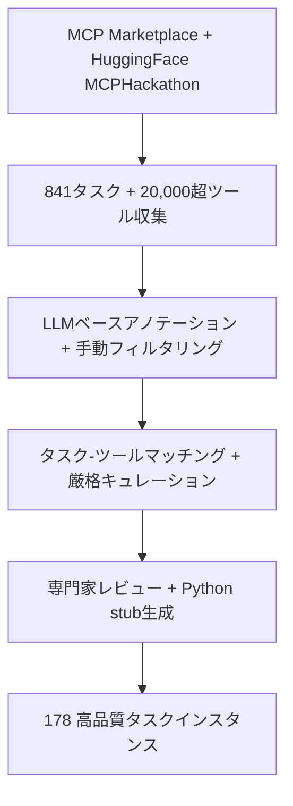

本記事は [arXiv:2512.24565 "MCPAgentBench: A Real-world Task Benchmark for Evaluating LLM Agent MCP Tool Use"](https://arxiv.org/abs/2512.24565) の解説記事です。

## 論文概要（Abstract）

Model Context Protocol（MCP）を通じたLLMエージェントのツール使用能力を評価するベンチマークを提案した研究である。著者らは841の実タスクと20,000超のMCPツールから178の高品質タスクインスタンスを構築し、ディストラクタツールを含む動的サンドボックス環境で11のLLMを評価した。その結果、Claude Sonnet 4.5がTask Finish Score（TFS）71.6で最高成績を収めたが、マルチツールタスクでは平均TFSが49.9%に低下し、現行モデルのMCPツール使用能力に大きな改善余地があることを示している。

この記事は [Zenn記事: AIエージェントツール設計の7原則：Anthropic・OpenAI公式ガイドに学ぶ実装パターン](https://zenn.dev/0h_n0/articles/c1f033224797db) の深掘りです。

## 情報源

- **arXiv ID**: 2512.24565
- **URL**: [https://arxiv.org/abs/2512.24565](https://arxiv.org/abs/2512.24565)
- **著者**: Wenrui Liu, Zixiang Liu, Elsie Dai, Wenhan Yu, Lei Yu, Tong Yang, Jinjun Han, Hong Gao
- **発表年**: 2025（2026年改訂）
- **分野**: cs.AI

## 背景と動機（Background & Motivation）

MCPの普及に伴い、LLMエージェントが多数のMCPツールから適切なものを選択し、正しいパラメータで呼び出す能力の評価が不可欠になっている。しかし既存のベンチマーク（ToolBench、BFCL等）はMCP固有の課題を十分にカバーしていなかった。

具体的には以下の課題が未評価であった:
1. **ディストラクタツール**: 機能的に無関係だが紛らわしいツールが候補リストに混在する状況での選択精度
2. **マルチステップ操作**: 直列・並列のツール呼び出しチェーンの正確な実行
3. **実行効率**: タスク完了だけでなく、呼び出し順序（直列/並列）の適切性

著者らはこれらの課題を網羅的に評価するベンチマークの構築を目指した。

## 主要な貢献（Key Contributions）

- **貢献1**: 841の実タスクと20,000超のMCPツールから構築した178タスクインスタンスのベンチマーク
- **貢献2**: ディストラクタツールを含む動的サンドボックス評価環境の構築
- **貢献3**: タスク完了度（TFS）と実行効率（TEFS）を分離した評価フレームワーク
- **貢献4**: 11の主要LLMの包括的評価と、マルチツール操作における性能低下の定量的分析

## 技術的詳細（Technical Details）

### ベンチマーク構築パイプライン



### タスク分類体系

タスクは2つの軸で分類される。

**ドメイン軸**:
- **Daily（日常）**: エンタメ、オフィスワーク
- **Professional（専門）**: 学術研究、ソフトウェアエンジニアリング

**呼び出し複雑性軸**:

| 複雑性レベル | 説明 | タスク数/ドメイン |
|---|---|---|
| **Single-Tool** | 基礎的なツール選択 | 30 |
| **Dual-Tool Serial** | 順序依存の2段階推論 | 20 |
| **Dual-Tool Parallel** | 並行実行能力 | 20 |
| **Multi-Tool** | 直列・並列の複合 | 残余 |

### ディストラクタツール設計

各タスクにおいて、エージェントには$K$個のツール候補が提示される（$K = 20$または$30$）。このうち$n$個が正解ツール、$K - n$個がディストラクタである。ディストラクタは機能的に無関係または容易に混同されるツールで構成され、エージェントの識別能力を試す。

### 評価指標

**Task Finish Score（TFS）**: エージェント生成の呼び出しとゴールデンソリューションの加重平均一致度。

$$
\text{TFS} = \frac{1}{|\mathcal{T}|} \sum_{t \in \mathcal{T}} \frac{|\text{correct\_calls}(t)|}{|\text{golden\_calls}(t)|} \times 100
$$

**Task Efficiency Finish Score（TEFS）**: TFSに加え、正しい実行順序（直列/並列の区別）を要求するより厳格な指標。

$$
\text{TEFS} = \text{TFS} \times \mathbb{1}[\text{execution\_order\_correct}]
$$

TFSが「何を呼ぶか」を、TEFSが「どう呼ぶか」を評価する。TEFSはTFSに対して常に低下し、この差が実行効率の課題を定量化する。

## 実装のポイント（Implementation）

ベンチマークの実装にはAutogenフレームワークが採用されている。各タスクでMCPサーバをローカルにデプロイし、Python stubによるモックMCPツールを動的にロードする方式である。

```python
from dataclasses import dataclass


@dataclass
class MCPBenchmarkTask:
    """MCPAgentBenchタスク定義"""

    task_id: str
    domain: str  # "daily" | "professional"
    complexity: str  # "single" | "dual_serial" | "dual_parallel" | "multi"
    description: str
    golden_tool_calls: list[dict]
    candidate_tools: list[dict]  # K個（正解 + ディストラクタ）
    expected_order: str  # "serial" | "parallel" | "mixed"


def evaluate_task(
    agent_calls: list[dict],
    golden_calls: list[dict],
    expected_order: str,
) -> tuple[float, float]:
    """TFSとTEFSを計算する。

    Args:
        agent_calls: エージェントが生成したツール呼び出し
        golden_calls: 正解のツール呼び出し
        expected_order: 期待される実行順序

    Returns:
        (TFS, TEFS)のタプル
    """
    correct = sum(1 for c in agent_calls if c in golden_calls)
    tfs = correct / len(golden_calls) * 100

    order_correct = check_execution_order(agent_calls, expected_order)
    tefs = tfs if order_correct else 0.0

    return tfs, tefs
```

ディストラクタ数が増えるほど性能が低下する傾向が観察されており、MCPツール記述の品質（前述のMCP Tool Descriptions論文参照）がベンチマーク結果にも影響していると考えられる。

## 実験結果（Results）

### モデル別評価結果（論文Table 1より）

| モデル | TFS | TEFS | TFS-TEFS差 |
|---|---|---|---|
| **Claude Sonnet 4.5** | **71.6** | **57.7** | 13.9 |
| OpenAI o3 | 66.0 | — | — |
| GLM-4.6 | 65.1 | 54.4 | 10.7 |
| Qwen3-235B | — | 51.8 | — |
| Gemini 3 Pro Preview | 48.1 | 33.5 | 14.6 |

### 複雑性レベル別の分析

著者らの分析によると、Single-Toolタスクでは平均TFS 91.04%と高い精度を示すが、Multi-Toolタスクでは49.90%に低下する。この41ポイントの差は、ツール数の増加に伴う選択空間の拡大と推論チェーンの複雑化が主因であると報告されている。

### 実行効率の課題

「ほぼ全てのモデルでTEFSがTFSに対して10ポイント以上低下する」と著者らは報告している。特にOpenAIモデルはDual-Parallelタスクで TEFS 0を記録しており、本来並列実行すべき操作を直列化する傾向が顕著であった。これは「現行のMCPツール使用能力がタスク解決を優先し、実行効率を犠牲にしている」ことを意味する。

### モデルサイズと性能

TEFSは「モデルサイズの増加に伴い概ね上昇傾向を示す」と報告されており、ディストラクタ数の増加に伴い性能が低下する傾向も確認されている。

## 実運用への応用（Practical Applications）

1. **MCPツール品質の評価基盤**: MCPサーバ開発者は自身のツール群をMCPAgentBenchに追加し、エージェントの使用精度を定量的に測定できる
2. **ツール記述の最適化指標**: ディストラクタツールとの混同率を計測することで、ツール記述の改善効果を定量的に評価できる
3. **Zenn記事との関連**: Zenn記事で解説されている「エラー防止設計（Poka-yoke）」原則（原則5）の効果を、ディストラクタツール混在環境での選択精度として定量的に評価する基盤を提供する。ツール記述の明確化がディストラクタとの混同を減らし、TFSを向上させるという仮説を検証可能にする
4. **並列実行の重要性**: TEFSとTFSの乖離は、エージェントが「何を呼ぶか」だけでなく「どう呼ぶか」も重要であることを示している。Zenn記事で解説する「コンポーザビリティ」原則（原則6）の実践的検証に活用できる

## 関連研究（Related Work）

- **BFCL（Patil et al., 2024）**: Berkeley Function-Calling Leaderboard。Function calling精度の標準的ベンチマークだが、MCP固有の評価やディストラクタツール設計は含まれていない
- **ToolBench（Qin et al., 2024）**: 大規模API群でのツール使用評価。MCPAgentBenchはMCPプロトコル準拠とディストラクタ設計で差別化される
- **τ-bench（Yao et al., 2024）**: ツール-エージェント-ユーザの3者インタラクションベンチマーク。MCPAgentBenchはMCPプロトコルに特化した評価という点で補完的である

## まとめと今後の展望

MCPAgentBenchは、MCPツール使用能力を初めて包括的に評価するベンチマークである。11モデルの評価により、Single-Toolタスクでは高い精度を示す一方、マルチツール・並列実行タスクでは大幅な性能低下が生じることが明らかになった。特にTFSとTEFSの乖離は、タスク完了と実行効率の間に大きなギャップがあることを示しており、MCPエコシステムの成熟に向けた重要な課題を提起している。

## 参考文献

- **arXiv**: [https://arxiv.org/abs/2512.24565](https://arxiv.org/abs/2512.24565)
- **GitHub**: 著者らがコードとデータを公開
- **Related Zenn article**: [https://zenn.dev/0h_n0/articles/c1f033224797db](https://zenn.dev/0h_n0/articles/c1f033224797db)
