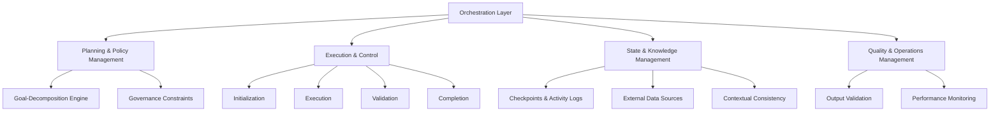
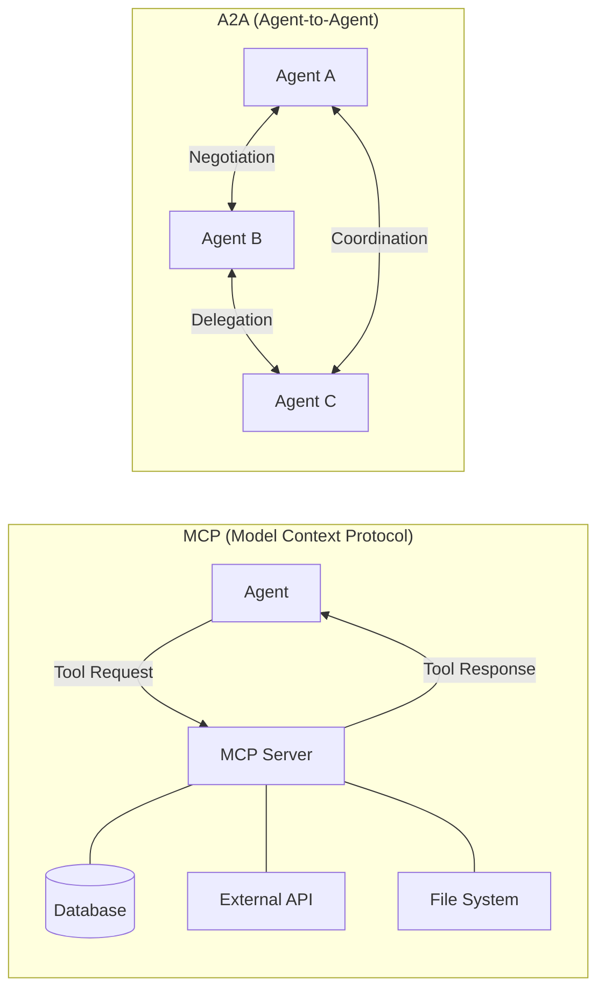

## 論文概要

本記事は [The Orchestration of Multi-Agent Systems: Architectures, Protocols, and Enterprise Adoption](https://arxiv.org/abs/2601.13671) の解説記事です。関連するZenn記事「[Semantic Kernel v1.41 Process FrameworkでAIワークフロー自動化を実装する](https://zenn.dev/0h_n0/articles/0092b35192e3cc)」も合わせて参照してください。

本論文はマルチエージェントシステム（MAS）のオーケストレーション層を体系的に整理したサーベイ論文であり、エージェント間の協調を支えるアーキテクチャ設計、通信プロトコル（MCP・A2A）、および企業での実導入事例を包括的に論じている。著者らは、単一エージェントの限界を超えるために複数エージェントの協調が不可欠であると述べ、その制御面（control plane）となるオーケストレーション層の5つのサブシステムを定義している。

## 情報源

| 項目 | 内容 |
|------|------|
| arXiv ID | [2601.13671](https://arxiv.org/abs/2601.13671) |
| URL | <https://arxiv.org/abs/2601.13671> |
| 著者 | Apoorva Adimulam, Rajesh Gupta, Sumit Kumar |
| 発表年 | 2026年1月 |
| カテゴリ | cs.MA（マルチエージェントシステム）, cs.AI（人工知能） |

## 背景と動機

LLMベースのエージェントが単独で処理できるタスクには限界がある。著者らは、マルチエージェントシステムへの移行を促す4つの技術的要因を挙げている。

1. **スケーラビリティの限界**: 単一エージェントでは複雑なワークフローの並列処理やリソース管理に限界がある
2. **専門化の必要性**: ドメイン固有の知識やツールを持つ専門エージェントへの分業が効率的である
3. **通信技術の進歩**: MCP（Model Context Protocol）やA2A（Agent-to-Agent）などの標準化されたプロトコルが成熟してきた
4. **経済的効率性**: エージェント間の協調により、全体の処理コストと所要時間を削減できる

論文では、これらの要因が重なることで単一エージェントから組織的なマルチエージェントシステムへの移行が加速していると述べられている。

## 主要な貢献

著者らの主要な貢献は以下の3点である。

- **オーケストレーション層の体系化**: MASの制御面を5つのサブシステム（計画・ポリシー・実行・状態/知識・品質管理）に分解し、それぞれの責務と相互作用を定義した
- **通信プロトコルの比較分析**: ツールアクセス用のMCPとエージェント間協調用のA2Aを比較し、それぞれの適用領域を明確化した
- **企業導入ケーススタディの集約**: 保険・住宅ローン・ソフトウェア開発・カスタマーサービスの4分野における定量的な導入効果を整理した

## 技術的詳細

### オーケストレーション層の5つのサブシステム

著者らは、MASの制御面となるオーケストレーション層を以下の5つのサブシステムに分解している。

**Planning & Policy Management**: 論文によると、このサブシステムは目標分解エンジンとガバナンス制約の2つの要素から構成される。目標分解エンジンは高レベルの目的をエージェントが実行可能なサブタスクに変換し、ガバナンス制約はポリシーに基づいてエージェントの行動範囲を制限する。

**Execution & Control**: 著者らは、タスクの実行ライフサイクルを初期化（Initialization）→ 実行（Execution）→ 検証（Validation）→ 完了（Completion）の4フェーズで管理すると述べている。各フェーズでの状態遷移を明示的に制御することで、障害発生時のリカバリも容易になる。

**State & Knowledge Management**: チェックポイントとアクティビティログによる状態管理、外部データソースへのアクセス、そしてコンテキストの一貫性維持を担う。論文では、エージェント間で知識を共有する際の整合性が長時間タスクにおいて特に重要であると指摘されている。

**Quality & Operations Management**: 出力の品質検証とパフォーマンスモニタリングを行い、SLAの遵守やシステム全体の健全性を維持する。

### 通信プロトコル: MCP と A2A

論文の重要な貢献の一つは、MCPとA2Aという2つのプロトコルの役割を明確に区別した点である。

**MCP（Model Context Protocol）**: 著者らによると、MCPはエージェントと外部ツール・データソース間の標準化インターフェースである。クライアント・サーバアーキテクチャを採用し、以下の3つの機能を提供する。

- **スキーマ一貫性**: ツールのインターフェース定義を標準化し、エージェントが一貫した方法で外部ツールにアクセスできる
- **アクセス制御**: エージェントごとのツールアクセス権限を管理し、セキュリティポリシーを適用する
- **セッション管理**: ステートレス/ステートフル両方のセッション方式をサポートし、タスクの特性に応じて使い分ける

**A2A（Agent-to-Agent）**: 論文では、A2Aはエージェント同士のピアレベル協調を実現するプロトコルと定義されている。MCPがツールアクセスを担うのに対し、A2Aはエージェント間の交渉（Negotiation）、委譲（Delegation）、協調（Coordination）を扱う。構造化されたメタデータと標準化されたペイロードにより、異なるフレームワークで構築されたエージェント同士でも相互運用が可能になると著者らは述べている。

つまり、**MCPはエージェント←→ツール間の垂直的な接続**、**A2Aはエージェント←→エージェント間の水平的な協調**を担い、両者は補完的な関係にある。

### 3つのエージェントタイプ

著者らはMAS内のエージェントを以下の3種類に分類している。

| タイプ | 役割 | 具体例 |
|--------|------|--------|
| **Worker Agent** | ドメイン固有のタスクを実行 | コード生成、文書解析、データ処理 |
| **Service Agent** | 品質保証・コンプライアンス・診断 | テスト実行、規制チェック、異常検知 |
| **Support Agent** | モニタリング・分析 | パフォーマンス監視、ログ分析、レポート生成 |

論文では、これらのエージェントタイプをオーケストレーション層が適切に組み合わせることで、複雑なワークフローを効率的に処理できると述べられている。

## 実験結果（ケーススタディ）

本論文はサーベイ論文であり、著者らは複数の企業導入事例を集約・分析している。以下は論文で報告されている定量的な結果である。

**保険業務**: 論文のケーススタディによると、マルチエージェントシステムを保険申請書の解析に適用した結果、95%以上の精度を達成したと報告されている。

**住宅ローン審査**: 著者らは、ローン承認プロセスにMASを導入した事例において、承認速度が従来比20倍に高速化し、コストが80%削減されたと報告している。

**ソフトウェアエンジニアリング**: 論文によると、レガシーシステムのモダナイゼーションにMASを活用した事例では、開発時間が50%削減されたとされている。

**カスタマーサービス**: 著者らは、一般的な問い合わせの80%が人手を介さずに自動解決され、対応時間は60〜90%短縮されたと報告している。

ただし、これらの数値はそれぞれ異なる企業・環境での事例であり、直接的な比較には注意が必要である。

## 課題と限界

著者らは、マルチエージェントシステムには以下の課題があると指摘している。

- **協調オーバーヘッド**: エージェント数の増加に伴い、通信・調停のコストが非線形に増大する
- **コスト管理**: 各エージェントが独自にLLMを呼び出すため、APIコストの総量が予測しにくい
- **ガバナンスの複雑性**: 複数エージェントの権限管理やポリシー適用が単一エージェントに比べて大幅に複雑化する
- **LLMリスクの増幅**: ハルシネーションやバイアスなど、LLM単体が持つリスクがマルチエージェント構成で増幅される可能性がある

## 実運用への応用

本論文で提示されたオーケストレーション層の設計は、実際のフレームワーク実装と多くの接点がある。例えば、関連Zenn記事で解説した[Semantic Kernel v1.41 Process Framework](https://zenn.dev/0h_n0/articles/0092b35192e3cc)は、ワークフロー定義・ステップ間の状態管理・イベント駆動型の実行制御を提供しており、本論文のオーケストレーション層における「Execution & Control」と「State & Knowledge Management」の概念に対応する部分が多い。

企業での導入パターンとして、著者らは段階的なアプローチを推奨している。まず単一エージェントで特定タスクを自動化し、次にMCPを通じてツールアクセスを標準化、最終的にA2Aによるエージェント間協調を導入するという流れである。このアプローチは、初期投資を抑えつつリスクを管理できる点で実用的であると論文では述べられている。

## 関連研究

著者らは、企業主導のマルチエージェント関連イニシアティブとして以下を紹介している。

- **PwC Agent OS**: エンタープライズ向けのエージェントオーケストレーション基盤
- **Accenture Trusted Agent Huddle**: 信頼性を重視したエージェント協調フレームワーク
- **主要OSS/商用フレームワーク**: LangChain、Microsoft AutoGen、IBM Watsonx Orchestrate

論文では、これらのフレームワークがそれぞれ異なるアプローチでオーケストレーション層の機能を実装しており、標準化が今後の課題であると述べられている。

## まとめと今後の展望

本論文は、MASのオーケストレーション層を5つのサブシステムに体系化し、MCP/A2Aプロトコルの棲み分けを明確にした点で有用なサーベイである。著者らは今後の方向性として、以下を挙げている。

- **ハイブリッド・連合型設計**: 中央集権型と分散型を組み合わせた柔軟なオーケストレーション
- **セマンティックオーケストレーション**: エージェントの能力を意味的に理解し、動的にタスクを割り当てる仕組み
- **標準化されたベンチマーク**: MASの性能を公平に比較するための評価基準の確立

マルチエージェントシステムの実用化が進む中で、オーケストレーション層の設計原則を理解することは、今後のシステム構築において重要な基盤となるだろう。

## 参考文献

1. Adimulam, A., Gupta, R., & Kumar, S. (2026). The Orchestration of Multi-Agent Systems: Architectures, Protocols, and Enterprise Adoption. arXiv:2601.13671. <https://arxiv.org/abs/2601.13671>
2. Semantic Kernel v1.41 Process FrameworkでAIワークフロー自動化を実装する. <https://zenn.dev/0h_n0/articles/0092b35192e3cc>
