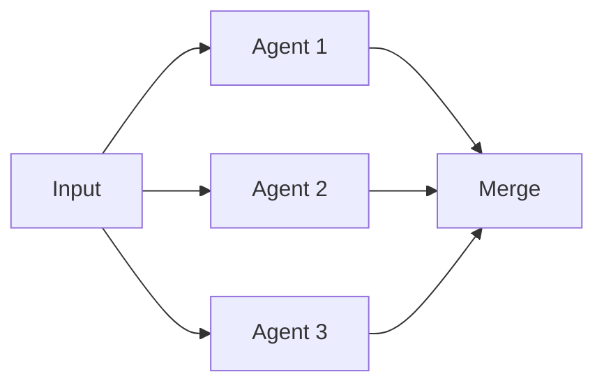
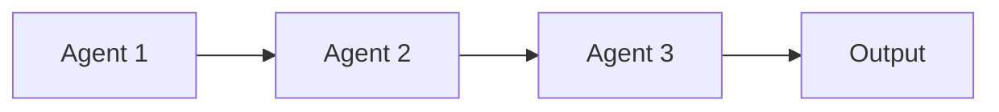
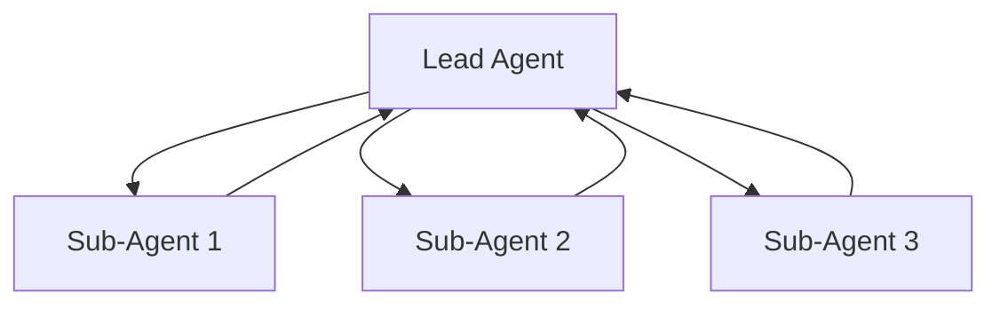
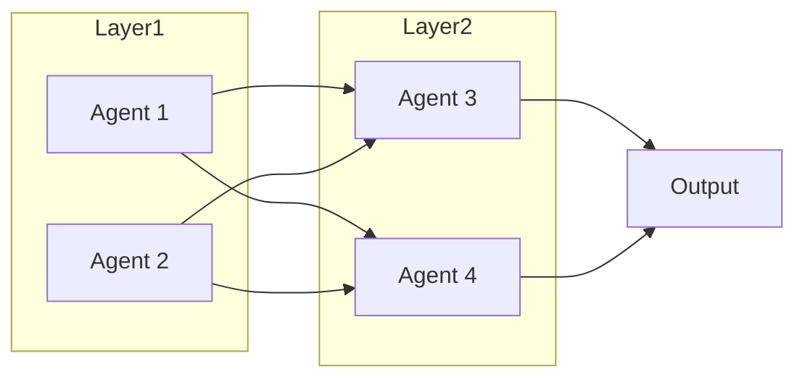

本記事は [AdaptOrch: Task-Adaptive Multi-Agent Orchestration in the Era of LLM Performance Convergence](https://arxiv.org/abs/2602.16873) の解説記事です。

この記事は [Zenn記事: Semantic Kernel v1.41 Process FrameworkでAIワークフロー自動化を実装する](https://zenn.dev/0h_n0/articles/0092b35192e3cc) の深掘りです。

## 論文概要（Abstract）

LLMの性能がベンチマーク上で2-5%の範囲に収束しつつある現在、モデル選択よりもオーケストレーションのトポロジー（エージェント間の接続構造）がシステム全体の性能を支配するという仮説を理論的・実験的に検証した研究である。著者はタスク依存DAGの3つの構造特性に基づくトポロジールーティングアルゴリズムと適応的統合プロトコルを提案し、SWE-benchで52.6%（単一最良モデル比+9.8pp）、GPQA Diamondで53.1%（+6.9pp）の改善を報告している。

## 情報源

- **arXiv ID**: 2602.16873
- **URL**: [https://arxiv.org/abs/2602.16873](https://arxiv.org/abs/2602.16873)
- **著者**: Geunbin Yu
- **発表年**: 2026
- **分野**: cs.MA, cs.AI

## 背景と動機（Background & Motivation）

2026年時点で、主要LLMの性能差はMMLUでε≈0.03、HumanEvalでε≈0.05程度まで収束している。著者はこの状況を「ε-Convergence」と定義し、モデル間の性能差が十分小さい場合にはモデル選択の効果が限定的になると述べている。従来のマルチエージェント研究はMixture of Agents（MoA）のようにモデルの多様性を活用するアプローチが主流であったが、性能収束時代においてはエージェント間の接続構造（トポロジー）の最適化がシステム性能により大きな影響を与えるという仮説が本研究の出発点である。

## 主要な貢献（Key Contributions）

- **貢献1: Performance Convergence Scaling Law**: タスク構造の分散がモデル選択の分散を支配する条件を理論的に定式化し、トポロジー選択がモデル選択より重要になる閾値を明示した
- **貢献2: Topology Routing Algorithm**: タスク依存DAGの構造特性（並列幅、クリティカルパス深度、結合密度）に基づき、$O(\|V\|+\|E\|)$の計算量で最適なトポロジーを選択するアルゴリズムを提案した
- **貢献3: Adaptive Synthesis Protocol**: トポロジー実行後の出力統合において、品質不十分な場合にトポロジーの再ルーティングを行う適応的プロトコルを設計し、最大5回の反復で終了を保証する収束証明を与えた

## 技術的詳細（Technical Details）

### ε-Convergenceの定義

著者は$n$個のモデル集合$\mathcal{M}$がベンチマーク$B$上でε-収束していることを以下のように定義している。

$$
\max_{m_i, m_j \in \mathcal{M}} |P_B(m_i) - P_B(m_j)| \leq \epsilon
$$

ここで$P_B(m)$はモデル$m$のベンチマーク$B$上の性能スコアである。2026年時点の主要モデル（GPT-4o-mini、Claude 3.5 Haiku、Gemini 2.0 Flash、Llama 3.3 70B、Qwen 2.5 72B）では、MMLUでε≈0.03、HumanEvalでε≈0.05であることが実測されている。

### タスク依存DAGの形式化

タスクを分解した際の依存関係を有向非巡回グラフ（DAG）$G_T = (V, E, w, c)$で表現する。

- $V$: サブタスクの集合
- $E \subseteq V \times V$: 依存関係の辺集合
- $w: V \to \mathbb{R}^+$: 各サブタスクの計算コスト
- $c: E \to [0, 1]$: 辺$(u,v)$の結合強度（0: 独立、1: 完全結合）

このDAGに対して3つの構造特性が定義される。

- **並列幅（Parallelism Width）** $\omega(G_T)$: DAGの最大反鎖（antichain）のサイズ。同時実行可能なサブタスクの最大数
- **クリティカルパス深度（Critical Path Depth）** $\delta(G_T)$: 最長パスの長さ。逐次実行が必要な最小ステップ数
- **結合密度（Coupling Density）** $\gamma(G_T)$: 辺の結合強度の平均値。サブタスク間の情報依存の強さ

$$
\gamma(G_T) = \frac{1}{|E|} \sum_{(u,v) \in E} c(u,v)
$$

### Performance Convergence Scaling Law（Proposition 1）

著者はトポロジー選択の分散$\text{Var}_\tau$とモデル選択の分散$\text{Var}_M$の比に関して以下の不等式を導出している。

$$
\frac{\text{Var}_\tau}{\text{Var}_M} \geq \frac{(\omega(G_T)-1)^2 \cdot (1-\gamma(G_T))^2}{4\epsilon^2 \cdot k}
$$

ここで$\omega(G_T)$は並列幅、$\gamma(G_T)$は結合密度、$\epsilon$は性能収束パラメータ、$k$はモデル数である。

コーディングタスクの典型値（$\omega \geq 3$, $\gamma \leq 0.4$, $k \leq 6$, $\epsilon \approx 0.05$）を代入すると、この比は20以上となり、トポロジー選択がモデル選択の20倍以上の影響力を持つことが理論的に示される。

### 4つの正準トポロジー

著者は以下の4つのトポロジーを正準形として定義している。

**τ_P（Parallel）**: 全サブタスクを並列実行し、各エージェントは独立したコンテキストで動作する。



**τ_S（Sequential）**: サブタスクをトポロジカル順に逐次実行し、前段の出力を次段のコンテキストに蓄積する。



**τ_H（Hierarchical）**: リードエージェントがサブエージェントに作業を委譲し、結果を統合する。



**τ_X（Hybrid）**: DAGのトポロジカルレイヤーに沿って、レイヤー内は並列、レイヤー間は逐次で実行する。



### Algorithm 1: Topology Routing

トポロジールーティングは$O(|V|+|E|)$の計算量で動作する決定木ベースのアルゴリズムである。著者は以下のルーティングロジックを提案している。

1. $\|E\| = 0$ の場合 → $\tau_P$（依存関係なしなら完全並列）
2. $\omega(G_T) = 1$ の場合 → $\tau_S$（並列幅1なら完全逐次）
3. $\gamma(G_T) > \theta_\gamma$ かつ $\|V\| > \theta_\delta$ の場合 → $\tau_H$（結合密度が高く規模が大きいなら階層型）
4. $r > \theta_\omega$ かつ $\gamma(G_T) \leq \theta_\gamma$ の場合 → $\tau_P$（並列比率が高く結合が弱いなら並列）
5. それ以外 → $\tau_X$（ハイブリッド）

ここで$r = \omega(G_T) / |V|$は並列比率、閾値は$\theta_\omega = 0.5$、$\theta_\gamma = 0.6$、$\theta_\delta = 5$である。

### Algorithm 2: Adaptive Synthesis Protocol

トポロジー実行後の出力統合において、品質が不十分な場合にトポロジーの再ルーティングを行う適応的プロトコルである。

1. 初期トポロジー$\tau_0$で実行し、出力$O$を得る
2. 品質関数$Q(O)$が閾値$\theta_Q$未満の場合、DAGの結合強度を更新してトポロジーを再選択
3. 最大5回の反復で終了（Proposition 2: 終了保証）

**Proposition 2（終了保証）**: 各反復で結合強度の更新が単調非減少であり、$\gamma(G_T)$が1に収束するため、最終的にτ_Sに到達し必ず終了する。著者はこの収束が最大5反復で達成されることを証明している。

### 5フェーズパイプライン

AdaptOrchの全体処理は以下の5フェーズで構成される。

1. **Task Decomposition**: LLMベースのタスク分解。入力タスクをサブタスクの集合$V$に分割
2. **DAG Construction**: サブタスク間の依存関係と結合強度を推定（0.0 / 0.3 / 0.7 / 1.0の4段階）
3. **Topology Routing**: Algorithm 1によりDAG特性から最適トポロジーを選択
4. **Topology-Specific Execution**: 選択されたトポロジーに従ってエージェントを実行
5. **Adaptive Synthesis**: Algorithm 2により出力統合と必要に応じた再ルーティング

## 実装のポイント（Implementation）

著者は実装上の重要な設計判断について以下を報告している。

**結合強度の推定**: 5段階スケール（0.0, 0.25, 0.5, 0.75, 1.0）でサブタスク間の結合を推定する。著者自身がこの粗い離散化を制限事項として認識しており、連続値推定やサブタスクペアごとの動的推定が今後の課題として挙げられている。

**閾値キャリブレーション**: $\theta_\omega = 0.5$、$\theta_\gamma = 0.6$、$\theta_\delta = 5$の閾値はSWE-bench検証セットでのグリッドサーチにより決定されている。著者はタスクドメインごとに最適閾値が異なる可能性を認めている。

**レート制限対策**: 並列トポロジー（τ_P）では複数エージェントが同時にAPI呼び出しを行うため、レート制限に抵触しやすい。著者は指数バックオフとジッタによるリトライ戦略を採用しつつ、これが実験結果に影響を与えた可能性があることを制限事項として記載している。

**非分解タスクへの対応**: 著者はAdaptOrchが本質的に分解不可能なタスク（単一の推論ステップで完結するもの）には効果が限定的であると述べている。この場合、DAG構築フェーズで$|V| = 1$となり、単一エージェント実行にフォールバックする。

## Production Deployment Guide

### AWS実装パターン（トポロジールーティング型マルチエージェントシステム）

AdaptOrchのトポロジールーティングをAWS上に実装する場合の推奨構成を示す。タスク分解とDAG構築はステートフル、エージェント実行はステートレスという特性を活かした設計が重要である。

**トラフィック量別の推奨構成**:

| 規模 | 月間リクエスト | 推奨構成 | 月額コスト | 主要サービス |
|------|--------------|---------|-----------|------------|
| **Small** | ~3,000 (100/日) | Serverless | $80-200 | Lambda + Step Functions + Bedrock |
| **Medium** | ~30,000 (1,000/日) | Hybrid | $500-1,200 | Step Functions + ECS Fargate + ElastiCache |
| **Large** | 300,000+ (10,000/日) | Container | $3,000-8,000 | EKS + Karpenter + EC2 Spot |

### Small構成（Serverless）: Lambda + Step Functions + Bedrock

AdaptOrchの5フェーズパイプラインはAWS Step Functionsのステートマシンとして自然にマッピングされる。特にトポロジールーティング後の並列/逐次実行はStep FunctionsのParallel/Map状態で表現できる。

- **Lambda**: 各フェーズを個別関数として実装。1GB RAM、120秒タイムアウト
- **Step Functions**: Express Workflows（5分以内完了前提）。τ_P→Parallel状態、τ_S→逐次状態として動的に構成
- **Bedrock**: Claude 3.5 Haiku（DAG構築・ルーティング判定用）+ Prompt Caching有効
- **DynamoDB**: DAGキャッシュとトポロジー選択履歴の保存
- **月額コスト内訳**: Lambda $15 + Step Functions $25 + Bedrock $120 + DynamoDB $10 + S3 $5

```hcl
module "vpc" {
  source  = "terraform-aws-modules/vpc/aws"
  version = "~> 5.0"

  name = "adaptorch-vpc"
  cidr = "10.0.0.0/16"
  azs  = ["ap-northeast-1a", "ap-northeast-1c"]
  private_subnets = ["10.0.1.0/24", "10.0.2.0/24"]

  enable_nat_gateway   = false
  enable_dns_hostnames = true
}

resource "aws_iam_role" "lambda_orchestrator" {
  name = "adaptorch-lambda-role"

  assume_role_policy = jsonencode({
    Version = "2012-10-17"
    Statement = [{
      Action = "sts:AssumeRole"
      Effect = "Allow"
      Principal = { Service = "lambda.amazonaws.com" }
    }]
  })
}

resource "aws_iam_role_policy" "bedrock_invoke" {
  role = aws_iam_role.lambda_orchestrator.id
  policy = jsonencode({
    Version = "2012-10-17"
    Statement = [{
      Effect   = "Allow"
      Action   = ["bedrock:InvokeModel", "bedrock:InvokeModelWithResponseStream"]
      Resource = "arn:aws:bedrock:ap-northeast-1::foundation-model/anthropic.claude-3-5-haiku*"
    }]
  })
}

resource "aws_lambda_function" "task_decomposer" {
  function_name = "adaptorch-task-decomposer"
  runtime       = "python3.12"
  handler       = "decomposer.handler"
  memory_size   = 1024
  timeout       = 120
  role          = aws_iam_role.lambda_orchestrator.arn

  environment {
    variables = {
      BEDROCK_MODEL_ID = "anthropic.claude-3-5-haiku-20241022-v1:0"
      DYNAMO_TABLE     = aws_dynamodb_table.dag_cache.name
    }
  }
}

resource "aws_lambda_function" "topology_router" {
  function_name = "adaptorch-topology-router"
  runtime       = "python3.12"
  handler       = "router.handler"
  memory_size   = 256
  timeout       = 30
  role          = aws_iam_role.lambda_orchestrator.arn
}

resource "aws_lambda_function" "agent_executor" {
  function_name = "adaptorch-agent-executor"
  runtime       = "python3.12"
  handler       = "executor.handler"
  memory_size   = 1024
  timeout       = 120
  role          = aws_iam_role.lambda_orchestrator.arn

  environment {
    variables = {
      BEDROCK_MODEL_ID = "anthropic.claude-3-5-haiku-20241022-v1:0"
    }
  }
}

resource "aws_dynamodb_table" "dag_cache" {
  name         = "adaptorch-dag-cache"
  billing_mode = "PAY_PER_REQUEST"
  hash_key     = "task_hash"

  attribute {
    name = "task_hash"
    type = "S"
  }

  ttl {
    attribute_name = "expires_at"
    enabled        = true
  }
}
```

### Large構成: EKS + Karpenter

大規模環境ではτ_Pトポロジーで数十のエージェントが同時実行される。Karpenterによるノード自動スケーリングが不可欠である。

```hcl
module "eks" {
  source  = "terraform-aws-modules/eks/aws"
  version = "~> 20.0"

  cluster_name    = "adaptorch-cluster"
  cluster_version = "1.31"
  vpc_id          = module.vpc.vpc_id
  subnet_ids      = module.vpc.private_subnets

  cluster_addons = {
    karpenter = { most_recent = true }
  }
}

resource "kubectl_manifest" "karpenter_nodepool" {
  yaml_body = yamlencode({
    apiVersion = "karpenter.sh/v1"
    kind       = "NodePool"
    metadata   = { name = "agent-pool" }
    spec = {
      template = {
        spec = {
          requirements = [
            { key = "karpenter.sh/capacity-type", operator = "In", values = ["spot", "on-demand"] },
            { key = "node.kubernetes.io/instance-type", operator = "In", values = ["m7i.xlarge", "m7i.2xlarge", "c7i.xlarge"] }
          ]
        }
      }
      limits   = { cpu = "128", memory = "256Gi" }
      disruption = { consolidationPolicy = "WhenEmptyOrUnderutilized" }
    }
  })
}
```

### モニタリングとコスト最適化

**メトリクス収集**:
- トポロジー選択分布（τ_P / τ_S / τ_H / τ_X の比率）→ CloudWatch Custom Metrics
- 適応的再ルーティング発生率 → 高頻度ならDAG構築の品質改善が必要
- フェーズ別レイテンシ → Step Functions実行履歴 + X-Ray トレース
- トークン消費量 → Bedrock CloudWatch Metrics（InputTokenCount / OutputTokenCount）

**コスト最適化チェックリスト**:
- Bedrock Prompt Cachingでシステムプロンプトのトークンコストを30-90%削減
- τ_Sトポロジーではレスポンスストリーミングを活用して体感レイテンシを短縮
- DynamoDB TTLで古いDAGキャッシュを自動削除（推奨: 24時間）
- Karpenter Spot優先設定でτ_P実行時のノードコストを最大70%削減
- Bedrock Batch APIで非リアルタイム処理を50%割引実行

**コスト試算の注意事項**: 上記は2026年4月時点のAWS ap-northeast-1（東京）リージョン料金に基づく概算値です。実際のコストはトラフィックパターンにより変動します。最新料金は [AWS料金計算ツール](https://calculator.aws/) で確認してください。

## 実験結果（Experimental Results）

著者は5つのモデル（GPT-4o-mini、Claude 3.5 Haiku、Gemini 2.0 Flash、Llama 3.3 70B、Qwen 2.5 72B）を用いて3つのベンチマークで評価を行っている。

**SWE-bench**（論文Table 1より）: AdaptOrchは52.6%の正答率を達成し、単一最良モデルの42.8%に対して+9.8ppの改善を示した。トークン消費は41.8Kで、MoA-3Lの84.6Kと比較して約50%削減されている。トポロジー分布は62%がτ_X（ハイブリッド）であった。

**GPQA Diamond**（論文Table 1より）: 53.1%の正答率で単一最良モデルの46.2%に対して+6.9ppの改善を報告している。注目すべきは、Static-Parallel（固定並列トポロジー）が44.1%に退行し、単一モデル以下の性能となった点である。トポロジー分布は41%がτ_S（逐次型）であった。

**HotpotQA**（論文Table 1より）: 76.4% F1を達成し、単一最良モデルの68.3% F1に対して+8.1ppの改善を示した。トークン消費は22.7Kと3ベンチマーク中最小であった。トポロジー分布は71%がτ_X（ハイブリッド）であった。

**アブレーション実験**（論文Table 2より）: SWE-benchにおいて、Full AdaptOrchの52.6%に対し、Adaptive Synthesis除去で47.1%（-5.5pp）、Adaptive Routing除去で49.8%（-2.8pp）、Task Decomposition除去で42.8%（-9.8pp、単一モデル相当）となった。著者はTask Decompositionが最も重要なコンポーネントであると結論づけている。

## 実運用への応用（Practical Applications）

本研究の知見は実際のマルチエージェントシステム設計に以下の示唆を与える。

1. **Semantic Kernel Process Frameworkとの対応**: Zenn記事で解説されているSK Process Frameworkのステップ連結パターンはτ_S、Fan-out/Fan-inパターンはτ_X、Mapステップはτ_Pに対応する。AdaptOrchのルーティングロジックをSK Processのプロセス選択に組み込むことで、ワークフロー構造を動的に最適化できる
2. **ルーティング判断の実用指針**: $\gamma(G_T) > 0.6$（結合密度が高い）場合は階層型を選択すべきであり、無理に並列化するとGPQA Diamondの事例のように性能退行が発生する
3. **コスト効率**: トークン消費が同等以上の精度でMoAの50%以下に抑えられるため、API呼び出しコストの最適化に直結する
4. **段階的導入**: まずTask Decomposition（最も効果が大きい、-9.8ppの影響）を導入し、次にTopology Routing、最後にAdaptive Synthesisの順で段階的に適用することが推奨される

## 関連研究（Related Work）

- **Mixture of Agents (MoA)（Wang et al., 2024）**: 複数モデルの出力を集約するアプローチ。AdaptOrchはトークン効率の面で優位（41.8K vs 84.6K）
- **Self-MoA（Li et al., 2025）**: 単一モデルの複数インスタンスによる自己集約。性能収束時代にはモデル多様性の欠如が課題
- **LLM-Blender（Jiang et al., 2023）**: ペアワイズランキングによる出力選択。静的な集約戦略であり、タスク構造に適応しない点がAdaptOrchとの差異である

## 制限事項

著者は以下の制限事項を明示している。

- 本質的に分解不可能なタスクにはAdaptOrchの効果が限定的である
- 結合強度の推定が5段階の粗い離散スケールに依存しており、微妙な依存関係を捉えきれない可能性がある
- 並列トポロジー実行時のAPIレート制限が実験結果に影響を与えた可能性がある

## まとめと今後の展望

本論文は、LLM性能の収束という現実的な前提に基づき、マルチエージェントシステムの設計においてオーケストレーショントポロジーの重要性がモデル選択を上回ることを理論・実験の両面から示した。Performance Convergence Scaling Lawは、モデル差が小さい場合にトポロジー選択の分散がモデル選択の分散の20倍以上になることを証明しており、マルチエージェント設計の指針として有用である。今後は結合強度の連続値推定やドメイン固有の閾値自動キャリブレーションが課題として挙げられる。

## 参考文献

- **arXiv**: [https://arxiv.org/abs/2602.16873](https://arxiv.org/abs/2602.16873)
- **Related Zenn article**: [https://zenn.dev/0h_n0/articles/0092b35192e3cc](https://zenn.dev/0h_n0/articles/0092b35192e3cc)
