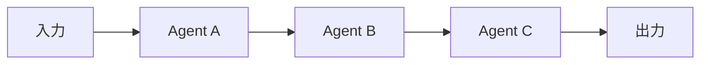
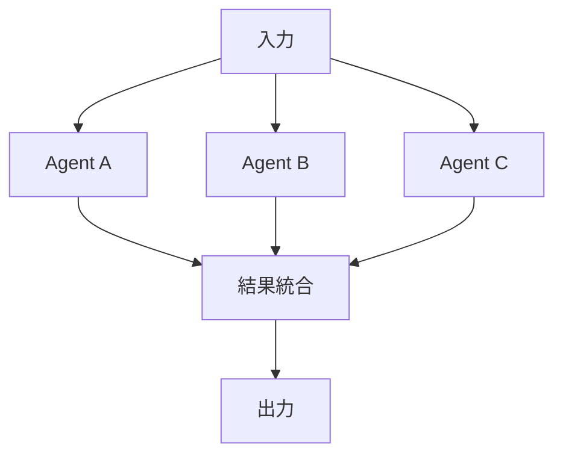

本記事は [Microsoft Agent Framework Version 1.0](https://devblogs.microsoft.com/agent-framework/microsoft-agent-framework-version-1-0/) の解説記事です。

## ブログ概要（Summary）

MicrosoftのShawn Henry氏（Principal Group Product Manager）が2026年4月3日に公開した本ブログは、Agent Framework 1.0のGA（General Availability）リリースを告知するものである。Agent Frameworkは、これまで別々に開発されていたSemantic KernelとAutoGenを統合した、エンタープライズ向けマルチエージェントオーケストレーション基盤である。.NETおよびPythonで利用可能で、MITライセンスで公開されている。

この記事は [Zenn記事: Semantic Kernel v1.41 Process FrameworkでAIワークフロー自動化を実装する](https://zenn.dev/0h_n0/articles/0092b35192e3cc) の深掘りです。

## 情報源

- **種別**: 企業テックブログ（Microsoft DevBlog）
- **URL**: [https://devblogs.microsoft.com/agent-framework/microsoft-agent-framework-version-1-0/](https://devblogs.microsoft.com/agent-framework/microsoft-agent-framework-version-1-0/)
- **著者**: Shawn Henry, Principal Group Product Manager（Microsoft）
- **発表日**: 2026年4月3日

## 技術的背景（Technical Background）

Microsoftはこれまで、LLMアプリケーション開発のためのフレームワークとして、Semantic Kernel（SKと略す）とAutoGenを別々のプロジェクトとして提供してきた。SKはエンタープライズ向けのシングルエージェント・ワークフロー基盤として、AutoGenは研究主導のマルチエージェント協調フレームワークとして、それぞれ独自の進化を遂げてきた。

Henry氏によると、この分断はエコシステムに以下の課題をもたらしていた。

1. **学習コストの二重化**: SKとAutoGenで異なるAPIやパターンを学ぶ必要があった
2. **相互運用性の欠如**: SKで構築したエージェントとAutoGenのマルチエージェントシステムを直接連携させることが困難だった
3. **プロバイダ依存**: Azure OpenAIに偏重した統合が多く、マルチプロバイダ対応が後手に回っていた

Agent Framework 1.0はこれらの課題に対し、統一されたエージェント抽象化とマルチプロバイダサポートで応えるものである。

## 実装アーキテクチャ（Implementation Architecture）

### 統一エージェント抽象化

Agent Framework 1.0のコアは、SKとAutoGenの設計思想を統合した単一のエージェントモデルである。ブログでは以下の設計要素が示されている。

```mermaid
graph TD
    subgraph "Agent Framework 1.0"
        A[統一Agent抽象化]
        A --> B[Middleware Pipeline]
        A --> C[Memory Architecture]
        A --> D[Multi-Agent Orchestration]

        B --> B1[Content Safety]
        B --> B2[Logging]
        B --> B3[Compliance]

        C --> C1[Foundry Agent Service]
        C --> C2[Mem0]
        C --> C3[Redis]
        C --> C4[Neo4j]
        C --> C5[Custom Stores]

        D --> D1[Sequential]
        D --> D2[Concurrent]
        D --> D3[Handoff]
        D --> D4[Group Chat]
        D --> D5[Magentic-One]
    end

    subgraph "Model Providers"
        E1[Azure Foundry]
        E2[Azure OpenAI]
        E3[OpenAI]
        E4[Anthropic Claude]
        E5[Amazon Bedrock]
        E6[Google Gemini]
        E7[Ollama]
    end

    A --> E1
    A --> E2
    A --> E3
    A --> E4
    A --> E5
    A --> E6
    A --> E7

    subgraph "Interoperability"
        F1[A2A Protocol]
        F2[MCP Protocol]
    end

    A --> F1
    A --> F2
```



### Middleware Pipeline

ブログでは、エージェントの振る舞いを横断的にインターセプト・変換・拡張するMiddleware Pipelineが紹介されている。ASP.NETのミドルウェアパイプラインに着想を得たこの設計により、Content Safety（有害コンテンツのフィルタリング）、Logging（構造化ログ出力）、Compliance（規制遵守チェック）といった関心事を、エージェントのビジネスロジックから分離できる。

これはZenn記事で解説されているSemantic KernelのProcess Frameworkにおける「Step」の概念を、より汎用的なミドルウェアパターンに昇華させたものと解釈できる。

### Memory Architecture

Henry氏によると、Memory Architectureはプラガブル設計を採用しており、以下のバックエンドが標準でサポートされている。

- **Foundry Agent Service**: Microsoftのマネージドサービス
- **Mem0**: オープンソースのメモリレイヤー
- **Redis**: 低レイテンシのキャッシュストア
- **Neo4j**: グラフベースの知識表現
- **カスタムストア**: 独自実装のインターフェース

### Pythonでの基本的なエージェント定義

ブログで示されているPythonの例を以下に示す。

```python
from agent_framework import Agent
from agent_framework.foundry import FoundryChatClient

# FoundryChatClientを介してモデルプロバイダに接続
agent = Agent(
    client=FoundryChatClient(
        endpoint="https://<your-endpoint>.azure.com",
        model="gpt-4o",
    ),
    name="HelloAgent",
    instructions="You are a helpful assistant.",
)
```

この例はSKの`ChatCompletionAgent`やAutoGenの`AssistantAgent`に相当する統一的なインターフェースである。`FoundryChatClient`を他のプロバイダクライアント（`OpenAIChatClient`、`BedrockChatClient`等）に差し替えることで、同一のエージェントコードをマルチプロバイダで動作させることができる。

## 5つのマルチエージェント・オーケストレーションパターン

Agent Framework 1.0の最も特徴的な機能は、5つのオーケストレーションパターンを標準サポートしていることである。ブログでは、全パターンがストリーミング、チェックポイント、Human-in-the-Loop、一時停止/再開に対応していると説明されている。

### 1. Sequential（逐次パイプライン）

エージェントを線形に連結し、前のエージェントの出力を次のエージェントの入力とするパターンである。



**適用場面**: ドキュメント処理パイプライン（翻訳→要約→品質チェック）、データ変換チェーン。SKのProcess Frameworkにおける線形Stepチェーンを、マルチエージェントに拡張したものである。

### 2. Concurrent（並列実行・収束）

独立した複数のエージェントを並列実行し、結果を統合するパターンである。



**適用場面**: 多角的な分析（セキュリティ分析・パフォーマンス分析・コスト分析を同時実行）、複数データソースからの情報収集。レイテンシの短縮に効果的だが、全エージェントの完了を待つため最遅エージェントがボトルネックになる点に注意が必要である。

### 3. Handoff（委任・制御付き遷移）

あるエージェントが自身の専門外のタスクを別のエージェントに委任するパターンである。制御フローが明示的に遷移する点が特徴である。

**適用場面**: カスタマーサポート（一般対応→技術対応→エスカレーション）、段階的な専門性が求められるタスク。

### 4. Group Chat（マルチエージェント議論）

複数のエージェントが共有コンテキスト上で議論するパターンである。各エージェントが異なる専門性や役割を持ち、合意形成や多角的な検討を行う。

**適用場面**: 設計レビュー（アーキテクト・セキュリティ・QAエージェントの議論）、ブレインストーミング。AutoGenの研究成果が直接反映されたパターンである。

### 5. Magentic-One（リサーチ協調）

Microsoft Research発のMagentic-Oneアーキテクチャに基づく、高度なリサーチ協調パターンである。Orchestratorエージェントが動的にタスクを分解し、専門エージェント群（WebSurfer、Coder、FileSurfer等）に指示を出す。

**適用場面**: 複雑なリサーチタスク、マルチステップの情報収集と分析。Henry氏によると、これはAutoGenの研究から生まれたパターンであり、Agent Frameworkへの統合により実運用に適した形で利用可能になったとされている。

### パターン比較

| パターン | エージェント間通信 | スケーラビリティ | 制御の粒度 | 主な由来 |
|---------|------------------|----------------|-----------|---------|
| Sequential | 1対1（直線） | 低（直列ボトルネック） | 高（順序が明確） | SK Process Framework |
| Concurrent | 1対多→集約 | 高（並列化容易） | 中（収束ロジック必要） | SK並列Step |
| Handoff | 1対1（委任） | 中 | 高（遷移条件が明確） | SK/AutoGen共通 |
| Group Chat | 多対多 | 低（通信量増大） | 低（創発的） | AutoGen |
| Magentic-One | 階層的 | 高（タスク分解） | 中（Orchestrator依存） | MSR AutoGen |

## Production Deployment Guide

### AWS実装パターン（マルチエージェントシステム）

Agent Frameworkのマルチエージェントシステムをクラウド上にデプロイする場合、トラフィック規模に応じた構成の選択が重要となる。以下にAWS上での推奨構成を示す。

**トラフィック量別の推奨構成**:

| 規模 | 月間リクエスト | 推奨構成 | 月額コスト目安 | 主要サービス |
|------|--------------|---------|--------------|------------|
| **Small** | ~3,000 (100/日) | Serverless | $50-200 | Lambda + Bedrock + DynamoDB |
| **Medium** | ~30,000 (1,000/日) | Hybrid | $400-1,000 | Lambda + ECS Fargate + ElastiCache |
| **Large** | 300,000+ (10,000/日) | Container | $2,500-6,000 | EKS + Karpenter + EC2 Spot |

**コスト試算の注意事項**: 上記は2026年4月時点のAWS ap-northeast-1（東京）リージョン料金に基づく概算値である。実際のコストはトラフィックパターン、モデル選択、バースト使用量により大幅に変動する。最新料金は [AWS料金計算ツール](https://calculator.aws/) で確認されたい。

### Small構成: Serverless（Lambda + Bedrock）

SequentialパターンやシンプルなHandoffパターンに適した構成である。

```hcl
# --- VPC ---
module "vpc" {
  source  = "terraform-aws-modules/vpc/aws"
  version = "~> 5.0"

  name = "agent-framework-vpc"
  cidr = "10.0.0.0/16"
  azs  = ["ap-northeast-1a", "ap-northeast-1c"]
  private_subnets = ["10.0.1.0/24", "10.0.2.0/24"]

  enable_nat_gateway   = false
  enable_dns_hostnames = true
}

# --- IAM Role ---
resource "aws_iam_role" "agent_lambda" {
  name = "agent-framework-lambda-role"

  assume_role_policy = jsonencode({
    Version = "2012-10-17"
    Statement = [{
      Action    = "sts:AssumeRole"
      Effect    = "Allow"
      Principal = { Service = "lambda.amazonaws.com" }
    }]
  })
}

resource "aws_iam_role_policy" "bedrock_invoke" {
  role = aws_iam_role.agent_lambda.id
  policy = jsonencode({
    Version = "2012-10-17"
    Statement = [{
      Effect   = "Allow"
      Action   = [
        "bedrock:InvokeModel",
        "bedrock:InvokeModelWithResponseStream"
      ]
      Resource = "arn:aws:bedrock:ap-northeast-1::foundation-model/anthropic.claude-*"
    }]
  })
}

# --- Lambda Function ---
resource "aws_lambda_function" "agent_handler" {
  filename      = "agent_handler.zip"
  function_name = "agent-framework-handler"
  role          = aws_iam_role.agent_lambda.arn
  handler       = "main.handler"
  runtime       = "python3.12"
  timeout       = 180  # マルチエージェント処理のため長めに設定
  memory_size   = 1024

  environment {
    variables = {
      ORCHESTRATION_PATTERN = "sequential"
      BEDROCK_MODEL_ID      = "anthropic.claude-sonnet-4-6-20250929-v1:0"
      DYNAMODB_TABLE        = aws_dynamodb_table.agent_state.name
    }
  }
}

# --- DynamoDB: エージェント状態管理 ---
resource "aws_dynamodb_table" "agent_state" {
  name         = "agent-framework-state"
  billing_mode = "PAY_PER_REQUEST"
  hash_key     = "session_id"
  range_key    = "agent_id"

  attribute {
    name = "session_id"
    type = "S"
  }

  attribute {
    name = "agent_id"
    type = "S"
  }

  ttl {
    attribute_name = "expire_at"
    enabled        = true
  }
}

# --- Step Functions: オーケストレーション制御 ---
resource "aws_sfn_state_machine" "agent_workflow" {
  name     = "agent-framework-orchestration"
  role_arn = aws_iam_role.step_functions.arn

  definition = jsonencode({
    Comment = "Agent Framework Sequential Orchestration"
    StartAt = "AgentStep1"
    States = {
      AgentStep1 = {
        Type     = "Task"
        Resource = aws_lambda_function.agent_handler.arn
        Parameters = {
          "agent_name" = "Researcher"
          "input.$"    = "$.query"
        }
        Next = "AgentStep2"
      }
      AgentStep2 = {
        Type     = "Task"
        Resource = aws_lambda_function.agent_handler.arn
        Parameters = {
          "agent_name"   = "Analyzer"
          "input.$"      = "$.Payload.output"
        }
        Next = "AgentStep3"
      }
      AgentStep3 = {
        Type     = "Task"
        Resource = aws_lambda_function.agent_handler.arn
        Parameters = {
          "agent_name" = "Writer"
          "input.$"    = "$.Payload.output"
        }
        End = true
      }
    }
  })
}
```

### Large構成: Container（EKS + Karpenter）

ConcurrentパターンやMagentic-Oneパターンのように、多数のエージェントを動的にスケールさせる必要がある場合の構成である。

```hcl
# --- EKS Cluster ---
module "eks" {
  source  = "terraform-aws-modules/eks/aws"
  version = "~> 20.0"

  cluster_name    = "agent-framework-cluster"
  cluster_version = "1.31"
  vpc_id          = module.vpc.vpc_id
  subnet_ids      = module.vpc.private_subnets

  eks_managed_node_groups = {
    # オーケストレータ用: 安定したOn-Demand
    orchestrator = {
      instance_types = ["m7i.xlarge"]
      min_size       = 1
      max_size       = 3
      desired_size   = 2
      capacity_type  = "ON_DEMAND"
      labels = { role = "orchestrator" }
    }
    # ワーカーエージェント用: コスト最適化でSpot
    worker = {
      instance_types = ["m7i.large", "m6i.large", "c7i.large"]
      min_size       = 0
      max_size       = 20
      desired_size   = 2
      capacity_type  = "SPOT"
      labels = { role = "worker-agent" }
    }
  }
}

# --- Karpenter: 動的スケーリング ---
resource "helm_release" "karpenter" {
  name       = "karpenter"
  repository = "oci://public.ecr.aws/karpenter"
  chart      = "karpenter"
  version    = "1.2.0"
  namespace  = "kube-system"

  set {
    name  = "settings.clusterName"
    value = module.eks.cluster_name
  }
}
```

### 監視設定（CloudWatch + X-Ray）

マルチエージェントシステムでは、個々のエージェントの応答時間だけでなく、オーケストレーション全体のレイテンシとエージェント間の待ち時間を監視することが重要である。

**CloudWatch Logs Insights クエリ**:

```sql
-- オーケストレーションパターン別のレイテンシ分布
fields @timestamp, orchestration_pattern, agent_count, total_latency_ms
| stats avg(total_latency_ms) as avg_latency,
        p50(total_latency_ms) as p50_latency,
        p99(total_latency_ms) as p99_latency,
        count(*) as requests
  by orchestration_pattern, bin(1h)
| sort avg_latency desc
```

**X-Ray トレーシング**: Step FunctionsおよびLambdaのX-Rayトレースを有効化することで、Sequential/Handoffパターンにおける各エージェントの処理時間を可視化できる。Concurrentパターンではfan-out/fan-inの全体像を把握できる。

### コスト最適化チェックリスト

**アーキテクチャ選択**:
- [ ] ~100 req/日 → Lambda + Step Functions（$50-200/月）
- [ ] ~1,000 req/日 → ECS Fargate + ElastiCache（$400-1,000/月）
- [ ] 10,000+ req/日 → EKS + Spot Instances（$2,500-6,000/月）

**Agent Framework固有の最適化**:
- [ ] Sequentialパターン: エージェント数を最小限に抑える（3-5エージェントが目安）
- [ ] Concurrentパターン: 並列エージェント数の上限を設定（タイムアウト制御）
- [ ] Handoffパターン: 委任条件を明確にし、不要な往復を防止
- [ ] Group Chatパターン: 発言ターン数の上限を設定（コスト爆発防止）
- [ ] Magentic-One: サブタスク分解の深さを制限（再帰的分解の抑止）

**モデルプロバイダ最適化**:
- [ ] 軽量タスク（分類、ルーティング）にはHaikuクラスのモデルを使用
- [ ] 複雑な推論タスクにのみSonnet/Opusクラスのモデルを使用
- [ ] Prompt Caching有効化でシステムプロンプトのコストを削減
- [ ] Middleware Pipelineでリクエスト/レスポンスのログサイズを制限

**リソース最適化**:
- [ ] EC2 Spot Instances優先（最大90%削減、ワーカーエージェント向け）
- [ ] Lambda Power Tuning で最適メモリサイズを特定
- [ ] DynamoDB TTL でセッション状態を自動削除
- [ ] EKS/ECSのアイドル時スケールダウン設定

**監視・アラート**:
- [ ] AWS Budgets月額予算設定
- [ ] CloudWatch オーケストレーションパターン別レイテンシ監視
- [ ] Cost Anomaly Detection有効化
- [ ] Group Chat / Magentic-One のターン数・タスク分解深度アラート

**セキュリティ**:
- [ ] IAMロール: Bedrock InvokeModelのみ許可、モデルARNをリソースレベルで制限
- [ ] ネットワーク: Lambda/ECS VPC内配置、API GatewayにWAFを適用
- [ ] Middleware Pipeline: Content Safetyミドルウェアを最初に配置
- [ ] DynamoDB/S3: 全てKMS暗号化

## パフォーマンス最適化（Performance Optimization）

Henry氏によると、全5パターンがストリーミング、チェックポイント、Human-in-the-Loop、一時停止/再開に対応している。これにより以下のような最適化が可能である。

- **ストリーミング**: エージェントの出力をリアルタイムでクライアントに返却。Sequential/Handoffパターンでは中間エージェントの出力もストリーミング可能
- **チェックポイント**: 長時間実行されるMagentic-Oneやgroup chatの途中状態を保存し、障害時にリカバリ可能
- **Human-in-the-Loop**: Handoffパターンの遷移時に人間の承認を挟むことで、エスカレーションや品質保証を組み込める

また、**宣言的設定（Declarative Config）**機能により、YAML形式でエージェントやワークフローの構成を定義できる。これにより、コード変更なしにオーケストレーションパターンの切り替えやエージェントの追加・削除が可能になる。ただし、Henry氏はこの機能がどの程度の複雑なワークフローに対応できるかの詳細な制約については明示していない。

## 運用での学び（Operational Insights）

### Semantic Kernel / AutoGenからの移行

ブログでは、SKおよびAutoGenからの移行ガイドが提供されていることが述べられている。Zenn記事で解説されているSK v1.41のProcess Frameworkを利用しているユーザにとっては、以下の点が移行時の検討事項となる。

- **Process Framework → Orchestration Patterns**: SKのStepベースのワークフロー定義は、Agent Frameworkの5つのオーケストレーションパターンのいずれかにマッピングされる
- **Kernel → Agent**: SKの`Kernel`オブジェクトがAgent Frameworkの`Agent`に対応する
- **Plugin → Tool / MCP**: SKのプラグインは、Agent Frameworkのツール定義またはMCPサーバとして再構成される

ただし、移行ガイドの具体的なコード例や互換性の詳細はブログ本文では十分に示されておらず、別途ドキュメントが参照先として案内されている。

### MCP / A2Aによるクロスランタイム相互運用

Agent Framework 1.0は2つの相互運用プロトコルをサポートしている。

- **MCP（Model Context Protocol）**: 動的なツール発見機能。MCPサーバを定義することで、エージェントが利用可能なツールを実行時に発見・呼び出しできる
- **A2A（Agent-to-Agent Protocol）**: 異なるランタイム間でのエージェント協調。.NETエージェントとPythonエージェントの連携や、異なるフレームワーク（LangGraph等）で構築されたエージェントとの通信が可能

Henry氏はA2Aについて「cross-runtime agent collaboration」と表現しており、Agent Framework内部だけでなく外部フレームワークとの連携も視野に入れていることがうかがえる。

### Preview機能について

GA（1.0正式版）として提供される機能とは別に、以下はPreview（プレビュー）段階にあることがブログで明記されている。

- **DevUI**: エージェントのデバッグ・可視化ツール
- **Foundry Hosted Agent**: マネージドホスティング
- **AG-UI / CopilotKit Adapters**: UIフレームワークとの統合
- **Skills**: エージェントのスキル定義機構
- **GitHub Copilot SDK / Claude Code SDK**: 外部開発環境との統合
- **Agent Harness**: エージェントのテスト・評価基盤

これらのPreview機能はAPIが変更される可能性があるため、プロダクション利用には注意が必要である。

## 学術研究との関連（Academic Connection）

- **Magentic-One (Fourney et al., Microsoft Research, 2024)**: Agent Framework 1.0の5番目のオーケストレーションパターンは、Microsoft Researchが発表したMagentic-Oneアーキテクチャに直接由来する。WebSurfer、Coder、FileSurferといった専門エージェントをOrchestratorが協調させるマルチエージェントシステムであり、研究成果が産業フレームワークに統合された例である
- **AutoGen (Wu et al., 2023)**: Agent Frameworkの基盤となるマルチエージェント協調の研究フレームワーク。Group Chatパターンなどはこの研究の成果を直接反映している
- **Semantic Kernel Process Framework**: Zenn記事で解説されているv1.41のProcess Frameworkは、Agent Frameworkにおける宣言的設定やオーケストレーションパターンの設計に思想的影響を与えている

## まとめと実践への示唆

Agent Framework 1.0は、MicrosoftがSK/AutoGenの分断を解消し、エンタープライズ向けマルチエージェント基盤を一本化した重要なリリースである。ブログに基づく実践的な示唆は以下の通り。

1. **段階的な移行**: SK/AutoGenの既存コードは移行ガイドに従って段階的に移行可能。一括移行は推奨されていない
2. **パターン選択が鍵**: 5つのオーケストレーションパターンの中から、タスクの特性に合ったものを選択することが設計の出発点となる
3. **Preview機能の見極め**: DevUIやAgent Harnessなど有望な機能はPreview段階にあり、GA化を待ってからプロダクション採用を判断すべきである
4. **相互運用への投資**: MCP/A2A対応により、Agent Frameworkを他のフレームワークと組み合わせたヘテロジニアスなマルチエージェントシステムの構築が視野に入る

## 参考文献

- **Blog URL**: [https://devblogs.microsoft.com/agent-framework/microsoft-agent-framework-version-1-0/](https://devblogs.microsoft.com/agent-framework/microsoft-agent-framework-version-1-0/)
- **Agent Framework GitHub**: [https://github.com/microsoft/agent-framework](https://github.com/microsoft/agent-framework)
- **Magentic-One**: [https://www.microsoft.com/en-us/research/articles/magentic-one-a-generalist-multi-agent-system-for-solving-complex-tasks/](https://www.microsoft.com/en-us/research/articles/magentic-one-a-generalist-multi-agent-system-for-solving-complex-tasks/)
- **AutoGen Paper**: Wu et al., "AutoGen: Enabling Next-Gen LLM Applications via Multi-Agent Conversation", 2023
- **Related Zenn article**: [https://zenn.dev/0h_n0/articles/0092b35192e3cc](https://zenn.dev/0h_n0/articles/0092b35192e3cc)
