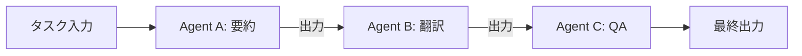
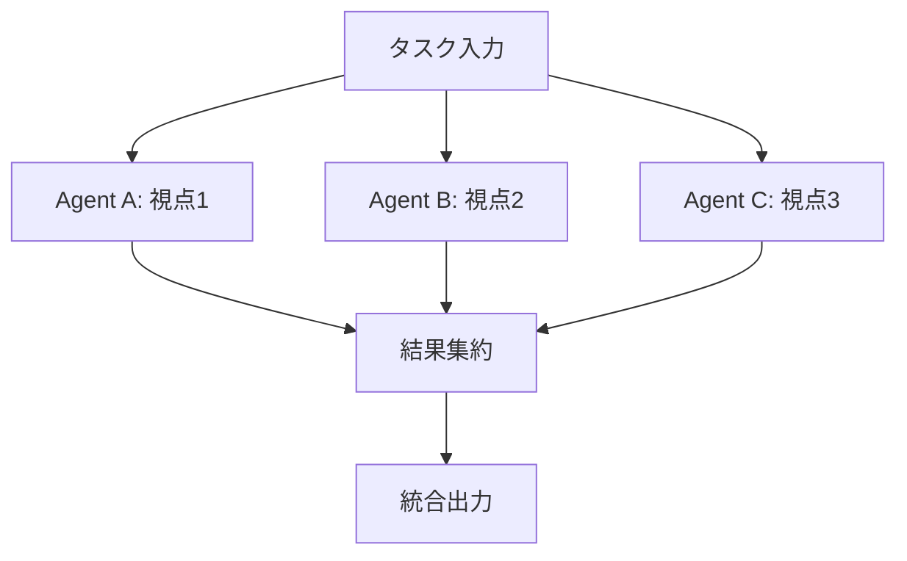
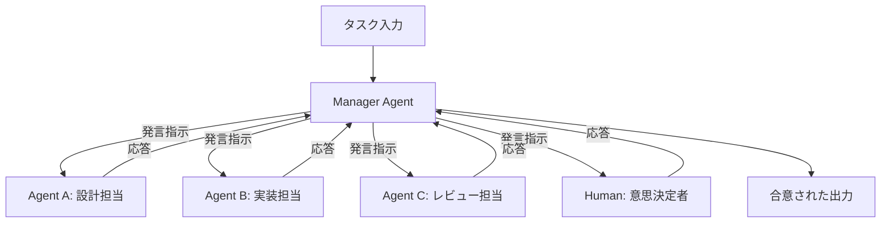
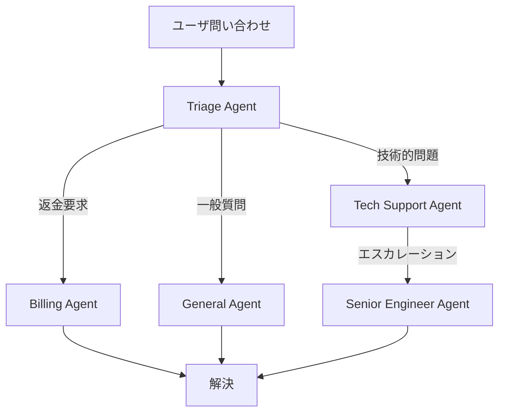
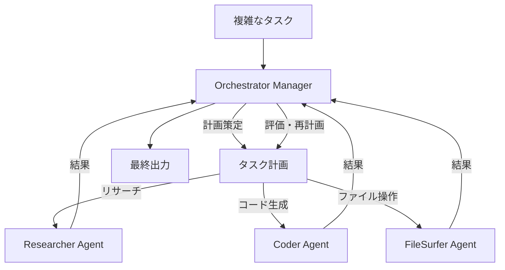
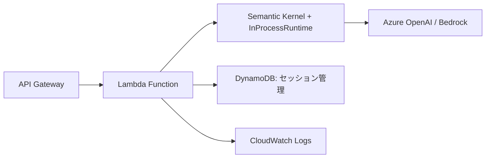
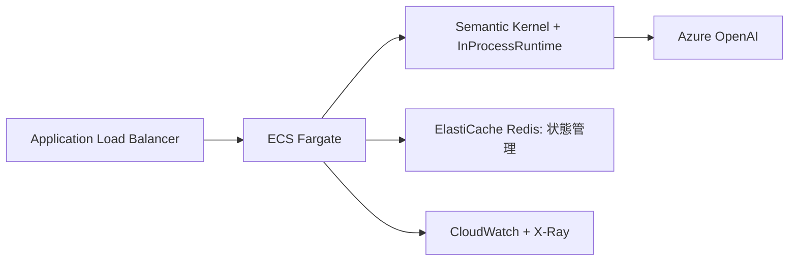

本記事は [Semantic Kernel: Multi-agent Orchestration — Microsoft DevBlog](https://devblogs.microsoft.com/agent-framework/semantic-kernel-multi-agent-orchestration/) の解説記事です。

この記事は [Zenn記事: Semantic Kernel v1.41 Process FrameworkでAIワークフロー自動化を実装する](https://zenn.dev/0h_n0/articles/0092b35192e3cc) の深掘りです。

## ブログ概要（Summary）

Microsoft Agent Framework チームが公開した本ブログでは、Semantic Kernelにおけるマルチエージェントオーケストレーションの5つのパターンが体系化されている。Sequential（逐次）、Concurrent（並行）、Group Chat（グループチャット）、Handoff（委譲）、Magentic（MagenticOne準拠）の各パターンについて、設計思想・ユースケース・実装例が解説されている。特筆すべきは、すべてのパターンが統一されたAPIインターフェースを共有し、オーケストレーションパターンの切り替えがエージェントロジックの変更なしに可能であるという設計上の決定である。

## 情報源

- **種別**: 企業テックブログ（Microsoft DevBlog）
- **URL**: [https://devblogs.microsoft.com/agent-framework/semantic-kernel-multi-agent-orchestration/](https://devblogs.microsoft.com/agent-framework/semantic-kernel-multi-agent-orchestration/)
- **組織**: Microsoft Agent Framework Team
- **対象フレームワーク**: Semantic Kernel (Python / .NET)

## 技術的背景（Technical Background）

単一のLLMエージェントでは、複雑なタスク（複数の専門領域にまたがる問題解決、反復的な品質向上、合議による判断など）への対処に限界がある。マルチエージェントシステムでは複数のエージェントが協調してタスクに取り組むが、その協調方法（誰がいつ何を担当するか）を決定するオーケストレーション層が不可欠である。

ブログでは、既存のマルチエージェントフレームワーク（AutoGen、CrewAI等）においてオーケストレーションの実装がフレームワーク固有のAPIに強く結合しているという課題が指摘されている。Semantic Kernelは、オーケストレーションパターンを抽象化し、パターンの切り替えをコード変更1行で実現する統一APIを提供することでこの課題に取り組んでいる。

## 実装アーキテクチャ: 5つのオーケストレーションパターン

### 1. Sequential Orchestration（逐次オーケストレーション）

パイプライン型の処理を実現するパターンである。各エージェントの出力が次のエージェントの入力となり、処理が一方向に流れる。ブログでは「ドキュメント要約→翻訳→品質保証」のようなケースが挙げられている。



**適用場面**: 各ステップの役割が明確で、処理順序が固定されている場合。前段の出力形式が後段の入力要件と一致する必要がある。

```python
from semantic_kernel.agents import ChatCompletionAgent
from semantic_kernel.agents.orchestration import SequentialOrchestration
from semantic_kernel.agents.runtime import InProcessRuntime

# エージェント定義
summarizer = ChatCompletionAgent(
    name="Summarizer",
    instructions="入力テキストを300文字以内に要約してください",
    kernel=kernel,
)
translator = ChatCompletionAgent(
    name="Translator",
    instructions="日本語テキストを英語に翻訳してください",
    kernel=kernel,
)
qa_reviewer = ChatCompletionAgent(
    name="QAReviewer",
    instructions="翻訳の品質を検証し、修正版を出力してください",
    kernel=kernel,
)

# Sequential Orchestration構成
orchestration = SequentialOrchestration(
    members=[summarizer, translator, qa_reviewer],
)

runtime = InProcessRuntime()
runtime.start()
result = await orchestration.invoke(
    task="長いドキュメントテキスト...",
    runtime=runtime,
)
final_output: str = await result.get()
await runtime.stop_when_idle()
```

### 2. Concurrent Orchestration（並行オーケストレーション）

独立したエージェントが同一タスクを並列に処理し、結果を集約するパターンである。ブログでは、アンサンブル推論・ブレインストーミング・投票による合意形成が典型的なユースケースとして述べられている。



**適用場面**: 各エージェントが独立に動作でき、多様な視点や冗長性が価値を持つ場合。レイテンシは最も遅いエージェントに律速される。

```python
from semantic_kernel.agents.orchestration import ConcurrentOrchestration

orchestration = ConcurrentOrchestration(
    members=[analyst_a, analyst_b, analyst_c],
)

runtime = InProcessRuntime()
runtime.start()
result = await orchestration.invoke(
    task="2026年のAIエージェント市場動向を分析してください",
    runtime=runtime,
)
# 全エージェントの結果がリストとして返される
outputs: list[str] = await result.get()
await runtime.stop_when_idle()
```

### 3. Group Chat Orchestration（グループチャットオーケストレーション）

複数のエージェントが会話形式で協調するパターンである。マネージャーエージェントが発言順を制御し、必要に応じて人間の参加（Human-in-the-Loop）も可能であるとブログでは説明されている。



**適用場面**: 議論・ディベート・合意形成が必要なタスク。設計レビュー会議の自動化、複数ステークホルダーの意見集約などが想定されている。

```python
from semantic_kernel.agents.orchestration import GroupChatOrchestration

orchestration = GroupChatOrchestration(
    members=[designer, implementer, reviewer],
    manager=manager_agent,  # 発言順制御
)

runtime = InProcessRuntime()
runtime.start()
result = await orchestration.invoke(
    task="マイクロサービスアーキテクチャの設計案を議論してください",
    runtime=runtime,
)
discussion_result: str = await result.get()
await runtime.stop_when_idle()
```

### 4. Handoff Orchestration（委譲オーケストレーション）

専門性に基づいてタスクを動的に委譲するパターンである。ブログでは、カスタマーサポートにおいて一般対応エージェントから技術サポートや返金処理の専門エージェントへルーティングするケースが示されている。



**適用場面**: タスクの種類が動的に変化し、専門エージェントへの振り分けが必要な場合。Handoffのトリガーはエージェント自身が判断するため、Routingパターンよりも柔軟性が高いとブログでは述べられている。

```python
from semantic_kernel.agents.orchestration import HandoffOrchestration

triage = ChatCompletionAgent(
    name="TriageAgent",
    instructions=(
        "ユーザの問い合わせを分析し、適切な専門エージェントに委譲してください。"
        "技術的問題は TechSupport に、返金は Billing に委譲します。"
    ),
    kernel=kernel,
)

orchestration = HandoffOrchestration(
    members=[triage, tech_support, billing, general],
)

runtime = InProcessRuntime()
runtime.start()
result = await orchestration.invoke(
    task="APIキーが無効になりました。先月の請求も確認したいです。",
    runtime=runtime,
)
resolution: str = await result.get()
await runtime.stop_when_idle()
```

### 5. Magentic Orchestration（MagenticOneベースオーケストレーション）

Microsoft ResearchのAutoGenプロジェクトで開発されたMagenticOneアーキテクチャに基づくパターンである。マネージャーエージェントが複雑なタスクをサブタスクに分解し、専門エージェント（コーダー、リサーチャー、ファイルサーファーなど）を動的に割り当て、反復的に改善するとブログでは説明されている。



**適用場面**: 複数のスキル（情報収集、コード生成、ファイル操作）を組み合わせ、反復的な改善が必要な複雑なタスク。研究レポート作成やデータ分析パイプライン構築が想定されている。

```python
from semantic_kernel.agents.orchestration import MagenticOrchestration

orchestration = MagenticOrchestration(
    members=[researcher, coder, file_surfer, executor],
)

runtime = InProcessRuntime()
runtime.start()
result = await orchestration.invoke(
    task="最新のTransformerアーキテクチャの論文を調査し、比較表を作成してください",
    runtime=runtime,
)
report: str = await result.get()
await runtime.stop_when_idle()
```

### 統一APIインターフェースの設計

5つのパターンすべてが同一のAPIシグネチャを共有していることが、このフレームワークの最も重要な設計上の決定である。ブログでは、以下の統一インターフェースにより、オーケストレーションパターンの切り替えがエージェントロジックに一切影響しないと説明されている。

```python
from semantic_kernel.agents.orchestration import (
    SequentialOrchestration,
    ConcurrentOrchestration,
    GroupChatOrchestration,
    HandoffOrchestration,
    MagenticOrchestration,
)
from semantic_kernel.agents.runtime import InProcessRuntime

# パターン切り替え: この1行を変更するだけ
orchestration = SequentialOrchestration(members=[agent_a, agent_b, agent_c])
# orchestration = ConcurrentOrchestration(members=[agent_a, agent_b, agent_c])
# orchestration = GroupChatOrchestration(members=[agent_a, agent_b, agent_c])
# orchestration = HandoffOrchestration(members=[agent_a, agent_b, agent_c])
# orchestration = MagenticOrchestration(members=[agent_a, agent_b, agent_c])

# 以下は全パターンで共通
runtime = InProcessRuntime()
runtime.start()
result = await orchestration.invoke(task="Your task here", runtime=runtime)
final_output = await result.get()
await runtime.stop_when_idle()
```

**InProcessRuntime**: ブログでは、`InProcessRuntime`がエージェント間のメッセージングとライフサイクル管理を担う実行基盤として設計されていると述べられている。非同期実行が標準であり、`start()`と`stop_when_idle()`で明示的にランタイムのライフサイクルを制御する。

## 本番デプロイメントガイド（Production Deployment Guide）

### アーキテクチャパターン別構成

マルチエージェントオーケストレーションシステムを本番環境にデプロイする際、規模に応じた3段階の構成を以下に示す。

#### Small: サーバーレス構成（月間リクエスト数 < 10,000）

単一のLambda関数内で`InProcessRuntime`を実行する構成。Sequential / Concurrent パターンに適している。



```hcl
# Terraform: Lambda + API Gateway 構成
resource "aws_lambda_function" "orchestrator" {
  function_name = "sk-multi-agent-orchestrator"
  runtime       = "python3.12"
  handler       = "handler.lambda_handler"
  timeout       = 300  # マルチエージェント処理のため長めに設定
  memory_size   = 1024

  environment {
    variables = {
      AZURE_OPENAI_ENDPOINT  = var.azure_openai_endpoint
      AZURE_OPENAI_API_KEY   = var.azure_openai_api_key
      ORCHESTRATION_PATTERN  = "sequential"  # 環境変数でパターン切り替え
      DYNAMODB_TABLE         = aws_dynamodb_table.sessions.name
    }
  }
}

resource "aws_api_gateway_rest_api" "orchestrator_api" {
  name        = "sk-orchestrator-api"
  description = "Multi-agent orchestration API"
}

resource "aws_dynamodb_table" "sessions" {
  name         = "sk-orchestrator-sessions"
  billing_mode = "PAY_PER_REQUEST"
  hash_key     = "session_id"

  attribute {
    name = "session_id"
    type = "S"
  }

  ttl {
    attribute_name = "expires_at"
    enabled        = true
  }
}
```

#### Medium: コンテナ構成（月間リクエスト数 10,000 - 100,000）

ECS Fargate上でオーケストレーターを稼働させる構成。Group Chat / Handoff パターンのように長時間のセッション維持が必要な場合に適している。



#### Large: Kubernetes構成（月間リクエスト数 > 100,000）

EKS上でエージェントごとにPodを分離し、分散ランタイムで接続する構成。Magenticパターンのように複雑な協調が必要な場合に適している。

```hcl
# Terraform: EKS クラスタ構成
resource "aws_eks_cluster" "orchestrator" {
  name     = "sk-multi-agent-cluster"
  role_arn = aws_iam_role.eks_cluster.arn
  version  = "1.31"

  vpc_config {
    subnet_ids         = var.private_subnet_ids
    security_group_ids = [aws_security_group.eks.id]
  }
}

resource "aws_eks_node_group" "agent_nodes" {
  cluster_name    = aws_eks_cluster.orchestrator.name
  node_group_name = "agent-workers"
  node_role_arn   = aws_iam_role.eks_node.arn
  subnet_ids      = var.private_subnet_ids

  scaling_config {
    desired_size = 3
    max_size     = 10
    min_size     = 1
  }

  instance_types = ["m7g.xlarge"]  # Graviton3 でコスト最適化
}
```

### モニタリング構成

マルチエージェントシステムでは、エージェント間のメッセージフローを可視化することが運用上不可欠である。

```python
import aws_xray_sdk.core as xray
from aws_xray_sdk.core import patch_all

patch_all()

class TracedOrchestration:
    """X-Rayトレーシング付きオーケストレーションラッパー"""

    def __init__(self, orchestration, pattern_name: str) -> None:
        self._orchestration = orchestration
        self._pattern_name = pattern_name

    async def invoke(self, task: str, runtime) -> object:
        """タスク実行をトレーシングする"""
        with xray.capture(f"orchestration.{self._pattern_name}") as subsegment:
            subsegment.put_annotation("pattern", self._pattern_name)
            subsegment.put_annotation("task_length", len(task))
            result = await self._orchestration.invoke(
                task=task, runtime=runtime,
            )
            output = await result.get()
            subsegment.put_metadata("output_length", len(str(output)))
            return output
```

**CloudWatch メトリクス**として以下を計測することを推奨する。

| メトリクス | 説明 | アラーム閾値の目安 |
|-----------|------|--------------------|
| `orchestration.duration_ms` | オーケストレーション全体の所要時間 | P99 > 30秒 |
| `agent.invocation_count` | 各エージェントの呼び出し回数 | 特定エージェントが突出 |
| `agent.token_usage` | エージェントごとのトークン消費量 | 日次予算の80% |
| `handoff.count` | Handoffの発生回数 | 1セッション10回超 |
| `runtime.active_agents` | 同時稼働エージェント数 | ノードキャパシティの80% |

### コスト最適化チェックリスト

マルチエージェントシステムはトークン消費量が単一エージェントの数倍になるため、コスト管理が重要である。

**LLMコスト削減**:
1. Sequential/Handoff の中間エージェントには安価なモデル（GPT-4o-mini等）を使用する
2. 最終出力を生成するエージェントのみ高性能モデル（GPT-4o等）を割り当てる
3. プロンプトキャッシュ（Azure OpenAI Prompt Caching）を活用する
4. Concurrent パターンでは投票数（エージェント数）と精度のトレードオフを検証する
5. Group Chat の最大ターン数に上限を設定する
6. 中間結果の要約でコンテキスト長を圧縮する
7. Magentic パターンの反復回数に上限を設ける

**インフラコスト削減**:
8. Graviton3/4 インスタンスでコンピュート費用を20-30%削減する
9. Lambda の場合、Provisioned Concurrency を避けオンデマンド実行する
10. ECS/EKS のスポットインスタンス活用（中間エージェント用）
11. DynamoDB の TTL でセッションデータを自動削除する
12. CloudWatch Logs の保持期間を30日に制限する

**アーキテクチャレベル**:
13. 小規模ならLambda構成から開始し、必要に応じてスケールアップする
14. Sequential で十分なタスクにConcurrent/Magenticを使わない
15. Handoff の委譲チェーンの深さを制限する（最大3段）
16. Group Chat の参加エージェント数を最小限にする
17. バッチ処理可能なタスクはリアルタイム実行しない
18. レスポンスキャッシュ（同一タスクの結果再利用）を導入する
19. A/B テストでパターン間のコスト対品質を定期計測する
20. トークン使用量のダッシュボードを構築し、日次レビューする
21. 不要なエージェント間メッセージのログレベルをDEBUGに下げる

## パフォーマンス最適化（Performance Optimization）

パターン選択はレイテンシと出力品質のトレードオフに直結する。ブログの内容から推定される各パターンの特性を以下に整理する。

| パターン | レイテンシ | 品質向上の仕組み | トークン消費 |
|---------|-----------|-----------------|-------------|
| Sequential | エージェント数に比例 | 段階的精錬 | 中 |
| Concurrent | 最遅エージェントに律速 | 多様な視点の統合 | 高（並列分） |
| Group Chat | ターン数に比例（最大） | 議論による合意 | 最大 |
| Handoff | 委譲チェーンの深さに依存 | 専門性の活用 | 低〜中 |
| Magentic | 反復回数に依存（最大） | 反復的改善 | 最大 |

レイテンシ重視の場合はSequential（最小エージェント数）またはHandoff（1段委譲）が有利である。品質重視の場合はGroup ChatまたはMagenticが候補となるが、トークンコストとの兼ね合いを事前に検証する必要がある。

## 運用での学び（Lessons in Production）

ブログの内容から、以下の運用上の知見が導出される。

**パターン選択の指針**: 最初にSequentialを試し、不十分な場合にのみ複雑なパターンに移行するのが実用的である。「最も洗練されたパターンが最良」ではなく、タスクの特性に適合するパターンを選択することが重要である。これはAnthropicの「Building Effective Agents」が述べている「シンプルさの優先」と同じ思想である。

**Human-in-the-Loop の設計**: Group Chat パターンでは人間を参加者として組み込めるが、ブログでは人間の介入ポイントを最終判断時に限定することが推奨されている。すべてのターンに人間が関与すると、マルチエージェントの自動化メリットが失われる。

**エラーハンドリング**: マルチエージェント環境では、1つのエージェントの障害がシステム全体に波及する。Handoff パターンでは委譲先が応答しない場合のフォールバック、Magentic パターンでは反復の無限ループ防止が実運用上の課題として考えられる。

## 学術研究との関連（Related Research）

Magentic Orchestrationは、Microsoft Researchが発表したMagenticOne（AutoGenベースのマルチエージェントアーキテクチャ）に基づいている。MagenticOneでは、Orchestratorエージェントがタスク分解・割り当て・進捗追跡を担い、専門エージェント（WebSurfer、Coder、FileSurfer等）が実行を担当するアーキテクチャが提案されている。

また、マルチエージェント合意形成の研究分野では、LLMエージェント間のDebate（議論）手法がLLM出力の事実性向上に寄与することが報告されており、Group Chat Orchestrationの理論的基盤と関連する。Concurrent Orchestrationの投票メカニズムは、アンサンブル学習における多数決原理と同等の信頼性向上効果が期待される。

## まとめと実践への示唆

Semantic Kernelのマルチエージェントオーケストレーションは、5つの協調パターンを統一APIで抽象化するという設計上の決定が最大の特徴である。これにより、開発者はエージェントロジックとオーケストレーションロジックを分離でき、パターンの比較検証が容易になる。Zenn記事で解説されているProcess Frameworkがワークフローの状態遷移を管理するのに対し、本オーケストレーション機能はエージェント間の協調戦略を管理する相補的な位置づけにある。実践的には、Sequentialから開始し、タスクの複雑性に応じてパターンをスケールアップする段階的アプローチが推奨される。

## 参考文献

1. Microsoft Agent Framework Team, "Semantic Kernel: Multi-agent Orchestration", Microsoft DevBlog. [https://devblogs.microsoft.com/agent-framework/semantic-kernel-multi-agent-orchestration/](https://devblogs.microsoft.com/agent-framework/semantic-kernel-multi-agent-orchestration/)
2. Fourrier, C. et al., "MagenticOne: A Generalist Multi-Agent System for Solving Complex Tasks", Microsoft Research, 2024. [https://www.microsoft.com/en-us/research/articles/magentic-one-a-generalist-multi-agent-system-for-solving-complex-tasks/](https://www.microsoft.com/en-us/research/articles/magentic-one-a-generalist-multi-agent-system-for-solving-complex-tasks/)
3. Semantic Kernel Documentation, "Agents Overview", Microsoft Learn. [https://learn.microsoft.com/en-us/semantic-kernel/frameworks/agent/](https://learn.microsoft.com/en-us/semantic-kernel/frameworks/agent/)
4. Zenn記事: Semantic Kernel v1.41 Process FrameworkでAIワークフロー自動化を実装する. [https://zenn.dev/0h_n0/articles/0092b35192e3cc](https://zenn.dev/0h_n0/articles/0092b35192e3cc)
