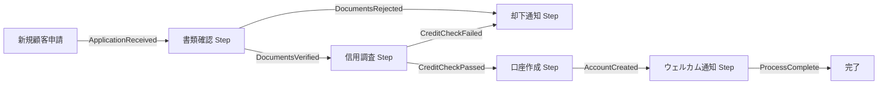

## ブログ概要（Summary）

本記事は [Integrating AI into Business Processes with the Process Framework](https://devblogs.microsoft.com/semantic-kernel/integrating-ai-into-business-processes-with-the-process-framework/) の解説記事です。

この記事は [Zenn記事: Semantic Kernel v1.41 Process FrameworkでAIワークフロー自動化を実装する](https://zenn.dev/0h_n0/articles/0092b35192e3cc) の深掘りです。Zenn記事ではPython実装に焦点を当てたが、本記事ではMicrosoftが提唱するProcess/Step/Patternの設計思想と、エンタープライズ向けステートフル実行基盤の技術的背景を掘り下げる。

Chaki氏（GM AI Innovation, Microsoft）は、ブログにおいてProcess Frameworkが「ビジネスプロセスにAIを統合するための構造化されたアプローチ」であると説明している。なお、本フレームワークは2024年9月時点で**Experimental（実験的）ステータス**であり、本番環境への導入には注意が必要である。

## 情報源

- **種別**: 企業テックブログ（Microsoft DevBlog）
- **URL**: [https://devblogs.microsoft.com/semantic-kernel/integrating-ai-into-business-processes-with-the-process-framework/](https://devblogs.microsoft.com/semantic-kernel/integrating-ai-into-business-processes-with-the-process-framework/)
- **組織**: Microsoft（Semantic Kernel チーム）
- **著者**: Evan Chaki, GM AI Innovation
- **発表日**: 2024年9月25日

## 技術的背景（Technical Background）

LLMやAIエージェントの能力が急速に向上する一方、企業のビジネスプロセスへのAI統合は依然としてアドホックな実装が主流である。カスタマーオンボーディング、サポートチケット処理、注文管理などの業務フローにAIを組み込む場合、以下の課題が生じる。

**従来の課題**:
- **状態管理の欠如**: AI呼び出しがステートレスであり、長時間にわたるビジネスプロセスの途中状態を保持できない
- **再利用性の低さ**: 既存のSemantic Kernel関数やプラグインをワークフロー内で再利用する標準的な手段がない
- **エンタープライズ要件への未対応**: 監査証跡、分散トレーシング、Human-in-the-loopなどの企業向け機能が統一的に提供されていない
- **実行パターンの標準化不足**: Fan Out/Fan In、Cycle、Map Reduceといったワークフローパターンをプロセス定義レベルで表現する仕組みがない

学術的には、ワークフローオーケストレーション分野（BPMNやWfMCの研究）で培われた「プロセス定義」「アクティビティ」「制御フロー」の概念を、AI統合コンテキストに持ち込んだものと位置づけられる。特に、イベント駆動アーキテクチャ（EDA）とアクターモデルの組み合わせは、Microsoft Orleansの設計思想と直接的に接続する。

## 実装アーキテクチャ（Architecture）

### Process/Step/Patternの3コンセプト

ブログでは、Process Frameworkの基盤を**Process**、**Step**、**Pattern**の3つの概念で説明している。

#### 1. Process（プロセス）

Chaki氏によると、Processは「特定のビジネス目標を達成するために設計されたステップの構造化されたコレクション」である。たとえばカスタマーオンボーディングプロセスは、本人確認、口座開設、初期設定などの複数ステップで構成される。

Processは入れ子構造をサポートしており、サブプロセスとして別のProcessを組み込める。ブログでは、カスタマーサポートチケット解決のワークフローにおいて、チケット分類→エスカレーション→解決のサブプロセスが例示されている。

#### 2. Step（ステップ）

Stepは、定義されたInputとOutputを持つ個別タスクの単位である。ブログでは、各Stepが以下を呼び出せると説明されている：
- Semantic Kernelの既存関数（Kernel Functions）
- 外部API
- AIエージェント
- Human-in-the-loop（人間による判断ポイント）

重要な設計上の特徴として、**各Stepが独立した状態を保持する**点がある。これにより、プロセス全体が長時間にわたって実行される場合でも、各Stepの途中状態が永続化される。

#### 3. Pattern（パターン）

ブログでは、以下の4つの実行パターンが紹介されている：

| パターン | 説明 | ユースケース例 |
|---------|------|---------------|
| **Fan Out** | 1つのステップから複数のステップへ並列分岐 | 複数の信用調査機関への同時問い合わせ |
| **Fan In** | 複数のステップの結果を1つに集約 | 信用調査結果の統合判定 |
| **Cycle** | 条件に基づくループ実行 | 承認フローでの差し戻しと再提出 |
| **Map Reduce** | データ集合を分割→個別処理→集約 | 大量注文の並列処理と結果統合 |

### イベント駆動設計

Process Frameworkのステップ間通信はイベント駆動で実現される。以下にブログで示されたアカウント開設プロセスの概念を図示する。



各ステップはイベントを発行し、次のステップがそのイベントをサブスクライブする形で接続される。この設計により、ステップ間の結合度が低く保たれ、個別のステップを入れ替えたり、新しいステップを挿入したりする柔軟性が確保される。

### ステートフルアーキテクチャ

ブログでは、Process Frameworkのステートフル実行基盤として2つのランタイムが紹介されている：

**Microsoft Orleans（Virtual Actor Model）**

Orleans は .NET 向けの分散アクターフレームワークであり、Process Frameworkのデフォルトランタイムとして位置づけられている。各Stepがアクター（Grain）として実装され、以下の特性を持つ：
- **仮想アクター**: アクティベーション/ディアクティベーションが自動管理される
- **永続化**: 状態がストレージプロバイダ（Azure Table Storage、DynamoDB等）に自動保存される
- **分散実行**: クラスター内の複数ノードに自動分散される

**Dapr（Distributed Application Runtime）**

Daprはクラウドネイティブなランタイムであり、Kubernetesなどのコンテナ環境での実行に適している。サイドカーパターンにより、アプリケーションコードを変更せずに状態管理やサービス間通信を提供する。

### エンタープライズ機能

ブログでは、以下のエンタープライズ向け機能が言及されている：
- **OpenTelemetry統合**: 各ステップの実行トレースを標準的なテレメトリとして出力
- **監査証跡**: プロセスの実行履歴を記録し、コンプライアンス要件に対応
- **SK統合**: 既存のSemantic Kernel関数・プラグインをStep内でそのまま再利用可能

```python
from semantic_kernel.processes import ProcessBuilder, ProcessStepBuilder

class CreditCheckStep:
    """信用調査ステップ

    外部信用調査APIを呼び出し、結果をイベントとして発行する。
    ステートフルに直前の調査結果を保持し、再試行時に差分のみ取得する。
    """

    state: dict[str, any] = {}

    async def check_credit(
        self, application_id: str, applicant_data: dict[str, str]
    ) -> None:
        """信用調査を実行する

        Args:
            application_id: 申請ID
            applicant_data: 申請者情報（氏名、生年月日等）
        """
        # Kernel Functionとして既存の信用調査ロジックを呼び出し
        result = await self.kernel.invoke(
            plugin_name="credit_bureau",
            function_name="check_score",
            arguments={"applicant": applicant_data},
        )
        self.state["last_check"] = {
            "application_id": application_id,
            "score": result.value,
        }
        if result.value >= 650:
            await self.emit_event("CreditCheckPassed", data=result.value)
        else:
            await self.emit_event("CreditCheckFailed", data=result.value)
```

> **注意**: 上記コードはブログの概念をPythonで表現したものであり、実際のProcess Framework APIとは異なる場合がある。正確なAPIについてはSemantic Kernelの公式ドキュメントを参照されたい。

## Production Deployment Guide

Process Frameworkを実運用環境にデプロイする際のパターンを、AWSインフラを例に整理する。なお、以下はProcess Frameworkの設計思想に基づく一般的なアーキテクチャパターンであり、ブログで直接推奨されたものではない。

### 規模別デプロイメントパターン

| 項目 | Small（月間1万プロセス） | Medium（月間10万プロセス） | Large（月間100万プロセス以上） |
|------|-------------------------|--------------------------|------------------------------|
| コンピュート | Lambda + Step Functions | ECS Fargate | EKS + Karpenter |
| AI推論 | Bedrock（オンデマンド） | Bedrock（Provisioned Throughput） | SageMaker + Bedrock混成 |
| 状態管理 | DynamoDB（On-Demand） | DynamoDB（Provisioned） | DynamoDB + ElastiCache |
| イベントバス | EventBridge | EventBridge + SQS | MSK（Kafka） |
| 監視 | CloudWatch | CloudWatch + X-Ray | OpenTelemetry Collector → Grafana |
| 月間概算コスト | $200-500 | $2,000-5,000 | $15,000-50,000 |

### Small規模: Lambda + Bedrock + DynamoDB

月間1万プロセス程度のワークロードには、サーバーレス構成が適している。

```hcl
# Terraform: Small規模のProcess Framework基盤
# Lambda + Step Functions + DynamoDB

terraform {
  required_providers {
    aws = {
      source  = "hashicorp/aws"
      version = "~> 5.0"
    }
  }
}

# --- DynamoDB: プロセスとステップの状態管理 ---
resource "aws_dynamodb_table" "process_state" {
  name         = "sk-process-state"
  billing_mode = "PAY_PER_REQUEST"
  hash_key     = "process_id"
  range_key    = "step_id"

  attribute {
    name = "process_id"
    type = "S"
  }

  attribute {
    name = "step_id"
    type = "S"
  }

  attribute {
    name = "status"
    type = "S"
  }

  global_secondary_index {
    name            = "status-index"
    hash_key        = "status"
    range_key       = "process_id"
    projection_type = "ALL"
  }

  point_in_time_recovery {
    enabled = true
  }

  tags = {
    Environment = "production"
    Service     = "sk-process-framework"
  }
}

# --- Lambda: ステップ実行 ---
resource "aws_lambda_function" "process_step_executor" {
  function_name = "sk-process-step-executor"
  runtime       = "python3.12"
  handler       = "handler.lambda_handler"
  timeout       = 300
  memory_size   = 512

  filename         = "lambda_package.zip"
  source_code_hash = filebase64sha256("lambda_package.zip")

  role = aws_iam_role.lambda_exec.arn

  environment {
    variables = {
      DYNAMODB_TABLE    = aws_dynamodb_table.process_state.name
      BEDROCK_MODEL_ID  = "anthropic.claude-sonnet-4-20250514"
      OPENTELEMETRY_ENABLED = "true"
    }
  }

  tracing_config {
    mode = "Active"
  }
}

# --- Step Functions: プロセスオーケストレーション ---
resource "aws_sfn_state_machine" "process_orchestrator" {
  name     = "sk-process-orchestrator"
  role_arn = aws_iam_role.sfn_exec.arn

  definition = jsonencode({
    Comment = "SK Process Framework Orchestrator"
    StartAt = "InitProcess"
    States = {
      InitProcess = {
        Type     = "Task"
        Resource = aws_lambda_function.process_step_executor.arn
        Parameters = {
          "step_name" = "init"
          "process_id.$" = "$.process_id"
        }
        Next = "RouteByEvent"
      }
      RouteByEvent = {
        Type = "Choice"
        Choices = [
          {
            Variable     = "$.event_type"
            StringEquals = "StepCompleted"
            Next         = "ExecuteNextStep"
          },
          {
            Variable     = "$.event_type"
            StringEquals = "ProcessComplete"
            Next         = "FinalizeProcess"
          }
        ]
        Default = "HandleError"
      }
      ExecuteNextStep = {
        Type     = "Task"
        Resource = aws_lambda_function.process_step_executor.arn
        Next     = "RouteByEvent"
      }
      FinalizeProcess = {
        Type = "Succeed"
      }
      HandleError = {
        Type  = "Fail"
        Error = "ProcessError"
        Cause = "Unhandled event type"
      }
    }
  })
}

# --- IAM Roles ---
resource "aws_iam_role" "lambda_exec" {
  name = "sk-process-lambda-role"

  assume_role_policy = jsonencode({
    Version = "2012-10-17"
    Statement = [{
      Action = "sts:AssumeRole"
      Effect = "Allow"
      Principal = {
        Service = "lambda.amazonaws.com"
      }
    }]
  })
}

resource "aws_iam_role" "sfn_exec" {
  name = "sk-process-sfn-role"

  assume_role_policy = jsonencode({
    Version = "2012-10-17"
    Statement = [{
      Action = "sts:AssumeRole"
      Effect = "Allow"
      Principal = {
        Service = "states.amazonaws.com"
      }
    }]
  })
}
```

### Large規模: EKS + Karpenter

月間100万プロセス以上の大規模ワークロードでは、Kubernetes基盤が適する。

```hcl
# Terraform: Large規模のProcess Framework基盤
# EKS + Karpenter + MSK

module "eks" {
  source  = "terraform-aws-modules/eks/aws"
  version = "~> 20.0"

  cluster_name    = "sk-process-cluster"
  cluster_version = "1.31"

  vpc_id     = module.vpc.vpc_id
  subnet_ids = module.vpc.private_subnets

  eks_managed_node_groups = {
    system = {
      instance_types = ["m7i.xlarge"]
      min_size       = 2
      max_size       = 4
      desired_size   = 2

      labels = {
        role = "system"
      }
    }
  }

  tags = {
    Environment = "production"
    Service     = "sk-process-framework"
  }
}

# --- Karpenter: AI推論ワークロード用オートスケーラー ---
resource "helm_release" "karpenter" {
  name       = "karpenter"
  repository = "oci://public.ecr.aws/karpenter"
  chart      = "karpenter"
  version    = "1.1.0"
  namespace  = "kube-system"
}

# Karpenter NodePool: GPU対応ノード（大規模AI推論用）
resource "kubectl_manifest" "karpenter_nodepool" {
  yaml_body = yamlencode({
    apiVersion = "karpenter.sh/v1"
    kind       = "NodePool"
    metadata = {
      name = "ai-inference"
    }
    spec = {
      template = {
        spec = {
          requirements = [
            {
              key      = "karpenter.k8s.aws/instance-category"
              operator = "In"
              values   = ["g", "p"]
            },
            {
              key      = "karpenter.k8s.aws/instance-generation"
              operator = "Gte"
              values   = ["5"]
            }
          ]
          nodeClassRef = {
            group = "karpenter.k8s.aws"
            kind  = "EC2NodeClass"
            name  = "default"
          }
        }
      }
      limits = {
        cpu    = "256"
        memory = "1024Gi"
      }
      disruption = {
        consolidationPolicy = "WhenEmptyOrUnderutilized"
        consolidateAfter    = "30s"
      }
    }
  })
}

# --- MSK (Managed Kafka): イベントバス ---
resource "aws_msk_cluster" "process_events" {
  cluster_name           = "sk-process-events"
  kafka_version          = "3.7.x.kraft"
  number_of_broker_nodes = 3

  broker_node_group_info {
    instance_type   = "kafka.m7g.large"
    client_subnets  = module.vpc.private_subnets
    storage_info {
      ebs_storage_info {
        volume_size = 100
      }
    }
  }

  encryption_info {
    encryption_in_transit {
      client_broker = "TLS"
      in_cluster    = true
    }
  }
}
```

### モニタリング構成

Process Frameworkの運用では、プロセス単位とステップ単位の両方でメトリクスを取得することが重要である。

```python
"""OpenTelemetry計装例

Process Frameworkのステップ実行をトレーシングする。
ブログで言及されたOpenTelemetry統合の実装パターン。
"""

from opentelemetry import trace, metrics
from opentelemetry.sdk.trace import TracerProvider
from opentelemetry.sdk.metrics import MeterProvider
from opentelemetry.exporter.otlp.proto.grpc.trace_exporter import (
    OTLPSpanExporter,
)
from opentelemetry.exporter.otlp.proto.grpc.metric_exporter import (
    OTLPMetricExporter,
)

# トレーサー・メーター初期化
tracer = trace.get_tracer("sk.process.framework")
meter = metrics.get_meter("sk.process.framework")

# カスタムメトリクス
process_duration = meter.create_histogram(
    name="sk.process.duration_ms",
    description="プロセス全体の実行時間",
    unit="ms",
)
step_duration = meter.create_histogram(
    name="sk.process.step.duration_ms",
    description="個別ステップの実行時間",
    unit="ms",
)
step_error_count = meter.create_counter(
    name="sk.process.step.errors",
    description="ステップ実行エラー数",
)


async def execute_step_with_telemetry(
    process_id: str, step_name: str, step_func: callable
) -> dict:
    """テレメトリ付きステップ実行

    Args:
        process_id: プロセスID
        step_name: ステップ名
        step_func: 実行する関数

    Returns:
        ステップの実行結果
    """
    with tracer.start_as_current_span(
        f"process.step.{step_name}",
        attributes={
            "process.id": process_id,
            "step.name": step_name,
        },
    ) as span:
        import time
        start = time.monotonic()
        try:
            result = await step_func()
            span.set_attribute("step.status", "success")
            return result
        except Exception as e:
            span.set_attribute("step.status", "error")
            span.record_exception(e)
            step_error_count.add(1, {"step.name": step_name})
            raise
        finally:
            elapsed_ms = (time.monotonic() - start) * 1000
            step_duration.record(elapsed_ms, {"step.name": step_name})
```

### コスト最適化チェックリスト

Process Frameworkの運用コストを最適化するためのチェック項目を以下に示す。

**コンピュート最適化**:
- [ ] Lambda関数のメモリサイズを実測ベースで調整（AWS Lambda Power Tuning活用）
- [ ] ECS/EKSのオートスケーリングポリシーをプロセス実行数に連動
- [ ] Spot Instancesの活用（ステートレスなステップ実行ノード）
- [ ] Graviton（ARM）インスタンスへの移行検討
- [ ] Lambda SnapStartの有効化（Java/.NETランタイム）

**AI推論コスト最適化**:
- [ ] Bedrock Provisioned Throughputの利用（安定したワークロード）
- [ ] プロンプトキャッシュの活用（繰り返し実行されるステップ）
- [ ] モデル選択の最適化（全ステップでGPT-4/Claudeが必要か再検討）
- [ ] バッチ推論の活用（非リアルタイムステップ）
- [ ] Input/Outputトークン数のモニタリングと最適化

**状態管理コスト最適化**:
- [ ] DynamoDB TTLの設定（完了済みプロセスの自動削除）
- [ ] DynamoDB Reserved Capacityの購入（安定ワークロード）
- [ ] S3 Intelligent-Tieringへの大容量ステップデータの退避
- [ ] ElastiCacheのノードタイプ最適化

**ネットワーク最適化**:
- [ ] VPCエンドポイントの設定（DynamoDB、Bedrock、S3）
- [ ] リージョン内通信の最大化（クロスリージョン転送の最小化）
- [ ] CloudFrontの活用（外部API呼び出しのキャッシュ）

**運用コスト最適化**:
- [ ] CloudWatch Logsの保持期間設定（不要なログの自動削除）
- [ ] X-Rayサンプリングレートの調整（全トレース取得は避ける）
- [ ] 開発/ステージング環境のスケジュール停止
- [ ] Savings Plans/Reserved Instancesの購入計画

**セキュリティベストプラクティス**:
- [ ] IAMロールの最小権限原則（各ステップに必要最小限の権限）
- [ ] DynamoDB暗号化（AWS KMS CMK）
- [ ] VPC内でのBedrock呼び出し（VPCエンドポイント経由）
- [ ] Secrets Managerでの認証情報管理
- [ ] CloudTrailでのAPI呼び出し記録
- [ ] WAFの設定（外部からのプロセストリガー保護）

## パフォーマンス最適化（Performance）

Process Frameworkのパフォーマンスは、ステップ間のイベント伝搬遅延と状態永続化のオーバーヘッドに大きく依存する。

**イベント伝搬の最適化**:

ブログで説明されているイベント駆動設計では、各ステップの完了時にイベントが発行される。Fan Outパターンで複数ステップに分岐する場合、イベントバスのスループットがボトルネックになりうる。Orleansランタイムではアクター間の直接メッセージングによりオーバーヘッドを削減でき、Daprランタイムではpub/subコンポーネントの選択（Redis Streams vs. Kafka）が遅延特性に影響する。

**状態永続化の最適化**:

各ステップが状態を保持するステートフル設計では、状態の読み書き頻度がパフォーマンスを左右する。特にCycleパターン（ループ実行）では、反復のたびに状態が更新されるため、永続化先の選択が重要になる。インメモリキャッシュとバックエンドストアの2層構成が実用的である。

**コールドスタートの考慮**:

サーバーレス環境（Lambda等）でステップを実行する場合、コールドスタートによる初回遅延が発生する。Semantic Kernelの初期化、AIモデルへの接続確立、プラグインのロードなどが影響するため、Provisioned Concurrencyやウォームアップ戦略の検討が必要である。

## 運用での学び（Production Lessons）

ブログでは3つの実運用シナリオが紹介されている。これらから得られる運用上の教訓を整理する。

### シナリオ1: アカウント開設（Account Opening）

ブログによると、このプロセスには書類確認、信用調査、口座作成の各ステップが含まれる。**Fan Out/Fan Inパターン**の典型例であり、複数の信用調査機関への並列問い合わせと結果の集約が行われる。

**運用上の注意点**:
- 外部信用調査APIのタイムアウトとリトライ設計が重要
- 信用調査結果の不整合時（機関ごとに異なるスコア）の判定ロジック
- 規制要件（KYC/AML）に基づく監査証跡の保持期間

### シナリオ2: フードデリバリー（Food Delivery）

注文受付→調理→配達→完了の一連のフローにおいて、**Cycleパターン**が配達ステータスの繰り返し確認に活用される。

**運用上の注意点**:
- リアルタイム性の要求が高く、イベント伝搬遅延がUXに直結する
- 配達員のマッチングにAIを活用する場合のレイテンシ要件
- 注文キャンセル・変更時のプロセス途中状態のハンドリング

### シナリオ3: サポートチケット解決（Support Ticket Resolution）

ブログでは、サポートチケット処理が**サブプロセス**の例として説明されている。チケット分類、優先度判定、担当者割り当て、解決確認のステップが含まれ、エスカレーションフローがサブプロセスとして組み込まれる。

**運用上の注意点**:
- Human-in-the-loopステップでのタイムアウト設計（人間の応答待ち）
- AI分類の精度と人間によるオーバーライドの仕組み
- SLA監視との統合（プロセス全体の経過時間追跡）

### 共通する教訓

3つのシナリオに共通する運用上の教訓は以下の通りである：

1. **べき等性の確保**: 各ステップは再実行可能であること。ネットワーク障害やプロセス再起動時に、同じステップが複数回実行されても結果が変わらない設計が必要
2. **タイムアウトの階層設計**: ステップ単位のタイムアウトに加え、プロセス全体のタイムアウトを設定し、停滞したプロセスを検知する
3. **可観測性の統合**: OpenTelemetryによるトレーシングに加え、ビジネスメトリクス（プロセス完了率、平均処理時間）をダッシュボード化する

## 学術研究との関連（Academic Connection）

Process Frameworkの設計は、以下の学術的な流れと接続する。

**ワークフロー管理の系譜**: BPMNやWfMCで定義されたワークフローパターン（van der Aalst et al., 2003）は、Process Frameworkのパターン概念の直接的な先行研究である。Fan Out/Fan In、Cycleなどのパターンは、ワークフローパターンの分類体系に対応する。

**アクターモデル**: Hewitt et al.（1973）が提案したアクターモデルは、OrleanのVirtual Actorパターンの理論的基盤であり、Process FrameworkのステートフルStep実行の基礎となっている。

**イベント駆動アーキテクチャ**: Luckham（2001）のComplex Event Processing（CEP）の概念は、Process Frameworkのイベント駆動設計に影響を与えている。ステップ間のイベント伝搬と条件分岐は、CEPのイベントパターンマッチングと類似の構造を持つ。

**AIオーケストレーション**: 近年のAIエージェント研究（AutoGen、CrewAI、LangGraph等）で提案されたマルチエージェントオーケストレーションパターンと、Process Frameworkのワークフローパターンには共通する設計上の課題（状態管理、エラーハンドリング、人間との協調）がある。

## まとめと実践への示唆

Semantic Kernel Process Frameworkは、Process/Step/Patternの3つの概念によりAIをビジネスプロセスに統合するための構造化されたアプローチを提供する。Chaki氏がブログで説明する通り、既存のSemantic Kernel資産を再利用しつつ、エンタープライズ向けの状態管理・監視・監査機能を備えている。

ただし、以下の制約を認識する必要がある：
- **Experimentalステータス**: APIの安定性が保証されていない（2024年9月時点）
- **ランタイム依存**: Orleans/Daprへの依存が前提であり、他のランタイムへの移植性は限定的
- **.NET中心**: Python SDKは提供されているが、機能の網羅性やドキュメントの充実度は.NETに劣る

実践的には、新規のビジネスプロセスAI統合プロジェクトの設計段階で、Process/Step/Patternの概念フレームワークを参考にすることで、再利用性と可観測性の高いアーキテクチャを設計できる。既存のSemantic Kernelユーザーにとっては、関数・プラグインの資産をワークフローレベルに昇格させる自然な拡張パスとなる。

## 参考文献

1. Chaki, E. (2024). "Integrating AI into Business Processes with the Process Framework." Microsoft DevBlog. [https://devblogs.microsoft.com/semantic-kernel/integrating-ai-into-business-processes-with-the-process-framework/](https://devblogs.microsoft.com/semantic-kernel/integrating-ai-into-business-processes-with-the-process-framework/)
2. Microsoft. "Semantic Kernel Documentation." [https://learn.microsoft.com/semantic-kernel/](https://learn.microsoft.com/semantic-kernel/)
3. van der Aalst, W. M. P., ter Hofstede, A. H. M., Kiepuszewski, B., & Barros, A. P. (2003). "Workflow Patterns." *Distributed and Parallel Databases*, 14(1), 5-51.
4. Hewitt, C., Bishop, P., & Steiger, R. (1973). "A Universal Modular ACTOR Formalism for Artificial Intelligence." *IJCAI*.
5. Bernstein, P. et al. (2014). "Orleans: Distributed Virtual Actors for Programmability and Scalability." Microsoft Research Technical Report MSR-TR-2014-41.
6. Luckham, D. (2001). *The Power of Events: An Introduction to Complex Event Processing in Distributed Enterprise Systems.* Addison-Wesley.
7. Dapr Authors. "Dapr - Distributed Application Runtime." [https://dapr.io/](https://dapr.io/)
