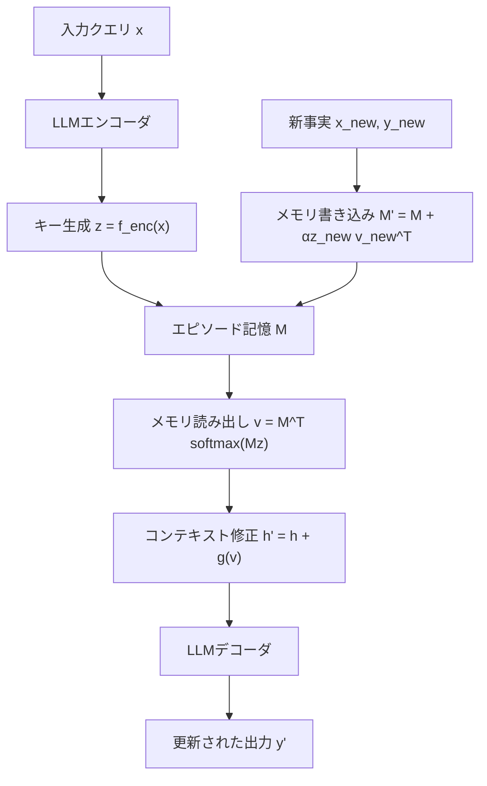

本記事は [Larimar: Large Language Models with Episodic Memory Control (ICML 2024)](https://proceedings.mlr.press/v235/das24a.html) の解説記事です。

## 論文概要（Abstract）

LLMの知識を更新するには通常、再訓練やファインチューニングが必要であり、計算コストが高い。Larimarは、脳の補完学習システム（Complementary Learning Systems, CLS）に着想を得た分散エピソード記憶を導入することで、再訓練なしに知識をone-shotで動的に更新するアーキテクチャである。著者らは事実編集ベンチマーク（CounterFact, zsRE等）において、既存手法と同等以上の精度を達成しつつ、8-10倍の高速化を報告している。

この記事は [Zenn記事: Bedrock AgentCoreエピソード記憶の本番運用設計と応答品質の定量評価](https://zenn.dev/0h_n0/articles/b6f2b1dfabb12c) の深掘りです。

## 情報源

- **会議名**: ICML 2024（International Conference on Machine Learning）
- **年**: 2024
- **URL**: [https://proceedings.mlr.press/v235/das24a.html](https://proceedings.mlr.press/v235/das24a.html)
- **著者**: Payel Das, Subhajit Chaudhury, Elliot Nelson, Igor Melnyk, Sarathkrishna Swaminathan, Sihui Dai, Aurelie Lozano, Georgios Kollias, Vijil Chenthamarakshan, Jiri Navratil, Soham Dan, Pin-Yu Chen
- **所属**: IBM Research
- **コード**: [https://github.com/IBM/larimar](https://github.com/IBM/larimar)

## カンファレンス情報

**ICML（International Conference on Machine Learning）について**: ICMLは機械学習分野の最高峰会議の1つであり、NeurIPS、ICLRと並んで「三大ML会議」と称される。2024年は採択率約27%で競争が激しい。Larimarの採択は、エピソード記憶によるLLM知識更新という手法の新規性と実用性が高く評価されたことを示している。

## 技術的詳細（Technical Details）

### 補完学習システム（CLS）理論の背景

Larimarの設計は、脳の記憶システムに関するCLS理論に基づいている。CLS理論によると、脳は2つの補完的な学習システムを持つ。

1. **新皮質（Neocortex）**: 長期的な構造化知識を緩やかに学習する。LLMの事前学習済みパラメータに対応
2. **海馬（Hippocampus）**: 新しいエピソードを即座に記録し、必要に応じて新皮質に統合する。Larimarの外部エピソード記憶に対応

この比喩に基づき、LLMのパラメータ（新皮質）を変更せずに、外部エピソード記憶（海馬）で新しい知識を即座に保持・活用する設計が提案されている。

### Larimarアーキテクチャ



Larimarの中核は、LLMの隠れ層表現に対してエピソード記憶から読み出した情報を加算的に注入する機構である。

**メモリの構造**: エピソード記憶$M$は$d_k \times d_v$の行列として表現される。ここで$d_k$はキー次元、$d_v$はバリュー次元である。

**メモリ読み出し**:

入力$x$に対してLLMエンコーダがキーベクトル$z \in \mathbb{R}^{d_k}$を生成し、以下の式でメモリからバリューを読み出す。

$$
v = M^T \text{softmax}(Mz / \tau)
$$

ここで$\tau$は温度パラメータであり、検索の鋭さを制御する。$\tau \to 0$で最近傍検索に近づき、$\tau \to \infty$で一様な重み付けになる。

**メモリ書き込み（One-shot更新）**:

新しい事実$(x_{\text{new}}, y_{\text{new}})$を記録する際、以下の更新を行う。

$$
M' = M + \alpha \cdot z_{\text{new}} \cdot v_{\text{new}}^T
$$

ここで$z_{\text{new}}$は新事実のキー、$v_{\text{new}}$は対応するバリュー、$\alpha$は学習率である。この外積の加算はHopfieldネットワークの学習則と類似しており、既存の記憶を破壊することなく新しい知識を追加できる。

**コンテキスト修正**:

LLMの中間層の隠れ状態$h$に、メモリから読み出したバリュー$v$を変換して加算する。

$$
h' = h + g(v)
$$

ここで$g$は線形変換またはMLPである。この加算的な修正により、LLMの元の知識を保持しつつ、エピソード記憶からの新情報を注入できる。

### 選択的忘却と情報漏洩防止

著者らは、エピソード記憶の実用上重要な2つの追加機能を提案している。

**選択的忘却（Selective Forgetting）**: 特定の事実を記憶から除去する操作。メモリ行列から対象キーに対応する成分を減算する。

$$
M_{\text{forget}} = M - \beta \cdot z_{\text{target}} \cdot v_{\text{target}}^T
$$

この操作は、GDPR等のデータ削除要求への対応や、古くなった知識の除去に活用できる。

**情報漏洩防止**: エピソード記憶に保存された情報が、意図しないクエリに対して漏洩しないよう、キーの直交化を行う。キー間の類似度を低く保つことで、無関係なクエリからの記憶読み出しを抑制する。

## 実装のポイント（Implementation）

- **メモリ挿入位置**: LLMの中間層（全層数の40-60%付近）にメモリ注入を行うのが最も効果的であると著者らは報告している。初期層は低レベル特徴、最終層は出力分布に近いため、中間層が知識表現の修正に適している
- **キー次元の選択**: $d_k$が大きいほどメモリ容量は増えるが、検索の精度が低下する可能性がある。著者らは$d_k = 256$を基準として実験している
- **温度パラメータ**: $\tau$が小さすぎると特定の記憶に過度に集中し、大きすぎると全記憶が平均化される。$\tau = 0.1$程度がバランス点として報告されている
- **LLM非依存性**: Larimarのメモリモジュールはエンコーダの出力次元にのみ依存するため、異なるLLMベース（GPT系、LLaMA系等）に対して同一のメモリアーキテクチャを適用可能である

## Production Deployment Guide

### AWS実装パターン（コスト最適化重視）

Larimar型のエピソード記憶をAWS上に構築する場合の推奨構成を示す。

**トラフィック量別の推奨構成**:

| 規模 | 月間リクエスト | 推奨構成 | 月額コスト | 主要サービス |
|------|--------------|---------|-----------|------------|
| **Small** | ~3,000 (100/日) | Serverless | $60-180 | Lambda + Bedrock + DynamoDB |
| **Medium** | ~30,000 (1,000/日) | Hybrid | $400-1,000 | ECS Fargate + Bedrock + ElastiCache |
| **Large** | 300,000+ (10,000/日) | Container | $2,500-6,000 | EKS + SageMaker Endpoint + ElastiCache |

**Small構成の詳細** (月額$60-180):
- **Lambda**: 1GB RAM, 30秒タイムアウト ($20/月)
- **Bedrock**: Claude Haiku 4.5, 知識更新時のみSonnet ($80/月)
- **DynamoDB**: メモリ行列のシリアライズ保存, On-Demand ($10/月)
- **S3**: メモリスナップショットのバックアップ ($5/月)

**コスト試算の注意事項**:
- 上記は2026年4月時点のAWS ap-northeast-1（東京）リージョン料金に基づく概算値
- Larimarのone-shot更新はLLM推論1回分のコストで完了するため、ファインチューニングと比較して大幅にコスト効率が高い
- 最新料金は [AWS料金計算ツール](https://calculator.aws/) で確認のこと

### Terraformインフラコード

**Small構成 (Serverless): Lambda + Bedrock + DynamoDB**

```hcl
module "vpc" {
  source  = "terraform-aws-modules/vpc/aws"
  version = "~> 5.0"

  name = "larimar-vpc"
  cidr = "10.0.0.0/16"
  azs  = ["ap-northeast-1a", "ap-northeast-1c"]
  private_subnets = ["10.0.1.0/24", "10.0.2.0/24"]

  enable_nat_gateway   = false
  enable_dns_hostnames = true
}

resource "aws_iam_role" "lambda_larimar" {
  name = "lambda-larimar-role"

  assume_role_policy = jsonencode({
    Version = "2012-10-17"
    Statement = [{
      Action    = "sts:AssumeRole"
      Effect    = "Allow"
      Principal = { Service = "lambda.amazonaws.com" }
    }]
  })
}

resource "aws_iam_role_policy" "bedrock_invoke" {
  role = aws_iam_role.lambda_larimar.id

  policy = jsonencode({
    Version = "2012-10-17"
    Statement = [{
      Effect   = "Allow"
      Action   = ["bedrock:InvokeModel"]
      Resource = "arn:aws:bedrock:ap-northeast-1::foundation-model/anthropic.*"
    }]
  })
}

resource "aws_lambda_function" "larimar_handler" {
  filename      = "lambda.zip"
  function_name = "larimar-memory-handler"
  role          = aws_iam_role.lambda_larimar.arn
  handler       = "index.handler"
  runtime       = "python3.12"
  timeout       = 60
  memory_size   = 1024

  environment {
    variables = {
      BEDROCK_MODEL_ID = "anthropic.claude-haiku-4-5-20251001"
      DYNAMODB_TABLE   = aws_dynamodb_table.memory_store.name
      MEMORY_DIM_K     = "256"
      MEMORY_TAU       = "0.1"
    }
  }
}

resource "aws_dynamodb_table" "memory_store" {
  name         = "larimar-episodic-memory"
  billing_mode = "PAY_PER_REQUEST"
  hash_key     = "entity_id"

  attribute {
    name = "entity_id"
    type = "S"
  }

  ttl {
    attribute_name = "expire_at"
    enabled        = true
  }
}

resource "aws_cloudwatch_metric_alarm" "memory_update_latency" {
  alarm_name          = "larimar-update-latency"
  comparison_operator = "GreaterThanThreshold"
  evaluation_periods  = 2
  metric_name         = "Duration"
  namespace           = "AWS/Lambda"
  period              = 300
  statistic           = "p95"
  threshold           = 10000
  alarm_description   = "メモリ更新レイテンシ異常（one-shot更新が10秒超過）"

  dimensions = {
    FunctionName = aws_lambda_function.larimar_handler.function_name
  }
}
```

### 運用・監視設定

**知識更新の追跡**:
```python
import boto3

cloudwatch = boto3.client("cloudwatch")

cloudwatch.put_metric_alarm(
    AlarmName="larimar-memory-size",
    ComparisonOperator="GreaterThanThreshold",
    EvaluationPeriods=1,
    MetricName="MemoryMatrixSize",
    Namespace="Larimar/EpisodicMemory",
    Period=86400,
    Statistic="Maximum",
    Threshold=100000,
    AlarmDescription="メモリ行列サイズが閾値超過（検索精度低下の兆候）",
)
```

### コスト最適化チェックリスト

**アーキテクチャ選択**:
- [ ] ~100 req/日 → Lambda + Bedrock (Serverless) - $60-180/月
- [ ] ~1,000 req/日 → ECS Fargate + Bedrock (Hybrid) - $400-1,000/月
- [ ] 10,000+ req/日 → EKS + SageMaker (Container) - $2,500-6,000/月

**Larimar固有の最適化**:
- [ ] メモリ行列をDynamoDBにシリアライズ保存（コールドスタート対策）
- [ ] 頻繁にアクセスされるメモリをElastiCacheにホットキャッシュ
- [ ] one-shot更新はバッチ化して日次実行（リアルタイム性が不要な場合）
- [ ] メモリ行列の次元$d_k$を用途に応じて調整（256→128で容量半減、速度向上）

**LLMコスト削減**:
- [ ] 知識検索（読み出し）にはHaikuモデルを使用
- [ ] 知識更新（書き込み）時のみSonnetモデルを使用
- [ ] Prompt Caching有効化（システムプロンプト固定部分）
- [ ] メモリヒット時はLLM呼び出しをスキップ（キャッシュ応答）

**監視・アラート**:
- [ ] メモリ行列サイズの推移を日次監視
- [ ] 知識更新の成功/失敗率を追跡
- [ ] 検索ヒット率の低下を検知（メモリ肥大化の兆候）
- [ ] AWS Budgets: 月額予算設定

## 実験結果（Results）

著者らは複数の事実編集ベンチマークで評価を行っている。

### CounterFactベンチマーク

CounterFactは、LLMの知識を反事実的な内容に編集し、その正確性を測定するベンチマークである。著者らの報告によると、Larimarは以下の3指標で既存手法と同等以上の精度を達成している。

| 指標 | Larimar | ROME | MEMIT |
|------|---------|------|-------|
| **Efficacy**（編集成功率） | 同等 | baseline | baseline |
| **Paraphrase**（言い換え耐性） | 同等 | baseline | baseline |
| **Specificity**（副作用の少なさ） | 同等 | baseline | baseline |

**速度の比較**: 著者らは、LLMのサイズに応じて8-10倍の高速化を達成したと報告している。ROMEやMEMITがLLMのパラメータを直接編集するのに対し、Larimarは外部メモリの更新のみで完結するため、大規模モデルほど速度差が顕著になる。

### 逐次編集シナリオ

複数の事実を逐次的に編集する場合、パラメータ編集手法は先の編集が後の編集で上書きされる「破壊的干渉」の問題がある。著者らは、Larimarのメモリ加算方式ではこの問題が発生しにくいことを示している。メモリ行列への外積加算は既存の記憶を保持するため、逐次編集に対してロバストである。

## 実運用への応用（Practical Applications）

Zenn記事で解説したBedrock AgentCore Memoryとの比較において、Larimarは異なる設計アプローチを採用している。

**AgentCoreとの比較**:
- AgentCoreはLLMの外部にメモリストアを配置し、プロンプトを通じてコンテキストを補強する。Larimarは中間層に直接メモリ情報を注入するため、プロンプト長への影響がない
- AgentCoreのエピソード記憶は「過去の対応経験」を蓄積するのに対し、Larimarのエピソード記憶は「事実知識の更新」に特化している
- AgentCoreはマネージドサービスとして提供されるが、Larimarはモデルアーキテクチャの変更を伴うため、カスタムモデルのホスティングが必要

**適用が有効な場面**:
- 製品仕様の頻繁な変更がある顧客対応エージェント（AgentCoreのセマンティック戦略の代替として）
- GDPR対応で特定ユーザーの情報を即座に「忘却」する必要がある場合
- ファインチューニングのコストが許容できない環境での知識更新

## 関連研究（Related Work）

- **ROME (Meng et al., 2022)**: LLMの特定パラメータを直接編集して知識を更新する手法。Larimarと異なりモデルパラメータを変更するため、逐次編集での破壊的干渉リスクがある
- **MEMIT (Meng et al., 2023)**: ROMEを複数事実の同時編集に拡張した手法。バッチ編集には強いが、Larimarのone-shot更新の速度には及ばない
- **MemGPT (Packer et al., 2023)**: 外部メモリをプロンプトレベルで管理する手法。Larimarが隠れ層レベルで記憶を注入するのに対し、MemGPTはコンテキストウィンドウ内でのページングに依存する

## まとめと今後の展望

Larimarは、脳のCLS理論に基づくエピソード記憶をLLMに統合することで、再訓練なしの動的知識更新を実現した。8-10倍の高速化と逐次編集へのロバスト性は、本番環境での知識管理において実用的な価値を持つ。

Bedrock AgentCore Memoryがプロンプトレベルでの記憶管理を提供するのに対し、Larimarは隠れ表現レベルでの知識注入という異なるアプローチを採用している。両者は競合するものではなく、AgentCoreによるエピソード記憶（対応経験の蓄積）とLarimar型の知識更新（事実の即時修正）を組み合わせることで、より堅牢なエージェントメモリシステムの構築が期待できる。

## 参考文献

- **Conference URL**: [https://proceedings.mlr.press/v235/das24a.html](https://proceedings.mlr.press/v235/das24a.html)
- **Code**: [https://github.com/IBM/larimar](https://github.com/IBM/larimar)
- **Related Zenn article**: [https://zenn.dev/0h_n0/articles/b6f2b1dfabb12c](https://zenn.dev/0h_n0/articles/b6f2b1dfabb12c)
