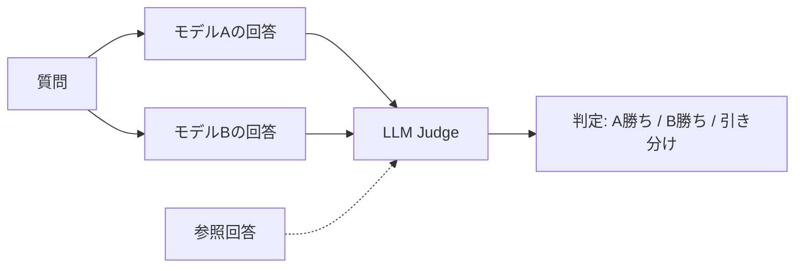

本記事は [Judging LLM-as-a-Judge with MT-Bench and Chatbot Arena](https://arxiv.org/abs/2306.05685) の解説記事です。

## 論文概要（Abstract）

LLMの評価は、人手アノテーションのコストとスケーラビリティの制約から自動化が求められている。本論文は「LLM-as-a-Judge」——LLM自身を評価者として用いる手法——の妥当性を体系的に検証した研究である。著者らは80のマルチターン質問からなるMT-Benchと、クラウドソーシングによるペアワイズ比較プラットフォームChatbot Arenaを提案し、GPT-4ジャッジが人間の専門家評価と80%以上の一致率を示すことを報告している。同時に、位置バイアス・冗長性バイアス・自己強化バイアスの3種の系統的偏りを定量的に分析し、その軽減策を示した。

この記事は [Zenn記事: Bedrock AgentCoreエピソード記憶の本番運用設計と応答品質の定量評価](https://zenn.dev/0h_n0/articles/b6f2b1dfabb12c) の深掘りです。

## 情報源

- **arXiv ID**: 2306.05685
- **URL**: [https://arxiv.org/abs/2306.05685](https://arxiv.org/abs/2306.05685)
- **著者**: Lianmin Zheng, Wei-Lin Chiang, Ying Sheng, Siyuan Zhuang, Zhanghao Wu, Yonghao Zhuang, Zi Lin, Zhuohan Li, Dang Nguyen, Eric P. Xing, Hao Zhang, Joseph E. Gonzalez, Ion Stoica
- **所属**: UC Berkeley, CMU, UCSD
- **発表年**: 2023年（NeurIPS 2023採択）
- **分野**: cs.CL

## 背景と動機（Background & Motivation）

従来のLLM評価は、MMLUやHellaSwagなどの選択式ベンチマークが主流であった。しかしこれらは「特定知識の有無」を測定するのみで、対話品質・創造性・指示追従能力などのオープンエンドな能力を評価できない。

人手評価はゴールドスタンダードだが、1件あたりのアノテーションコストが高く、評価者間の一致率（inter-annotator agreement）にもばらつきがある。著者らは、強力なLLM（GPT-4）を評価者として使う「LLM-as-a-Judge」のアプローチが、コスト効率と一致率の両面で人手評価に匹敵できるかを検証する、という問いに取り組んだ。

この問いは、Zenn記事で解説したLLM-as-Judgeによる応答品質評価フレームワークの理論的基盤でもある。AgentCore Memoryの有効性を定量評価するためにLLM-as-Judgeを使う際、その手法自体の信頼性を理解しておくことが不可欠である。

## 主要な貢献（Key Contributions）

- **MT-Bench**: 8カテゴリ（Writing, Roleplay, Reasoning, Math, Coding, Extraction, STEM, Humanities）にまたがる80のマルチターン質問セットを設計し、対話能力を多面的に評価するベンチマークを確立した
- **Chatbot Arena**: ランダムに選ばれた2つのモデルの回答をユーザーが比較するクラウドソーシングプラットフォームを構築し、ELOレーティングによるモデルランキングを実現した
- **バイアスの体系的分析**: LLM-as-Judgeに固有の3種のバイアスを同定・定量化し、各バイアスの軽減策を提示した
- **人手評価との高い一致率**: GPT-4ジャッジが3,000件以上の専門家アノテーションと80%以上の一致率を示すことを検証した

## 技術的詳細（Technical Details）

### 評価形式の分類

著者らは3つの評価形式を定義し、それぞれの特性を比較している。

| 評価形式 | 入力 | 出力 | 適用場面 |
|---------|------|------|---------|
| **Pairwise comparison** | 2つのモデルの回答 | A勝ち/B勝ち/引き分け | モデル間比較 |
| **Single answer grading** | 1つの回答 | 1-10のスコア | 絶対評価 |
| **Reference-guided grading** | 回答 + 参照回答 | 1-10のスコア | 数学・推論問題 |



### バイアスの定量分析

著者らが同定した3種のバイアスとその影響度を以下に整理する。

**1. 位置バイアス（Position Bias）**

Pairwise comparisonにおいて、先に提示された回答を好む傾向。著者らの実験では、回答の提示順を入れ替えると判定が変わるケースが一定割合で観測されている。

$$
\text{PositionBias} = |P(\text{A wins} \mid \text{A first}) - P(\text{A wins} \mid \text{A second})|
$$

**軽減策**: 提示順を入れ替えて2回評価し、判定が一致する場合のみ採用する（一致しない場合は引き分けとする）。

**2. 冗長性バイアス（Verbosity Bias）**

内容の質に関係なく、より長い回答を高く評価する傾向。

**軽減策**: 評価プロンプトに「回答の長さではなく内容の質を評価せよ」と明示的に指示する。ただし完全な除去は困難であると著者らは認めている。

**3. 自己強化バイアス（Self-Enhancement Bias）**

ジャッジモデルと同じモデルが生成した回答を過大評価する傾向。たとえばGPT-4がジャッジの場合、GPT-4が生成した回答を高く評価しやすい。

$$
\text{SelfEnhancement} = \mathbb{E}[\text{Score}(M_{\text{judge}}, R_{M_{\text{judge}}})] - \mathbb{E}[\text{Score}(M_{\text{judge}}, R_{M_{\text{other}}})]
$$

ここで$M_{\text{judge}}$はジャッジモデル、$R_{M}$はモデル$M$が生成した回答である。

**軽減策**: 評価対象モデルとは異なるモデルをジャッジに使う。Zenn記事のLLM-as-Judge実装で評価モデルにClaude Sonnet 4.6を使う設計判断はこのバイアスの軽減に寄与する。

### MT-Benchの設計

80のマルチターン質問は、以下の設計原則に基づいて構築されている。

1. **マルチターン必須**: 各質問は2ターン構成。1ターン目で応答し、2ターン目で「1ターン目の回答を修正/拡張/制約」する指示を与える。これにより指示追従能力と文脈理解力を同時に評価する
2. **カテゴリの多様性**: 8カテゴリを均等に配分（各10問）し、モデルの能力を多面的に測定する
3. **客観的参照の提供**: Math・Codingカテゴリには参照回答を用意し、Reference-guided gradingを可能にする

### ELOレーティングシステム

Chatbot ArenaではELOレーティングを用いてモデルをランキングする。対戦結果からの更新式は以下の通りである。

$$
E_A = \frac{1}{1 + 10^{(R_B - R_A)/400}}
$$

$$
R_A' = R_A + K(S_A - E_A)
$$

ここで、$R_A$はモデルAの現在のレーティング、$E_A$はモデルAの期待勝率、$S_A$は実際の結果（勝ち=1, 負け=0, 引き分け=0.5）、$K$は更新係数である。

## 実装のポイント（Implementation）

LLM-as-Judgeを実装する際の著者らの知見を整理する。

- **温度0の使用**: 評価の再現性を確保するため、ジャッジLLMの温度パラメータは0に設定する。Zenn記事の`temperature: 0.0`設定はこの知見に基づいている
- **few-shotプロンプト**: 位置バイアスの軽減に有効。具体的な評価例を2-3件プロンプトに含めることで、ジャッジの判定基準を安定させる
- **構造化出力**: JSON形式での出力を要求し、スコアと理由を分離する。パース失敗時のリトライロジックも必要
- **Reference-guidedモードの活用**: 数学・推論・コード生成など客観的な正解が存在するタスクでは、参照回答を提供することで評価精度が向上する

```python
import json
import boto3


JUDGE_PROMPT = """あなたは公正な評価者です。以下の質問に対する回答を1-10のスコアで評価してください。

## 評価基準
- 正確性: 事実として正しいか
- 完全性: 質問に十分に答えているか
- 明瞭性: わかりやすく構造化されているか

## 質問
{question}

## 回答
{answer}

## 参照回答（ある場合）
{reference}

## 出力形式（JSON）
{{"score": <1-10>, "reasoning": "<評価理由>"}}
"""


def judge_response(
    question: str,
    answer: str,
    reference: str = "なし",
    model_id: str = "anthropic.claude-sonnet-4-6",
) -> dict:
    """LLM-as-Judgeで回答を評価する。"""
    bedrock = boto3.client("bedrock-runtime")

    prompt = JUDGE_PROMPT.format(
        question=question,
        answer=answer,
        reference=reference,
    )

    response = bedrock.converse(
        modelId=model_id,
        messages=[{"role": "user", "content": [{"text": prompt}]}],
        inferenceConfig={"maxTokens": 512, "temperature": 0.0},
    )

    result_text = response["output"]["message"]["content"][0]["text"]
    return json.loads(result_text)
```

## 実験結果（Results）

### 人手評価との一致率

著者らは3,000件以上の専門家アノテーションを収集し、LLM-as-Judgeとの一致率を測定している。

| ジャッジモデル | 一致率 | 位置バイアス |
|-------------|-------|------------|
| GPT-4 | >80% | 中程度（入れ替えで軽減可） |
| Claude (当時) | ~75% | 比較的低い |
| GPT-3.5 Turbo | ~65% | 高い |

著者らの分析によると、GPT-4ジャッジの一致率は「専門家評価者間の一致率」と同程度であった。つまり、LLM-as-Judgeの精度は人間の評価者のばらつきの範囲内に収まっている。

### MT-Benchスコアの分布

MT-Benchでのモデル評価では、Writing・Roleplayなどの創造的タスクでは多くのモデルが高スコアを示す一方、Math・Codingでは大きなスコア差が生じることが報告されている。マルチターンの2ターン目（指示修正）では、1ターン目よりもスコアが低下する傾向が確認されている。

### Chatbot ArenaのELOレーティング

Chatbot Arenaの投票データ分析により、ELOレーティングとMT-Benchスコアの間に高い相関が確認されている。ただし、一部のモデル（特にオープンソースモデル）ではMT-Benchスコアが過大評価される傾向があり、これはMT-Benchの質問セットへの過学習の可能性を著者らは指摘している。

## 実運用への応用（Practical Applications）

Zenn記事で解説したAgentCore Memoryの応答品質評価において、本論文の知見は以下のように活用できる。

**評価パイプラインの設計**:
- メモリあり/なしのA/Bテストには**Pairwise comparison**形式が適している。同一質問に対する2つの回答（メモリ参照あり vs なし）をLLMジャッジが比較する
- 応答の事実整合性チェックには**Reference-guided grading**が有効。期待される回答（製品仕様など）を参照として提供する

**バイアスへの対処**:
- Zenn記事の実装でジャッジモデルに本番エージェントと異なるモデル（Claude Sonnet 4.6）を使う設計は、自己強化バイアスの軽減に寄与する
- 温度0の設定は評価の再現性を確保する基本設定として必須である

**評価指標の選択**:
- τ2-benchのようなルールベース評価（エンド状態の正誤判定）は客観性が高いが、対話品質は測定できない
- LLM-as-Judgeは対話品質を含む多面的評価が可能だが、上述のバイアスを考慮した設計が必要

## 関連研究（Related Work）

- **ChatEval (Chan et al., 2023)**: 複数のLLMエージェントによる議論を通じて評価精度を向上させるフレームワーク。LLM-as-Judgeの発展形として位置づけられるが、LLM呼び出し回数が増大するコスト面の課題がある
- **ACL 2025: LLM-as-a-Judgeの実証研究**: ファインチューンされたジャッジモデルは、ドメイン内では高い精度を示すものの、GPT-4のような汎用性・公平性・適応力には及ばないと報告されている（ACL 2025 Findings）
- **EMNLP 2024: 人間 vs LLMジャッジのバイアス研究**: 人間の評価者もLLMジャッジと同様の摂動に対する脆弱性を持つことが示され、LLM-as-Judgeの限界は「評価という行為自体の本質的困難さ」に起因する面があると指摘されている

## まとめと今後の展望

本論文はLLM-as-a-Judgeの体系的検証を通じて、自動評価手法の信頼性と限界を明確にした。GPT-4ジャッジが人間の専門家と80%以上の一致率を示すという結果は、エージェントの応答品質を継続的にモニタリングする実用的な基盤を提供する。

一方で、著者らが同定した3種のバイアスは、評価パイプライン設計時に常に考慮すべき制約である。Bedrock AgentCore Memoryの評価において、LLM-as-Judgeを採用する際は、位置バイアスの軽減（提示順入れ替え）、ジャッジモデルの分離（自己強化バイアス対策）、温度0設定（再現性確保）を組み合わせた設計が推奨される。

## 参考文献

- **arXiv**: [https://arxiv.org/abs/2306.05685](https://arxiv.org/abs/2306.05685)
- **Code**: [https://github.com/lm-sys/FastChat](https://github.com/lm-sys/FastChat)（MT-Bench実装含む）
- **Chatbot Arena**: [https://lmarena.ai/](https://lmarena.ai/)
- **Related Zenn article**: [https://zenn.dev/0h_n0/articles/b6f2b1dfabb12c](https://zenn.dev/0h_n0/articles/b6f2b1dfabb12c)
