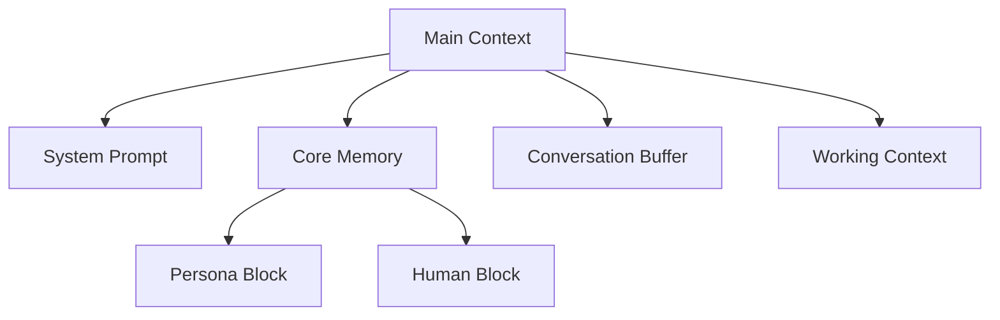

本記事は [MemGPT: Towards LLMs as Operating Systems](https://arxiv.org/abs/2310.08560) の解説記事です。

## 論文概要（Abstract）

LLMの固定長コンテキストウィンドウは、長期対話やドキュメント分析において深刻な制約となる。MemGPTは、OSの仮想メモリ管理に着想を得た「仮想コンテキスト管理（Virtual Context Management, VCM）」を提案した論文である。LLM自身がメモリ操作のための関数呼び出しを自律的に実行し、コンテキストウィンドウ（RAM相当）と外部ストレージ（ディスク相当）の間で情報をページングすることで、事実上無限のコンテキスト長を実現する。

この記事は [Zenn記事: Bedrock AgentCoreエピソード記憶の本番運用設計と応答品質の定量評価](https://zenn.dev/0h_n0/articles/b6f2b1dfabb12c) の深掘りです。

## 情報源

- **arXiv ID**: 2310.08560
- **URL**: [https://arxiv.org/abs/2310.08560](https://arxiv.org/abs/2310.08560)
- **著者**: Charles Packer, Sarah Wooders, Kevin Lin, Vivian Fang, Shishir G. Patil, Ion Stoica, Joseph E. Gonzalez
- **所属**: UC Berkeley
- **発表年**: 2023年（初版2023年10月、改訂版2024年2月）
- **分野**: cs.AI

## 背景と動機（Background & Motivation）

2023年時点のLLMは、GPT-4の32Kトークン、Claude 2の100Kトークンなど、コンテキストウィンドウに上限がある。この制約により、長期にわたる会話でのユーザー情報の保持や、大規模ドキュメントの横断的分析が困難になる。

従来のアプローチであるRAG（Retrieval-Augmented Generation）は、外部検索でコンテキストを補強するが、「何を検索するか」の判断はアプリケーション側に委ねられていた。著者らは、この制御をLLM自身に委譲することで、より柔軟で自律的なメモリ管理が可能になると主張している。

OSの仮想メモリ管理は、物理RAMの制約を仮想アドレス空間とページングで抽象化し、プログラムに「無限のメモリ」を提供する。著者らはこの比喩をLLMに適用し、コンテキストウィンドウをRAM、外部ストレージをディスクとして扱うアーキテクチャを設計した。

## 主要な貢献（Key Contributions）

- **仮想コンテキスト管理（VCM）の提案**: LLMのコンテキスト制約をOSの仮想メモリ管理の枠組みで解決する新しいパラダイムを定義した
- **自律的メモリ操作**: LLMがfunction callを通じて自分自身のコンテキスト内容を制御する仕組みを実装した。メモリの読み書き判断をLLM自身が行う点が、従来のRAGとの本質的な違いである
- **階層的メモリアーキテクチャ**: Main Context（即時アクセス）、Recall Storage（会話履歴検索）、Archival Storage（長期ベクトル検索）の3層構造を設計し、アクセス速度とストレージ容量のトレードオフを明示的に管理した

## 技術的詳細（Technical Details）

### メモリ階層アーキテクチャ

著者らが提案するメモリ階層は、OSのメモリ管理と以下のように対応する。

| OS概念 | MemGPT対応 | 役割 |
|--------|-----------|------|
| レジスタ | System Prompt | 固定の指示（変更不可） |
| RAM | Main Context | LLMが直接参照できるコンテキスト |
| ディスクキャッシュ | Recall Storage | 全会話履歴（BM25/ベクトル検索） |
| ディスク | Archival Storage | 長期知識（ベクトル検索） |

Main Contextの内部構造は以下の通りである。



**Core Memory**はLLMが直接編集可能な構造化メモリで、`Persona Block`（エージェント自身の定義）と`Human Block`（ユーザーに関する記憶）の2ブロックで構成される。会話を通じてLLM自身がこのブロックを更新することで、セッションをまたいだ一貫性を維持する。

### メモリ操作インターフェース

著者らはLLMが自律的にメモリを操作するためのfunction callインターフェースを定義している。

```python
class MemGPTFunctions:
    """MemGPTのメモリ操作関数群。LLMがfunction callで呼び出す。"""

    def core_memory_append(self, field: str, content: str) -> str:
        """Core Memoryの指定フィールドに情報を追記する。

        Args:
            field: "persona" または "human"
            content: 追記する情報（自然言語）
        """
        ...

    def core_memory_replace(self, field: str, old: str, new: str) -> str:
        """Core Memoryの既存情報を置換する。

        Args:
            field: 対象フィールド
            old: 置換前の文字列
            new: 置換後の文字列
        """
        ...

    def recall_memory_search(self, query: str, page: int = 0) -> list[dict]:
        """過去の会話履歴を検索する。ページネーション付き。

        Args:
            query: 検索クエリ
            page: ページ番号（0始まり）
        """
        ...

    def archival_memory_insert(self, content: str) -> str:
        """長期ストレージに情報を書き込む。"""
        ...

    def archival_memory_search(self, query: str, page: int = 0) -> list[dict]:
        """長期ストレージをベクトル検索する。"""
        ...

    def send_message(self, message: str) -> None:
        """ユーザーに可視メッセージを送信する。唯一のユーザー可視出力。"""
        ...
```

LLMは各ターンで「内部独白（inner monologue）」を生成した後、上記関数を呼び出す。ユーザーには`send_message`の出力のみが見え、メモリ操作は透過的に実行される。

### コンテキスト管理アルゴリズム

コンテキストウィンドウが上限に近づくと、以下のページングアルゴリズムが実行される。

$$
\text{used}(C) = |C_{\text{system}}| + |C_{\text{core}}| + |C_{\text{buffer}}| + |C_{\text{working}}|
$$

ここで、$C$はMain Context全体、各項はSystem Prompt、Core Memory、Conversation Buffer、Working Contextのトークン数である。

$$
\text{if } \text{used}(C) > \alpha \cdot C_{\max}: \text{evict}(C_{\text{buffer}})
$$

閾値$\alpha$（論文では0.9前後）を超えると、Conversation Bufferの古いメッセージがRecall Storageに退避される。退避時にはRecursive Summarization（再帰的要約）が適用され、直近$k$ターンの会話を要約してWorking Contextに圧縮コピーを残す。

この方式の利点は、退避された情報が完全に失われるわけではなく、`recall_memory_search`で随時取得可能な点にある。

### 割り込みモデル

OSのハードウェア割り込みに相当する機構として、著者らは以下のイベントを定義している。

1. **ユーザーメッセージ割り込み**: ユーザーの入力でLLMの処理ループが起動
2. **コンテキスト上限割り込み**: `used(C) > α·C_max`でページングを強制
3. **ハートビート割り込み**: 一定間隔でLLMにメモリ整理の機会を提供

ハートビート割り込みは、ユーザーの入力がない間にもLLMがバックグラウンドでメモリの整理や統合を行えるようにする仕組みである。

## 実装のポイント（Implementation）

論文の実装をもとに、著者らのリポジトリ（[GitHub](https://github.com/cpacker/MemGPT)、現在は[Letta](https://github.com/letta-ai/letta)にリブランド）から読み取れる設計上の注意点を整理する。

- **Core Memoryのサイズ制限**: PersonaブロックとHumanブロックにはそれぞれトークン上限（デフォルト2000トークン）が設定される。上限を超える場合はArchival Storageへの書き出しが必要
- **Recall StorageのインデックスU**: 全会話履歴を保持するため、BM25とベクトル検索のハイブリッドインデックスが推奨される。論文ではembedding + コサイン類似度を使用
- **内部独白のコスト**: 各ターンでLLMが内部独白を生成するため、`send_message`を含まないターンでもトークンが消費される。著者らはこのオーバーヘッドを「OSカーネルのCPU使用率」に比喩している
- **モデル依存性**: function callingの精度はモデル能力に依存する。論文ではGPT-4が最も安定した結果を示し、小規模モデルでは不適切なメモリ操作（必要な情報の早期退避等）が発生すると報告されている

## Production Deployment Guide

### AWS実装パターン（コスト最適化重視）

MemGPT型のメモリ管理エージェントをAWS上に構築する場合の推奨構成を示す。

**トラフィック量別の推奨構成**:

| 規模 | 月間リクエスト | 推奨構成 | 月額コスト | 主要サービス |
|------|--------------|---------|-----------|------------|
| **Small** | ~3,000 (100/日) | Serverless | $80-200 | Lambda + Bedrock + DynamoDB + OpenSearch Serverless |
| **Medium** | ~30,000 (1,000/日) | Hybrid | $500-1,200 | ECS Fargate + Bedrock + ElastiCache + OpenSearch |
| **Large** | 300,000+ (10,000/日) | Container | $3,000-8,000 | EKS + Bedrock + ElastiCache + OpenSearch Managed |

**Small構成の詳細** (月額$80-200):
- **Lambda**: 1GB RAM, 60秒タイムアウト（内部独白ループ対応）($30/月)
- **Bedrock**: Claude Haiku 4.5（内部独白用）+ Claude Sonnet 4.6（回答生成用）($100/月)
- **DynamoDB**: Core Memory・会話メタデータ保存, On-Demand ($10/月)
- **OpenSearch Serverless**: Archival Storage（ベクトル検索）($30/月)
- **CloudWatch**: 基本監視 ($5/月)

**コスト試算の注意事項**:
- 上記は2026年4月時点のAWS ap-northeast-1（東京）リージョン料金に基づく概算値
- MemGPTは1ターンあたり複数のLLM呼び出しを行うため、通常のチャットアプリよりBedrock推論コストが高くなる
- 最新料金は [AWS料金計算ツール](https://calculator.aws/) で確認のこと

### Terraformインフラコード

**Small構成 (Serverless): Lambda + Bedrock + DynamoDB + OpenSearch Serverless**

```hcl
module "vpc" {
  source  = "terraform-aws-modules/vpc/aws"
  version = "~> 5.0"

  name = "memgpt-vpc"
  cidr = "10.0.0.0/16"
  azs  = ["ap-northeast-1a", "ap-northeast-1c"]
  private_subnets = ["10.0.1.0/24", "10.0.2.0/24"]

  enable_nat_gateway   = false
  enable_dns_hostnames = true
}

resource "aws_iam_role" "lambda_memgpt" {
  name = "lambda-memgpt-role"

  assume_role_policy = jsonencode({
    Version = "2012-10-17"
    Statement = [{
      Action    = "sts:AssumeRole"
      Effect    = "Allow"
      Principal = { Service = "lambda.amazonaws.com" }
    }]
  })
}

resource "aws_iam_role_policy" "bedrock_invoke" {
  role = aws_iam_role.lambda_memgpt.id

  policy = jsonencode({
    Version = "2012-10-17"
    Statement = [{
      Effect   = "Allow"
      Action   = ["bedrock:InvokeModel", "bedrock:InvokeModelWithResponseStream"]
      Resource = "arn:aws:bedrock:ap-northeast-1::foundation-model/anthropic.*"
    }]
  })
}

resource "aws_lambda_function" "memgpt_handler" {
  filename      = "lambda.zip"
  function_name = "memgpt-agent-handler"
  role          = aws_iam_role.lambda_memgpt.arn
  handler       = "index.handler"
  runtime       = "python3.12"
  timeout       = 120
  memory_size   = 1024

  environment {
    variables = {
      BEDROCK_MODEL_INNER  = "anthropic.claude-haiku-4-5-20251001"
      BEDROCK_MODEL_OUTER  = "anthropic.claude-sonnet-4-6"
      DYNAMODB_TABLE       = aws_dynamodb_table.core_memory.name
      OPENSEARCH_ENDPOINT  = aws_opensearchserverless_collection.archival.collection_endpoint
    }
  }
}

resource "aws_dynamodb_table" "core_memory" {
  name         = "memgpt-core-memory"
  billing_mode = "PAY_PER_REQUEST"
  hash_key     = "agent_id"
  range_key    = "block_type"

  attribute {
    name = "agent_id"
    type = "S"
  }

  attribute {
    name = "block_type"
    type = "S"
  }

  ttl {
    attribute_name = "expire_at"
    enabled        = true
  }
}

resource "aws_opensearchserverless_collection" "archival" {
  name = "memgpt-archival"
  type = "VECTORSEARCH"
}

resource "aws_cloudwatch_metric_alarm" "lambda_duration" {
  alarm_name          = "memgpt-lambda-duration"
  comparison_operator = "GreaterThanThreshold"
  evaluation_periods  = 2
  metric_name         = "Duration"
  namespace           = "AWS/Lambda"
  period              = 300
  statistic           = "Average"
  threshold           = 60000
  alarm_description   = "MemGPT内部独白ループの実行時間異常"

  dimensions = {
    FunctionName = aws_lambda_function.memgpt_handler.function_name
  }
}
```

### 運用・監視設定

**CloudWatch Logs Insights クエリ**:
```sql
fields @timestamp, agent_id, function_name, duration_ms
| filter function_name in ["recall_memory_search", "archival_memory_search"]
| stats avg(duration_ms) as avg_latency, pct(duration_ms, 95) as p95 by bin(5m)
| filter p95 > 2000
```

**内部独白ループ回数の監視**:
```python
import boto3

cloudwatch = boto3.client("cloudwatch")

cloudwatch.put_metric_alarm(
    AlarmName="memgpt-inner-loop-excess",
    ComparisonOperator="GreaterThanThreshold",
    EvaluationPeriods=1,
    MetricName="InnerMonologueSteps",
    Namespace="MemGPT/Agent",
    Period=3600,
    Statistic="Average",
    Threshold=10,
    AlarmDescription="1ターンあたりの内部独白ステップ数が過多（コスト急増の兆候）",
)
```

### コスト最適化チェックリスト

**アーキテクチャ選択**:
- [ ] ~100 req/日 → Lambda + Bedrock (Serverless) - $80-200/月
- [ ] ~1,000 req/日 → ECS Fargate + Bedrock (Hybrid) - $500-1,200/月
- [ ] 10,000+ req/日 → EKS + Bedrock (Container) - $3,000-8,000/月

**LLMコスト削減（MemGPT固有）**:
- [ ] 内部独白にはHaikuモデルを使用し、最終回答のみSonnetを使用（2層モデル戦略）
- [ ] 内部独白のmax_tokensを制限（256-512トークン）して冗長な自己対話を抑制
- [ ] Prompt Caching有効化（System Prompt + Core Memoryはキャッシュ対象）
- [ ] 不要なハートビート割り込みの間隔を延長（コスト vs 記憶鮮度のトレードオフ）

**メモリストレージ最適化**:
- [ ] DynamoDB: Core Memoryのみ保存（高頻度アクセス、低容量）
- [ ] OpenSearch Serverless: Archival Storageに使用（低頻度、大容量）
- [ ] Recall Storage: S3 + Athenaでコスト削減（バッチ検索が許容される場合）
- [ ] Core Memoryのブロックサイズ上限を調整（デフォルト2000トークン→用途に応じて削減）

**監視・アラート**:
- [ ] 1ターンあたりの内部独白ステップ数を監視（10回超で警告）
- [ ] function call失敗率を監視（メモリ操作エラーの検知）
- [ ] AWS Budgets: 月額予算設定（MemGPTはLLM呼び出し回数が多いため要注意）
- [ ] Bedrock トークン使用量の日次レポート

## 実験結果（Results）

著者らは2つのタスクでMemGPTを評価している。

**タスク1: 長文書QA**

GPT-4の32Kコンテキストウィンドウを超えるドキュメント（100K+トークン）に対するQAタスクで評価した。Fixed-context GPT-4（全文をコンテキストに入れられない）と比較し、MemGPTは検索によるページングで文書後半の情報にもアクセス可能であった。ただし、全文がコンテキストに収まるケースでは、ページングの検索精度限界により、Fixed-context GPT-4の方が高精度となる場合もあったと報告されている。

**タスク2: マルチセッション会話**

複数セッションにわたるペルソナ一貫性と事実記憶の維持を評価した。Standard LLM（セッション間記憶なし）と比較し、MemGPTはユーザーが前セッションで述べた情報を正確に参照できた。人手評価ではMemGPTがペルソナ一貫性・記憶精度の両面で優位と判定されている。

**制約事項**: 上記の結果はGPT-4ベースでの評価であり、小規模モデルでは内部独白の品質低下により、メモリ操作の精度が大幅に劣化すると著者らは報告している。

## 実運用への応用（Practical Applications）

Zenn記事で解説したBedrock AgentCore Memoryとの比較において、MemGPTのアーキテクチャは以下の点で関連する。

**設計思想の共通点**:
- 階層的メモリ（MemGPTの3層 ≒ AgentCoreの短期/長期メモリ）
- LLMによる自律的メモリ操作（MemGPTのfunction call ≒ AgentCoreのビルトイン戦略）
- セッション横断的な情報保持

**AgentCoreとの差異**:
- MemGPTはLLM自身がメモリ管理を制御するのに対し、AgentCoreはバックグラウンドパイプライン（Extraction→Consolidation→Reflection）が非同期で処理する
- MemGPTはCore Memoryの直接編集が可能だが、AgentCoreは戦略ごとに自動抽出されたレコードとして管理される
- コスト面では、MemGPTの内部独白ループはLLM呼び出し回数を増加させるのに対し、AgentCoreの抽出パイプラインコストはサービス料金に含まれる（ビルトイン戦略の場合）

## 関連研究（Related Work）

- **Generative Agents (Park et al., 2023)**: 記憶ストリーム＋反省＋計画の3層アーキテクチャで25体のエージェントが自律的にソーシャルインタラクションを実行した。MemGPTと比較して、メモリ検索にrecency・importance・relevanceの3スコアを使う点が異なる
- **HippoRAG (Yu et al., 2024)**: 海馬索引理論に基づくエピソード記憶型RAG。MemGPTが汎用的なメモリ管理を提供するのに対し、HippoRAGはマルチホップ推論に特化した知識グラフベースの検索を提供する
- **CoALA (Sumers et al., 2023)**: 認知科学のACT-R/SOARを参考に、言語エージェントのメモリを作業記憶・エピソード記憶・意味記憶・手続き記憶に分類するフレームワーク。MemGPTのメモリ階層はこの分類におけるエピソード記憶と意味記憶の実装例として位置づけられる

## まとめと今後の展望

MemGPTは、LLMのコンテキスト制約をOSの仮想メモリ管理で解決するという明確なメタファーを提示した。著者らが示した階層的メモリ＋自律的ページングの設計パターンは、Bedrock AgentCore Memoryをはじめとする後続のエージェントメモリシステムに影響を与えている。

一方で、著者ら自身が認めるように、LLMは非決定論的でありOSカーネルほど信頼性が高くない。メモリ操作の判断ミス（重要な情報の早期退避、不要な情報の保持）は本質的にLLMの推論能力に依存する制約であり、Bedrock AgentCoreのようなバックグラウンドパイプライン方式はこのリスクを軽減する設計選択として理解できる。

## 参考文献

- **arXiv**: [https://arxiv.org/abs/2310.08560](https://arxiv.org/abs/2310.08560)
- **Code**: [https://github.com/cpacker/MemGPT](https://github.com/cpacker/MemGPT)（現在は[Letta](https://github.com/letta-ai/letta)にリブランド）
- **Related Zenn article**: [https://zenn.dev/0h_n0/articles/b6f2b1dfabb12c](https://zenn.dev/0h_n0/articles/b6f2b1dfabb12c)
