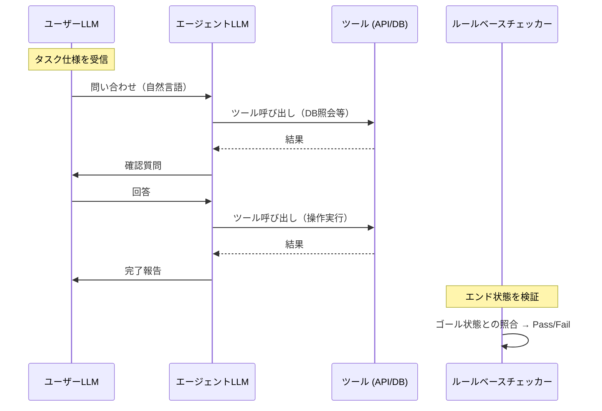

本記事は [τ-bench: A Benchmark for Tool-Agent-User Interaction in Real-World Domains](https://arxiv.org/abs/2406.12045) の解説記事です。

## 論文概要（Abstract）

既存のLLMエージェントベンチマークは、ツール使用を孤立した環境で評価するか、静的な入出力ペアで測定するため、現実世界の動的なエージェント-ユーザー間インタラクションを捉えられない。τ-bench（Tool-Agent-User benchmark）は、LLMエージェントがツール（データベースクエリ、API呼び出し）を使用しながら、シミュレーションされたユーザーLLMと対話してタスクを完遂する新しい評価パラダイムを導入した。著者らは小売（Retail）と航空（Airline）の2ドメインで評価を行い、GPT-4ベースのエージェントでも成功率が30-50%にとどまること、また複数試行間の再現性が低いことを報告している。

この記事は [Zenn記事: Bedrock AgentCoreエピソード記憶の本番運用設計と応答品質の定量評価](https://zenn.dev/0h_n0/articles/b6f2b1dfabb12c) の深掘りです。

## 情報源

- **arXiv ID**: 2406.12045
- **URL**: [https://arxiv.org/abs/2406.12045](https://arxiv.org/abs/2406.12045)
- **著者**: Shunyu Yao, Noah Shinn, Pedram Razavi, Karthik Narasimhan
- **所属**: Princeton University, Cognition AI
- **発表年**: 2024年6月
- **分野**: cs.AI, cs.CL
- **コード**: [https://github.com/sierra-research/tau-bench](https://github.com/sierra-research/tau-bench)（MIT License）

## 背景と動機（Background & Motivation）

LLMエージェントの評価は、現実世界の複雑さをどこまで再現できるかに依存する。従来のベンチマーク（HotpotQA、WebShop等）は、エージェントが静的な環境と対話する設定であり、以下の限界がある。

1. **ユーザーとの動的対話がない**: 実環境ではエージェントがユーザーに質問を返し、曖昧さを解消する必要がある
2. **ツール使用と対話の同時性がない**: 実環境ではデータベースの照会結果に基づいてユーザーに確認を取るなど、ツール操作と対話が交互に発生する
3. **信頼性の測定がない**: 同じタスクを複数回実行した際の成功率のばらつきが評価されない

著者らは、エージェントの実用性を正確に評価するには「ツール-エージェント-ユーザー」の三者間インタラクションを模倣する評価環境が必要であると主張している。

Zenn記事で解説したτ2-benchのベンチマーク結果（Pass¹ +11.4%改善）は、本論文のτ-benchを拡張したバージョンであり、エピソード記憶の有効性をこの三者間インタラクション設定で測定している。

## 主要な貢献（Key Contributions）

- **三者間インタラクションの形式化**: ツール（API/DB）、エージェント（LLM）、ユーザー（シミュレーションLLM）の三者が動的にインタラクションする評価パラダイムを定義した
- **ルールベースのpass@k評価**: LLM-as-Judgeに依存しない、エンド状態の正誤をルールベースで判定する客観的評価指標を設計した
- **2ドメインのシミュレーション環境**: Retail（ECサイト）とAirline（航空予約）の完全な業務環境（DB、API、ポリシー文書）を構築した
- **既存SoTAの限界暴露**: GPT-4ベースのエージェントでも成功率が30-50%にとどまり、試行間の再現性が低いことを実証した

## 技術的詳細（Technical Details）

### 評価パイプライン



### ドメイン設計

**Retailドメイン**: ECサイトの顧客対応を模倣する。

| 要素 | 内容 |
|------|------|
| DB | 顧客テーブル、注文テーブル、商品テーブル |
| API | 注文キャンセル、返品処理、クーポン適用、住所変更 |
| ポリシー | 返品期限（30日）、クーポン重複禁止、会員ランク別対応 |
| タスク例 | 「注文#1234をキャンセルして返金してほしい」 |

**Airlineドメイン**: 航空予約の変更・キャンセルを模倣する。

| 要素 | 内容 |
|------|------|
| DB | 旅客テーブル、予約テーブル、フライトテーブル |
| API | フライト変更、座席アップグレード、マイル適用、予約キャンセル |
| ポリシー | 変更手数料（クラス別）、キャンセル締め切り、マイル換算率 |
| タスク例 | 「フライトを翌日に変更して、差額をマイルで支払いたい」 |

Airlineドメインの方が難易度が高い。ポリシーが複雑で（複数条件の組み合わせ判断）、エージェントが正確にルールを参照・適用する必要がある。

### pass@kメトリクス

τ-benchの評価指標であるpass@kは、$k$回の独立した試行のうち少なくとも1回成功する確率を測定する。

$$
\text{pass@}k = 1 - \prod_{i=1}^{k}(1 - p_i)
$$

ここで$p_i$は$i$回目の試行の成功確率である。各試行が独立であると仮定すると以下の近似が成り立つ。

$$
\text{pass@}k \approx 1 - (1 - p)^k
$$

ここで$p$は単一試行の成功率（pass@1）である。

pass@1とpass@kの乖離が大きいほど、エージェントの信頼性が低いことを示す。つまり「たまたま成功する」が「安定して成功する」わけではないことを意味する。

**ルールベース判定の利点**: LLM-as-Judgeは評価自体にバイアスが入る（前述のLLM-as-Judge論文を参照）。τ-benchでは、タスク完了後のDB状態（エンド状態）がゴール状態と完全に一致するかをルールベースで判定する。これにより評価の再現性を100%にしている。

### ユーザーシミュレーターの設計

ユーザーLLMは、事前に定義された「タスク仕様」に基づいて自然言語で応答する。

```python
USER_INSTRUCTION_TEMPLATE = """あなたは{domain}の顧客です。
以下のタスクを達成するためにエージェントと対話してください。

## あなたの状況
{user_context}

## 達成したいこと
{task_goal}

## 制約
- エージェントが聞いてきた情報のみ答えてください
- 自分から余計な情報を提供しないでください
- 実際の顧客のように自然に応答してください
"""
```

この設計により、エージェントが必要な情報を能動的に収集する能力（情報収集の主導性）も評価対象となる。ユーザーが全情報を最初に提供する設定では測定できない重要な能力である。

## 実装のポイント（Implementation）

- **環境の再現性**: DB状態は各タスク開始時にリセットされるため、試行間で独立した評価が可能。ただし、ユーザーLLMの応答は非決定論的であるため、完全な再現性は保証されない
- **タスク難易度の制御**: ツール呼び出し回数、ポリシー条件の数、ユーザー応答の曖昧さを組み合わせて段階的に難易度を設定している
- **エラー分析の自動化**: 失敗タスクを「ポリシー違反」「情報収集不足」「ツール呼び出しエラー」「対話の断絶」に自動分類するスクリプトが提供されている

```python
from dataclasses import dataclass


@dataclass
class TaskResult:
    """τ-benchのタスク実行結果。"""

    task_id: str
    domain: str  # "retail" or "airline"
    passed: bool
    num_tool_calls: int
    num_user_turns: int
    error_category: str | None  # "policy_violation", "info_gap", "tool_error", "dialogue_break"
    end_state: dict
    goal_state: dict


def evaluate_end_state(result: TaskResult) -> bool:
    """ルールベースでエンド状態を検証する。"""
    for key, expected in result.goal_state.items():
        actual = result.end_state.get(key)
        if actual != expected:
            return False
    return True
```

## 実験結果（Results）

### モデル別成功率

著者らの報告による主要モデルの成功率を以下に示す。

| モデル | Retail pass@1 | Airline pass@1 |
|-------|-------------|-------------|
| GPT-4o | 約50% | 約30% |
| Claude 3 Opus | 約45% | 約28% |
| GPT-3.5 Turbo | 約30% | 約15% |
| 小規模OSS | 10-20% | 5-15% |

**重要な知見**:

1. **pass@1とpass@10の乖離**: pass@1が50%のモデルでも、pass@10は90%近くに達する場合がある。これは同一タスクを10回実行すれば高確率で少なくとも1回成功することを意味し、エージェントの能力は「ある」が「安定していない」ことを示す

2. **エラー分析**: 主要な失敗パターンは以下の3つである。
   - **ポリシー違反**（約40%）: ビジネスルールを正しく参照・適用できない
   - **情報収集不足**（約30%）: ユーザーに必要な確認を取らずに処理を進める
   - **ツール呼び出しエラー**（約20%）: APIのパラメータ指定やシーケンスの誤り

3. **難易度とステップ数の相関**: ツール呼び出し数が3回を超えると成功率が急落する。複数のツールを正しい順序で呼び出す「プランニング能力」が最大のボトルネックである

### τ2-benchへの拡張

Zenn記事で参照されているτ2-benchは、τ-benchの拡張版であり、**エピソード記憶の有効性**を同じ三者間インタラクション設定で評価している。τ2-benchの主要結果を再掲する。

| 構成 | 小売 Pass¹ | 航空 Pass¹ |
|------|-----------|-----------|
| ベースライン（メモリなし） | 65.80% | 47.00% |
| エピソード（ICL） | 69.30% | 55.00% |
| Cross-Episode Reflection | 77.20% | 58.00% |

これらの数値はAWS Machine Learning Blogで公開されたベンチマーク結果であり、Bedrock AgentCore Memoryのエピソード記憶戦略の有効性を示している。τ-benchのフレームワーク上でエピソード記憶を評価できることは、τ-benchの設計が実用的なエージェント改善の指標として機能することを裏付けている。

## 実運用への応用（Practical Applications）

τ-benchのフレームワークは、自社エージェントの品質評価に直接活用できる。

**自社ドメインへの適用手順**:

1. **ドメイン定義**: 自社のビジネスルール（返品ポリシー、対応手順等）をポリシー文書として構造化する
2. **タスク設計**: 実際の顧客対応ログから代表的なシナリオを抽出し、タスク仕様（ユーザーの状況・目標・制約）を定義する
3. **ゴール状態の定義**: 各タスクの正解となるDB状態を定義する
4. **A/Bテスト**: メモリなし vs メモリあり（AgentCore Memory）でpass@kを比較する

**Zenn記事との連携**: Zenn記事で解説したLLM-as-Judgeによる評価は対話品質を多面的に測定するのに対し、τ-benchのルールベース評価はタスク達成の正誤を客観的に測定する。両者を組み合わせることで、「正しく完遂したか」と「ユーザー体験は良かったか」の両軸で評価できる。

## 関連研究（Related Work）

- **WebShop (Yao et al., 2022)**: ECサイトでの商品検索・購入をシミュレーションする環境。τ-benchと異なり、ユーザーとの動的対話がなく静的な商品リストとの対話に限定される
- **AgentBench (Liu et al., 2023)**: 8つのタスク環境でLLMエージェントを評価するベンチマーク。τ-benchはより現実的な業務ドメインに特化し、ユーザーシミュレーターを導入した点が差別化要因である
- **SWE-bench (Jimenez et al., 2023)**: ソフトウェアエンジニアリングタスクの評価ベンチマーク。τ-benchが顧客対応ドメインに特化しているのに対し、SWE-benchはコード修正に特化している

## まとめと今後の展望

τ-benchは、ツール-エージェント-ユーザーの三者間インタラクションを模倣する評価パラダイムにより、LLMエージェントの実用的な信頼性を測定する手法を確立した。GPT-4ベースのエージェントでも成功率が30-50%にとどまるという結果は、現在のLLMエージェントが本番環境での顧客対応に十分な信頼性を持っていないことを示している。

一方で、τ2-benchにおけるエピソード記憶の導入（Pass¹ +11.4%改善）は、記憶によるエージェント性能向上の可能性を示唆している。Bedrock AgentCore Memoryのようなメモリシステムの導入効果を定量的に検証するためのフレームワークとして、τ-benchの設計は本番環境でのA/Bテスト設計に応用可能である。

## 参考文献

- **arXiv**: [https://arxiv.org/abs/2406.12045](https://arxiv.org/abs/2406.12045)
- **Code**: [https://github.com/sierra-research/tau-bench](https://github.com/sierra-research/tau-bench)
- **τ2-bench**: [https://arxiv.org/abs/2506.07982](https://arxiv.org/abs/2506.07982)
- **Related Zenn article**: [https://zenn.dev/0h_n0/articles/b6f2b1dfabb12c](https://zenn.dev/0h_n0/articles/b6f2b1dfabb12c)
