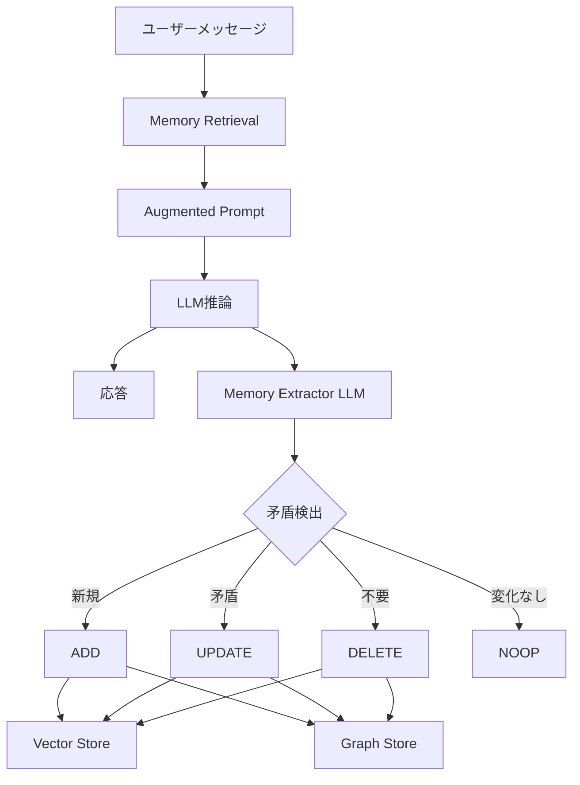

本記事は [Mem0: Building Production-Ready AI Agents with Scalable Long-Term Memory](https://arxiv.org/abs/2504.19413) の解説記事です。

## 論文概要（Abstract）

LLMの固定長コンテキスト制約は、長期間にわたるエージェント対話において一貫性と個別化の維持を困難にする。Mem0は、アプリケーションコードとLLMの間に「マネージドメモリレイヤー」を挿入し、選択的な記憶の保持・動的な更新・矛盾解決を提供するシステムである。著者らは、ベクトルストア（意味検索）とグラフストア（関係構造）を組み合わせたハイブリッド設計により、LOCOMOベンチマークでフルコンテキスト方式を上回る精度を達成しつつ、トークン消費を74%削減、APIコストを90%削減したと報告している。

この記事は [Zenn記事: Bedrock AgentCoreエピソード記憶の本番運用設計と応答品質の定量評価](https://zenn.dev/0h_n0/articles/b6f2b1dfabb12c) の深掘りです。

## 情報源

- **arXiv ID**: 2504.19413
- **URL**: [https://arxiv.org/abs/2504.19413](https://arxiv.org/abs/2504.19413)
- **著者**: Prateek Chhikara, Dev Khant, Saket Aryan, Taranjeet Singh, Deshraj Yadav
- **所属**: Mem0（企業研究）
- **発表年**: 2025年4月
- **分野**: cs.AI, cs.CL
- **コード**: [https://github.com/mem0ai/mem0](https://github.com/mem0ai/mem0)（Apache 2.0）

## 背景と動機（Background & Motivation）

長期対話エージェントの構築において、全会話履歴をコンテキストに詰め込む「フルコンテキスト方式」は、コンテキストウィンドウの上限に達するだけでなく、トークンコストが対話長に比例して増加する。一方、標準的なRAGは「何を記憶として保存するか」の判断がルールベースであり、会話の文脈に応じた柔軟な記憶管理が困難である。

著者らは、LLM自身が「何を覚えるべきか」を判断し、既存の記憶との矛盾を自動解決する「LLM駆動の記憶管理」が必要であると主張している。Zenn記事で解説したAgentCore MemoryのExtraction→Consolidation→Reflectionパイプラインと同様の課題認識に立つが、Mem0はマネージドサービスとOSSの両方を提供する点で異なるアプローチを採用している。

## 主要な貢献（Key Contributions）

- **ハイブリッド記憶アーキテクチャ**: ベクトルストア（意味的類似度検索）とグラフストア（エンティティ間の関係構造）を組み合わせた2層設計を提案した。単独のベクトル検索よりも関係推論を要するクエリで高い精度を達成している
- **LLM駆動の記憶管理**: 会話ターンごとにLLMが記憶抽出・矛盾検出・更新/削除を自動実行する。人手ルールではなく言語モデルが記憶編集者として機能する
- **LOCOMOベンチマークでのSoTA**: フルコンテキスト方式を上回りつつ、トークン74%削減・APIコスト90%削減を達成
- **OSS + マネージド提供**: GitHubでApache 2.0ライセンスのOSSとして公開し、クラウドAPIも併せて提供

## 技術的詳細（Technical Details）

### アーキテクチャ概要

Mem0のメモリパイプラインは「記憶抽出（Extraction）」と「記憶更新（Update）」の2フェーズで構成される。



### 記憶抽出フェーズ

会話ターン終了後、別のLLM呼び出し（Extractor）が新しい情報を抽出する。

```python
from mem0 import Memory


def demonstrate_memory_lifecycle():
    """Mem0のメモリライフサイクルを示す。"""
    m = Memory()

    m.add(
        "Pythonが好きで、FastAPIをよく使います。最近はRustも勉強中です。",
        user_id="user_123",
    )
    # 内部で以下が実行される:
    # 1. Extractorが候補記憶を抽出:
    #    - "User prefers Python"
    #    - "User uses FastAPI"
    #    - "User is learning Rust"
    # 2. 既存記憶と照合（user_123の過去の記憶を検索）
    # 3. 操作を決定: ADD / UPDATE / DELETE / NOOP

    m.add(
        "やっぱりGoに切り替えました。Rustは難しすぎました。",
        user_id="user_123",
    )
    # "User is learning Rust" → UPDATE → "User tried Rust but switched to Go"
    # "User is learning Go" → ADD
```

### ベクトルストアとグラフストアの役割分担

**ベクトルストア**は意味的類似度に基づく検索を担当する。各記憶は自然言語の短文（例: "User prefers Python"）としてエンコードされ、embeddingベクトルとして保存される。

$$
\text{similarity}(q, m_i) = \frac{q \cdot m_i}{\|q\| \|m_i\|}
$$

ここで$q$はクエリのembedding、$m_i$は$i$番目の記憶のembeddingである。

**グラフストア（Mem0g）**はエンティティ間の関係構造を保持する。ベクトル検索だけでは捉えにくい関係推論（例: 「AさんはBチームの上司で、BチームはCプロジェクトを担当している」→「Aさんに関連するプロジェクトは？」）を可能にする。

Mem0gのグラフ構築パイプラインは以下の4モジュールで構成される。

1. **Entity Extractor**: テキストからエンティティ（人名、組織、技術等）を抽出
2. **Relations Generator**: エンティティ間の関係を生成（「uses」「prefers」「manages」等）
3. **Conflict Detector**: 既存のグラフと矛盾する関係を検出
4. **Update Resolver**: 矛盾を解決し、グラフを更新

### 記憶スコアリング

検索時の記憶のランキングは、意味的類似度と時間的関連性を組み合わせて計算される。

$$
\text{score}(m_i) = \alpha \cdot \text{sim}(q, m_i) + \beta \cdot \text{recency}(m_i)
$$

ここで$\alpha$と$\beta$は重み係数、$\text{recency}$は記憶の更新時刻に基づく減衰関数である。Zenn記事で解説したAgentCore Memoryの検索スコアリングとは異なり、Mem0ではconfidence（信頼度）スコアではなくrecency（鮮度）を明示的に組み込んでいる。

## 実装のポイント（Implementation）

- **Extractorモデルの選択**: 記憶抽出には高い推論能力が必要なため、本番環境ではSonnetクラス以上のモデルが推奨される。Haikuクラスでは記憶の粒度が粗くなりやすい
- **記憶の表現形式**: 短い自然言語文（15-30語程度）として保存される。長すぎる記憶は検索精度を低下させるため、Extractorのプロンプトで長さを制約する
- **グラフストアの選択**: 本番環境ではNeo4jが推奨されているが、小規模環境ではNetworkXベースのインメモリグラフでも動作する
- **矛盾検出の精度**: LLMによる矛盾検出は100%ではなく、互いに矛盾する記憶が同時に存在する場合がある。Zenn記事で解説した信頼度スコアによるフィルタリングと同様のアプローチが必要

## Production Deployment Guide

### AWS実装パターン（コスト最適化重視）

Mem0型のメモリレイヤーをAWS上に構築する場合の推奨構成を示す。

**トラフィック量別の推奨構成**:

| 規模 | 月間リクエスト | 推奨構成 | 月額コスト | 主要サービス |
|------|--------------|---------|-----------|------------|
| **Small** | ~3,000 (100/日) | Serverless | $70-200 | Lambda + Bedrock + OpenSearch Serverless |
| **Medium** | ~30,000 (1,000/日) | Hybrid | $500-1,200 | ECS Fargate + Bedrock + OpenSearch + Neptune |
| **Large** | 300,000+ (10,000/日) | Container | $3,000-7,000 | EKS + Bedrock + OpenSearch + Neptune |

**Small構成の詳細** (月額$70-200):
- **Lambda**: 1GB RAM, 30秒タイムアウト ($20/月)
- **Bedrock**: Claude Haiku 4.5（検索用）+ Claude Sonnet 4.6（抽出用）($100/月)
- **OpenSearch Serverless**: ベクトルストア ($40/月)
- **DynamoDB**: メタデータ・ユーザーマッピング ($10/月)

**コスト試算の注意事項**:
- 上記は2026年4月時点のAWS ap-northeast-1料金に基づく概算値
- Mem0は会話ターンごとにExtractor LLMを呼び出すため、通常のチャットの約2倍のBedrock推論コストが発生する
- グラフストア（Neptune）を使用する場合は$200-500/月の追加コストが発生する

### Terraformインフラコード

```hcl
module "vpc" {
  source  = "terraform-aws-modules/vpc/aws"
  version = "~> 5.0"

  name = "mem0-vpc"
  cidr = "10.0.0.0/16"
  azs  = ["ap-northeast-1a", "ap-northeast-1c"]
  private_subnets = ["10.0.1.0/24", "10.0.2.0/24"]

  enable_nat_gateway   = false
  enable_dns_hostnames = true
}

resource "aws_lambda_function" "mem0_handler" {
  filename      = "lambda.zip"
  function_name = "mem0-memory-handler"
  role          = aws_iam_role.lambda_mem0.arn
  handler       = "index.handler"
  runtime       = "python3.12"
  timeout       = 60
  memory_size   = 1024

  environment {
    variables = {
      BEDROCK_EXTRACTOR_MODEL = "anthropic.claude-sonnet-4-6"
      BEDROCK_SEARCH_MODEL    = "anthropic.claude-haiku-4-5-20251001"
      OPENSEARCH_ENDPOINT     = aws_opensearchserverless_collection.vectors.collection_endpoint
      DYNAMODB_TABLE          = aws_dynamodb_table.metadata.name
    }
  }
}

resource "aws_opensearchserverless_collection" "vectors" {
  name = "mem0-vectors"
  type = "VECTORSEARCH"
}

resource "aws_dynamodb_table" "metadata" {
  name         = "mem0-metadata"
  billing_mode = "PAY_PER_REQUEST"
  hash_key     = "user_id"
  range_key    = "memory_id"

  attribute {
    name = "user_id"
    type = "S"
  }
  attribute {
    name = "memory_id"
    type = "S"
  }

  ttl {
    attribute_name = "expire_at"
    enabled        = true
  }
}

resource "aws_iam_role" "lambda_mem0" {
  name = "lambda-mem0-role"
  assume_role_policy = jsonencode({
    Version = "2012-10-17"
    Statement = [{
      Action = "sts:AssumeRole"
      Effect = "Allow"
      Principal = { Service = "lambda.amazonaws.com" }
    }]
  })
}
```

### コスト最適化チェックリスト

**Mem0固有の最適化**:
- [ ] Extractor LLMの呼び出しをバッチ化（会話終了時に一括抽出）
- [ ] 重複記憶の定期マージ（同一ユーザーの類似記憶を統合）
- [ ] グラフストアはMedium以上の規模でのみ導入（Small構成ではベクトルストアのみで十分）
- [ ] 記憶のTTL設定（90日未アクセスの記憶を自動アーカイブ）

**LLMコスト削減**:
- [ ] 検索にはHaikuモデル使用（記憶呼び出し時のLLM推論）
- [ ] 抽出にはSonnetモデル使用（記憶の品質確保）
- [ ] Prompt Caching有効化（Extractorのシステムプロンプト）
- [ ] 記憶ヒット時は関連記憶のみをコンテキストに含める（全履歴は含めない）

**監視・アラート**:
- [ ] 記憶数の推移を日次監視（ユーザーあたりの記憶数上限を検討）
- [ ] 矛盾検出の発生率を追跡
- [ ] 検索ヒット率の低下を検知
- [ ] AWS Budgets: 月額予算設定（Extractor LLM呼び出しコストに注意）

## 実験結果（Results）

### LOCOMOベンチマーク

LOCOMOは長期対話（数百ターン）での記憶応答精度を測定するベンチマークであり、Zenn記事でも参照されているMem0リサーチの基盤である。

著者らの報告によると、Mem0はフルコンテキスト方式に対して以下の改善を達成している。

| 手法 | 相対精度 | トークン使用量 | APIコスト |
|------|---------|-------------|---------|
| フルコンテキスト | baseline | 1.0x | 1.0x |
| 標準RAG | フルコンテキスト未満 | 削減あり | 削減あり |
| Mem0（vectorのみ） | フルコンテキスト以上 | - | - |
| Mem0（vector + graph） | 最高精度 | 0.26x (-74%) | 0.10x (-90%) |

Zenn記事で引用されているMem0のLOCOMO研究結果（LLM-as-Judge精度66.9%、p95レイテンシ1.44秒）は、この論文の実験結果に基づいている。

### OpenAI Memoryとの比較

著者らの報告では、Mem0はOpenAI Memory（52.9%）を大幅に上回るLLM-as-Judge精度（66.9%）を達成している。この差は、OpenAI Memoryが単純なキーバリュー記憶であるのに対し、Mem0がLLM駆動の矛盾解決とグラフベースの関係推論を備えている点に起因すると著者らは分析している。

## 実運用への応用（Practical Applications）

Zenn記事で解説したBedrock AgentCore Memoryとの比較において、Mem0は以下の点で異なるアプローチを提供する。

**設計思想の違い**:
- AgentCoreは「戦略ベース」（エピソード・セマンティック・ユーザー嗜好の明示的分類）であるのに対し、Mem0は「統合メモリレイヤー」（LLMが自動分類）として動作する
- AgentCoreのExtraction→Consolidation→Reflectionパイプラインは非同期バックグラウンド処理であるのに対し、Mem0のExtractorは会話ターンごとに同期的に実行される
- AgentCoreはAWSマネージドサービスとして料金体系が確立しているが、Mem0はOSSとしてインフラを自前で構築することも可能

**使い分けの指針**:
- AWSエコシステムに統合された環境では、AgentCore Memoryの方が運用負荷が低い
- マルチクラウドやオンプレミス環境ではMem0のOSS版が適している
- グラフベースの関係推論が重要なユースケース（複雑な顧客関係、組織構造）ではMem0gが有利

## 関連研究（Related Work）

- **MemGPT (Packer et al., 2023)**: LLM自身がメモリ管理を行うOS型アプローチ。Mem0と異なり、コンテキストウィンドウ内でのページングに依存するため、メモリ容量はコンテキスト長に制約される
- **Bedrock AgentCore Memory**: 戦略ベースのマネージドメモリサービス。Mem0のLLM駆動抽出と類似するが、ビルトイン戦略によりLLMコストがサービス料金に含まれる点が異なる
- **HippoRAG (Yu et al., 2024)**: 海馬索引理論に基づくグラフベースRAG。Mem0gと同様にグラフ構造を活用するが、HippoRAGはOpenIEベースの三つ組抽出に特化している

## まとめと今後の展望

Mem0は、ベクトル検索とグラフ構造のハイブリッド設計により、フルコンテキスト方式を上回る精度をトークン74%削減で達成した。LLM駆動の記憶管理（自動抽出・矛盾解決・更新）は、Bedrock AgentCore MemoryのExtraction→Consolidationパイプラインと設計思想を共有するが、実装レベルでは同期/非同期の処理方式やOSS/マネージドの提供形態に違いがある。

本番環境でのエージェント記憶システム選択において、AgentCore MemoryとMem0はそれぞれ異なるトレードオフを提供する。自社のインフラ環境・コスト制約・記憶管理の複雑度に応じた選択が重要である。

## 参考文献

- **arXiv**: [https://arxiv.org/abs/2504.19413](https://arxiv.org/abs/2504.19413)
- **Code**: [https://github.com/mem0ai/mem0](https://github.com/mem0ai/mem0)
- **Official**: [https://mem0.ai](https://mem0.ai)
- **Related Zenn article**: [https://zenn.dev/0h_n0/articles/b6f2b1dfabb12c](https://zenn.dev/0h_n0/articles/b6f2b1dfabb12c)
