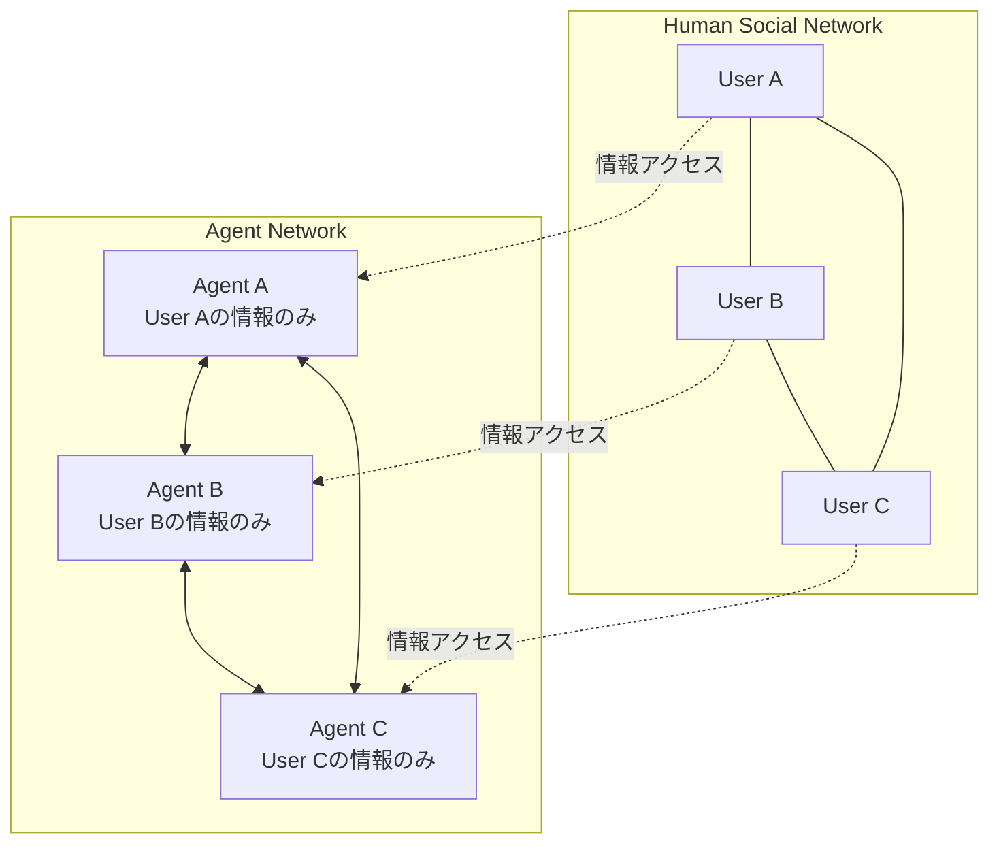

本記事は [https://arxiv.org/abs/2406.14928](https://arxiv.org/abs/2406.14928) の解説記事です。

## 論文概要（Abstract）

iAgents（Informative Multi-Agent Systems）は、**情報非対称**（Information Asymmetry）条件下でLLMマルチエージェントが自律的に協調タスクを遂行するためのフレームワークである。著者らは、各エージェントが関連する人間ユーザーの情報にのみアクセスできるという制約下で、エージェント同士が30ターン以上の自律的通信を通じて約70,000メッセージから情報を検索・交換し、3分以内にタスクを完了させたと報告している。中核となるInfoNavメカニズムにより、エージェントの通信が効率的な情報交換へと誘導される。

この記事は [Zenn記事: MCP・A2A・ACP時代のマルチエージェント通信設計 実践パターン集](https://zenn.dev/0h_n0/articles/9004c89e7b46fd) の深掘りです。

## 情報源

- **会議名**: NeurIPS 2024（Neural Information Processing Systems）
- **年**: 2024
- **URL**: [https://arxiv.org/abs/2406.14928](https://arxiv.org/abs/2406.14928)
- **著者**: Wei Liu, Chenxi Wang, Yifei Wang, Zihao Xie, Rennai Qiu, Yufan Dang, Zhuoyun Du, Weize Chen, Cheng Yang, Chen Qian
- **採択形式**: NeurIPS 2024 Accepted

## カンファレンス情報

**NeurIPSについて**: NeurIPS（Neural Information Processing Systems）は機械学習・人工知能分野の最高峰会議の1つであり、採択率は通常25〜30%程度である。本論文はマルチエージェントシステムの通信設計において、情報非対称という現実的な制約を正面から扱った点で注目される。

## 背景と動機（Background & Motivation）

既存のマルチエージェントシステムの多くは、すべてのエージェントが同じ情報にアクセスできる**情報対称**（Information Symmetry）を前提としている。しかし、実世界のシナリオでは以下のような情報非対称が常に存在する：

- **企業内協調**: 各部署のエージェントが部署固有のデータにのみアクセスでき、他部署の情報は直接参照できない
- **マルチユーザー環境**: 各ユーザーのエージェントがそのユーザーのメール・チャット履歴・ドキュメントにのみアクセス可能
- **分散システム**: プライバシーやセキュリティの制約により、データの中央集約が許されない

著者らは、この情報非対称条件下でエージェントが「何の情報を」「誰から」「どのように」取得すべきかを自律的に判断するメカニズムが不足していると指摘し、iAgentsフレームワークを提案している。

## 主要な貢献（Key Contributions）

- **貢献1: iAgentsパラダイム** — 人間の社会的ネットワークをエージェントネットワークにマッピングし、各エージェントが対応するユーザーの情報にのみアクセスするMASフレームワーク。エージェント間の情報交換を通じて協調的にタスクを遂行する
- **貢献2: InfoNavメカニズム** — エージェントの通信を効果的な情報交換へと誘導する推論メカニズム。どの情報が必要かを推論し、通信先を選択し、取得した情報を統合する一連のプロセスを自動化する
- **貢献3: InformativeBench** — 情報非対称条件下でのLLMエージェントの性能を評価するための初のベンチマーク。140名の個人と588の関係性からなるソーシャルネットワークを模擬する
- **貢献4: Mixed Memoryシステム** — エージェントに正確かつ包括的な情報を提供するための組織化されたメモリ構造

## 技術的詳細（Technical Details）

### iAgentsアーキテクチャ

iAgentsのアーキテクチャは人間の社会的ネットワークを模した3層構造である：



各エージェントは対応するユーザーの情報（メール、チャット履歴、ドキュメント等）にのみアクセスでき、他のユーザーの情報は他のエージェントとの通信を通じてのみ取得できる。

### InfoNavメカニズム

InfoNav（Information Navigation）は、エージェントの通信を3つのフェーズで制御する：

**Phase 1: 情報需要の推論（Information Need Estimation）**

エージェントはタスクの要件を分析し、自身が保持していない情報を特定する：

$$
\text{InfoNeed}(a_i, \text{task}) = \text{Required}(\text{task}) \setminus \text{Known}(a_i)
$$

ここで、
- $a_i$: エージェント $i$
- $\text{Required}(\text{task})$: タスク遂行に必要な情報集合
- $\text{Known}(a_i)$: エージェント $i$ が保持する情報集合

**Phase 2: 通信先の選択（Communication Target Selection）**

InfoNavは社会的ネットワークのグラフ構造を活用し、必要な情報を保持する可能性が高いエージェントを推論する：

$$
\text{Target}(a_i) = \arg\max_{a_j \in \mathcal{N}(a_i)} P(\text{InfoNeed}(a_i) \subseteq \text{Known}(a_j))
$$

ここで $\mathcal{N}(a_i)$ はエージェント $i$ の通信可能な隣接エージェント集合を表す。

**Phase 3: 情報統合（Information Integration）**

取得した情報はMixed Memoryシステムに格納され、後続の推論に活用される。Mixed Memoryは以下の2種類のメモリで構成される：

- **Episodic Memory**: 通信履歴をそのまま保持（時系列順）
- **Semantic Memory**: 取得した情報を構造化して格納（キーワード・カテゴリで索引化）

```python
from dataclasses import dataclass, field
from typing import Any

@dataclass
class MixedMemory:
    """iAgentsのMixed Memoryシステム。"""
    episodic: list[dict[str, Any]] = field(default_factory=list)
    semantic: dict[str, Any] = field(default_factory=dict)

    def add_communication(self, sender: str, content: str, turn: int) -> None:
        """通信履歴をEpisodic Memoryに追加。"""
        self.episodic.append({
            "sender": sender,
            "content": content,
            "turn": turn
        })

    def extract_and_store(self, key: str, value: Any, source: str) -> None:
        """構造化情報をSemantic Memoryに格納。"""
        self.semantic[key] = {
            "value": value,
            "source": source,
            "confidence": 1.0
        }

    def query(self, info_need: str) -> list[dict]:
        """情報需要に基づきメモリを検索。"""
        results = []
        for key, entry in self.semantic.items():
            if info_need.lower() in key.lower():
                results.append(entry)
        return results
```

### InformativeBenchの設計

著者らが構築したInformativeBenchは以下の規模を持つ：

| 項目 | 数値 |
|------|------|
| 個人（ユーザー） | 140名 |
| 関係性 | 588 |
| メッセージ総数 | 約70,000件 |
| タスクカテゴリ | 複数（情報検索、推論、協調計画等） |

## 実験結果（Results）

著者らの実験結果によると、iAgentsは以下の性能を達成したと報告されている：

- **自律的通信**: エージェントは30ターン以上の通信を自律的に行い、必要な情報を収集
- **情報検索**: 約70,000メッセージから関連情報を抽出
- **タスク完了時間**: 3分以内にタスクを完了
- **スケーラビリティ**: 140名規模のソーシャルネットワーク上で動作

**InfoNavの効果**: InfoNavメカニズムなしの場合と比較して、著者らはInfoNavの導入によりタスク成功率が有意に向上したと報告している。特に、通信ターン数の削減（不要な通信の抑制）と情報取得の精度向上の両方に効果が確認されている。

**失敗ケースの分析**: 著者らは以下の失敗パターンを報告している：
1. **情報の連鎖依存**: A→B→Cと3ホップ以上の情報伝搬が必要な場合、精度が低下する
2. **曖昧な情報需要**: タスク要件が不明確な場合、InfoNavの推論精度が下がる
3. **メモリオーバーフロー**: 大量の通信履歴がコンテキストウィンドウを圧迫する

## 実運用への応用（Practical Applications）

iAgentsの設計思想は、マルチエージェントシステムにおける通信設計に以下の示唆を与える：

**プライバシー保護型マルチエージェント**: 各エージェントが自身のユーザーのデータにのみアクセスするiAgentsの設計は、GDPR等のデータプライバシー規制に準拠するマルチエージェントシステムの設計パターンとして応用可能である。

**通信効率の最適化**: InfoNavの「情報需要の推論→通信先選択→情報統合」の3フェーズは、A2Aプロトコルの「Agent Card検索→タスク送信→結果受信」のフローと構造的に類似しており、A2A上でのInfoNav的な通信最適化の実装が考えられる。

**Zenn記事との関連**: Zenn記事で解説されているメッセージパッシングとBlackboardの使い分けにおいて、iAgentsは明確にメッセージパッシング方式を採用している。情報非対称条件下ではBlackboard（共有メモリ）はプライバシーの観点から適用困難であり、メッセージパッシングによる選択的な情報交換が必須となる。このトレードオフはZenn記事の「2方式の選定基準」テーブルを裏付ける実証例である。

## 関連研究（Related Work）

- **AutoGen (Wu et al., 2023)**: 会話型マルチエージェントフレームワーク。iAgentsとは異なり、情報対称を前提としている
- **MetaGPT (Hong et al., 2023)**: ソフトウェア開発を対象とした役割分担型MAS。共有ドキュメントを介した情報共有（Blackboardパターン）を採用
- **AgentScope (Gao et al., 2024)**: アクターモデルベースのメッセージパッシング基盤。分散環境での耐障害性を提供するが、情報非対称の明示的な取り扱いは含まれない

## まとめと今後の展望

iAgentsは、情報非対称という現実的な制約下でのマルチエージェント協調に取り組んだ先駆的な研究である。InfoNavメカニズムによる通信の最適化は、エージェント数やメッセージ量が増大する実運用環境において重要な知見を提供している。

今後の課題として、著者らはByzantine耐性（悪意あるエージェントへの対処）、より大規模なネットワークでのスケーラビリティ検証、およびリアルタイム通信への拡張を挙げている。MCP・A2Aプロトコルの普及とともに、InfoNavのような通信最適化メカニズムをプロトコルレベルで統合することが、次世代マルチエージェントシステムの設計指針となると考えられる。

## 参考文献

- **arXiv**: [https://arxiv.org/abs/2406.14928](https://arxiv.org/abs/2406.14928)
- **Conference**: NeurIPS 2024
- **Related Zenn article**: [https://zenn.dev/0h_n0/articles/9004c89e7b46fd](https://zenn.dev/0h_n0/articles/9004c89e7b46fd)
