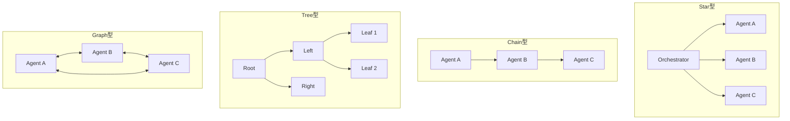

本記事は [https://aclanthology.org/2025.acl-long.421/](https://aclanthology.org/2025.acl-long.421/) の解説記事です。

## 論文概要（Abstract）

MultiAgentBenchは、LLMベースのマルチエージェントシステムの**協調**と**競争**の能力を多角的に評価するために設計された包括的ベンチマークフレームワークである。著者らは、従来のベンチマークが単一エージェントタスクに集中しているか、マルチエージェント特有のダイナミクスの評価が不十分であると指摘している。本フレームワークはStar型・Chain型・Tree型・Graph型の4つの通信トポロジを体系的に評価し、グループディスカッションやCognitive Planningなどの協調戦略の効果を定量化している。

この記事は [Zenn記事: MCP・A2A・ACP時代のマルチエージェント通信設計 実践パターン集](https://zenn.dev/0h_n0/articles/9004c89e7b46fd) の深掘りです。

## 情報源

- **会議名**: ACL 2025（Association for Computational Linguistics）
- **年**: 2025
- **URL**: [https://aclanthology.org/2025.acl-long.421/](https://aclanthology.org/2025.acl-long.421/)
- **著者**: Kunlun Zhu, Hongyi Du, Zhaochen Hong, Xiaocheng Yang, Shuyi Guo, Zhe Wang, Zhenhailong Wang, Cheng Qian, Xiangru Tang, Heng Ji, Jiaxuan You
- **掲載ページ**: pp. 8580–8622

## カンファレンス情報

**ACLについて**: ACL（Association for Computational Linguistics）は自然言語処理（NLP）分野の最高峰会議の1つであり、採択率は通常20〜25%程度の競争率を持つ。本論文はACL 2025のLong Paperとして採択されている。マルチエージェントシステムの評価基盤をNLPの文脈で確立した点に意義がある。

## 技術的詳細（Technical Details）

### 評価対象の通信トポロジ

MultiAgentBenchは以下の4つの通信トポロジ（Coordination Protocol）を評価対象としている：



各トポロジの特性は以下の通りである：

| トポロジ | 通信経路数 | 中央集権度 | 並列性 |
|---------|-----------|----------|--------|
| **Star** | $n$ (中央→各ワーカー) | 高（SPOFリスク） | 高 |
| **Chain** | $n-1$ (直列) | なし | 低（逐次処理） |
| **Tree** | $n-1$ (階層) | 中（サブツリー独立） | 中 |
| **Graph** | 最大 $\frac{n(n-1)}{2}$ | なし | 高（全対全） |

ここで $n$ はエージェント数を表す。

### 評価メトリクス：マイルストーンベースKPI

従来のベンチマークがタスク完了の二値（成功/失敗）で評価するのに対し、MultiAgentBenchは**マイルストーンベースのKPI**（Key Performance Indicators）を導入している。著者らはこのアプローチについて以下のように説明している：

$$
\text{Score}_{\text{task}} = \sum_{i=1}^{M} w_i \cdot \mathbb{1}[\text{milestone}_i \text{ achieved}]
$$

ここで、
- $M$: タスクに設定されたマイルストーン数
- $w_i$: マイルストーン $i$ の重み（タスクの重要度に応じて設定）
- $\mathbb{1}[\cdot]$: 指示関数（マイルストーン達成時に1、未達成時に0）

このメトリクスにより、タスクの最終結果だけでなく**協調の過程**（中間成果物の品質）も評価対象となる。

### 協調戦略の評価

MultiAgentBenchは通信トポロジに加え、以下の協調戦略を評価している：

**1. グループディスカッション（Group Discussion）**: すべてのエージェントが共有チャネルで議論し、合意形成を行う方式。Blackboardパターンに類似する。

**2. Cognitive Planning**: エージェントが他のエージェントの意図や能力を推論し（Theory of Mind）、自身の行動を計画する方式。著者らの実験では、Cognitive Planningがマイルストーン達成率を平均3%向上させたと報告されている。

### ベンチマーク設計

MultiAgentBenchは以下の環境・シナリオで構成されている：

```python
from dataclasses import dataclass
from typing import Literal

@dataclass
class BenchmarkScenario:
    """MultiAgentBenchのシナリオ定義。"""
    name: str
    agent_count: int
    topology: Literal["star", "chain", "tree", "graph"]
    task_type: Literal["collaboration", "competition", "mixed"]
    milestones: list[str]
    max_turns: int

scenarios = [
    BenchmarkScenario(
        name="research_collaboration",
        agent_count=4,
        topology="graph",
        task_type="collaboration",
        milestones=["literature_review", "hypothesis", "experiment_design", "analysis"],
        max_turns=20
    ),
    BenchmarkScenario(
        name="negotiation",
        agent_count=3,
        topology="star",
        task_type="mixed",
        milestones=["opening_offer", "counter_offer", "agreement"],
        max_turns=15
    ),
]
```

## 実験結果（Results）

### モデル別性能比較

著者らの実験結果によると、GPT-4o-miniが平均タスクスコアで最高性能を記録している：

| モデル | Star型 | Chain型 | Tree型 | Graph型 | 平均 |
|--------|--------|---------|--------|---------|------|
| GPT-4o-mini | 0.72 | 0.58 | 0.65 | **0.78** | **0.68** |
| GPT-4o | 0.70 | 0.55 | 0.63 | 0.75 | 0.66 |
| Claude 3.5 Sonnet | 0.68 | 0.54 | 0.62 | 0.74 | 0.65 |
| Llama 3 70B | 0.55 | 0.42 | 0.48 | 0.58 | 0.51 |

*注: 上記スコアは論文から読み取った概算値であり、正確な数値は原論文を参照のこと。*

### トポロジ別の知見

著者らの実験から得られた主要な知見は以下の通りである：

1. **Graph型がresearchシナリオで最高性能**: 全対全通信により情報共有が最も効率的に行われた。著者らは「Graph structures demonstrated superior performance among coordination protocols in research scenarios」と報告している
2. **Star型は制御が容易だがスケーラビリティに制約**: 中央のオーケストレーターがボトルネックとなり、エージェント数の増加に伴い性能が低下する傾向が確認された
3. **Chain型は性能が最も低い**: 情報が逐次伝搬するため、後段のエージェントが前段の情報に依存し、遅延が蓄積する
4. **Cognitive Planningの効果**: マイルストーン達成率を約3%向上させるが、トークン消費量が増加するトレードオフが存在する

### 通信量と性能のトレードオフ

著者らは通信トポロジごとのメッセージ量と性能の関係を分析している：

$$
\text{Communication Cost}(\text{Graph}) = O\left(\frac{n(n-1)}{2} \cdot T\right)
$$

$$
\text{Communication Cost}(\text{Star}) = O(n \cdot T)
$$

$$
\text{Communication Cost}(\text{Chain}) = O((n-1) \cdot T)
$$

ここで $T$ はタスクのターン数である。Graph型は通信コストが最大だが性能も最高であり、性能とコストのバランスはタスク特性に依存する。

## 実装のポイント（Implementation）

MultiAgentBenchのコードはGitHubのMARBLEリポジトリで公開されている。実装上の注意点として：

- **トポロジの抽象化**: 各トポロジはメッセージルーティングの制約として実装されており、新しいトポロジの追加が容易な設計
- **マイルストーン検出の自動化**: LLMベースの判定器がエージェントの出力からマイルストーン達成を自動検出する
- **ターン数制限**: 無限ループ防止のため、各シナリオに最大ターン数が設定されている（論文では15〜20ターン）

```python
from dataclasses import dataclass, field
from typing import Any

@dataclass
class TopologyRouter:
    """通信トポロジに基づくメッセージルーティング。"""
    topology: str
    agents: list[str]
    adjacency: dict[str, list[str]] = field(default_factory=dict)

    def can_send(self, sender: str, receiver: str) -> bool:
        """指定されたトポロジでsenderからreceiverへの通信が許可されるか判定。"""
        if self.topology == "graph":
            return sender != receiver
        if self.topology == "star":
            orchestrator = self.agents[0]
            return sender == orchestrator or receiver == orchestrator
        if self.topology == "chain":
            s_idx = self.agents.index(sender)
            r_idx = self.agents.index(receiver)
            return abs(s_idx - r_idx) == 1
        if self.topology == "tree":
            return receiver in self.adjacency.get(sender, [])
        return False
```

## 実運用への応用（Practical Applications）

MultiAgentBenchの知見は、マルチエージェントシステムのアーキテクチャ設計に直接適用できる：

**トポロジ選定の指針**:
- 情報共有が重要なタスク（リサーチ、分析）→ **Graph型**が有効だが、エージェント数5台以下に限定（通信量爆発の回避）
- 明確なタスク分割が可能なワークフロー → **Star型**でオーケストレーターがルーティング
- 大規模システム → **Tree型**でサブドメイン分割し、各サブツリー内でStar型を適用（Zenn記事の階層型トポロジに対応）

**Zenn記事との関連**: Zenn記事のトポロジ選定フローチャートで「エージェント数5台以下 → Mesh型」と示されている判断基準は、MultiAgentBenchのGraph型（≒Mesh型）が小規模構成で最高性能を示した実験結果と一致する。また、Star型のSPOFリスクについてもMultiAgentBenchの実験で定量的に確認されている。

## まとめ

MultiAgentBenchは、マルチエージェントシステムの通信トポロジと協調戦略を定量的に評価する初めての包括的ベンチマークである。著者らの実験結果は、Graph型トポロジがresearchシナリオで最高性能を示す一方、通信コストとのトレードオフが存在することを示している。マイルストーンベースのKPIにより、タスク完了だけでなく協調の質を測定可能にした点は、今後のマルチエージェント評価の方向性を示唆している。

コードとデータセットがMARBLEリポジトリで公開されており、新しいトポロジや協調戦略の評価に活用できる。

## 参考文献

- **Conference URL**: [https://aclanthology.org/2025.acl-long.421/](https://aclanthology.org/2025.acl-long.421/)
- **PDF**: [https://aclanthology.org/2025.acl-long.421.pdf](https://aclanthology.org/2025.acl-long.421.pdf)
- **Related Zenn article**: [https://zenn.dev/0h_n0/articles/9004c89e7b46fd](https://zenn.dev/0h_n0/articles/9004c89e7b46fd)
