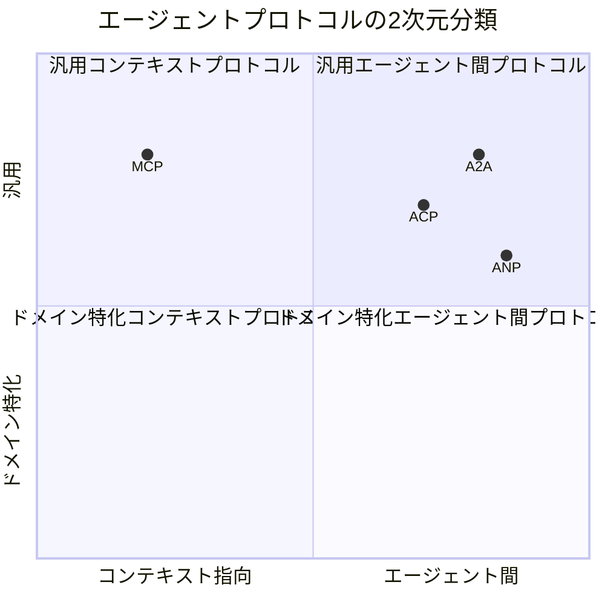

本記事は [https://arxiv.org/abs/2504.16736](https://arxiv.org/abs/2504.16736) の解説記事です。

## 論文概要（Abstract）

「A Survey of AI Agent Protocols」は、LLMベースのAIエージェントが外部ツールや他のエージェントと通信するためのプロトコルを体系的に分類・比較した包括的サーベイ論文である。著者らは、現在のエージェント開発において標準化された通信プロトコルの欠如が協調性・拡張性の最大の障壁であると指摘し、**2次元分類フレームワーク**（コンテキスト指向 vs エージェント間 / 汎用 vs ドメイン特化）を提案している。MCP（Model Context Protocol）、A2A（Agent-to-Agent Protocol）をはじめとする主要プロトコルのセキュリティ・スケーラビリティ・レイテンシを比較評価し、次世代プロトコルに求められる要件を提示している。

この記事は [Zenn記事: MCP・A2A・ACP時代のマルチエージェント通信設計 実践パターン集](https://zenn.dev/0h_n0/articles/9004c89e7b46fd) の深掘りです。

## 情報源

- **arXiv ID**: 2504.16736
- **URL**: [https://arxiv.org/abs/2504.16736](https://arxiv.org/abs/2504.16736)
- **著者**: Yingxuan Yang, Huacan Chai, Yuanyi Song, Siyuan Qi, Muning Wen, Ning Li, Junwei Liao, Haoyi Hu, Jianghao Lin, Gaowei Chang, Weiwen Liu, Ying Wen, Yong Yu, Weinan Zhang et al.
- **発表年**: 2025
- **分野**: cs.AI, cs.SE

## 背景と動機（Background & Motivation）

LLMベースのAIエージェントの爆発的な普及に伴い、エージェントが外部ツール・データソース・他のエージェントと連携する必要性が急速に高まっている。しかし著者らは、この領域において**標準化された通信プロトコルが存在しない**ことが最大の課題であると指摘している。具体的には以下の問題が挙げられている：

1. **ツール接続の断片化**: 各フレームワーク（LangChain、AutoGen、CrewAI等）が独自のツール接続方式を採用しており、互換性がない
2. **エージェント間通信の非標準化**: 異なるプロバイダ（OpenAI、Anthropic、Google等）が構築したエージェント同士が通信する標準的な手段がない
3. **セキュリティモデルの未成熟**: エージェントが自律的に外部リソースにアクセスする際の認証・認可フレームワークが未整備

こうした背景から、MCP（Anthropic, 2024年11月公開）やA2A（Google, 2025年4月発表）といったプロトコルが登場したが、これらを含むプロトコル群を俯瞰的に整理・比較した研究は限られていた。本論文はその空白を埋めることを目的としている。

## 主要な貢献（Key Contributions）

著者らは以下の3つの貢献を主張している：

- **貢献1: 2次元分類フレームワーク** — エージェントプロトコルを「コンテキスト指向（Context-oriented） vs エージェント間（Inter-agent）」と「汎用（General-purpose） vs ドメイン特化（Domain-specific）」の2軸で分類する体系を提案。この分類により、MCP・A2A・ACP等の位置づけが明確になる
- **貢献2: 多軸比較分析** — セキュリティ、スケーラビリティ、レイテンシの3次元で既存プロトコルを比較評価し、各プロトコルの強みと制約を定量的に整理
- **貢献3: 将来研究ロードマップ** — 適応性（Adaptability）、プライバシー保護（Privacy Preservation）、グループベースインタラクション（Group-based Interaction）を含む次世代プロトコル要件の特定

## 技術的詳細（Technical Details）

### 2次元分類フレームワーク

著者らが提案する分類体系は、エージェントプロトコルを以下の4象限に整理する：

**第1軸: コンテキスト指向 vs エージェント間**

- **コンテキスト指向プロトコル**: エージェントが外部ツール・データソースに接続するための垂直統合層。MCPが代表例であり、エージェントが利用可能なツールを動的に検出し、JSON-RPC 2.0ベースで呼び出す
- **エージェント間プロトコル**: エージェント同士が水平に通信・協調するための層。A2AやACP（現在はA2Aに統合）が該当し、Agent Cardによる能力公開とタスクライフサイクル管理を提供する

**第2軸: 汎用 vs ドメイン特化**

- **汎用プロトコル**: 特定のドメインに依存しない一般的な通信規約（MCP、A2A等）
- **ドメイン特化プロトコル**: 特定の産業・ユースケースに最適化されたプロトコル（医療向け、金融向け等）

### MCPのアーキテクチャ分析

著者らはMCPの構造を3層（Resource / Tool / Prompt）に分解して解説している：

$$
\text{MCP Server} = \{R, T, P\}
$$

ここで、
- $R$: Resource層 — データソース（ファイル、DB等）へのアクセスインターフェース
- $T$: Tool層 — 実行可能な操作（検索、計算等）のスキーマ定義
- $P$: Prompt層 — LLMが利用するプロンプトテンプレート

通信はJSON-RPC 2.0ベースで、トランスポートとしてstdio（ローカル）またはHTTP+SSE（リモート）をサポートする。著者らは、MCPの設計が「サーバー抽象化」に特化しており、エージェント同士の通信はスコープ外であると分析している。

### A2Aのアーキテクチャ分析

A2Aの中核は**Agent Card**と**タスクライフサイクル管理**の2要素であると著者らは指摘している：

**Agent Card**: `.well-known/agent.json`に配置されるJSON形式のメタデータで、エージェントの能力・エンドポイント・認証方式を宣言する。著者らはこれをDNSのSRVレコードに類するディスカバリメカニズムと位置づけている。

**タスクライフサイクル**: A2Aではタスクが以下の状態遷移を持つ：

$$
\text{submitted} \rightarrow \text{working} \rightarrow \text{completed} \mid \text{failed}
$$

通信はJSON-RPC over HTTPSで行われ、長時間タスクにはSSE（Server-Sent Events）によるリアルタイム進捗配信が利用される。認証にはOAuth 2.0およびmTLS（相互TLS）がサポートされている。

### プロトコル比較分析

著者らはセキュリティ・スケーラビリティ・レイテンシの3軸で主要プロトコルを比較している：

| 評価軸 | MCP | A2A | ACP（統合前） |
|--------|-----|-----|--------------|
| **認証方式** | Capability Token | OAuth 2.0 / mTLS | API Key / Bearer Token |
| **スケーラビリティ** | サーバー単位でスケール | Agent Card登録によりO(n)探索 | RESTエンドポイント単位 |
| **レイテンシ特性** | stdio: 低、HTTP+SSE: 中 | HTTPS: 中、SSE: リアルタイム | REST: 中 |
| **マルチモーダル** | テキスト中心 | テキスト + 音声 + 映像 | テキスト + 構造化データ |
| **ディスカバリ** | Capability Schema（静的） | Agent Card（動的） | エンドポイント登録 |

著者らは、MCPが「深さ」（ツール接続の精密さ）に優れる一方、A2Aは「広さ」（異種エージェント間の相互運用性）に優れると評価している。両者は競合関係ではなく**補完関係**にあり、実務では「MCPでツール接続 + A2Aでエージェント間協調」の組み合わせが推奨されると結論づけている。

### セキュリティモデルの課題

著者らはプロトコルのセキュリティモデルが依然として未成熟であると指摘しており、特に以下の課題を挙げている：

1. **認証・認可の粒度**: MCPのCapability Tokenは現時点ではツール単位の粒度であり、操作レベルの細粒度制御が不足している
2. **エージェント間信頼**: A2AのAgent Cardは自己申告方式であり、悪意あるAgent Cardの検証メカニズムが未確立
3. **データプライバシー**: エージェント間でやり取りされるデータの暗号化・最小権限原則の実装が各プロトコルで異なる

## 実験結果（Results）

本論文はサーベイ論文であるため、ベンチマーク形式の実験は含まれていない。代わりに、著者らは既存文献の体系的レビューに基づく比較分析を提示している。

著者らの分析によると、プロトコル選定が与える影響は以下の通りである：

- **統合時間**: 標準プロトコル（MCP/A2A）の採用により、独自プロトコル開発と比較して統合時間を大幅に短縮できる可能性がある。AI Agent Protocols 2026の分析では60〜70%の削減が報告されている
- **運用コスト**: プロトコルの標準化により、エージェントの追加・削除時の変更コストが抑制される
- **セキュリティリスク**: 標準プロトコルはコミュニティによる脆弱性検出・修正が期待できるが、仕様の急速な進化に伴う過渡的なセキュリティギャップが存在する

## 実運用への応用（Practical Applications）

本論文の分類フレームワークは、マルチエージェントシステムのアーキテクチャ設計において実用的な判断基準を提供する：

**プロトコル選定の意思決定フロー**:

1. **ユースケースの特定**: エージェントがツールに接続するのか（コンテキスト指向 → MCP）、他のエージェントと協調するのか（エージェント間 → A2A）を判断
2. **スケール要件の評価**: 小規模（5エージェント以下）ならA2Aのピアツーピアモデルで十分、大規模ならAgent Card登録によるディスカバリが必要
3. **セキュリティ要件の確認**: エンタープライズ用途ではmTLSとOAuth 2.0の併用が推奨される

**Zenn記事との関連**: 元のZenn記事で解説されている「MCP + A2Aの組み合わせ」パターンは、本論文の2次元分類における「コンテキスト指向 × エージェント間」の直交的な役割分担と一致する。Zenn記事のトポロジ選定フロー（Star / Mesh / 階層型）は、本論文のスケーラビリティ分析と組み合わせることで、より根拠のある設計判断が可能になる。

## 関連研究（Related Work）

- **AgentConnect (arXiv:2410.11905)**: 異種エージェント間の相互運用性を実現するプロトコル指向フレームワーク。A2Aの設計思想の先行研究として位置づけられる
- **AutoGen (Wu et al., 2023)**: 会話型マルチエージェントパターンの基盤論文。カスタマイズ可能な通信フローを導入し、後続のプロトコル標準化の動機となった
- **IoA: Internet of Agents (Zhang et al., 2024)**: 異種フレームワーク間のエージェント登録・検出・通信基盤を提案。Agent Manifestの概念はA2AのAgent Cardに影響を与えたと考えられる

## まとめと今後の展望

本論文は、AIエージェントプロトコルの乱立する現状を整理し、2次元分類フレームワークにより見通しの良い理解を提供している。著者らの分析は、MCP（ツール接続）とA2A（エージェント間通信）が補完的な役割を担うという現在の業界コンセンサスを裏付けるものである。

今後の課題として、著者らは以下を挙げている：
- **適応型プロトコル**: タスクの性質に応じて通信方式を動的に切り替えるプロトコル
- **プライバシー保護**: 差分プライバシーや連合学習を組み込んだエージェント間通信
- **グループインタラクション**: 2者間ではなく、複数エージェントが同時に参加する協調プロトコル

MCP・A2Aの両プロトコルとも、2025年12月に設立されたLinux Foundation傘下のAgentic AI Foundation（AAIF）に移管されており、OpenAI、Google、Microsoft、AWS、Anthropicを含む主要AIプロバイダーが共同で標準化を推進している。プロトコルの成熟とともに、本論文で指摘されたセキュリティ課題の解決が進むことが期待される。

## 参考文献

- **arXiv**: [https://arxiv.org/abs/2504.16736](https://arxiv.org/abs/2504.16736)
- **MCP公式**: [https://modelcontextprotocol.io](https://modelcontextprotocol.io)
- **A2A公式**: [https://github.com/a2aproject/A2A](https://github.com/a2aproject/A2A)
- **AAIF発表**: [https://www.anthropic.com/news/donating-the-model-context-protocol-and-establishing-of-the-agentic-ai-foundation](https://www.anthropic.com/news/donating-the-model-context-protocol-and-establishing-of-the-agentic-ai-foundation)
- **Related Zenn article**: [https://zenn.dev/0h_n0/articles/9004c89e7b46fd](https://zenn.dev/0h_n0/articles/9004c89e7b46fd)
