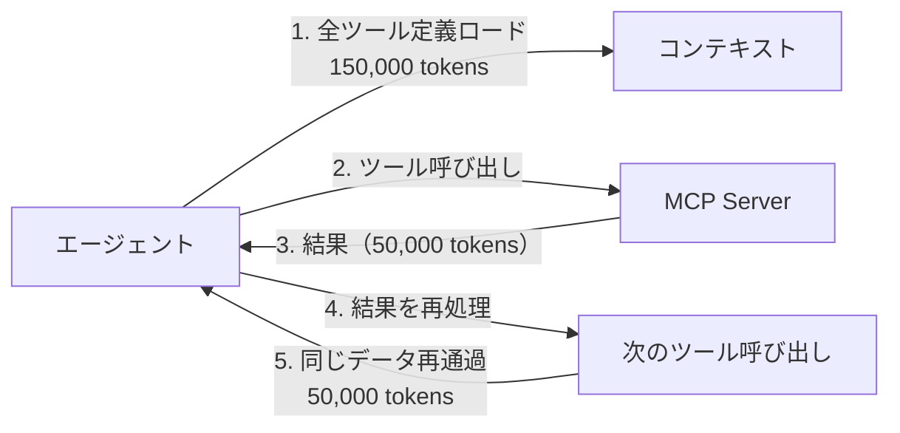
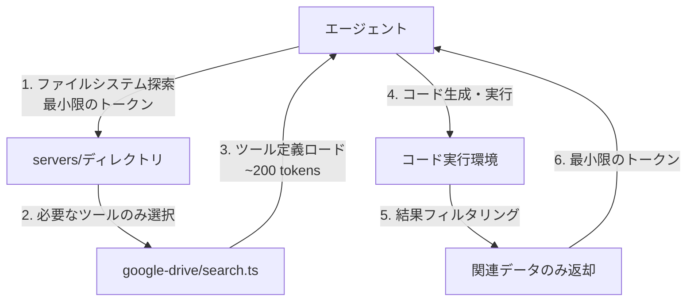

本記事は [https://www.anthropic.com/engineering/code-execution-with-mcp](https://www.anthropic.com/engineering/code-execution-with-mcp) の解説記事です。

## ブログ概要（Summary）

Anthropicのエンジニアリングブログ「Code Execution with MCP」（2025年11月4日公開）は、Model Context Protocol（MCP）のツール定義をコードAPI形式で提供することで、エージェントのトークン消費を**98.7%削減**し、レイテンシとプライバシーの両面でも改善を実現するアーキテクチャパターンを提案している。従来のMCPの「ツール定義を事前ロード→直接呼び出し」方式に対し、「ファイルシステム探索→必要なツールのみオンデマンドロード→コードで制御」という段階的開示（Progressive Disclosure）アプローチを採用する。

この記事は [Zenn記事: MCP・A2A・ACP時代のマルチエージェント通信設計 実践パターン集](https://zenn.dev/0h_n0/articles/9004c89e7b46fd) の深掘りです。

## 情報源

- **種別**: 企業テックブログ（Anthropic Engineering Blog）
- **URL**: [https://www.anthropic.com/engineering/code-execution-with-mcp](https://www.anthropic.com/engineering/code-execution-with-mcp)
- **組織**: Anthropic
- **著者**: Adam Jones, Conor Kelly
- **発表日**: 2025年11月4日

## 技術的背景（Technical Background）

### MCPの標準的な使用パターンと課題

MCPはエージェントが外部ツール・データソースに接続するための標準プロトコルであるが、著者らは標準的な使用パターンにおいて以下の2つのスケーラビリティ課題を指摘している：

**課題1: ツール定義のオーバーヘッド**

エージェントが接続するMCPサーバーが増えるにつれ、事前にロードされるツール定義がコンテキストウィンドウを圧迫する。ブログの例では、数千のツールに接続した場合、ツール定義だけで**150,000トークン以上**を消費する可能性があると報告されている。

$$
\text{Token}\_\text{overhead} = \sum_{i=1}^{N} \text{tokens}(\text{tool\_definition}_i)
$$

ここで $N$ は接続されたツールの総数である。$N$ が数千に達すると、実際のユーザーリクエストの処理に使えるコンテキストが大幅に制限される。

**課題2: 中間結果の肥大化**

エージェントがMCPツールを直接呼び出す場合、取得した結果がすべてモデルのコンテキストに流入する。著者らは、ミーティングのトランスクリプトを取得してCRMに添付するケースを例に挙げ、同じデータが**50,000トークン以上**として2回コンテキストを通過する問題を指摘している。

### 従来方式の限界



この方式では、ツール数の増加に伴いトークン消費が線形に増大し、コスト・レイテンシの両面で実用的な上限に達する。

## 実装アーキテクチャ（Architecture）

### コードAPI方式の提案

著者らの提案は、MCPサーバーの機能を**ファイルシステム形式のコードAPI**として提供することである：

```
servers/
├── google-drive/
│   ├── list_files.ts
│   ├── read_file.ts
│   └── search.ts
├── salesforce/
│   ├── query_contacts.ts
│   ├── create_record.ts
│   └── update_record.ts
└── slack/
    ├── send_message.ts
    ├── list_channels.ts
    └── search_messages.ts
```

エージェントはこのファイルシステムを探索し、必要なツール定義のみをオンデマンドでロードする。著者らはこのアプローチにより、ツール定義のトークン消費が**150,000トークンから約2,000トークンへ、98.7%削減**されたと報告している。

$$
\text{Token}\_\text{reduction} = 1 - \frac{\text{tokens}\_\text{on-demand}}{\text{tokens}\_\text{upfront}} = 1 - \frac{2{,}000}{150{,}000} \approx 0.987
$$

### Progressive Disclosure（段階的開示）

コードAPI方式の核心は**Progressive Disclosure**パターンである：



このパターンでは、エージェントは以下の3段階で情報にアクセスする：

1. **探索**: ディレクトリ構造を確認し、利用可能なサーバーとツールを把握
2. **選択**: タスクに必要なツール定義のみをロード
3. **実行**: TypeScriptコードを生成し、コード実行環境で直接実行

### 制御フローの効率化

従来のツール直接呼び出し方式では、ループ・条件分岐・エラーハンドリングをすべてモデルの推論ステップとして処理する必要があった。コードAPI方式では、これらがネイティブなコードとして実行されるため、モデルの推論回数が大幅に削減される。

**従来方式（3回のモデル推論）**:
1. ツール呼び出し → 結果取得 → 次の判断
2. 条件分岐 → ツール呼び出し → 結果取得
3. 最終結果の生成

**コードAPI方式（1回のモデル推論）**:
1. タスクに必要なコード生成 → コード実行環境で全処理実行 → 結果返却

```python
from dataclasses import dataclass
from typing import Any

@dataclass
class CodeExecutionResult:
    """コード実行環境からの戻り値。"""
    success: bool
    output: Any
    tokens_consumed: int
    execution_time_ms: float

async def execute_mcp_via_code(
    task: str,
    available_servers: list[str],
    code: str,
    sandbox_config: dict
) -> CodeExecutionResult:
    """MCPツールをコード経由で実行。

    エージェントが生成したコードをサンドボックス内で実行し、
    結果のみをモデルのコンテキストに返却する。
    中間結果はサンドボックス内に留まり、トークン消費を抑制する。
    """
    # サンドボックス内でコード実行
    # 中間データはコンテキストに流入しない
    # フィルタリング済みの結果のみ返却
    pass
```

### プライバシー保護

コードAPI方式の副次的な利点として、著者らはプライバシー保護を挙げている：

- **中間結果の隔離**: MCP呼び出しの中間結果はコード実行環境内に留まり、モデルのコンテキストには流入しない
- **PII自動トークン化**: MCPクライアントが個人識別情報（PII）を自動的にトークン化し、モデルへの露出を防止
- **最小限のデータ返却**: 10,000行のスプレッドシートデータを取得する場合、コード実行環境内でフィルタリング・集約し、関連するサブセットのみをモデルに返却

## パフォーマンス最適化（Performance）

### 定量的な改善

ブログで報告されている改善指標は以下の通りである：

| 指標 | 従来方式 | コードAPI方式 | 改善率 |
|------|---------|-------------|--------|
| ツール定義のトークン消費 | 150,000 tokens | ~2,000 tokens | 98.7%削減 |
| 中間結果のコンテキスト通過 | 全データ通過 | フィルタリング後のみ | 大幅削減 |
| モデル推論回数（ループ処理） | N回（ループ回数） | 1回（コード生成） | O(N)→O(1) |

### トレードオフ

著者らはコードAPI方式のトレードオフも明示している：

1. **セキュアサンドボックスの必要性**: コード実行にはサンドボックス環境（リソース制限、ネットワーク隔離等）が必須
2. **コード生成の信頼性**: モデルが生成するコードの品質がタスク成功率に直結する
3. **監視インフラ**: コード実行のログ・メトリクス収集のためのインフラが必要
4. **デバッグの複雑さ**: コード実行のエラーがモデル側のエラーと混同される可能性がある

## 運用での学び（Production Lessons）

### Cloudflareによる独立検証

ブログでは、Cloudflareが独立して同様の「Code Mode」アプローチを公開したことが言及されている。これは、コードAPI方式がAnthropicの独自手法ではなく、業界で広く認識されつつあるアーキテクチャパターンであることを示唆している。

### MCPエコシステムの急成長

2024年11月のMCP公開以降、コミュニティが構築したMCPサーバーは数千に達している。Python・TypeScript・Java等の主要言語向けSDKが提供されており、2025年12月にはAnthropicがMCPをLinux Foundation傘下のAgentic AI Foundation（AAIF）に寄贈している。この急成長が、ツール数増加に伴うスケーラビリティ課題を顕在化させた背景にある。

### 状態永続化による再開可能ワークフロー

コードAPI方式では、エージェントがファイルシステムを通じて作業状態を永続化できる。これにより、コンテキストウィンドウの制約を超えた長時間タスクの再開や、タスク間でのスキル再利用が可能になる。

## 学術研究との関連（Academic Connection）

コードAPI方式は、以下の学術的概念と関連がある：

- **Code-as-Action（Liang et al., 2023）**: LLMがアクションをコードとして表現するパラダイム。MCPの文脈では、ツール呼び出しの連鎖をプログラムとして記述することに相当する
- **Tool-Augmented LLMs**: Toolformer等の研究で確立されたLLMのツール利用パターン。コードAPI方式はこの概念をMCPプロトコル上で発展させたものと位置づけられる
- **Lazy Evaluation**: 関数型プログラミングの遅延評価概念と類似。ツール定義を「必要になるまでロードしない」Progressive Disclosureは遅延評価の実践的な適用である

## まとめと実践への示唆

Anthropicの「Code Execution with MCP」ブログは、MCPの標準的な使用パターンにおけるスケーラビリティ課題を特定し、コードAPI方式による解決策を提案している。98.7%のトークン削減という定量的な改善は、エージェントが数百〜数千のツールに接続するエンタープライズ環境において特に意義が大きい。

Zenn記事で解説されているMCPの「エージェント⇔ツール間の垂直統合」という役割は変わらないが、コードAPI方式はMCPのスケーラビリティを大幅に向上させる。特に、MCPサーバーの数が増加する本番環境では、Progressive Disclosureパターンの採用が推奨される。

コード実行環境のセキュリティ（サンドボックス化、リソース制限）と監視（実行ログ、メトリクス）のインフラ投資が前提となるが、トークンコスト削減とレイテンシ改善のROIは十分に高いと考えられる。

## 参考文献

- **Blog URL**: [https://www.anthropic.com/engineering/code-execution-with-mcp](https://www.anthropic.com/engineering/code-execution-with-mcp)
- **MCP公式**: [https://modelcontextprotocol.io](https://modelcontextprotocol.io)
- **MCP GitHub**: [https://github.com/modelcontextprotocol](https://github.com/modelcontextprotocol)
- **AAIF発表**: [https://www.anthropic.com/news/donating-the-model-context-protocol-and-establishing-of-the-agentic-ai-foundation](https://www.anthropic.com/news/donating-the-model-context-protocol-and-establishing-of-the-agentic-ai-foundation)
- **Related Zenn article**: [https://zenn.dev/0h_n0/articles/9004c89e7b46fd](https://zenn.dev/0h_n0/articles/9004c89e7b46fd)
