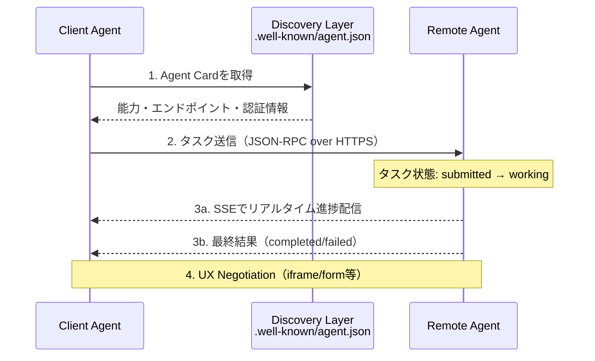
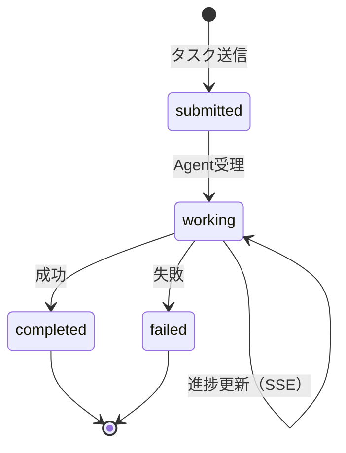

本記事は [https://developers.googleblog.com/en/a2a-a-new-era-of-agent-interoperability/](https://developers.googleblog.com/en/a2a-a-new-era-of-agent-interoperability/) の解説記事です。

## ブログ概要（Summary）

2025年4月9日、GoogleはAgent2Agent（A2A）プロトコルを公式に発表した。A2Aは、異なるフレームワークやプロバイダで構築されたAIエージェント同士が安全に通信・協調するためのオープンプロトコルである。Atlassian、Salesforce、SAP、PayPal、LangChainを含む50社以上のテクノロジーパートナーと、Accenture、McKinsey、Deloitte等のコンサルティングファームが参画を表明している。

このブログは、A2Aプロトコルの設計原則・アーキテクチャ・ユースケースを開発元であるGoogle自身が解説した1次情報であり、プロトコルの設計意図を理解する上で最も権威のあるソースである。

この記事は [Zenn記事: MCP・A2A・ACP時代のマルチエージェント通信設計 実践パターン集](https://zenn.dev/0h_n0/articles/9004c89e7b46fd) の深掘りです。

## 情報源

- **種別**: 企業テックブログ（Google Developers Blog）
- **URL**: [https://developers.googleblog.com/en/a2a-a-new-era-of-agent-interoperability/](https://developers.googleblog.com/en/a2a-a-new-era-of-agent-interoperability/)
- **組織**: Google Cloud / Business Application Platform
- **著者**: Rao Surapaneni（VP and GM）、Miku Jha（Director, AI/ML Partner Engineering）、Michael Vakoc（Product Manager）、Todd Segal（Principal Engineer）
- **発表日**: 2025年4月9日

## 技術的背景（Technical Background）

### なぜA2Aが必要だったのか

AIエージェントの急速な普及に伴い、企業環境では異なるフレームワーク（LangGraph、CrewAI、Semantic Kernel、独自実装等）で構築された複数のエージェントが共存する状況が一般的になりつつある。しかし、ブログの著者らが指摘する課題は以下の通りである：

1. **フレームワーク間の非互換性**: LangGraphで構築したエージェントとCrewAIのエージェントが直接通信する標準的な方法が存在しなかった
2. **内部実装の公開問題**: 従来のAPI連携では、エージェントの内部ロジック（プロンプト、メモリ構造等）を相手側に公開する必要がある場合があった
3. **タスクの非同期性**: エージェントのタスクは数秒から数時間かかる場合があり、同期的なHTTPリクエスト/レスポンスでは対応困難

### 学術研究との関連

A2Aの設計思想は、マルチエージェントシステム（MAS）研究の歴史的な知見に基づいている。FIPAのAgent Communication Language（ACL）やContract Net Protocol（CNP）の概念がモダンなWeb技術上に再実装されたものと解釈できる。特にAgent Cardの概念は、FIPAのDirectory Facilitator（DF）に対応する。

## 実装アーキテクチャ（Architecture）

### 5つの設計原則

ブログでは、A2Aの5つの設計原則が明示されている：

| 原則 | 内容 |
|------|------|
| **Agentic Capabilities** | 非構造化な協調を前提とし、エージェントがリジッドなAPIではなく柔軟に交渉・協調できる |
| **Existing Standards** | HTTP、SSE（Server-Sent Events）、JSON-RPCなど既存のWeb標準上に構築する |
| **Enterprise Security** | OpenAPIと同等の認証パリティを持ち、OAuth 2.0・mTLSをデフォルトサポート |
| **Long-running Tasks** | 数秒から数時間のタスクをサポートし、リアルタイムフィードバックを提供する |
| **Multimodal** | テキスト・音声・映像・Webフォーム等、複数のモダリティに対応する |

### コアアーキテクチャ

A2Aのアーキテクチャは3つのコンポーネントで構成される：



**Client Agent**: タスクを策定し、適切なRemote Agentにディスパッチする。Zenn記事のStar型トポロジにおけるオーケストレーターに相当する。

**Remote Agent**: タスクを受理し、実行する。エージェントの内部実装は「opaque」（不透明）として扱われ、Client Agentからは見えない。

**Agent Card**: JSON形式のメタデータファイルで、`.well-known/agent.json`に配置される。以下のフィールドを含む：

```json
{
  "name": "research-agent",
  "description": "学術論文と技術ブログの検索・要約を行うエージェント",
  "url": "https://agents.example.com/research",
  "version": "1.0.0",
  "capabilities": {
    "streaming": true,
    "pushNotifications": false
  },
  "skills": [
    {
      "id": "paper-search",
      "name": "論文検索",
      "description": "arXiv・Semantic Scholarから論文を検索し要約する",
      "inputModes": ["text/plain"],
      "outputModes": ["application/json", "text/markdown"]
    }
  ],
  "authentication": {
    "schemes": ["OAuth2"]
  }
}
```

### タスクライフサイクル管理

A2Aではタスクが明確な状態遷移を持つ：



長時間タスクの場合、Client AgentはSSEストリームを通じてリアルタイムの進捗情報を受信できる。これはHTTPのポーリングを回避し、通信効率を向上させる設計である。

### UX Negotiation

A2Aの特徴的な機能の1つが**UX Negotiation**である。Remote Agentは結果をテキストだけでなく、iframe、Webフォーム、動画等の形式で返すことができ、Client AgentとRemote Agent間でコンテンツの表示形式を交渉する。この機能は、ブログで紹介されている採用ワークフローの例で、候補者情報の表示やスケジュール調整UIの動的生成に活用されている。

## パートナーエコシステム

### テクノロジーパートナー（50社以上）

ブログで明示的に名前が挙がっているパートナーは以下の通りである：

**プラットフォーム**: Atlassian、Box、Intuit、PayPal、Salesforce、SAP、ServiceNow、UKG、Workday

**AI/ML**: Cohere、LangChain、MongoDB

**コンサルティング**: Accenture、BCG、Capgemini、Cognizant、Deloitte、HCLTech、Infosys、KPMG、McKinsey、PwC、TCS、Wipro

### パートナーシップの意義

このパートナーシップの規模は、A2Aが単なる技術仕様ではなくエンタープライズ標準として位置づけられていることを示している。特にSalesforce、SAP、ServiceNowといったエンタープライズSaaSの主要プレイヤーが参加していることは、A2Aが既存のビジネスワークフローへの統合を前提として設計されていることを裏付ける。

2026年4月時点では、A2Aは2025年6月にLinux Foundationへ移管され、参画企業は150社以上に拡大している。

## パフォーマンス最適化（Performance）

### 通信効率

A2AはJSON-RPC over HTTPSを採用しており、RESTful APIと比較して以下の利点がある：

- **バッチ処理**: JSON-RPCのバッチリクエストにより、複数の操作を1回のHTTPリクエストで送信可能
- **SSEによる非同期通信**: 長時間タスクの進捗をポーリングなしで受信（コネクション保持のオーバーヘッドあり）
- **Agent Cardキャッシュ**: 一度取得したAgent Cardはキャッシュ可能（TTL設定による鮮度管理が必要）

### セキュリティモデル

ブログではエンタープライズグレードのセキュリティが設計原則として強調されている：

- **OAuth 2.0**: 標準的なトークンベース認証。エンタープライズIAMとの統合が容易
- **mTLS**: クライアント証明書による相互認証。ゼロトラストアーキテクチャとの親和性が高い
- **OpenAPIパリティ**: 既存のAPIゲートウェイ（AWS API Gateway、Apigee等）との互換性

## 運用での学び（Production Lessons）

ブログ自体はプロトコル発表時のものであるため、運用実績の詳細は含まれていない。しかし、発表後の展開として以下が確認されている：

- **2025年6月**: A2AがLinux Foundationに移管され、オープンガバナンスに移行
- **2025年8月**: IBMのACP（Agent Communication Protocol）がA2Aに統合。ACPのREST型シンプルさとA2AのAgent Card・SSE機能が融合
- **2026年4月**: 参画企業が150社以上に拡大。AWS、Microsoft、Ciscoなどが加わり、クラウドプロバイダーの全面的なサポートが確認されている

### Agent Card管理の課題

実運用で報告されている課題として、Agent Cardの**バージョン管理とデプロイ同期**がある。エージェントの能力が更新された際にAgent Cardが更新されていない場合、Client Agentが旧仕様でタスクを送信し失敗するケースが発生する。Zenn記事の「よくある問題と解決方法」テーブルで「Agent Card未更新」が挙げられているのはこの問題に対応している。

## 学術研究との関連（Academic Connection）

A2Aの設計は以下の学術研究と関連がある：

- **FIPAのAgent Communication Language**: 1990年代のマルチエージェント通信標準。A2AのAgent CardはFIPAのDirectory Facilitator（エージェント登録・検出サービス）の現代版と位置づけられる
- **Contract Net Protocol (Smith, 1980)**: タスクのアナウンス→入札→割り当てのプロトコル。A2Aのタスクライフサイクルはこの概念をモダンなWeb技術上に再実装したものと解釈できる
- **BDIアーキテクチャ**: Belief-Desire-Intention モデル。A2AのAgent Cardにおける「skills」フィールドはエージェントのIntention（意図）を宣言する仕組みとして機能する

## まとめと実践への示唆

GoogleのA2Aプロトコル発表は、マルチエージェントシステムの通信標準化における重要なマイルストーンである。50社以上の初期パートナーシップ、OAuth 2.0/mTLSによるエンタープライズセキュリティ、SSEによる長時間タスクサポートなど、実務レベルの要件が設計原則に組み込まれている。

AnthropicのMCPが「エージェント→ツール」の垂直統合に特化するのに対し、A2Aは「エージェント→エージェント」の水平通信に特化しており、両者は補完関係にある。Zenn記事で解説されている「MCP + A2Aの組み合わせ」パターンは、Googleのブログでも「A2A complements Anthropic's MCP」と明記されており、プロトコル開発元による公式な推奨であることが確認された。

実務では、まずMCPでツール接続基盤を構築し、次にA2AのAgent Cardを定義して異種エージェント間の協調を実現するというステップが推奨される。

## 参考文献

- **Blog URL**: [https://developers.googleblog.com/en/a2a-a-new-era-of-agent-interoperability/](https://developers.googleblog.com/en/a2a-a-new-era-of-agent-interoperability/)
- **A2A GitHub**: [https://github.com/a2aproject/A2A](https://github.com/a2aproject/A2A)
- **A2A Protocol Spec**: [https://a2a-protocol.org/latest/](https://a2a-protocol.org/latest/)
- **Linux Foundation移管**: [https://www.prnewswire.com/news-releases/a2a-protocol-surpasses-150-organizations-302737641.html](https://www.prnewswire.com/news-releases/a2a-protocol-surpasses-150-organizations-302737641.html)
- **Related Zenn article**: [https://zenn.dev/0h_n0/articles/9004c89e7b46fd](https://zenn.dev/0h_n0/articles/9004c89e7b46fd)
