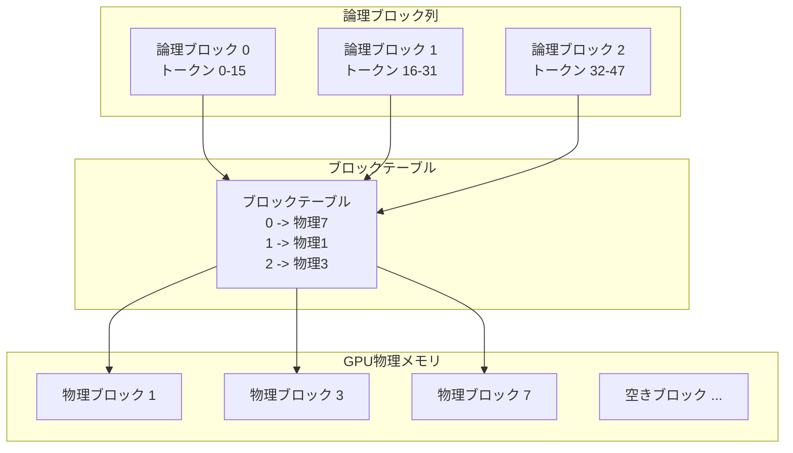
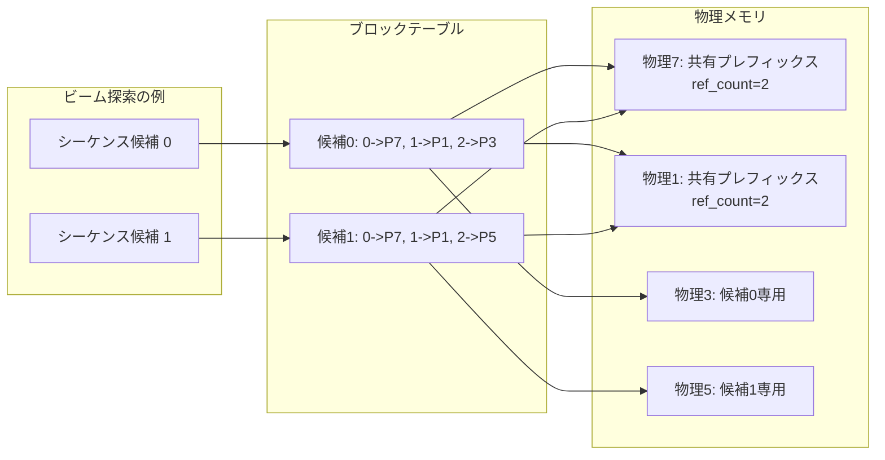

本記事は [Efficient Memory Management for Large Language Model Serving with PagedAttention](https://arxiv.org/abs/2309.06180) の解説記事です。

## 論文概要（Abstract）

PagedAttentionは、OSの仮想メモリにおけるページング機構をLLM推論のKVキャッシュ管理に応用したアテンションアルゴリズムである。著者らは、既存のLLMサービングシステムにおいてKVキャッシュのメモリ管理が非効率であり、メモリの60〜80%が断片化や予約過多により浪費されていると報告している。PagedAttentionを中核に据えたvLLMシステムは、KVキャッシュのメモリ浪費をほぼゼロに近づけ、リクエスト内・リクエスト間で柔軟なKVキャッシュ共有を実現する。評価実験では、HuggingFace Transformers比で最大24倍、HuggingFace TGI比で2〜4倍のスループット向上が報告されている。

この記事は [Zenn記事: Claude・OpenAI・Geminiのプロンプトキャッシュ実装術 コスト90%削減の実践ガイド](https://zenn.dev/0h_n0/articles/ab0054956c2684) の深掘りです。

## 情報源

- **arXiv ID**: 2309.06180
- **URL**: [https://arxiv.org/abs/2309.06180](https://arxiv.org/abs/2309.06180)
- **著者**: Woosuk Kwon, Zhuohan Li, Siyuan Zhuang et al.
- **発表年**: 2023（SOSP 2023）
- **分野**: cs.LG, cs.DC

## 背景と動機（Background & Motivation）

LLMの推論処理において、Transformer各層のKey-Valueテンソル（KVキャッシュ）はトークン生成のたびに蓄積され、大量のGPUメモリを消費する。例えばOPT-13Bモデルにおいて、1リクエストあたりのKVキャッシュは最大1.7GBに達する（論文Section 2.2より）。

著者らは、既存システムのKVキャッシュ管理には以下の3つの非効率性があると指摘している：

1. **予約過多（Reservation waste）**: 最大出力長に対応するメモリを事前に確保するため、実際の出力が短い場合に大量のメモリが無駄になる
2. **内部断片化（Internal fragmentation）**: 固定長のメモリスロットに可変長のシーケンスを格納するため、スロット末尾に未使用領域が生じる
3. **外部断片化（External fragmentation）**: リクエストの完了と開始が繰り返される中で、連続メモリ領域が確保できなくなる

これらの問題により、既存システムではメモリの20〜38%が断片化で浪費されていると著者らは報告している（論文Table 3より）。この非効率性が同時処理可能なリクエスト数を制限し、スループットのボトルネックとなっていた。

## 主要な貢献（Key Contributions）

- **貢献1: PagedAttentionアルゴリズム** — OSの仮想メモリページングに着想を得た新しいアテンション機構。KVキャッシュを固定サイズのブロックに分割し、非連続な物理メモリ上に配置することで断片化を解消する
- **貢献2: vLLMシステム** — PagedAttentionを中核とするLLMサービングエンジン。ブロックテーブルによる論理-物理アドレス変換、Copy-on-Write（CoW）によるメモリ共有を実装
- **貢献3: メモリ共有機構** — ビーム探索やパラレルサンプリングにおいて、共通プレフィックスのKVキャッシュを物理ブロック共有で実現し、メモリ使用量を大幅に削減

## 技術的詳細（Technical Details）

### KVキャッシュとメモリ問題

Transformerの自己回帰生成において、各トークンの生成にはそれまでの全トークンのKey-Valueペアが必要となる。標準的なアテンション計算は以下の通りである：

$$
\text{Attention}(Q, K, V) = \text{softmax}\left(\frac{QK^T}{\sqrt{d_k}}\right)V
$$

ここで、
- $Q \in \mathbb{R}^{1 \times d_k}$: 現在のトークンのQuery（デコード時は1トークン分）
- $K \in \mathbb{R}^{s \times d_k}$: 過去全トークンのKeyキャッシュ（$s$はシーケンス長）
- $V \in \mathbb{R}^{s \times d_v}$: 過去全トークンのValueキャッシュ
- $d_k$: Keyの次元数

1トークンあたりのKVキャッシュサイズは以下で算出される：

$$
\text{KV size per token} = 2 \times n_{\text{layers}} \times n_{\text{heads}} \times d_{\text{head}} \times \text{sizeof(dtype)}
$$

ここで、
- $n_{\text{layers}}$: Transformer層数
- $n_{\text{heads}}$: アテンションヘッド数
- $d_{\text{head}}$: ヘッドあたりの次元数
- $\text{sizeof(dtype)}$: データ型のバイト数（FP16なら2バイト）

例えばOPT-13B（40層、40ヘッド、128次元/ヘッド、FP16）では、1トークンあたり約800KBのKVキャッシュが必要であり、最大シーケンス長2048トークンで約1.7GB/リクエストとなる。

### PagedAttentionのメモリ管理

PagedAttentionは、OSの仮想メモリページング機構と同じ概念をKVキャッシュ管理に導入する。以下にその対応関係を示す：

| OS仮想メモリ | PagedAttention |
|-------------|----------------|
| ページ | KVブロック（デフォルト16トークン分） |
| ページテーブル | ブロックテーブル |
| 仮想アドレス空間 | 論理KVブロック列 |
| 物理メモリフレーム | GPUメモリ上の物理KVブロック |
| ページフォルト | 新ブロックのオンデマンド確保 |



論理ブロックは連続した番号を持つが、対応する物理ブロックはGPUメモリ上の任意の位置に配置される。この非連続配置により、外部断片化が解消される。内部断片化は最後のブロックのみに限定され、ブロックサイズが16トークンの場合、最悪でも15トークン分（全体の4%未満）の浪費に抑えられる。

### PagedAttentionカーネルの計算

PagedAttentionでは、アテンション計算時にブロックテーブルを参照して物理メモリから必要なKVブロックを取得する。アテンションスコアの計算は以下のようにブロック単位で行われる：

$$
A_j = \frac{Q \cdot K_j^T}{\sqrt{d_k}}, \quad j = 0, 1, \ldots, \lceil s/B \rceil - 1
$$

$$
\text{output} = \text{softmax}\left(\text{concat}(A_0, A_1, \ldots)\right) \cdot \text{concat}(V_0, V_1, \ldots)
$$

ここで、
- $B$: ブロックサイズ（デフォルト16）
- $K_j, V_j$: $j$番目の物理ブロック内のKey, Valueテンソル
- $\lceil s/B \rceil$: 必要なブロック数

各ブロックのKey, Valueは物理メモリ上の非連続位置にあるため、カーネル内でブロックテーブルを参照してアドレスを解決する。この間接参照のオーバーヘッドは、メモリアクセスパターンの最適化（coalesced accessの維持）により無視できるレベルに抑えられていると著者らは報告している。

### Copy-on-Write（CoW）によるメモリ共有

ビーム探索やパラレルサンプリングでは、複数のシーケンス候補が共通のプレフィックスを持つ。PagedAttentionはOSのCopy-on-Write機構を導入し、共通プレフィックス部分の物理ブロックを共有する：



各物理ブロックは参照カウント（`ref_count`）を持ち、複数の論理ブロックから参照される場合は共有状態を維持する。あるシーケンスがブロックに書き込む必要が生じた場合にのみ、ブロックをコピーして独立させる。これにより、ビーム幅$k$のビーム探索において、共通プレフィックス部分のメモリ使用量を最大$1/k$に削減できる。

### アルゴリズム

以下にPagedAttentionのブロック割り当てとアテンション計算の概要を示す：

```python
import torch
from dataclasses import dataclass, field


@dataclass
class PhysicalBlock:
    """GPU上の物理KVブロック"""
    block_id: int
    ref_count: int = 0
    key_cache: torch.Tensor | None = None    # (block_size, n_heads, d_head)
    value_cache: torch.Tensor | None = None  # (block_size, n_heads, d_head)


@dataclass
class BlockTable:
    """論理->物理ブロックのマッピングテーブル"""
    entries: list[int] = field(default_factory=list)  # 物理ブロックIDのリスト

    def append(self, physical_block_id: int) -> None:
        """新しいマッピングを追加"""
        self.entries.append(physical_block_id)

    def get_physical_block(self, logical_idx: int) -> int:
        """論理ブロックインデックスから物理ブロックIDを取得"""
        return self.entries[logical_idx]


class BlockAllocator:
    """物理ブロックのアロケータ（OSのフレームアロケータに相当）"""

    def __init__(self, num_blocks: int, block_size: int, n_heads: int, d_head: int):
        self.block_size = block_size
        self.free_blocks: list[int] = list(range(num_blocks))
        self.blocks: dict[int, PhysicalBlock] = {
            i: PhysicalBlock(block_id=i) for i in range(num_blocks)
        }

    def allocate(self) -> int:
        """空きブロックを1つ確保して返す

        Returns:
            確保した物理ブロックのID

        Raises:
            RuntimeError: 空きブロックがない場合
        """
        if not self.free_blocks:
            raise RuntimeError("Out of memory: no free blocks")
        block_id = self.free_blocks.pop()
        self.blocks[block_id].ref_count = 1
        return block_id

    def free(self, block_id: int) -> None:
        """物理ブロックを解放（ref_countが0になった場合のみ）"""
        block = self.blocks[block_id]
        block.ref_count -= 1
        if block.ref_count == 0:
            self.free_blocks.append(block_id)

    def copy_on_write(self, block_id: int) -> int:
        """CoW: 共有ブロックのコピーを作成

        Args:
            block_id: コピー元の物理ブロックID

        Returns:
            新しい物理ブロックのID
        """
        new_block_id = self.allocate()
        src = self.blocks[block_id]
        dst = self.blocks[new_block_id]
        if src.key_cache is not None:
            dst.key_cache = src.key_cache.clone()
            dst.value_cache = src.value_cache.clone()
        src.ref_count -= 1
        return new_block_id
```

## 実装のポイント（Implementation）

vLLMの実装において注意すべき技術的ポイントを以下に示す：

**CUDAカーネル設計**: PagedAttentionカーネルは、ブロックテーブルの間接参照を含みつつもメモリアクセスの効率性を維持する必要がある。著者らはブロック内のトークンを連続メモリに配置し、ワープ単位でブロックを処理することで、GPU上のcoalesced memory accessを実現している。

**動的メモリ管理**: トークン生成のたびにブロックテーブルを更新し、必要に応じて新しい物理ブロックを確保する。ブロック確保はO(1)操作であり、フリーリストからのpop操作で実装されている。

**Preemptionとスケジューリング**: GPUメモリが逼迫した場合、vLLMは優先度の低いリクエストのKVキャッシュをCPUメモリまたはスワップ領域に退避し、GPUメモリを解放する。これはOSのスワップ機構と同様の概念である。

**Prefix Caching（v0.4.0以降）**: `--enable-prefix-caching`フラグにより、異なるリクエスト間で共通プレフィックスの物理ブロックを共有できる。システムプロンプトのように多くのリクエストで共通する入力部分のKVキャッシュを再計算せず再利用する機構であり、APIプロバイダーのプロンプトキャッシュ機能の基盤技術となっている。

**Tensor Parallelism**: `--tensor-parallel-size N`オプションにより複数GPU間でモデルを分割実行する。各GPUが独立したブロックテーブルとKVキャッシュを管理し、アテンション計算を並列化する。

## Production Deployment Guide

### AWS実装パターン（コスト最適化重視）

vLLMを用いたLLM推論サービスをAWS上にデプロイする場合の構成を、トラフィック量別に示す。コスト試算は2026年4月時点のap-northeast-1（東京）リージョン料金に基づく概算値であり、実際のコストはトラフィックパターンやバースト使用量により変動する。

| 構成 | トラフィック | GPUインスタンス | 月額概算 |
|------|------------|----------------|---------|
| Small | ~100 req/日 | g5.xlarge (A10G 24GB) x1 | $800-1,200 |
| Medium | ~1,000 req/日 | g5.2xlarge x2 + ALB | $2,500-4,000 |
| Large | 10,000+ req/日 | p4d.24xlarge (A100 x8) + EKS | $15,000-25,000 |

**Small構成（~100 req/日）**: g5.xlargeインスタンス上でvLLMサーバーを直接起動する。7Bクラスのモデルを24GB GPUに収容し、`--max-model-len 4096`で最大シーケンス長を制限する。Spot Instancesを活用すれば最大70%のコスト削減が可能。

**Medium構成（~1,000 req/日）**: ECS Fargateでコンテナ化し、ALB（Application Load Balancer）で複数vLLMインスタンスに分散する。`--tensor-parallel-size 1`の単一GPUインスタンスを水平スケーリングする構成。Auto Scalingでトラフィックに応じたインスタンス数調整を行う。

**Large構成（10,000+ req/日）**: EKS上でKarpenterによるGPUノードの自動プロビジョニングを行う。p4d.24xlarge（A100 x8）で`--tensor-parallel-size 8`により70Bクラスのモデルを推論する。Spot Instances優先のProvisioner設定で最大90%のコスト削減を実現する。

**コスト削減テクニック**:
- Spot Instances活用で最大90%削減（g5系インスタンス、中断許容ワークロード向け）
- Reserved Instances 1年コミットで最大40%削減
- `--enable-prefix-caching`でシステムプロンプトのKVキャッシュ再利用によりGPU使用効率向上
- `--max-num-batched-tokens`チューニングでバッチ効率最適化

### Terraformインフラコード

**Small構成（Serverless + GPU Instance）**:

```hcl
# vLLM Small構成: g5.xlarge Spot Instance
# 2026-04 時点のTerraform AWS Provider ~> 5.x

terraform {
  required_providers {
    aws = { source = "hashicorp/aws", version = "~> 5.90" }
  }
}

provider "aws" { region = "ap-northeast-1" }

# --- VPC基盤（NAT Gateway不使用でコスト削減） ---
resource "aws_vpc" "vllm" {
  cidr_block           = "10.0.0.0/16"
  enable_dns_hostnames = true
  tags = { Name = "vllm-inference", Project = "vllm-serving" }
}

resource "aws_subnet" "public" {
  vpc_id                  = aws_vpc.vllm.id
  cidr_block              = "10.0.1.0/24"
  map_public_ip_on_launch = true
  availability_zone       = "ap-northeast-1a"
  tags = { Name = "vllm-public" }
}

resource "aws_internet_gateway" "igw" {
  vpc_id = aws_vpc.vllm.id
}

resource "aws_route_table" "public" {
  vpc_id = aws_vpc.vllm.id
  route {
    cidr_block = "0.0.0.0/0"
    gateway_id = aws_internet_gateway.igw.id
  }
}

resource "aws_route_table_association" "public" {
  subnet_id      = aws_subnet.public.id
  route_table_id = aws_route_table.public.id
}

# --- IAMロール（最小権限） ---
resource "aws_iam_role" "vllm_instance" {
  name = "vllm-instance-role"
  assume_role_policy = jsonencode({
    Version = "2012-10-17"
    Statement = [{
      Action = "sts:AssumeRole"
      Effect = "Allow"
      Principal = { Service = "ec2.amazonaws.com" }
    }]
  })
}

resource "aws_iam_role_policy" "cloudwatch" {
  name = "cloudwatch-metrics"
  role = aws_iam_role.vllm_instance.id
  policy = jsonencode({
    Version = "2012-10-17"
    Statement = [{
      Effect   = "Allow"
      Action   = ["cloudwatch:PutMetricData", "logs:CreateLogGroup",
                  "logs:CreateLogStream", "logs:PutLogEvents"]
      Resource = "*"
    }]
  })
}

resource "aws_iam_instance_profile" "vllm" {
  name = "vllm-instance-profile"
  role = aws_iam_role.vllm_instance.name
}

# --- Spot Instance（コスト最適化） ---
resource "aws_spot_instance_request" "vllm" {
  ami                    = "ami-0abcdef1234567890" # Deep Learning AMI (GPU)
  instance_type          = "g5.xlarge"             # A10G 24GB
  spot_price             = "0.50"
  wait_for_fulfillment   = true
  iam_instance_profile   = aws_iam_instance_profile.vllm.name
  subnet_id              = aws_subnet.public.id
  vpc_security_group_ids = [aws_security_group.vllm.id]

  root_block_device {
    volume_size = 100
    volume_type = "gp3"
    encrypted   = true # KMS暗号化
  }

  user_data = base64encode(<<-EOF
    #!/bin/bash
    pip install vllm
    python -m vllm.entrypoints.openai.api_server \
      --model meta-llama/Llama-2-7b-chat-hf \
      --max-model-len 4096 \
      --enable-prefix-caching \
      --port 8000
  EOF
  )

  tags = { Name = "vllm-inference", Environment = "production" }
}

# --- セキュリティグループ ---
resource "aws_security_group" "vllm" {
  vpc_id = aws_vpc.vllm.id

  ingress {
    from_port   = 8000
    to_port     = 8000
    protocol    = "tcp"
    cidr_blocks = ["10.0.0.0/16"] # VPC内部のみ
  }

  egress {
    from_port   = 0
    to_port     = 0
    protocol    = "-1"
    cidr_blocks = ["0.0.0.0/0"]
  }
}

# --- CloudWatchアラーム（コスト監視） ---
resource "aws_cloudwatch_metric_alarm" "gpu_utilization" {
  alarm_name          = "vllm-gpu-low-utilization"
  comparison_operator = "LessThanThreshold"
  evaluation_periods  = 6
  metric_name         = "GPUUtilization"
  namespace           = "Custom/vLLM"
  period              = 300
  statistic           = "Average"
  threshold           = 10
  alarm_description   = "GPU利用率が10%未満の場合アラート（コスト最適化）"
}
```

**Large構成（EKS + Karpenter）**:

```hcl
# vLLM Large構成: EKS + Karpenter (Spot優先)
module "eks" {
  source          = "terraform-aws-modules/eks/aws"
  version         = "~> 20.31"
  cluster_name    = "vllm-cluster"
  cluster_version = "1.31"
  vpc_id          = aws_vpc.vllm.id
  subnet_ids      = [aws_subnet.public.id]

  # Karpenter用IAM
  enable_cluster_creator_admin_permissions = true
}

# --- Karpenter Provisioner（Spot優先、GPU自動スケーリング） ---
resource "kubectl_manifest" "karpenter_nodepool" {
  yaml_body = yamlencode({
    apiVersion = "karpenter.sh/v1"
    kind       = "NodePool"
    metadata   = { name = "gpu-inference" }
    spec = {
      template = {
        spec = {
          requirements = [
            { key = "node.kubernetes.io/instance-type", operator = "In",
              values = ["p4d.24xlarge", "g5.12xlarge", "g5.48xlarge"] },
            { key = "karpenter.sh/capacity-type", operator = "In",
              values = ["spot", "on-demand"] },  # Spot優先
          ]
          nodeClassRef = { name = "gpu-nodes" }
        }
      }
      limits   = { cpu = "256", "nvidia.com/gpu" = "32" }
      disruption = { consolidationPolicy = "WhenEmpty" }
    }
  })
}

# --- AWS Budgets（予算アラート） ---
resource "aws_budgets_budget" "vllm_monthly" {
  name         = "vllm-monthly-budget"
  budget_type  = "COST"
  limit_amount = "20000"
  limit_unit   = "USD"
  time_unit    = "MONTHLY"

  notification {
    comparison_operator       = "GREATER_THAN"
    threshold                 = 80
    threshold_type            = "PERCENTAGE"
    notification_type         = "ACTUAL"
    subscriber_email_addresses = ["ops-team@example.com"]
  }
}
```

### 運用・監視設定

**CloudWatch Logs Insights クエリ**（vLLMメトリクス分析）:

```
# スループット・レイテンシ分析（P95, P99）
fields @timestamp, latency_ms, tokens_per_second, num_batched_requests
| stats percentile(latency_ms, 95) as p95_latency,
        percentile(latency_ms, 99) as p99_latency,
        avg(tokens_per_second) as avg_throughput
  by bin(1h)
| sort @timestamp desc

# GPUメモリ使用率の異常検知
fields @timestamp, gpu_memory_used_gb, gpu_memory_total_gb
| stats avg(gpu_memory_used_gb / gpu_memory_total_gb * 100) as avg_util
  by bin(5m)
| filter avg_util > 95
```

**CloudWatchアラーム設定（Python boto3）**:

```python
import boto3

cloudwatch = boto3.client("cloudwatch", region_name="ap-northeast-1")

def create_vllm_alarms() -> None:
    """vLLM推論サーバーの監視アラームを作成"""
    # GPU メモリ使用率スパイク検知
    cloudwatch.put_metric_alarm(
        AlarmName="vllm-gpu-memory-spike",
        MetricName="GPUMemoryUtilization",
        Namespace="Custom/vLLM",
        Statistic="Average",
        Period=60,
        EvaluationPeriods=3,
        Threshold=95.0,
        ComparisonOperator="GreaterThanThreshold",
        AlarmActions=["arn:aws:sns:ap-northeast-1:123456789012:ops-alerts"],
        AlarmDescription="GPU memory > 95% for 3min — risk of OOM",
    )
    # レイテンシP99異常検知
    cloudwatch.put_metric_alarm(
        AlarmName="vllm-latency-p99",
        MetricName="InferenceLatencyP99",
        Namespace="Custom/vLLM",
        Statistic="Maximum",
        Period=300,
        EvaluationPeriods=2,
        Threshold=5000.0,  # 5秒
        ComparisonOperator="GreaterThanThreshold",
        AlarmActions=["arn:aws:sns:ap-northeast-1:123456789012:ops-alerts"],
        AlarmDescription="Inference P99 latency > 5s",
    )
```

**X-Rayトレーシング設定**:

```python
from aws_xray_sdk.core import xray_recorder, patch_all

xray_recorder.configure(service="vllm-inference")
patch_all()  # boto3自動計装

def trace_inference_request(prompt: str, model: str) -> dict:
    """推論リクエストをX-Rayでトレーシング"""
    segment = xray_recorder.begin_segment("inference")
    segment.put_annotation("model", model)
    segment.put_metadata("prompt_length", len(prompt))
    try:
        result = call_vllm_api(prompt, model)
        segment.put_metadata("output_tokens", result["usage"]["completion_tokens"])
        return result
    finally:
        xray_recorder.end_segment()
```

**Cost Explorer日次レポート（Python）**:

```python
import boto3
from datetime import date, timedelta

ce = boto3.client("ce", region_name="us-east-1")
sns = boto3.client("sns", region_name="ap-northeast-1")

def daily_cost_report() -> None:
    """日次コストレポートを取得し、閾値超過時にSNS通知"""
    today = date.today()
    yesterday = today - timedelta(days=1)
    resp = ce.get_cost_and_usage(
        TimePeriod={"Start": str(yesterday), "End": str(today)},
        Granularity="DAILY",
        Metrics=["UnblendedCost"],
        Filter={"Tags": {"Key": "Project", "Values": ["vllm-serving"]}},
        GroupBy=[{"Type": "DIMENSION", "Key": "SERVICE"}],
    )
    total = sum(
        float(g["Metrics"]["UnblendedCost"]["Amount"])
        for g in resp["ResultsByTime"][0]["Groups"]
    )
    if total > 500:  # $500/日超過でアラート
        sns.publish(
            TopicArn="arn:aws:sns:ap-northeast-1:123456789012:cost-alerts",
            Subject="vLLM Daily Cost Alert",
            Message=f"Yesterday cost: ${total:.2f} (threshold: $500)",
        )
```

### コスト最適化チェックリスト

**アーキテクチャ選択**:
- [ ] トラフィック量に応じた構成選択（Small/Medium/Large）
- [ ] GPU世代の選択（A10G vs A100 vs H100、コスト効率比較）
- [ ] 量子化（AWQ/GPTQ）によるGPUメモリ削減の検討

**リソース最適化**:
- [ ] EC2: Spot Instances優先（g5系で最大70%削減）
- [ ] Reserved Instances: 1年コミットで最大40%削減
- [ ] Savings Plans: Compute Savings Plans検討
- [ ] インスタンスサイズの適正化（GPU利用率50%未満ならダウンサイズ）
- [ ] EKS: アイドル時のノードスケールダウン（Karpenter consolidation）

**LLM推論コスト削減**:
- [ ] `--enable-prefix-caching`: システムプロンプトのKVキャッシュ再利用
- [ ] `--max-model-len`制限: 不要に長いシーケンスのメモリ消費を防止
- [ ] 量子化モデル使用: AWQ/GPTQで必要GPU数を半減
- [ ] バッチサイズ最適化: `--max-num-batched-tokens`チューニング
- [ ] モデル選択ロジック: リクエスト複雑度に応じて小/大モデルを使い分け

**監視・アラート**:
- [ ] AWS Budgets設定（月次予算アラート80%/100%）
- [ ] CloudWatch GPU利用率・メモリ使用率アラーム
- [ ] Cost Anomaly Detection有効化
- [ ] 日次コストレポートSNS通知
- [ ] X-Rayトレーシングによるボトルネック特定

**リソース管理**:
- [ ] 未使用GPUインスタンスの自動停止（夜間・休日）
- [ ] タグ戦略: Project/Environment/Ownerタグ必須
- [ ] EBSスナップショットのライフサイクルポリシー
- [ ] 開発環境の夜間自動停止（EventBridge Scheduler）
- [ ] 古いモデルアーティファクトのS3ライフサイクル設定

## 実験結果（Results）

著者らはOPT-13B、OPT-175B、LLaMA-13BモデルをNVIDIA A100（80GB）およびA10G（24GB）GPU上で評価している（論文Table 2, Figure 11より）。ワークロードにはShareGPTの会話履歴分布とAlpacaのデータセットが使用されている。

| システム | モデル | スループット (req/s) | vLLM比 |
|---------|--------|---------------------|--------|
| HuggingFace Transformers | OPT-13B | 2.0x baseline | 1/8〜1/14 |
| HuggingFace TGI | OPT-13B | 1.0x baseline | 1/2〜1/4 |
| FasterTransformer | OPT-13B | ~1.3x baseline | 1/1.5〜1/2 |
| **vLLM** | **OPT-13B** | **2〜4x vs TGI** | **1.0x** |

著者らは以下の点を報告している：

- **メモリ効率**: KVキャッシュの断片化を4%未満に削減（既存システムの20〜38%から大幅改善、論文Table 3より）
- **スループット向上**: ShareGPTワークロードでHuggingFace TGI比2〜4倍。出力長が長いほど改善率が大きい
- **ビーム探索の効率化**: ビーム幅4でメモリ使用量を約55%削減（CoWによるブロック共有、論文Figure 12より）
- **スケーラビリティ**: OPT-175Bを8GPU tensor parallelismで推論し、FasterTransformer比で1.5〜2倍のスループット

出力長が長いリクエストほどKVキャッシュのメモリ消費量が大きく、PagedAttentionの効果がより顕著に現れると著者らは分析している。

## 実運用への応用（Practical Applications）

vLLMは現在、LLM推論のデファクトスタンダードの1つとして広く採用されている。PagedAttentionの実用面での重要性は以下の点にある：

**APIプロバイダーの基盤技術**: OpenAI、Anthropic、Google等のLLM APIプロバイダーが提供するプロンプトキャッシュ機能は、PagedAttentionのprefix caching機構と同様の概念に基づいている。Zenn記事で解説されているAPIレベルのキャッシュ機能は、内部的にはKVキャッシュの効率的な管理によって実現されている。

**マルチテナント推論**: 複数ユーザーが同一モデルにアクセスする環境では、システムプロンプトの共有やバッチ処理の効率化が重要となる。PagedAttentionのブロック共有機構は、こうしたマルチテナント環境でのメモリ効率を大幅に改善する。

**コスト最適化**: GPUメモリの効率的な利用は、同時処理可能なリクエスト数の増加を意味する。これはGPUあたりのスループットを向上させ、推論コストの直接的な削減につながる。24GB GPUでの小規模デプロイから、A100クラスタでの大規模サービングまで、PagedAttentionの恩恵はスケールを問わない。

**制約事項**: GPUメモリが24GB未満の環境では、prefix cachingに割り当てるブロック数が限られるため、効果が限定的となる。また、vLLMはバージョン間でAPIが変更される頻度が高く、プロダクション環境では特定バージョンへのピン留めが推奨される。

## 関連研究（Related Work）

- **Orca（Yu et al., 2022）**: Iteration-levelスケジューリングを提案し、リクエストをバッチ内で動的に追加・削除可能にした。vLLMはOrcaのスケジューリング手法を踏襲しつつ、メモリ管理をPagedAttentionで改善している
- **SGLang/RadixAttention（Zheng et al., 2312.07104）**: KVキャッシュをRadix Treeで管理し、プレフィックスの自動再利用を実現する。PagedAttentionのprefix cachingをさらに一般化したアプローチである
- **SnapKV（Li et al., 2402.02938）**: KVキャッシュの選択的圧縮により、重要度の低いトークンのKVを除去してメモリ使用量を削減する。PagedAttentionとは直交するアプローチであり、併用が可能
- **FlexGen（Sheng et al., 2023）**: シングルGPU環境でCPU/ディスクへのオフロード戦略により、GPUメモリに収まらないモデルの推論を実現する。vLLMのスワップ機構と概念的に類似するが、FlexGenはオフライン推論に特化している

## まとめと今後の展望

PagedAttentionは、OSの仮想メモリページング機構をLLM推論のKVキャッシュ管理に応用した手法であり、メモリ断片化を4%未満に抑制し、スループットを最大4倍向上させることが著者らにより報告されている。ブロックテーブルによる論理-物理アドレス変換とCopy-on-Writeによるメモリ共有は、ビーム探索やprefix cachingといった実用的なシナリオで大きな効果を発揮する。

今後の研究方向として、SnapKVのようなKVキャッシュ圧縮との併用、SGLangのRadixAttentionのようなより柔軟なキャッシュ再利用機構との統合が挙げられる。GPU世代の進化（HBM3の帯域幅向上）に伴い、メモリ管理のトレードオフも変化するため、ハードウェアとソフトウェアの協調設計がますます重要となる。

## 参考文献

- **arXiv**: [https://arxiv.org/abs/2309.06180](https://arxiv.org/abs/2309.06180)
- **Code**: [https://github.com/vllm-project/vllm](https://github.com/vllm-project/vllm)（Apache 2.0）
- **Related Zenn article**: [https://zenn.dev/0h_n0/articles/ab0054956c2684](https://zenn.dev/0h_n0/articles/ab0054956c2684)
