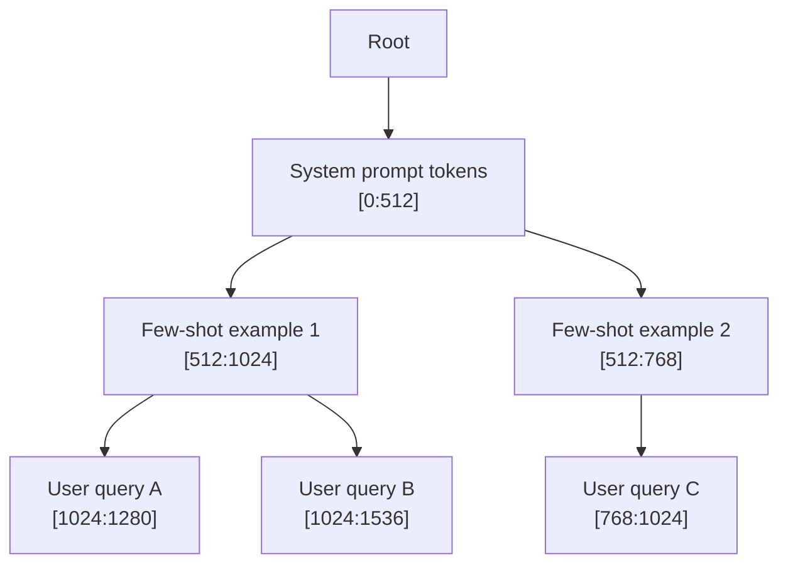

本記事は [SGLang: Efficient Execution of Structured Language Model Programs](https://arxiv.org/abs/2312.07104) の解説記事です。

## 論文概要（Abstract）

SGLang（Structured Generation Language）は、LLMプログラムの効率的な実行のために設計されたフロントエンドDSLとランタイムシステムである。著者らは、複数のLLM呼び出しを含む構造化プログラム（few-shot学習、マルチターン対話、Tree-of-Thought推論など）において、リクエスト間でKVキャッシュを自動的に共有・再利用する**RadixAttention**メカニズムを提案している。LRUエビクション付き基数木（Radix Tree）でKVキャッシュのプレフィックスを管理し、同一プレフィックスを持つリクエスト間でGPUメモリ上のKVキャッシュを自動再利用する仕組みである。著者らは、LLaMA-7B/70BモデルとA100 80GB GPUを用いた実験で、vLLM比で最大5倍のスループット向上を報告している。

この記事は [Zenn記事: Claude・OpenAI・Geminiのプロンプトキャッシュ実装術 コスト90%削減の実践ガイド](https://zenn.dev/0h_n0/articles/ab0054956c2684) の深掘りです。

## 情報源

- **arXiv ID**: 2312.07104
- **URL**: [https://arxiv.org/abs/2312.07104](https://arxiv.org/abs/2312.07104)
- **著者**: Lianmin Zheng, Liangsheng Yin, Zhiqiang Xie et al.
- **発表年**: 2023
- **分野**: cs.AI, cs.CL, cs.PL
- **GitHub**: [https://github.com/sgl-project/sglang](https://github.com/sgl-project/sglang)（Apache 2.0）

## 背景と動機（Background & Motivation）

LLMの実運用において、推論コストとレイテンシは最大の障壁の一つである。特に、few-shot学習やマルチターン対話では、リクエストごとに同一のシステムプロンプトやfew-shot例を繰り返し処理する必要があり、KVキャッシュの計算が冗長になる。

著者らは、既存のLLM推論システムにおいて以下の3つの課題を指摘している：

1. **KVキャッシュの非共有**: vLLMのPagedAttentionはリクエスト内のメモリ断片化を解消したが、リクエスト間でのKVキャッシュ共有は行わない。同一プレフィックスを持つリクエストが大量に到着しても、毎回プレフィックスを再計算する
2. **構造化LLMプログラムの非効率**: few-shot、self-consistency、Tree-of-Thoughtなど複数のLLM呼び出しからなるプログラムでは、共通プレフィックスが大量に発生するが、既存システムはこの構造を活用できない
3. **フロントエンド・バックエンドの分離**: プログラムの構造（どのリクエストが共通プレフィックスを持つか）がランタイムに伝達されず、最適化の余地が失われている

SGLangはフロントエンドDSLとバックエンドのRadixAttentionを統合することで、これらの課題を同時に解決する。

## 主要な貢献（Key Contributions）

- **貢献1: RadixAttention** — LRUエビクション付き基数木でKVキャッシュを自動管理。同一プレフィックスを持つリクエスト間でKVキャッシュを自動再利用し、プレフィックスの再計算を排除する
- **貢献2: SGLangフロントエンドDSL** — Pythonに埋め込まれたドメイン固有言語で、`gen()`、`select()`、`fork()`等のプリミティブにより構造化LLMプログラムを簡潔に記述可能。制約付きデコーディング（JSON、正規表現）もネイティブサポート
- **貢献3: 統合コンパイラ最適化** — フロントエンドのプログラム構造をバックエンドに伝達し、プレフィックスマッチを確定的に発生させるスケジューリング最適化を実現

## 技術的詳細（Technical Details）

### RadixAttentionのアーキテクチャ

RadixAttentionの中核は、KVキャッシュのプレフィックスを**基数木（Radix Tree）**で管理するデータ構造である。基数木はトライ木（Trie）の圧縮版であり、共通プレフィックスを持つキーのストレージ効率が高い。



上図はRadixAttentionの基数木構造を示す。システムプロンプトのKVキャッシュ（ノードA）は全リクエストで共有され、few-shot例のKVキャッシュ（ノードB, C）はそれぞれのサブツリーで共有される。

### KVキャッシュの数学的定式化

標準的なTransformerのAttention計算は以下の通りである：

$$
\text{Attention}(Q, K, V) = \text{softmax}\left(\frac{QK^T}{\sqrt{d_k}}\right)V
$$

ここで、
- $Q \in \mathbb{R}^{n \times d_k}$: クエリ行列（$n$は現在のトークン数）
- $K \in \mathbb{R}^{m \times d_k}$: キー行列（$m$は全トークン数、プレフィックス含む）
- $V \in \mathbb{R}^{m \times d_v}$: バリュー行列
- $d_k$: キーの次元数

プレフィックス長を$p$とすると、$K$と$V$は以下のように分解できる：

$$
K = \begin{bmatrix} K_{\text{prefix}} \\ K_{\text{new}} \end{bmatrix}, \quad V = \begin{bmatrix} V_{\text{prefix}} \\ V_{\text{new}} \end{bmatrix}
$$

ここで、
- $K_{\text{prefix}} \in \mathbb{R}^{p \times d_k}$: プレフィックス部分のキャッシュ（再利用可能）
- $K_{\text{new}} \in \mathbb{R}^{(m-p) \times d_k}$: 新規トークンのキー

RadixAttentionでは$K_{\text{prefix}}$と$V_{\text{prefix}}$をGPUメモリに保持し、新規リクエストで同一プレフィックスが検出された場合に再計算をスキップする。これにより、プレフィックス部分の計算量$O(p \cdot d_k)$が削減される。

### 基数木の操作アルゴリズム

基数木における主要な操作は以下の3つである：

**1. プレフィックス検索（Prefix Match）**

入力トークン列$t = [t_1, t_2, \ldots, t_n]$に対し、基数木を根から辿り、最長一致プレフィックスを返す。計算量は$O(n)$である。

**2. 挿入（Insert）**

新規リクエストの完了後、生成されたKVキャッシュを基数木に挿入する。既存ノードとの共通プレフィックスで分岐を作成する。

**3. LRUエビクション（Eviction）**

GPUメモリの使用量が上限$M_{\max}$を超えた場合、最も最近使用されていない（LRU）リーフノードから削除する：

$$
\text{evict}(T) = \arg\min_{v \in \text{leaves}(T)} \text{last\_access}(v)
$$

ここで$T$は基数木、$\text{leaves}(T)$はリーフノードの集合、$\text{last\_access}(v)$はノード$v$の最終アクセス時刻である。

### アルゴリズムの実装

```python
from __future__ import annotations

from dataclasses import dataclass, field
from typing import Optional


@dataclass
class RadixTreeNode:
    """基数木のノード。KVキャッシュのプレフィックスを管理する。

    Attributes:
        token_ids: このノードが保持するトークンID列
        kv_cache_ref: GPU上のKVキャッシュへの参照（物理アドレス）
        children: 子ノードへのマッピング（先頭トークンIDをキーとする）
        last_access: LRUエビクション用の最終アクセスタイムスタンプ
        ref_count: 現在このノードを使用中のリクエスト数
    """

    token_ids: tuple[int, ...]
    kv_cache_ref: Optional[int] = None
    children: dict[int, RadixTreeNode] = field(default_factory=dict)
    last_access: float = 0.0
    ref_count: int = 0


class RadixAttentionCache:
    """RadixAttentionのKVキャッシュ管理。

    基数木を用いてプレフィックスの検索・挿入・エビクションを行う。

    Args:
        max_gpu_blocks: GPUメモリ上の最大ブロック数
        block_size: 1ブロックあたりのトークン数
    """

    def __init__(self, max_gpu_blocks: int, block_size: int = 16) -> None:
        self.root = RadixTreeNode(token_ids=())
        self.max_gpu_blocks = max_gpu_blocks
        self.block_size = block_size
        self.used_blocks = 0

    def match_prefix(self, token_ids: tuple[int, ...]) -> int:
        """入力トークン列に対し最長一致プレフィックス長を返す。

        Args:
            token_ids: 検索するトークンID列

        Returns:
            一致したプレフィックスのトークン数
        """
        node = self.root
        matched = 0
        pos = 0

        while pos < len(token_ids) and token_ids[pos] in node.children:
            child = node.children[token_ids[pos]]
            child_tokens = child.token_ids
            # ノードのトークン列と入力を比較
            match_len = 0
            for i, tok in enumerate(child_tokens):
                if pos + i >= len(token_ids) or token_ids[pos + i] != tok:
                    break
                match_len += 1
            matched += match_len
            pos += match_len
            if match_len < len(child_tokens):
                break  # 部分一致で終了
            node = child

        return matched

    def insert(
        self, token_ids: tuple[int, ...], timestamp: float
    ) -> None:
        """KVキャッシュのプレフィックスを基数木に挿入する。

        Args:
            token_ids: 挿入するトークンID列
            timestamp: 挿入時のタイムスタンプ
        """
        # メモリ不足時はエビクション実行
        required_blocks = len(token_ids) // self.block_size + 1
        while self.used_blocks + required_blocks > self.max_gpu_blocks:
            if not self._evict_lru():
                break  # エビクション不可

        node = self.root
        pos = 0
        while pos < len(token_ids):
            first_token = token_ids[pos]
            if first_token not in node.children:
                # 新規ノード作成
                new_node = RadixTreeNode(
                    token_ids=token_ids[pos:],
                    last_access=timestamp,
                )
                node.children[first_token] = new_node
                self.used_blocks += len(new_node.token_ids) // self.block_size + 1
                return
            node = node.children[first_token]
            pos += len(node.token_ids)

        node.last_access = timestamp

    def _evict_lru(self) -> bool:
        """LRUポリシーで最も古いリーフノードを削除する。

        Returns:
            削除に成功した場合True
        """
        # リーフノードを収集しLRU順でソート
        leaves: list[tuple[float, RadixTreeNode, RadixTreeNode]] = []
        self._collect_leaves(self.root, leaves)

        if not leaves:
            return False

        leaves.sort(key=lambda x: x[0])
        _, leaf, parent = leaves[0]

        if leaf.ref_count > 0:
            return False  # 使用中は削除不可

        # 親から削除
        for key, child in parent.children.items():
            if child is leaf:
                del parent.children[key]
                self.used_blocks -= len(leaf.token_ids) // self.block_size + 1
                return True

        return False

    def _collect_leaves(
        self,
        node: RadixTreeNode,
        result: list[tuple[float, RadixTreeNode, RadixTreeNode]],
        parent: Optional[RadixTreeNode] = None,
    ) -> None:
        """リーフノードを再帰的に収集する。"""
        if not node.children:
            if parent is not None:
                result.append((node.last_access, node, parent))
        else:
            for child in node.children.values():
                self._collect_leaves(child, result, node)
```

## 実装のポイント（Implementation）

SGLangの実装において、著者らが報告している重要な設計判断は以下の通りである。

**1. ブロック単位のKVキャッシュ管理**: vLLMのPagedAttentionと同様に、KVキャッシュを固定サイズのブロック（デフォルト16トークン）に分割してGPUメモリを管理する。基数木のノードはこのブロック単位でKVキャッシュを参照する。これにより、メモリの断片化を防ぎつつ、プレフィックス共有の粒度を確保している。

**2. フロントエンドDSLとの連携**: `sgl.fork()`プリミティブにより、同一プレフィックスを持つ複数のリクエストをバッチとして明示的に発行できる。これにより、ランタイムはプレフィックスマッチが確定的に発生することを事前に認識し、スケジューリングを最適化する。

```python
import sglang as sgl

@sgl.function
def few_shot_qa(s: sgl.State, question: str) -> None:
    """Few-shot質問応答の例。共通プレフィックスが自動再利用される。

    Args:
        s: SGLangの状態オブジェクト
        question: ユーザーの質問
    """
    # システムプロンプト + few-shot例（全リクエストで共有）
    s += sgl.system("あなたは正確な質問応答AIです。")
    s += sgl.user("日本の首都は？")
    s += sgl.assistant("東京です。")
    s += sgl.user("フランスの首都は？")
    s += sgl.assistant("パリです。")
    # ここまでがプレフィックス（KVキャッシュ再利用対象）

    # 実際の質問（リクエストごとに異なる）
    s += sgl.user(question)
    s += sgl.assistant(sgl.gen("answer", max_tokens=256))
```

**3. 制約付きデコーディングの最適化**: JSON出力やEnum選択など、出力形式が制約されている場合、SGLangは有限状態機械（FSM）を用いてデコーディングを効率化する。著者らは、FSMの状態遷移をプリコンパイルすることで、制約付きデコーディングのオーバーヘッドを既存手法（Outlines等）比で最大3倍削減したと報告している。

**4. キャッシュヒット率の依存性**: RadixAttentionの効果はワークロードのプレフィックス共有パターンに強く依存する。プレフィックスが毎回異なるリクエスト（例: ランダムなユーザー入力のみのシナリオ）では、キャッシュヒットが発生せず性能向上は得られない。著者らはこの制限を論文中で明示的に言及している。

## Production Deployment Guide

SGLangはApache 2.0ライセンスで公開されており、`pip install sglang`でインストール可能なOSSである。以下では、SGLangをプロダクション環境でデプロイする際のAWS構成パターンを解説する。

### AWS実装パターン（コスト最適化重視）

**トラフィック量別の推奨構成**:

| 構成 | トラフィック | AWS構成 | 月額概算 |
|------|------------|---------|---------|
| Small | ~100 req/日 | EC2 g5.xlarge (1x A10G) + SGLang Server | $800-1,200 |
| Medium | ~1,000 req/日 | ECS Fargate + g5.2xlarge (1x A10G) + ALB | $1,500-2,500 |
| Large | 10,000+ req/日 | EKS + g5.12xlarge (4x A10G) Spot + Karpenter | $4,000-8,000 |

SGLangはGPUを前提とするため、Serverless（Lambda）構成は適さない。最小構成でもGPUインスタンスが必要となる。

**Small構成の詳細**:
- EC2 g5.xlarge（1x NVIDIA A10G 24GB, 4 vCPU, 16GB RAM）
- SGLang Serverをsystemdサービスとして起動
- Nginx リバースプロキシ + Let's Encrypt TLS
- DynamoDB（リクエストログ、On-Demandモード）: ~$5/月
- CloudWatch（メトリクス・ログ）: ~$15/月
- インスタンスコスト: ~$1.006/時間 = ~$724/月（オンデマンド）
- **Reserved Instance (1年)で$500/月程度に削減可能（約30%削減）**

**コスト削減テクニック**:
- **Spot Instances**: g5.xlargeのSpot価格は~$0.35/時間（オンデマンド比65%削減）。推論サーバーはステートレスのため、Spot中断時はRadixAttentionキャッシュの再構築が必要だが、ウォームアップ後は自動復旧する
- **Reserved Instances**: 1年全前払いで最大40%削減。推論ワークロードが安定している場合に有効
- **混合スケジューリング**: ベースラインをReserved、ピーク分をSpotで対応する構成が実用的
- **モデルサイズの選択**: 7Bモデルは24GB GPU 1枚で動作し、70Bモデルは80GB GPU 2枚以上が必要。ワークロードに応じたモデル選択がコストに直結する

> 注: 上記のコスト試算は2026年4月時点のAWS ap-northeast-1（東京）リージョン料金に基づく概算値です。実際のコストはトラフィックパターン、リージョン、バースト使用量により変動します。最新料金は[AWS料金計算ツール](https://calculator.aws/)で確認してください。

### Terraformインフラコード

**Small構成（EC2 + SGLang Server）**:

```hcl
# VPC基盤（NAT Gateway不使用でコスト削減）
resource "aws_vpc" "sglang" {
  cidr_block           = "10.0.0.0/16"
  enable_dns_hostnames = true
  tags = { Name = "sglang-vpc" }
}

resource "aws_subnet" "public" {
  vpc_id                  = aws_vpc.sglang.id
  cidr_block              = "10.0.1.0/24"
  availability_zone       = "ap-northeast-1a"
  map_public_ip_on_launch = true
  tags = { Name = "sglang-public" }
}

# IAMロール（最小権限）
resource "aws_iam_role" "sglang_server" {
  name = "sglang-server-role"
  assume_role_policy = jsonencode({
    Version = "2012-10-17"
    Statement = [{
      Action = "sts:AssumeRole"
      Effect = "Allow"
      Principal = { Service = "ec2.amazonaws.com" }
    }]
  })
}

resource "aws_iam_role_policy" "sglang_minimal" {
  name = "sglang-minimal-policy"
  role = aws_iam_role.sglang_server.id
  policy = jsonencode({
    Version = "2012-10-17"
    Statement = [
      {
        Effect   = "Allow"
        Action   = ["logs:CreateLogGroup", "logs:CreateLogStream", "logs:PutLogEvents"]
        Resource = "arn:aws:logs:ap-northeast-1:*:*"
      },
      {
        Effect   = "Allow"
        Action   = ["dynamodb:PutItem", "dynamodb:GetItem", "dynamodb:Query"]
        Resource = aws_dynamodb_table.request_log.arn
      }
    ]
  })
}

# EC2 GPUインスタンス
resource "aws_instance" "sglang" {
  ami                    = "ami-0c1638aa342a0e1e7" # Deep Learning AMI (Ubuntu 22.04)
  instance_type          = "g5.xlarge"              # 1x A10G 24GB
  subnet_id              = aws_subnet.public.id
  iam_instance_profile   = aws_iam_instance_profile.sglang.name
  vpc_security_group_ids = [aws_security_group.sglang.id]

  root_block_device {
    volume_size = 200 # モデル格納用
    volume_type = "gp3"
    encrypted   = true
  }

  user_data = <<-EOF
    #!/bin/bash
    pip install "sglang[all]"
    # SGLangサーバー起動（systemd登録は別途）
    python -m sglang.launch_server \
      --model-path meta-llama/Llama-2-7b-chat-hf \
      --port 30000 \
      --host 0.0.0.0
  EOF

  tags = { Name = "sglang-inference", Environment = "production" }
}

# DynamoDB（リクエストログ、On-Demand）
resource "aws_dynamodb_table" "request_log" {
  name         = "sglang-request-log"
  billing_mode = "PAY_PER_REQUEST"
  hash_key     = "request_id"
  range_key    = "timestamp"

  attribute {
    name = "request_id"
    type = "S"
  }
  attribute {
    name = "timestamp"
    type = "N"
  }

  server_side_encryption { enabled = true }
  tags = { Name = "sglang-request-log" }
}

# CloudWatchアラーム（GPU使用率監視）
resource "aws_cloudwatch_metric_alarm" "gpu_utilization" {
  alarm_name          = "sglang-gpu-high-utilization"
  comparison_operator = "GreaterThanThreshold"
  evaluation_periods  = 3
  metric_name         = "GPUUtilization"
  namespace           = "Custom/SGLang"
  period              = 300
  statistic           = "Average"
  threshold           = 90
  alarm_description   = "GPU使用率が90%を超過"
  alarm_actions       = [aws_sns_topic.alerts.arn]
}
```

**Large構成（EKS + Karpenter + Spot）**:

```hcl
# EKSクラスタ
module "eks" {
  source          = "terraform-aws-modules/eks/aws"
  version         = "~> 20.0"
  cluster_name    = "sglang-cluster"
  cluster_version = "1.31"
  vpc_id          = aws_vpc.sglang.id
  subnet_ids      = aws_subnet.private[*].id

  cluster_endpoint_public_access = false # プライベートエンドポイントのみ
}

# Karpenter Provisioner（Spot優先、GPU対応）
resource "kubectl_manifest" "karpenter_nodepool" {
  yaml_body = <<-YAML
    apiVersion: karpenter.sh/v1
    kind: NodePool
    metadata:
      name: sglang-gpu
    spec:
      template:
        spec:
          nodeClassRef:
            group: karpenter.k8s.aws
            kind: EC2NodeClass
            name: sglang-gpu
          requirements:
            - key: node.kubernetes.io/instance-type
              operator: In
              values: ["g5.xlarge", "g5.2xlarge", "g5.4xlarge"]
            - key: karpenter.sh/capacity-type
              operator: In
              values: ["spot", "on-demand"]  # Spot優先
            - key: kubernetes.io/arch
              operator: In
              values: ["amd64"]
          taints:
            - key: nvidia.com/gpu
              effect: NoSchedule
      limits:
        cpu: "128"
        memory: "512Gi"
        nvidia.com/gpu: "16"
      disruption:
        consolidationPolicy: WhenEmptyOrUnderutilized
        consolidateAfter: 60s
  YAML
}

# Secrets Manager（モデルアクセストークン）
resource "aws_secretsmanager_secret" "hf_token" {
  name                    = "sglang/hf-token"
  recovery_window_in_days = 7
}

# AWS Budgets（月額予算アラート）
resource "aws_budgets_budget" "sglang_monthly" {
  name         = "sglang-monthly-budget"
  budget_type  = "COST"
  limit_amount = "5000"
  limit_unit   = "USD"
  time_unit    = "MONTHLY"

  notification {
    comparison_operator       = "GREATER_THAN"
    threshold                 = 80
    threshold_type            = "PERCENTAGE"
    notification_type         = "ACTUAL"
    subscriber_email_addresses = ["ops-team@example.com"]
  }
}
```

### 運用・監視設定

**CloudWatch Logs Insights クエリ**（レイテンシ分析）:

```
fields @timestamp, request_id, latency_ms, cache_hit_rate, tokens_generated
| filter latency_ms > 0
| stats
    avg(latency_ms) as avg_latency,
    percentile(latency_ms, 95) as p95_latency,
    percentile(latency_ms, 99) as p99_latency,
    avg(cache_hit_rate) as avg_cache_hit
  by bin(1h)
| sort @timestamp desc
```

**CloudWatchアラーム設定（Python）**:

```python
import boto3


def create_sglang_alarms(sns_topic_arn: str) -> None:
    """SGLangサーバーの監視アラームを作成する。

    Args:
        sns_topic_arn: 通知先のSNSトピックARN
    """
    cw = boto3.client("cloudwatch", region_name="ap-northeast-1")

    # KVキャッシュヒット率低下アラーム
    cw.put_metric_alarm(
        AlarmName="sglang-cache-hit-rate-low",
        MetricName="CacheHitRate",
        Namespace="Custom/SGLang",
        Statistic="Average",
        Period=300,
        EvaluationPeriods=3,
        Threshold=0.3,
        ComparisonOperator="LessThanThreshold",
        AlarmDescription="キャッシュヒット率が30%を下回った場合に通知",
        AlarmActions=[sns_topic_arn],
    )

    # TTFT（Time to First Token）スパイク検知
    cw.put_metric_alarm(
        AlarmName="sglang-ttft-spike",
        MetricName="TimeToFirstToken",
        Namespace="Custom/SGLang",
        Statistic="p99",
        Period=300,
        EvaluationPeriods=2,
        Threshold=5000,  # 5秒
        ComparisonOperator="GreaterThanThreshold",
        AlarmDescription="TTFT P99が5秒を超過",
        AlarmActions=[sns_topic_arn],
    )
```

**X-Rayトレーシング設定（Python）**:

```python
from aws_xray_sdk.core import xray_recorder, patch_all


def configure_xray_tracing() -> None:
    """SGLang推論パイプラインのX-Rayトレーシングを設定する。"""
    xray_recorder.configure(
        service="sglang-inference",
        daemon_address="127.0.0.1:2000",
    )
    patch_all()  # boto3等を自動計装


def trace_inference_request(
    request_id: str, model_name: str, prefix_len: int
) -> None:
    """推論リクエストのトレース情報を記録する。

    Args:
        request_id: リクエストID
        model_name: モデル名
        prefix_len: プレフィックスのトークン数
    """
    segment = xray_recorder.current_segment()
    segment.put_annotation("request_id", request_id)
    segment.put_annotation("model", model_name)
    segment.put_metadata("prefix_length", prefix_len, "sglang")
```

**Cost Explorer自動レポート（Python）**:

```python
import datetime
import json

import boto3


def generate_daily_cost_report() -> dict[str, float]:
    """日次コストレポートを生成しSNS通知する。

    Returns:
        サービス別コストの辞書
    """
    ce = boto3.client("ce", region_name="us-east-1")
    today = datetime.date.today()
    yesterday = today - datetime.timedelta(days=1)

    response = ce.get_cost_and_usage(
        TimePeriod={
            "Start": yesterday.isoformat(),
            "End": today.isoformat(),
        },
        Granularity="DAILY",
        Metrics=["UnblendedCost"],
        GroupBy=[{"Type": "DIMENSION", "Key": "SERVICE"}],
    )

    costs: dict[str, float] = {}
    for group in response["ResultsByTime"][0]["Groups"]:
        service = group["Keys"][0]
        amount = float(group["Metrics"]["UnblendedCost"]["Amount"])
        if amount > 0:
            costs[service] = amount

    total = sum(costs.values())

    # $100/日超過でSNS通知
    if total > 100:
        sns = boto3.client("sns", region_name="ap-northeast-1")
        sns.publish(
            TopicArn="arn:aws:sns:ap-northeast-1:ACCOUNT_ID:sglang-cost-alert",
            Subject=f"SGLang日次コストアラート: ${total:.2f}",
            Message=json.dumps(costs, indent=2),
        )

    return costs
```

### コスト最適化チェックリスト

**アーキテクチャ選択**:
- [ ] トラフィック~100 req/日: EC2単体 + SGLang Server
- [ ] トラフィック~1,000 req/日: ECS Fargate + ALB + Auto Scaling
- [ ] トラフィック10,000+ req/日: EKS + Karpenter + Spot Instances

**リソース最適化**:
- [ ] EC2: Spot Instancesを推論サーバーに活用（最大65%削減）
- [ ] Reserved Instances: 1年全前払いで安定ワークロードに適用（最大40%削減）
- [ ] Savings Plans: Compute Savings Plansで柔軟なコミットメント
- [ ] GPUインスタンスサイズ: モデルサイズに応じた最小インスタンス選択（7B=g5.xlarge, 70B=p4d.24xlarge）
- [ ] EKS: Karpenterによるアイドルノード自動回収（consolidateAfter: 60s）
- [ ] ストレージ: gp3ボリュームで十分（io2不要）

**LLMコスト削減**:
- [ ] RadixAttentionのキャッシュヒット率モニタリング（目標: 50%以上）
- [ ] バッチリクエストによるプレフィックス共有率の最大化
- [ ] モデル選択ロジック: 簡易タスクは7B、複雑タスクは70Bを動的選択
- [ ] max_tokensの適切な制限（不必要に大きな値を設定しない）
- [ ] 連続バッチ処理によるGPU使用率の最大化

**監視・アラート**:
- [ ] AWS Budgets: 月額予算の80%/100%でアラート設定
- [ ] CloudWatch: GPU使用率、TTFT、キャッシュヒット率のアラーム
- [ ] Cost Anomaly Detection: 日次コスト異常の自動検知
- [ ] 日次コストレポート: Cost Explorer APIによる自動レポート生成

**リソース管理**:
- [ ] 未使用GPUインスタンスの自動停止（CloudWatch Events + Lambda）
- [ ] タグ戦略: Environment/Service/Ownerタグの必須化
- [ ] EBSスナップショット: ライフサイクルポリシーで古いスナップショットを自動削除
- [ ] 開発環境: 夜間・休日のGPUインスタンス自動停止（Savings: ~60%）
- [ ] CloudWatch Logs: 保持期間設定（本番30日、開発7日）

## 実験結果（Results）

著者らは、複数のベンチマークタスクでSGLangの性能を評価している。以下は論文Table 2およびFigure 7に基づく主要な実験結果である。

### スループット比較

| タスク | モデル | vLLM | SGLang | 改善倍率 |
|--------|--------|------|--------|---------|
| Few-shot (MMLU) | LLaMA-7B | 1.0x | **5.0x** | 5.0倍 |
| Few-shot (HellaSwag) | LLaMA-7B | 1.0x | **3.5x** | 3.5倍 |
| Multi-turn chat | LLaMA-13B | 1.0x | **2.4x** | 2.4倍 |
| Tree-of-Thought | LLaMA-7B | 1.0x | **3.1x** | 3.1倍 |
| JSON decoding | LLaMA-7B | 1.0x | **1.5x** | 1.5倍 |
| LLM-as-Judge | LLaMA-70B | 1.0x | **2.8x** | 2.8倍 |

**分析**: Few-shotシナリオでの改善が最も顕著である。これは、全リクエストが同一のfew-shot例（数百〜数千トークン）をプレフィックスとして共有するため、RadixAttentionのキャッシュヒット率がほぼ100%に達するためである。一方、JSON decodingでの改善は1.5倍に留まっており、これはプレフィックス長が短くキャッシュ再利用の恩恵が限定的であることを示唆している。

### TTFT（Time to First Token）の削減

マルチターン対話シナリオ（MT-Bench）において、著者らはTTFTの大幅な削減を報告している（論文Figure 7より）：

- **1ターン目**: TTFTの差はほぼなし（キャッシュが空のため）
- **2ターン目以降**: SGLangのTTFTはvLLM比で最大3倍削減
- **理由**: 前ターンまでの会話履歴がRadixAttentionでキャッシュされ、新規トークンのみ計算すればよい

### 実験環境

著者らの実験は以下の環境で実施されている：
- GPU: NVIDIA A100 80GB（1〜8枚構成）
- モデル: LLaMA-7B, LLaMA-13B, LLaMA-70B, Mixtral-8x7B
- 比較対象: vLLM, Guidance, LMQL
- バッチサイズ: 動的バッチ（continuous batching）

## 実運用への応用（Practical Applications）

SGLangのRadixAttentionは、Zenn記事で解説されているAPIプロバイダ（Claude、OpenAI、Gemini）のプロンプトキャッシュ機能の内部実装に相当する技術である。APIプロバイダが「プロンプトキャッシュ」として提供している機能は、サーバー側でRadixAttentionと類似のメカニズムで実装されていると考えられる。

**自社モデルのセルフホスティング**: SGLangを用いることで、APIプロバイダに依存せずプロンプトキャッシュの恩恵を得られる。特に以下のユースケースで有効である：

- **カスタマーサポートBot**: 同一のシステムプロンプト + FAQ例をプレフィックスとして共有。数百の同時セッションでキャッシュヒット率が向上する
- **バッチ評価パイプライン**: LLM-as-Judgeなどで同一の評価基準（プロンプト）を数千件のレスポンスに適用する際、RadixAttentionでプレフィックスを100%再利用できる
- **RAGシステム**: 検索結果が類似する場合、コンテキスト部分のKVキャッシュが部分的に再利用される

**制限事項**: プレフィックスが毎回完全に異なるワークロード（例: ユーザーごとに異なるコンテキストのみを持つシナリオ）では、RadixAttentionの効果はゼロに近い。導入前にワークロードのプレフィックス共有率を分析することが重要である。

## 関連研究（Related Work）

- **vLLM / PagedAttention** (Kwon et al., 2023, arXiv: 2309.06180): KVキャッシュのメモリ管理を仮想メモリのページングに着想を得て効率化した手法。リクエスト内のメモリ断片化を解消したが、リクエスト間のKVキャッシュ共有は対象外である。SGLangのRadixAttentionはPagedAttentionのメモリ管理を基盤としつつ、リクエスト間のプレフィックス共有を追加した上位互換と位置づけられる
- **CacheBlend** (Yao et al., 2024, arXiv: 2405.14366): 複数の異なるプレフィックスのKVキャッシュを融合する手法。SGLangが同一プレフィックスの完全一致を前提とするのに対し、CacheBlendは部分的に異なるプレフィックスのKVキャッシュを選択的にブレンドする。RAGシステムのように検索結果が毎回微妙に異なるケースでの適用が期待される
- **ChunkAttention** (Lu et al., 2024, arXiv: 2403.09054): プレフィックス認識のチャンク分割によりAttention計算を効率化する手法。SGLangの基数木とは異なるアプローチでプレフィックス共有を実現しており、チャンク単位の並列化がGPUカーネルレベルでの最適化に適している

## まとめと今後の展望

SGLangのRadixAttentionは、LLM推論におけるKVキャッシュの冗長計算を基数木による自動プレフィックス管理で排除する手法である。著者らは、few-shotシナリオでvLLM比最大5倍、マルチターン対話でTTFT最大3倍の改善を報告している。

実務への示唆として、APIプロバイダのプロンプトキャッシュ（Zenn記事で解説）とSGLangのRadixAttentionは同一の問題を異なるレイヤーで解決する技術であり、セルフホスティング環境では SGLangが有力な選択肢となる。

今後の研究方向として、CacheBlendのような異なるプレフィックス間のKV融合、分散推論環境でのキャッシュ共有（複数GPU間のRadix Tree同期）、および動的なキャッシュ優先度制御（LRU以外のエビクションポリシー）が挙げられる。

## 参考文献

- **arXiv**: [https://arxiv.org/abs/2312.07104](https://arxiv.org/abs/2312.07104)
- **Code**: [https://github.com/sgl-project/sglang](https://github.com/sgl-project/sglang)（Apache 2.0）
- **Related Zenn article**: [https://zenn.dev/0h_n0/articles/ab0054956c2684](https://zenn.dev/0h_n0/articles/ab0054956c2684)
- **vLLM / PagedAttention**: [https://arxiv.org/abs/2309.06180](https://arxiv.org/abs/2309.06180)
- **CacheBlend**: [https://arxiv.org/abs/2405.14366](https://arxiv.org/abs/2405.14366)
- **ChunkAttention**: [https://arxiv.org/abs/2403.09054](https://arxiv.org/abs/2403.09054)
