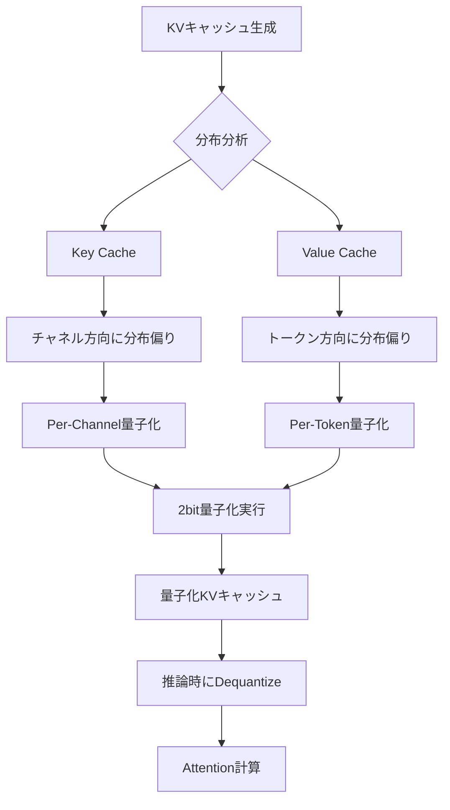

本記事は [KIVI: A Tuning-Free Asymmetric 2bit Quantization for KV Cache](https://arxiv.org/abs/2402.02750) の解説記事です。

## 論文概要（Abstract）

KIVIは、LLM推論時のKVキャッシュに対するチューニング不要の2bit量子化手法である。著者らは、Key cacheとValue cacheの要素分布が根本的に異なることを発見し、Keyにはper-channel量子化、Valueにはper-token量子化を適用する非対称戦略を提案している。この手法により、ファインチューニングやキャリブレーションデータを一切必要とせず、ピークメモリを2.6倍削減し、スループットを最大3.47倍向上させることに成功したと報告されている。

この記事は [Zenn記事: Claude・OpenAI・Geminiのプロンプトキャッシュ実装術 コスト90%削減の実践ガイド](https://zenn.dev/0h_n0/articles/ab0054956c2684) の深掘りです。

## 情報源

- **arXiv ID**: 2402.02750
- **URL**: [https://arxiv.org/abs/2402.02750](https://arxiv.org/abs/2402.02750)
- **著者**: Zirui Liu, Jiayi Yuan, Hongye Jin et al.
- **発表年**: 2024（ICML 2024採択）
- **分野**: cs.CL, cs.LG, cs.PF
- **GitHub**: [https://github.com/jy-yuan/KIVI](https://github.com/jy-yuan/KIVI)

## 背景と動機（Background & Motivation）

LLMの推論においてKVキャッシュは、過去のトークンの情報を保持してAttention計算の再計算を回避するための重要な機構である。しかし、シーケンス長やバッチサイズの増大に伴い、KVキャッシュのメモリ消費が推論ボトルネックとなっている。例えば、Llama-2-7BでFP16のKVキャッシュを128Kトークン分保持すると、モデル重み（約14GB）を上回るメモリが必要となる。

従来のKVキャッシュ量子化手法は、Key/Valueを同一の量子化戦略で処理していた。しかし著者らは、Key cacheとValue cacheの要素分布が根本的に異なることを発見し、この非対称性を無視した量子化が精度劣化の主因であると指摘している。加えて、既存手法の多くはファインチューニングやキャリブレーションデータを必要とし、実運用への適用が容易ではなかった。

## 主要な貢献（Key Contributions）

- **貢献1: KV分布の非対称性の発見** — Key cacheはチャネル方向に分布が偏り（特定チャネルに外れ値が集中）、Value cacheはトークン方向に分布が偏ることを体系的に分析・実証
- **貢献2: 非対称量子化戦略の提案** — Keyにはper-channel量子化、Valueにはper-token量子化を適用する非対称2bit量子化手法KIVIを提案。チューニング不要で既存モデルに即適用可能
- **貢献3: ハードウェア効率的な実装** — CUDA カーネルの最適化により、量子化/復元のオーバーヘッドを最小化し、実際のスループット向上を実現

## 技術的詳細（Technical Details）

### KVキャッシュの分布特性

著者らは、複数のLLM（Llama-2, Falcon, Mistral）でKVキャッシュの要素分布を詳細に分析している。

**Key cacheの分布特性**: Key cacheでは特定のチャネル（次元）に値が集中する傾向がある。すなわち、あるチャネルの値は全トークンにわたって一貫して大きく（または小さく）、チャネル間のレンジ差が顕著である。この性質から、チャネル方向にmin/maxを取るper-channel量子化が最適となる。

**Value cacheの分布特性**: Value cacheでは特定のトークン位置に値が集中する傾向がある。特にシーケンスの初期トークン（Attention Sink現象と関連）で大きな値を取る。この性質から、トークン方向にmin/maxを取るper-token量子化が最適となる。



### 量子化アルゴリズム

KIVIの量子化は、均一量子化（Uniform Quantization）をベースとする。$b$ビット量子化の場合、テンソル$\mathbf{X}$に対する量子化関数$Q$と復元関数$D$は以下の通りである：

$$
Q(\mathbf{X}) = \text{clamp}\left(\left\lfloor \frac{\mathbf{X} - z}{s} \right\rceil, 0, 2^b - 1\right)
$$

$$
D(\hat{\mathbf{X}}) = s \cdot \hat{\mathbf{X}} + z
$$

ここで、
- $\mathbf{X}$: 量子化対象のテンソル（Key cacheまたはValue cache）
- $\hat{\mathbf{X}}$: 量子化された整数テンソル
- $s$: スケールファクタ（scale）
- $z$: ゼロポイント（zero-point）
- $b$: ビット幅（KIVIでは$b=2$）
- $\lfloor \cdot \rceil$: 最近接丸め（round-to-nearest）

スケールとゼロポイントは以下で計算される：

$$
s = \frac{\max(\mathbf{X}_g) - \min(\mathbf{X}_g)}{2^b - 1}, \quad z = \min(\mathbf{X}_g)
$$

ここで$\mathbf{X}_g$はグループ内の要素を表す。

### Per-Channel量子化（Key Cache）

Key cache $\mathbf{K} \in \mathbb{R}^{T \times d}$（$T$: トークン数、$d$: ヘッド次元）に対し、チャネル方向にグループサイズ$g_k$でグルーピングする。各グループは$g_k$個の連続するチャネルを含み、グループごとに独立したスケール$s$とゼロポイント$z$を持つ。

$$
\mathbf{K}_{\text{quant}}[:, j:j+g_k] = Q(\mathbf{K}[:, j:j+g_k])
$$

新しいトークンが生成されるたびに、既存のスケールとゼロポイントを用いて即座に量子化できるため、オンライン処理が容易である。

### Per-Token量子化（Value Cache）

Value cache $\mathbf{V} \in \mathbb{R}^{T \times d}$に対し、トークン方向にグループサイズ$g_v$でグルーピングする。各グループは$g_v$個の連続するトークンを含み、グループごとに独立したスケールとゼロポイントを持つ。

$$
\mathbf{V}_{\text{quant}}[i:i+g_v, :] = Q(\mathbf{V}[i:i+g_v, :])
$$

Value cacheのper-token量子化では、新しいトークンが$g_v$個蓄積された時点でまとめて量子化する。蓄積中のトークンはFP16のまま残差バッファに保持される。

### 残差バッファ（Residual Buffer）

KIVIの重要な実装上の工夫として、最新の$r$トークン分のKVキャッシュをFP16のまま保持する残差バッファがある。著者らは、直近のトークンはAttentionスコアへの寄与が大きいため、量子化による情報損失を回避することが精度維持に重要であると報告している。

推論時のAttention計算は、量子化されたKVキャッシュと残差バッファの両方を使用する：

$$
\text{Attention}(Q, K_{\text{quant}}, K_{\text{res}}, V_{\text{quant}}, V_{\text{res}}) = \text{softmax}\left(\frac{Q \cdot [D(K_{\text{quant}}); K_{\text{res}}]^T}{\sqrt{d_k}}\right) \cdot [D(V_{\text{quant}}); V_{\text{res}}]
$$

ここで$[\cdot ; \cdot]$はトークン方向の連結を表す。

### アルゴリズム

```python
import torch
from dataclasses import dataclass


@dataclass
class QuantConfig:
    """KIVI量子化設定

    Attributes:
        bits: 量子化ビット幅
        group_size_k: Key cacheのグループサイズ（チャネル方向）
        group_size_v: Value cacheのグループサイズ（トークン方向）
        residual_length: FP16残差バッファのトークン数
    """
    bits: int = 2
    group_size_k: int = 32
    group_size_v: int = 32
    residual_length: int = 128


def quantize_per_channel(
    key_cache: torch.Tensor,
    group_size: int,
    bits: int = 2,
) -> tuple[torch.Tensor, torch.Tensor, torch.Tensor]:
    """Key cacheをper-channel方向に量子化する

    Args:
        key_cache: Key cache (seq_len, head_dim)
        group_size: チャネル方向のグループサイズ
        bits: 量子化ビット幅

    Returns:
        quantized: 量子化テンソル (seq_len, head_dim) uint8
        scales: スケール (1, head_dim // group_size)
        zeros: ゼロポイント (1, head_dim // group_size)
    """
    seq_len, head_dim = key_cache.shape
    assert head_dim % group_size == 0, "head_dim must be divisible by group_size"
    qmax = 2 ** bits - 1

    # (seq_len, num_groups, group_size) にリシェイプ
    reshaped = key_cache.reshape(seq_len, -1, group_size)

    # チャネル方向: 全トークンにわたるmin/maxを計算
    group_min = reshaped.min(dim=0, keepdim=True).values.min(dim=2, keepdim=True).values
    group_max = reshaped.max(dim=0, keepdim=True).values.max(dim=2, keepdim=True).values

    scales = (group_max - group_min) / qmax
    scales = scales.clamp(min=1e-8)
    zeros = group_min

    quantized = ((reshaped - zeros) / scales).round().clamp(0, qmax).to(torch.uint8)
    quantized = quantized.reshape(seq_len, head_dim)
    scales = scales.squeeze(0).squeeze(-1)  # (1, num_groups)
    zeros = zeros.squeeze(0).squeeze(-1)

    return quantized, scales, zeros


def quantize_per_token(
    value_cache: torch.Tensor,
    group_size: int,
    bits: int = 2,
) -> tuple[torch.Tensor, torch.Tensor, torch.Tensor]:
    """Value cacheをper-token方向に量子化する

    Args:
        value_cache: Value cache (seq_len, head_dim)
        group_size: トークン方向のグループサイズ
        bits: 量子化ビット幅

    Returns:
        quantized: 量子化テンソル (seq_len, head_dim) uint8
        scales: スケール (seq_len // group_size, 1)
        zeros: ゼロポイント (seq_len // group_size, 1)
    """
    seq_len, head_dim = value_cache.shape
    assert seq_len % group_size == 0, "seq_len must be divisible by group_size"
    qmax = 2 ** bits - 1

    # (num_groups, group_size, head_dim) にリシェイプ
    reshaped = value_cache.reshape(-1, group_size, head_dim)

    # トークン方向: グループ内の全要素にわたるmin/maxを計算
    group_min = reshaped.min(dim=1, keepdim=True).values.min(dim=2, keepdim=True).values
    group_max = reshaped.max(dim=1, keepdim=True).values.max(dim=2, keepdim=True).values

    scales = (group_max - group_min) / qmax
    scales = scales.clamp(min=1e-8)
    zeros = group_min

    quantized = ((reshaped - zeros) / scales).round().clamp(0, qmax).to(torch.uint8)
    quantized = quantized.reshape(seq_len, head_dim)
    scales = scales.squeeze(1).squeeze(-1)  # (num_groups, 1)
    zeros = zeros.squeeze(1).squeeze(-1)

    return quantized, scales, zeros


def dequantize(
    quantized: torch.Tensor,
    scales: torch.Tensor,
    zeros: torch.Tensor,
    group_size: int,
    axis: str = "channel",
) -> torch.Tensor:
    """量子化テンソルをFP16に復元する

    Args:
        quantized: 量子化テンソル (seq_len, head_dim) uint8
        scales: スケール
        zeros: ゼロポイント
        group_size: グループサイズ
        axis: "channel"（Key用）または "token"（Value用）

    Returns:
        復元テンソル (seq_len, head_dim) float16
    """
    seq_len, head_dim = quantized.shape

    if axis == "channel":
        reshaped = quantized.reshape(seq_len, -1, group_size).float()
        s = scales.unsqueeze(0).unsqueeze(-1)  # (1, num_groups, 1)
        z = zeros.unsqueeze(0).unsqueeze(-1)
        dequantized = reshaped * s + z
    else:  # token
        reshaped = quantized.reshape(-1, group_size, head_dim).float()
        s = scales.unsqueeze(1).unsqueeze(-1)  # (num_groups, 1, 1)
        z = zeros.unsqueeze(1).unsqueeze(-1)
        dequantized = reshaped * s + z

    return dequantized.reshape(seq_len, head_dim).half()
```

## 実装のポイント（Implementation）

著者らは実装上の重要なポイントをいくつか報告している。

**グループサイズの選択**: 論文の実験では、Key cacheのグループサイズ$g_k = 32$、Value cacheのグループサイズ$g_v = 32$が推奨されている（論文Table 3より）。グループサイズが小さいほど量子化精度は向上するが、スケール/ゼロポイントの保存にかかるメモリオーバーヘッドが増大する。$g_k = g_v = 32$はこのトレードオフのバランスが良い値であると報告されている。

**残差バッファサイズ**: 残差バッファのサイズ$r$は128トークンが推奨されている。著者らの実験では、$r = 128$でFP16とほぼ同等の精度が得られ、$r$をさらに増やしても精度改善は限定的であったと述べている。

**CUDAカーネル最適化**: 2bitの量子化/復元演算はビット操作で効率的に実装可能であり、著者らはカスタムCUDAカーネルを提供している。特にValue cacheのper-token量子化は、メモリアクセスパターンがトークン方向に連続するため、GPUのcoalesced memory accessと相性が良い。

**既存フレームワークとの統合**: KIVIはHugging Face Transformersの`generate()`メソッドに統合可能であり、モデルの重みを変更せずにKVキャッシュ部分のみを量子化する。既存のモデルチェックポイントをそのまま利用できる点が実用上の大きな利点である。

## Production Deployment Guide

### AWS実装パターン（コスト最適化重視）

KIVIによるKVキャッシュ量子化をプロダクション環境で活用する場合、LLM推論サーバーのメモリ効率向上が主な目的となる。以下にトラフィック量別の推奨構成を示す。コスト試算は2026年4月時点のAWS ap-northeast-1（東京）リージョン料金に基づく概算値であり、実際のコストはトラフィックパターンやバースト使用量により変動する。

**トラフィック量別推奨構成**:

| 構成 | トラフィック | 主要サービス | 月額概算 |
|------|-------------|-------------|---------|
| Small | ~100 req/日 | Lambda + Bedrock | $50-150 |
| Medium | ~1,000 req/日 | ECS Fargate + vLLM | $500-1,200 |
| Large | 10,000+ req/日 | EKS + Spot GPU + vLLM+KIVI | $3,000-8,000 |

**Small構成**: Lambda関数からAmazon Bedrockを呼び出す構成。Bedrockの内部実装としてKVキャッシュ最適化が適用されるため、ユーザー側でKIVI自体を実装する必要はない。Prompt Caching有効化で30-90%のコスト削減が可能。

**Medium構成**: ECS Fargate上でvLLMを稼働させ、KIVIを組み込んだ推論サーバーを運用する。g5.xlarge（NVIDIA A10G 24GB）相当のGPUタスクを利用し、KIVIの2bit量子化によりバッチサイズを4倍に拡大可能。月額の主な内訳はGPUインスタンス費用（$400-800）とデータ転送費（$50-100）。

**Large構成**: EKS上でKarpenterによるSpot GPU Instancesの自動スケーリングを実施。g5.12xlargeまたはp4d.24xlargeをSpotで最大90%のコスト削減を実現。KIVIの2bit量子化により同一GPUメモリで2.6倍のKVキャッシュを保持できるため、ノード数を削減可能。

**コスト削減テクニック**:
- Spot Instances活用: GPU Instancesを最大90%割引で利用
- Reserved Instances: 1年コミットで最大72%削減
- KIVI適用によるバッチサイズ拡大: 同一ハードウェアで4倍のリクエストを処理（実質コスト75%削減）
- Prompt Caching（Bedrock）: 繰り返しプロンプトで30-90%削減

### Terraformインフラコード

**Small構成（Serverless）**:

```hcl
# KIVI推論パイプライン - Small構成 (Lambda + Bedrock)
# 2026年4月時点のAWS ap-northeast-1向け

terraform {
  required_version = ">= 1.9"
  required_providers {
    aws = {
      source  = "hashicorp/aws"
      version = "~> 5.80"
    }
  }
}

provider "aws" {
  region = "ap-northeast-1"
}

# IAMロール（最小権限）
resource "aws_iam_role" "inference_lambda" {
  name = "kivi-inference-lambda"
  assume_role_policy = jsonencode({
    Version = "2012-10-17"
    Statement = [{
      Action = "sts:AssumeRole"
      Effect = "Allow"
      Principal = { Service = "lambda.amazonaws.com" }
    }]
  })
}

resource "aws_iam_role_policy" "bedrock_invoke" {
  name = "bedrock-invoke"
  role = aws_iam_role.inference_lambda.id
  policy = jsonencode({
    Version = "2012-10-17"
    Statement = [{
      Effect   = "Allow"
      Action   = ["bedrock:InvokeModel", "bedrock:InvokeModelWithResponseStream"]
      Resource = "arn:aws:bedrock:ap-northeast-1::foundation-model/*"
    }]
  })
}

# DynamoDB（推論ログ・キャッシュ管理）
resource "aws_dynamodb_table" "inference_cache" {
  name         = "kivi-inference-cache"
  billing_mode = "PAY_PER_REQUEST"  # On-Demandでコスト最適化
  hash_key     = "request_id"
  range_key    = "timestamp"

  attribute {
    name = "request_id"
    type = "S"
  }
  attribute {
    name = "timestamp"
    type = "N"
  }

  server_side_encryption { enabled = true }  # KMS暗号化
  point_in_time_recovery { enabled = true }
}

# Lambda関数
resource "aws_lambda_function" "inference" {
  function_name = "kivi-inference"
  role          = aws_iam_role.inference_lambda.arn
  runtime       = "python3.12"
  handler       = "handler.lambda_handler"
  memory_size   = 512    # Bedrock呼び出しのみのため512MBで十分
  timeout       = 300    # 長文生成に対応
  filename      = "lambda.zip"

  environment {
    variables = {
      CACHE_TABLE   = aws_dynamodb_table.inference_cache.name
      BEDROCK_MODEL = "anthropic.claude-sonnet-4-20250514"
    }
  }

  tracing_config { mode = "Active" }  # X-Ray有効化
}

# CloudWatchアラーム（コスト監視）
resource "aws_cloudwatch_metric_alarm" "lambda_duration" {
  alarm_name          = "kivi-lambda-high-duration"
  comparison_operator = "GreaterThanThreshold"
  evaluation_periods  = 3
  metric_name         = "Duration"
  namespace           = "AWS/Lambda"
  period              = 300
  statistic           = "Average"
  threshold           = 60000  # 60秒超過で警告
  alarm_actions       = []     # SNS ARNを設定
  dimensions = { FunctionName = aws_lambda_function.inference.function_name }
}
```

**Large構成（Container + GPU）**:

```hcl
# KIVI推論パイプライン - Large構成 (EKS + Spot GPU)

module "eks" {
  source          = "terraform-aws-modules/eks/aws"
  version         = "~> 20.31"
  cluster_name    = "kivi-inference"
  cluster_version = "1.31"

  vpc_id     = module.vpc.vpc_id
  subnet_ids = module.vpc.private_subnets

  # Karpenter用IAM
  enable_cluster_creator_admin_permissions = true
}

# Karpenter Provisioner（Spot GPU優先）
resource "kubectl_manifest" "karpenter_nodepool" {
  yaml_body = yamlencode({
    apiVersion = "karpenter.sh/v1"
    kind       = "NodePool"
    metadata   = { name = "gpu-spot" }
    spec = {
      template = {
        spec = {
          requirements = [
            { key = "karpenter.sh/capacity-type", operator = "In", values = ["spot", "on-demand"] },
            { key = "node.kubernetes.io/instance-type", operator = "In",
              values = ["g5.xlarge", "g5.2xlarge", "g5.4xlarge"] },
          ]
          nodeClassRef = { group = "karpenter.k8s.aws", kind = "EC2NodeClass", name = "default" }
        }
      }
      limits   = { cpu = "128", memory = "512Gi", "nvidia.com/gpu" = "8" }
      disruption = { consolidationPolicy = "WhenEmptyOrUnderutilized" }
    }
  })
}

# Secrets Manager（モデル設定）
resource "aws_secretsmanager_secret" "model_config" {
  name       = "kivi-inference/model-config"
  kms_key_id = aws_kms_key.inference.arn
}

# AWS Budgets（予算アラート）
resource "aws_budgets_budget" "monthly" {
  name         = "kivi-inference-monthly"
  budget_type  = "COST"
  limit_amount = "5000"
  limit_unit   = "USD"
  time_unit    = "MONTHLY"

  notification {
    comparison_operator       = "GREATER_THAN"
    threshold                 = 80
    threshold_type            = "PERCENTAGE"
    notification_type         = "ACTUAL"
    subscriber_email_addresses = ["kbu94981@gmail.com"]
  }
}
```

### 運用・監視設定

**CloudWatch Logs Insights クエリ**（推論コスト異常検知）:

```
# 1時間あたりのトークン使用量スパイク検知
fields @timestamp, @message
| filter @message like /token_count/
| stats sum(token_count) as total_tokens by bin(1h)
| filter total_tokens > 1000000
| sort @timestamp desc
```

**CloudWatchアラーム設定（Python）**:

```python
import boto3

cloudwatch = boto3.client("cloudwatch", region_name="ap-northeast-1")

def create_token_spike_alarm(function_name: str, sns_topic_arn: str) -> None:
    """Bedrockトークン使用量スパイク検知アラームを作成する"""
    cloudwatch.put_metric_alarm(
        AlarmName=f"kivi-{function_name}-token-spike",
        ComparisonOperator="GreaterThanThreshold",
        EvaluationPeriods=2,
        MetricName="InputTokenCount",
        Namespace="AWS/Bedrock",
        Period=3600,
        Statistic="Sum",
        Threshold=500000,
        AlarmActions=[sns_topic_arn],
        Dimensions=[{"Name": "ModelId", "Value": "anthropic.claude-sonnet-4-20250514"}],
    )
```

**X-Ray トレーシング設定（Python）**:

```python
from aws_xray_sdk.core import xray_recorder, patch_all

# boto3自動計装
patch_all()

@xray_recorder.capture("kivi_inference")
def invoke_with_tracing(prompt: str, model_id: str) -> dict:
    """X-Rayトレース付きBedrock推論呼び出し"""
    subsegment = xray_recorder.current_subsegment()
    subsegment.put_annotation("model_id", model_id)
    subsegment.put_metadata("prompt_length", len(prompt))

    bedrock = boto3.client("bedrock-runtime")
    response = bedrock.invoke_model(
        modelId=model_id,
        body=prompt.encode(),
    )
    subsegment.put_metadata("response_status", response["ResponseMetadata"]["HTTPStatusCode"])
    return response
```

**Cost Explorer自動レポート（Python）**:

```python
import boto3
from datetime import datetime, timedelta

ce = boto3.client("ce", region_name="us-east-1")
sns = boto3.client("sns", region_name="ap-northeast-1")

def daily_cost_report(sns_topic_arn: str, threshold_usd: float = 100.0) -> dict:
    """日次コストレポートを取得し、閾値超過時にSNS通知する"""
    today = datetime.utcnow().strftime("%Y-%m-%d")
    yesterday = (datetime.utcnow() - timedelta(days=1)).strftime("%Y-%m-%d")

    result = ce.get_cost_and_usage(
        TimePeriod={"Start": yesterday, "End": today},
        Granularity="DAILY",
        Metrics=["UnblendedCost"],
        Filter={
            "Tags": {"Key": "Project", "Values": ["kivi-inference"]}
        },
        GroupBy=[{"Type": "DIMENSION", "Key": "SERVICE"}],
    )

    total = sum(
        float(g["Metrics"]["UnblendedCost"]["Amount"])
        for group in result["ResultsByTime"]
        for g in group["Groups"]
    )

    if total > threshold_usd:
        sns.publish(
            TopicArn=sns_topic_arn,
            Subject=f"KIVI推論コスト警告: ${total:.2f}/日",
            Message=f"日次コスト${total:.2f}が閾値${threshold_usd}を超過しました。",
        )

    return {"date": yesterday, "total_usd": total, "details": result}
```

### コスト最適化チェックリスト

**アーキテクチャ選択**:
- [ ] トラフィック量に応じた構成を選択（~100 req/日: Serverless、~1000: Hybrid、10000+: Container）
- [ ] KIVIの2bit量子化を適用しバッチサイズを最大4倍に拡大

**リソース最適化**:
- [ ] EC2/EKS: Spot GPU Instancesを優先利用（最大90%削減）
- [ ] Reserved Instances: 1年コミットで最大72%削減
- [ ] Savings Plans: Compute Savings Plansの検討
- [ ] Lambda: メモリサイズをBedrock呼び出しに最適化（512MB推奨）
- [ ] EKS: Karpenterによるアイドル時自動スケールダウン
- [ ] KIVIによるGPUメモリ効率化でノード数を削減

**LLMコスト削減**:
- [ ] Bedrock Batch APIで非リアルタイム処理を50%削減
- [ ] Prompt Caching有効化で30-90%削減
- [ ] モデル選択ロジック: タスク難易度に応じてHaiku/Sonnetを切り替え
- [ ] トークン数制限: max_tokensの適切な設定
- [ ] KIVIでKVキャッシュ圧縮し長文コンテキスト処理のメモリコストを削減

**監視・アラート**:
- [ ] AWS Budgets: 月次予算アラート設定（80%/100%閾値）
- [ ] CloudWatch: トークン使用量・レイテンシアラーム
- [ ] Cost Anomaly Detection: 自動異常検知の有効化
- [ ] 日次コストレポート: Cost Explorer APIで自動取得・SNS通知

**リソース管理**:
- [ ] 未使用GPUインスタンスの自動停止
- [ ] タグ戦略: Project/Environment/Ownerタグの統一
- [ ] EBSスナップショットのライフサイクルポリシー設定
- [ ] 開発環境の夜間・休日自動停止
- [ ] ECRイメージの古いバージョン自動削除

## 実験結果（Results）

### LongBenchベンチマーク

著者らはLongBench（長文理解ベンチマーク）上でKIVIの性能を評価している。以下は論文Table 1に基づくLlama-2-7B-chatでの結果である。

| 手法 | ビット幅 | LongBench平均 | ピークメモリ | スループット |
|------|---------|--------------|------------|------------|
| FP16（ベースライン） | 16bit | 36.27 | 1.0x | 1.0x |
| RTN（対称量子化） | 2bit | 22.15 | 2.6x削減 | - |
| FlexGen | 4bit | 32.83 | 1.5x削減 | 1.8x |
| KIVI（提案手法） | 2bit | 35.28 | 2.6x削減 | 2.35-3.47x |

著者らは、KIVIがFP16ベースラインに対してLongBench平均スコアで2.7%以内の精度低下に抑えつつ、メモリを2.6倍削減できたと報告している（論文Table 1より）。対照的に、RTN（Round-to-Nearest）による単純な2bit量子化では38.9%もの精度劣化が発生しており、非対称量子化戦略の有効性が顕著に示されている。

### モデル別の結果

著者らはLlama-2-7B/13B/70B、Falcon-7B/40B、Mistral-7Bの計6モデルで実験を実施している。いずれのモデルにおいても、2bit KIVIはFP16ベースラインに対して精度劣化が3%以内に収まっていると報告されている（論文Table 2より）。特にLlama-2-70Bではほぼ精度劣化なし（0.5%以内）の結果が得られており、モデルサイズが大きいほどKIVIの効果が安定する傾向が確認されている。

### スループット改善

バッチサイズ拡大による実測スループットの改善については、Llama-2-7Bで2.35倍、Llama-2-70Bで3.47倍の向上が報告されている（論文Table 4より）。これはKIVIのメモリ削減により、同一GPU上でより大きなバッチサイズが許容されるためである。

## 実運用への応用（Practical Applications）

KIVIのKVキャッシュ2bit量子化は、LLM推論の実運用において以下の場面で特に有効である。

**プロンプトキャッシュとの相乗効果**: Zenn記事で解説されているClaude/OpenAI/GeminiのPrompt Cachingと組み合わせることで、KVキャッシュのメモリ効率を大幅に向上させ、より多くのキャッシュエントリを保持可能にする。これによりキャッシュヒット率が向上し、レイテンシ・コストの両面で改善が見込める。

**長文コンテキスト処理**: 128Kトークンを超えるような長文コンテキスト（RAG、ドキュメント要約等）では、KVキャッシュがGPUメモリの大部分を占有する。KIVIを適用することで、同一ハードウェアで4倍の長さのコンテキストを処理可能になる。

**マルチテナント推論サーバー**: 複数ユーザーのリクエストを同時処理するサーバーでは、ユーザーごとのKVキャッシュが蓄積される。KIVIの2bit量子化により、同時接続ユーザー数を4倍に拡大できるため、GPUの稼働率向上とコスト効率改善に直結する。

**エッジデバイスでの推論**: メモリ制約の厳しいエッジGPU（NVIDIA Jetson等）上でのLLM推論において、KVキャッシュのメモリフットプリントを75%削減できることは、デプロイの実現可能性を大きく広げる。

## 関連研究（Related Work）

- **KV Cache is 1 Bit Per Channel**（arXiv: 2405.03917, NeurIPS 2024）: KVキャッシュのチャネルあたり1bitという理論限界を探究した研究。Coupled Quantizationを提案し、KIVIの方向性をさらに極限まで推し進めている。KIVIが2bitで実用的な精度を維持できることを示した上で、さらなる圧縮の理論的可能性を示唆している
- **SnapKV**（arXiv: 2402.02938）: 量子化ではなく、KVキャッシュの選択的圧縮（重要度の低いトークンのKVを破棄）によりメモリを削減する手法。KIVIとは相補的なアプローチであり、両者を組み合わせることでさらなるメモリ削減が理論上可能である
- **GEAR**: KVキャッシュの低ランク近似と残差量子化を組み合わせた手法。KIVIの均一量子化とは異なるアプローチでKVキャッシュの圧縮を試みている

## まとめと今後の展望

KIVIは、KVキャッシュの分布非対称性という明確な観察に基づき、Keyにper-channel、Valueにper-token量子化を適用する非対称2bit量子化手法である。チューニング不要で既存モデルに即適用でき、ピークメモリ2.6倍削減・スループット最大3.47倍向上という実用的な成果を達成している。

今後の研究方向としては、1bit量子化への挑戦（前述のNeurIPS 2024論文が示唆）、SnapKV等の選択的圧縮手法との組み合わせ、そしてMoE（Mixture of Experts）モデル特有のKVキャッシュ最適化が挙げられる。LLMの推論コスト削減は商用化の鍵であり、KIVIのような低ビット量子化技術の重要性は今後さらに高まると考えられる。

## 参考文献

- **arXiv**: [https://arxiv.org/abs/2402.02750](https://arxiv.org/abs/2402.02750)
- **Code**: [https://github.com/jy-yuan/KIVI](https://github.com/jy-yuan/KIVI)
- **Related Zenn article**: [https://zenn.dev/0h_n0/articles/ab0054956c2684](https://zenn.dev/0h_n0/articles/ab0054956c2684)
