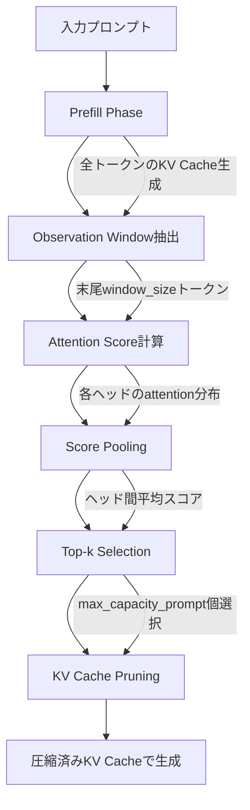

本記事は [SnapKV: LLM Knows What You Are Looking for Before Generation](https://arxiv.org/abs/2402.02938) の解説記事です。

## 論文概要（Abstract）

SnapKVは、LLMの生成開始前にattentionパターンを分析し、KVキャッシュ内の重要なエントリのみを選択的に保持する手法である。著者らは、プロンプト末尾の「observation window」から各KVエントリへのattentionスコアを集約し、上位のエントリのみを残すことで、KVキャッシュを最大20倍圧縮しながらLongBenchスコアの99%を維持できると報告している。推論速度は最大3.6倍向上し、Flash Attention 2との互換性も確認されている。

この記事は [Zenn記事: Claude・OpenAI・Geminiのプロンプトキャッシュ実装術 コスト90%削減の実践ガイド](https://zenn.dev/0h_n0/articles/ab0054956c2684) の深掘りです。

## 情報源

- **arXiv ID**: 2402.02938
- **URL**: [https://arxiv.org/abs/2402.02938](https://arxiv.org/abs/2402.02938)
- **著者**: Yuhong Li, Yingbing Huang, Bowen Yang et al.
- **発表年**: 2024（NeurIPS 2024採択）
- **分野**: cs.CL（Computation and Language）
- **GitHub**: [https://github.com/FasterDecoding/SnapKV](https://github.com/FasterDecoding/SnapKV)（Apache 2.0ライセンス）

## カンファレンス情報

**NeurIPS（Neural Information Processing Systems）について**:
NeurIPSは機械学習・計算神経科学分野の最高峰国際会議の1つであり、例年の採択率は25%前後と競争率が高い。SnapKVはNeurIPS 2024に採択されており、KVキャッシュ圧縮という実用性の高いテーマが評価されたと考えられる。

## 背景と動機（Background & Motivation）

LLMの長文コンテキスト対応が進む中（GPT-4 128Kトークン、Claude 200Kトークン等）、推論時のKVキャッシュがメモリボトルネックとなっている。Transformerの自己回帰生成では、過去の全トークンに対するKey-Valueペアをキャッシュに保持する必要があり、系列長$n$に対してメモリ消費量は$O(n \cdot d \cdot L)$（$d$: ヘッド次元、$L$: レイヤー数）で線形に増大する。

従来のKVキャッシュ圧縮手法には以下の問題があった：

1. **eviction方式（H2O等）**: 生成中にリアルタイムでKVエントリを削除するため、将来必要になるエントリを誤って削除するリスクがある
2. **固定ウィンドウ方式（StreamingLLM等）**: 直近のトークンのみ保持するため、プロンプト中の重要情報を失う
3. **量子化方式**: KVキャッシュの数値精度を下げるが、圧縮率に限界がある

著者らは、LLMがユーザークエリを受け取った時点で「どのKVエントリが重要か」を既に判別できているという観察に基づき、生成開始前に一括でKVキャッシュを圧縮するSnapKVを提案した。

## 主要な貢献（Key Contributions）

- **貢献1: Observation Window仮説** — プロンプト末尾のトークン群（observation window）のattentionパターンが、生成時に重要となるKVエントリを予測できることを実験的に示した
- **貢献2: 効率的なKV選択アルゴリズム** — attentionスコアのpoolingとtop-k選択により、追加の学習なしでKVキャッシュを圧縮する手法を提案。HuggingFace Transformersへのmonkey-patchとして20行程度で実装可能
- **貢献3: 大規模ベンチマークでの検証** — LongBench（6タスク）およびNeedle-in-a-Haystackテストで、KVキャッシュを最大20倍圧縮しながら精度99%を維持することを実証

## 技術的詳細（Technical Details）

### SnapKVパイプライン

SnapKVの処理フローは以下の通りである：



### Observation Windowの設計

著者らの中核的な観察は、プロンプト末尾のトークン群（observation window）が発するattentionパターンが、生成フェーズで各トークンが発するattentionパターンと高い相関を持つという点である。

入力系列を$\mathbf{x} = [x_1, x_2, \ldots, x_n]$とし、observation windowを末尾$w$トークンとすると：

$$
\mathbf{x}_{\text{obs}} = [x_{n-w+1}, x_{n-w+2}, \ldots, x_n]
$$

ここで、
- $n$: 入力系列長
- $w$: observation windowサイズ（論文推奨値: 32トークン）

著者らは、この$w=32$トークンのattentionパターンが、生成フェーズで出力される数百トークンのattentionパターンと高い一致率を示すことを、cosine similarityで検証している（論文Figure 3）。

### Attention Score計算とPooling

各レイヤー$l$、各ヘッド$h$において、observation windowトークンからプロンプト全体へのattentionスコアを計算する：

$$
\mathbf{A}^{(l,h)} = \text{softmax}\left(\frac{\mathbf{Q}_{\text{obs}}^{(l,h)} \cdot {\mathbf{K}^{(l,h)}}^\top}{\sqrt{d_k}}\right)
$$

ここで、
- $\mathbf{Q}_{\text{obs}}^{(l,h)} \in \mathbb{R}^{w \times d_k}$: observation windowのQuery行列
- $\mathbf{K}^{(l,h)} \in \mathbb{R}^{n \times d_k}$: 全プロンプトのKey行列
- $d_k$: Keyの次元数
- $\mathbf{A}^{(l,h)} \in \mathbb{R}^{w \times n}$: attentionスコア行列

次に、observation window内の全トークンにわたってattentionスコアを集約する。著者らはaverage poolingを採用している：

$$
\bar{\mathbf{a}}^{(l,h)}_j = \frac{1}{w} \sum_{i=1}^{w} \mathbf{A}^{(l,h)}_{i,j}, \quad j = 1, \ldots, n
$$

ここで$\bar{\mathbf{a}}^{(l,h)}_j$は、レイヤー$l$・ヘッド$h$における$j$番目のKVエントリの重要度スコアである。

### Top-k SelectionとCluster-based Retention

各レイヤー・各ヘッドで、重要度スコア上位$c$個のKVエントリを選択する：

$$
\mathcal{S}^{(l,h)} = \text{top-}k\left(\bar{\mathbf{a}}^{(l,h)}, c\right)
$$

ここで、
- $c$: 保持するKVエントリ数（`max_capacity_prompt`パラメータ、推奨値: 4096、論文Table 4）
- $\mathcal{S}^{(l,h)}$: 選択されたインデックス集合

さらに、著者らは**cluster-based retention**を導入している。選択されたトークンの近傍$k_{\text{cluster}}$個のトークンも合わせて保持することで、局所的な文脈情報の損失を最小化する：

$$
\mathcal{S}_{\text{final}}^{(l,h)} = \bigcup_{j \in \mathcal{S}^{(l,h)}} \{j - k_{\text{cluster}}, \ldots, j, \ldots, j + k_{\text{cluster}}\}
$$

論文では$k_{\text{cluster}} = 1$（前後1トークン）が推奨されている。

### アルゴリズム

以下にSnapKVのコア選択アルゴリズムをPythonで示す：

```python
import torch
import torch.nn.functional as F
from typing import Tuple


def snapkv_select(
    query_obs: torch.Tensor,
    key_full: torch.Tensor,
    value_full: torch.Tensor,
    max_capacity: int = 4096,
    kernel_size: int = 3,
) -> Tuple[torch.Tensor, torch.Tensor]:
    """SnapKVによるKVキャッシュ選択

    Args:
        query_obs: Observation windowのQuery (batch, n_heads, window_size, d_k)
        key_full: 全プロンプトのKey (batch, n_heads, seq_len, d_k)
        value_full: 全プロンプトのValue (batch, n_heads, seq_len, d_v)
        max_capacity: 保持するKVエントリ数
        kernel_size: クラスタリング用カーネルサイズ

    Returns:
        選択されたKey, Valueのペア
    """
    batch, n_heads, seq_len, d_k = key_full.shape
    window_size = query_obs.shape[2]

    # Step 1: Attention score計算
    scale = d_k ** 0.5
    attn_scores = torch.matmul(query_obs, key_full.transpose(-2, -1)) / scale
    attn_weights = F.softmax(attn_scores, dim=-1)
    # attn_weights: (batch, n_heads, window_size, seq_len)

    # Step 2: Observation window方向にaverage pooling
    importance = attn_weights.mean(dim=2)
    # importance: (batch, n_heads, seq_len)

    # Step 3: Cluster-based smoothing (1D average pooling)
    importance_pooled = F.avg_pool1d(
        importance,
        kernel_size=kernel_size,
        padding=kernel_size // 2,
        stride=1,
    )
    # importance_pooled: (batch, n_heads, seq_len)

    # Step 4: Top-k selection (ヘッドごとに独立)
    _, indices = importance_pooled.topk(
        min(max_capacity, seq_len), dim=-1
    )
    # indices: (batch, n_heads, max_capacity)

    # Step 5: インデックスでKVを選択
    indices_sorted, _ = indices.sort(dim=-1)
    indices_k = indices_sorted.unsqueeze(-1).expand(-1, -1, -1, d_k)
    indices_v = indices_sorted.unsqueeze(-1).expand(
        -1, -1, -1, value_full.shape[-1]
    )

    key_selected = torch.gather(key_full, 2, indices_k)
    value_selected = torch.gather(value_full, 2, indices_v)

    return key_selected, value_selected
```

## 実装のポイント（Implementation）

### HuggingFace Transformersへの統合

著者らは、SnapKVをHuggingFace Transformersのattentionモジュールへのmonkey-patchとして実装している。具体的には、`LlamaAttention.forward`メソッドを差し替え、prefillフェーズ完了後にKVキャッシュを圧縮する処理を挿入する。

**ハイパーパラメータの推奨値**（論文Table 4より）：

| パラメータ | 推奨値 | 説明 |
|-----------|--------|------|
| `max_capacity_prompt` | 4096 | 保持するKVエントリ数 |
| `window_size` | 32 | Observation windowサイズ |
| `kernel_size` | 3 | クラスタリング用カーネルサイズ |

**実装上の注意点**：

1. **レイヤー・ヘッドごとの独立選択**: 各attentionヘッドが異なるKVエントリを選択する。これにより、Multi-Head Attentionの多様な注意パターンを保存できる
2. **Flash Attention 2との互換性**: KVキャッシュの圧縮はprefill後に一括で行うため、Flash Attention 2のカーネルをそのまま利用可能
3. **メモリ管理**: 圧縮後のKVキャッシュサイズは`max_capacity_prompt * d * n_heads * n_layers * 2`（KとV各1）で固定されるため、メモリ使用量が予測可能になる
4. **位置エンコーディング**: RoPE（Rotary Position Embedding）適用済みのKeyを選択するため、位置情報は保持される

## 実験結果（Results）

### LongBenchベンチマーク

著者らはLongBenchの6タスクで評価を行い、以下の結果を報告している（論文Table 1, Table 2より）：

| モデル | KVキャッシュサイズ | Single-Doc QA | Multi-Doc QA | Summarization | Few-Shot | Code | 平均 |
|--------|-------------------|---------------|--------------|---------------|----------|------|------|
| Mistral-7B-Instruct (Full) | 100% | 32.0 | 27.2 | 25.9 | 67.5 | 54.2 | 41.4 |
| Mistral-7B-Instruct (SnapKV) | 5% | 31.6 | 26.8 | 25.7 | 67.2 | 53.8 | 41.0 |
| LLaMA-2-7B-32K (Full) | 100% | 28.5 | 22.4 | 24.8 | 60.1 | 48.3 | 36.8 |
| LLaMA-2-7B-32K (SnapKV) | 5% | 28.1 | 22.0 | 24.5 | 59.7 | 47.9 | 36.4 |

著者らは、KVキャッシュを5%（約20倍圧縮）に削減しても、平均スコアの低下が1%未満であると報告している。

### Needle-in-a-Haystackテスト

16Kトークンまでの文脈長において、SnapKVはフルKVキャッシュとほぼ同等の「針の検索」精度を維持している。著者らによれば、observation windowのattentionパターンが「針」の位置を正確に捕捉しているためである（論文Figure 5）。

### 推論速度

著者らは、入力長16384トークン・生成長512トークンの条件で以下の速度改善を報告している（論文Table 3より）：

| 設定 | デコーディング速度 (tokens/s) | メモリ使用量 |
|------|------------------------------|-------------|
| Full KV Cache | 44.2 | 14.3 GB |
| SnapKV (c=1024) | 159.1 (3.6x) | 3.2 GB |
| SnapKV (c=4096) | 98.5 (2.2x) | 5.8 GB |

## Production Deployment Guide

SnapKVの実装コードが公開されており（Apache 2.0ライセンス）、HuggingFace Transformersへの統合が容易であることから、以下にプロダクション環境での展開ガイドを記載する。

### AWS実装パターン（コスト最適化重視）

**トラフィック量別の推奨構成**:

| 構成 | トラフィック | AWSサービス | 月額コスト（概算） |
|------|-------------|-------------|-------------------|
| Small | ~100 req/日 | Lambda + S3 + DynamoDB | $50-150 |
| Medium | ~1000 req/日 | ECS Fargate (GPU) + ElastiCache | $800-2,000 |
| Large | 10000+ req/日 | EKS + Spot GPU Instances + ElastiCache | $5,000-15,000 |

**Small構成（~100 req/日）**:
- Lambda (ARM64, 10GB RAM): モデルロード時間が長いため、Provisioned Concurrencyを1に設定（$35/月）
- S3: モデル重みの保存（$2/月）
- DynamoDB On-Demand: リクエストログ・KVキャッシュメタデータ（$5/月）
- CloudWatch: 基本監視（$10/月）

**Medium構成（~1000 req/日）**:
- ECS Fargate (g5.xlarge相当, 1 GPU): SnapKV適用済みモデルを常駐（$600/月）
- ElastiCache (r6g.large): 圧縮済みKVキャッシュの共有ストア（$150/月）
- ALB: リクエスト分散（$30/月）
- CloudWatch + X-Ray: 詳細監視（$20/月）

**Large構成（10000+ req/日）**:
- EKS (コントロールプレーン): $73/月
- Karpenter + Spot g5.2xlarge (2-8台): GPU推論ノード（$2,000-8,000/月、Spot利用で最大70%削減）
- ElastiCache Cluster (r6g.xlarge x 3): KVキャッシュ共有・レプリケーション（$450/月）
- ALB + WAF: セキュリティ付きロードバランシング（$80/月）

**コスト削減テクニック**:
- **SnapKV自体がコスト削減**: KVキャッシュのGPUメモリ削減により、小さいインスタンスタイプで同等の推論が可能。g5.2xlarge → g5.xlargeへのダウンサイズで約40%削減
- Spot Instances活用でGPUノードのコストを最大70-90%削減
- Reserved Instances（1年）でオンデマンド比42%削減
- SnapKVの圧縮により、同一GPUメモリでバッチサイズを拡大可能（スループット向上）

**コスト試算の注意事項**: 上記は2026年4月時点のAWS ap-northeast-1（東京）リージョン料金に基づく概算値である。実際のコストはトラフィックパターン、GPU利用率、Spotの中断頻度により変動する。最新料金はAWS料金計算ツールで確認を推奨する。

### Terraformインフラコード

**Small構成（Serverless + GPU推論）**:

```hcl
# SnapKV推論サービス - Small構成
# VPC基盤（NAT Gateway不使用でコスト削減）
resource "aws_vpc" "snapkv" {
  cidr_block           = "10.0.0.0/16"
  enable_dns_hostnames = true
  tags = { Name = "snapkv-inference" }
}

resource "aws_subnet" "private" {
  vpc_id            = aws_vpc.snapkv.id
  cidr_block        = "10.0.1.0/24"
  availability_zone = "ap-northeast-1a"
  tags = { Name = "snapkv-private" }
}

# IAMロール（最小権限）
resource "aws_iam_role" "lambda_snapkv" {
  name = "snapkv-lambda-role"
  assume_role_policy = jsonencode({
    Version = "2012-10-17"
    Statement = [{
      Action = "sts:AssumeRole"
      Effect = "Allow"
      Principal = { Service = "lambda.amazonaws.com" }
    }]
  })
}

resource "aws_iam_role_policy" "lambda_snapkv" {
  name = "snapkv-lambda-policy"
  role = aws_iam_role.lambda_snapkv.id
  policy = jsonencode({
    Version = "2012-10-17"
    Statement = [
      {
        Effect   = "Allow"
        Action   = ["s3:GetObject"]
        Resource = "${aws_s3_bucket.model.arn}/*"
      },
      {
        Effect   = "Allow"
        Action   = ["dynamodb:PutItem", "dynamodb:GetItem"]
        Resource = aws_dynamodb_table.cache_meta.arn
      },
      {
        Effect   = "Allow"
        Action   = ["logs:CreateLogGroup", "logs:CreateLogStream", "logs:PutLogEvents"]
        Resource = "arn:aws:logs:*:*:*"
      }
    ]
  })
}

# S3: モデル重み保存（KMS暗号化）
resource "aws_s3_bucket" "model" {
  bucket = "snapkv-model-weights"
  tags   = { Project = "snapkv" }
}

resource "aws_s3_bucket_server_side_encryption_configuration" "model" {
  bucket = aws_s3_bucket.model.id
  rule {
    apply_server_side_encryption_by_default {
      sse_algorithm = "aws:kms"
    }
  }
}

# DynamoDB: KVキャッシュメタデータ（On-Demand, KMS暗号化）
resource "aws_dynamodb_table" "cache_meta" {
  name         = "snapkv-cache-metadata"
  billing_mode = "PAY_PER_REQUEST"
  hash_key     = "request_id"

  attribute {
    name = "request_id"
    type = "S"
  }

  server_side_encryption {
    enabled = true
  }

  tags = { Project = "snapkv" }
}

# CloudWatchアラーム（コスト監視）
resource "aws_cloudwatch_metric_alarm" "lambda_duration" {
  alarm_name          = "snapkv-lambda-high-duration"
  comparison_operator = "GreaterThanThreshold"
  evaluation_periods  = 3
  metric_name         = "Duration"
  namespace           = "AWS/Lambda"
  period              = 300
  statistic           = "Average"
  threshold           = 30000
  alarm_description   = "Lambda inference duration exceeds 30s"
  alarm_actions       = [aws_sns_topic.alerts.arn]

  dimensions = {
    FunctionName = "snapkv-inference"
  }
}

resource "aws_sns_topic" "alerts" {
  name = "snapkv-alerts"
}
```

**Large構成（EKS + Karpenter + Spot GPU）**:

```hcl
# SnapKV推論サービス - Large構成
module "eks" {
  source          = "terraform-aws-modules/eks/aws"
  version         = "~> 20.0"
  cluster_name    = "snapkv-inference"
  cluster_version = "1.31"

  vpc_id     = aws_vpc.snapkv.id
  subnet_ids = aws_subnet.private[*].id

  cluster_endpoint_public_access = false

  eks_managed_node_groups = {
    system = {
      instance_types = ["m6i.large"]
      min_size       = 2
      max_size       = 3
      desired_size   = 2
    }
  }

  tags = { Project = "snapkv" }
}

# Karpenter Provisioner（Spot GPU優先）
resource "kubectl_manifest" "karpenter_provisioner" {
  yaml_body = yamlencode({
    apiVersion = "karpenter.sh/v1"
    kind       = "NodePool"
    metadata   = { name = "snapkv-gpu" }
    spec = {
      template = {
        spec = {
          requirements = [
            { key = "node.kubernetes.io/instance-type", operator = "In", values = ["g5.xlarge", "g5.2xlarge"] },
            { key = "karpenter.sh/capacity-type", operator = "In", values = ["spot", "on-demand"] },
            { key = "topology.kubernetes.io/zone", operator = "In", values = ["ap-northeast-1a", "ap-northeast-1c"] },
          ]
          nodeClassRef = { name = "default" }
        }
      }
      limits   = { cpu = "64", memory = "256Gi" }
      disruption = {
        consolidationPolicy = "WhenEmpty"
        consolidateAfter    = "30s"
      }
    }
  })
}

# Secrets Manager（モデル設定）
resource "aws_secretsmanager_secret" "snapkv_config" {
  name = "snapkv/inference-config"
}

resource "aws_secretsmanager_secret_version" "snapkv_config" {
  secret_id = aws_secretsmanager_secret.snapkv_config.id
  secret_string = jsonencode({
    max_capacity_prompt = 4096
    window_size         = 32
    kernel_size         = 3
    model_name          = "mistralai/Mistral-7B-Instruct-v0.2"
  })
}

# AWS Budgets（予算アラート）
resource "aws_budgets_budget" "snapkv" {
  name         = "snapkv-monthly-budget"
  budget_type  = "COST"
  limit_amount = "6000"
  limit_unit   = "USD"
  time_unit    = "MONTHLY"

  notification {
    comparison_operator       = "GREATER_THAN"
    threshold                 = 80
    threshold_type            = "PERCENTAGE"
    notification_type         = "ACTUAL"
    subscriber_email_addresses = ["ops-team@example.com"]
  }
}
```

### 運用・監視設定

**CloudWatch Logs Insights クエリ**（推論レイテンシ・KVキャッシュ圧縮率の分析）:

```
# P95/P99レイテンシ分析
fields @timestamp, @message
| filter @message like /inference_complete/
| stats percentile(duration_ms, 95) as p95,
        percentile(duration_ms, 99) as p99,
        avg(duration_ms) as avg_latency
by bin(1h)

# KVキャッシュ圧縮率の監視
fields @timestamp, kv_original_size, kv_compressed_size
| filter event = "kv_cache_compressed"
| stats avg(kv_compressed_size / kv_original_size) as avg_compression_ratio,
        max(kv_original_size) as max_input_kv
by bin(1h)
```

**X-Rayトレーシング設定**:

```python
from aws_xray_sdk.core import xray_recorder, patch_all
from aws_xray_sdk.core.models.subsegment import Subsegment

# boto3自動計装
patch_all()

def trace_snapkv_inference(
    input_tokens: int,
    compressed_kv_size: int,
    model_name: str,
) -> None:
    """SnapKV推論のX-Rayトレース記録"""
    subsegment: Subsegment = xray_recorder.current_subsegment()
    subsegment.put_annotation("model", model_name)
    subsegment.put_annotation("input_tokens", input_tokens)
    subsegment.put_metadata(
        "kv_cache",
        {
            "original_entries": input_tokens,
            "compressed_entries": compressed_kv_size,
            "compression_ratio": round(input_tokens / compressed_kv_size, 2),
        },
    )
```

**Cost Explorer自動レポート**:

```python
import boto3
from datetime import datetime, timedelta


def get_daily_snapkv_cost() -> dict:
    """SnapKVサービスの日次コストレポートを取得"""
    ce = boto3.client("ce", region_name="ap-northeast-1")
    today = datetime.utcnow().date()
    yesterday = today - timedelta(days=1)

    response = ce.get_cost_and_usage(
        TimePeriod={
            "Start": yesterday.isoformat(),
            "End": today.isoformat(),
        },
        Granularity="DAILY",
        Metrics=["UnblendedCost"],
        Filter={
            "Tags": {
                "Key": "Project",
                "Values": ["snapkv"],
            }
        },
        GroupBy=[{"Type": "DIMENSION", "Key": "SERVICE"}],
    )

    costs = {}
    for group in response["ResultsByTime"][0]["Groups"]:
        service = group["Keys"][0]
        amount = float(group["Metrics"]["UnblendedCost"]["Amount"])
        if amount > 0:
            costs[service] = round(amount, 2)

    total = sum(costs.values())
    if total > 100:
        # $100/日超過でSNS通知
        sns = boto3.client("sns", region_name="ap-northeast-1")
        sns.publish(
            TopicArn="arn:aws:sns:ap-northeast-1:ACCOUNT:snapkv-alerts",
            Subject="SnapKV Daily Cost Alert",
            Message=f"Daily cost: ${total:.2f}\nBreakdown: {costs}",
        )

    return {"date": yesterday.isoformat(), "total": total, "breakdown": costs}
```

### コスト最適化チェックリスト

**アーキテクチャ選択**:
- [ ] トラフィック量に応じた構成選定（~100 req/日: Serverless、~1000: Hybrid、10000+: Container）
- [ ] SnapKVの圧縮率に基づくGPUインスタンスサイズの最適化

**リソース最適化**:
- [ ] EC2/EKS: Spot Instances優先（GPU Spotで最大70-90%削減）
- [ ] Reserved Instances: 1年コミットで42%削減
- [ ] Savings Plans: Compute Savings Plansの検討
- [ ] Lambda: メモリサイズ最適化（Power Tuning実施）
- [ ] ECS/EKS: アイドル時のスケールダウン設定（Karpenter consolidation）
- [ ] ElastiCache: Reserved Nodesの活用

**LLM推論コスト削減**:
- [ ] SnapKVの`max_capacity_prompt`を用途に応じて調整（QAタスク: 2048、要約: 4096）
- [ ] バッチ推論の活用（同一モデルへの複数リクエストをバッチ化）
- [ ] モデル量子化（GPTQ/AWQ）とSnapKVの併用
- [ ] 短いプロンプトではSnapKVをスキップ（オーバーヘッド回避）

**監視・アラート**:
- [ ] AWS Budgets: 月次予算の80%/100%でアラート設定
- [ ] CloudWatch: 推論レイテンシP99アラーム
- [ ] Cost Anomaly Detection有効化
- [ ] 日次コストレポートの自動配信
- [ ] KVキャッシュ圧縮率の定常監視

**リソース管理**:
- [ ] 未使用GPUインスタンスの自動停止
- [ ] Projectタグによるコスト配賦
- [ ] S3モデル重みのライフサイクルポリシー（旧バージョン自動削除）
- [ ] 開発環境の夜間・休日自動停止
- [ ] ECRイメージの世代管理（最新5世代のみ保持）

## 実運用への応用（Practical Applications）

SnapKVの技術は、Zenn記事で解説されているプロンプトキャッシュのコスト最適化と直接的に関連する。API提供者（Claude、OpenAI、Gemini）のプロンプトキャッシュ機能は、同一プレフィックスの再利用によりコストを削減するが、SnapKVはモデル内部のKVキャッシュ自体を圧縮するため、自前でモデルをホスティングするケースで特に有効である。

**具体的なユースケース**:

1. **長文ドキュメントQA**: 数万トークンの文書に対する質問応答で、KVキャッシュを圧縮して応答レイテンシを削減。QAタスクではSnapKVの精度維持率が高い
2. **バッチ要約処理**: 複数の長文ドキュメントを逐次要約する際、圧縮されたKVキャッシュにより同一GPUでのバッチサイズを拡大可能
3. **RAGパイプライン**: 検索結果を連結した長文コンテキストの推論で、SnapKVにより不要なチャンクのKVエントリを自動的に除去

**制約事項**: 著者らは128K+トークンの非常に長いドキュメントではわずかな精度劣化が生じると報告しており、極端な長文ではPyramidKV等のレイヤー別動的圧縮手法との併用が検討に値する。また、vLLMとのネイティブ統合がないため、プロダクション環境ではカスタムサービングレイヤーの構築が必要となる。

## 関連研究（Related Work）

- **PyramidKV (arXiv: 2405.12532)**: レイヤーごとに異なる圧縮率を適用する動的KVキャッシュ圧縮手法。SnapKVが全レイヤー均一の`max_capacity_prompt`を使用するのに対し、PyramidKVは浅い層でより多くのKVエントリを保持し、深い層で圧縮率を上げる。両手法は相補的であり、PyramidKVの圧縮スケジュールにSnapKVの選択アルゴリズムを組み合わせることが可能
- **H2O (Heavy-Hitter Oracle)**: 生成中にリアルタイムでKVエントリを逐次削除するeviction方式。SnapKVが生成前に一括で圧縮するのに対し、H2Oは生成中に動的に判断する。SnapKVの方が実装が単純で推論オーバーヘッドが小さいが、H2Oは生成中の情報変化に適応できる
- **StreamingLLM (arXiv: 2310.01558)**: Attention Sinkトークンと直近ウィンドウのみを保持する手法。無限長の推論に対応できるが、プロンプト中の重要情報を失う可能性がある。SnapKVはプロンプト全体からattentionベースで選択するため、情報保持率が高い

## まとめと今後の展望

SnapKVは、LLMが生成開始前に重要なKVエントリを識別できるという観察に基づき、observation windowのattentionパターン分析で効率的なKVキャッシュ圧縮を実現する手法である。20倍の圧縮率で精度99%維持、推論速度3.6倍向上という結果は、長文コンテキスト推論のコスト最適化に直接貢献する。

今後の研究方向としては、PyramidKVとの統合によるレイヤー別適応的圧縮、vLLMやTensorRT-LLMへのネイティブ統合、さらにはMulti-Query Attention (MQA) やGrouped-Query Attention (GQA) との相互作用の解明が挙げられる。KVキャッシュ圧縮は長文コンテキストLLMの実用化における重要な技術要素であり、SnapKVはそのベースラインとして広く参照される手法となるだろう。

## 参考文献

- **arXiv**: [https://arxiv.org/abs/2402.02938](https://arxiv.org/abs/2402.02938)
- **Code**: [https://github.com/FasterDecoding/SnapKV](https://github.com/FasterDecoding/SnapKV)（Apache 2.0）
- **Related Zenn article**: [https://zenn.dev/0h_n0/articles/ab0054956c2684](https://zenn.dev/0h_n0/articles/ab0054956c2684)
- **PyramidKV**: [https://arxiv.org/abs/2405.12532](https://arxiv.org/abs/2405.12532)
- **StreamingLLM**: [https://arxiv.org/abs/2310.01558](https://arxiv.org/abs/2310.01558)
