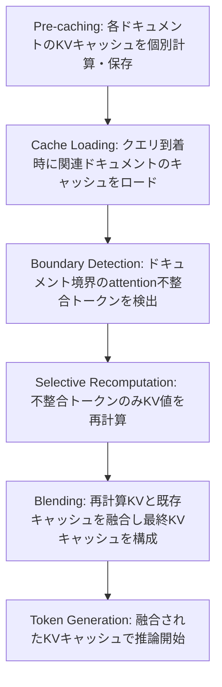

本記事は [CacheBlend: Fast Large Language Model Serving with Cached Knowledge Fusion](https://arxiv.org/abs/2405.14366) の解説記事です。

## 論文概要（Abstract）

CacheBlendは、RAG（Retrieval-Augmented Generation）パイプラインにおいて複数ドキュメントのKVキャッシュを個別に事前計算・保存し、推論時に選択的再計算によって融合する手法である。著者らは、従来のprefix cachingがプレフィックス位置に限定されるという制約を克服し、任意の位置のKVキャッシュを再利用可能にすることで、TTFT（Time-To-First-Token）を最大2.2〜3.3倍高速化し、スループットを2.8〜5倍向上させたと報告している。再計算するトークンは全体の15〜20%に抑えられ、精度損失は1%未満である。

この記事は [Zenn記事: Claude・OpenAI・Geminiのプロンプトキャッシュ実装術 コスト90%削減の実践ガイド](https://zenn.dev/0h_n0/articles/ab0054956c2684) の深掘りです。

## 情報源

- **arXiv ID**: 2405.14366
- **URL**: [https://arxiv.org/abs/2405.14366](https://arxiv.org/abs/2405.14366)
- **著者**: Jiayi Yao, Hanchen Li, Yuhan Liu et al.
- **発表年**: 2024
- **分野**: cs.LG（Machine Learning）
- **コード**: [https://github.com/YaoJiayi/CacheBlend](https://github.com/YaoJiayi/CacheBlend)

## 背景と動機（Background & Motivation）

RAGシステムでは、ユーザのクエリに応じて複数のドキュメントを検索し、それらをコンテキストとしてLLMに入力する。しかし、複数ドキュメントを結合した長いプロンプトのKV計算は、TTFT（最初のトークン生成までの遅延）を大幅に増加させる。

既存のKVキャッシュ再利用手法には以下の制約がある：

1. **vLLMのPrefix Caching**: プロンプトの先頭部分（プレフィックス）が完全一致する場合のみキャッシュを再利用できる。RAGでは検索結果の組み合わせがクエリごとに異なるため、プレフィックス一致率が低い
2. **SGLangのRadixAttention**: プレフィックスツリーに基づくキャッシュ管理であり、同様にプレフィックス位置の制約を持つ
3. **単純な結合**: 各ドキュメントのKVキャッシュを単純に結合すると、ドキュメント境界でattention計算の整合性が崩れ、生成品質が大幅に低下する

著者らは、この「プレフィックス制約」と「品質劣化」の二律背反を解決するために、選択的再計算に基づくキャッシュ融合手法CacheBlendを提案している。

## 主要な貢献（Key Contributions）

- **貢献1: 非プレフィックスKVキャッシュの再利用** — プロンプト中の任意の位置にあるドキュメントのKVキャッシュを再利用可能にし、RAGシステムのキャッシュヒット率を大幅に向上させた
- **貢献2: 選択的再計算アルゴリズム** — ドキュメント境界でattention不整合が大きいトークンのみを検出・再計算するアルゴリズムを設計し、再計算コストを全体の15〜20%に抑制した
- **貢献3: パイプライン化されたキャッシュロード** — KVキャッシュを低速・大容量ストレージに保存し、再計算とI/Oをパイプライン化することで、ストレージレイテンシを隠蔽する設計を実現した

## 技術的詳細（Technical Details）

### CacheBlendのパイプライン

CacheBlendの処理フローは以下の5段階で構成される：



### attention不整合の定式化

Transformerの各層$l$において、トークン$i$のattention出力は以下で計算される：

$$
\mathbf{o}_i^{(l)} = \sum_{j=1}^{i} \alpha_{ij}^{(l)} \mathbf{v}_j^{(l)}
$$

ここで、
- $\mathbf{o}_i^{(l)}$: 層$l$におけるトークン$i$のattention出力
- $\alpha_{ij}^{(l)}$: トークン$i$からトークン$j$へのattention重み
- $\mathbf{v}_j^{(l)}$: トークン$j$のValue表現

attention重みは以下のsoftmaxで計算される：

$$
\alpha_{ij}^{(l)} = \frac{\exp\left(\mathbf{q}_i^{(l)} \cdot \mathbf{k}_j^{(l)} / \sqrt{d_k}\right)}{\sum_{m=1}^{i} \exp\left(\mathbf{q}_i^{(l)} \cdot \mathbf{k}_m^{(l)} / \sqrt{d_k}\right)}
$$

ここで、
- $\mathbf{q}_i^{(l)}$: トークン$i$のQuery表現
- $\mathbf{k}_j^{(l)}$: トークン$j$のKey表現
- $d_k$: Keyの次元数

**問題**: ドキュメントAのKVキャッシュを単独で計算した場合、そのattention重みはドキュメントA内のトークンのみを考慮している。ドキュメントBを結合した際、ドキュメントA内のトークンのattention分布が変わるべきだが、キャッシュされた値はその変化を反映していない。

### 再計算トークンの選択アルゴリズム

著者らは、各トークンの「不整合度」を測定し、不整合度が高いトークンのKV値を優先的に再計算する手法を提案している。

**不整合度スコア**の定義：

$$
s_i = \sum_{l=1}^{L} \left\| \mathbf{o}_i^{(l),\text{cached}} - \mathbf{o}_i^{(l),\text{full}} \right\|_2
$$

ここで、
- $s_i$: トークン$i$の不整合度スコア
- $L$: Transformerの総層数
- $\mathbf{o}_i^{(l),\text{cached}}$: キャッシュされたKVで計算したattention出力
- $\mathbf{o}_i^{(l),\text{full}}$: 全トークンを考慮して計算したattention出力

しかし、$\mathbf{o}_i^{(l),\text{full}}$の計算は完全再計算と等価であるため、著者らは近似的な不整合度推定を導入している。具体的には、ドキュメント境界付近のトークンと、attention重みの変化量が大きいトークンを優先的に選択する。

**Recompute ratio** $r$ がキーハイパーパラメータであり、全トークン数$N$のうち$\lfloor r \cdot N \rfloor$個のトークンを再計算対象として選択する：

$$
\mathcal{R} = \text{TopK}\left(\{s_i\}_{i=1}^{N}, \lfloor r \cdot N \rfloor\right)
$$

ここで、
- $\mathcal{R}$: 再計算対象トークンの集合
- $r$: recompute ratio（論文推奨値: 0.15〜0.20）
- $\text{TopK}$: 不整合度スコア上位$\lfloor r \cdot N \rfloor$個を選択する関数

### アルゴリズム

以下に、CacheBlendの再計算トークン選択と融合の擬似コードを示す：

```python
import torch
import torch.nn.functional as F
from dataclasses import dataclass


@dataclass
class KVCache:
    """Key-Value cache for a single document.

    Attributes:
        keys: Key tensor of shape (num_layers, seq_len, d_k)
        values: Value tensor of shape (num_layers, seq_len, d_v)
        token_ids: Original token IDs
    """
    keys: torch.Tensor
    values: torch.Tensor
    token_ids: list[int]


def compute_inconsistency_scores(
    caches: list[KVCache],
    query_cache: KVCache,
    num_layers: int,
    d_k: int,
) -> torch.Tensor:
    """Compute attention inconsistency scores for boundary tokens.

    Args:
        caches: List of pre-computed KV caches for each document.
        query_cache: KV cache for the query portion.
        num_layers: Number of transformer layers.
        d_k: Key dimension for scaling.

    Returns:
        Inconsistency scores of shape (total_tokens,).
    """
    # Concatenate all cached keys and values
    all_keys = torch.cat([c.keys for c in caches] + [query_cache.keys], dim=1)
    all_values = torch.cat([c.values for c in caches] + [query_cache.values], dim=1)
    total_tokens = all_keys.shape[1]

    scores = torch.zeros(total_tokens)

    # Track document boundaries
    boundaries: list[int] = []
    offset = 0
    for cache in caches:
        offset += cache.keys.shape[1]
        boundaries.append(offset)

    for layer in range(num_layers):
        for i in range(total_tokens):
            q_i = all_keys[layer, i]  # Use key as proxy for query

            # Attention with full context
            logits_full = (q_i @ all_keys[layer, :i+1].T) / (d_k ** 0.5)
            attn_full = F.softmax(logits_full, dim=-1)

            # Find which document this token belongs to
            doc_start, doc_end = _find_document_range(i, boundaries, total_tokens)

            # Attention within original document only
            logits_local = (q_i @ all_keys[layer, doc_start:doc_end].T) / (d_k ** 0.5)
            attn_local = F.softmax(logits_local, dim=-1)

            # KL divergence as inconsistency measure
            scores[i] += F.kl_div(
                attn_full[:doc_end - doc_start].log(),
                attn_local,
                reduction="sum",
            ).item()

    return scores


def _find_document_range(
    token_idx: int,
    boundaries: list[int],
    total_tokens: int,
) -> tuple[int, int]:
    """Find the document range for a given token index.

    Args:
        token_idx: Index of the token.
        boundaries: List of document boundary positions.
        total_tokens: Total number of tokens.

    Returns:
        Tuple of (start, end) indices for the document.
    """
    start = 0
    for boundary in boundaries:
        if token_idx < boundary:
            return start, boundary
        start = boundary
    return start, total_tokens


def select_recompute_tokens(
    scores: torch.Tensor,
    recompute_ratio: float = 0.15,
) -> torch.Tensor:
    """Select tokens with highest inconsistency for recomputation.

    Args:
        scores: Inconsistency scores for each token.
        recompute_ratio: Fraction of tokens to recompute (0.15-0.20 recommended).

    Returns:
        Indices of tokens to recompute.
    """
    k = max(1, int(len(scores) * recompute_ratio))
    _, indices = torch.topk(scores, k)
    return indices.sort().values


def blend_kv_caches(
    caches: list[KVCache],
    recompute_indices: torch.Tensor,
    model: "TransformerModel",
    full_input_ids: torch.Tensor,
) -> KVCache:
    """Blend multiple KV caches with selective recomputation.

    Args:
        caches: Pre-computed KV caches for each document.
        recompute_indices: Token indices requiring recomputation.
        model: Transformer model for recomputation.
        full_input_ids: Complete input token IDs.

    Returns:
        Blended KV cache ready for generation.
    """
    # Start with concatenated caches
    blended_keys = torch.cat([c.keys for c in caches], dim=1)
    blended_values = torch.cat([c.values for c in caches], dim=1)

    # Recompute KV for selected tokens with full context
    if len(recompute_indices) > 0:
        recomputed_kv = model.compute_kv_at_positions(
            input_ids=full_input_ids,
            positions=recompute_indices,
            existing_kv=(blended_keys, blended_values),
        )
        # Replace cached values with recomputed ones
        blended_keys[:, recompute_indices] = recomputed_kv.keys
        blended_values[:, recompute_indices] = recomputed_kv.values

    return KVCache(
        keys=blended_keys,
        values=blended_values,
        token_ids=full_input_ids.tolist(),
    )
```

## 実装のポイント（Implementation）

CacheBlendを実装する際の注意点を整理する：

**1. Recompute ratioのチューニング**: 著者らは15〜20%を推奨しているが、最適値はタスクとモデルに依存する。MusiQue（マルチホップQA）のような複雑なタスクでは20%に近い値が、CNN/DailyMailのような要約タスクでは15%程度で十分であると報告されている。ratioが低すぎると精度が劣化し、高すぎるとTTFT削減効果が薄れるトレードオフが存在する。

**2. キャッシュストレージの設計**: 各ドキュメントのKVキャッシュはモデルの層数 $\times$ シーケンス長 $\times$ hidden dim $\times$ 2（Key + Value）のテンソルであり、LLaMA-2-7Bで1024トークンのドキュメントの場合、約256MBのストレージを消費する。著者らはSSD等の低速・大容量ストレージにキャッシュを配置し、再計算とI/Oをパイプライン化することで、ストレージコストとレイテンシのバランスを取る設計を提案している。

**3. vLLM/SGLangとの統合**: CacheBlendはvLLMのPagedAttentionやSGLangのRadixAttentionの上位レイヤーとして動作可能である。既存のprefix cachingでカバーできないドキュメントの組み合わせに対してCacheBlendを適用し、プレフィックス一致部分は従来のキャッシュを利用するハイブリッド構成が実用的である。

**4. バッチ処理との両立**: 再計算対象トークンはリクエストごとに異なるため、バッチ内でのGPU利用効率が低下する可能性がある。著者らは、再計算トークン数を固定パディングで揃えることで、バッチ処理効率を維持する手法を採用している。

## Production Deployment Guide

CacheBlendはRAGシステムのKVキャッシュ管理に直接適用可能であり、プロダクション環境での実装パターンを以下に整理する。

### AWS実装パターン（コスト最適化重視）

**トラフィック量別の推奨構成**:

| 構成 | トラフィック | アーキテクチャ | 月額コスト概算 |
|------|-------------|---------------|---------------|
| Small | ~100 req/日 | Lambda + Bedrock + S3（キャッシュ） | $80-200 |
| Medium | ~1,000 req/日 | ECS Fargate + ElastiCache + S3 | $500-1,200 |
| Large | 10,000+ req/日 | EKS + GPU Instances + ElastiCache + S3 | $3,000-8,000 |

**Small構成の詳細**:
- Lambda（1024MB RAM、30秒タイムアウト）: キャッシュ検索・blendingロジック実行
- Bedrock（Claude/LLaMA）: LLM推論
- S3: ドキュメントKVキャッシュ保存（1ドキュメントあたり~256MB）
- DynamoDB: キャッシュメタデータ管理（ドキュメントID → S3パス）
- 月額内訳: Lambda $5 + Bedrock $50-150 + S3 $10 + DynamoDB $5

**Medium構成の詳細**:
- ECS Fargate（4 vCPU, 16GB RAM）: CacheBlendサーバ常駐
- ElastiCache（Redis, r6g.large）: ホットキャッシュ（頻出ドキュメントのKV）
- S3: コールドキャッシュ（全ドキュメントのKV）
- 月額内訳: Fargate $150 + ElastiCache $200 + S3 $50 + Bedrock $300-800

**Large構成の詳細**:
- EKS + g5.xlarge Spot Instances: GPU上でKV再計算を実行
- ElastiCache Redis Cluster（3ノード、r6g.xlarge）: 分散キャッシュ
- S3 + S3 Express One Zone: 低レイテンシキャッシュストレージ
- 月額内訳: EKS $70 + GPU Spot $800-2,000 + ElastiCache $600 + S3 $200 + Bedrock $1,500-5,000

**コスト削減テクニック**:
- Spot Instances活用: GPU推論ノードにSpot適用で最大90%削減（g5.xlarge: On-Demand $1.006/h → Spot ~$0.30/h）
- Reserved Instances: ElastiCacheの1年リザーブドで最大40%削減
- Bedrock Batch API: 非リアルタイムのKVキャッシュ事前計算に使用し50%削減
- Prompt Caching有効化: Bedrockのプロンプトキャッシュで30-90%削減

**コスト試算の注意事項**: 上記はAWS ap-northeast-1（東京）リージョンの2026年4月時点の概算値である。実際のコストはトラフィックパターン、バースト使用量、Spotの可用性により変動する。最新料金はAWS料金計算ツールで確認を推奨する。

### Terraformインフラコード

**Small構成（Serverless）**:

```hcl
# CacheBlend Small構成: Lambda + Bedrock + S3 + DynamoDB
terraform {
  required_version = ">= 1.8"
  required_providers {
    aws = {
      source  = "hashicorp/aws"
      version = "~> 5.50"
    }
  }
}

provider "aws" {
  region = "ap-northeast-1"
}

# S3: KVキャッシュ保存（サーバサイド暗号化有効）
resource "aws_s3_bucket" "kv_cache" {
  bucket_prefix = "cacheblend-kv-"
  force_destroy = false
}

resource "aws_s3_bucket_server_side_encryption_configuration" "kv_cache" {
  bucket = aws_s3_bucket.kv_cache.id
  rule {
    apply_server_side_encryption_by_default {
      sse_algorithm = "aws:kms"
    }
  }
}

resource "aws_s3_bucket_lifecycle_configuration" "kv_cache" {
  bucket = aws_s3_bucket.kv_cache.id
  rule {
    id     = "expire-old-cache"
    status = "Enabled"
    expiration {
      days = 30  # 30日未使用のキャッシュを自動削除
    }
  }
}

# DynamoDB: キャッシュメタデータ管理（On-Demand）
resource "aws_dynamodb_table" "cache_metadata" {
  name         = "cacheblend-metadata"
  billing_mode = "PAY_PER_REQUEST"  # コスト最適化: On-Demand
  hash_key     = "document_id"
  range_key    = "model_id"

  attribute {
    name = "document_id"
    type = "S"
  }
  attribute {
    name = "model_id"
    type = "S"
  }

  ttl {
    attribute_name = "expires_at"
    enabled        = true
  }

  server_side_encryption {
    enabled = true
  }
}

# IAMロール: Lambda用（最小権限）
resource "aws_iam_role" "lambda_cacheblend" {
  name = "cacheblend-lambda-role"
  assume_role_policy = jsonencode({
    Version = "2012-10-17"
    Statement = [{
      Action = "sts:AssumeRole"
      Effect = "Allow"
      Principal = { Service = "lambda.amazonaws.com" }
    }]
  })
}

resource "aws_iam_role_policy" "lambda_cacheblend" {
  name = "cacheblend-lambda-policy"
  role = aws_iam_role.lambda_cacheblend.id
  policy = jsonencode({
    Version = "2012-10-17"
    Statement = [
      {
        Effect   = "Allow"
        Action   = ["s3:GetObject", "s3:PutObject"]
        Resource = "${aws_s3_bucket.kv_cache.arn}/*"
      },
      {
        Effect   = "Allow"
        Action   = ["dynamodb:GetItem", "dynamodb:PutItem", "dynamodb:Query"]
        Resource = aws_dynamodb_table.cache_metadata.arn
      },
      {
        Effect   = "Allow"
        Action   = ["bedrock:InvokeModel"]
        Resource = "arn:aws:bedrock:ap-northeast-1::foundation-model/*"
      },
      {
        Effect   = "Allow"
        Action   = ["logs:CreateLogGroup", "logs:CreateLogStream", "logs:PutLogEvents"]
        Resource = "arn:aws:logs:*:*:*"
      }
    ]
  })
}

# Lambda関数
resource "aws_lambda_function" "cacheblend" {
  function_name = "cacheblend-inference"
  role          = aws_iam_role.lambda_cacheblend.arn
  handler       = "handler.lambda_handler"
  runtime       = "python3.12"
  memory_size   = 1024
  timeout       = 30
  filename      = "lambda_package.zip"

  environment {
    variables = {
      CACHE_BUCKET    = aws_s3_bucket.kv_cache.id
      METADATA_TABLE  = aws_dynamodb_table.cache_metadata.name
      RECOMPUTE_RATIO = "0.15"
    }
  }
}

# CloudWatchアラーム: コスト監視
resource "aws_cloudwatch_metric_alarm" "lambda_duration" {
  alarm_name          = "cacheblend-lambda-high-duration"
  comparison_operator = "GreaterThanThreshold"
  evaluation_periods  = 3
  metric_name         = "Duration"
  namespace           = "AWS/Lambda"
  period              = 300
  statistic           = "Average"
  threshold           = 25000  # 25秒（タイムアウト30秒の83%）
  alarm_description   = "Lambda execution time approaching timeout"

  dimensions = {
    FunctionName = aws_lambda_function.cacheblend.function_name
  }
}
```

**Large構成（Container + GPU）**:

```hcl
# CacheBlend Large構成: EKS + Karpenter + Spot GPU
module "eks" {
  source  = "terraform-aws-modules/eks/aws"
  version = "~> 20.0"

  cluster_name    = "cacheblend-prod"
  cluster_version = "1.31"

  vpc_id     = module.vpc.vpc_id
  subnet_ids = module.vpc.private_subnets

  cluster_endpoint_public_access = false  # セキュリティ: プライベートのみ

  eks_managed_node_groups = {
    system = {
      instance_types = ["m6i.large"]
      min_size       = 2
      max_size       = 4
      desired_size   = 2
    }
  }
}

# Karpenter: Spot GPU自動スケーリング
resource "kubectl_manifest" "karpenter_nodepool" {
  yaml_body = yamlencode({
    apiVersion = "karpenter.sh/v1"
    kind       = "NodePool"
    metadata   = { name = "gpu-spot" }
    spec = {
      template = {
        spec = {
          requirements = [
            { key = "karpenter.sh/capacity-type", operator = "In", values = ["spot"] },
            { key = "node.kubernetes.io/instance-type", operator = "In",
              values = ["g5.xlarge", "g5.2xlarge"] },
          ]
          nodeClassRef = { name = "default" }
        }
      }
      limits   = { cpu = "64", "nvidia.com/gpu" = "8" }
      disruption = {
        consolidationPolicy = "WhenEmpty"
        consolidateAfter    = "30s"
      }
    }
  })
}

# Secrets Manager: Bedrock設定
resource "aws_secretsmanager_secret" "bedrock_config" {
  name = "cacheblend/bedrock-config"
}

# AWS Budgets: 月額予算アラート
resource "aws_budgets_budget" "monthly" {
  name         = "cacheblend-monthly"
  budget_type  = "COST"
  limit_amount = "8000"
  limit_unit   = "USD"
  time_unit    = "MONTHLY"

  notification {
    comparison_operator       = "GREATER_THAN"
    threshold                 = 80
    threshold_type            = "PERCENTAGE"
    notification_type         = "ACTUAL"
    subscriber_email_addresses = ["alert@example.com"]
  }
}
```

### 運用・監視設定

**CloudWatch Logs Insights: KVキャッシュヒット率モニタリング**:

```
fields @timestamp, @message
| filter @message like /cache_blend/
| stats
    count(*) as total_requests,
    sum(cache_hit) as cache_hits,
    avg(recompute_ratio) as avg_recompute_ratio,
    avg(ttft_ms) as avg_ttft,
    pct(ttft_ms, 95) as p95_ttft,
    pct(ttft_ms, 99) as p99_ttft
| by bin(1h) as time_bucket
```

**CloudWatchアラーム設定（Python）**:

```python
import boto3


def create_cacheblend_alarms(function_name: str, sns_topic_arn: str) -> None:
    """Create CloudWatch alarms for CacheBlend monitoring.

    Args:
        function_name: Lambda function name or EKS service name.
        sns_topic_arn: SNS topic ARN for alarm notifications.
    """
    cloudwatch = boto3.client("cloudwatch", region_name="ap-northeast-1")

    # TTFT spike detection
    cloudwatch.put_metric_alarm(
        AlarmName=f"{function_name}-ttft-spike",
        MetricName="TTFT",
        Namespace="CacheBlend",
        Statistic="p95",
        Period=300,
        EvaluationPeriods=3,
        Threshold=5000,  # 5秒超過でアラート
        ComparisonOperator="GreaterThanThreshold",
        AlarmActions=[sns_topic_arn],
        Dimensions=[{"Name": "Service", "Value": function_name}],
    )

    # Cache miss rate detection
    cloudwatch.put_metric_alarm(
        AlarmName=f"{function_name}-cache-miss-rate",
        MetricName="CacheMissRate",
        Namespace="CacheBlend",
        Statistic="Average",
        Period=600,
        EvaluationPeriods=2,
        Threshold=0.5,  # 50%以上のキャッシュミスでアラート
        ComparisonOperator="GreaterThanThreshold",
        AlarmActions=[sns_topic_arn],
        Dimensions=[{"Name": "Service", "Value": function_name}],
    )
```

**X-Rayトレーシング設定（Python）**:

```python
from aws_xray_sdk.core import xray_recorder, patch_all

# boto3自動計装
patch_all()


@xray_recorder.capture("cache_blend_inference")
def handle_request(query: str, document_ids: list[str]) -> str:
    """Handle a CacheBlend inference request with X-Ray tracing.

    Args:
        query: User query string.
        document_ids: List of document IDs to blend.

    Returns:
        Generated response string.
    """
    subsegment = xray_recorder.current_subsegment()
    subsegment.put_annotation("num_documents", len(document_ids))
    subsegment.put_metadata("document_ids", document_ids)

    # KVキャッシュロード
    with xray_recorder.capture("load_kv_caches"):
        caches = load_caches_from_s3(document_ids)

    # 再計算トークン選択
    with xray_recorder.capture("select_recompute"):
        indices = select_recompute_tokens(caches, ratio=0.15)
        subsegment.put_annotation("recompute_count", len(indices))

    # キャッシュ融合 + 推論
    with xray_recorder.capture("blend_and_generate"):
        result = blend_and_generate(caches, indices, query)

    return result
```

**Cost Explorer日次レポート（Python）**:

```python
import boto3
from datetime import datetime, timedelta


def daily_cost_report(sns_topic_arn: str, threshold_usd: float = 100.0) -> None:
    """Generate daily cost report and alert on threshold breach.

    Args:
        sns_topic_arn: SNS topic for notifications.
        threshold_usd: Daily cost threshold in USD.
    """
    ce = boto3.client("ce", region_name="us-east-1")
    sns = boto3.client("sns", region_name="ap-northeast-1")

    today = datetime.utcnow().strftime("%Y-%m-%d")
    yesterday = (datetime.utcnow() - timedelta(days=1)).strftime("%Y-%m-%d")

    response = ce.get_cost_and_usage(
        TimePeriod={"Start": yesterday, "End": today},
        Granularity="DAILY",
        Metrics=["UnblendedCost"],
        Filter={
            "Tags": {
                "Key": "Project",
                "Values": ["cacheblend"],
            }
        },
        GroupBy=[{"Type": "DIMENSION", "Key": "SERVICE"}],
    )

    total = sum(
        float(g["Metrics"]["UnblendedCost"]["Amount"])
        for result in response["ResultsByTime"]
        for g in result["Groups"]
    )

    if total > threshold_usd:
        sns.publish(
            TopicArn=sns_topic_arn,
            Subject=f"CacheBlend Daily Cost Alert: ${total:.2f}",
            Message=f"Daily cost ${total:.2f} exceeds threshold ${threshold_usd}.",
        )
```

### コスト最適化チェックリスト

**アーキテクチャ選択**:
- [ ] トラフィック量に応じた構成選定（~100 req/日: Serverless、~1,000: Hybrid、10,000+: Container）
- [ ] KVキャッシュのホット/コールド階層化（ElastiCache + S3）

**リソース最適化**:
- [ ] GPU推論: Spot Instances優先（g5.xlarge Spot ~$0.30/h、On-Demand比70%削減）
- [ ] ElastiCache: Reserved Instances 1年コミット（40%削減）
- [ ] Savings Plans: Compute Savings Plans検討
- [ ] Lambda: メモリサイズ最適化（1024MB推奨、Power Tuningで検証）
- [ ] EKS: Karpenterでアイドル時ノード自動縮退

**LLMコスト削減**:
- [ ] Bedrock Batch API: ドキュメントKVキャッシュの事前計算に使用（50%削減）
- [ ] Prompt Caching有効化: システムプロンプト部分のキャッシュ（30-90%削減）
- [ ] モデル選択ロジック: 簡易クエリにHaiku、複雑クエリにSonnetを使い分け
- [ ] トークン数制限: ドキュメントのチャンクサイズを1024トークン以下に制限

**監視・アラート**:
- [ ] AWS Budgets: 月額予算アラート設定（80%, 100%, 120%の3段階）
- [ ] CloudWatch: TTFT P95・キャッシュミス率のアラーム設定
- [ ] Cost Anomaly Detection: 日次異常検知有効化
- [ ] 日次コストレポート: Cost Explorer APIで自動取得・SNS通知

**リソース管理**:
- [ ] 未使用KVキャッシュの自動削除: S3ライフサイクルルール（30日）
- [ ] タグ戦略: `Project:cacheblend`, `Environment:prod/dev`タグ必須
- [ ] DynamoDB TTL: キャッシュメタデータの自動期限切れ
- [ ] 開発環境: 夜間・週末のGPUノード自動停止

## 実験結果（Results）

著者らは、3つのオープンソースLLMと4つのベンチマークデータセットで評価を行っている。

### TTFT削減効果

| モデル | データセット | 完全再計算TTFT | CacheBlend TTFT | 削減率 | 精度変化 |
|--------|-------------|---------------|-----------------|--------|---------|
| LLaMA-2-7B | MMLU | 1.0x (baseline) | 0.32x | 68%削減 | -0.3% |
| LLaMA-2-7B | CNN/DailyMail | 1.0x | 0.39x | 61%削減 | -0.5% |
| LLaMA-2-13B | MusiQue | 1.0x | 0.35x | 65%削減 | -0.8% |
| Mistral-7B | MMLU | 1.0x | 0.30x | 70%削減 | -0.2% |
| Mistral-7B | MusiQue | 1.0x | 0.37x | 63%削減 | -0.7% |

### スループット比較

| 手法 | 相対スループット | キャッシュ再利用 | 精度保証 |
|------|----------------|-----------------|---------|
| 完全再計算（baseline） | 1.0x | なし | 100% |
| vLLM Prefix Caching | 1.3-1.8x | プレフィックスのみ | 100% |
| SGLang RadixAttention | 1.4-2.0x | プレフィックスのみ | 100% |
| CacheBlend（r=0.15） | 2.8-5.0x | 任意位置 | ~99% |

著者らは、CacheBlendが完全再計算比で2.2〜3.3倍のTTFT高速化と2.8〜5倍のスループット向上を達成したと報告している（論文Table 1, Table 2より）。特にMusiQueのようなマルチホップQAタスクでは、複数ドキュメントの結合が必須であるため、CacheBlendの効果が顕著である。

**recompute ratioの感度分析**: 著者らはrecompute ratioを5%〜30%の範囲で変化させた実験を行っている。5%では精度が2〜3%低下し、30%ではTTFT削減効果が30〜40%に留まる。15〜20%が精度とレイテンシの最適なトレードオフ点であると結論づけている。

## 実運用への応用（Practical Applications）

CacheBlendは、Zenn記事で解説されている「RAGシステムでの多層キャッシュ設計」の高度な最適化手法として位置づけられる。具体的な適用シナリオは以下の通りである：

**1. 社内ナレッジベースQA**: ドキュメント数が多く、クエリごとに異なるドキュメントの組み合わせが検索される場合に効果が高い。各ドキュメントのKVキャッシュを事前計算しておくことで、ドキュメントの追加・更新時も影響範囲を最小化できる。

**2. マルチホップRAG**: 複数の情報源を跨いで推論が必要なタスク（法律文書分析、医療QA等）では、ドキュメントの結合順序がクエリごとに変わるため、プレフィックスキャッシュでは対応できない。CacheBlendの非プレフィックスキャッシュ再利用が直接的に有効である。

**3. Zenn記事との統合**: Zenn記事で紹介されているClaude/OpenAI/Geminiのプロンプトキャッシュ（APIレベルのキャッシュ）と、CacheBlend（モデル内部のKVキャッシュ）は異なる階層のキャッシュであり、併用することで多層キャッシュアーキテクチャを構成できる。APIキャッシュがシステムプロンプトの再利用を、CacheBlendがRAGドキュメントの再利用を担う。

**運用上の課題**: ドキュメントが頻繁に更新される場合、KVキャッシュの無効化戦略が必要である。また、キャッシュストレージコストはドキュメント数に比例して増加するため、LRU（Least Recently Used）ポリシーによるキャッシュ容量管理が不可欠である。

## 関連研究（Related Work）

- **SGLang (Zheng et al., arXiv 2312.07104)**: RadixAttentionによるプレフィックス共有を導入し、複数リクエスト間でのKVキャッシュ再利用を実現した。CacheBlendはプレフィックス制約を撤廃し、任意位置のキャッシュ再利用に拡張している
- **vLLM (Kwon et al., arXiv 2309.06180)**: PagedAttentionによるKVキャッシュのメモリ管理を提案し、LLMサービングの標準基盤となった。CacheBlendはvLLMのPagedAttention上で動作可能である
- **KVLink (NeurIPS 2025)**: ドキュメントKVの再利用手法であり、CacheBlendと類似のモチベーションを持つ。CacheBlendが不整合トークンの選択的再計算に焦点を当てるのに対し、KVLinkはキャッシュ間のリンク構造に着目している

## まとめと今後の展望

CacheBlendは、RAGシステムにおけるKVキャッシュの非プレフィックス再利用という重要な課題に対して、選択的再計算による実用的な解決策を提示している。15〜20%のトークンのみを再計算することで、TTFTを最大68%削減しつつ精度損失を1%未満に抑えるというトレードオフは、プロダクション環境で許容可能な範囲である。

今後の研究方向として、以下が考えられる：
- **動的recompute ratio**: クエリの複雑度やドキュメントの類似度に応じてratioを自動調整する適応型アルゴリズムの開発
- **マルチモーダルへの拡張**: 画像・テキスト混在のRAGにおけるKVキャッシュ融合
- **量子化との併用**: KVキャッシュの量子化（INT4/INT8）とCacheBlendの組み合わせによる、ストレージコストのさらなる削減

## 参考文献

- **arXiv**: [https://arxiv.org/abs/2405.14366](https://arxiv.org/abs/2405.14366)
- **Code**: [https://github.com/YaoJiayi/CacheBlend](https://github.com/YaoJiayi/CacheBlend)
- **Related Zenn article**: [https://zenn.dev/0h_n0/articles/ab0054956c2684](https://zenn.dev/0h_n0/articles/ab0054956c2684)
