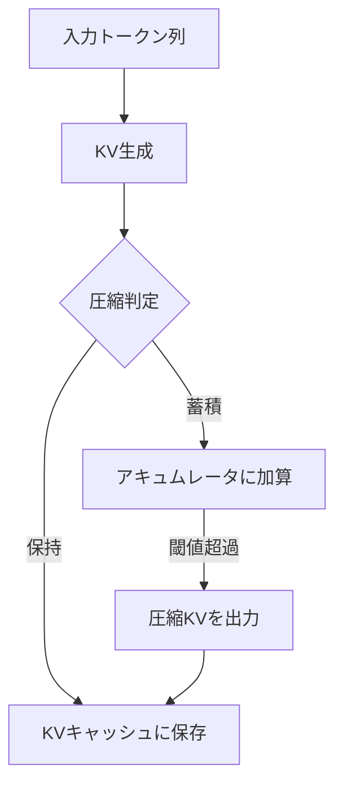

本記事は [Dynamic Memory Compression: Retrofitting LLMs for Accelerated Inference](https://proceedings.mlr.press/v235/nawrot24a.html)（ICML 2024）の解説記事です。

## 論文概要（Abstract）

Dynamic Memory Compression（DMC）は、Transformerの推論時にKVキャッシュをオンラインで動的に圧縮する手法である。著者らは、アテンションヘッドごと・レイヤーごとに異なる圧縮率を学習させることで、モデル品質を維持しながらKVキャッシュのメモリ使用量を大幅に削減できると報告している。Llama 2 7Bモデルを用いたH100 GPU上の評価では、最大3.7倍のスループット向上が報告されている。

この記事は [Zenn記事: Responses API時代のThread管理設計：マルチテナントSaaSの会話状態管理](https://zenn.dev/0h_n0/articles/16d46fe888192a) の深掘りです。

## 情報源

- **会議名**: ICML 2024（International Conference on Machine Learning）
- **年**: 2024
- **URL**: [https://proceedings.mlr.press/v235/nawrot24a.html](https://proceedings.mlr.press/v235/nawrot24a.html)
- **著者**: Piotr Nawrot, Adrian Łańcucki, Marcin Chochowski et al.
- **発表形式**: oral/poster（詳細は論文参照）

## カンファレンス情報

**ICMLについて**: ICMLは機械学習分野の最高峰国際会議の一つで、理論から応用まで幅広い研究を扱う。採択率は例年25%前後であり、厳しい査読プロセスを経て採択された論文のみが発表される。

## 技術的詳細（Technical Details）

### KVキャッシュの問題

Transformerベースの自己回帰生成において、各デコードステップでは過去の全トークンのKey-Valueペアを参照する必要がある。KVキャッシュのメモリ使用量はシーケンス長に比例して増加する：

$$
\text{KV Memory} = 2 \times L \times H \times S \times d_h \times \text{sizeof(dtype)}
$$

ここで、
- $L$: レイヤー数
- $H$: アテンションヘッド数
- $S$: シーケンス長
- $d_h$: ヘッド次元
- $\text{sizeof(dtype)}$: データ型のバイトサイズ（float16: 2バイト）

例えば、Llama 2 7Bモデル（$L=32, H=32, d_h=128$）でシーケンス長$S=4096$の場合：

$$
2 \times 32 \times 32 \times 4096 \times 128 \times 2 = \text{約2.1GB}
$$

マルチテナントSaaSで複数ユーザーの会話を同時処理する場合、このKVキャッシュメモリが同時処理可能な会話数のボトルネックとなる。

### DMCのアプローチ

DMCは、推論時にKVキャッシュを**オンラインで動的に圧縮**する。従来の手法がキャッシュ全体に一律の圧縮率を適用するのに対し、DMCはアテンションヘッドごと・レイヤーごとに異なる圧縮率を自動的に学習する。



### 圧縮メカニズム

DMCの圧縮は、各ヘッド$h$のレイヤー$l$において、蓄積（accumulate）と出力（emit）の2つの操作で定義される。

時刻$t$における蓄積状態$A_t^{l,h}$は以下で更新される：

$$
A_t^{l,h} = A_{t-1}^{l,h} + K_t^{l,h} \otimes V_t^{l,h}
$$

決定変数$z_t^{l,h} \in \{0, 1\}$が出力タイミングを制御する：

$$
z_t^{l,h} = \begin{cases}
1 & \text{（出力：圧縮KVをキャッシュに追加）} \\
0 & \text{（蓄積：次のトークンと統合）}
\end{cases}
$$

$z_t^{l,h} = 1$のとき、蓄積されたKVペアが圧縮KVとしてキャッシュに追加され、アキュムレータがリセットされる。

この決定変数$z$はGumbel-Softmaxで微分可能に近似され、学習時にend-to-endで最適化される。

### ヘッド・レイヤー別の圧縮率

DMCの重要な特徴は、各ヘッドが独自の圧縮率を学習することである。著者らの分析によると：

- **低レイヤーのヘッド**: 比較的高い圧縮率を許容（入力に近い特徴は冗長性が高い）
- **高レイヤーのヘッド**: 低い圧縮率を維持（抽象的な特徴の保持が重要）
- **特定の「retrieval heads」**: ほとんど圧縮されない（情報検索に特化したヘッド）

この不均一な圧縮率の分布は、Transformerの各ヘッドが異なる役割を担っていることを反映している。

### アルゴリズム

```python
from typing import Optional
import torch
import torch.nn as nn


class DynamicMemoryCompression(nn.Module):
    """Dynamic Memory Compressionモジュール"""

    def __init__(self, d_head: int, n_heads: int) -> None:
        super().__init__()
        self.decision_net = nn.Linear(d_head, 1)
        self.temperature = nn.Parameter(torch.ones(n_heads))

    def forward(
        self,
        keys: torch.Tensor,
        values: torch.Tensor,
        accumulator_k: Optional[torch.Tensor] = None,
        accumulator_v: Optional[torch.Tensor] = None,
    ) -> tuple[torch.Tensor, torch.Tensor, torch.Tensor]:
        """KVペアを動的に圧縮する

        Args:
            keys: 現在のKey (batch, heads, 1, d_head)
            values: 現在のValue (batch, heads, 1, d_head)
            accumulator_k: 蓄積中のKey
            accumulator_v: 蓄積中のValue
        Returns:
            compressed_k, compressed_v, decision
        """
        logits = self.decision_net(keys).squeeze(-1)
        decision = torch.sigmoid(logits / self.temperature)

        if accumulator_k is None:
            accumulator_k = keys
            accumulator_v = values
        else:
            accumulator_k = accumulator_k + keys
            accumulator_v = accumulator_v + values

        return accumulator_k, accumulator_v, decision
```

## 実装のポイント（Implementation）

### 既存モデルへのレトロフィット

DMCの特徴は、事前学習済みモデルに対して少量の追加学習（レトロフィット）で適用できることである。著者らは以下の手順を報告している：

1. 事前学習済みモデルの重みを凍結
2. 決定ネットワーク（$z$の判定用）のみを追加
3. 少量のデータ（論文では数千ステップ）でファインチューニング
4. 推論時はファインチューニング済み決定ネットワークを使用

この設計により、OpenAIのgpt-4.1やClaude等の既存APIモデルには直接適用できないが、自社ホスティングするモデル（Llama, Mistral等）には有効な手法となる。

### マルチテナント環境での意義

KVキャッシュの圧縮はマルチテナントLLMサービングにおいて以下の効果をもたらす：

| 指標 | 圧縮なし | DMC (4x圧縮) |
|------|---------|-------------|
| 同時会話数 | $N$ | 約$4N$ |
| KVキャッシュ/会話 | 2.1GB | 約0.5GB |
| GPU使用率 | 高 | 効率化 |

## Production Deployment Guide

### AWS実装パターン（コスト最適化重視）

| 規模 | 月間リクエスト | 推奨構成 | 月額コスト | 主要サービス |
|------|--------------|---------|-----------|------------|
| **Small** | ~3,000 (100/日) | GPU Serverless | $200-500 | SageMaker Serverless + S3 |
| **Medium** | ~30,000 (1,000/日) | GPU Instance | $800-2,000 | SageMaker g5.xlarge + ElastiCache |
| **Large** | 300,000+ (10,000/日) | GPU Cluster | $3,000-8,000 | EKS + g5 Spot + Karpenter |

**Small構成の詳細（月額$200-500）**:
- **SageMaker Serverless Inference**: DMC適用済みLlama 2 7B ($150/月)
- **S3**: モデルアーティファクト保存 ($5/月)
- **API Gateway + Lambda**: リクエストルーティング ($30/月)
- **CloudWatch**: 推論レイテンシ・KVキャッシュ使用量監視 ($10/月)

**コスト試算の注意事項**: 上記は2026年4月時点のAWS東京リージョン料金に基づく概算値です。GPU instanceの料金は変動が大きいため、最新料金は[AWS料金計算ツール](https://calculator.aws/)で確認してください。

### Terraformインフラコード

```hcl
resource "aws_sagemaker_model" "dmc_llama" {
  name               = "dmc-llama2-7b"
  execution_role_arn = aws_iam_role.sagemaker.arn

  primary_container {
    image          = "763104351884.dkr.ecr.ap-northeast-1.amazonaws.com/huggingface-pytorch-tgi-inference:2.4.0-tgi3.1.0-gpu-py311-cu124-ubuntu22.04"
    model_data_url = "s3://${aws_s3_bucket.models.id}/dmc-llama2-7b/model.tar.gz"

    environment = {
      HF_MODEL_ID          = "meta-llama/Llama-2-7b-hf"
      SM_NUM_GPUS           = "1"
      MAX_INPUT_LENGTH      = "4096"
      MAX_TOTAL_TOKENS      = "8192"
      ENABLE_DMC            = "true"
      DMC_COMPRESSION_RATIO = "4"
    }
  }
}

resource "aws_sagemaker_endpoint_configuration" "dmc" {
  name = "dmc-endpoint-config"

  production_variants {
    variant_name           = "primary"
    model_name             = aws_sagemaker_model.dmc_llama.name
    instance_type          = "ml.g5.xlarge"
    initial_instance_count = 1
  }
}
```

### コスト最適化チェックリスト

- [ ] GPU Instance: Spot使用で最大90%削減
- [ ] DMC圧縮率の最適化（品質とメモリのトレードオフ）
- [ ] SageMaker: Auto Scaling設定（アイドル時0台）
- [ ] モデルサイズ: 7Bモデルで十分な場合は大型モデルを避ける
- [ ] KVキャッシュ: DMCにより同時会話数4倍 → インスタンス数削減
- [ ] Reserved Instances: 1年コミットで72%削減
- [ ] Savings Plans: SageMaker Savings Plans検討
- [ ] バッチ推論: 非リアルタイム処理はBatch Transform使用
- [ ] AWS Budgets: 月額予算設定（80%警告）
- [ ] CloudWatch: GPU使用率・KVキャッシュ使用量監視
- [ ] Cost Anomaly Detection: 自動異常検知
- [ ] タグ戦略: テナント別GPU使用量追跡
- [ ] 開発環境: 夜間・週末のインスタンス停止
- [ ] モデル最適化: INT8量子化との併用検討
- [ ] ネットワーク: VPCエンドポイント使用でNAT Gatewayコスト削減
- [ ] S3: モデルアーティファクトのライフサイクル管理
- [ ] 日次コストレポート: SNS通知
- [ ] Trusted Advisor: 未使用リソース検出
- [ ] Compute Optimizer: インスタンスタイプ最適化
- [ ] マルチリージョン: レイテンシ要件に応じた配置最適化

## 実験結果（Results）

### Llama 2 7Bでのスループット評価

著者らは、H100 GPU上でLlama 2 7Bモデルを用いた評価を行っている。

| 圧縮率 | スループット向上 | 品質低下（Perplexity増加） |
|--------|---------------|-------------------------|
| 2x | 約1.8倍 | 微小（著者ら報告） |
| 4x | 約3.7倍 | 軽微（著者ら報告） |
| 8x | 約5倍以上 | 中程度（著者ら報告） |

著者らは、4倍圧縮時にPerplexityの増加が許容範囲内であり、実用的なトレードオフであると報告している。

### 下流タスクでの性能

著者らは、言語モデリング・質問応答・要約タスクにおいて、4倍圧縮時の性能低下が1-2%程度であったと報告している。特にドキュメント要約タスクでは、KVキャッシュの圧縮がむしろノイズ除去として機能し、微小な性能向上が見られたケースもあったとされている。

## 実運用への応用（Practical Applications）

DMCは、Zenn記事で議論されているマルチテナントSaaSの会話状態管理と以下の点で関連する：

**同時会話数の拡大**: KVキャッシュが4倍圧縮されることで、同一GPUで処理可能な同時会話数が増加する。これはテナント数の拡大やコスト効率の改善に直結する。

**Compaction APIとの関係**: OpenAIのCompaction APIがセマンティックレベルでの会話圧縮を行うのに対し、DMCはアテンション機構のレベルでKVキャッシュを圧縮する。両者は異なるレイヤーで動作するが、「不要な情報を削除してコンテキスト容量を確保する」という目的は共通している。

**自社ホスティングLLMでの活用**: APIプロバイダ（OpenAI, Anthropic）を使用する場合はKVキャッシュの管理はプロバイダ側の責任だが、自社でLLMをホスティングする場合（Llama, Mistral等）にはDMCが直接適用可能である。

## まとめ

DMCは、推論時のKVキャッシュをヘッド・レイヤー別に動的圧縮する手法である。4倍圧縮時に3.7倍のスループット向上を達成しつつ、品質低下を最小限に抑えている点が評価されている。マルチテナントLLMサービングにおいて、同時処理可能な会話数を増やし、インフラコストを削減する有効な手段となりうる。

## 参考文献

- **Conference URL**: [https://proceedings.mlr.press/v235/nawrot24a.html](https://proceedings.mlr.press/v235/nawrot24a.html)
- **Related Zenn article**: [https://zenn.dev/0h_n0/articles/16d46fe888192a](https://zenn.dev/0h_n0/articles/16d46fe888192a)
