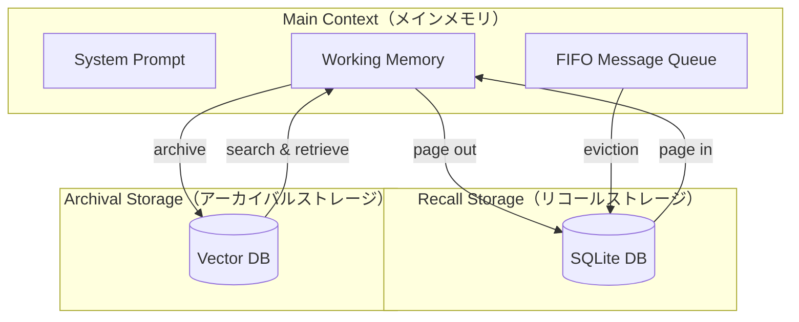

本記事は [MemGPT: Towards LLMs as Operating Systems](https://arxiv.org/abs/2310.04925) の解説記事です。

## 論文概要（Abstract）

MemGPTは、オペレーティングシステム（OS）の仮想メモリ階層の設計をLLMのコンテキスト管理に応用した手法である。著者らは、LLMのコンテキストウィンドウを「メインメモリ」、外部ストレージを「ディスク」と見なし、LLM自身が関数呼び出しを通じて情報のページイン・ページアウトを自律的に制御するアーキテクチャを提案している。これにより、固定長コンテキストウィンドウの制約を超えた長期会話や大規模ドキュメント分析が可能になると報告されている。

この記事は [Zenn記事: Responses API時代のThread管理設計：マルチテナントSaaSの会話状態管理](https://zenn.dev/0h_n0/articles/16d46fe888192a) の深掘りです。

## 情報源

- **arXiv ID**: 2310.04925
- **URL**: [https://arxiv.org/abs/2310.04925](https://arxiv.org/abs/2310.04925)
- **著者**: Charles Packer, Vivian Fang, Shishir G. Patil et al.
- **発表年**: 2023
- **分野**: cs.AI, cs.CL

## 背景と動機（Background & Motivation）

LLMの実用化が進む中で、コンテキストウィンドウの長さ制限は根本的なボトルネックとなっている。著者らは、既存のLLMシステムがコンテキスト長を超えるタスク（長期会話、大規模ドキュメント分析）に対応できない問題を指摘している。

従来のアプローチには以下の課題があると論文で述べられている：

1. **固定長コンテキストの限界**: GPT-4の8Kトークン制約下では、数十ターンの会話で情報が溢れる
2. **単純なtruncation**: 古いメッセージを切り捨てると、過去の重要な文脈が失われる
3. **RAG（検索拡張生成）の制約**: 外部検索は有用だが、会話の流れや推論の連続性を維持できない

著者らは、OSがプロセスに対して「無限のメモリ」という抽象化を提供するのと同様に、LLMに対しても仮想的なコンテキスト空間を提供できるのではないかという着想からMemGPTを設計している。

## 主要な貢献（Key Contributions）

- **貢献1: 仮想コンテキスト管理アーキテクチャ** — OSの仮想メモリ階層（レジスタ→メインメモリ→ディスク）をLLMのコンテキスト管理にマッピングし、3層のメモリ階層を設計
- **貢献2: 自律的メモリ管理** — LLM自身が関数呼び出しを通じてメモリ操作（ページイン/ページアウト/検索/追記）を行う仕組みを実装
- **貢献3: 2つのドメインでの評価** — 長期会話エージェント（Deep Memory Retrieval）とドキュメント分析の2タスクで、固定コンテキストLLMを上回る性能を実証

## 技術的詳細（Technical Details）

### 3層メモリアーキテクチャ

MemGPTの中核は、OSの仮想メモリに着想を得た3層のメモリ階層である。



各層の役割は以下の通りである：

| メモリ層 | OS対応 | 内容 | 永続性 | アクセス速度 |
|---------|--------|------|-------|------------|
| Main Context | メインメモリ | システムプロンプト + ワーキングメモリ + 直近メッセージ | 揮発（コンテキスト内） | 即座 |
| Recall Storage | ディスク（構造化） | 過去の全会話ログ | 永続（SQLite） | 検索必要 |
| Archival Storage | ディスク（非構造化） | 外部知識・長期記憶 | 永続（Vector DB） | 検索必要 |

### 関数呼び出しによるメモリ操作

MemGPTでは、LLMが以下の関数を呼び出すことでメモリ操作を行う。これはOpenAIの関数呼び出し機能（Function Calling）を活用している。

```python
from typing import Optional


def core_memory_append(section: str, content: str) -> str:
    """ワーキングメモリに情報を追記する

    Args:
        section: メモリセクション名（"human" or "persona"）
        content: 追記する内容
    Returns:
        更新後のメモリ状態
    """
    ...


def core_memory_replace(
    section: str, old_content: str, new_content: str
) -> str:
    """ワーキングメモリの内容を置換する"""
    ...


def archival_memory_insert(content: str) -> str:
    """アーカイバルストレージに情報を永続保存する"""
    ...


def archival_memory_search(
    query: str, page: Optional[int] = None
) -> list[str]:
    """アーカイバルストレージをセマンティック検索する"""
    ...


def conversation_search(
    query: str, page: Optional[int] = None
) -> list[dict]:
    """リコールストレージから過去の会話を検索する"""
    ...
```

### メッセージキューとイベント駆動

Main Contextのメッセージ部分はFIFOキューとして管理され、コンテキストウィンドウの上限に達すると古いメッセージがRecall Storageに退避（evict）される。この退避処理はOSのページスワップに相当する。

退避時の処理フローは以下の通りである：

1. コンテキストトークン数が閾値を超過
2. 最も古いメッセージ群をRecall Storage（SQLite）に書き出し
3. Main Contextから削除
4. 必要に応じてLLMがconversation_searchで過去メッセージを検索・復元

### コンテキストウィンドウの構成

著者らは、Main Contextを以下のように構成していると報告している：

$$
C_{\text{total}} = C_{\text{system}} + C_{\text{working}} + C_{\text{messages}} + C_{\text{functions}}
$$

ここで、
- $C_{\text{system}}$: システムプロンプトのトークン数（固定）
- $C_{\text{working}}$: ワーキングメモリ（ユーザー/ペルソナ情報）のトークン数（可変、LLMが編集）
- $C_{\text{messages}}$: 直近の会話メッセージのトークン数（FIFO管理）
- $C_{\text{functions}}$: 関数定義のトークン数（固定）

$C_{\text{total}}$がモデルのコンテキスト上限（例: GPT-4の8,192トークン）に近づくと、$C_{\text{messages}}$から古いメッセージが退避される。

## 実装のポイント（Implementation）

### マルチテナント対応の設計

MemGPTの設計は、マルチテナントSaaSでの会話状態管理に応用可能である。各テナント/ユーザーに対して独立したメモリ階層を割り当てることで、データ分離を実現できる。

```python
from dataclasses import dataclass, field


@dataclass
class TenantMemoryConfig:
    """テナントごとのメモリ設定"""
    tenant_id: str
    user_id: str
    working_memory_tokens: int = 2000
    message_buffer_tokens: int = 4000
    archival_db_path: str = ""
    recall_db_path: str = ""

    def __post_init__(self) -> None:
        if not self.archival_db_path:
            self.archival_db_path = (
                f"data/archival/{self.tenant_id}/{self.user_id}"
            )
        if not self.recall_db_path:
            self.recall_db_path = (
                f"data/recall/{self.tenant_id}/{self.user_id}.db"
            )
```

### OpenAI Responses APIとの対応関係

MemGPTの概念はOpenAI Responses APIの会話状態管理パターンと以下のように対応する：

| MemGPT概念 | Responses API対応 | 役割 |
|-----------|------------------|------|
| Main Context | input配列 | 現在のコンテキスト |
| Recall Storage | previous_response_idチェーン | 過去の会話参照 |
| Archival Storage | 外部DB（アプリ側管理） | 長期記憶 |
| メモリ退避 | Compaction API | コンテキスト圧縮 |
| 関数呼び出し | Tool use | メモリ操作 |

## Production Deployment Guide

### AWS実装パターン（コスト最適化重視）

**トラフィック量別の推奨構成**:

| 規模 | 月間リクエスト | 推奨構成 | 月額コスト | 主要サービス |
|------|--------------|---------|-----------|------------|
| **Small** | ~3,000 (100/日) | Serverless | $50-150 | Lambda + Bedrock + DynamoDB |
| **Medium** | ~30,000 (1,000/日) | Hybrid | $300-800 | Lambda + ECS Fargate + ElastiCache |
| **Large** | 300,000+ (10,000/日) | Container | $2,000-5,000 | EKS + Karpenter + EC2 Spot |

**Small構成の詳細（月額$50-150）**:
- **Lambda**: 1GB RAM, 60秒タイムアウト ($20/月)
- **Bedrock**: Claude 3.5 Haiku, Prompt Caching有効 ($80/月)
- **DynamoDB**: On-Demand, Recall Storage用 ($10/月)
- **OpenSearch Serverless**: Archival Storage用ベクトル検索 ($30/月)
- **CloudWatch**: 基本監視 ($5/月)

**コスト削減テクニック**:
- Spot Instances使用で最大90%削減（EKS + Karpenter）
- Bedrock Batch API使用で50%割引
- Prompt Caching有効化で30-90%削減
- DynamoDB On-Demandで低トラフィック時のコスト最適化

**コスト試算の注意事項**: 上記は2026年4月時点のAWS ap-northeast-1（東京）リージョン料金に基づく概算値です。実際のコストはトラフィックパターン、リージョン、バースト使用量により変動します。最新料金は[AWS料金計算ツール](https://calculator.aws/)で確認してください。

### Terraformインフラコード

**Small構成（Serverless）: Lambda + Bedrock + DynamoDB**

```hcl
module "vpc" {
  source  = "terraform-aws-modules/vpc/aws"
  version = "~> 5.0"

  name = "memgpt-vpc"
  cidr = "10.0.0.0/16"
  azs  = ["ap-northeast-1a", "ap-northeast-1c"]
  private_subnets = ["10.0.1.0/24", "10.0.2.0/24"]

  enable_nat_gateway   = false
  enable_dns_hostnames = true
}

resource "aws_iam_role" "lambda_memgpt" {
  name = "lambda-memgpt-role"

  assume_role_policy = jsonencode({
    Version = "2012-10-17"
    Statement = [{
      Action    = "sts:AssumeRole"
      Effect    = "Allow"
      Principal = { Service = "lambda.amazonaws.com" }
    }]
  })
}

resource "aws_iam_role_policy" "bedrock_invoke" {
  role = aws_iam_role.lambda_memgpt.id

  policy = jsonencode({
    Version = "2012-10-17"
    Statement = [{
      Effect   = "Allow"
      Action   = ["bedrock:InvokeModel", "bedrock:InvokeModelWithResponseStream"]
      Resource = "arn:aws:bedrock:ap-northeast-1::foundation-model/anthropic.claude-3-5-haiku*"
    }]
  })
}

resource "aws_lambda_function" "memgpt_handler" {
  filename      = "lambda.zip"
  function_name = "memgpt-conversation-handler"
  role          = aws_iam_role.lambda_memgpt.arn
  handler       = "index.handler"
  runtime       = "python3.12"
  timeout       = 60
  memory_size   = 1024

  environment {
    variables = {
      BEDROCK_MODEL_ID    = "anthropic.claude-3-5-haiku-20241022-v1:0"
      RECALL_TABLE        = aws_dynamodb_table.recall.name
      ARCHIVAL_COLLECTION = "memgpt-archival"
    }
  }
}

resource "aws_dynamodb_table" "recall" {
  name         = "memgpt-recall-storage"
  billing_mode = "PAY_PER_REQUEST"
  hash_key     = "tenant_user_id"
  range_key    = "timestamp"

  attribute {
    name = "tenant_user_id"
    type = "S"
  }

  attribute {
    name = "timestamp"
    type = "N"
  }

  ttl {
    attribute_name = "expire_at"
    enabled        = true
  }
}
```

### 運用・監視設定

**CloudWatch Logs Insights クエリ**:

```sql
fields @timestamp, tenant_id, operation, tokens_used
| stats sum(tokens_used) as total_tokens by tenant_id, bin(1h)
| filter total_tokens > 50000
```

**CloudWatch アラーム**:

```python
import boto3

cloudwatch = boto3.client('cloudwatch')

cloudwatch.put_metric_alarm(
    AlarmName='memgpt-context-overflow',
    ComparisonOperator='GreaterThanThreshold',
    EvaluationPeriods=1,
    MetricName='ContextOverflowCount',
    Namespace='MemGPT/Custom',
    Period=3600,
    Statistic='Sum',
    Threshold=100,
    AlarmDescription='メモリ退避が頻発（コンテキスト設計の見直しが必要）'
)
```

### コスト最適化チェックリスト

- [ ] ~100 req/日 → Lambda + Bedrock (Serverless) - $50-150/月
- [ ] ~1000 req/日 → ECS Fargate + Bedrock (Hybrid) - $300-800/月
- [ ] 10000+ req/日 → EKS + Spot Instances (Container) - $2,000-5,000/月
- [ ] EC2: Spot Instances優先（最大90%削減）
- [ ] Bedrock Batch API: 非リアルタイム処理に50%割引
- [ ] Prompt Caching: システムプロンプト固定部分に30-90%削減
- [ ] DynamoDB: On-Demand課金で低トラフィック時最適化
- [ ] Lambda: メモリサイズ最適化（CloudWatch Insights分析）
- [ ] AWS Budgets: 月額予算設定（80%で警告、100%でアラート）
- [ ] CloudWatch アラーム: コンテキストオーバーフロー頻度監視
- [ ] Cost Anomaly Detection: 自動異常検知
- [ ] タグ戦略: テナント別コスト可視化
- [ ] S3ライフサイクル: 古いアーカイバルデータの自動削除
- [ ] 開発環境: 夜間停止設定
- [ ] Reserved Instances: 1年コミットで72%削減
- [ ] Savings Plans: Compute Savings Plans検討
- [ ] トークン数制限: max_tokens設定で過剰生成防止
- [ ] モデル選択: 簡易タスクはHaiku、複雑タスクはSonnet
- [ ] 日次コストレポート: SNS/Slackへ自動送信
- [ ] 未使用リソース: Lambda Insights, Trusted Advisor活用

## 実験結果（Results）

### 長期会話タスク（Deep Memory Retrieval）

著者らは、MSC（Multi-Session Chat）データセットを基にしたDeep Memory Retrieval（DMR）タスクで評価を行っている。DMRでは、過去の会話セッションで共有された情報を後のセッションで正確に想起できるかを測定する。

| モデル構成 | DMR正解率 | 会話一貫性 |
|-----------|----------|-----------|
| GPT-4（8K、truncation） | 論文Figure 5より低い値を記録 | 文脈断絶が頻発 |
| GPT-4 + MemGPT | 固定コンテキストを上回る | 過去情報の想起に成功 |
| GPT-3.5 + MemGPT | GPT-4単体と同等程度 | メモリ操作の精度が低下 |

著者らは、MemGPTを搭載したGPT-4が、固定コンテキストのGPT-4と比較してDMRタスクで一貫して高い性能を示したと報告している（論文Figure 5より）。Elo評価による人間評価でも、MemGPTエージェントが固定コンテキストエージェントに対して優位であったとされている。

### ドキュメント分析タスク

コンテキストウィンドウを超える長文ドキュメントの質問応答において、MemGPTはドキュメント全体をArchival Storageに格納し、質問に応じて関連部分を検索・参照する方式を採用している。著者らは、この方式が単純なtruncationと比較して回答の正確性と網羅性で優れていたと報告している。

## 実運用への応用（Practical Applications）

MemGPTの設計は、Zenn記事で解説されているResponses APIの会話状態管理と密接に関連する。

**Responses APIとの対応**:
- MemGPTの「Main Context → Recall Storage退避」は、Responses APIのCompaction APIによるコンテキスト圧縮に概念的に対応する
- MemGPTの「Archival Storage検索」は、SaaSにおける会話履歴DB（ConversationMappingテーブル）からの過去情報参照に対応する
- MemGPTの「テナント別メモリ分離」は、マルチテナントSaaSのConversation IDスコープ管理に直接応用可能

**マルチテナントSaaSでの活用**:
- テナントごとにRecall Storage（DynamoDB）とArchival Storage（OpenSearch）を分離配置
- ワーキングメモリサイズをテナントのプランに応じて可変設定（Free: 1,000トークン、Pro: 4,000トークン）
- メモリ操作ログをテナント別に記録し、コスト追跡に活用

## 関連研究（Related Work）

- **Longformer / BigBird**: スパースアテンションによるコンテキスト長拡張。MemGPTとは異なり、モデルアーキテクチャ自体を変更する必要がある
- **RAG (Retrieval-Augmented Generation)**: 外部知識の検索・統合。MemGPTのArchival Storageと類似するが、MemGPTは会話の文脈全体を管理する点で異なる
- **RecurrentGPT**: リカレント機構による長文生成。MemGPTは関数呼び出しベースで、より柔軟なメモリ操作が可能

## まとめと今後の展望

MemGPTは、OSの仮想メモリ管理という成熟した概念をLLMのコンテキスト管理に応用した研究である。3層メモリ階層と関数呼び出しベースの自律的メモリ管理により、固定長コンテキストの制約を超えた長期会話を実現している。

マルチテナントSaaSの会話状態管理において、MemGPTの設計思想はResponses APIのCompaction APIやConversations APIと相補的に活用できる。コンテキスト管理の階層化とテナント別のメモリ分離は、本番SaaSの設計において重要な指針となる。

## 参考文献

- **arXiv**: [https://arxiv.org/abs/2310.04925](https://arxiv.org/abs/2310.04925)
- **Code**: [https://github.com/cpacker/MemGPT](https://github.com/cpacker/MemGPT)（Apache 2.0ライセンス）
- **Related Zenn article**: [https://zenn.dev/0h_n0/articles/16d46fe888192a](https://zenn.dev/0h_n0/articles/16d46fe888192a)
