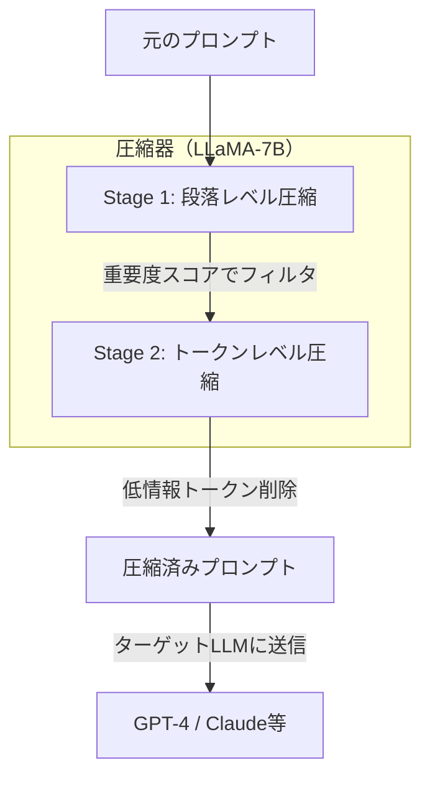

本記事は [LLMLingua: Compressing Prompts for Accelerated Inference of Large Language Models](https://arxiv.org/abs/2310.06201) の解説記事です。

## 論文概要（Abstract）

LLMLinguaは、小型言語モデル（LLaMA-7B等）を圧縮器として使用し、大型LLM（GPT-4等）に送信するプロンプトを最大20倍圧縮する手法である。著者らは、段落レベルの粗い圧縮とトークンレベルの細かい圧縮を組み合わせた2段階パイプラインにより、元のプロンプトと比較して95%以上の性能を維持しながら、エンドツーエンドのレイテンシを1.8〜2.9倍改善できると報告している。

この記事は [Zenn記事: Responses API時代のThread管理設計：マルチテナントSaaSの会話状態管理](https://zenn.dev/0h_n0/articles/16d46fe888192a) の深掘りです。

## 情報源

- **arXiv ID**: 2310.06201
- **URL**: [https://arxiv.org/abs/2310.06201](https://arxiv.org/abs/2310.06201)
- **著者**: Huiqiang Jiang, Qianhui Wu, Chin-Yew Lin et al.（Microsoft Research）
- **発表年**: 2023（EMNLP 2023）
- **分野**: cs.CL, cs.AI

## 背景と動機（Background & Motivation）

LLM APIの利用コストはトークン数に比例するため、プロンプト長の削減は直接的なコスト削減につながる。著者らは以下の課題を指摘している：

1. **コスト問題**: GPT-4等の大型モデルのAPI利用料は入力トークン数に比例し、長いプロンプト（システムプロンプト + 会話履歴 + Few-Shot例 + ドキュメント）は高コストとなる
2. **レイテンシ問題**: 入力トークン数の増加はprefill段階の計算量増加に直結し、応答レイテンシが悪化する
3. **コンテキスト長制限**: 圧縮によりコンテキスト長の実効的な利用可能量を拡大できる

著者らは、プロンプト内のすべてのトークンが等しく重要ではなく、情報理論的に冗長なトークンを特定・削除することで、意味を保持しながら圧縮が可能であると主張している。

## 主要な貢献（Key Contributions）

- **貢献1: 2段階圧縮パイプライン** — 段落レベル（粗い）とトークンレベル（細かい）の2段階で圧縮を行い、予算制約の下で最適な圧縮を実現
- **貢献2: 条件付き次トークン確率に基づくトークン選択** — 小型LMの次トークン予測確率を使い、情報量の低いトークンを特定・削除
- **貢献3: バジェット制御機構** — 目標圧縮率を指定可能で、コストとパフォーマンスのトレードオフを制御可能

## 技術的詳細（Technical Details）

### 2段階圧縮アーキテクチャ



### Stage 1: 段落レベル圧縮

プロンプトを意味的な段落単位に分割し、各段落の重要度を計算する。重要度は、小型LMの段落に対する平均Perplexityで測定される：

$$
\text{Importance}(p_i) = -\frac{1}{|p_i|} \sum_{j=1}^{|p_i|} \log P_{\text{small}}(t_j | t_{<j})
$$

ここで、
- $p_i$: $i$番目の段落
- $|p_i|$: 段落$p_i$のトークン数
- $P_{\text{small}}$: 小型LM（LLaMA-7B）の条件付き確率
- $t_j$: $j$番目のトークン

Perplexityが高い段落は「予測困難 = 情報量が高い」と判断され、保持される。低い段落は冗長として削除候補となる。

### Stage 2: トークンレベル圧縮

Stage 1を通過した段落内で、個々のトークンの重要度を条件付き次トークン確率で評価する：

$$
s_j = -\log P_{\text{small}}(t_j | t_{<j})
$$

スコア$s_j$が閾値$\tau$以下のトークンは「次のトークンとして高確率で予測可能 = 冗長」と判断し、削除する。

$$
t_j \in \text{Compressed Prompt} \iff s_j > \tau
$$

閾値$\tau$は目標圧縮率$r$から逆算される：

$$
\tau = \text{Quantile}_{1-r}(\{s_1, s_2, \ldots, s_n\})
$$

### バジェット制御

ユーザーは目標圧縮率$r$を指定でき、Stage 1とStage 2の圧縮割合が自動調整される。

```python
from dataclasses import dataclass


@dataclass
class CompressionBudget:
    """プロンプト圧縮の予算制御"""
    target_ratio: float  # 目標圧縮率（例: 0.5 = 50%圧縮）
    stage1_ratio: float = 0.4  # Stage 1で削除する割合
    preserve_instructions: bool = True  # システムプロンプトは保護

    @property
    def stage2_ratio(self) -> float:
        """Stage 2で必要な追加圧縮率"""
        remaining_after_stage1 = 1.0 - self.stage1_ratio
        if remaining_after_stage1 <= 0:
            return 0.0
        return max(
            0.0,
            1.0 - self.target_ratio / remaining_after_stage1,
        )
```

### 具体的な圧縮例

**圧縮前**（170トークン）:
```
あなたはカスタマーサポートのAIアシスタントです。お客様からの
問い合わせに対して、丁寧で正確な回答を提供してください。
過去の会話履歴を参考にして、一貫性のある対応を心がけて
ください。回答は簡潔にまとめてください。
```

**圧縮後**（85トークン、50%圧縮）:
```
カスタマーサポートAIアシスタント。問い合わせに丁寧正確な回答
提供。過去会話履歴参考、一貫性ある対応。回答簡潔。
```

機能語（「です」「てください」「を」など）が優先的に削除され、内容語が保持される。

## 実装のポイント（Implementation）

### SaaSのAPIコスト最適化への応用

LLMLinguaは、マルチテナントSaaSにおけるOpenAI API（Responses API含む）のコスト削減に直接適用できる。

```python
from typing import Optional


class PromptCompressor:
    """プロンプト圧縮によるAPIコスト最適化"""

    def __init__(
        self,
        compression_ratio: float = 0.5,
        compressor_model: str = "meta-llama/Llama-2-7b-hf",
    ) -> None:
        self.compression_ratio = compression_ratio
        self.compressor_model = compressor_model

    def compress_conversation_history(
        self,
        system_prompt: str,
        history: list[dict],
        current_message: str,
        preserve_recent_n: int = 3,
    ) -> list[dict]:
        """会話履歴を圧縮してAPIコストを削減する

        Args:
            system_prompt: システムプロンプト（圧縮対象外）
            history: 過去の会話履歴
            current_message: 現在のユーザーメッセージ
            preserve_recent_n: 直近N件は圧縮しない
        Returns:
            圧縮済みメッセージ配列
        """
        preserved = history[-preserve_recent_n:]
        to_compress = history[:-preserve_recent_n]

        compressed_history = self._compress_messages(
            to_compress, self.compression_ratio
        )

        return [
            {"role": "system", "content": system_prompt},
            *compressed_history,
            *preserved,
            {"role": "user", "content": current_message},
        ]

    def _compress_messages(
        self,
        messages: list[dict],
        ratio: float,
    ) -> list[dict]:
        """メッセージ群をLLMLingua方式で圧縮"""
        # 実装: LLMLinguaライブラリを使用
        # pip install llmlingua
        ...
        return messages  # 圧縮済み
```

### Responses APIとの組み合わせ

LLMLinguaの圧縮は、Responses APIの3つの状態管理パターンと以下のように組み合わせて活用できる：

| パターン | LLMLingua適用箇所 | 効果 |
|---------|------------------|------|
| 手動管理 | input配列内の古いメッセージ | 直接的なトークンコスト削減 |
| previous_response_id | 適用不可（API側管理） | N/A |
| Conversations API | 適用不可（API側管理） | N/A |

手動管理パターンでは、アプリケーション側でメッセージ配列を制御するため、LLMLinguaによる圧縮を適用するのが最も効果的である。Zenn記事で指摘されている「previous_response_idチェーンでは過去の全入力トークンが毎ターン課金される」問題に対して、手動管理 + LLMLingua圧縮は有効な対策となる。

### テナント別圧縮率の最適化

マルチテナントSaaSでは、テナントのプランに応じて圧縮率を調整できる：

```python
TENANT_COMPRESSION_CONFIG = {
    "free": {
        "compression_ratio": 0.3,  # 積極的に圧縮（70%削減）
        "preserve_recent_n": 2,
    },
    "pro": {
        "compression_ratio": 0.5,  # 中程度（50%削減）
        "preserve_recent_n": 5,
    },
    "enterprise": {
        "compression_ratio": 0.8,  # 保守的（20%削減）
        "preserve_recent_n": 10,
    },
}
```

## Production Deployment Guide

### AWS実装パターン（コスト最適化重視）

| 規模 | 月間リクエスト | 推奨構成 | 月額コスト | 主要サービス |
|------|--------------|---------|-----------|------------|
| **Small** | ~3,000 (100/日) | CPU Serverless | $30-100 | Lambda + Bedrock + S3 |
| **Medium** | ~30,000 (1,000/日) | GPU Instance | $500-1,200 | SageMaker g5.xlarge + ECS |
| **Large** | 300,000+ (10,000/日) | GPU Cluster | $2,000-5,000 | EKS + g5 Spot + Karpenter |

**圧縮器の配置パターン**:
- **Small**: Lambda上でGPT-2圧縮器を実行（GPU不要、レイテンシ許容）
- **Medium**: SageMaker上でLLaMA-7B圧縮器を常時起動
- **Large**: EKS上で圧縮器Pod + API呼び出しPodを分離配置

**コスト削減の定量的効果**:
- 圧縮率50%で、Bedrock/OpenAI APIの入力トークンコストが50%削減
- 例: gpt-4.1利用時 $2.00/MTok → $1.00/MTok相当
- 月間30,000リクエスト（平均2,000トークン/リクエスト）で月$60の削減

**コスト試算の注意事項**: 上記は2026年4月時点のAWS東京リージョン料金に基づく概算値です。圧縮器の推論コストと圧縮によるAPI費用削減のトレードオフを事前に検証してください。最新料金は[AWS料金計算ツール](https://calculator.aws/)で確認してください。

### Terraformインフラコード

```hcl
resource "aws_lambda_function" "prompt_compressor" {
  filename      = "compressor.zip"
  function_name = "llmlingua-prompt-compressor"
  role          = aws_iam_role.lambda_compressor.arn
  handler       = "compressor.handler"
  runtime       = "python3.12"
  timeout       = 30
  memory_size   = 2048

  environment {
    variables = {
      COMPRESSOR_MODEL     = "gpt2"
      DEFAULT_RATIO        = "0.5"
      PRESERVE_RECENT      = "3"
      BEDROCK_MODEL_ID     = "anthropic.claude-3-5-haiku-20241022-v1:0"
    }
  }

  layers = [
    aws_lambda_layer_version.pytorch_cpu.arn
  ]
}

resource "aws_lambda_layer_version" "pytorch_cpu" {
  filename   = "pytorch-cpu-layer.zip"
  layer_name = "pytorch-cpu"
  compatible_runtimes = ["python3.12"]
}

resource "aws_cloudwatch_metric_alarm" "compression_ratio" {
  alarm_name          = "llmlingua-compression-ratio-low"
  comparison_operator = "LessThanThreshold"
  evaluation_periods  = 3
  metric_name         = "CompressionRatio"
  namespace           = "LLMLingua/Custom"
  period              = 300
  statistic           = "Average"
  threshold           = 0.3
  alarm_description   = "圧縮率が30%を下回っている（圧縮器の効果が低い）"
}
```

### コスト最適化チェックリスト

- [ ] 圧縮器コスト < API費用削減額であることを検証
- [ ] Small: Lambda + GPT-2 (CPU) で圧縮器コスト最小化
- [ ] Medium/Large: SageMaker/EKS + LLaMA-7B でGPU使用
- [ ] 圧縮率の段階的調整（テナントプラン別）
- [ ] システムプロンプトは圧縮対象外に設定
- [ ] 直近Nターンは圧縮しない（応答品質維持）
- [ ] Spot Instances: 圧縮器GPUに90%削減適用
- [ ] Bedrock Batch API: 非リアルタイム処理に50%割引
- [ ] AWS Budgets: 圧縮器コスト + API費用の合計で管理
- [ ] CloudWatch: 圧縮率・圧縮レイテンシ・API費用削減額を監視
- [ ] Cost Anomaly Detection: 自動異常検知
- [ ] タグ戦略: テナント別の圧縮効果可視化
- [ ] ライフサイクル: 圧縮ログの自動削除
- [ ] Lambda: メモリサイズ最適化（2048MB→1024MBテスト）
- [ ] Reserved Instances: GPU常時起動時は1年コミット
- [ ] 日次レポート: 圧縮率と費用削減のROI自動計算
- [ ] モデル選択: 圧縮器はGPT-2（低コスト）で十分か検証
- [ ] バッチ処理: 複数リクエストの圧縮を一括実行
- [ ] キャッシュ: 同一プロンプトの圧縮結果をElastiCacheで再利用
- [ ] A/Bテスト: 圧縮あり/なしの応答品質比較

## 実験結果（Results）

著者らは、GSM8K、BBH、ShareGPT、arXivデータセット等で評価を行っている。

| 圧縮率 | 性能維持率 | レイテンシ改善 |
|--------|----------|-------------|
| 3.3x | 約98%（著者ら報告） | 1.8倍 |
| 5x | 約97%（著者ら報告） | 2.1倍 |
| 10x | 約96%（著者ら報告） | 2.5倍 |
| 20x | 約95%（著者ら報告） | 2.9倍 |

著者らは、GPT-4とGPT-3.5-Turboをターゲットモデルとして使用し、元のプロンプトと比較して95%以上の性能維持を確認したと報告している。特にGSM8K（数学的推論）では、圧縮によるimpactが最も少なかったとされている。

### 圧縮が困難なケース

著者らは、以下のケースで圧縮品質が低下する傾向を報告している：

- **コード・数式**: 構造的に冗長性が低く、トークン削除が意味破壊につながりやすい
- **固有名詞の密集**: 人名・地名・製品名が連続する箇所は情報密度が高い
- **多言語混在**: 英語以外の言語（日本語含む）では圧縮器の精度が低下する傾向がある

## 実運用への応用（Practical Applications）

LLMLinguaは、Zenn記事のコスト最適化議論と直接関連する。previous_response_idチェーンのコスト問題（ターンごとに過去の全入力トークンが課金される）に対して、手動管理パターンでLLMLinguaを適用することで以下の効果が期待できる：

- **10ターン会話**: 累積トークンを50%圧縮 → 約5ターン分のコストに削減
- **50ターン会話**: 累積トークンを80%圧縮 → 約10ターン分のコストに削減

ただし、圧縮器自体の推論コスト（LLaMA-7BのGPUコスト）とAPI費用削減のROIを事前に検証する必要がある。

## 関連研究（Related Work）

- **LLMLingua-2 (Jiang et al., 2024)**: 本手法の後継版。タスク非依存のデータ蒸留による忠実度向上を実現。日本語対応も改善されている
- **RECOMP (Xu et al., 2023)**: RAGにおける検索結果の圧縮。LLMLinguaが汎用プロンプト圧縮であるのに対し、RECOMPは検索結果に特化
- **Compress to Impress (Chen et al., 2024)**: 会話履歴のセマンティック圧縮。LLMLinguaがトークン削除方式であるのに対し、要約方式

## まとめと今後の展望

LLMLinguaは、小型LMを圧縮器として活用し、大型LLMのAPIコストとレイテンシを改善する手法である。マルチテナントSaaSにおいて、手動管理パターンとの組み合わせでトークンコストを大幅に削減できる。後継のLLMLingua-2ではタスク非依存性と多言語対応が改善されており、本番SaaSでの採用はLLMLingua-2を検討することを推奨する。

## 参考文献

- **arXiv**: [https://arxiv.org/abs/2310.06201](https://arxiv.org/abs/2310.06201)
- **Code**: [https://github.com/microsoft/LLMLingua](https://github.com/microsoft/LLMLingua)（MIT License）
- **LLMLingua-2**: [https://arxiv.org/abs/2403.12968](https://arxiv.org/abs/2403.12968)
- **Related Zenn article**: [https://zenn.dev/0h_n0/articles/16d46fe888192a](https://zenn.dev/0h_n0/articles/16d46fe888192a)
