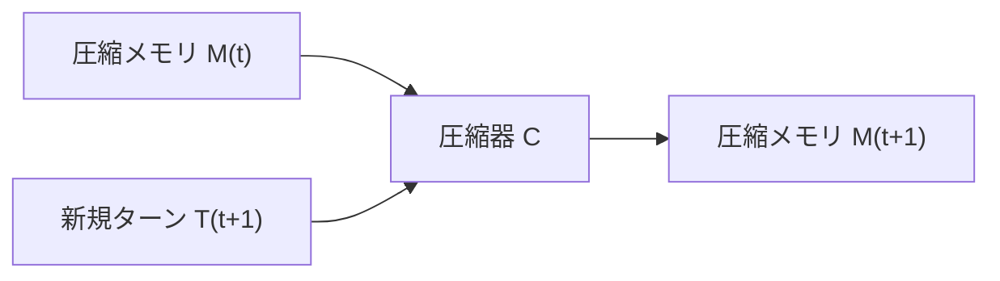

本記事は [Compress to Impress: Unleashing the Potential of Compressive Memory in Real-World Long-Term Conversations](https://arxiv.org/abs/2401.19318) の解説記事です。

## 論文概要（Abstract）

本論文は、長期会話における会話履歴の管理手法として「圧縮メモリ（Compressive Memory）」を提案している。著者らは、過去の会話ターンを逐次的に圧縮・要約しながら蓄積することで、生の会話ログをそのまま保存するよりも高い情報密度を維持できると報告している。MSC（Multi-Session Chat）データセット上での評価では、RAG方式やフルコンテキスト方式と比較して、会話の一貫性とペルソナ追跡精度で優位な結果が示されている。

この記事は [Zenn記事: Responses API時代のThread管理設計：マルチテナントSaaSの会話状態管理](https://zenn.dev/0h_n0/articles/16d46fe888192a) の深掘りです。

## 情報源

- **arXiv ID**: 2401.19318
- **URL**: [https://arxiv.org/abs/2401.19318](https://arxiv.org/abs/2401.19318)
- **著者**: Nuo Chen, Hongguang Li, Juhua Huang et al.
- **発表年**: 2024（COLING 2025に採択）
- **分野**: cs.CL, cs.AI

## 背景と動機（Background & Motivation）

長期にわたるマルチセッション会話では、会話履歴が増加するにつれてコンテキストウィンドウの容量を圧迫する問題がある。著者らは、既存のアプローチに以下の課題があると指摘している：

1. **Truncation方式**: 古い会話を単純に切り捨てるため、過去のセッションで共有された重要な情報（名前、好み、約束事）が完全に失われる
2. **RAG方式**: 過去の会話をベクトルDBに格納し関連部分を検索するが、会話の流れ（対話の連続性）が断片化する
3. **フルコンテキスト方式**: すべての会話履歴をコンテキストに含めるが、コンテキスト腐敗により後半の情報ほど想起精度が低下する

著者らは、人間の記憶がエピソード記憶を圧縮・統合する仕組みに着想を得て、会話履歴を逐次的に圧縮するアプローチを提案している。

## 主要な貢献（Key Contributions）

- **貢献1: 逐次圧縮フレームワーク** — 新しいターンが追加されるたびに、既存の圧縮メモリと最新ターンを統合して再圧縮するオンライン圧縮方式
- **貢献2: ファインチューニングによる圧縮品質向上** — 圧縮タスク専用にファインチューニングしたLLaMA-2-7Bを圧縮器として使用し、汎用LLMより高品質な圧縮を実現
- **貢献3: 実世界長期会話での評価** — MSCデータセット上で、GPT-4による自動評価と自動指標（ROUGE, BERTScore）の両方で既存手法を上回る結果を報告

## 技術的詳細（Technical Details）

### 逐次圧縮アルゴリズム

圧縮メモリの更新は、各ターンの終了時に以下のプロセスで行われる。



形式的には、時刻$t$における圧縮メモリ$M_t$は以下のように定義される：

$$
M_{t+1} = C(M_t, T_{t+1}; \theta_C)
$$

ここで、
- $M_t$: 時刻$t$までの圧縮メモリ（固定長トークン列）
- $T_{t+1}$: 時刻$t+1$の新規会話ターン（ユーザー発話 + アシスタント応答）
- $C$: 圧縮関数（ファインチューニング済みLLM）
- $\theta_C$: 圧縮器のパラメータ

圧縮メモリのトークン数は上限$L_{\max}$で制限される：

$$
|M_t| \leq L_{\max}, \quad \forall t
$$

この制約により、会話がどれだけ長くなっても、圧縮メモリのサイズは一定に保たれる。

### 圧縮器のファインチューニング

著者らは、汎用LLMをそのまま圧縮器として使用した場合、以下の問題が生じると報告している：

1. 重要な固有名詞（人名、日時）の脱落
2. 会話の因果関係の喪失
3. ユーザーの嗜好・ペルソナ情報の欠落

これらの問題を解決するため、LLaMA-2-7Bを圧縮タスク専用にファインチューニングしている。ファインチューニングデータは、MSCデータセットから抽出した会話セッションに対して、GPT-4で高品質な圧縮例を生成して構築している。

### 応答生成時のコンテキスト構成

応答生成時、コンテキストは以下のように構成される：

```python
def build_context(
    system_prompt: str,
    compressed_memory: str,
    recent_turns: list[dict],
    user_message: str,
) -> list[dict]:
    """応答生成用のコンテキストを構築する

    Args:
        system_prompt: システムプロンプト
        compressed_memory: 圧縮済みメモリ（過去の全会話要約）
        recent_turns: 直近の会話ターン（圧縮前の生データ）
        user_message: 現在のユーザー発話
    Returns:
        LLMに渡すメッセージ配列
    """
    messages = [
        {"role": "system", "content": system_prompt},
        {
            "role": "system",
            "content": f"[会話メモリ]\n{compressed_memory}",
        },
    ]
    messages.extend(recent_turns)
    messages.append({"role": "user", "content": user_message})
    return messages
```

直近の数ターンは圧縮せずに生データのまま保持し、それより古いターンは圧縮メモリとして統合する。これにより、直近の対話の自然さを維持しつつ、過去の文脈を効率的に保持できる。

## 実装のポイント（Implementation）

### OpenAI Compaction APIとの対応

本論文の圧縮メモリ手法は、OpenAI Responses APIの Compaction APIと概念的に対応する。

| 圧縮メモリ手法 | OpenAI Compaction API | 共通点 |
|-------------|---------------------|--------|
| 逐次圧縮 $M_{t+1} = C(M_t, T_{t+1})$ | server-side compaction | ターンごとの自動圧縮 |
| 固定長トークン上限 $L_{\max}$ | compact_threshold | 圧縮発動の閾値 |
| ファインチューニング圧縮器 | OpenAI側で最適化 | 圧縮品質の保証 |
| 圧縮メモリ + 直近ターン | compacted items + recent messages | ハイブリッド構成 |

ただし重要な違いもある。Compaction APIの圧縮結果は「暗号化されたオペークなデータ」（OpenAI公式ドキュメントより）であり、デバッグ時に内容を確認できない。一方、本論文の圧縮メモリは人間が読めるテキストであるため、圧縮品質の検証が容易である。

### マルチテナントSaaSでの活用

圧縮メモリ方式はマルチテナントSaaSの会話状態管理に以下のように応用できる：

```python
from dataclasses import dataclass, field
from datetime import datetime, timezone


@dataclass
class TenantConversationState:
    """テナント・ユーザーごとの会話状態"""
    tenant_id: str
    user_id: str
    conversation_id: str
    compressed_memory: str = ""
    recent_turns: list[dict] = field(default_factory=list)
    compression_count: int = 0
    total_original_tokens: int = 0
    total_compressed_tokens: int = 0
    last_compressed_at: datetime = field(
        default_factory=lambda: datetime.now(timezone.utc)
    )

    @property
    def compression_ratio(self) -> float:
        """圧縮率を計算"""
        if self.total_original_tokens == 0:
            return 1.0
        return self.total_compressed_tokens / self.total_original_tokens
```

## Production Deployment Guide

### AWS実装パターン（コスト最適化重視）

| 規模 | 月間リクエスト | 推奨構成 | 月額コスト | 主要サービス |
|------|--------------|---------|-----------|------------|
| **Small** | ~3,000 (100/日) | Serverless | $60-180 | Lambda + Bedrock + DynamoDB |
| **Medium** | ~30,000 (1,000/日) | Hybrid | $400-900 | ECS Fargate + Bedrock + ElastiCache |
| **Large** | 300,000+ (10,000/日) | Container | $2,500-6,000 | EKS + Karpenter + Spot |

**圧縮メモリ固有のコスト考慮**:
- 圧縮処理自体にLLM推論コストが発生する（圧縮器呼び出し）
- Small構成ではBedrock Claude 3.5 Haikuを圧縮器として使用し、コストを抑制
- 圧縮メモリはDynamoDBに永続化（テナント+ユーザー+会話IDをキー）

**コスト試算の注意事項**: 上記は2026年4月時点のAWS東京リージョン料金に基づく概算値です。最新料金は[AWS料金計算ツール](https://calculator.aws/)で確認してください。

### Terraformインフラコード

```hcl
resource "aws_dynamodb_table" "compressed_memory" {
  name         = "conversation-compressed-memory"
  billing_mode = "PAY_PER_REQUEST"
  hash_key     = "tenant_user_id"
  range_key    = "conversation_id"

  attribute {
    name = "tenant_user_id"
    type = "S"
  }

  attribute {
    name = "conversation_id"
    type = "S"
  }

  ttl {
    attribute_name = "expire_at"
    enabled        = true
  }
}

resource "aws_lambda_function" "compressor" {
  filename      = "compressor.zip"
  function_name = "conversation-compressor"
  role          = aws_iam_role.lambda_bedrock.arn
  handler       = "compressor.handler"
  runtime       = "python3.12"
  timeout       = 120
  memory_size   = 1024

  environment {
    variables = {
      BEDROCK_MODEL_ID = "anthropic.claude-3-5-haiku-20241022-v1:0"
      MEMORY_TABLE     = aws_dynamodb_table.compressed_memory.name
      MAX_MEMORY_TOKENS = "2000"
    }
  }
}
```

### コスト最適化チェックリスト

- [ ] ~100 req/日 → Lambda + Bedrock (Serverless) - $60-180/月
- [ ] ~1000 req/日 → ECS Fargate + Bedrock (Hybrid) - $400-900/月
- [ ] 10000+ req/日 → EKS + Spot (Container) - $2,500-6,000/月
- [ ] 圧縮器にHaikuモデル使用（コスト最小化）
- [ ] 圧縮頻度の最適化（毎ターンではなくNターンごと）
- [ ] DynamoDB: On-Demand課金で低トラフィック時最適化
- [ ] 圧縮メモリのTTL設定（プラン別に調整）
- [ ] Spot Instances優先（最大90%削減）
- [ ] Bedrock Batch API: 非リアルタイム圧縮処理に50%割引
- [ ] Prompt Caching: 圧縮器プロンプト固定部分に適用
- [ ] AWS Budgets: 月額予算設定
- [ ] CloudWatch: 圧縮率・圧縮レイテンシ監視
- [ ] Cost Anomaly Detection有効化
- [ ] タグ戦略: テナント別コスト可視化
- [ ] ライフサイクルポリシー: 古い圧縮メモリの自動削除
- [ ] Lambda: メモリサイズ最適化
- [ ] Reserved Instances: 1年コミットで72%削減
- [ ] トークン数制限: 圧縮メモリ上限の設定
- [ ] モデル選択: 圧縮はHaiku、応答生成はSonnet
- [ ] 日次コストレポート: SNS通知設定

## 実験結果（Results）

### MSCデータセットでの評価

著者らは、MSC（Multi-Session Chat）データセットを用いて以下の比較実験を行っている。MSCは最大5セッション（各14ターン）の長期会話データセットである。

| 手法 | ペルソナ追跡精度 | 会話一貫性 | コンテキスト長 |
|------|---------------|-----------|-------------|
| Truncation | 低（著者ら報告） | 文脈断絶が頻発 | 固定（最新N件） |
| RAG | 中（著者ら報告） | 断片的な想起 | 可変（検索依存） |
| フルコンテキスト | 中〜高（著者ら報告） | 後半で劣化 | 全履歴 |
| 圧縮メモリ（本手法） | 高（著者ら報告） | 安定 | 固定（$L_{\max}$） |

著者らは、GPT-4を評価器として使用した自動評価において、圧縮メモリ方式がフルコンテキスト方式とRAG方式の両方を上回ったと報告している。特にペルソナの一貫性（ユーザーが過去に言及した好みや経験を正確に保持）で顕著な差があったとされている。

### 圧縮品質の分析

圧縮比率（元のトークン数に対する圧縮後のトークン数の比）は、5セッション後で約0.15〜0.25であったと著者らは報告している。すなわち、元の会話の75〜85%のトークンが削減される一方、重要な情報の多くが保持されている。

ただし、著者らも認めているように、数値データ（日時、金額）や固有名詞の一部は圧縮過程で脱落するリスクがある。これはOpenAI Compaction APIの圧縮結果が「opaque」であることの理由の一つと推察される。

## 実運用への応用（Practical Applications）

圧縮メモリ方式は、Zenn記事で解説されているResponses APIの3つの状態管理パターンと以下のように組み合わせることができる：

1. **手動管理 + 圧縮メモリ**: input配列に圧縮メモリを含めることで、フルコントロールを維持しつつ長期文脈を保持
2. **previous_response_id + Compaction API**: OpenAI側の圧縮に加えて、アプリ側でも独自の圧縮メモリを保持するハイブリッド方式
3. **Conversations API + 圧縮メモリDB**: Conversations APIの無期限保持に加えて、テナント側DBに圧縮済み要約を蓄積

**テナント別の圧縮戦略**:
- Freeプラン: 積極的圧縮（$L_{\max}$=500トークン）、7日TTL
- Proプラン: 中程度（$L_{\max}$=2,000トークン）、90日TTL
- Enterpriseプラン: 保守的圧縮（$L_{\max}$=4,000トークン）、無期限

## 関連研究（Related Work）

- **MemGPT (Packer et al., 2023)**: 3層メモリ階層による仮想コンテキスト管理。本論文の圧縮メモリは、MemGPTのRecall Storageの圧縮版と位置づけられる
- **LLMLingua (Jiang et al., 2023)**: トークン単位のプロンプト圧縮。本論文はセマンティックな圧縮である点で異なる
- **AutoCompressors (Chevalier et al., 2023)**: 長コンテキストをサマリーベクトルに圧縮。ベクトル表現ではなくテキスト表現を保持する点で本論文は異なる

## まとめと今後の展望

本論文の圧縮メモリ手法は、OpenAI Compaction APIの学術的基盤となる概念を提供している。マルチテナントSaaSにおいて、テナントごとの圧縮メモリをDBに永続化し、コンテキスト予算を制御する設計は、コストとユーザー体験のバランスを取る有効な手段となる。課題として、圧縮による情報ロスのリスクがあり、ビジネスクリティカルな会話では圧縮前の生データも並行して保存する設計が推奨される。

## 参考文献

- **arXiv**: [https://arxiv.org/abs/2401.19318](https://arxiv.org/abs/2401.19318)
- **Related Zenn article**: [https://zenn.dev/0h_n0/articles/16d46fe888192a](https://zenn.dev/0h_n0/articles/16d46fe888192a)
