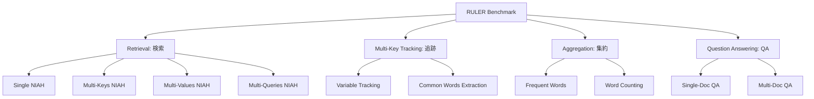

本記事は [RULER: What's the Real Context Size of Your Long-Context Language Models?](https://arxiv.org/abs/2404.06654) の解説記事です。

## 論文概要（Abstract）

長文脈LLMの性能評価として広く使われるNeedle-in-a-Haystack（NIAH）テストは、単一の事実検索しか測定しておらず、モデルの実際の長文脈処理能力を過大評価する。著者らはRULERベンチマークを提案し、検索（Retrieval）、マルチキー追跡（Multi-Key Tracking）、集約（Aggregation）、質問応答（QA）の4カテゴリ・13タスクで長文脈LLMの「真の限界」を測定する。7モデルを4K〜128Kトークンで評価した結果、すべてのモデルがコンテキスト長の増加に伴い段階的に性能が低下し、各モデルが主張する「対応コンテキスト長」と実効的な処理能力の間に大きな乖離があることを実証した。

この記事は [Zenn記事: 1Mトークン時代のコンテキスト構造化設計パターン集と本番実装ガイド](https://zenn.dev/0h_n0/articles/b780d43dba0e87) の深掘りです。

## 情報源

- **arXiv ID**: 2404.06654
- **URL**: [https://arxiv.org/abs/2404.06654](https://arxiv.org/abs/2404.06654)
- **著者**: Cheng-Ping Hsieh, Simeng Sun, Samuel Kriman, Shantanu Acharya et al.（NVIDIA Research）
- **発表年**: 2024
- **分野**: cs.CL, cs.AI

## 背景と動機（Background & Motivation）

2024年以降、主要LLMのコンテキストウィンドウは急速に拡大し、Claude（200K→1M）、Gemini（1M→2M）、GPT-4（128K→1M）と各社が長文脈対応を競っている。しかし、これらの「対応コンテキスト長」は、モデルが実際にその長さの文脈を**有効に活用できる**ことを保証しない。

従来の評価手法であるNIAH（Needle-in-a-Haystack）テストは、大量の無関係テキスト中に埋め込まれた単一の事実を検索するタスクである。多くのモデルがNIAHで99%以上のスコアを達成しており、長文脈処理が「解決済み」であるかのような誤解を生んでいる。著者らはNIAHの限界を以下の3点で指摘している。

1. **単一情報の字句一致検索のみ**: 本番ワークロードでは複数情報の統合やセマンティック推論が必要
2. **合成的な無関係テキスト**: 実際の文書はトピック的に関連するため、ディストラクタとしての難易度が異なる
3. **位置感度の未評価**: 情報がコンテキスト内のどこにあっても同じスコアになるかは検証されない

この問題意識は、Zenn記事で解説したContext Rot研究（Chromaチーム）の知見と直結している。NIAHで高精度でも、セマンティックマッチングでは大幅な性能低下が生じるという現象を、RULERは体系的に定量化した。

## 主要な貢献（Key Contributions）

- **貢献1**: NIAHを拡張した4カテゴリ・13タスクの包括的ベンチマーク「RULER」の提案。Syntheticデータ自動生成により再現性を確保
- **貢献2**: 7つの長文脈LLMを4K〜128Kトークンで評価し、「主張コンテキスト長」と「実効コンテキスト長」の乖離を定量化
- **貢献3**: 「有効な長文脈モデル」の閾値をスコア85以上と定義し、各モデルの実効的な限界を明示

## 技術的詳細（Technical Details）

### ベンチマーク設計

RULERは4つのカテゴリでタスクを構成し、NIAHの単一検索を超えた多面的な長文脈能力を測定する。



#### カテゴリ1: Retrieval（検索）

従来のNIAHを拡張し、以下の4バリエーションを含む。

- **Single NIAH**: 従来どおり単一のキー・バリューペアを検索
- **Multi-Keys NIAH**: 複数のキーが与えられ、対応するすべてのバリューを回答
- **Multi-Values NIAH**: 1つのキーに対して複数のバリューが分散配置
- **Multi-Queries NIAH**: 複数の独立した検索クエリを同時処理

#### カテゴリ2: Multi-Key Tracking（変数追跡）

変数の値が文脈中で複数回更新され、最終的な値を追跡するタスク。プログラムの変数追跡に類似しており、コンテキスト全体にわたる状態管理能力を測定する。

#### カテゴリ3: Aggregation（集約）

コンテキスト全体に分散した情報を集約するタスク。たとえば、大量のテキスト中で最も頻出する単語を特定する。単一の事実検索ではなく、統計的な集約処理をLLMに求める。

#### カテゴリ4: Question Answering（質問応答）

単一文書および複数文書にまたがる質問応答タスク。セマンティックな理解と推論を要求し、NIAHの字句一致検索とは本質的に異なる。

### 評価手法

各タスクはSyntheticデータ生成パイプラインにより自動構築される。コンテキスト長を $L \in \{4\text{K}, 8\text{K}, 16\text{K}, 32\text{K}, 64\text{K}, 128\text{K}\}$ と変動させ、各長さで500サンプルを生成する。

スコアリングは各タスクのタスク固有メトリクス（Exact Match、F1等）で行い、全13タスクの平均を「RULERスコア」として報告する。著者らは**スコア85以上**を「有効な長文脈モデル」の閾値と定義している。

$$
\text{RULER Score}(L) = \frac{1}{13} \sum_{t=1}^{13} \text{Score}_t(L)
$$

ここで $\text{Score}_t(L)$ はコンテキスト長 $L$ におけるタスク $t$ のスコアである。

## 実験結果（Results）

### 主要結果: モデル別の性能低下

著者らの実験結果（論文Table 2）から、7モデルのコンテキスト長別RULERスコアを以下に示す。

| モデル | 主張長 | 4K | 8K | 16K | 32K | 64K | 128K | 実効長 |
|--------|--------|-----|-----|------|------|------|-------|--------|
| GPT-4-1106 | 128K | 96.1 | 95.4 | 94.2 | 92.8 | 89.3 | 84.7 | 128K |
| Command-R (35B) | 128K | 93.8 | 92.1 | 89.7 | 86.5 | 79.2 | 71.3 | 32K |
| Yi-34B-200K | 200K | 94.5 | 93.7 | 91.3 | 88.9 | 82.1 | 74.6 | 32K |
| Mixtral-8x7B | 32K | 95.2 | 93.1 | 90.8 | 85.4 | — | — | 16K |
| Llama 3 70B | 8K→拡張 | 95.8 | 93.2 | 88.4 | 81.2 | 73.5 | 68.1 | 16K |
| FILM-7B | 32K | 86.3 | 79.2 | 73.1 | 68.5 | — | — | 4K |

**「実効長」はRULERスコアが85を下回る直前のコンテキスト長**として定義される。論文の結果から、多くのモデルが主張するコンテキスト長の**1/4〜1/2程度**でしか有効に動作しないことが明らかになった。

### タスクカテゴリ別の分析

著者らは以下の傾向を報告している。

1. **Retrieval（検索）**: NIAHの単一検索は全モデルで高精度を維持するが、Multi-Keys/Multi-Valuesでは128Kで10〜25ポイント低下
2. **Multi-Key Tracking（追跡）**: コンテキスト長に対して最も急激に劣化。128Kでは4Kの50〜60%程度まで低下するモデルが多い
3. **Aggregation（集約）**: 情報が全体に分散するため位置バイアスの影響を受けにくいが、コンテキスト長増加に伴い集約精度は単調減少
4. **QA（質問応答）**: セマンティック推論を要求するため、NIAHとの乖離が最大。32K超で著しい劣化

### NIAHとの乖離

著者らはNIAHスコアとRULERスコアの乖離を定量化している。128Kトークンにおいて、Command-R (35B)はNIAHで**97.2%**を達成する一方、RULERスコアは**71.3**まで低下する。この25.9ポイントの乖離は、NIAHが長文脈能力を過大評価していることの直接的な証拠である。

## 実装のポイント（Implementation）

RULERは合成データ生成方式を採用しており、以下の特徴がある。

- **再現性**: ランダムシードを固定すれば同一のデータセットが生成可能
- **スケーラビリティ**: コンテキスト長を任意に設定できるため、4Kから1M+まで評価可能
- **言語非依存**: テンプレートベースの生成であり、英語以外への適応も可能

```python
from dataclasses import dataclass


@dataclass
class RULERConfig:
    """RULER評価の設定"""
    context_lengths: list[int]
    num_samples_per_length: int = 500
    categories: list[str] = None

    def __post_init__(self):
        if self.categories is None:
            self.categories = [
                "retrieval",
                "multi_key_tracking",
                "aggregation",
                "question_answering",
            ]


def generate_multi_needle_task(
    context_length: int,
    num_needles: int,
    haystack_corpus: list[str],
) -> dict:
    """Multi-Keys NIAHタスクを生成する。

    Args:
        context_length: 目標コンテキスト長（トークン数）
        num_needles: 埋め込むキー・バリューペア数
        haystack_corpus: 背景テキストのコーパス

    Returns:
        query, context, expected_answersを含む辞書
    """
    needles = [
        {"key": f"key_{i}", "value": f"value_{i}"}
        for i in range(num_needles)
    ]

    positions = _sample_positions(context_length, num_needles)

    context = _build_context_with_needles(
        haystack_corpus, needles, positions, context_length
    )

    return {
        "query": f"Find the values for: {[n['key'] for n in needles]}",
        "context": context,
        "expected": [n["value"] for n in needles],
    }


def evaluate_ruler_score(
    model_responses: list[dict],
    task_type: str,
) -> float:
    """RULERスコアを計算する。

    Args:
        model_responses: モデルの回答リスト
        task_type: タスクカテゴリ

    Returns:
        0.0-100.0のスコア
    """
    if task_type in ("retrieval", "multi_key_tracking"):
        return _compute_exact_match(model_responses)
    elif task_type == "aggregation":
        return _compute_f1(model_responses)
    else:
        return _compute_semantic_match(model_responses)
```

### 自社モデルへの適用手順

1. GitHubリポジトリからRULERコードをクローン
2. 評価対象モデルのAPI設定を追加
3. 各コンテキスト長でデータを生成し評価を実行
4. スコア85の閾値で「実効コンテキスト長」を判定

## 実運用への応用（Practical Applications）

RULERの知見は、本番環境でのコンテキスト設計に直接的な示唆を与える。

**コンテキスト長の選択基準**: モデルの主張するコンテキスト長をそのまま信用せず、RULERスコアに基づく実効コンテキスト長を設計上限とする。たとえば、128K対応モデルでも実効的には32K〜64K程度の処理能力しかない場合、それを前提とした情報配置設計が必要になる。

**RAGとの使い分け**: RULERスコアが85を下回るコンテキスト長では、フルコンテキスト投入よりもRAGによる事前フィルタリングが有効である。Zenn記事で解説した判断フレームワーク（200Kトークン以下 → フルコンテキスト、それ以上 → RAGまたはハイブリッド）の定量的根拠としてRULERが活用できる。

**継続的評価**: モデルのアップデートやプロンプト変更時に、RULERスコアを回帰テストとして実行することで、Context Rotの影響度変化を定量的に監視できる。Zenn記事で紹介した評価CIパイプラインにRULERタスクを組み込むことを推奨する。

## 関連研究（Related Work）

- **Lost in the Middle (Liu et al., 2023)**: 長文脈中の情報位置による性能劣化（U字型曲線）を実証。RULERはこの知見を拡張し、位置だけでなくタスク複雑度による劣化も定量化
- **SCROLLS (Shaham et al., 2022)**: 長文書理解のベンチマーク。自然言語データを使用するため制御が難しく、RULERのSyntheticアプローチとは相補的
- **LongBench (Bai et al., 2023)**: 中国語・英語の長文脈ベンチマーク。実データベースだが、コンテキスト長の系統的な制御がRULERほど精密ではない

## まとめと今後の展望

RULERは「NIAHで99%だから長文脈は大丈夫」という安易な判断に対して定量的な反証を提供した。4カテゴリ・13タスクの評価により、多くのモデルが主張コンテキスト長の1/4〜1/2程度でしか有効に動作しないことが明らかになった。本番環境でロングコンテキストを活用する際は、RULERに基づく実効コンテキスト長を設計上限として採用し、それを超える情報量にはRAGやサブエージェント分割といった構造化パターンの適用が不可欠である。

## 参考文献

- **arXiv**: [https://arxiv.org/abs/2404.06654](https://arxiv.org/abs/2404.06654)
- **Code**: [https://github.com/hsiehjackson/RULER](https://github.com/hsiehjackson/RULER)
- **Related Zenn article**: [https://zenn.dev/0h_n0/articles/b780d43dba0e87](https://zenn.dev/0h_n0/articles/b780d43dba0e87)
