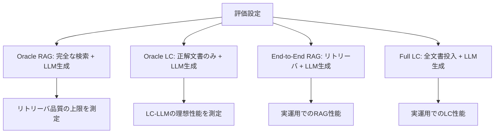
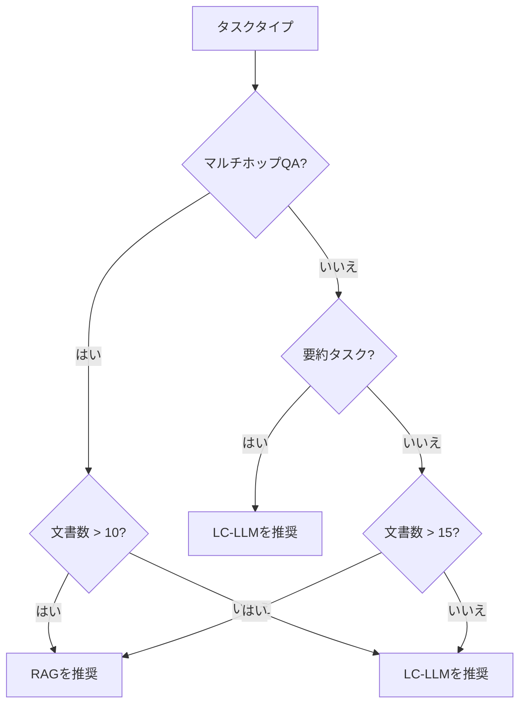

本記事は [Long Context vs. RAG for LLMs: An Evaluation and Revisits](https://arxiv.org/abs/2501.01880) の解説記事です。

## 論文概要（Abstract）

長文脈LLM（LC-LLM）とRAG（Retrieval-Augmented Generation）のどちらが知識集約型タスクに適しているかを、制御された実験で体系的に比較した研究である。著者らは8つのLLMと4つのリトリーバを6つのベンチマークで評価し、以下の知見を報告している。（1）文書数が10〜20を超えるとRAGが一貫してLC-LLMを上回る。（2）少数文書（5以下）ではLC-LLMがRAGを上回る。（3）マルチホップ推論はRAGが有利、要約タスクはLC-LLMが有利。（4）RAGの性能を左右する最大の要因はジェネレータLLMではなくリトリーバの品質である。

この記事は [Zenn記事: 1Mトークン時代のコンテキスト構造化設計パターン集と本番実装ガイド](https://zenn.dev/0h_n0/articles/b780d43dba0e87) の深掘りです。

## 情報源

- **arXiv ID**: 2501.01880
- **URL**: [https://arxiv.org/abs/2501.01880](https://arxiv.org/abs/2501.01880)
- **著者**: Xinze Li, Yixin Cao, Yubo Ma, Aixin Sun（Nanyang Technological University, Singapore）
- **発表年**: 2025
- **分野**: cs.CL, cs.AI, cs.IR

## 背景と動機（Background & Motivation）

「長文脈LLMがRAGを代替できるか」は2024〜2025年に活発に議論されたテーマである。一方では「128Kや1Mのコンテキストウィンドウがあればすべてのドキュメントを投入できるのでRAGは不要」という主張があり、他方では「RAGの検索精度向上によりコスト効率と精度の両方でLCを上回る」という主張がある。

しかし、先行研究には以下の問題があった。

1. **検索品質とモデル品質の混同**: RAGの性能低下が検索の問題なのかLLMの問題なのかが分離されていない
2. **限定的な評価設定**: 特定のモデル・タスクでの比較に留まり、汎用的な結論が得られていない
3. **文書数の制御不足**: 「何文書までならLCが有利か」の定量的な閾値が示されていない

著者らはこれらの問題を解決するため、リトリーバ品質とジェネレータ品質を独立に制御する評価フレームワークを構築し、8モデル×4リトリーバ×6ベンチマークの大規模な実験を実施している。

## 主要な貢献（Key Contributions）

- **貢献1**: リトリーバ品質とジェネレータ品質を分離した評価フレームワーク。「Oracle RAG」（完全な検索）と「Oracle LC」（正解文書のみ）のベースラインを導入
- **貢献2**: 文書数による切り替えポイントの定量化。10〜20文書でRAGがLCを逆転
- **貢献3**: タスクタイプごとの最適アプローチの体系化。QAはRAG、要約はLC

## 技術的詳細（Technical Details）

### 評価フレームワーク

著者らの評価フレームワークは、リトリーバとジェネレータの影響を独立に測定するために4つのベースラインを定義している。



#### Oracle RAG と Oracle LC

Oracle RAGは正解パッセージを直接LLMに渡す設定であり、リトリーバが完璧だった場合のRAGの上限性能を測定する。Oracle LCは正解を含む文書のみをコンテキストに投入する設定であり、LC-LLMの理想的な性能を測定する。

$$
\text{Performance Gap}_{\text{retriever}} = \text{Score}_{\text{Oracle RAG}} - \text{Score}_{\text{E2E RAG}}
$$

$$
\text{Performance Gap}_{\text{context}} = \text{Score}_{\text{Oracle LC}} - \text{Score}_{\text{Full LC}}
$$

前者はリトリーバの改善余地を、後者はContext Rotによる劣化幅を定量化する。

### 使用モデルとリトリーバ

**LLM（8モデル）**:
- GPT-4o（128K）、GPT-3.5-turbo（16K）— OpenAI
- Claude 3.5 Sonnet（200K）— Anthropic
- Llama-3-8B-Instruct、Llama-3-70B-Instruct — Meta
- Mistral-7B、Mixtral-8x7B — Mistral
- Command-R+ — Cohere

**リトリーバ（4種）**:
- BM25（疎ベクトル、教師なし）
- Contriever（密ベクトル、教師なし）
- E5-large（密ベクトル、教師あり）
- BGE-M3（密ベクトル、多言語対応、最強性能）

### ベンチマーク（6種）

| ベンチマーク | タスクタイプ | 推論ステップ数 |
|-------------|-----------|-------------|
| HotpotQA | マルチホップQA | 2 |
| MuSiQue | マルチホップQA | 3-4 |
| 2WikiMultiHopQA | マルチホップQA | 2 |
| QASPER | シングルホップQA | 1 |
| MultiFieldQA | シングルホップQA | 1 |
| GovReport / QMSum | 要約 | — |

### 文書数の制御

実験では文書数を $N \in \{2, 5, 10, 20, 30, 50\}$ と変動させ、各設定で性能を測定している。RAGのTop-kは $k \in \{1, 3, 5, 10\}$ で変動させている。

## 実験結果（Results）

### 文書数による切り替えポイント

著者らの実験結果から、RAGとLCの性能が逆転する文書数は約10〜20であることが示されている。

| 文書数 | LC-LLM (GPT-4o) F1 | RAG (BGE-M3 + GPT-4o) F1 | 差分 |
|--------|---------------------|---------------------------|------|
| 2 | **82.1** | 75.3 | LC +6.8 |
| 5 | **78.4** | 74.9 | LC +3.5 |
| 10 | 73.2 | 73.8 | ≈同等 |
| 20 | 68.5 | **76.9** | RAG +8.4 |
| 30 | 63.1 | **75.5** | RAG +12.4 |
| 50 | 56.7 | **74.2** | RAG +17.5 |

上記はHotpotQAでの結果。文書数10付近でクロスオーバーが発生し、20以上ではRAGが一貫して優位となる。

### タスクタイプによる差異

著者らは以下のタスクタイプ別傾向を報告している。

**マルチホップQA**: RAGが有利。複数パッセージの検索と統合にRAGのリトリーバが機能する。20文書設定でRAGが+9.7%（HotpotQA）。

**シングルホップQA**: 少数文書ではLC、大量文書ではRAGが有利。切り替えポイントは15〜20文書付近。

**要約タスク**: LC-LLMが一貫して有利。すべての文書数設定でLCが+7.3 ROUGE-Lの差をつけている。要約タスクでは文書全体の文脈理解が必要であり、RAGのチャンク検索では文脈が分断される。



### リトリーバ品質の支配的影響

著者らの最も驚くべき発見は、RAGの性能を左右する最大の要因がジェネレータLLMではなくリトリーバであるという点である。

| 変更 | F1改善幅 |
|------|---------|
| リトリーバ: BM25 → BGE-M3 | **+15.2%** |
| リトリーバ: BM25 → E5-large | +9.4% |
| リトリーバ: BM25 → Contriever | +4.1% |
| ジェネレータ: GPT-3.5 → GPT-4o | +7.1% |
| ジェネレータ: Llama-3-8B → Llama-3-70B | +5.8% |

リトリーバのアップグレード（BM25→BGE-M3: +15.2%）は、ジェネレータのアップグレード（GPT-3.5→GPT-4o: +7.1%）の**2倍以上**の効果がある。RAGシステムの精度改善には、LLMのアップグレードよりもリトリーバの改善に投資すべきであることを示唆している。

### コストとレイテンシの比較

著者らはコストとレイテンシも比較している。

| 設定 | トークン数（相対） | レイテンシ（相対） | 精度（HotpotQA F1） |
|------|------------------|------------------|-------------------|
| RAG (Top-5) | 1.0x | 1.0x | 74.2% |
| LC (20 docs) | 12x | 3.5x | 68.5% |
| LC (50 docs) | 30x | 8.2x | 56.7% |

LCは文書数の増加に伴いトークン数が線形に増加するため、コストとレイテンシが急速に膨張する。RAGはTop-kで固定されるため、文書数に依存しない安定したコストを実現できる。

## 実装のポイント（Implementation）

### 判断フレームワークの実装

Zenn記事で紹介した判断フレームワークを、この論文の知見で精緻化できる。

```python
from dataclasses import dataclass
from enum import Enum


class Approach(Enum):
    FULL_CONTEXT = "full_context"
    RAG = "rag"
    HYBRID = "hybrid"


@dataclass
class WorkloadProfile:
    """ワークロード特性"""
    num_documents: int
    avg_doc_tokens: int
    task_type: str
    latency_budget_ms: int
    cost_budget_per_request: float


def select_approach(profile: WorkloadProfile) -> Approach:
    """ワークロード特性に基づいてアプローチを選択する。

    論文の実験結果に基づく判断ロジック:
    - 文書数 <= 5: LC推奨
    - 文書数 10-20: ハイブリッド推奨
    - 文書数 > 20: RAG推奨
    - 要約タスク: LC推奨（文書数に関わらず）

    Args:
        profile: ワークロード特性

    Returns:
        推奨アプローチ
    """
    if profile.task_type == "summarization":
        return Approach.FULL_CONTEXT

    total_tokens = profile.num_documents * profile.avg_doc_tokens

    if profile.num_documents <= 5:
        return Approach.FULL_CONTEXT

    if profile.num_documents <= 20:
        if total_tokens < 100_000 and profile.cost_budget_per_request > 0.50:
            return Approach.HYBRID
        return Approach.RAG

    return Approach.RAG


def estimate_cost(
    profile: WorkloadProfile,
    approach: Approach,
    model_price_per_mtok: float = 3.00,
    cache_hit_rate: float = 0.0,
) -> float:
    """リクエストあたりのコストを推定する。

    Args:
        profile: ワークロード特性
        approach: 選択したアプローチ
        model_price_per_mtok: モデルの入力トークン単価
        cache_hit_rate: Prompt Cachingのヒット率

    Returns:
        推定コスト（USD）
    """
    if approach == Approach.RAG:
        input_tokens = 5 * 512 + 500
    elif approach == Approach.FULL_CONTEXT:
        input_tokens = profile.num_documents * profile.avg_doc_tokens
    else:
        input_tokens = min(10, profile.num_documents) * profile.avg_doc_tokens

    effective_price = model_price_per_mtok * (
        (1 - cache_hit_rate) + cache_hit_rate * 0.1
    )

    return (input_tokens / 1_000_000) * effective_price
```

### リトリーバ選択の優先度

論文の結果から、RAGシステム構築時のリトリーバ選択は以下の優先度で行うべきである。

1. **BGE-M3**（最高精度、多言語対応）: 本番環境の第一候補
2. **E5-large**（高精度、英語特化）: 英語のみのワークロードで低コスト運用
3. **Contriever**（教師なし学習）: ドメイン固有のファインチューニング前のベースライン
4. **BM25**（疎ベクトル）: コストと計算資源が制約されたプロトタイプ向け

リトリーバへの投資がジェネレータLLMへの投資の2倍以上のROIを示すという論文の結果は、実務上のリソース配分に直接的な示唆を与える。

## 実運用への応用（Practical Applications）

**ナレッジベースの規模による判断**: 本論文の定量的結果をZenn記事の判断フレームワークと統合すると、以下の基準が導出される。文書数5以下かつ総トークン数200K以下ならフルコンテキスト+Prompt Caching、文書数10〜20なら ハイブリッド（RAG検索+ロングコンテキスト格納）、文書数20超ならRAGのみが推奨される。

**要約ワークロードの特別扱い**: 要約タスクでは文書数に関わらずLC-LLMが有利（+7.3 ROUGE-L）であり、RAGのチャンク化が文脈の一貫性を破壊するためと考えられる。文書要約パイプラインではフルコンテキスト投入を第一候補とし、コンテキスト長制限を超える場合のみサブエージェント分割を検討すべきである。

**リトリーバへの投資対効果**: 「GPT-4oに変えたのに精度が上がらない」というケースでは、リトリーバの品質を見直すことが最も効果的な対策である。BM25からBGE-M3への変更だけで+15.2%の改善が得られるという結果は、インフラ投資の優先順位決定に直接活用できる。

## 関連研究（Related Work）

- **HELMET (Yen et al., 2025)**: 同時期にRAG vs LC比較を行ったベンチマーク。本論文より多くのタスクカテゴリ（6カテゴリ）を含むが、リトリーバ品質の分離分析は行っていない
- **LaRA (ICML 2025)**: 2,326テストケースでの比較。「万能な解決策はない」という結論は本論文と一致するが、文書数による切り替えポイントの定量化は本論文の方が詳細
- **Context Rot (Chroma, 2025)**: LC-LLMの性能劣化メカニズム。本論文が報告するLC性能の文書数依存的な低下は、Context Rotの実証例である

## まとめと今後の展望

本研究は「長文脈LLMかRAGか」という二者択一の議論に対して定量的な回答を提供した。文書数10〜20がクロスオーバーポイントであり、それ以上ではRAGが一貫して優位となる。最も重要な知見はリトリーバ品質がRAG性能の支配的要因であり、ジェネレータLLMの2倍以上の影響を持つという点である。Zenn記事で解説した判断フレームワーク（フルコンテキスト/RAG/ハイブリッド）の定量的根拠として、この論文の実験結果を活用することを推奨する。

## 参考文献

- **arXiv**: [https://arxiv.org/abs/2501.01880](https://arxiv.org/abs/2501.01880)
- **Code**: [https://github.com/Li-Z-Q/LC-vs-RAG](https://github.com/Li-Z-Q/LC-vs-RAG)
- **Related Zenn article**: [https://zenn.dev/0h_n0/articles/b780d43dba0e87](https://zenn.dev/0h_n0/articles/b780d43dba0e87)
