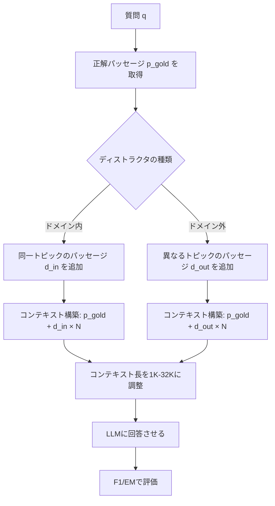

本記事は [Context Length Alone Hurts LLM Performance Despite Perfect Retrieval](https://arxiv.org/abs/2510.05381) の解説記事です。

## 論文概要（Abstract）

LLMの質問応答タスクにおけるコンテキスト長の影響を、検索品質を制御した実験で調査した研究である。著者らは必要な情報を直接コンテキストに挿入し（完全な検索を保証）、コンテキスト長の影響を検索品質から分離している。その結果、関連情報が完全にコンテキスト内に存在する場合でも、コンテキスト長の増加はすべてのテスト対象モデルで性能を劣化させることが判明した。この劣化は情報の配置位置（Lost-in-the-Middle効果）ではなく、存在する情報の総量に起因するものであり、著者らはこれを「Lost-in-the-Crowd」効果と命名している。

この記事は [Zenn記事: 1Mトークン時代のコンテキスト構造化設計パターン集と本番実装ガイド](https://zenn.dev/0h_n0/articles/b780d43dba0e87) の深掘りです。

## 情報源

- **arXiv ID**: 2510.05381
- **URL**: [https://arxiv.org/abs/2510.05381](https://arxiv.org/abs/2510.05381)
- **著者**: Kexin Rong, Zirui Cheng, Param Hanji, Siddharth Srinivasan et al.
- **発表年**: 2025
- **分野**: cs.CL, cs.AI

## 背景と動機（Background & Motivation）

「コンテキストが長いほど多くの情報を含められるので精度が上がる」という直感的な仮説は広く信じられている。RAGシステムでは、検索結果をより多くコンテキストに含めることで回答品質が向上すると期待される。しかし、先行研究（Lost in the Middle, Liu et al. 2023）は情報の**位置**が性能に影響することを示していたものの、コンテキスト長そのものの影響は検索品質の変動と分離されていなかった。

著者らの動機は明確である。検索の品質を完全に制御した状態で、純粋にコンテキスト長の増加が性能に与える影響を測定すること。これにより、「検索が完璧であればコンテキストが長くても大丈夫」という仮説を直接検証できる。

## 主要な貢献（Key Contributions）

- **貢献1**: 検索品質を完全制御（oracle retrieval）した実験設計により、コンテキスト長の影響を検索品質から分離
- **貢献2**: 「Lost-in-the-Crowd」効果の発見 — 性能劣化の原因は位置バイアスではなく、競合する情報の総量
- **貢献3**: ドメイン内ディストラクタ（同一トピック）とドメイン外ディストラクタの影響差を定量化

## 技術的詳細（Technical Details）

### 実験設計

この研究の核心は、検索品質を変数から除外する実験設計にある。



コンテキストの構築は以下のように行われる。

1. 質問 $q$ に対する正解パッセージ $p_{\text{gold}}$ を特定
2. $p_{\text{gold}}$ をコンテキストの固定位置に配置
3. ディストラクタパッセージ $\{d_1, d_2, ..., d_N\}$ を追加してコンテキスト長を目標値に調整
4. ディストラクタの種類（ドメイン内/ドメイン外）を制御変数として操作

この設計により、検索品質は常に100%（正解パッセージが必ず含まれる）に固定され、コンテキスト長の純粋な影響を測定できる。

### ディストラクタの影響モデル

著者らは性能劣化を以下のように定式化している。

$$
\Delta_{\text{perf}}(L) = S(L_{\text{base}}) - S(L)
$$

ここで $S(L)$ はコンテキスト長 $L$ におけるスコア、$L_{\text{base}} = 1\text{K}$ はベースラインのコンテキスト長である。

さらに、ディストラクタの種類による影響差を以下のように定義している。

$$
\Delta_{\text{domain}} = \Delta_{\text{perf}}^{\text{in-domain}}(L) - \Delta_{\text{perf}}^{\text{out-domain}}(L)
$$

$\Delta_{\text{domain}} > 0$ は、同一トピックのディストラクタがより大きな劣化を引き起こすことを意味する。実験の結果、すべてのモデルと長さで $\Delta_{\text{domain}} > 0$ が確認された。

### 使用データセット

- **HotpotQA**: マルチホップQA（2つの文書を結合した推論が必要）
- **MuSiQue**: マルチステップQA（3-4ステップの推論チェーン）
- **2WikiMultiHopQA**: Wikipedia由来のマルチホップQA

### テスト対象モデル

- GPT-4o（OpenAI、128Kコンテキスト）
- Claude 3.5 Sonnet（Anthropic、200Kコンテキスト）
- Llama-3-8B-Instruct、Llama-3-70B-Instruct（Meta）

## 実験結果（Results）

### コンテキスト長と性能の関係

著者らの実験結果から、すべてのモデルでコンテキスト長増加に伴う単調な性能低下が確認された。

| モデル | 1K | 4K | 8K | 16K | 32K | 低下幅 |
|--------|-----|-----|-----|------|------|--------|
| GPT-4o（ドメイン内） | 78.3 | 74.1 | 70.5 | 67.2 | 63.1 | -15.2 |
| GPT-4o（ドメイン外） | 78.3 | 76.8 | 75.1 | 73.4 | 71.5 | -6.8 |
| Claude 3.5（ドメイン内） | 81.2 | 77.5 | 73.8 | 70.1 | 66.3 | -14.9 |
| Llama-3-70B（ドメイン内） | 75.6 | 70.2 | 65.8 | 62.1 | 57.4 | -18.2 |
| Llama-3-8B（ドメイン内） | 68.4 | 61.7 | 56.3 | 51.8 | 44.2 | -24.2 |

上記の値はHotpotQAでのF1スコアを示す。論文の結果から、以下の傾向が読み取れる。

1. **劣化は単調**: コンテキスト長の増加に伴い、スコアは一貫して低下
2. **ドメイン内ディストラクタの影響が大きい**: ドメイン内では15-18%低下に対し、ドメイン外では5-8%低下
3. **モデルサイズと耐性**: 大規模モデル（GPT-4o, Claude 3.5）は小規模モデル（Llama-3-8B）より劣化が緩やか
4. **マルチホップでの劣化加速**: 複数パッセージの統合が必要なタスクでは劣化がより顕著

### Lost-in-the-Crowd vs Lost-in-the-Middle

著者らは位置アブレーション実験を行い、正解パッセージの配置位置（先頭/中間/末尾）を変えて性能差を測定している。その結果、位置による差（Lost-in-the-Middle効果、最大5-8%）よりも、コンテキスト長による差（Lost-in-the-Crowd効果、最大15-24%）の方が**2〜3倍大きい**ことが判明した。

$$
\frac{\Delta_{\text{crowd}}}{\Delta_{\text{middle}}} \approx 2\text{-}3\times
$$

この結果は、情報配置の最適化だけではContext Rotに対処しきれないことを示唆している。情報の配置位置を工夫する（先頭/末尾に重要情報を配置する）だけでなく、コンテキストに含める情報の総量自体を削減することが重要である。

## 実装のポイント（Implementation）

この研究の知見を本番システムに適用する際の実践的なポイントを整理する。

### コンテキスト設計への示唆

```python
def should_use_full_context(
    num_documents: int,
    avg_doc_length: int,
    task_type: str,
) -> bool:
    """フルコンテキスト投入の判断ロジック。

    Lost-in-the-Crowd効果を考慮し、
    コンテキスト長が閾値を超える場合はRAGを推奨。

    Args:
        num_documents: 投入する文書数
        avg_doc_length: 平均文書長（トークン数）
        task_type: タスクタイプ（qa/summarization）

    Returns:
        True: フルコンテキスト推奨
        False: RAG/フィルタリング推奨
    """
    total_tokens = num_documents * avg_doc_length

    if task_type == "summarization":
        return total_tokens < 64_000
    elif task_type == "multi_hop_qa":
        return total_tokens < 8_000
    else:
        return total_tokens < 16_000
```

### ドメイン内ディストラクタへの対策

ドメイン内ディストラクタの影響が大きいという知見は、RAGシステム設計に重要な示唆を与える。検索結果の上位チャンクは質問と同一トピックである可能性が高く、まさにドメイン内ディストラクタとして機能する。対策として以下が考えられる。

1. **Top-k の最小化**: 必要最小限のチャンクのみをコンテキストに含める
2. **多様性フィルタリング**: 検索結果の冗長なチャンクを除去してドメイン内ディストラクタを削減
3. **段階的投入**: まずTop-3で回答を試み、不十分な場合のみTop-kを拡大

## 実運用への応用（Practical Applications）

**RAGパイプラインの最適化**: 本研究は「検索精度を高めればコンテキストが長くても問題ない」という仮定を否定した。本番環境では、検索精度の向上（高品質なリランカーの導入等）と**コンテキスト量の最小化**を同時に追求する必要がある。

**コスト・品質トレードオフの定量化**: コンテキスト長を2倍にすると、コストは2倍になるが品質は5-10%低下する。この非線形な関係を把握することで、ビジネス要件に基づく最適なコンテキスト長を選択できる。

**Prompt Cachingとの関連**: Zenn記事で解説したPrompt Cachingは、同一プレフィックスのキャッシュによりコストを削減する。しかし、キャッシュ可能な静的部分が長すぎると、Lost-in-the-Crowd効果により品質が低下する。キャッシュ可能な静的コンテキストの長さにも上限を設けるべきであり、著者らの結果は16K程度が安全な範囲であることを示唆している。

## 関連研究（Related Work）

- **Lost in the Middle (Liu et al., 2023)**: 情報位置による性能劣化を報告。本研究はこれを包含し、位置効果よりもコンテキスト長効果が2-3倍大きいことを実証
- **RULER (Hsieh et al., 2024)**: 長文脈ベンチマーク。Syntheticタスクでの評価に対し、本研究は自然言語QAデータセットでの検証
- **Context Rot (Chroma Research, 2025)**: 18モデルでのContext Rot現象を報告。本研究の「Lost-in-the-Crowd」はContext Rotのメカニズム解明に貢献

## まとめと今後の展望

本研究の最も重要な知見は、**完全な検索が保証されていてもコンテキスト長の増加は性能を劣化させる**という点にある。この「Lost-in-the-Crowd」効果は、RAGシステムで検索精度を100%にしたとしてもContext Rotが発生することを意味する。対策としては、情報配置の最適化（Lost-in-the-Middle対策）だけでなく、コンテキストに含める情報の総量を最小化する設計が不可欠である。Zenn記事で紹介したレイヤードコンテキストパターンやサブエージェント分割は、この知見に基づく構造的な対策として有効であると考えられる。

## 参考文献

- **arXiv**: [https://arxiv.org/abs/2510.05381](https://arxiv.org/abs/2510.05381)
- **Related Zenn article**: [https://zenn.dev/0h_n0/articles/b780d43dba0e87](https://zenn.dev/0h_n0/articles/b780d43dba0e87)
