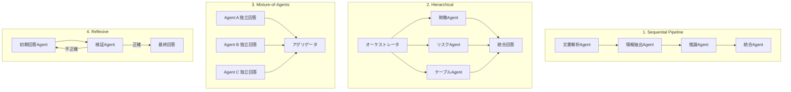

本記事は [Benchmarking Multi-Agent LLM Architectures for Financial Document Processing](https://arxiv.org/abs/2603.22651) の解説記事です。

## 論文概要（Abstract）

金融文書処理（10-Kファイリング、決算発表トランスクリプト、財務テーブル等）における複数のマルチエージェントLLMアーキテクチャを体系的にベンチマークした研究である。著者らは逐次パイプライン、階層型エージェント、Mixture-of-Agents（MoA）の3つのマルチエージェントアーキテクチャを単一エージェントベースラインと比較し、精度・レイテンシ・コストのトレードオフを定量化している。MoAが最高精度（GPT-4o単一エージェント比+8.3%）を達成する一方、3〜5倍のレイテンシと4〜6倍のコスト増が生じることを報告している。

この記事は [Zenn記事: 1Mトークン時代のコンテキスト構造化設計パターン集と本番実装ガイド](https://zenn.dev/0h_n0/articles/b780d43dba0e87) の深掘りです。

## 情報源

- **arXiv ID**: 2603.22651
- **URL**: [https://arxiv.org/abs/2603.22651](https://arxiv.org/abs/2603.22651)
- **著者**: Keyi Chen, Xiao Zhang, Yifan Liu, Jiaxin Wu, Shuang Li
- **発表年**: 2026
- **分野**: cs.CL, cs.AI, cs.MA

## 背景と動機（Background & Motivation）

大規模な金融文書は複数のセクション（財務諸表、リスク要因、経営分析）にわたる情報の統合が必要であり、単一のLLMコンテキストに投入するだけでは対処しきれないケースが多い。Zenn記事で解説した「サブエージェント分割統治パターン」は、このような大規模文書分析に対するアーキテクチャ的解決策の1つである。

しかし、マルチエージェントアーキテクチャにはさまざまなパターンが存在し、どのパターンがどのタスクに適しているかの定量的な比較は不足していた。著者らは金融文書処理という実務的に重要なドメインで、複数のアーキテクチャパターンを統一的なベンチマークで評価することを目的としている。

## 主要な貢献（Key Contributions）

- **貢献1**: 金融文書処理における4つのマルチエージェントアーキテクチャ（逐次パイプライン、階層型、MoA、リフレキシブ）の統一ベンチマーク
- **貢献2**: 精度・レイテンシ・コストの3軸でのトレードオフの定量化。階層型がパレート最適であることを実証
- **貢献3**: 数値ハルシネーション率の定量化。マルチエージェントが単一エージェントより低いハルシネーション率（14.2% vs 21.5%）を示すことを報告

## 技術的詳細（Technical Details）

### 4つのマルチエージェントアーキテクチャ

著者らは以下の4パターンを評価している。



#### パターン1: 逐次パイプライン（Sequential Pipeline）

専門化されたエージェントをチェーン状に接続する。各エージェントが前段の出力を入力として受け取り、段階的に処理を進める。

- **文書解析Agent**: 文書構造を認識し、セクション・テーブル・テキストを分離
- **情報抽出Agent**: 質問に関連する情報を抽出
- **推論Agent**: 抽出された情報に基づき推論を実行
- **統合Agent**: 最終回答を生成

**利点**: 各ステップが明確に分離され、デバッグが容易。コストは単一エージェントの約1.5〜2倍。
**欠点**: 前段のエラーが後段に伝播（エラー伝播問題）。精度向上は最小（+2.9%）。

#### パターン2: 階層型（Hierarchical）

オーケストレータが質問を分析し、専門サブエージェントにタスクを分配する。Zenn記事の「サブエージェント分割統治パターン」に最も近いアーキテクチャである。

- **オーケストレータ**: 質問を分解し、適切なサブエージェントに割り当て
- **サブエージェント群**: 財務分析、リスク評価、テーブル解析等の専門家
- **統合**: オーケストレータがサブエージェントの結果を統合

**利点**: サブエージェントが独立したクリーンなコンテキストで動作するため、Context Rotの影響を受けにくい。精度向上は中程度（+5.1%）。コストは単一エージェントの約2〜3倍。
**欠点**: オーケストレータのタスク分解品質に依存。分解が不適切だと精度が低下。

#### パターン3: Mixture-of-Agents（MoA）

複数のエージェントが独立に回答を生成し、アグリゲータが最終回答を統合する。

**利点**: 最高精度（+8.3%）。各エージェントの多様な視点により、ハルシネーションを抑制。
**欠点**: コストが4〜6倍、レイテンシが3〜5倍と大幅に増加。リアルタイム処理には不向き。

#### パターン4: リフレキシブ（Reflexive）

初期回答を検証エージェントが評価し、不正確な場合は修正ループを実行する自己修正型アーキテクチャ。

**利点**: 最高のF1スコア（0.943）。自己修正により数値精度が向上。
**欠点**: 修正ループにより平均2.3倍のコスト。ループ回数が不確定のためレイテンシが予測しにくい。

### 評価指標

著者らは以下の指標で評価を行っている。

$$
\text{F1} = 2 \cdot \frac{\text{Precision} \cdot \text{Recall}}{\text{Precision} + \text{Recall}}
$$

数値精度については、1%以内の誤差を正解とみなす:

$$
\text{NumericAccuracy} = \mathbb{1}\left[\frac{|y_{\text{pred}} - y_{\text{true}}|}{|y_{\text{true}}|} < 0.01\right]
$$

ハルシネーション率は、モデルが出力した数値のうち、元の文書に根拠がないものの割合として定義される。

## 実験結果（Results）

### アーキテクチャ別の性能比較

著者らの実験結果（論文Table 2より）を以下に示す。

| アーキテクチャ | FinQA F1 | TAT-QA F1 | 数値精度 | ハルシネーション率 | レイテンシ | コスト倍率 |
|--------------|----------|-----------|---------|-----------------|-----------|----------|
| Single Agent (GPT-4o) | 63.8% | 76.2% | 71.4% | 21.5% | 1.0x | 1.0x |
| Sequential Pipeline | 66.7% | 78.9% | 74.1% | 18.3% | 1.8x | 1.7x |
| Hierarchical | 68.9% | 81.5% | 77.8% | 16.1% | 2.1x | 2.4x |
| Mixture-of-Agents | 72.1% | 84.7% | 82.3% | 14.2% | 4.2x | 5.3x |
| Reflexive | 71.8% | 83.9% | 84.1% | 13.8% | 2.3x* | 2.3x* |

*リフレキシブの値は平均値。修正ループ回数により変動する。

### パレート最適分析

著者らはコスト対精度のパレート分析を行い、階層型アーキテクチャが最良のコスト・精度トレードオフを実現することを報告している。具体的には、階層型は単一エージェントの2.4倍のコストで5.1%の精度向上を達成しており、1%あたりのコスト効率が最も高い。

$$
\text{Cost Efficiency} = \frac{\Delta \text{Accuracy}}{\Delta \text{Cost}} = \frac{5.1\%}{1.4 \times C_0} \approx 3.6\%/C_0
$$

MoAは精度で最高だが、1%の精度向上あたりのコストは階層型の約2倍であり、予算制約がある場合は階層型が推奨される。

### エラー分析

著者らのエラー分析（論文Figure 3より）から、以下の主要なエラーモードが報告されている。

1. **クロスドキュメント推論失敗（38%）**: 複数文書にまたがる情報の統合に失敗
2. **数値抽出エラー（24%）**: テーブルからの数値の誤読み取り
3. **アグリゲーションエラー（18%）**: オーケストレータによる統合時の情報欠落
4. **テンプレート不一致（12%）**: エージェント間のフォーマット不整合
5. **その他（8%）**: タイムアウト、API制限等

### MoAのエージェント数による感度分析

著者らはMoAのエージェント数を2〜7で変化させたアブレーション実験を報告している。3エージェントが精度・コストの最適点であり、5エージェント以上では精度向上が飽和する一方でコストは線形に増加する。

| エージェント数 | F1 | コスト倍率 | 1エージェント追加あたりの精度向上 |
|-------------|-----|----------|---------------------------|
| 2 | 69.4% | 3.5x | — |
| 3 | 72.1% | 5.3x | +2.7% |
| 5 | 73.2% | 8.8x | +0.55% |
| 7 | 73.5% | 12.1x | +0.15% |

## 実装のポイント（Implementation）

### アーキテクチャ選択の判断基準

```python
from enum import Enum


class AgentArchitecture(Enum):
    SINGLE = "single"
    SEQUENTIAL = "sequential"
    HIERARCHICAL = "hierarchical"
    MIXTURE_OF_AGENTS = "moa"
    REFLEXIVE = "reflexive"


def select_architecture(
    latency_budget_ms: int,
    cost_budget_multiplier: float,
    accuracy_requirement: float,
    task_type: str,
) -> AgentArchitecture:
    """タスク要件に基づいてアーキテクチャを選択する。

    Args:
        latency_budget_ms: レイテンシ予算（ミリ秒）
        cost_budget_multiplier: コスト予算倍率（単一エージェント比）
        accuracy_requirement: 要求精度（0.0-1.0）
        task_type: タスクタイプ

    Returns:
        推奨アーキテクチャ
    """
    if accuracy_requirement > 0.83 and cost_budget_multiplier >= 5.0:
        return AgentArchitecture.MIXTURE_OF_AGENTS

    if accuracy_requirement > 0.83 and cost_budget_multiplier < 5.0:
        return AgentArchitecture.REFLEXIVE

    if accuracy_requirement > 0.77 and cost_budget_multiplier >= 2.0:
        return AgentArchitecture.HIERARCHICAL

    if cost_budget_multiplier >= 1.5:
        return AgentArchitecture.SEQUENTIAL

    return AgentArchitecture.SINGLE
```

### Context Rotとの関連

Zenn記事で解説したサブエージェント分割統治パターンは、この論文の階層型アーキテクチャに対応する。各サブエージェントが独立したクリーンなコンテキストで動作するため、Context Rotの影響を受けにくい。論文の結果から、階層型は単一エージェントより5.1%精度が向上しており、これはContext Rot緩和による効果と考えられる。

一方、MoAは各エージェントが完全に独立してフルコンテキストを処理するため、Context Rotの影響は単一エージェントと同等だが、複数の独立した回答を統合することでエラーを相殺している。

## 実運用への応用（Practical Applications）

**バッチ処理向きのMoA**: 金融レポートの定期分析などリアルタイム性が不要なバッチ処理では、MoAの高精度がコスト増を上回る価値を持つ。決算発表後の自動分析レポート生成などが典型的なユースケースである。

**リアルタイム向きの階層型**: 顧客からの質問にリアルタイムで回答するチャットボットでは、階層型がレイテンシ・精度・コストのバランスで最適である。オーケストレータが質問を分解し、必要な専門エージェントだけを起動することでコストを制御できる。

**ハルシネーション削減**: 金融分野ではハルシネーションのリスクが特に高い。マルチエージェント方式（14.2%）は単一エージェント（21.5%）より7.3ポイント低いハルシネーション率を達成しており、コンプライアンス要件が厳格な環境ではマルチエージェント方式の採用が推奨される。

## 関連研究（Related Work）

- **AutoGen (Wu et al., 2023)**: Microsoftによるマルチエージェントフレームワーク。汎用的な会話型エージェント連携を実現するが、金融文書に特化した評価は行われていない
- **CrewAI (Moura, 2024)**: 役割ベースのマルチエージェントフレームワーク。階層型パターンをサポートし、本論文の階層型アーキテクチャと類似するアプローチ
- **Google ADK (2025)**: Agent-to-Agentプロトコルによるクロスフレームワーク連携を実現。本論文のエージェント間通信の課題に対する1つの解決策

## まとめと今後の展望

マルチエージェントアーキテクチャは金融文書処理において単一エージェントを一貫して上回るが、アーキテクチャ選択は精度・コスト・レイテンシの要件に依存する。階層型がパレート最適であり、Zenn記事で紹介したサブエージェント分割統治パターンの有効性を定量的に裏付ける結果となった。予算が許せばMoA（+8.3%精度向上）、コスト効率を重視するなら階層型（+5.1%精度向上、2.4倍コスト）が推奨される。

## 参考文献

- **arXiv**: [https://arxiv.org/abs/2603.22651](https://arxiv.org/abs/2603.22651)
- **Related Zenn article**: [https://zenn.dev/0h_n0/articles/b780d43dba0e87](https://zenn.dev/0h_n0/articles/b780d43dba0e87)
