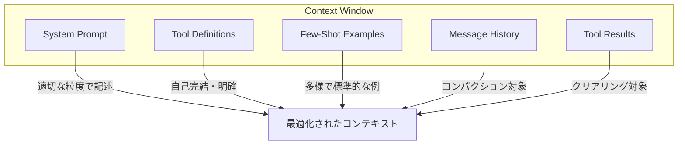

本記事は [Effective Context Engineering for AI Agents](https://www.anthropic.com/engineering/effective-context-engineering-for-ai-agents)（Anthropic Engineering Blog, 2025年9月29日公開）の解説記事です。

## ブログ概要（Summary）

Anthropicの応用AIチーム（Prithvi Rajasekaran, Ethan Dixon, Carly Ryan, Jeremy Hadfield）が公開したこの記事は、LLMベースのAIエージェントにおけるコンテキスト管理を「コンテキストエンジニアリング」として体系化したものである。プロンプトエンジニアリングの発展形として位置づけ、推論の各ターンで「どの情報をコンテキストに含めるか」を最適化する手法を提案している。コンテキスト腐敗（context rot）の概念、Just-in-Time検索戦略、長期タスク向けのコンパクション・ノートテイキング・サブエージェントアーキテクチャを解説している。

この記事は [Zenn記事: Responses API時代のThread管理設計：マルチテナントSaaSの会話状態管理](https://zenn.dev/0h_n0/articles/16d46fe888192a) の深掘りです。

## 情報源

- **種別**: 企業テックブログ
- **URL**: [https://www.anthropic.com/engineering/effective-context-engineering-for-ai-agents](https://www.anthropic.com/engineering/effective-context-engineering-for-ai-agents)
- **組織**: Anthropic Applied AI Team
- **発表日**: 2025年9月29日

## 技術的背景（Technical Background）

### プロンプトエンジニアリングからコンテキストエンジニアリングへ

Anthropicは、LLM活用の初期段階ではプロンプトの書き方（プロンプトエンジニアリング）が中心的課題であったが、マルチターンのエージェント運用においてはコンテキスト全体の管理が重要になっていると指摘している。

ブログの定義によると、**コンテキストエンジニアリング**とは「LLM推論時にコンテキストウィンドウに含めるトークンの集合を最適化する戦略」である。これにはシステムプロンプト、ツール定義、MCP（Model Context Protocol）、外部データ、メッセージ履歴など、プロンプト以外のすべての情報が含まれる。

### コンテキスト腐敗（Context Rot）

ブログで最も重要な概念の一つが**コンテキスト腐敗（context rot）**である。Anthropicは以下のように説明している：

> コンテキストウィンドウのトークン数が増加するにつれ、そのコンテキストから情報を正確に想起するモデルの能力が低下する

これはTransformerアーキテクチャの構造的制約に起因する。Self-Attentionは全トークン間のペアワイズ関係を計算するため、$n$トークンに対して$n^2$のペアワイズ関係が生じる。コンテキスト長が増加すると、各トークン間の注意が希薄化し、性能が劣化する。

$$
\text{Attention}(Q, K, V) = \text{softmax}\left(\frac{QK^T}{\sqrt{d_k}}\right)V
$$

$n$が大きくなると、softmaxの分母が増加し、各キーに対する注意重みが均一化される傾向がある。これはNeedle-in-a-Haystackベンチマークで実証されている現象である。

Anthropicはコンテキストを「有限のリソース」として扱うべきだと主張している。人間のワーキングメモリと同様に、LLMにも「注意予算（attention budget）」が存在し、新しいトークンが追加されるたびにこの予算が消費されるという考え方である。

## 実装アーキテクチャ（Architecture）

### 効果的なコンテキストの構成要素

Anthropicはコンテキストの構成要素を3つに分類している：



**1. システムプロンプト — 「適切な粒度（Right Altitude）」の原則**

Anthropicは、システムプロンプトの記述粒度には2つの失敗モードがあると指摘している：

| モード | 問題点 | 結果 |
|--------|-------|------|
| 過度に詳細（Too prescriptive） | 脆弱なロジックのハードコーディング | 保守困難、エッジケースに対応不可 |
| 過度に曖昧（Too vague） | 具体的なシグナル不足 | LLMが暗黙の仮定で行動 |

最適な粒度は「行動を効果的に導くのに十分な具体性がありつつ、ヒューリスティクスとして機能する柔軟性を持つ」レベルであるとされている。

**2. ツール定義 — 自己完結性と明確性**

ブログでは、ツール定義は「エージェントと環境の契約（contract）」であると述べられている。重要な原則として：

- ツールは自己完結的でエラーに頑健であるべき
- 入力パラメータは記述的で曖昧さがないこと
- よくある失敗: ツールセットが肥大化し、どのツールを使うべきか判断が曖昧になる

> 「人間のエンジニアが特定の状況でどのツールを使うべきか断言できないなら、AIエージェントにそれ以上のことは期待できない」

**3. Few-Shot例 — 多様で標準的な例の選定**

ブログでは、エッジケースを網羅的に記述するのではなく、期待される行動を代表する多様で標準的な例を選定することを推奨している。

### Just-in-Time（JIT）コンテキスト戦略

従来のRAGは推論前に関連データを事前取得するアプローチだが、Anthropicは**Just-in-Timeコンテキスト戦略**への移行を提唱している。

エージェントは軽量な識別子（ファイルパス、保存済みクエリ、Webリンク）を保持し、実行時にツールを使って動的にデータをコンテキストに読み込む。

```python
# JITコンテキスト戦略の概念実装
from dataclasses import dataclass


@dataclass
class ContextReference:
    """軽量な参照情報のみを保持"""
    ref_type: str  # "file", "query", "url"
    identifier: str  # パス、クエリ文字列、URL
    relevance_hint: str  # 関連性のヒント


def load_context_on_demand(
    references: list[ContextReference],
    current_query: str,
) -> list[str]:
    """必要な時にだけコンテキストを読み込む"""
    loaded: list[str] = []
    for ref in references:
        if is_relevant(ref.relevance_hint, current_query):
            content = fetch_content(ref)
            loaded.append(content)
    return loaded
```

この方式の利点は、インデックスの陳腐化を回避できることと、必要な情報のみをコンテキストに含めることでコンテキスト腐敗を軽減できることである。

### Progressive Disclosure（段階的開示）

JIT戦略の延長として、エージェントがデータを自律的に探索し、段階的に関連コンテキストを発見するアプローチを**Progressive Disclosure**と呼んでいる。ファイルサイズ、命名規則、タイムスタンプなどの手がかりからレイヤーごとに理解を組み立て、必要な情報のみをワーキングメモリに保持する。

## 長期タスク向けコンテキスト管理（Long-Horizon Tasks）

ブログの後半では、コンテキストウィンドウを超える長期タスクに対する3つの手法を解説している。

### 手法1: コンパクション（Compaction）

コンテキストウィンドウの上限に近づいた会話を要約し、新しいコンテキストウィンドウで会話を再開する手法。

Anthropicは自社のClaude Codeでの実装について以下のように説明している：

- メッセージ履歴をモデルに渡し、最も重要な詳細を要約・圧縮
- アーキテクチャ決定、未解決バグ、実装詳細を保持
- 冗長なツール出力やメッセージを破棄
- 圧縮コンテキスト + 直近5ファイルで会話を継続

**ツール結果クリアリング（Tool Result Clearing）**も重要な手法として紹介されている。メッセージ履歴の深くにある過去のツール呼び出し結果を削除することで、コンテキストを効率的に解放できる。

この概念は、OpenAI Responses APIのCompaction APIと直接対応する。Zenn記事で解説されている`compact_threshold`パラメータによるserver-side compactionは、Anthropicが提唱するコンパクション手法のAPI化と見なすことができる。

### 手法2: 構造化ノートテイキング（Structured Note-Taking）

エージェントがコンテキストウィンドウ外のファイル（TODOリスト、NOTES.mdなど）に定期的にメモを書き出し、必要に応じて読み戻す手法。

ブログでは「Claude playing Pokemon」の例が紹介されている。ゲームプレイ中のエージェントが自発的にマップ情報、達成事項、戦略メモを記録し、コンテキストリセット後も自身のメモを読んで行動を継続したとされている。

### 手法3: サブエージェントアーキテクチャ

複雑なタスクを専門化されたサブエージェントに分散し、各サブエージェントがクリーンなコンテキストウィンドウで集中的に作業する方式。メインエージェントは高レベルの計画で全体を調整し、サブエージェントは深い技術作業を担当する。

各サブエージェントは数万トークンを使用しても、メインエージェントには1,000〜2,000トークンの要約のみを返却する。これにより関心の分離が実現される。

| 手法 | 適するケース | コンテキスト効率 |
|------|-------------|----------------|
| コンパクション | 長い会話の継続 | 中（要約精度に依存） |
| ノートテイキング | マイルストーンのある反復開発 | 高（選択的に読み戻し） |
| サブエージェント | 並列探索が有効な調査・分析 | 高（要約のみ返却） |

## マルチテナントSaaSとの関連

Anthropicのコンテキストエンジニアリングの手法は、Zenn記事で解説されているマルチテナントSaaSの会話状態管理に直接応用できる。

**コンテキスト腐敗への対策**:
- Responses APIの`previous_response_id`チェーンでは、ターンが増えるほどコンテキスト腐敗が進行する
- Compaction APIの`compact_threshold`設定は、コンテキスト腐敗の閾値を制御する手段
- テナントごとのトークン予算管理は、「注意予算」の概念に基づく設計

**JIT戦略のSaaS実装**:

```python
from dataclasses import dataclass


@dataclass
class TenantContextManager:
    """テナント別のJITコンテキスト管理"""
    tenant_id: str
    max_context_tokens: int = 8000
    compaction_threshold: int = 6000

    def should_compact(self, current_tokens: int) -> bool:
        """コンパクション実行の判定"""
        return current_tokens >= self.compaction_threshold

    def get_context_budget(self) -> dict[str, int]:
        """コンテキスト予算の配分"""
        return {
            "system_prompt": 1500,
            "tools": 1000,
            "working_memory": 2000,
            "messages": self.max_context_tokens - 4500,
        }
```

## パフォーマンス最適化（Performance）

ブログでは、コンテキスト管理の最適化に関して「最もシンプルなアプローチから始める」ことを推奨している。

**実務上の指針**:
- 最初に最小限のプロンプトで最高性能のモデルをテスト
- 失敗モードに基づいて段階的に指示と例を追加
- コンテキストの情報密度を最大化し、冗長な情報を排除
- ハイブリッド戦略（事前取得 + JIT探索）が最も効果的

## 運用での学び（Production Lessons）

Anthropicの提案する設計原則は、SaaSの本番運用で以下のように適用できる：

1. **コンテキスト予算の監視**: テナントごとのトークン使用量をメトリクスとして追跡し、コンテキスト腐敗の兆候（回答品質低下、ハルシネーション増加）を検知
2. **段階的コンパクション**: 会話の重要度に応じてコンパクションの積極性を調整（カジュアル会話は積極的に圧縮、ビジネスクリティカルは保守的に）
3. **ツール結果クリアリング**: Responses APIのstoreパラメータを活用し、不要なツール出力をAPI側で管理

## 学術研究との関連（Academic Connection）

Anthropicのコンテキスト腐敗の概念は、以下の学術研究と関連している：

- **Needle-in-a-Haystack**: Greg Kamradt（2023）による長コンテキストLLMの情報検索精度評価。コンテキスト長と検索精度の逆相関を実証
- **Lost in the Middle**: Liu et al.（2024）による、コンテキスト中間部の情報が特に想起されにくいことの実証
- **Attention Is All You Need**: Vaswani et al.（2017）のTransformerアーキテクチャ。Self-Attentionの$O(n^2)$計算量がコンテキスト腐敗の構造的要因

## まとめと実践への示唆

Anthropicのコンテキストエンジニアリングは、LLMベースのSaaS開発において「コンテキストを有限リソースとして管理する」という設計原則を体系化したものである。Responses APIのCompaction API、Conversations API、previous_response_idチェーンはいずれもコンテキスト管理の具体的なAPI実装であり、Anthropicの提唱する手法と相補的に活用できる。マルチテナントSaaSにおいては、テナントごとのコンテキスト予算管理とコンパクション戦略の最適化が運用上の重要課題となる。

## 参考文献

- **Blog URL**: [https://www.anthropic.com/engineering/effective-context-engineering-for-ai-agents](https://www.anthropic.com/engineering/effective-context-engineering-for-ai-agents)
- **Related Papers**: Vaswani et al., "Attention Is All You Need" (2017), Liu et al., "Lost in the Middle" (2024)
- **Related Zenn article**: [https://zenn.dev/0h_n0/articles/16d46fe888192a](https://zenn.dev/0h_n0/articles/16d46fe888192a)
